**中文** | [English](./01-what-is-graph_EN.md)

# 什么是 Graph：从计算图到 SGLang CUDA Graph

你在 SGLang 里看到的 `graph`，大多数时候不是“知识图谱”或“数据结构课里的图搜索”，而是**把一段模型计算提前记录成可复用的执行计划**。

一句话先记住：

> Graph 是把“这一步要做哪些算子、算子之间如何依赖、输入输出放在哪里”记录下来，后续相同形状的请求直接复用这份执行计划。

在 LLM serving 中，graph 最常见的价值是减少 decode 阶段的 CPU 调度和 kernel launch overhead。

## 1. 先从普通计算图说起

一个很小的神经网络可以写成：

```python
h = x @ w1
a = gelu(h)
y = a @ w2
```

它背后的计算关系可以画成图：

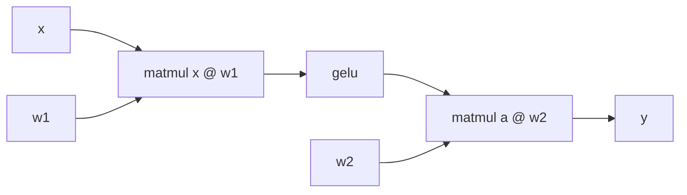

这个图里：

- 节点是 tensor 或算子。
- 边表示数据依赖。
- `gelu` 必须等第一个 `matmul` 结束后才能执行。
- 第二个 `matmul` 必须等 `gelu` 结束后才能执行。

这类图回答的是：**模型数学上怎么从输入算到输出**。

## 2. 动态图和静态图

PyTorch eager mode 更像动态图。Python 每执行到一行，就立刻调用一次对应算子：

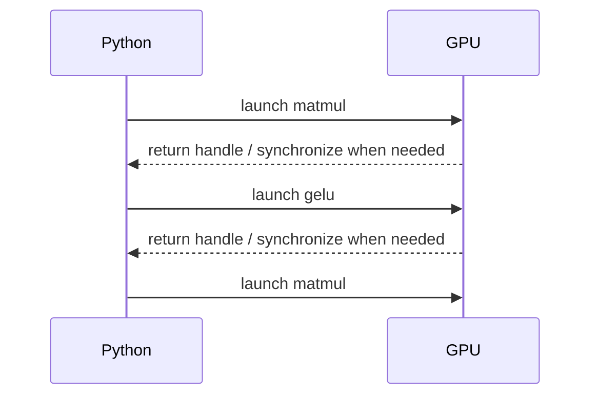

动态图的优点是灵活。你可以写 `if`、`for`、不同 shape、不同分支。缺点是每一步都要经过 Python 和框架调度。

静态图更像提前把计划写好：

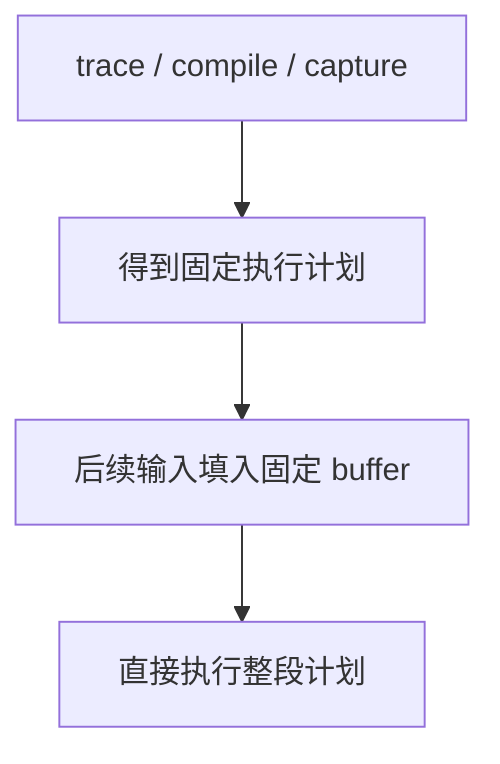

静态图的优点是调度开销低、优化空间大。缺点是喜欢固定 shape、固定控制流、稳定内存地址。

## 3. CUDA Graph 到底是什么

CUDA Graph 是 NVIDIA CUDA 提供的一种机制：把一段 GPU kernel launch 序列捕获下来，后续直接 replay。

普通 decode 每一轮可能像这样：

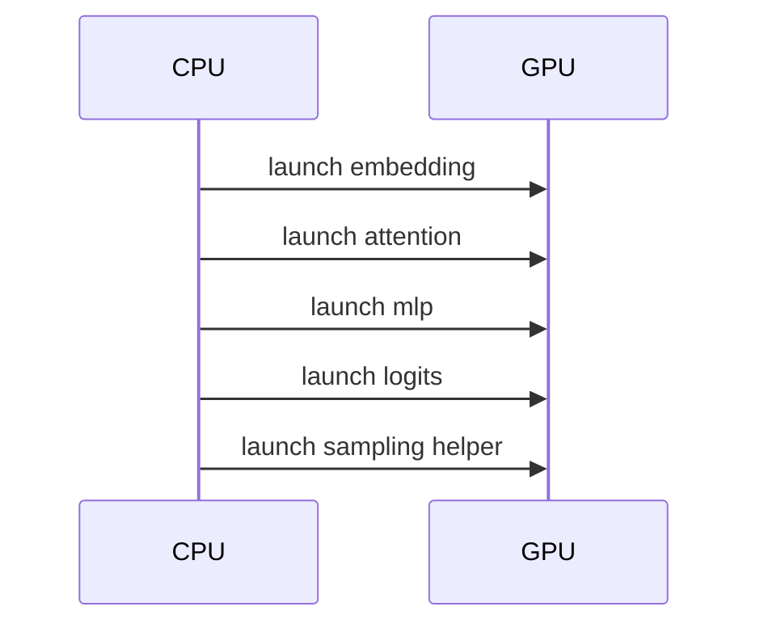

CUDA Graph capture 之后更像：

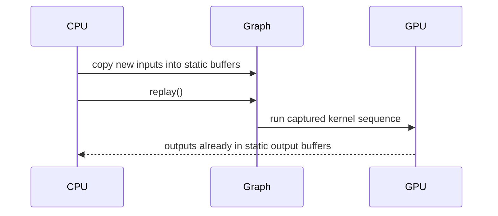

这里最重要的不是“数学变了”，而是**CPU 不再逐个 launch kernel**。它只需要把新输入拷到预分配 buffer，然后调用一次 replay。

## 4. 为什么 LLM decode 特别适合 Graph

LLM 有两个阶段：

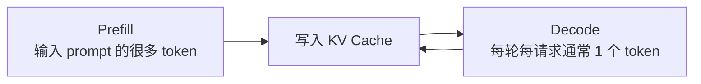

Prefill 的 token 数变化很大：有的 prompt 20 token，有的 8000 token。它的 shape 更动态。

Decode 则很规律：每轮每个请求通常只推进一个 token。只要 batch size 落入固定 bucket，执行路径就很像：

```text
decode batch bs=1
decode batch bs=2
decode batch bs=4
decode batch bs=8
decode batch bs=16
decode batch bs=32
```

所以 SGLang 会为若干 batch size 捕获 graph。真实 batch size 不一定刚好匹配，就 pad 到最近的 bucket。

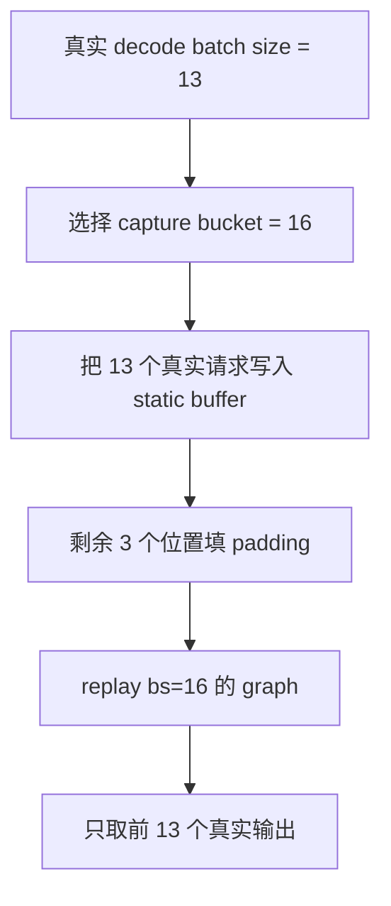

## 5. Graph 为什么要求固定 shape 和稳定地址

CUDA Graph 捕获的是“从这些地址读取这些形状的数据，按这些 kernel 顺序执行，把结果写回这些地址”。

因此 replay 时不能随意改变：

| 要求 | 原因 |
|---|---|
| shape 稳定 | kernel launch 参数、grid/block 配置、内存访问范围依赖 shape |
| tensor 地址稳定 | graph 记录的是已捕获 buffer 的地址，不是每次新 tensor 的地址 |
| 控制流稳定 | capture 时走过哪些 kernel，replay 就会重复哪些 kernel |
| 不随便分配内存 | capture/replay 期间动态 malloc 容易破坏图的可复用性 |
| 不做 CPU 同步分支 | replay 要尽量保持 GPU 侧固定执行 |

这也是为什么 SGLang 的 graph runner 会提前创建 input buffers，而不是每轮新建 tensor。

## 6. SGLang 里 Graph 的位置

SGLang 中 graph 主要服务模型执行层。简化链路如下：

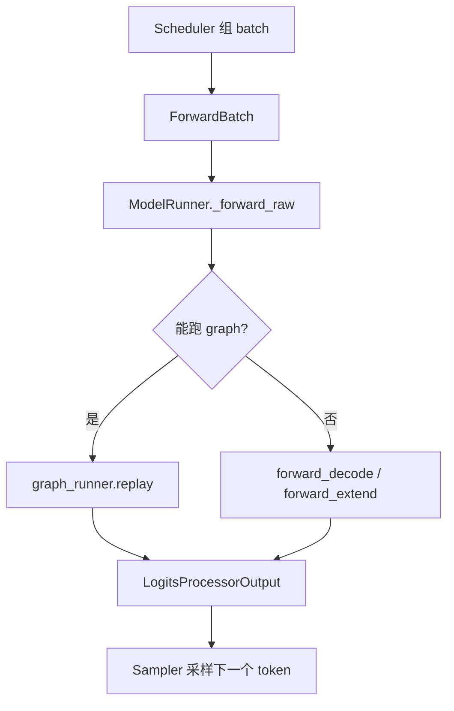

源码对应点：

| 代码位置 | 作用 |
|---|---|
| `python/sglang/srt/model_executor/model_runner.py` / `ModelRunner.init_device_graphs()` | 初始化 CUDA/CPU/NPU graph runner |
| `python/sglang/srt/model_executor/model_runner.py` / `ModelRunner._forward_raw()` | forward 时判断能不能 `graph_runner.replay()` |
| `python/sglang/srt/model_executor/cuda_graph_runner.py` / `CudaGraphRunner` | CUDA graph 的 buffer、capture、replay 主体 |
| `python/sglang/srt/model_executor/piecewise_cuda_graph_runner.py` / `PiecewiseCudaGraphRunner` | 更细粒度的 piecewise graph |
| `python/sglang/srt/model_executor/forward_batch_info.py` / `ForwardMode` | 区分 decode、extend、target verify 等 forward 模式 |

## 7. SGLang Graph 的初始化流程

`ModelRunner.initialize()` 过程中会做 warmup，然后初始化 graph。核心流程可以简化为：

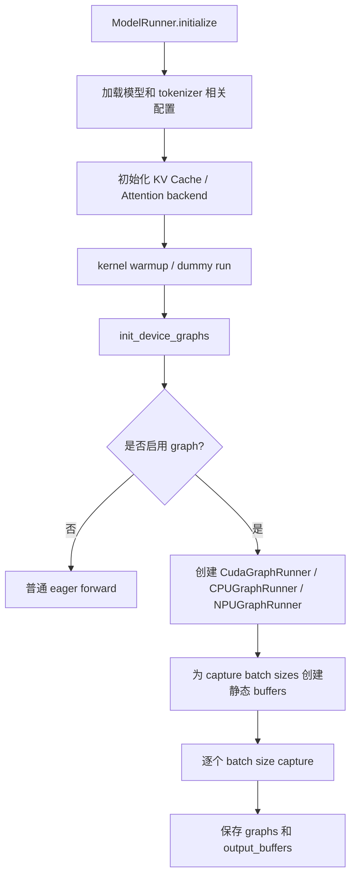

源码中 `init_device_graphs()` 会根据设备选择不同 runner：

```text
cuda / musa -> CudaGraphRunner
cpu         -> CPUGraphRunner
npu         -> NPUGraphRunner
```

名字里很多参数仍然叫 `cuda_graph`，但在 NPU 设备上可能实际映射为 NPU graph。

## 8. CudaGraphRunner 里面有什么

`CudaGraphRunner` 可以理解成四样东西：

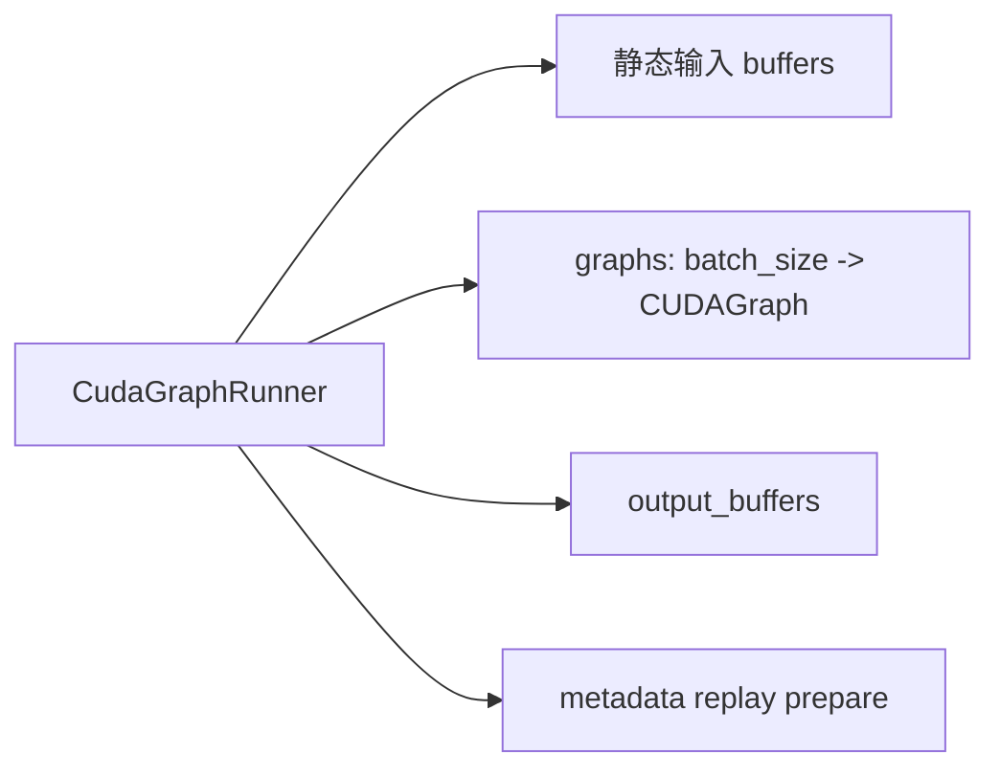

### 8.1 静态输入 buffers

Graph replay 不能每次换 tensor 地址，所以 SGLang 会提前准备固定 buffer，例如：

```text
input_ids
req_pool_indices
seq_lens
out_cache_loc
positions
mrope_positions
next_token_logits_buffer
pp_proxy_tensors
```

每次真实请求来了，不是把新 tensor 直接喂给 graph，而是把新数据 copy 到这些固定 buffer 的前一段。

### 8.2 graphs 字典

SGLang 会为不同 batch bucket 保存不同 graph：

```text
graphs[1]  -> bs=1 的 graph
graphs[2]  -> bs=2 的 graph
graphs[4]  -> bs=4 的 graph
graphs[8]  -> bs=8 的 graph
graphs[16] -> bs=16 的 graph
```

如果启用了更复杂的多流或 PD multiplexing，key 还可能包含 stream 信息。

### 8.3 output_buffers

Graph replay 后，输出会写入捕获时绑定好的 output buffer。SGLang 再把真实 batch 对应的前 `raw_num_token` 截出来返回。

## 9. Capture 发生了什么

捕获某个 batch size 时，SGLang 做的事可以简化成：

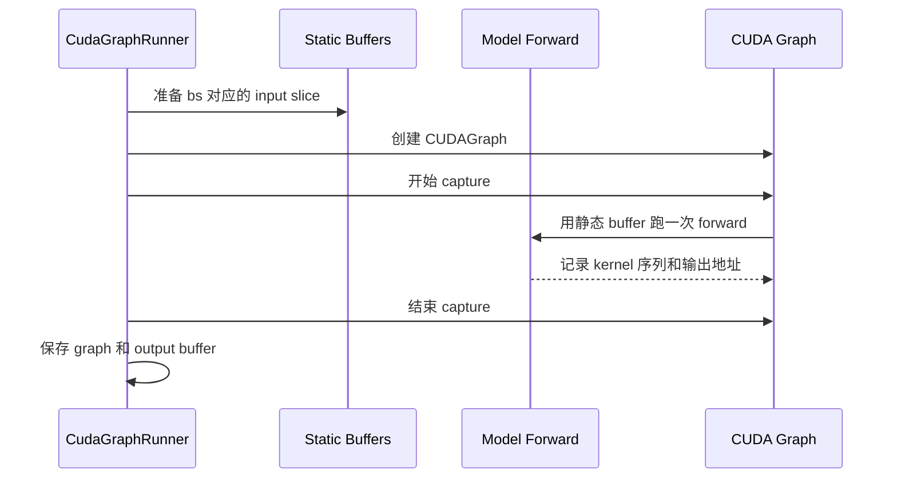

真实源码里，对应 `CudaGraphRunner.capture()` 和 `capture_one_batch_size()`：

```text
capture()
  -> 遍历 capture_bs
  -> patch_model(...)
  -> capture_one_batch_size(bs, forward)
  -> self.graphs[key] = graph
  -> self.output_buffers[key] = output_buffers
```

它通常会先捕获大 batch，再捕获小 batch，以便图之间复用内存池。

## 10. Replay 发生了什么

一次 decode replay 可以拆成三步：

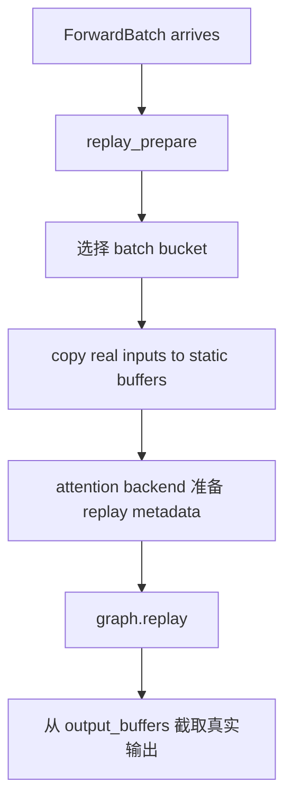

`replay_prepare()` 会做几件关键事：

1. 根据真实 batch size 找到 capture bucket。
2. 把 `ForwardBatch` 的 input ids、positions、seq_lens、cache locations 等拷到静态 buffers。
3. 调 attention backend 的 replay metadata 初始化。
4. 保存 `raw_bs`、`raw_num_token`、`bs`。

然后 `replay()` 选择对应 graph：

```text
graph_key = bs
self.graphs[graph_key].replay()
output = self.output_buffers[graph_key]
return output[:raw_num_token]
```

## 11. Attention backend 为什么也要配合 Graph

Decode attention 不只需要 `input_ids`，还需要知道每个请求：

```text
当前 seq_len 是多少
KV Cache 在哪些 slot/block
本轮新 token 要写到哪里
prefix cache 命中了多少
是否有 padding 请求
```

这些 metadata 每轮都变，但 graph 本身要求执行路径稳定。因此 SGLang 的做法是：

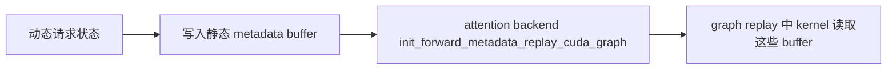

也就是说，graph 固定的是“如何读 metadata buffer 并执行 kernel”，不是固定每个请求的真实长度。

## 12. Piecewise CUDA Graph 是什么

普通 CUDA Graph 试图捕获一整段 decode forward。Piecewise CUDA Graph 更像“把模型中的一部分层或算子片段单独图化”。

为什么需要 piecewise？

1. Prefill/extend 比 decode 更动态，整图 capture 困难。
2. 某些模型层里有动态分支，整图不稳定。
3. Attention、MoE、MLP 的可图化程度不同。
4. 局部 graph 可以覆盖一部分热点路径，而不是要求整段 forward 都稳定。

可以这样理解：

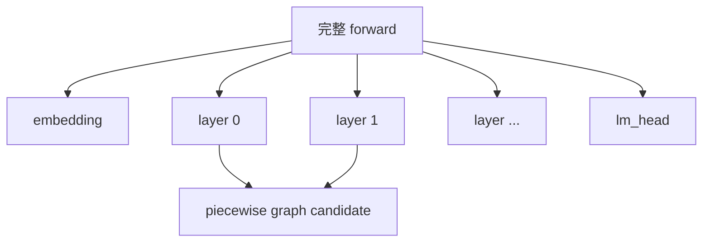

SGLang 中对应 `PiecewiseCudaGraphRunner`，初始化入口在 `ModelRunner.init_piecewise_cuda_graphs()`。

## 13. torch.compile、CUDA Graph、Piecewise Graph 的关系

这几个名字容易混：

| 名字 | 主要作用 | 更像哪一层优化 |
|---|---|---|
| PyTorch eager | 逐行执行 Python forward | 默认执行模式 |
| torch.compile | 编译 PyTorch 图，做融合和图级优化 | 框架编译层 |
| CUDA Graph | 捕获固定 kernel launch 序列，后续 replay | 设备执行层 |
| Piecewise CUDA Graph | 对 forward 的局部片段做 graph capture/replay | 局部执行优化 |
| NPU Graph / CPU Graph | 类似思想在不同设备后端上的实现 | 设备后端适配 |

在 SGLang 里，这些机制可以组合。`CudaGraphRunner` 的文件头也直接写着它用于 “cuda graph and torch.compile”。

## 14. 常见疑问

### Graph 会让模型输出不同吗？

理论上不应该。Graph 改的是执行方式，不是模型权重和数学公式。但如果 graph capture 期间有不稳定的随机数、未初始化 buffer、动态分支或不支持 capture 的算子，就可能出现错误。

### 为什么 graph capture 要 warmup？

很多 kernel 第一次运行会 autotune、初始化 workspace 或触发 lazy allocation。capture 前 warmup 可以让这些一次性开销先发生，避免捕获到不稳定路径。

### 为什么 graph 会额外占显存？

Graph 需要保存静态 input buffer、output buffer、workspace 和 graph memory pool。SGLang 日志里通常会打印 capture 前后可用显存变化。

### 为什么 batch size 太小反而更需要 graph？

batch 小时，GPU 计算时间短，CPU launch overhead 占比更高。Graph 可以把多次 launch 合并成一次 replay 调用。

### 为什么 batch size 很动态时 graph 仍然可用？

因为系统用 bucket 和 padding。真实 batch size 13 可以走 bs=16 的 graph，只返回真实 13 个输出。

## 15. 读 SGLang Graph 源码的顺序

建议按这个顺序读：

1. `python/sglang/srt/model_executor/forward_batch_info.py`：先看 `ForwardMode`，理解 decode、extend、target verify 的区别。
2. `python/sglang/srt/model_executor/model_runner.py`：看 `init_device_graphs()` 如何创建 graph runner。
3. `python/sglang/srt/model_executor/cuda_graph_runner.py`：看 `CudaGraphRunner.__init__()` 如何创建静态 buffers 和 capture batch sizes。
4. `cuda_graph_runner.py`：看 `capture()` 和 `capture_one_batch_size()` 如何捕获 graph。
5. `cuda_graph_runner.py`：看 `replay_prepare()` 和 `replay()` 如何把动态 `ForwardBatch` 填进静态 buffers。
6. `model_runner.py`：看 `_forward_raw()` 里 `can_run_graph` 的判断和 fallback 到普通 forward 的路径。
7. `python/sglang/srt/model_executor/piecewise_cuda_graph_runner.py`：再看 piecewise graph 如何覆盖更局部的 forward 片段。

## 16. 一张总图

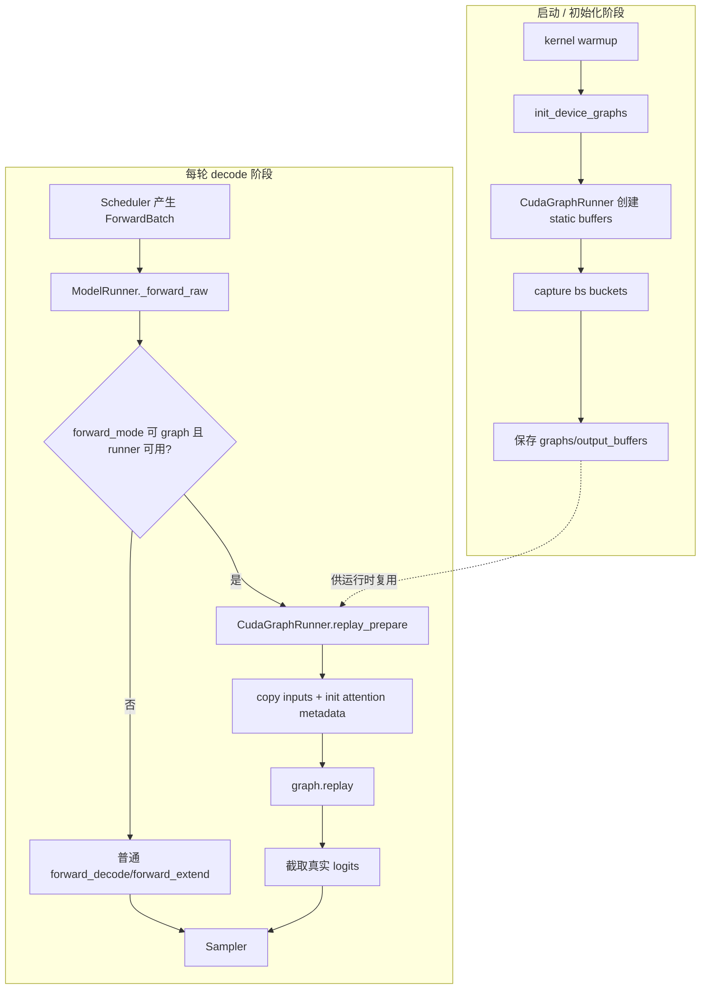

## 17. 阅读任务

1. 用自己的话区分“模型计算图”和“CUDA Graph”。
2. 解释为什么 graph replay 需要静态 buffer。
3. 说明 SGLang 为什么要捕获多个 batch size。
4. 找到 `_forward_raw()` 中 graph replay 的分支，画出它 fallback 到普通 forward 的路径。
5. 思考：LoRA、speculative decoding、grammar constrained decoding 分别会给 graph 带来哪些动态性。
