**中文** | [English](./02-graph-execution-dataflow_EN.md)

# Graph 执行原理：调度、数据与流转

上一讲解释了 Graph 是什么。这一讲更具体：在 SGLang 的 decode graph replay 中，**哪些数据会进入 graph，谁决定是否走 graph，graph 内部如何被调度，数据又如何从请求队列一路流到 KV Cache、logits 和 sampler**。

先给结论：

> SGLang 的 CUDA Graph 不是把整个在线服务都图化，而是把“某个固定 batch bucket 的模型 forward 路径”图化。每轮 decode 前，动态请求数据会被拷贝到一组静态 input buffers；graph replay 读取这些固定地址，执行 embedding、attention、MLP、logits 等 GPU kernel，并把输出写回固定 output buffers。

## 1. Graph 里到底包含什么

SGLang 中最常见的 graph 路径是 decode graph。它大致覆盖：

```text
input_ids / input_embeds
  -> embedding 或输入 embedding 处理
  -> 多层 Transformer block
       -> attention
          -> 读取/写入 KV Cache
       -> MLP
       -> norm / residual
  -> logits processor / lm_head
  -> next_token_logits_buffer
```

它通常不覆盖：

```text
HTTP 收发
tokenizer / detokenizer
Scheduler 排队决策
请求对象状态机
采样策略中的复杂 CPU 逻辑
真实 batch 到 static buffer 的 copy
```

可以这样分层：

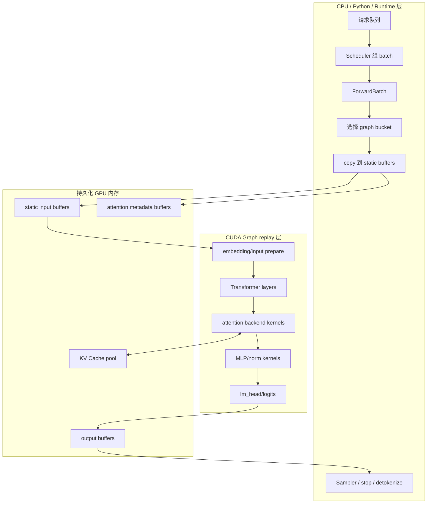

## 2. 四类会进入 Graph 的数据

Graph replay 读取的是固定地址上的 tensor。动态请求每轮都变，但会先被写进 `CudaGraphRunner.buffers`。

源码入口：

```text
python/sglang/srt/model_executor/cuda_graph_runner.py
  DecodeInputBuffers
  DecodeInputBuffers.create()
  DecodeInputBuffers.populate_from_forward_batch()
```

### 2.1 核心 token 和 batch 数据

| 数据 | 形状直觉 | 作用 |
|---|---|---|
| `input_ids` | `[max_num_token]` | 本轮 decode 输入 token，普通 decode 通常每个请求 1 个 |
| `input_embeds` | `[max_num_token, hidden_size]` | 某些路径直接传 embedding，而不是 token id |
| `req_pool_indices` | `[max_bs]` | 每个 batch row 对应 request pool 中哪一行 |
| `seq_lens` | `[max_bs]` | 每个请求当前上下文长度 |
| `seq_lens_cpu` | `[max_bs]` CPU mirror | 某些 metadata 需要 CPU 侧长度 |
| `positions` | `[max_num_token]` | 当前 token 的 position id |
| `mrope_positions` | `[3, max_num_token]` | 多模态/rope 变体使用的位置编码 |

这些数据决定了“本轮 graph replay 在给哪些请求算下一个 token”。

### 2.2 KV Cache 定位数据

| 数据 | 形状直觉 | 作用 |
|---|---|---|
| `out_cache_loc` | `[max_num_token]` | 本轮新 K/V 应写入 token_to_kv_pool 的哪个位置 |
| `req_pool_indices` | `[max_bs]` | 配合 req_to_token_pool 找历史 token 的 KV 位置 |
| `seq_lens` | `[max_bs]` | attention kernel 知道每个请求要看多长历史 |

直觉上：

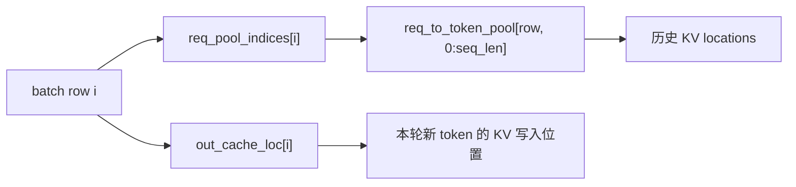

decode attention 要做两件事：

1. 读取历史 KV：根据 request row 和 seq_len 找到旧 K/V。
2. 写入新 KV：根据 `out_cache_loc` 把当前 token 的 K/V 写入 KV pool。

### 2.3 Attention metadata

Attention backend 还需要额外 metadata，例如：

```text
cache_seqlens
kv_indptr
kv_indices
qo_indptr
num_kv_splits
custom_mask
encoder_lens
```

不同 attention backend 名字和结构不同，但目标一致：把动态请求长度、KV block 布局、mask、split 策略转成 kernel 能直接读取的 GPU metadata。

SGLang 中对应接口：

```text
attn_backend.init_cuda_graph_state(max_bs, max_num_token)
attn_backend.init_forward_metadata_capture_cuda_graph(...)
attn_backend.init_forward_metadata_replay_cuda_graph(...)
```

### 2.4 可选扩展数据

某些功能会带额外输入：

| 功能 | 可能涉及的数据 |
|---|---|
| Pipeline parallel | `pp_proxy_tensors`，例如跨 stage 的 hidden states |
| Speculative decoding | `spec_info`、custom mask、draft token metadata |
| LoRA | LoRA batch metadata、adapter id 映射、dense LoRA buffers |
| Mamba / hybrid model | `mamba_track_indices`、`mamba_track_mask` |
| N-gram speculative | `ngram_embedding_info` 和 token table |
| Encoder-decoder | `encoder_lens`、encoder KV cache loc |

这些数据不一定每个模型都有，但一旦存在，也必须被整理成 graph replay 能接受的静态 buffer 或可重放 metadata。

## 3. ForwardBatch 是动态世界和 Graph 世界的边界

`ForwardBatch` 是从调度器到模型执行层的一次 forward 快照。

源码位置：

```text
python/sglang/srt/model_executor/forward_batch_info.py
  ForwardBatch
```

它来自动态 serving 世界：

```text
本轮有哪些请求
每个请求当前长度是多少
每个请求新 token 写到哪里
是否需要 logprob
是否有 speculative info
是否有 LoRA / multimodal / encoder-decoder metadata
```

Graph 世界不喜欢动态对象，所以 `CudaGraphRunner.replay_prepare()` 会把 `ForwardBatch` 转成静态 buffer 内容：

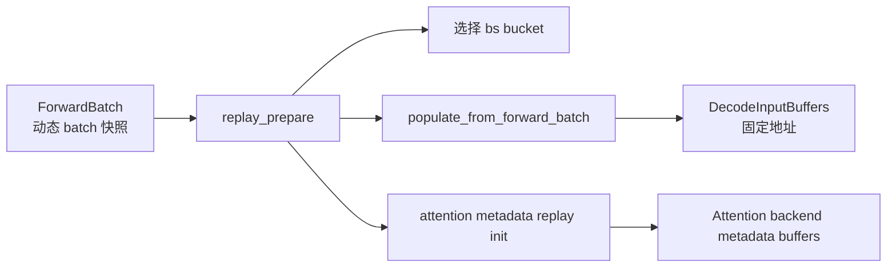

## 4. 是否走 Graph：调度决策链

不是每个 forward 都能走 graph。SGLang 的判断大致是两级。

第一级在 `ModelRunner._forward_raw()`：

```text
forward_batch.forward_mode.is_cuda_graph()
self.graph_runner 存在
self.graph_runner.can_run(forward_batch)
```

第二级在 `CudaGraphRunner.can_run()`：

```text
batch size 是否被支持
是否需要 padding，padding 是否允许
encoder_lens 是否支持
hidden states capture mode 是否匹配
two-batch-overlap 是否支持
ngram/speculative 特定 shape 是否匹配
是否有 replace_embeds 这类动态输入
```

可以画成：

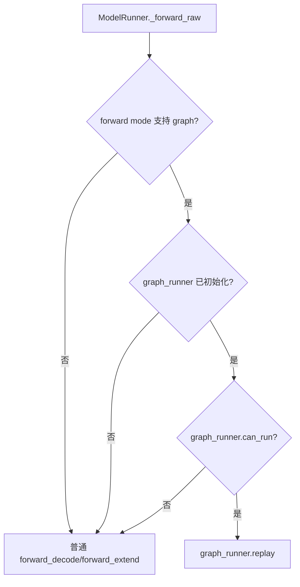

这说明 graph 是一个优化路径，不是唯一执行路径。只要条件不满足，就会 fallback 到普通 forward。

## 5. Batch bucket 和 padding 怎么影响数据

假设真实 batch size 是 3，但捕获的 graph bucket 是 4。

```text
raw_bs = 3
bs = 4
raw_num_token = 3
max_num_token = 4
```

静态 buffer 会这样填：

```text
input_ids:        [tokA, tokB, tokC, pad]
req_pool_indices: [reqA, reqB, reqC, 0]
seq_lens:         [lenA, lenB, lenC, seq_len_fill_value]
out_cache_loc:    [locA, locB, locC, 0]
positions:        [posA, posB, posC, pad]
```

其中 padding 行不是一个真实请求。它的目标是让 graph 看到固定 shape。

数据图：

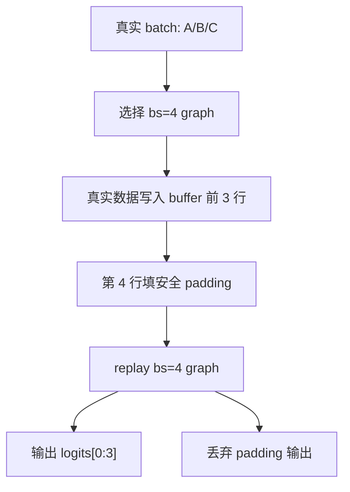

`populate_from_forward_batch()` 中如果 `bs != raw_bs`，会先填充或清零 padding 相关位置，避免 dummy attention 读到上一次 replay 留下的脏数据。

## 6. Replay 前的数据搬运

Replay 前最关键的是把动态 `ForwardBatch` 拷到静态 `DecodeInputBuffers`。

源码中的主要拷贝关系：

```text
forward_batch.input_ids        -> buffers.input_ids[:raw_num_token]
forward_batch.req_pool_indices -> buffers.req_pool_indices[:raw_bs]
forward_batch.seq_lens         -> buffers.seq_lens[:raw_bs]
forward_batch.out_cache_loc    -> buffers.out_cache_loc[:raw_num_token]
forward_batch.positions        -> buffers.positions[:raw_num_token]
forward_batch.mrope_positions  -> buffers.mrope_positions[:, :raw_num_token]
forward_batch.seq_lens_cpu     -> buffers.seq_lens_cpu[:raw_bs]
```

SGLang 会把 GPU tensor copy 分组后批量执行，减少 copy 调用开销：

```text
_grouped_foreach_copy_(dsts, srcs)
```

这一步仍然在 graph replay 之前，不属于 captured graph 本身。它是把动态世界“投影”到静态 graph 输入空间。

## 7. Replay 中的数据流转

进入 `self.graphs[graph_key].replay()` 后，GPU 会按 capture 时记录的 kernel 序列执行。简化数据流如下：

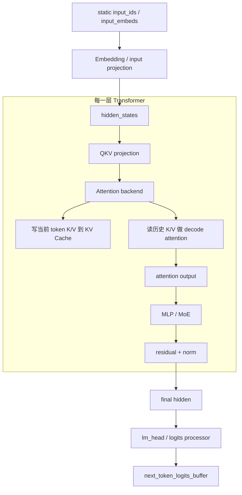

KV Cache 相关流转更细一点：

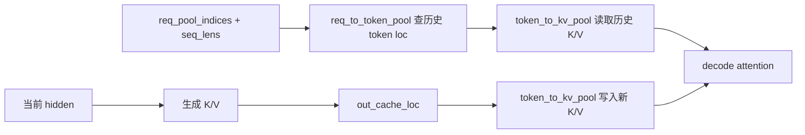

注意：KV Cache pool 本身不是每次 copy 进 graph 的小数据。它是长期存在的大块显存。Graph replay 只是通过固定的 metadata 和 cache location 去读写它。

## 8. Attention metadata 如何参与调度

CUDA Graph 只负责 replay 已捕获的 kernel 序列，但 attention kernel 内部仍然需要知道本轮每个请求的真实长度和 KV 位置。

所以 replay 前会调用：

```text
attn_backend.init_forward_metadata_replay_cuda_graph(...)
```

它的输入包括：

```text
bs
req_pool_indices[:bs]
seq_lens[:bs]
seq_lens_sum
encoder_lens
capture_forward_mode
spec_info
seq_lens_cpu
```

它的输出不是业务 token，而是 attention kernel 调度需要的 metadata，例如：

```text
每个请求的 KV 长度
KV block/pool 索引
每个 token 分配多少 KV split
indptr / indices
mask 或 custom mask
```

可以理解成 attention backend 在 replay 前做了一次“kernel 调度表准备”：

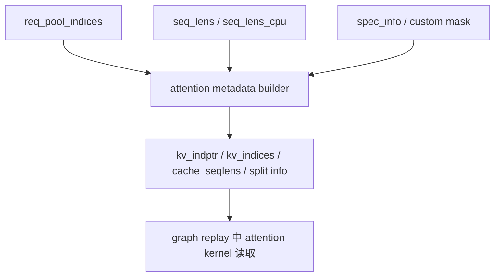

不同 backend 的调度表不同：

- FlashInfer backend 可能准备 paged KV metadata。
- Triton backend 可能准备 `kv_indptr`、split 数、mask。
- FlashMLA / MLA backend 会准备 MLA 特有的 metadata。
- NPU backend 会准备 Ascend attention kernel 需要的 metadata。

统一点是：**Graph 捕获固定执行路径，attention metadata 告诉这个路径本轮具体读哪段 KV、算哪些请求。**

## 9. Replay 后的数据回流

Replay 完成后，输出已经写在 `output_buffers[graph_key]` 里。

`CudaGraphRunner.replay()` 会按真实 token 数截取：

```text
next_token_logits = output.next_token_logits[:raw_num_token]
hidden_states     = output.hidden_states[:raw_num_token]
```

然后返回 `LogitsProcessorOutput` 给 `ModelRunner`，再进入 sampler。

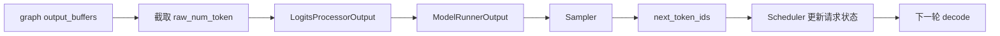

Sampling 之后，请求状态会更新：

```text
生成 token 追加到请求输出
seq_len 增加
KV Cache 中新 token 已经可被下一轮读取
结束条件检查
未完成请求进入下一轮 running batch
```

## 10. Graph 中的“调度”到底是谁做的

这里容易混淆。Graph 中有三种调度：

| 层级 | 谁负责 | 调度什么 |
|---|---|---|
| 请求调度 | Scheduler | 哪些请求进入本轮 batch，prefill 还是 decode |
| Graph 路径调度 | ModelRunner / CudaGraphRunner | 本轮是否走 graph，选择哪个 batch bucket |
| Kernel 内部调度 | CUDA runtime / attention backend / kernel | kernel launch 序列、block/grid、KV split、thread block 如何处理 token |

它们不是同一个东西。

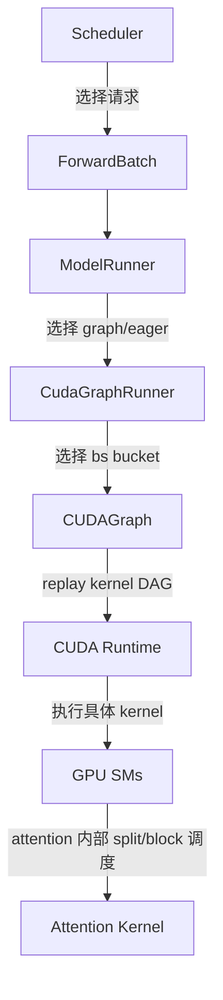

SGLang 自己主要控制前两层，以及给 attention kernel 准备 metadata。CUDA runtime 和具体 kernel 负责更底层的 GPU 执行调度。

## 11. 一次 decode replay 的完整时序

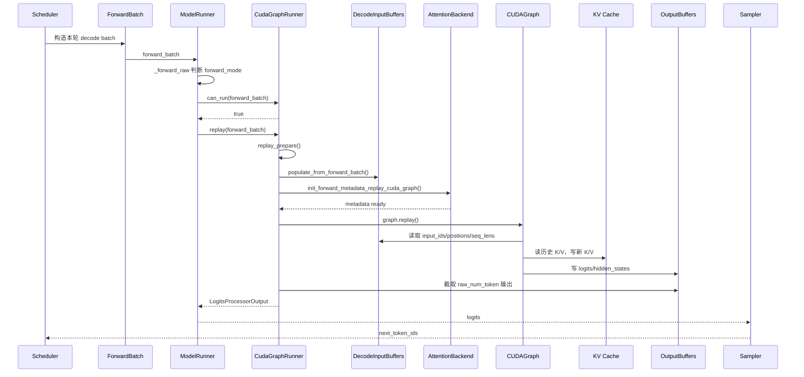

## 12. 用一个三请求 batch 看数据变化

假设本轮有 3 个请求：

```text
request A: seq_len=10, next input token=101, new KV loc=9001
request B: seq_len=25, next input token=202, new KV loc=9002
request C: seq_len=7,  next input token=303, new KV loc=9003
```

捕获 bucket 是 4，则 replay 前 buffer：

| buffer | 内容 |
|---|---|
| `input_ids[:4]` | `[101, 202, 303, 0]` |
| `seq_lens[:4]` | `[10, 25, 7, fill]` |
| `positions[:4]` | `[9, 24, 6, 0]` |
| `out_cache_loc[:4]` | `[9001, 9002, 9003, 0]` |
| `req_pool_indices[:4]` | `[rowA, rowB, rowC, 0]` |

Replay 中：

```text
rowA + seq_len=10 -> 查 A 的 10 个历史 token loc -> 读 A 的历史 KV
rowB + seq_len=25 -> 查 B 的 25 个历史 token loc -> 读 B 的历史 KV
rowC + seq_len=7  -> 查 C 的 7 个历史 token loc -> 读 C 的历史 KV

out_cache_loc=9001/9002/9003 -> 写入本轮新 token 的 K/V
```

Replay 后：

```text
output logits shape 按 bucket 可能是 [4, vocab]
真实输出只取 [0:3, :]
padding 第 4 行丢弃
```

## 13. Capture 时的数据和 Replay 时的数据有什么不同

Capture 时数据通常是假数据或 warmup 数据。它的目的不是得到真实 token，而是让 CUDA 记录 kernel 序列和 buffer 地址。

Replay 时数据是真实请求数据。它会被 copy 到 capture 时同一批 buffer 地址里。

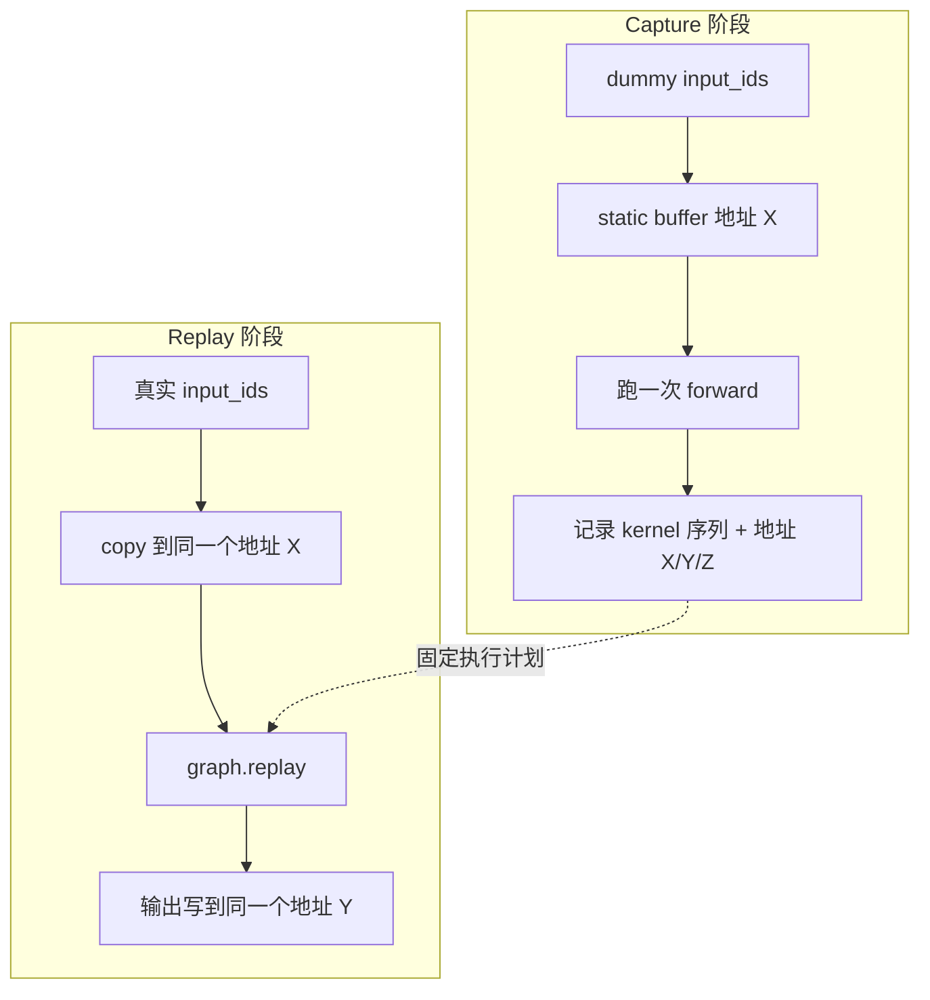

所以 graph replay 的关键不是 capture 时的具体 token 值，而是 capture 时固定下来的执行路径和内存地址。

## 14. 为什么有些数据不能轻易进 Graph

数据能否进入 graph，取决于它是否能被稳定表达成 tensor buffer 和固定执行路径。

不容易 graph 化的数据：

| 数据/逻辑 | 难点 |
|---|---|
| 每请求不同的复杂采样参数 | 可能有 CPU 分支和动态控制流 |
| 动态替换 embedding | `replace_embeds` 会让输入路径变动态，`can_run()` 直接拒绝 |
| 可变长度 prefill | token 数变化太大，graph bucket 成本高 |
| 动态 LoRA adapter 组合 | adapter id、rank、batch 内分组会影响 kernel 路径 |
| grammar 约束生成 | mask 和状态机可能每请求不同 |
| speculative decoding | 一次 verify 多 token，accepted length 动态 |

这也是为什么 SGLang 把 graph 设计成“能走就走，不能走就 fallback”的优化路径。

## 15. 源码阅读定位表

| 问题 | 读哪里 |
|---|---|
| ForwardBatch 里有哪些动态数据 | `python/sglang/srt/model_executor/forward_batch_info.py` / `ForwardBatch` |
| Graph 静态 buffer 有哪些 | `python/sglang/srt/model_executor/cuda_graph_runner.py` / `DecodeInputBuffers` |
| 动态数据如何 copy 到静态 buffer | `DecodeInputBuffers.populate_from_forward_batch()` |
| 是否可以走 graph | `CudaGraphRunner.can_run()` 和 `ModelRunner._forward_raw()` |
| Graph 如何 capture | `CudaGraphRunner.capture()`、`capture_one_batch_size()` |
| Graph 如何 replay | `CudaGraphRunner.replay_prepare()`、`replay()` |
| Attention metadata 如何准备 | 各 attention backend 的 `init_forward_metadata_replay_cuda_graph()` |
| Piecewise graph 怎么做 | `python/sglang/srt/model_executor/piecewise_cuda_graph_runner.py` |

## 16. 你应该形成的心智模型

把 SGLang 的 graph replay 想成一个固定舞台：

```text
舞台布景固定：static buffers、KV pool、output buffers 的地址固定
演员每轮不同：不同请求、不同 token、不同 seq_len
入场前换道具：ForwardBatch 数据 copy 到 static buffers
剧本固定执行：CUDAGraph replay 固定 kernel 序列
演员结果带走：只截取真实 batch 的 logits，padding 丢弃
```

真正的关键是：**动态请求不直接改变 graph 的形状，而是改变 graph 固定输入 buffer 里的内容和 attention metadata。**

## 17. 阅读任务

1. 找到 `DecodeInputBuffers.populate_from_forward_batch()`，列出它从 `ForwardBatch` copy 了哪些字段。
2. 用 `raw_bs=5`、`bs=8` 举例说明 padding 行会如何填充。
3. 画出 `req_pool_indices`、`seq_lens`、`out_cache_loc` 和 KV Cache pool 的关系。
4. 找一个 attention backend 的 `init_forward_metadata_replay_cuda_graph()`，说明它准备了哪些 metadata。
5. 解释为什么 graph replay 后只返回 `raw_num_token` 对应的 logits。
