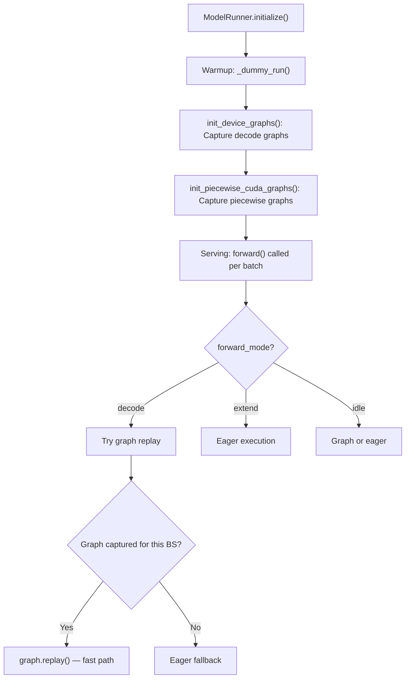
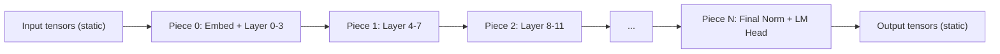

[中文](./02-graph-execution-dataflow.md) | [English](./02-graph-execution-dataflow_EN.md)

# Graph Execution Dataflow

## 1. Graph Lifecycle in SGLang



## 2. Static Shape Replay

Graph replay requires fixed input shapes. SGLang handles this by:

1. **Shape padding**: Pad batch to the nearest captured batch size
2. **Static buffer allocation**: Input/output tensors pre-allocated at fixed addresses
3. **Shape registry**: `concrete_entries` table maps `(bs, seq_len, ...)` to captured graphs

```python
# Simplified: selecting graph for batch
def get_graph(batch_size, seq_len):
    key = (batch_size, seq_len)
    if key in captured_graphs:
        return captured_graphs[key].replay
    else:
        return eager_forward  # fallback
```

## 3. Overlap Mode with Graphs

In overlap scheduling, the Scheduler can launch the next batch's forward while processing the previous batch's results. Graphs enable this because:

1. **Graph replay is non-blocking on CPU**: After `graph.replay()`, CPU is free
2. **Stream synchronization**: `schedule_stream` and `forward_stream` coordinate via CUDA events
3. **Future map**: Stores output references that are resolved after the forward completes

## 4. NPU Graph Capture Flow

For Ascend NPU:

```python
# From npu_piecewise_backend.py
def capture_npu_graph(model, dummy_input, pool):
    g = torch.npu.NPUGraph()
    with torch.npu.graph(g, pool=pool):
        output = model(dummy_input)
    return g

# Replay
g.replay()
```

NPU-specific considerations:
- `torch.npu.graph()` context manager
- Memory pool passed explicitly
- `NPUGraph` object manages the captured graph lifecycle
- Format casts (e.g., FRACTAL_NZ for ACL) may be embedded in the graph

## 5. Piecewise Graph Dataflow



Between pieces, intermediate tensors can use dynamic shapes if needed. Only within each piece must shapes be static.

## 6. When Graph Replay Fails

Common failure modes:
1. **Shape mismatch**: Batch size or sequence length doesn't match any captured graph
2. **Pointer instability**: GPU memory reallocation changes tensor addresses
3. **Dynamic control flow**: If/else branches inside the model that weren't captured
4. **New operations**: Operations added after capture (e.g., new LoRA adapters)

When replay fails, SGLang falls back to eager execution. This is correct but slower.
