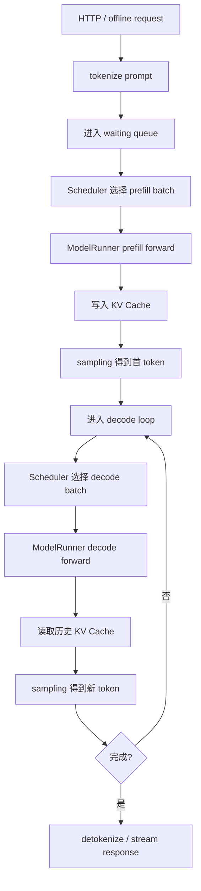

# Inference Basics

这一章回答一个最基础的问题：LLM 推理到底在做什么，为什么 serving 系统不能只是把请求放进一个 `for` 循环里逐个跑。

## 核心概念

| 概念 | 一句话解释 | 关键瓶颈 |
|---|---|---|
| Prefill | 一次性处理 prompt 中已有的 token，构建首轮 KV Cache | 计算量大，attention 近似看完整 prompt |
| Decode | 每轮只输入新生成的一个 token，复用历史 KV Cache | 读 KV Cache 多，常被 memory bandwidth 限制 |
| KV Cache | 保存每层 attention 的历史 K/V，避免 decode 重算整个上下文 | 显存占用随 batch、层数、上下文长度增长 |
| Sampling | 从 logits 选择下一个 token，例如 greedy、top-p、temperature | CPU/GPU 同步、约束生成、batch 内差异 |
| TTFT | Time To First Token，从请求进入系统到第一个 token 返回 | prefill、排队、调度和模型启动开销 |
| ITL | Inter-token Latency，相邻输出 token 的时间间隔 | decode step、KV 读取、batch 组织 |

## 推理主流程



## Prefill 和 Decode 为什么不同

Prefill 输入长度通常是 `prompt_len`，一次 forward 会处理完整 prompt。它更像大矩阵计算，GPU 算力利用率相对容易做高，但长 prompt 会显著拉高 TTFT。

Decode 每次通常只输入一个 token。单个请求的计算量变小，但每层都要读历史 K/V。上下文越长、batch 越大，KV Cache 读写越重。很多 serving 优化，本质上都在试图让 decode 阶段的 GPU 利用率更稳定。

## 形状记忆

常见张量形状：

```text
input_ids: [batch, seq_len]
hidden_states: [batch, seq_len, hidden_size]
q/k/v: [batch, num_heads, seq_len, head_dim]
kv_cache per layer:
    key:   [num_tokens_or_blocks, kv_heads, head_dim]
    value: [num_tokens_or_blocks, kv_heads, head_dim]
logits: [batch, seq_len, vocab_size]
```

在 decode 阶段，`seq_len` 往往是 1，但 attention 需要看的历史长度是 `past_len + 1`。这也是“输入很短但不一定很快”的根本原因。

## Serving 里不能逐个请求处理的原因

1. 单请求 decode 太小，GPU 容易吃不满。
2. 请求长度差异大，静态 batch 会被最长请求拖住。
3. 线上请求不断进入，系统需要动态接纳新请求。
4. KV Cache 显存有限，必须边调度边管理内存。
5. 用户关心流式首 token 和每 token 延迟，不只是总吞吐。

因此现代 LLM serving 通常采用 continuous batching：每一步都重新决定哪些请求参与本轮 forward。

## 和 SGLang 的连接点

- 请求进入 runtime 后，会被转换成内部 request 对象并进入调度队列。
- Scheduler 会区分 prefill、decode、extend、idle 等 forward mode。
- ModelRunner 根据 forward mode 构造 `ForwardBatch` 并调用模型。
- KV cache manager 负责给 token 分配 cache slot，并在请求结束后回收。
- Sampler 负责从 logits 中选择 token，并处理 stop、grammar、logprob 等附加逻辑。

## 阅读任务

1. 用自己的话解释 TTFT 和 ITL 分别受哪些阶段影响。
2. 画出一个请求从 prefill 到 decode 再到结束的状态变化。
3. 估算一个 32 层、hidden size 4096、32 heads、batch 16、context 4096 的 KV Cache 量级。
4. 对比 prefill-heavy workload 和 decode-heavy workload，说明它们分别该优先优化什么。
