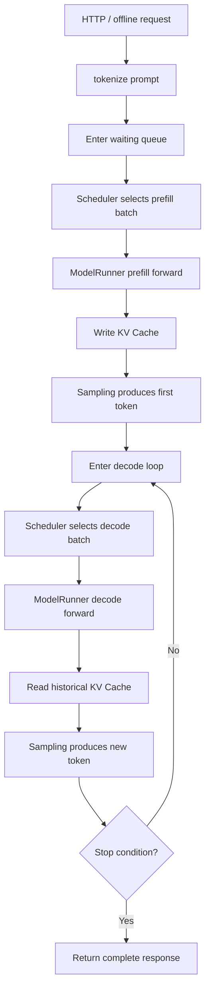

[中文](./README.md) | [English](./README_EN.md)

# Inference Basics

This chapter answers the most fundamental question: what does LLM inference actually do, and why can't a serving system simply put requests into a `for` loop and run them one by one.

## Core Concepts

| Concept | One-Line Explanation | Key Bottleneck |
|---|---|---|
| Prefill | Process all prompt tokens at once, building the initial KV Cache | High computation, attention sees the full prompt |
| Decode | Each step inputs only one newly generated token, reusing historical KV Cache | Heavy KV Cache reads, often memory-bandwidth bound |
| KV Cache | Stores historical K/V for each attention layer, avoiding recomputing the full context during decode | Memory grows with batch, layers, and context length |
| Sampling | Selects the next token from logits, e.g., greedy, top-p, temperature | CPU/GPU sync, constrained generation, intra-batch variance |
| TTFT | Time To First Token — from request entry to first token return | Prefill, queuing, scheduling, and model startup overhead |
| ITL | Inter-token Latency — time between adjacent output tokens | Decode step, KV reads, batch organization |

## Inference Main Flow

