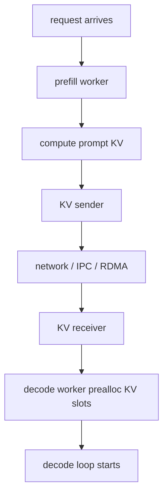

# KV Transfer

这一章解释 KV Cache 如何在不同 worker 或不同节点之间移动。KV Transfer 常见于 Prefill/Decode Disaggregation，也就是把长 prompt 的 prefill 和持续 decode 放到不同资源池中执行。

## 为什么要传 KV

Prefill 和 Decode 的资源画像不同：

```text
Prefill:
    长 prompt
    大矩阵计算
    更偏 compute-bound

Decode:
    每步一个 token
    频繁读取历史 KV
    更偏 memory bandwidth / latency-bound
```

如果所有请求都在同一组 GPU 上完成，长 prompt prefill 可能阻塞 decode，导致正在流式输出的用户 ITL 变差。PD 分离让 prefill worker 专心处理 prompt，让 decode worker 专心稳定产出 token。

## 基本流程



关键点是：decode worker 在开始 decode 前，必须拿到 prompt 对应的 KV Cache，或者至少拿到足够的 KV block 元信息与数据。

## Prealloc 为什么重要

KV 接收端不能等数据到了才临时找显存，否则容易阻塞和碎片化。更常见的做法是：

1. Decode worker 先为请求预留 KV slots。
2. Prefill worker 按约定格式发送 K/V。
3. Receiver 把收到的数据写到预留位置。
4. Scheduler 确认 KV ready 后再把请求放入 decode queue。

这也是为什么 KV Transfer 和 KV Cache manager 必须配合。

## 传输内容

传的不只是 K/V tensor，通常还需要元信息：

```text
request id
token positions
layer id
kv dtype
source block ids
target cache locations
prefix length
checksum / completion marker
```

没有这些元信息，接收端无法把 KV 正确放回 attention backend 能读取的位置。

## 主要瓶颈

1. 网络带宽：长 prompt 的 KV 数据量很大。
2. 网络延迟：首 token 必须等 KV transfer 完成。
3. 显存复制：GPU 到 GPU、GPU 到 host、host 到 GPU 路径差异很大。
4. 一致性：请求取消、超时、失败时，预分配 KV 必须回收。
5. 调度配合：prefill 和 decode 两边的队列要避免互相等待。

## 和 SGLang 的连接点

- PD disaggregation 源码阅读时要关注 bootstrap、prealloc、transfer queue。
- KV sender/receiver 负责跨 worker 传输 KV 数据。
- Transfer backend 可以对应不同通信实现。
- Scheduler 需要知道请求处于 prefill running、KV transferring、decode ready 的哪个阶段。
- KV cache manager 需要支持远端写入后的 block table 更新。

## 阅读任务

1. 解释为什么 PD 分离不能只传最后一个 hidden state。
2. 估算一个 8k prompt 的 KV transfer 数据量。
3. 画出请求取消发生在 KV transfer 中途时，需要清理哪些状态。
4. 比较同机 GPU 间传输和跨节点传输的瓶颈差异。
