**中文** | [English](./01-mamba-and-sglang-state_EN.md)

# Mamba 是什么：从 State Space Model 到 SGLang Mamba State

你在 SGLang 里看到的 `mamba state`、`mamba_scheduler_strategy`、`mamba_pool_idx`，不是另一套 KV Cache 的别名。它来自一种和 Transformer attention 不同的序列建模路线：**State Space Model，简称 SSM**。

一句话先记住：

> Transformer attention 用“保存所有历史 token 的 KV”来记住上下文；Mamba 用“不断更新一个递归状态 state”来压缩历史上下文。

这导致 SGLang 在服务 Mamba 或 hybrid Mamba 模型时，除了普通 KV Cache，还要管理 Mamba 自己的状态池、调度策略和 prefix cache 状态。

## 1. 为什么会有 Mamba

Transformer attention 的核心是让当前 token 直接看历史 token：

```text
当前 Q 与所有历史 K 做相似度
再加权汇总所有历史 V
```

这很强，但长上下文 decode 时需要不断读取历史 KV：

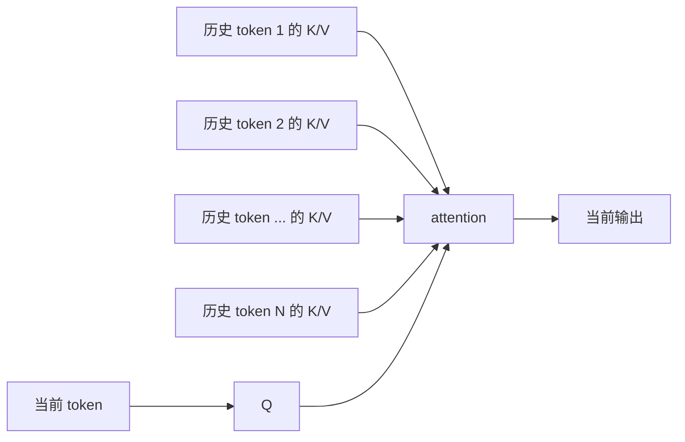

上下文越长，KV Cache 越大，decode 读内存越重。

Mamba 试图走另一条路：不显式保存每个历史 token 的 KV，而是把历史压缩进状态：

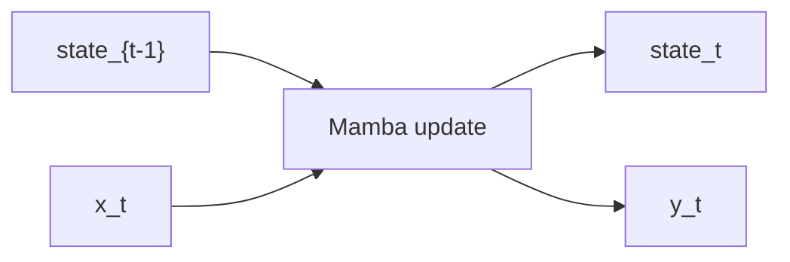

每来一个 token，更新一次状态。历史信息不再是一串 KV，而是一个随时间滚动的 state。

## 2. State Space Model 的最小直觉

SSM 可以用非常简化的形式理解：

```text
state_t = A * state_{t-1} + B * x_t
y_t     = C * state_t     + D * x_t
```

含义：

- `x_t`：当前 token 的表示。
- `state_{t-1}`：到上一个 token 为止压缩出的历史状态。
- `state_t`：更新后的历史状态。
- `y_t`：当前 token 输出。
- `A/B/C/D`：控制状态如何保留、写入和读出。

图上看是这样：

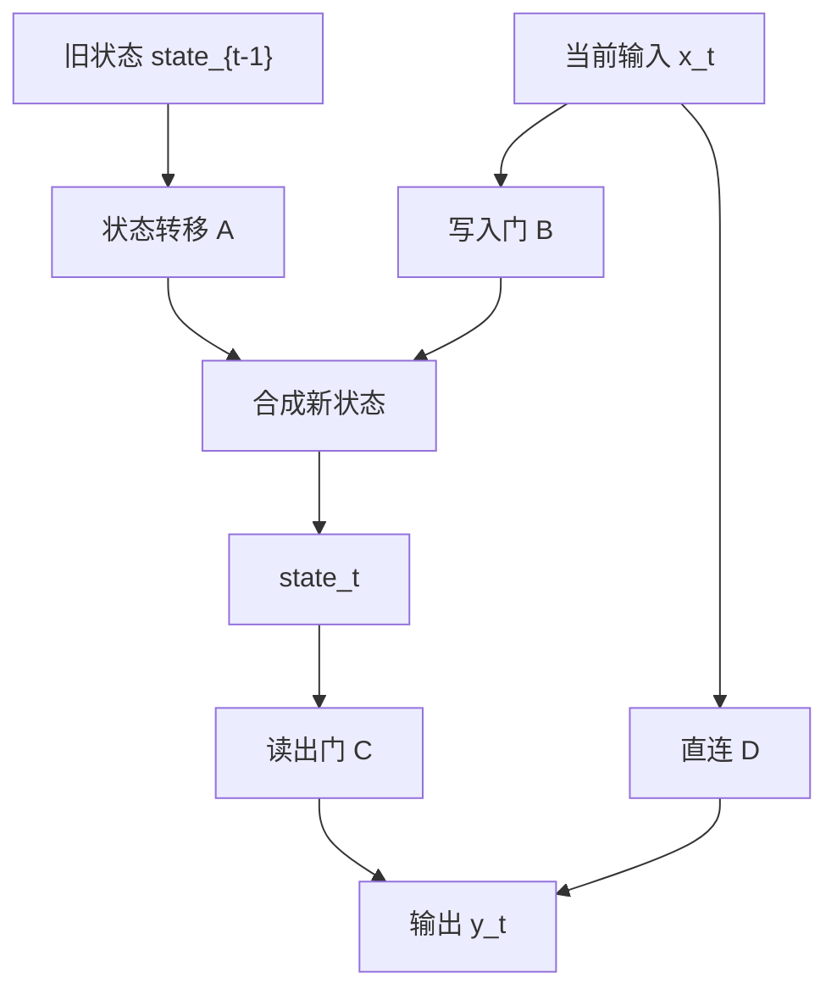

真实 Mamba 比这个复杂很多，会有 selective scan、输入相关的参数、门控、卷积、并行扫描 kernel。但这条直觉足够理解 serving 系统为什么要维护 state。

## 3. Mamba Block 的数据流

Mamba2 风格的 block 可以粗略拆成几步：

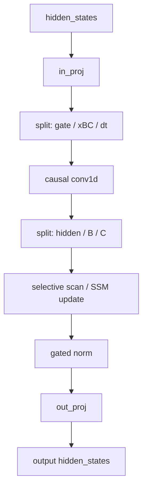

和 attention block 对比：

| Transformer Attention | Mamba |
|---|---|
| 生成 Q/K/V | 生成 gate、B、C、dt 等参数 |
| 历史信息存在 KV Cache | 历史信息存在 conv state 和 SSM state |
| Decode 要读所有历史 KV | Decode 更新当前请求的递归 state |
| 长上下文 memory bandwidth 压力大 | state 大小更固定，但状态管理更复杂 |

## 4. Mamba 为什么还有 conv state

Mamba 不只是 SSM。它通常还在进入 SSM 前做一个短卷积，用来捕获局部上下文。

如果卷积 kernel size 是 4，那么计算当前 token 时需要最近 3 个 token 的中间表示：

```text
conv_state_t = 最近 K-1 个输入窗口
```

所以 Mamba 推理至少有两类状态：

| 状态 | 作用 | 类比 |
|---|---|---|
| `conv state` | 保存短卷积需要的最近窗口 | 最近几个 token 的滑动窗口 |
| `temporal/SSM state` | 保存长程递归历史 | 压缩后的长期记忆 |

SGLang 的 `MambaPool.State` 里也正是这两类：

```text
conv: List[torch.Tensor]
temporal: torch.Tensor
```

如果有 speculative decoding，还会有中间状态：

```text
intermediate_ssm
intermediate_conv_window
```

## 5. Attention KV Cache vs Mamba State

这是理解 SGLang 代码的关键。

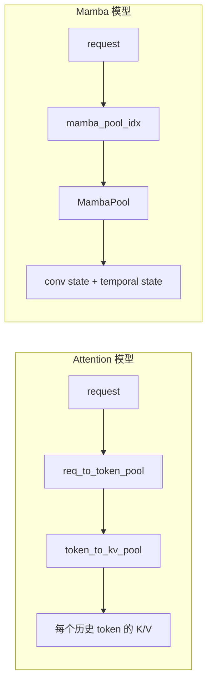

Attention 的 cache 和 token 数强相关：

```text
KV Cache 大小 ≈ layers * tokens * kv_heads * head_dim * 2
```

Mamba 的主状态更像和请求数强相关：

```text
Mamba state 大小 ≈ mamba_layers * running_requests * state_shape
```

但注意：Mamba prefix/radix cache、extra buffer、speculative 中间状态仍然会让内存管理变复杂。

## 6. SGLang 中 Mamba State 的形状从哪里来

源码位置：

```text
python/sglang/srt/configs/mamba_utils.py
```

核心结构：

```text
Mamba2StateShape:
    conv: list[tuple[int, int]]
    temporal: tuple[int, int, int]

Mamba2CacheParams:
    shape
    layers
    dtype
```

`Mamba2StateShape.create()` 会根据模型配置和 TP 切分计算 state shape：

```text
conv_state_shape:
    [conv_dim / tp, conv_kernel - 1]

temporal_state_shape:
    [num_heads / tp, head_dim, state_size]
```

所以 Mamba state 不是拍脑袋分配的，而是由模型配置决定：

```text
num_heads
head_dim
state_size
conv_kernel
n_groups
tp_world_size
```

## 7. SGLang 中 MambaPool 管什么

源码位置：

```text
python/sglang/srt/mem_cache/memory_pool.py
  MambaPool
```

`MambaPool` 是一块按请求槽位组织的状态池：

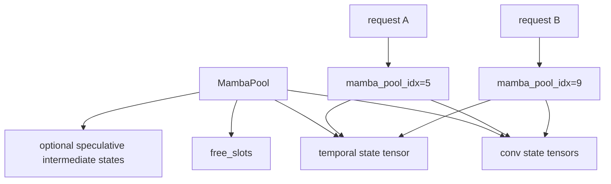

重要方法：

| 方法 | 作用 |
|---|---|
| `alloc(need_size)` | 分配 Mamba state 槽位 |
| `free(free_index)` | 释放槽位 |
| `clear_slots(indices)` | 清空状态内容 |
| `copy_from(src, dst)` | 拷贝状态，用于 fork/cache/回滚 |
| `get_cpu_copy(indices)` | 把状态搬到 CPU，用于 host/HiCache 场景 |
| `load_cpu_copy(...)` | 从 CPU 恢复状态 |
| `mamba2_layer_cache(layer_id)` | 取某一层对应的 conv/temporal state |

## 8. 请求如何拿到 mamba_pool_idx

SGLang 的请求需要一个 `mamba_pool_idx` 指向自己的 Mamba state。

简化流程：

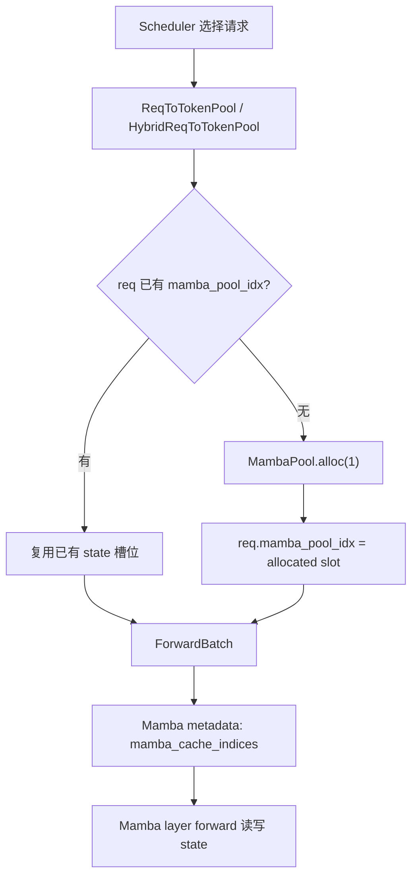

这和普通 attention 的 `req_pool_idx` 很像，但指向的是另一类状态池。

## 9. Mamba2Metadata 是什么

源码位置：

```text
python/sglang/srt/layers/attention/mamba/mamba2_metadata.py
```

`Mamba2Metadata` 是一次 forward 中所有 Mamba layer 共享的调度信息。

它包含：

| 字段 | 含义 |
|---|---|
| `query_start_loc` | flattened token 中每个请求的起始位置 |
| `mamba_cache_indices` | 本轮 batch 中每个请求对应的 Mamba state 槽位 |
| `num_prefills` | 本轮有多少 prefill/extend 请求 |
| `num_prefill_tokens` | prefill token 总数 |
| `num_decodes` | decode 请求/token 数 |
| `mixed_metadata` | extend/mixed 请求的 chunk、seq_idx、initial state 信息 |
| `is_target_verify` | speculative verify 模式 |
| `draft_token_num` | speculative 一次验证几个 draft token |
| `track_*` | extra buffer / radix cache 追踪状态需要的索引 |

Mamba forward 里会用这些 metadata 把 prefill 和 decode 拆开处理：

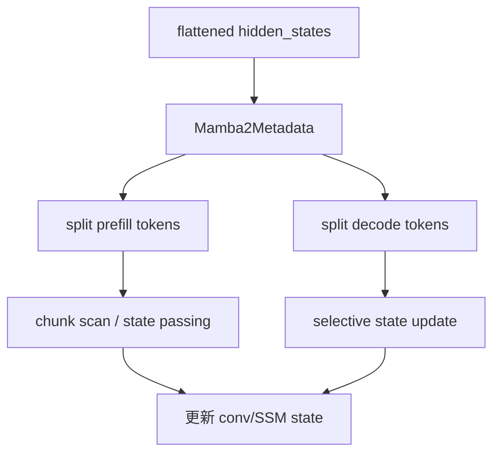

## 10. Prefill 和 Decode 中 Mamba State 怎么流转

### Prefill / Extend

Prefill 一次处理多个 prompt token，需要把一段序列扫描过去，得到最终 state。

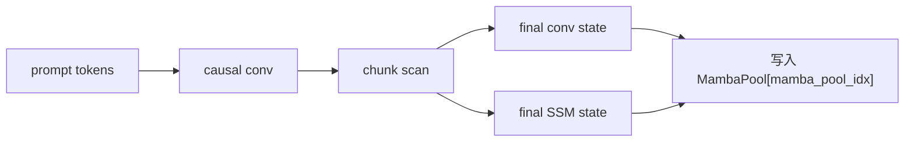

如果是 chunked prefill，Mamba 还要知道这个 chunk 是否有已有初始状态：

```text
has_initial_states
prep_initial_states
chunk_indices
chunk_offsets
```

这些都在 `mixed_metadata` 里。

### Decode

Decode 每轮通常只推进一个 token：

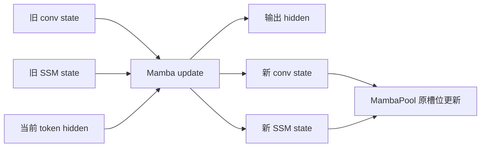

这里的状态更新是 in-place 的：请求下一轮 decode 会继续从同一个 `mamba_pool_idx` 读取新状态。

## 11. mamba_scheduler_strategy 是什么

SGLang 的服务不是单请求顺序执行，而是 continuous batching、chunked prefill、radix cache、speculative decoding、overlap schedule 混在一起。

Mamba 的难点是：状态是“当前请求历史”的压缩结果。只要调度出现 fork、prefix reuse、回滚、draft verify、chunk 边界，就要非常小心状态是否对应正确的历史。

相关参数在 `server_args.py`：

```text
mamba_scheduler_strategy: auto / no_buffer / extra_buffer
mamba_track_interval
max_mamba_cache_size
mamba_cache_chunk_size
```

### no_buffer

`no_buffer` 更简单：尽量直接使用当前请求的 Mamba state。它对 radix cache/page size/overlap schedule 有更多限制。

直觉：

```text
请求状态只有一份
状态必须严格沿着真实 token 顺序推进
如果需要回滚或分支，处理空间较小
```

### extra_buffer

`extra_buffer` 会额外分配 ping-pong/track buffer，用于保存一些可回溯或可复用的状态点。

直觉：

```text
除了当前 state，再保留一些 checkpoint state
prefix/radix cache 命中或分支时，可以恢复/拷贝这些 state
更灵活，但占更多 Mamba state 内存
```

这就是为什么代码里会看到：

```text
mamba_track_indices
mamba_track_mask
mamba_ping_pong_track_buffer
mamba_next_track_idx
mamba_track_interval
```

## 12. 为什么 Mamba 和 Radix Cache 会耦合

Transformer 的 prefix cache 可以保存 prefix 的 KV blocks。Mamba 的 prefix cache 不能只保存 token loc，因为历史被压缩在 state 里。

如果一个 prefix 被复用，Mamba 还需要恢复该 prefix 末尾的 Mamba state：

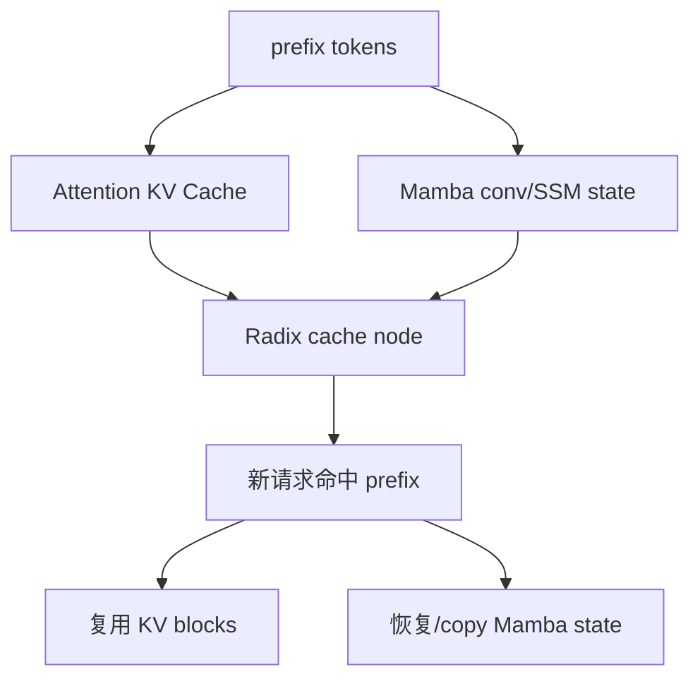

因此 SGLang 有：

```text
mem_cache/mamba_radix_cache.py
mem_cache/hi_mamba_radix_cache.py
mem_cache/unified_cache_components/mamba_component.py
```

这些文件不是“额外装饰”，而是在解决 Mamba 状态和 prefix cache 一起复用的问题。

## 13. Graph / Piecewise Graph 里为什么也有 mamba_track

在 Graph 讲义里我们说过，graph replay 需要静态 buffer。Mamba extra buffer 下，某些状态追踪索引也要进入 graph/piecewise graph：

```text
mamba_track_indices
mamba_track_mask
mamba_track_seqlens
```

这些字段告诉 Mamba kernel：

```text
本轮哪些请求需要把中间 conv/SSM state 额外保存到 track buffer
保存到哪个 Mamba state 槽位
哪些 padding 行不应该影响真实状态
```

数据流可以画成：

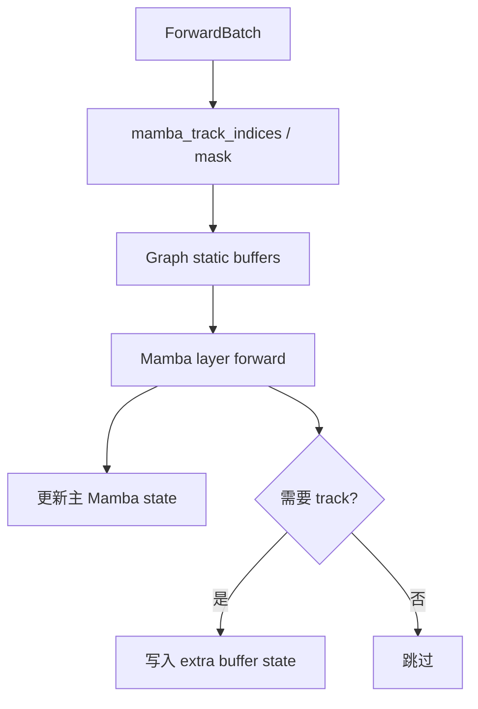

## 14. Speculative Decoding 中 Mamba 为什么更麻烦

Speculative decoding 会先猜多个 token，再由 target verify 决定接受几个。

Attention 模型中，未接受 token 的 KV 可以不提交或回滚。Mamba 模型中，每个 draft token 都会推进 state。如果最后只接受一部分，就需要知道接受位置对应的 state 是哪一个。

所以 `MambaPool.SpeculativeState` 里会有：

```text
intermediate_ssm
intermediate_conv_window
```

它们保存 target verify 过程中每个 draft token 的中间状态，方便接受 token 后把正式 Mamba state 更新到正确位置。

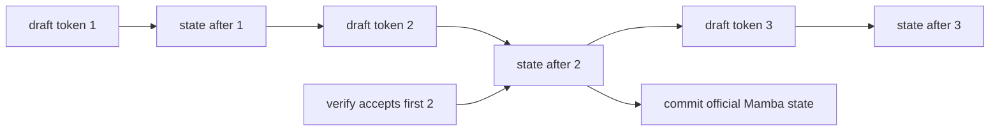

## 15. Mamba 和 PD / KV Transfer

PD 分离里，prefill worker 算完 prompt 后，decode worker 要接着生成。对 attention 模型，需要把 KV 传过去。对 Mamba/hybrid 模型，还要传 Mamba state。

所以源码和文档里会看到：

```text
state_types
state_data_ptrs
state_indices
Mamba/SWA/DSA auxiliary state
```

直觉：

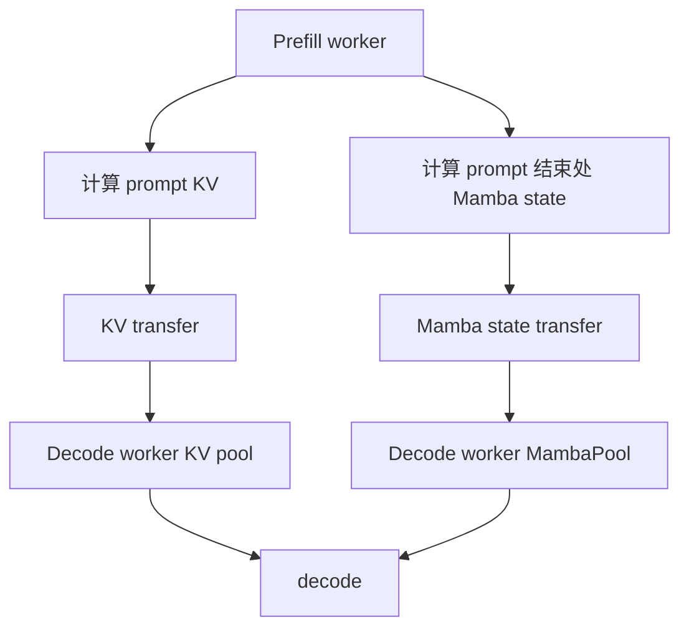

如果只传 KV 不传 Mamba state，decode worker 的 Mamba layer 就不知道 prompt 历史。

## 16. 读 SGLang Mamba 源码的顺序

建议按这个顺序读：

1. `python/sglang/srt/configs/mamba_utils.py`：先看 state shape、dtype、`mamba_cache_per_req`。
2. `python/sglang/srt/mem_cache/memory_pool.py`：看 `MambaPool` 如何分配 conv/temporal state。
3. `python/sglang/srt/layers/attention/mamba/mamba2_metadata.py`：看一次 forward 需要哪些 metadata。
4. `python/sglang/srt/layers/attention/mamba/mamba.py`：看 Mamba layer forward 如何读写 state。
5. `python/sglang/srt/server_args.py`：看 `mamba_scheduler_strategy` 和 extra buffer 的限制。
6. `python/sglang/srt/mem_cache/mamba_radix_cache.py`：看 Mamba radix cache 如何保存/恢复 prefix state。
7. `python/sglang/srt/model_executor/piecewise_cuda_graph_runner.py`：看 `mamba_track_*` 如何进入 graph buffer。

## 17. 常见误解

### Mamba 没有 KV Cache，所以 serving 一定简单吗？

不是。Mamba 减少了按 token 增长的 attention KV 压力，但引入了按请求维护的递归 state、prefix state 复用、speculative 中间 state、状态拷贝/回滚等复杂度。

### Mamba state 是一个 tensor 吗？

不是单一 tensor。SGLang 中至少有 `conv` 和 `temporal` 两类状态；speculative 场景还有 intermediate state。

### mamba_pool_idx 和 req_pool_idx 是同一个吗？

不是。`req_pool_idx` 常用于请求到 token/KV 位置的映射；`mamba_pool_idx` 指向 Mamba state pool 中的槽位。

### Mamba 可以完全不关心 prefix cache 吗？

不能。只要要复用 prefix，就必须保证 prefix 末尾对应的 Mamba state 也能复用或恢复。

## 18. 一张总图

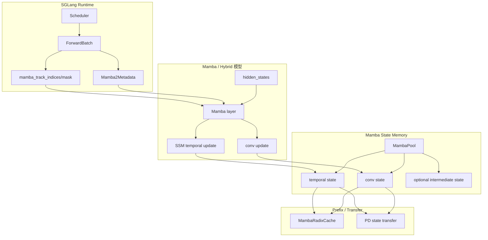

## 19. 阅读任务

1. 用自己的话解释为什么 Mamba 不需要保存每个历史 token 的 KV。
2. 画出 `conv state` 和 `temporal state` 在 decode 一步中的更新。
3. 找到 `MambaPool.State`，说明 `conv` 和 `temporal` 的 shape 由哪里决定。
4. 比较 `req_pool_idx`、`out_cache_loc`、`mamba_pool_idx` 三个索引分别指向什么。
5. 解释为什么 `extra_buffer` 可以帮助 Mamba radix cache，但会增加内存占用。
