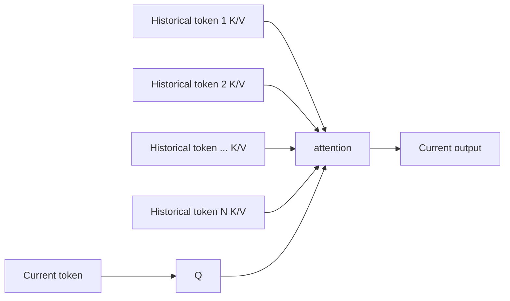
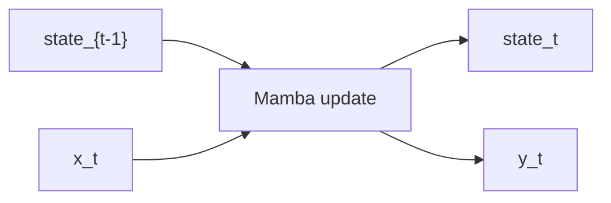
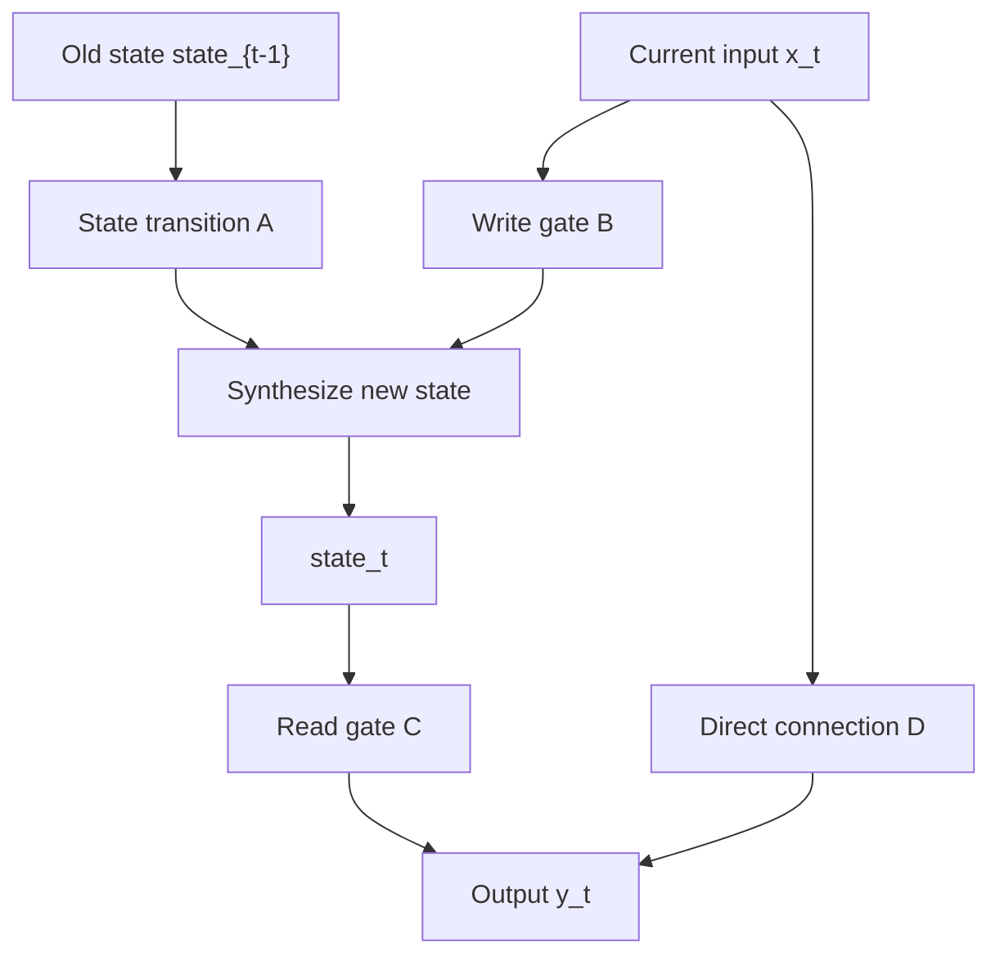

[中文](./01-mamba-and-sglang-state.md) | [English](./01-mamba-and-sglang-state_EN.md)

# What is Mamba: From State Space Models to SGLang Mamba State

The `mamba state`, `mamba_scheduler_strategy`, `mamba_pool_idx` you see in SGLang are not aliases for another type of KV Cache. They come from a different approach to sequence modeling from Transformer attention: **State Space Models, abbreviated as SSM**.

One line to remember:

> Transformer attention "remembers context by saving all historical tokens' KV"; Mamba "compresses historical context by continuously updating a recurrent state."

This means when SGLang serves Mamba or hybrid Mamba models, besides normal KV Cache, it must also manage Mamba's own state pool, scheduling strategy, and prefix cache state.

## 1. Why Mamba Exists

Transformer attention's core is letting the current token directly look at historical tokens:

```text
Current Q computes similarity with all historical K
Then weighted-sum of all historical V
```

This is powerful, but long-context decode requires continuously reading historical KV:



The longer the context, the larger the KV Cache, and the heavier the decode memory reads.

Mamba attempts a different path: instead of explicitly saving every historical token's KV, it compresses history into a state:



Each new token updates the state once. Historical information is no longer a string of KVs, but a state rolling through time.

## 2. Minimal Intuition for State Space Models

SSM can be understood in very simplified form:

```text
state_t = A * state_{t-1} + B * x_t
y_t     = C * state_t     + D * x_t
```

Meaning:

- `x_t`: current token's representation
- `state_{t-1}`: compressed historical state up to the previous token
- `state_t`: updated historical state
- `y_t`: current token output
- `A/B/C/D`: control how state is retained, written, and read

Visually:



Real Mamba is much more complex: selective scan, input-dependent parameters, gating, convolution, parallel scan kernels. But this intuition is sufficient for understanding why a serving system must maintain state.

## 3. How SGLang Manages Mamba State

SGLang treats Mamba state differently from KV Cache:

- **MambaStatePool**: Like `req_to_token_pool` but for Mamba state — maps request slots to state storage
- **MambaPool**: The actual state buffer, holding the recurrent state for each active request
- **mamba_scheduler_strategy**: Determines how the Scheduler handles Mamba vs Transformer requests in the same batch
- **mamba_pool_idx**: Each request's index into the Mamba state pool

## 4. Key Differences from KV Cache

| Aspect | KV Cache (Transformer) | Mamba State |
|---|---|---|
| Storage | Per-layer, per-token K/V pairs | Fixed-size recurrent state |
| Growth | Grows linearly with context length | Fixed size regardless of context |
| Access Pattern | Random access to historical tokens | Sequential update only |
| Prefix Sharing | Radix tree sharing of KV pages | State must be recomputed or checkpointed |
| Memory | O(L × S × Nkv × D) | O(L × D_state) |

## 5. SGLang Code Locations

- `python/sglang/srt/layers/mamba/` — Mamba layer implementations
- `python/sglang/srt/managers/scheduler.py` — `mamba_scheduler_strategy`, Mamba-specific scheduling
- `python/sglang/srt/mem_cache/mamba_pool.py` — MambaStatePool and MambaPool
- `python/sglang/srt/mem_cache/radix_cache.py` — Mamba radix cache state management
