**中文** | [English](./02-mamba-principles_EN.md)

# Mamba 原理详解：从 SSM 到 Mamba2 Forward

这一讲只回答一个问题：**Mamba 到底是怎么计算的？**

上一讲把 Mamba 放进 SGLang serving 里做了总览，但 Mamba 的内部原理还没有展开。这里我们从最小 SSM 公式开始，一步步走到 SGLang 代码中的 Mamba2 forward：`in_proj -> causal conv -> selective scan / state update -> gated norm -> out_proj`。

## 1. Attention 和 Mamba 的根本差别

Transformer attention 的思路是：

```text
当前 token 直接访问所有历史 token
```

Mamba/SSM 的思路是：

```text
当前 token 只访问一个持续更新的状态 state
```

对比图：

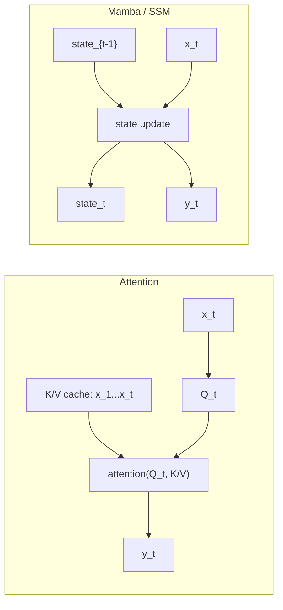

Attention 的历史是“展开的”：每个历史 token 都有 K/V。

Mamba 的历史是“压缩的”：历史被滚动写入一个固定形状的 state。

## 2. 最小 SSM 公式

最小的离散 SSM 可以写成：

```text
h_t = A h_{t-1} + B x_t
y_t = C h_t     + D x_t
```

其中：

| 符号 | 含义 |
|---|---|
| `x_t` | 第 t 个 token 的输入表示 |
| `h_t` | 第 t 步之后的状态 |
| `A` | 旧状态保留多少 |
| `B` | 当前输入如何写入状态 |
| `C` | 当前状态如何读出成输出 |
| `D` | 当前输入的直连项 |

它的执行是递归的：

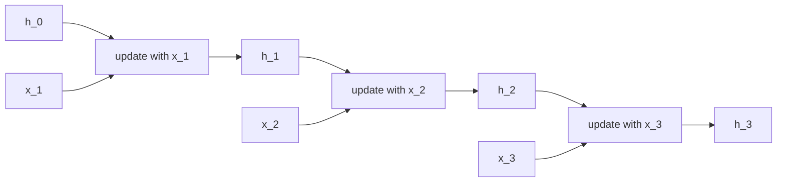

如果直接按 token 顺序一个个更新，它看起来不容易并行。但 Mamba 使用 selective scan/chunk scan 把一段序列的递推并行化。

## 3. Mamba 的 selective 是什么

传统 SSM 里 `A/B/C/D` 可以近似看成固定参数。Mamba 的关键改造是：让一部分参数和输入相关。

直觉上：

```text
不同 token 可以决定：
  写入多少信息
  忘掉多少旧状态
  从状态读出什么
```

所以它叫 selective。可以把它理解成一种带门控的状态机：

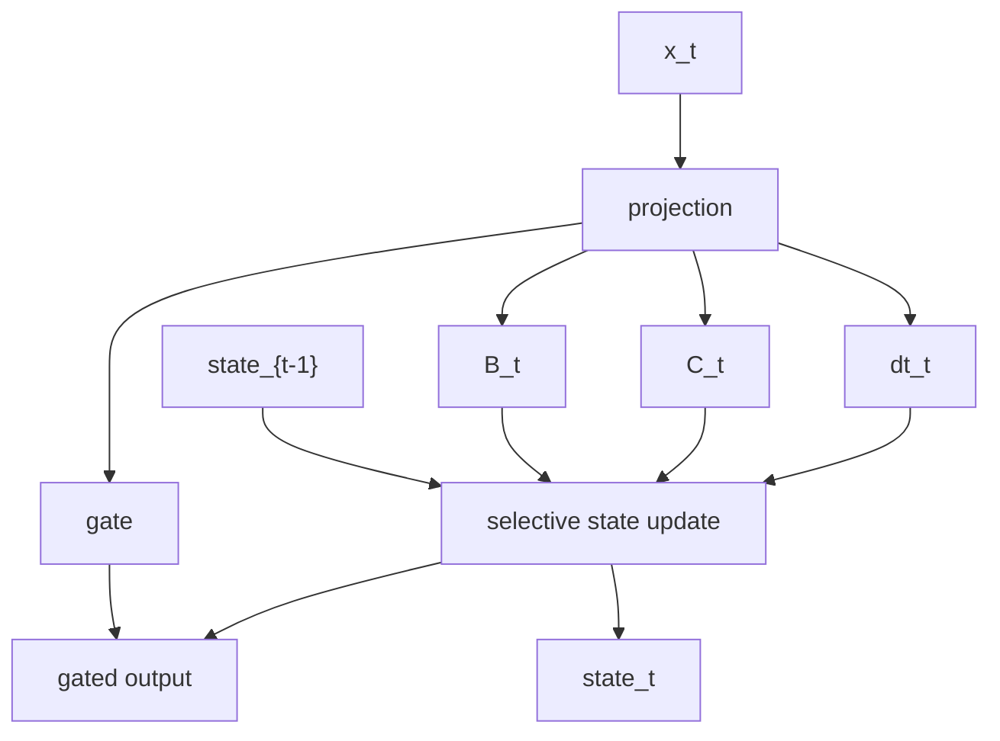

这里的 `dt` 可以理解为“离散化步长/时间尺度”，控制状态衰减和更新的节奏。SGLang 代码中会看到 `dt`、`dt_bias`、`dt_softplus`、`A`、`D` 等变量。

## 4. Mamba 为什么要先做 causal conv

Mamba block 里通常有一个短 causal convolution。它不是为了替代 SSM 的长程记忆，而是给每个位置提供局部上下文。

假设 kernel size 是 4，则当前 token 的卷积要看最近 4 个位置：

```text
conv_out_t = f(x_t, x_{t-1}, x_{t-2}, x_{t-3})
```

Decode 时不能每步回头重算最近窗口，所以要保存 `conv state`：

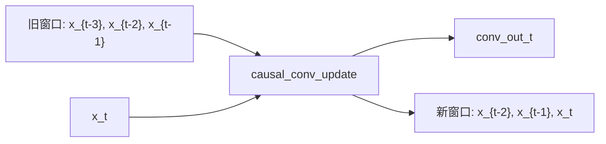

这就是 SGLang `MambaPool.State.conv` 的意义。

## 5. Mamba2 Block 的完整逻辑

从 SGLang 的 `mamba.py` 看，Mamba2 forward 的主干是：

```text
1. in_proj(hidden_states)
2. split projected_states -> gate, hidden_states_B_C, dt
3. causal conv 处理 hidden_states_B_C
4. split conv output -> hidden_states, B, C
5. SSM:
   - prefill 用 mamba_chunk_scan_combined
   - decode 用 selective_state_update
6. gated RMSNorm
7. out_proj
```

流程图：

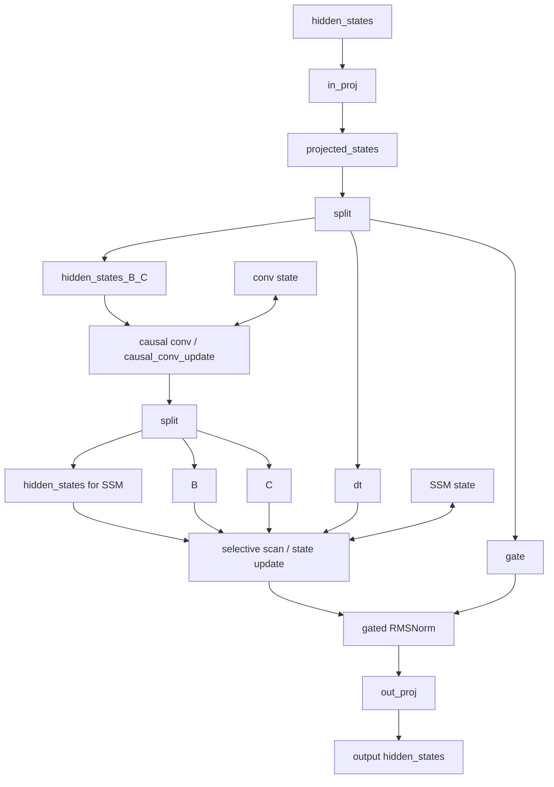

源码位置：

```text
python/sglang/srt/layers/attention/mamba/mamba.py
  MambaMixer2.forward(...)
```

## 6. in_proj 后为什么 split 成 gate / xBC / dt

SGLang 代码：

```text
projected_states, _ = self.in_proj(hidden_states)
gate, hidden_states_B_C, dt = torch.split(...)
```

可以理解为一次大的 linear 同时生成三类东西：

| 分量 | 用途 |
|---|---|
| `gate` | 最后 gated norm/output 的门控信号 |
| `hidden_states_B_C` | 进入 causal conv，之后再拆成 SSM 输入、B、C |
| `dt` | SSM 离散化/时间步控制 |

为什么合在一个 projection 里？

因为这样可以把多个小矩阵乘合并成一个大矩阵乘，减少 kernel launch 和内存读写。

## 7. causal conv 分支

### Prefill

Prefill 输入是一段 token 序列，所以使用序列版 causal conv：

```text
causal_conv1d_fn(...)
```

它会：

1. 对 prompt token 做 causal conv。
2. 根据 `cache_indices` 把每个请求最后的卷积窗口写入 `conv_state`。
3. 支持 chunked prefill 初始状态。

代码中：

```text
hidden_states_B_C_p = causal_conv1d_fn(
    x,
    conv_weights,
    ...,
    conv_states=conv_state,
    has_initial_state=has_initial_states_p,
    cache_indices=cache_indices,
    query_start_loc=query_start_loc_p,
    seq_lens_cpu=mixed_metadata.extend_seq_lens_cpu,
)
```

### Decode

Decode 每个请求通常一个 token，所以使用 update 版：

```text
causal_conv1d_update(...)
```

它做的是滑动窗口更新：

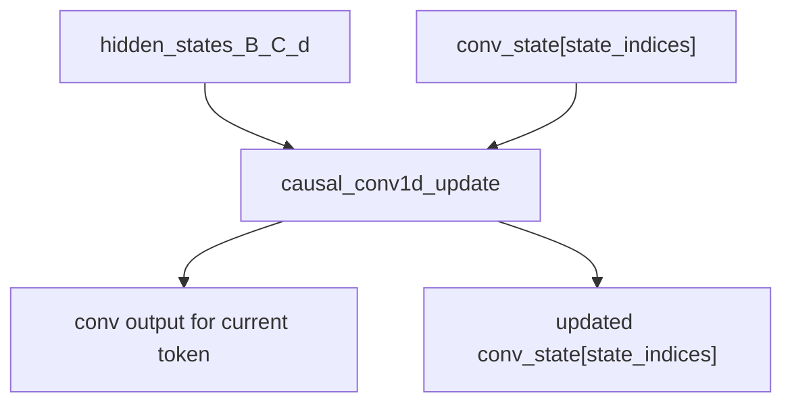

代码中：

```text
hidden_states_B_C_d = causal_conv1d_update(
    hidden_states_B_C_d,
    conv_state,
    conv_weights,
    ...,
    conv_state_indices=state_indices_tensor_d,
)
```

## 8. conv 输出为什么再 split 成 hidden / B / C

卷积处理后，`hidden_states_B_C` 会再拆成：

```text
hidden_states
B
C
```

对应 SSM 公式：

```text
h_t = A h_{t-1} + B_t x_t
y_t = C_t h_t     + D x_t
```

这里的 `B_t` 和 `C_t` 是由当前输入路径生成的，所以是 selective 的。

## 9. Prefill 为什么用 chunk scan

Prefill 需要处理一整段序列：

```text
x_1, x_2, ..., x_N
```

如果逐 token 执行 SSM 更新，会很慢。Mamba 用 scan/chunk scan 把递推拆成可并行的块。

SGLang 使用：

```text
mamba_chunk_scan_combined(...)
```

它的输入包括：

```text
hidden_states_p
dt_p
A
B_p
C_p
chunk_size
seq_idx
chunk_indices
chunk_offsets
cu_seqlens
initial_states
```

图上看：

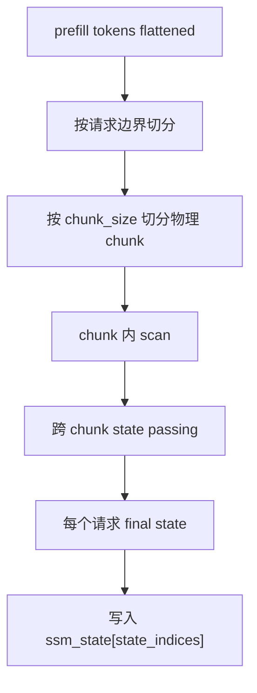

为什么需要 `query_start_loc`、`seq_idx`、`chunk_indices`、`chunk_offsets`？

因为 batch 里多个请求被 flatten 到一个 token 数组里，而且 chunked prefill 可能从非 0 位置开始。kernel 需要知道：

```text
哪个 token 属于哪个请求
哪个 logical chunk 对应哪个 physical chunk
当前 chunk 是否有 initial state
```

这些都由 `Mamba2Metadata.MixedMetadata` 提前准备。

## 10. Decode 为什么用 selective_state_update

Decode 是一步更新：

```text
state_t = update(state_{t-1}, x_t)
```

所以不用跑完整 chunk scan，而是使用：

```text
selective_state_update(...)
```

代码路径：

```text
selective_state_update(
    ssm_state,
    hidden_states_d,
    dt_d,
    A_d,
    B_d,
    C_d,
    D_d,
    state_batch_indices=state_indices_tensor_d,
    out=preallocated_ssm_out_d,
)
```

关键是 `state_batch_indices`。它告诉 kernel：

```text
batch row 0 的状态在 MambaPool 哪个槽位
batch row 1 的状态在 MambaPool 哪个槽位
...
```

数据流：

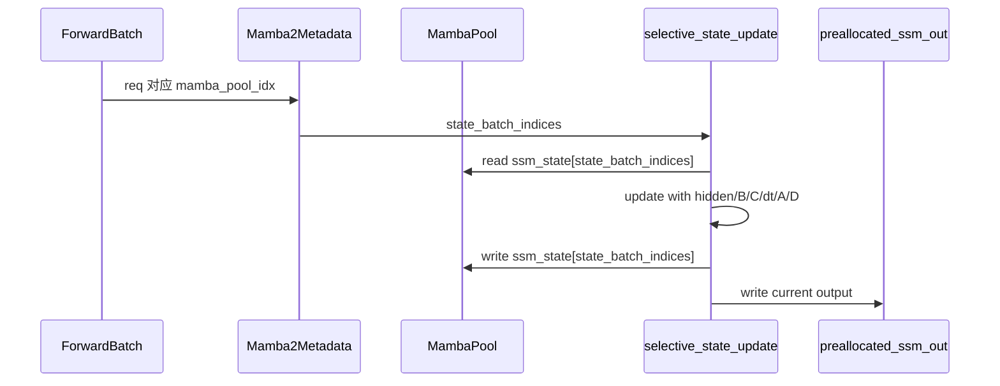

## 11. Prefill 和 Decode 在同一个 forward 里如何共存

SGLang 可能有 mixed batch：前半部分是 prefill/extend token，后半部分是 decode token。

Mamba forward 里会显式 split：

```text
num_prefill_tokens = metadata.num_prefill_tokens
num_decode_tokens = ...

hidden_states_B_C_p, hidden_states_B_C_d = torch.split(...)
dt_p, dt_d = torch.split(...)
state_indices_tensor_p, state_indices_tensor_d = torch.split(...)
```

图：

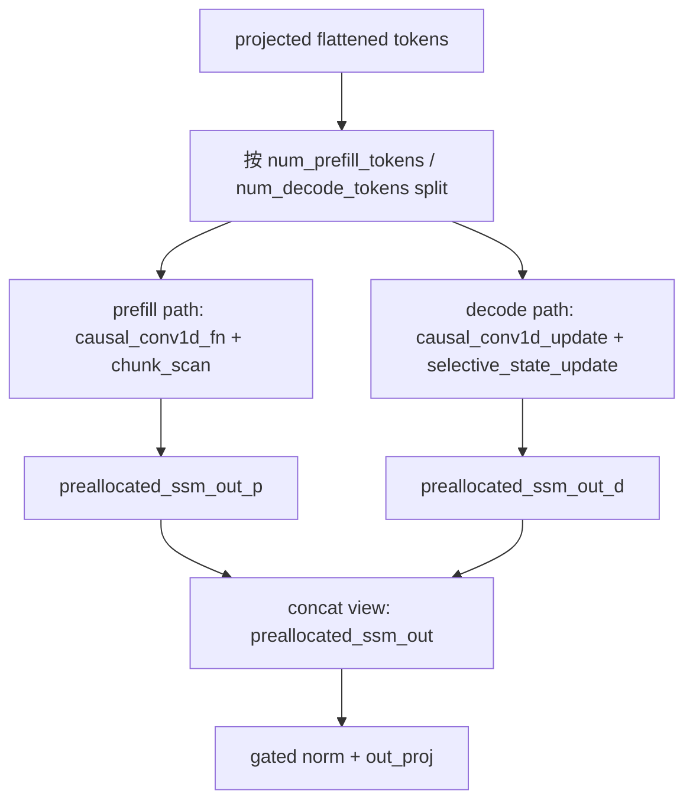

这个设计减少了额外 concat/copy：代码中提前创建 `preallocated_ssm_out`，再 split 成 prefill/decode 两段分别写。

## 12. Mamba state 在 forward 中如何被更新

两个状态池：

```text
conv_state = layer_cache.conv[0]
ssm_state  = layer_cache.temporal
```

Prefill：

```text
causal_conv1d_fn(... conv_states=conv_state, cache_indices=state_indices_tensor_p)
mamba_chunk_scan_combined(...) -> varlen_state
ssm_state[state_indices_tensor_p] = varlen_state
```

Decode：

```text
causal_conv1d_update(... conv_state_indices=state_indices_tensor_d)
selective_state_update(... state_batch_indices=state_indices_tensor_d)
```

所以 Mamba state 更新不是集中在一个 cache manager 函数里，而是在 Mamba layer forward 的 kernel 路径中发生。

## 13. Mamba 的 speculative verify 为什么特殊

普通 decode 一次一个 token，state 可以直接原地更新。

Speculative verify 一次验证多个 draft token，但最后可能只接受前几个。如果直接原地更新到最后一个 draft token，就无法回滚。

所以代码中 target verify 走特殊路径：

```text
disable_state_update=True
intermediate_states_buffer=layer_cache.intermediate_ssm
intermediate_conv_window=layer_cache.intermediate_conv_window
```

图：

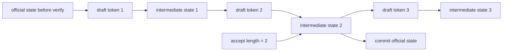

这就是 `MambaPool.SpeculativeState` 里有中间状态缓存的原因。

## 14. SGLang Mamba 代码依赖图

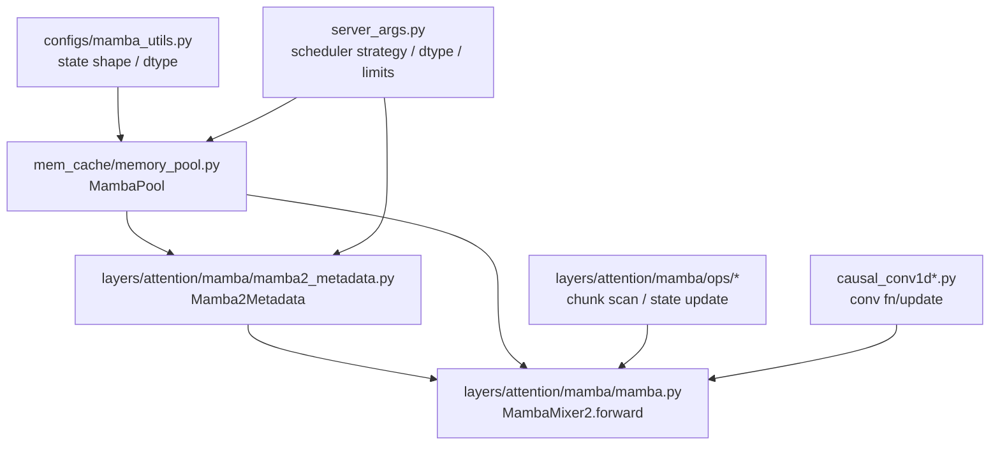

## 15. 和普通 attention backend 的对照

| 问题 | Attention | Mamba |
|---|---|---|
| 历史状态在哪里 | KV Cache，每 token 一份 K/V | MambaPool，每请求一份 conv/SSM state |
| prefill 核心计算 | full/varlen attention | causal conv + chunk scan |
| decode 核心计算 | query attends to history KV | conv update + selective state update |
| cache 索引 | `req_to_token_pool` + `token_to_kv_pool` | `mamba_pool_idx` / `mamba_cache_indices` |
| prefix cache 保存 | token ids -> KV indices | token ids -> KV indices + mamba state |
| speculative 回滚 | 管理 candidate KV | 管理 intermediate conv/SSM state |

## 16. 读代码时的抓手

读 `mamba.py` 不要被变量名淹没，抓住五个阶段：

1. **投影**：`projected_states = in_proj(hidden_states)`
2. **拆分**：`gate, hidden_states_B_C, dt = split(...)`
3. **卷积**：prefill 用 `causal_conv1d_fn`，decode 用 `causal_conv1d_update`
4. **SSM**：prefill 用 `mamba_chunk_scan_combined`，decode 用 `selective_state_update`
5. **输出**：`norm(preallocated_ssm_out, gate)` + `out_proj`

每看到一个 state 相关变量，问它三个问题：

```text
它是 conv state 还是 temporal/SSM state？
它属于哪个 request 的 mamba_pool_idx？
它是在 prefill 写最终状态，还是 decode 原地更新一步？
```

## 17. 阅读任务

1. 用自己的话解释 `dt` 在 Mamba 中大致控制什么。
2. 画出 prefill 路径中 `causal_conv1d_fn -> mamba_chunk_scan_combined -> ssm_state 写回` 的流程。
3. 画出 decode 路径中 `causal_conv1d_update -> selective_state_update` 的流程。
4. 找到代码中 `state_indices_tensor_p` 和 `state_indices_tensor_d` 的 split，说明它们分别对应什么请求。
5. 解释为什么 speculative verify 不能直接原地更新正式 Mamba state。
