**中文** | [English](./03-mamba-radix-cache_EN.md)

# Mamba 和 Radix Cache：状态复用、代码依赖与执行流程

这一讲专门讲你指出的第二个问题：**Mamba 和 Radix Cache 到底是什么关系？**

结论先放前面：

> 对 attention 模型，Radix Cache 复用的是 prefix token 对应的 KV indices；对 Mamba/hybrid 模型，Radix Cache 还必须复用或恢复 prefix 末尾的 Mamba state。否则命中了 prefix token，也无法从正确历史状态继续 decode。

所以 SGLang 里会有 `MambaRadixCache`、`mamba_value`、`mamba_exist`、`mamba_pool_idx`、`mamba_ping_pong_track_buffer`、`mamba_last_track_seqlen` 这些看起来绕的概念。

## 1. 普通 Radix Cache 复用什么

普通 Transformer prefix cache 的核心是：

```text
同样的 token prefix -> 已经算过的 KV Cache blocks
```

例如：

```text
请求 A: [system prompt, question A]
请求 B: [system prompt, question B]
```

`system prompt` 相同，第二个请求可以复用第一个请求的 prefix KV。

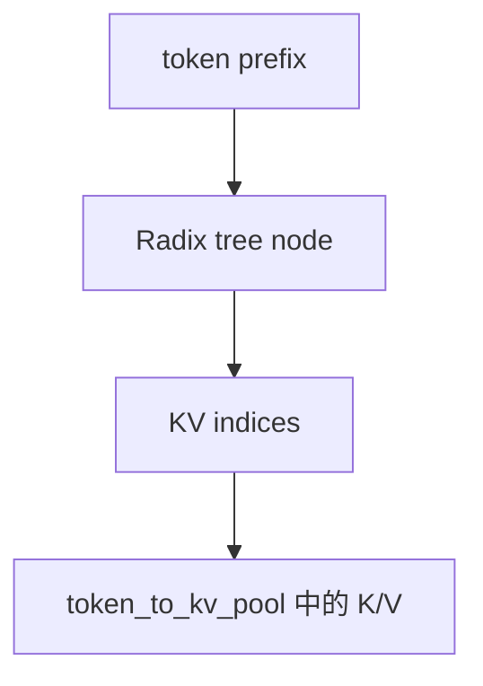

只要能找到 KV indices，attention decode 就可以读历史 KV。

## 2. Mamba 为什么不能只复用 KV indices

Mamba 的历史不主要存在 KV Cache 中，而存在 Mamba state 中：

```text
conv state
temporal / SSM state
```

如果一个请求命中 prefix，但没有恢复 prefix 末尾的 Mamba state，它继续 decode 时会从错误状态开始。

错误图：

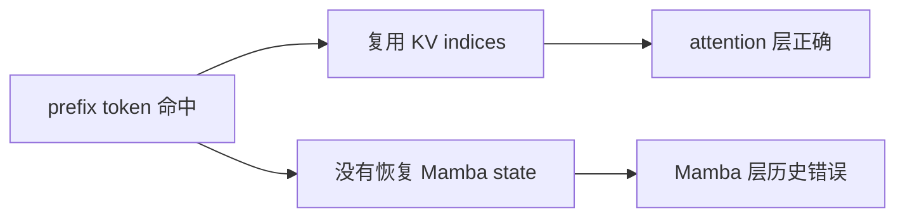

正确图：

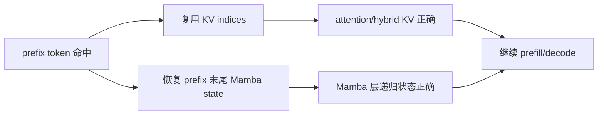

因此 Mamba radix tree 节点必须同时保存两类值：

```text
value        -> KV indices
mamba_value -> MambaPool 中的 state slot index
```

## 3. TreeNode 里多了什么

源码位置：

```text
python/sglang/srt/mem_cache/mamba_radix_cache.py
```

`TreeNode` 里有：

```text
value: KV indices
mamba_value: Optional[torch.Tensor]
full_lock_ref
mamba_lock_ref
```

直觉：

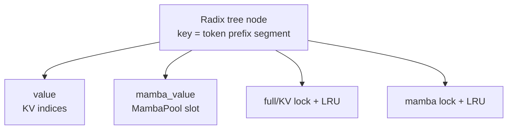

为什么要分 `full` 和 `mamba`？

因为 KV 和 Mamba state 的生命周期不完全一样。一个节点可能：

- KV 还在，Mamba state 也在。
- KV 被 evict，Mamba state 还在。
- Mamba state 被 evict，KV 还在。
- HiCache 场景下某些值转到 host。

所以 SGLang 分别维护 full/KV 和 mamba 的 LRU、lock、evictable size。

## 4. 代码依赖总图

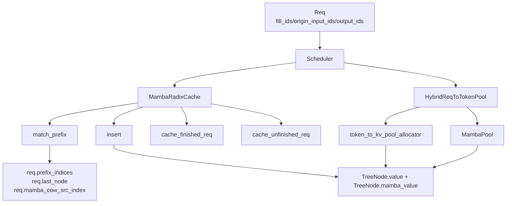

核心文件：

| 文件 | 角色 |
|---|---|
| `mamba_radix_cache.py` | 传统实现：Mamba 专用 radix tree |
| `unified_cache_components/mamba_component.py` | unified cache 里的 Mamba component |
| `memory_pool.py` | `MambaPool` 分配/释放/copy state |
| `server_args.py` | `mamba_scheduler_strategy` 和 `extra_buffer` 约束 |
| `schedule_batch.py` / Scheduler 相关 | 请求状态、match/insert 调用点 |

## 5. match_prefix：命中 prefix 时发生什么

普通前缀匹配流程：

```text
token ids -> radix tree -> matched KV indices -> last node
```

Mamba 额外要找到“最适合恢复 Mamba state 的节点”。

简化流程：

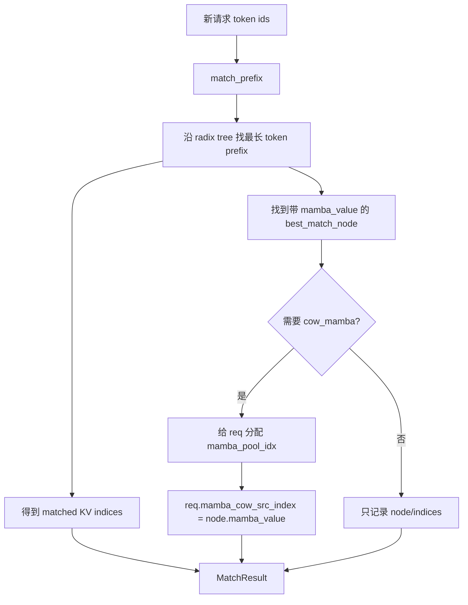

`cow_mamba` 可以理解为 copy-on-write：

```text
cache 节点里有 prefix 末尾的 Mamba state
新请求要从这个 state 开始继续写
不能直接改 cache 节点的 state
所以先给请求分配自己的 Mamba state slot
再记录源 state，后续在合适时机 copy/restore
```

在 unified component 里可以看到类似逻辑：

```text
if cow_mamba and mamba_value is not None:
    if req.mamba_pool_idx is None:
        alloc mamba slot
    req.mamba_cow_src_index = mamba_value
```

## 6. 为什么需要 copy-on-write

假设两个请求命中同一个 prefix：

```text
prefix: "You are a helpful assistant"
request A continues with token A1...
request B continues with token B1...
```

它们在 prefix 末尾的 Mamba state 相同。但继续生成后，状态会分叉：

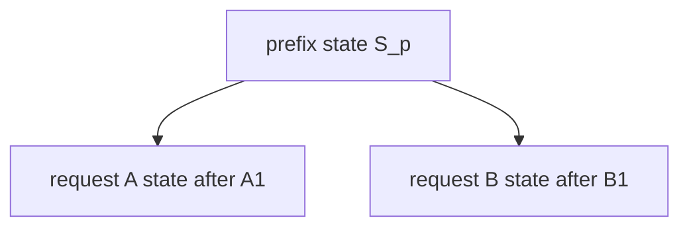

如果 A 和 B 直接共享同一个 Mamba state slot，A 的更新会污染 B。

所以必须：

```text
命中 prefix state
-> copy 到请求自己的 mamba_pool_idx
-> 请求后续 decode 原地更新自己的 state
```

这就是 Mamba prefix cache 比 KV prefix cache 更麻烦的根本原因：KV prefix 是不可变历史块，Mamba state 是会继续被更新的递归状态。

## 7. cache_finished_req：请求结束时如何入树

源码位置：

```text
MambaRadixCache.cache_finished_req(req)
```

请求结束后，如果要把它的 prefix/cache 插入 radix tree，需要插入两类值：

```text
token_ids -> key
kv_indices -> value
mamba_value -> prefix 末尾 Mamba state slot
```

流程：

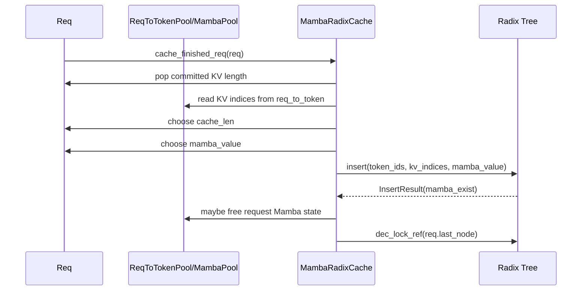

### no_buffer 情况

`mamba_value` 直接来自请求当前 state：

```text
mamba_value = req.mamba_pool_idx.unsqueeze(-1).clone()
```

如果树里已经存在对应 Mamba state，`mamba_exist=True`，请求自己的 state 可以释放。

### extra_buffer 情况

`mamba_value` 可能来自 ping-pong track buffer：

```text
keep_idx = get_mamba_ping_pong_other_idx(req.mamba_next_track_idx)
mamba_value = req.mamba_ping_pong_track_buffer[keep_idx]
```

因为 extra buffer 会周期性保存可缓存的 state 点，结束时插入的是“最后一个合法 tracked prefix”的 state，而不一定是请求最新 token 处的 state。

## 8. cache_unfinished_req：chunked prefill 中途如何入树

未完成请求也可能需要缓存已经完成的 prefix，例如 chunked prefill：

```text
长 prompt 被切成多个 chunk
第一个 chunk 处理完
请求还没结束，但 prefix 可以放进 radix cache
```

`cache_unfinished_req(req, chunked=True)` 的关键区别：

1. 请求还要继续运行，不能把当前 state 直接交给 cache 后就丢掉。
2. cache 需要保存一个 state snapshot。
3. 请求自己还要保留或换一个 state 继续后续 chunk。

no_buffer 下：

```text
mamba_value_donated = alloc new mamba slot
mamba_pool.copy_from(req.mamba_pool_idx, mamba_value_donated)
insert(... mamba_value=mamba_value_donated)
```

extra_buffer 下：

```text
mamba_value_donated = ping-pong track buffer 中的某个 slot
再给该 track buffer 位置分配一个新 slot
```

流程图：

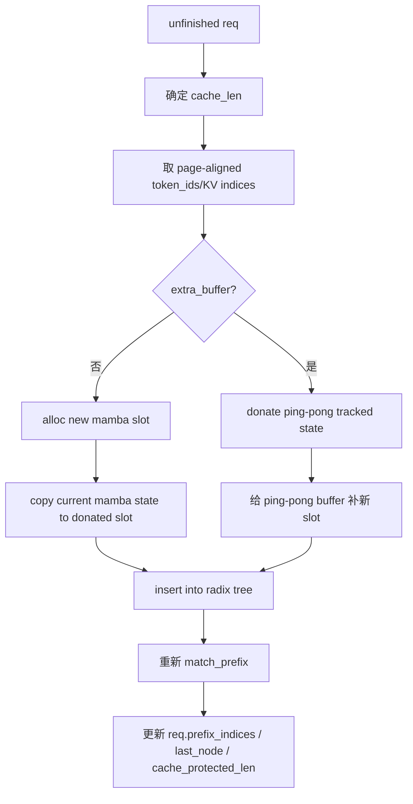

为什么 insert 后又 match 一次？

因为 radix tree 插入可能 split node、合并 prefix，最终 tree 中最长匹配节点和 KV indices 需要重新拿一次，更新回请求。

## 9. insert：mamba_exist 是什么

`insert()` 返回：

```text
InsertResult(prefix_len, mamba_exist)
```

`mamba_exist=True` 表示：插入位置的 Mamba state 已经存在，传进来的 `mamba_value` 没有成为 tree 的新状态。

这种情况下，调用方通常要释放自己刚准备的 `mamba_value`，避免泄漏：

```text
if mamba_exist:
    mamba_pool.free(mamba_value_donated)
```

直觉：

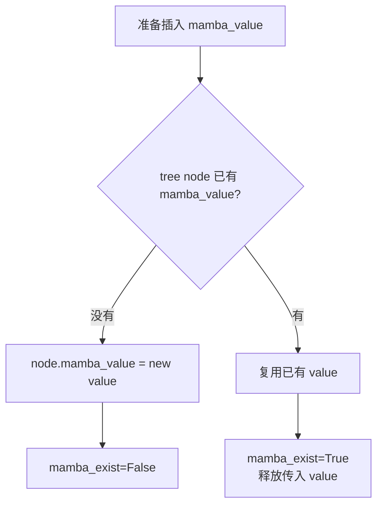

## 10. 为什么 extra_buffer 要 mamba_last_track_seqlen

extra buffer 不是每个 token 都保存 state，而是按 `mamba_track_interval` 保存某些可复用点。

所以 cache 时不能简单使用 `len(token_ids)`，而要使用最近一次 track 到的合法长度：

```text
cache_len = req.mamba_last_track_seqlen
```

如果最新输出长度超过了 tracked length，尾部 KV 可能不能和 Mamba state 对齐。SGLang 会裁剪：

```text
token_ids = token_ids[:cache_len]
kv_indices = kv_indices[:cache_len]
```

这就是 `cache_finished_req` 里看到：

```text
if cache_len != len(token_ids):
    free kv_indices[cache_end_idx:]
    token_ids = token_ids[:cache_len]
    kv_indices = kv_indices[:cache_len]
```

背后的原则：

> Radix tree 节点里的 token prefix、KV indices 和 Mamba state 必须表示同一个 prefix 结束点。

## 11. page_size 和 mamba_cache_chunk_size 为什么有限制

MambaRadixCache v1 中，如果不启用 extra_buffer，会要求：

```text
page_size == 1
```

原因是 no_buffer 模式下 Mamba state 和 token prefix 对齐粒度更细。page 大于 1 时，KV prefix 只能按 page 对齐，而 Mamba state 的有效 checkpoint 未必正好在 page 边界。

extra_buffer 模式要求：

```text
mamba_track_interval % page_size == 0
mamba_cache_chunk_size is not None
```

直觉：

```text
Mamba state checkpoint 要和 KV page/cache chunk 对齐
否则 token prefix、KV blocks、Mamba state 三者可能对应不同长度
```

对齐关系：

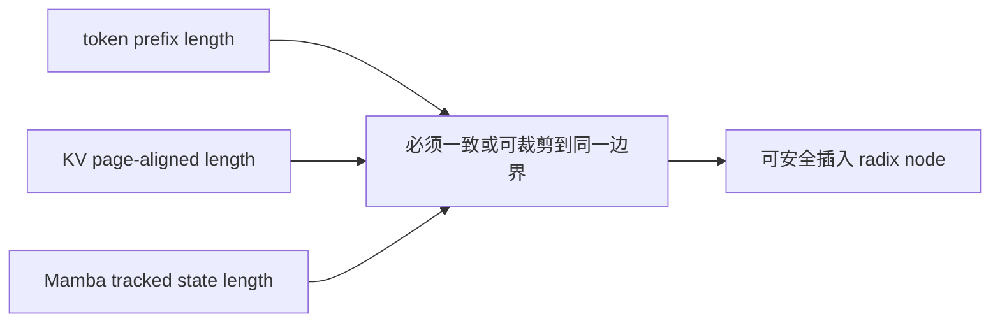

## 12. 锁和 LRU：为什么 full 和 mamba 分开

MambaRadixCache 维护：

```text
full_lru_list
mamba_lru_list
full_evictable_size_
mamba_evictable_size_
full_lock_ref
mamba_lock_ref
```

原因是 KV 和 Mamba state 的资源池不同：

| 资源 | 池 | evict/free |
|---|---|---|
| KV indices / KV cache | token_to_kv_pool_allocator | free KV blocks |
| Mamba state | MambaPool | free mamba slots |

一个节点的 KV 和 Mamba state 可能分别被保护或驱逐。比如命中 prefix 时，KV 可能需要 lock；Mamba state 如果要 copy-on-write，也需要保护到 copy 完成。

简化图：

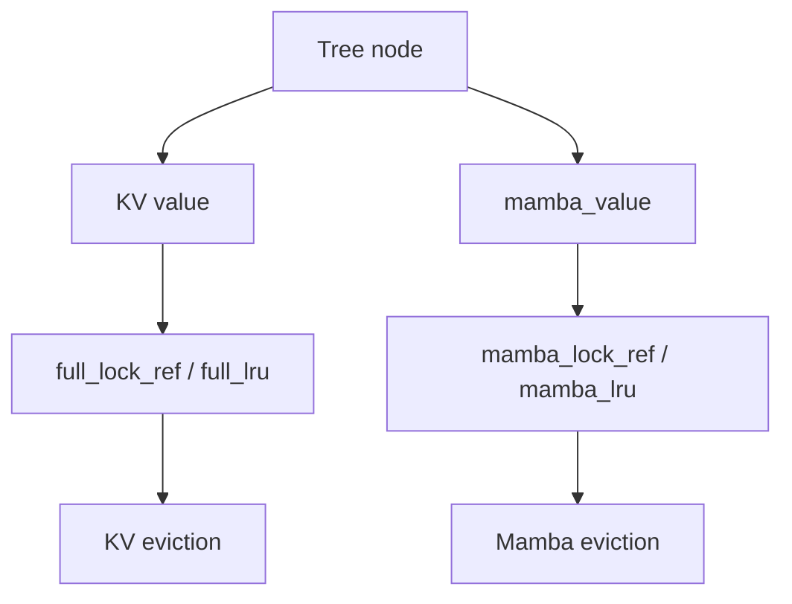

## 13. MambaComponent 和统一 Cache

新一些的 cache 结构把 KV、SWA、Mamba 等拆成 component。Mamba 逻辑在：

```text
python/sglang/srt/mem_cache/unified_cache_components/mamba_component.py
```

它把 Mamba 相关行为拆成 hook：

| 方法 | 对应 MambaRadixCache 中的概念 |
|---|---|
| `post_match_prefix` | match 后处理、copy-on-write、host load back |
| `prepare_for_caching_req` | cache req 前准备 mamba_value |
| `commit_insert_component_data` | 把 mamba_value 写入 node |
| `cleanup_after_caching_req` | 根据 mamba_exist 释放或保留状态 |
| `evict_component` | evict Mamba state |
| `acquire_component_lock/release_component_lock` | Mamba state lock |

统一 cache 的好处是：KV、Mamba、SWA 等状态可以以相似方式参与 radix tree、LRU、HiCache 和 transfer。

## 14. 请求生命周期中的 Mamba/Radix 数据流

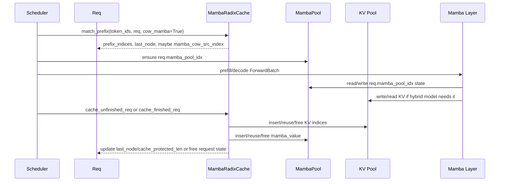

## 15. 一个具体例子

假设已有缓存：

```text
prefix P = [1, 2, 3, 4]
KV indices = [100, 101, 102, 103]
mamba_value = slot 7
```

新请求：

```text
[1, 2, 3, 4, 9, 10]
```

命中过程：

```text
match_prefix -> matched [1,2,3,4]
返回 KV indices [100..103]
发现 best_match_node.mamba_value = slot 7
给新请求分配 mamba_pool_idx = slot 12
记录 req.mamba_cow_src_index = slot 7
后续把 slot 7 的状态 copy 到 slot 12
请求继续处理 token [9,10]
Mamba layer 更新 slot 12，不污染 slot 7
```

如果请求中途完成 chunk：

```text
cache_unfinished_req
复制或捐赠 slot 12 的某个 checkpoint 到 radix tree
tree node 保存新的 token prefix -> KV indices + mamba_value
请求继续使用自己的 slot 12 或新的 track slot
```

## 16. 读代码时的主线

建议你带着这一条主线读：

```text
match_prefix:
  prefix token -> KV indices + best mamba node
  maybe copy-on-write mamba state

forward:
  req.mamba_pool_idx -> Mamba2Metadata.mamba_cache_indices
  Mamba layer read/write MambaPool

cache_unfinished_req/cache_finished_req:
  token ids + KV indices + mamba_value -> radix tree node
  根据 mamba_exist 决定释放还是保留状态

evict:
  KV 和 Mamba state 分别走 full/mamba LRU 与 lock
```

## 17. 和上一讲 Mamba 原理如何连接

上一讲说 Mamba 的输出依赖：

```text
conv state + SSM state
```

这一讲说 Radix Cache 必须保存：

```text
prefix 末尾的 conv state + SSM state 所在 MambaPool slot
```

所以两讲对应关系是：


## 18. 常见问题

### 为什么 radix node 存 mamba slot，而不是直接存 state tensor？

Mamba state 很大，直接塞进 tree node 不现实。tree node 保存的是 `MambaPool` 中的 slot index。真正的数据仍在池里。

### 为什么 unfinished req 要 copy 或 donate Mamba state？

因为请求还要继续运行。如果把当前 slot 直接交给 cache，后续 forward 会继续改它，cache 中的 prefix state 就被污染。

### 为什么 extra_buffer 能减少 copy？

extra_buffer 维护 track buffer，某些可缓存 state 已经写在独立 slot 里。插入 cache 时可以 donate 这个 slot，再给 track buffer 补一个新 slot，避免从主 state 拷贝。

### 为什么 mamba_exist=True 时要释放传入 mamba_value？

因为 tree 上已经有等价 prefix 的 Mamba state。传入的新 slot 没被采用，如果不释放就泄漏 MambaPool。

## 19. 阅读任务

1. 画出普通 RadixCache 节点和 MambaRadixCache 节点的字段差异。
2. 用自己的话解释 `mamba_value` 为什么必须和 token prefix 长度对齐。
3. 跟读 `cache_unfinished_req()`，标出哪里复制/捐赠 Mamba state，哪里重新 `match_prefix()`。
4. 跟读 `cache_finished_req()`，解释 `mamba_exist` 如何影响 `free_mamba_cache`。
5. 解释为什么两个请求命中同一 prefix 后不能共享同一个可写 Mamba state。
