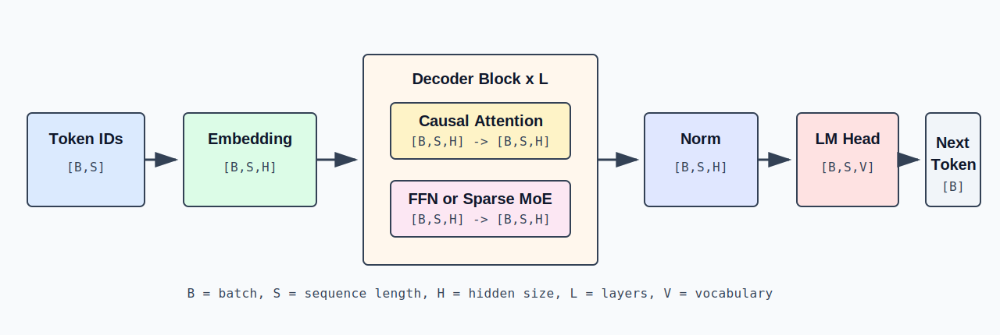
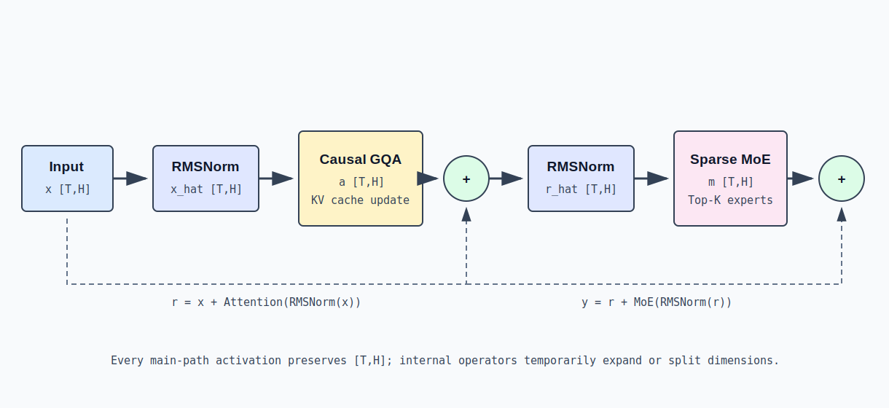

[中文](./01-decoder-only-transformer.md) | [English](./01-decoder-only-transformer_EN.md)

# Decoder-only Transformer: From Token to Next Token

## 1. The Problem the Model Solves

A decoder-only language model receives a sequence of tokens:

```text
x_0, x_1, ..., x_(S-1)
```

And computes the conditional distribution of the next token at each position:

```text
P(x_t | x_0, x_1, ..., x_(t-1))
```

During training, all positions in the sequence can be computed in parallel, but each position can only attend to itself and earlier tokens. During inference, prefill processes the prompt in one pass, while decode appends one or a few tokens per step.

Modern generative LLMs universally use Decoder-only Transformers. The attention sublayer handles token-to-token information exchange, while the FFN or Sparse MoE sublayer handles per-token nonlinear feature transformation.

## 2. Overall Dataflow



The overall computation can be written as:

```text
input_ids
  -> token embedding
  -> Decoder Layer 0
  -> Decoder Layer 1
  -> ...
  -> Decoder Layer L-1
  -> final RMSNorm
  -> LM Head
  -> logits
  -> sampling
  -> next token ids
```

Logical shapes at each stage:

| Stage | Input | Output | Notes |
|---|---:|---:|---|
| Token IDs | `[B,S]` or packed `[T]` | Same as input | Integer vocabulary indices |
| Embedding | `[T]` | `[T,H]` | Lookup embedding row by token id |
| Decoder Layers | `[T,H]` | `[T,H]` | Repeated `L` times, main path width unchanged |
| Final RMSNorm | `[T,H]` | `[T,H]` | Independent normalization per token's hidden vector |
| LM Head | `[M,H]` | `[M,V]` | `M` = number of token rows actually needing logits |
| Sampling | `[M,V]` | `[B]` or multiple tokens | Temperature, Top-K, Top-P sampling |

Training typically sets `M=T`. Online autoregressive inference usually only needs logits at each request's last valid position, so `M=B` is common — there's no need to generate full-vocabulary logits for every row of the prompt.

## 3. Equal-Length Layout vs Packed Token Layout

Textbooks usually write hidden states as `[B,S,H]`. When sequences in a batch have different lengths, you can pad to a uniform length or pack only valid tokens:

```text
request 0: S_0 = 4
request 1: S_1 = 2
request 2: S_2 = 5
```

If all padded to `S_max=5`, shape is `[3,5,H]` with 4 padding rows. Packed representation keeps only valid tokens:

```text
T = 4 + 2 + 5 = 11
hidden_states.shape = [11,H]
```

The packed representation must additionally store each sequence's start offset and length. Attention uses these boundaries to restrict visibility; linear layers, normalization, and MoE can directly process contiguous `[T,H]`.

Both representations have the same mathematical meaning:

```text
dense training view: [B,S,H]
packed serving view: [T,H], T = sum_i S_i
```

## 4. Token Embedding

Embedding weights:

```text
W_embed: [V,H]
input_ids: [T]
```

The embedding lookup selects one row per id:

```text
X_0[t,:] = W_embed[input_ids[t],:]
X_0: [T,H]
```

This is not ordinary matrix multiplication — it's sparse row indexing. Each token transforms from an integer into a continuous vector of length `H`.

Position is not directly added as a `[T,H]` absolute position vector. Qwen3-MoE applies positional information to Q and K within Attention via RoPE.

## 5. One Decoder Layer



Most modern decoder-only models use a pre-norm residual structure. Let the layer input be `x_l [T,H]`:

```text
n_l = RMSNorm(x_l)                  [T,H]
a_l = CausalGQA(n_l)                [T,H]
r_l = x_l + a_l                     [T,H]
m_l = RMSNorm(r_l)                  [T,H]
f_l = SparseMoE(m_l)                [T,H]
x_(l+1) = r_l + f_l                 [T,H]
```

The main path is always `[T,H]`, making residual addition valid. Attention and MoE can change dimensions internally but must restore `[T,H]` before returning.

### 5.1 RMSNorm

For a single token vector `x in R^H`:

```text
rms(x) = sqrt(mean(x_i^2) + epsilon)
y_i = gamma_i * x_i / rms(x)
```

Where `gamma [H]` are learnable weights. RMSNorm does not mix across tokens or across hidden-dimension positions — it only computes scale over each token's `H` elements.

```text
input:  [T,H]
gamma:  [H]
output: [T,H]
```

### 5.2 Residual Connection

Residual connections add sublayer output back to the main path:

```text
r = x + sublayer(norm(x))
```

This requires the two terms to have exactly the same shape. Its purpose is to preserve the original representation and provide short gradient paths for deep networks. In inference, it also determines how kernel fusion and temporary buffers are organized.

## 6. Attention vs MoE: Responsibility Boundaries

### Attention: Cross-Token Mixing

Token `t`'s Attention output depends on visible historical tokens:

```text
a_t = sum_j alpha_(t,j) * v_j, j <= t
```

Thus Attention exchanges information along the sequence dimension. It requires positions, causal masks, and historical KV Cache.

### MoE: Per-Token Transformation

The MoE router selects experts based on each token's hidden vector. Each expert's internal MLP does not read other tokens:

```text
f_t = sum_(e in TopK(t)) p_(t,e) * Expert_e(m_t)
```

MoE performs nonlinear transformations along the feature dimension; token-to-token coupling primarily comes from routing's parallel scheduling and communication, not mathematical token-level attention.

## 7. Final RMSNorm & LM Head

After `L` layers:

```text
X_L: [T,H]
X_final = RMSNorm(X_L): [T,H]
```

LM Head weights:

```text
W_lm: [V,H]
```

Selecting `M` rows of hidden states:

```text
H_selected: [M,H]
logits = H_selected @ W_lm^T
logits: [M,V]
```

Each `logits[m,v]` is the unnormalized score of the `m`-th position-to-predict for vocabulary token `v`. Probability:

```text
P(v) = softmax(logits / temperature)[v]
```

`argmax` is greedy decoding; Top-K and Top-P renormalize over a candidate subset then sample.

## 8. Prefill Dataflow

Suppose two requests with new input lengths 3 and 2:

```text
B = 2
extend lengths = [3,2]
T = 5
input_ids: [5]
positions: [5]
```

Each layer executes:

```text
hidden_states                 [5,H]
Q                             [5,Nq,D]
K_new, V_new                  [5,Nkv,D]
attention output              [5,H]
router logits                 [5,E]
top-k ids, top-k weights      [5,K], [5,K]
MoE output                    [5,H]
```

Current K/V are written to each layer's KV Cache. Attention only accesses each request's own history and currently visible prefix. In packed layout, although token rows are stored contiguously, metadata prevents cross-request attention.

## 9. Decode Dataflow

Normal decode inputs one token per active request per round:

```text
B_active = B
T = B
input_ids: [B]
positions: [B]
hidden_states: [B,H]
```

Each layer only computes new Q/K/V:

```text
Q_new: [B,Nq,D]
K_new: [B,Nkv,D]
V_new: [B,Nkv,D]
```

But each Query needs to read that request's historical KV Cache of length `L_ctx`:

```text
logical K_history: [L_ctx,Nkv,D]
logical V_history: [L_ctx,Nkv,D]
```

Thus decode's arithmetic input tokens are few, while historical KV reads grow with context length. Attention is often memory-bandwidth-bound; MoE still executes the router and selected expert matrix multiplications.

## 10. Complete Shape Example

The values below illustrate shape relationships, not a specific checkpoint:

```text
B=2, extend lengths=[3,2], T=5
H=4096, Nq=32, Nkv=8, D=128
E=64, K=4, Ie=1536, V=150000
```

Single-layer main path:

| Variable | Shape |
|---|---:|
| `input_ids` | `[5]` |
| `hidden_states` | `[5,4096]` |
| `q` | `[5,32,128]` |
| `k`, `v` | `[5,8,128]` |
| `attention_output` | `[5,4096]` |
| `router_logits` | `[5,64]` |
| `topk_ids`, `topk_weights` | `[5,4]` |
| dispatched expert rows | At most `5*4=20` rows, each width `4096` |
| `moe_output` | `[5,4096]` |

If only computing logits for each request's last position:

```text
selected_hidden: [2,4096]
logits: [2,150000]
sampled_ids: [2]
```

## 11. Parameters, Activations & Runtime State

Distinguish three data categories when understanding model execution:

| Type | Examples | Lifetime |
|---|---|---|
| Parameters | Embedding, QKV, expert, LM Head weights | Persistent after model loading |
| Current Activations | Hidden states, Q, router logits, expert output | One forward pass or one sublayer |
| Cross-Step State | Per-layer KV Cache, request lengths, cache indices | Across multiple decode steps |

Decoder Layer outputs are not independently preserved as history; decode reuses per-layer K/V, not all past layers' hidden states.

## 12. Key Structural Constraints

1. The residual main path must maintain `[T,H]`.
2. `Nq*D` typically equals `H`, while `Nkv*D` can be significantly smaller than `H`.
3. Causal Attention cannot read future tokens or cross-request tokens.
4. MoE parameter count can grow with expert count, but single tokens only activate Top-K experts.
5. Prefill computes multiple new tokens; decode typically computes one new token per request.
6. KV Cache belongs to request runtime state, not model weights.
