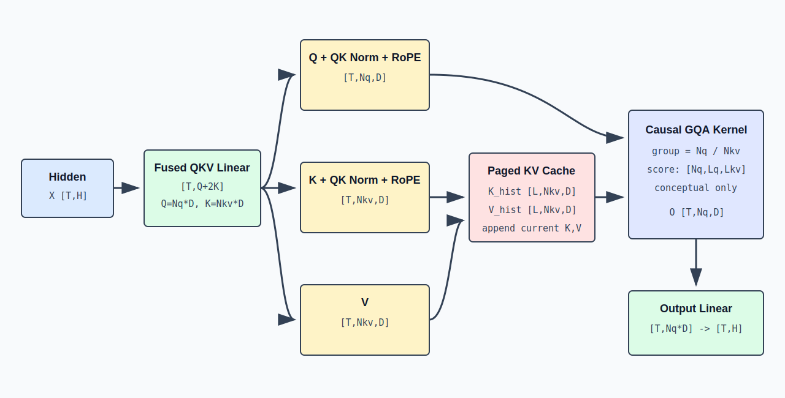

# Grouped-Query Attention：QKV、RoPE 与 KV Cache 的形状流

## 1. Attention 子层的输入输出

Attention 子层接收归一化后的 hidden states：

```text
X: [T,H]
```

并返回同形状结果：

```text
O: [T,H]
```

内部需要经历 QKV 投影、head 拆分、QK Norm、RoPE、因果 Attention、head 合并和输出投影。



## 2. QKV 投影

定义：

```text
Nq  = number of query heads
Nkv = number of key/value heads
D   = head dimension
Qdim  = Nq * D
KVdim = Nkv * D
```

三个线性投影的数学形式是：

```text
Q_flat = X @ Wq
K_flat = X @ Wk
V_flat = X @ Wv
```

权重和输出形状：

| 变量 | 形状 |
|---|---:|
| `X` | `[T,H]` |
| `Wq` | `[H,Qdim]` |
| `Wk` | `[H,KVdim]` |
| `Wv` | `[H,KVdim]` |
| `Q_flat` | `[T,Qdim]` |
| `K_flat`, `V_flat` | `[T,KVdim]` |

SGLang 的 `QKVParallelLinear` 把三个投影打包成一次逻辑操作：

```text
qkv = qkv_proj(X)
qkv: [T, Qdim + 2*KVdim]

q, k, v = split(qkv, [Qdim, KVdim, KVdim])
```

打包减少 kernel launch 和中间访存，不改变数学结果。

## 3. 从扁平维度恢复 head

```text
Q_flat [T,Nq*D]   -> Q [T,Nq,D]
K_flat [T,Nkv*D]  -> K [T,Nkv,D]
V_flat [T,Nkv*D]  -> V [T,Nkv,D]
```

`T` 是 packed token 数，不是序列长度。每个 token 有 `Nq` 个 Query heads，但只有 `Nkv` 个 Key/Value heads。

## 4. MHA、MQA 与 GQA

| 类型 | 关系 | 每个 Query head 如何使用 K/V |
|---|---|---|
| MHA | `Nq=Nkv` | 每个 Query head 有独立 K/V head |
| MQA | `Nkv=1` | 所有 Query heads 共享一个 K/V head |
| GQA | `1<Nkv<Nq` | 一组 Query heads 共享一个 K/V head |

GQA 的 group size：

```text
G = Nq / Nkv
```

Query head `h` 对应的 KV head：

```text
kv_head(h) = floor(h / G)
```

示例：`Nq=8, Nkv=2, G=4`。

```text
Q heads 0,1,2,3 -> KV head 0
Q heads 4,5,6,7 -> KV head 1
```

GQA 的主要推理价值是缩小 KV Cache。相同 `D` 和上下文长度下，其 KV Cache 大小约为 MHA 的 `Nkv/Nq`。

## 5. QK Norm

Qwen3-MoE 对每个 Q/K head 的 `D` 维向量执行 RMSNorm：

```text
Q: [T,Nq,D]   -> Q_norm: [T,Nq,D]
K: [T,Nkv,D]  -> K_norm: [T,Nkv,D]
```

归一化发生在最后一维：

```text
Q_norm[t,h,:] = RMSNorm(Q[t,h,:])
K_norm[t,h,:] = RMSNorm(K[t,h,:])
```

形状不变。QK Norm 控制点积前的向量尺度，避免不同 head 或层产生过大的 attention logits。

## 6. RoPE

RoPE 把位置 `p` 编码成二维子空间中的旋转。对一个偶数维向量中的一对分量：

```text
[x_2i']     [ cos(theta_p,i)  -sin(theta_p,i) ] [x_2i  ]
[x_2i+1'] = [ sin(theta_p,i)   cos(theta_p,i) ] [x_2i+1]
```

它作用于 Q 和 K，不作用于 V：

```text
positions: [T]
Q_norm: [T,Nq,D]   -> Q_rope: [T,Nq,D]
K_norm: [T,Nkv,D]  -> K_rope: [T,Nkv,D]
V:      [T,Nkv,D]  -> unchanged
```

同一 token 的所有 heads 使用同一位置 id，但不同频率维度使用不同旋转角。点积 `Q_rope(p) dot K_rope(q)` 因而携带相对位置 `p-q` 的信息。

## 7. 因果 Attention 的数学形状

先考虑单请求、单 Query head。当前 Query 长度为 `Lq`，可见 KV 长度为 `Lkv`：

```text
Q_h: [Lq,D]
K_h: [Lkv,D]
V_h: [Lkv,D]
```

分数：

```text
S_h = Q_h @ K_h^T / sqrt(D)
S_h: [Lq,Lkv]
```

加因果 mask 后：

```text
S_h[i,j] = -infinity, if key position j is later than query position i
```

概率和输出：

```text
A_h = softmax(S_h, dim=-1)   [Lq,Lkv]
O_h = A_h @ V_h              [Lq,D]
```

合并所有 Query heads：

```text
O_heads: [T,Nq,D]
O_flat:  [T,Nq*D]
```

生产级 FlashAttention 或 decode attention kernel 不会完整物化 `[Nq,Lq,Lkv]` 分数矩阵，而是分块计算 softmax 和加权和。该形状仍然是理解数学依赖的正确逻辑视图。

## 8. Packed Batch 中的序列边界

设两条请求的当前 token 被打包：

```text
request A: 3 tokens
request B: 2 tokens
Q packed: [5,Nq,D]
```

不能直接把它视为长度 5 的单序列。attention metadata 描述：

```text
request A rows: [0,3)
request B rows: [3,5)
sequence lengths: [3,2]
prefix lengths: [prefix_A,prefix_B]
KV cache locations: per-request page/index mapping
```

Kernel 根据 metadata 为每条请求构造独立可见区间。A 的 Query 不会读 B 的 K/V，B 也不会读 A。

## 9. KV Cache 写入

每个 Decoder Layer 都有独立 K/V Cache。当前层生成：

```text
K_new: [T,Nkv,D]
V_new: [T,Nkv,D]
```

逻辑上，对请求 `r` 的 token 位置 `p`：

```text
K_cache[layer,r,p,:,:] = K_new[token_row,:,:]
V_cache[layer,r,p,:,:] = V_new[token_row,:,:]
```

Serving 系统通常不分配连续 `[B,Lmax,Nkv,D]`。Paged KV Cache 把 token 位置映射到物理 slot：

```text
request token position
  -> req_to_token mapping
  -> physical token slot
  -> layer K/V storage
```

物理布局由 backend 决定，逻辑上每个历史 token 仍拥有 `[Nkv,D]` 的 K 和 V。

## 10. Prefill Attention

对一条无缓存、长度 `S` 的 prompt：

```text
Q: [S,Nq,D]
K: [S,Nkv,D]
V: [S,Nkv,D]
logical scores: [Nq,S,S]
```

因果可见范围是下三角。第 `i` 行只能读取 `[0,i]`。

若已有 prefix cache，prefix 长度为 `P`，本轮 extend 长度为 `E`：

```text
Q_new: [E,Nq,D]
K_new,V_new: [E,Nkv,D]
K_visible,V_visible: [P+E,Nkv,D]
logical scores: [Nq,E,P+E]
```

只为新 token 计算 Query；历史 prefix 的 K/V 直接从 cache 读取。

## 11. Decode Attention

普通 decode 对每条请求只有一个新 token：

```text
Lq = 1
Q_new: [1,Nq,D]
K_new,V_new: [1,Nkv,D]
K_visible,V_visible: [Lctx,Nkv,D]
logical scores: [Nq,1,Lctx]
```

Batch 中 `B` 条请求打包后：

```text
Q_new: [B,Nq,D]
K_new,V_new: [B,Nkv,D]
```

每条请求的 `Lctx` 可以不同。decode kernel 根据请求到 KV slot 的映射读取各自历史。

## 12. 输出投影

Attention 各 head 输出合并：

```text
O_heads: [T,Nq,D]
O_flat: [T,Nq*D]
```

输出权重：

```text
Wo: [Nq*D,H]
O = O_flat @ Wo
O: [T,H]
```

若 `Nq*D=H`，输入输出宽度相同，但 `Wo` 仍负责跨 head 混合。

## 13. Tensor Parallel 下的局部形状

设 attention TP size 为 `Ptp`，并假设 `Nq` 可整除：

```text
Nq_local = Nq / Ptp
Qdim_local = Nq_local * D
```

若 `Nkv >= Ptp` 且可整除：

```text
Nkv_local = Nkv / Ptp
```

若 `Nkv < Ptp`，SGLang 会在部分 TP ranks 上复制 KV heads，使：

```text
Nkv_local = max(1, Nkv / Ptp)
```

单 rank 的典型形状：

```text
q: [T,Nq_local,D]
k: [T,Nkv_local,D]
v: [T,Nkv_local,D]
attn output local: [T,Nq_local*D]
```

`RowParallelLinear` 把局部 attention 输出投影回 hidden 分片/完整 hidden，并由层通信逻辑决定何时执行 all-reduce 或与后续通信融合。

## 14. 对应 SGLang 调用链

`Qwen3MoeAttention` 中的主要路径：

```text
forward(hidden_states, positions, forward_batch)
  -> forward_prepare(...)
     -> qkv_proj(hidden_states)
     -> apply_qk_norm_rope(qkv, positions, forward_batch)
        -> split q, k, v
        -> apply_qk_norm(q, k)
        -> rotary_emb(positions, q, k)
  -> forward_core(...)
     -> RadixAttention(q, k, v, forward_batch)
     -> o_proj(attn_output)
```

关键变量：

| 源码变量 | 逻辑形状 |
|---|---:|
| `hidden_states` | `[T,H]` |
| `qkv` | `[T,q_size+2*kv_size]` |
| `q` | `[T,q_size]`，backend 可解释为 `[T,Nq_local,D]` |
| `k`, `v` | `[T,kv_size]`，backend 可解释为 `[T,Nkv_local,D]` |
| `attn_output` | `[T,q_size]` |
| `output` | `[T,H]` 或通信前的等价局部表示 |

`fused_qk_norm_rope` 可以把 split、QK Norm 和 RoPE 合并到一个 kernel；`fused_set_kv_buffer_arg` 还可以在 RoPE 路径中直接写 KV buffer。融合改变 kernel 边界，不改变上述逻辑形状和依赖。

## 15. KV Cache 容量公式

不考虑对齐、量化和 allocator metadata，单请求的 KV Cache 字节数近似为：

```text
bytes = L * Sctx * 2 * Nkv * D * bytes_per_element
```

其中 `2` 对应 K 和 V。对 `B` 条请求：

```text
total_bytes = sum_r L * Sctx_r * 2 * Nkv * D * bytes_per_element
```

GQA 减小的是 `Nkv`，因此直接降低跨所有层、所有 token 的持久 KV 状态。
