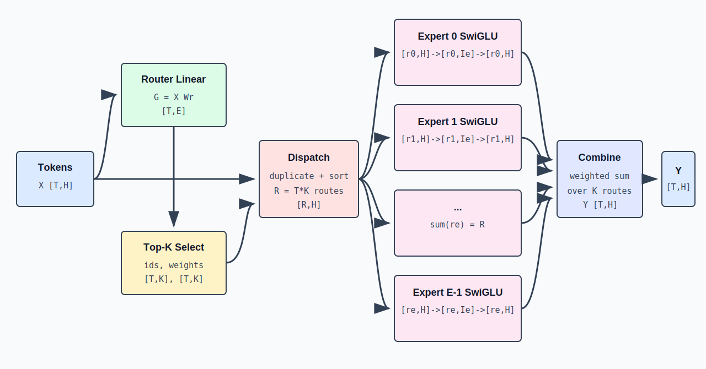

[中文](./03-sparse-moe-routing.md) | [English](./03-sparse-moe-routing_EN.md)

# Sparse MoE: Router, Top-K, Expert & Data Rearrangement

## 1. What MoE Replaces

A Dense Transformer's FFN uses the same MLP weights for every token:

```text
Y = FFN(X), X,Y: [T,H]
```

Sparse Mixture-of-Experts prepares `E` expert MLP groups, but each token only selects `K`:

```text
Y_t = sum_(e in TopK(t)) p_(t,e) * Expert_e(X_t)
```

When `K << E`, the model can have larger total parameter count while each token only executes a few experts.



## 2. MoE Main Path Shapes

```text
input X: [T,H]
router logits: [T,E]
topk ids: [T,K]
topk weights: [T,K]
dispatched rows: [R,H], R = T*K
expert outputs: [R,H]
combined output Y: [T,H]
```

Main path input and output are the same, but internally each token is replicated into `K` routes. This replication is logical routing; high-performance implementations may avoid explicit replication through indexing, sorting, and fused kernels.

## 3. Router Linear

The Router is a linear layer from hidden space to expert space:

```text
Wr: [H,E]
G = X @ Wr
G: [T,E]
```

`G[t,e]` is the raw score of token `t` assigned to expert `e`:

```text
router_logits = hidden_states @ router_weight
```

Router parameters are typically small relative to all expert parameters; replicating across ranks avoids needing split-communication for routing scores first.

## 4. Top-K Selection & Normalization

Independently select the top `K` experts per token:

```text
topk_ids[t,:] = indices_of_top_k(G[t,:])
```

Selected scores converted to weights. Common form:

```text
p[t,e] = softmax(G[t,:])[e]
```

Or normalized only over the selected K items:

```text
w[t,j] = exp(g[t,j]) / sum_(u in TopK(t)) exp(g[t,u])
```

Results:

```text
topk_ids: [T,K], integer
topk_weights: [T,K], floating point
```

## 5. Dispatch: From Token Order to Expert Order

Input is token-ordered. Expert kernels prefer expert-grouped ordering. Dispatch creates one route per `(token, selected_expert)`:

```text
route count R = T*K
```

Typical metadata for expert `e`:

```text
r_e = expert_offsets[e+1] - expert_offsets[e]
X_e: [r_e,H]
sum_e r_e = R
```

## 6. Concrete Routing Example

`T=4, E=4, K=2`:

| token | Top-2 expert ids | weights |
|---|---|---|
| `x0` | `[1,3]` | `[0.7,0.3]` |
| `x1` | `[0,1]` | `[0.6,0.4]` |
| `x2` | `[3,1]` | `[0.8,0.2]` |
| `x3` | `[0,2]` | `[0.55,0.45]` |

After sorting by expert:

```text
expert 0 <- x1, x3       r_0=2
expert 1 <- x0, x1, x2   r_1=3
expert 2 <- x3           r_2=1
expert 3 <- x0, x2       r_3=2
```

After expert computation, combine restores token order:

```text
y0 = 0.7*E1(x0) + 0.3*E3(x0)
y1 = 0.6*E0(x1) + 0.4*E1(x1)
y2 = 0.8*E3(x2) + 0.2*E1(x2)
y3 = 0.55*E0(x3) + 0.45*E2(x3)
```

Final `Y=[y0,y1,y2,y3]`, shape restored to `[4,H]`.

## 7. Single Expert SwiGLU

Modern MoE typically uses gated SwiGLU experts. For `X_e [r_e,H]`:

```text
gate = X_e @ W_gate      [r_e,Ie]
up   = X_e @ W_up        [r_e,Ie]
mid  = SiLU(gate) * up   [r_e,Ie]
out  = mid @ W_down      [r_e,H]
```

Weight shapes:

```text
W_gate: [H,Ie]
W_up:   [H,Ie]
W_down: [Ie,H]
```

Production implementations often pack `gate_proj` and `up_proj`:

```text
gate_up = X_e @ W_gate_up          [r_e,2*Ie]
gate, up = split(gate_up, 2)       [r_e,Ie], [r_e,Ie]
```

One expert's dataflow: `[r_e,H] -> [r_e,2*Ie] -> [r_e,Ie] -> [r_e,H]`

## 8. Combine

Expert output is expert/route-ordered. Combine uses `route_token_id` to restore token order and `route_weight` for weighted accumulation:

```text
Y[t,:] = sum_(r: token(r)=t) route_weight[r] * expert_output[r,:]
Y: [T,H]
```

Combine simultaneously performs inverse permutation and reduction. Each token has exactly `K` valid routes, so each output row merges `K` expert results.

## 9. Expert Parallel

When expert parameters can't fit on a single GPU, distribute experts across `Pep` ranks:

```text
E_local = E / Pep
```

After routing, each rank's tokens may select remote experts. Dataflow becomes:

```text
local tokens [T_local,H]
  -> local router/top-k
  -> dispatch + all-to-all
  -> received expert rows [R_local,H]
  -> local experts
  -> combine + all-to-all
  -> local token outputs [T_local,H]
```

### 9.1 Send Volume Depends on Routing

Rows sent from rank `i` to rank `j` are not fixed — they depend on which tokens select which experts. Hot experts cause load imbalance.

## 10. TP vs EP

| Parallelism | What's Split | Token Cross-Rank Movement | Main Communication |
|---|---|---|---|
| Tensor Parallel | Dimensions of same weight matrix | Usually no ownership change by routing | all-reduce / reduce-scatter |
| Expert Parallel | Different experts | Yes, redistributed by Top-K target | all-to-all dispatch/combine |

## 11. Parameters vs Activation Compute

Single SwiGLU expert parameter count (ignoring bias):

```text
params_per_expert = 3*H*Ie
```

All experts:

```text
expert_params = E * 3*H*Ie
```

Single token activates `K` experts; its expert matmul compute scales with `K * 3*H*Ie`, not `E * 3*H*Ie`. But model weight memory still scales with `E`.

## 12. MoE in Prefill vs Decode

**Prefill**: Large `T`, each expert gets many rows — good GEMM utilization but larger all-to-all volume.

**Decode**: Small `T ≈ active_requests`. With small batches, `R=T*K` may be tiny and spread across many experts. Router, dispatch, communication, and kernel launch fixed overhead becomes proportionally significant.

## 13. Reference MoE Implementation Order

```text
router_logits = X @ W_router                 # [T,E]
topk_scores, topk_ids = topk(router_logits)  # [T,K], [T,K]
topk_weights = normalize(topk_scores)        # [T,K]

permuted_X, route_meta = dispatch(X, topk_ids)     # [R,H], R=T*K
permuted_Y = grouped_expert_swiglu(permuted_X, route_meta)  # [R,H]
Y = combine(permuted_Y, route_meta, topk_weights)  # [T,H]
```

## 14. Parallelizable Stage Decomposition

```text
Gate -> Select Experts -> Count Routes per Destination -> Dispatch All-to-All
  -> Grouped Expert GEMM -> Combine All-to-All -> Weighted Reduction
```

## 15. Three Quantities Not to Confuse

```text
E = total routed experts
K = experts activated per token
R = total expert routes this round, typically T*K
```

`E` determines total expert parameter scale, `K` determines per-token activation compute, `R` determines dispatch buffer and expert input row count.
