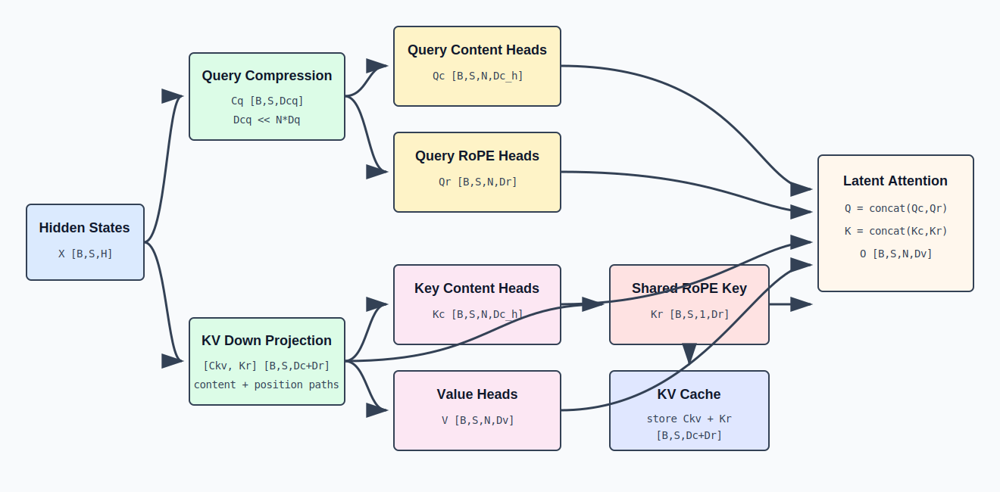

# Multi-head Latent Attention：低秩压缩与解耦位置编码

## 1. MLA 要解决的问题

标准 Multi-Head Attention 为每个历史 token、每一层保存完整 K 和 V：

```text
K_cache: [B,S,N,Dk]
V_cache: [B,S,N,Dv]
```

每个 token 的缓存元素数为：

```text
N * (Dk + Dv)
```

长上下文生成时，KV Cache 会成为显存容量和读取带宽的主要开销。Multi-head Latent Attention（MLA）的核心思想是：

> 不直接缓存每个 head 展开后的 K/V，而是缓存一个共享的低维 latent vector；需要 Attention 时再通过投影解释成各 head 的内容信息。



## 2. 统一符号

| 符号 | 含义 |
|---|---|
| `X` | 输入 hidden states，`[B,S,H]` |
| `N` | Attention head 数量 |
| `Dc` | KV latent compression dimension |
| `Dcq` | Query latent compression dimension |
| `Dh` | 每个 head 的 content key/query dimension |
| `Dr` | 每个 head 的 RoPE dimension |
| `Dv` | 每个 head 的 value dimension |
| `Ckv` | 压缩后的 KV latent，`[B,S,Dc]` |
| `Cq` | 压缩后的 Query latent，`[B,S,Dcq]` |

MLA 通常满足：

```text
Dc << N * (Dh + Dv)
```

因此缓存 `Ckv` 比缓存所有 head 的 K/V 更紧凑。

## 3. KV 下投影：把 hidden state 压缩为 latent

对每个 token 的 hidden vector `x in R^H`，内容 latent 与位置 key 可以由一次联合投影产生：

```text
[c_kv, k_rope_raw] = x @ W_DKV_R
```

批量形状：

```text
X:          [B,S,H]
W_DKV_R:    [H,Dc+Dr]
projected:  [B,S,Dc+Dr]
Ckv:        [B,S,Dc]
K_rope_raw: [B,S,Dr]
```

也可以使用两个独立但等价的逻辑投影分别生成 `Ckv` 和 `K_rope_raw`。`Ckv` 是从 `H` 维压缩到 `Dc` 维的内容表示；`K_rope_raw` 保留给位置编码路径。内容压缩不是无损复制，而是训练得到的低秩表示。

## 4. KV 上投影：从 latent 恢复内容 K 和 V

使用两个逻辑上独立的 up projection：

```text
K_content = Ckv @ W_UK
V         = Ckv @ W_UV
```

形状：

```text
W_UK: [Dc,N*Dh]
W_UV: [Dc,N*Dv]

K_content_flat: [B,S,N*Dh]
V_flat:         [B,S,N*Dv]

K_content: [B,S,N,Dh]
V:         [B,S,N,Dv]
```

各 head 的 K/V 不再由 `X` 直接独立投影，而是共享同一个 `Ckv`，再用不同的 up-projection 参数恢复。

## 5. Query 的低秩投影

Query 也可以采用低秩分解：

```text
Cq = X @ W_DQ
Q_full = RMSNorm(Cq) @ W_UQ
```

形状：

```text
W_DQ: [H,Dcq]
Cq:   [B,S,Dcq]
W_UQ: [Dcq,N*(Dh+Dr)]
Q_full: [B,S,N*(Dh+Dr)]
```

拆分：

```text
Q_content: [B,S,N,Dh]
Q_rope:    [B,S,N,Dr]
```

Query 不需要跨生成步缓存，因此 Query 压缩主要用于减少参数结构或改变投影计算，并不直接决定 KV Cache 容量。

## 6. 为什么 RoPE 需要解耦

若把 RoPE 直接施加到由 `Ckv @ W_UK` 恢复出的完整 K 上，位置相关旋转会阻碍矩阵吸收：旋转矩阵依赖 token position，不能简单并入固定的 `W_UK`。

MLA 因此把每个 Q/K head 分为两部分：

```text
Q_head = concat(Q_content, Q_rope)
K_head = concat(K_content, K_rope)
```

其中：

- `Q_content` 与 `K_content` 不执行 RoPE，负责语义内容匹配；
- `Q_rope` 与 `K_rope` 执行 RoPE，负责相对位置信息；
- `K_rope` 可以在各 heads 间共享，再广播到 `N` 个 heads。

形状：

```text
Q_content: [B,S,N,Dh]
Q_rope:    [B,S,N,Dr]
K_content: [B,S,N,Dh]
K_rope:    [B,S,1,Dr] -> broadcast [B,S,N,Dr]
```

最终每个 head 的 Query/Key dimension 为：

```text
Dqk = Dh + Dr
```

## 7. MLA Attention 分数

对 head `n`、query position `i`、key position `j`：

```text
score[n,i,j]
  = Q_content[n,i] dot K_content[n,j]
  + Q_rope[n,i] dot K_rope[j]
```

缩放后：

```text
score = score / sqrt(Dh + Dr)
```

再加因果 mask 并执行 softmax：

```text
alpha[n,i,:] = softmax(masked_score[n,i,:])
```

输出：

```text
O[n,i,:] = sum_j alpha[n,i,j] * V[n,j,:]
O: [B,S,N,Dv]
```

合并 heads 后通过输出投影恢复 `[B,S,H]`。

## 8. 朴素实现：先恢复 K/V 再做 Attention

最直接的实现：

```text
Ckv = X @ W_DKV                         [B,S,Dc]
Kc = reshape(Ckv @ W_UK)                [B,S,N,Dh]
V  = reshape(Ckv @ W_UV)                [B,S,N,Dv]

Q  = build_query(X)                     [B,S,N,Dh+Dr]
K  = concat(Kc, broadcast(K_rope))      [B,S,N,Dh+Dr]

O = softmax(Q @ K^T + mask) @ V
```

该实现数学清晰，但 decode 时如果每轮都为全部历史 latent 恢复完整 K/V，就会失去压缩缓存带来的带宽优势。

## 9. 矩阵吸收：不显式恢复内容 K

对单个 head，内容分数为：

```text
q_c dot k_c
= q_c dot (c_kv @ W_UK)
```

利用结合律：

```text
q_c dot (c_kv @ W_UK)
= (q_c @ W_UK^T) dot c_kv
```

定义 latent query：

```text
q_latent = q_c @ W_UK^T
q_latent: [B,Lq,N,Dc]
```

内容分数可以直接与缓存的 `Ckv [B,Lkv,Dc]` 点积：

```text
content_score: [B,N,Lq,Lkv]
```

这样无需为历史 token 物化 `K_content [B,Lkv,N,Dh]`。

## 10. 矩阵吸收：不显式恢复历史 V

朴素 value 聚合：

```text
o = sum_j alpha_j * v_j
v_j = c_j @ W_UV
```

利用线性性：

```text
o = sum_j alpha_j * (c_j @ W_UV)
  = (sum_j alpha_j * c_j) @ W_UV
```

因此可先在 latent space 聚合：

```text
o_latent = alpha @ Ckv       [B,Lq,N,Dc]
o_head = o_latent @ W_UV     [B,Lq,N,Dv]
```

历史 Value heads 无需完整展开。实际实现还可以把 `W_UV` 与后续输出投影进一步组合，以减少中间张量。

## 11. 压缩 KV Cache 保存什么

解耦 RoPE 后，每个历史 token 需要保留：

```text
Ckv:    [Dc]
K_rope: [Dr]
```

单 token、单层缓存元素数：

```text
MLA cache elements = Dc + Dr
```

而标准 MHA 为：

```text
MHA cache elements = N * (Dk + Dv)
```

GQA 为：

```text
GQA cache elements = Nkv * (Dk + Dv)
```

MLA 的压缩比例近似为：

```text
(Dc + Dr) / (N * (Dk + Dv))
```

具体收益由 latent dimension、RoPE dimension、dtype、内存对齐和实现策略共同决定。

## 12. Decode 时的数据流

设本轮每条序列只有一个新 token：

```text
X_new: [B,1,H]
```

生成并写入新状态：

```text
Ckv_new:    [B,1,Dc]
K_rope_new: [B,1,Dr]
```

缓存增长为：

```text
Ckv_cache:    [B,Sctx,Dc]
K_rope_cache: [B,Sctx,Dr]
```

当前 Query：

```text
Q_content: [B,1,N,Dh]
Q_rope:    [B,1,N,Dr]
```

吸收后的内容路径：

```text
Q_content -> latent query [B,1,N,Dc]
latent query x Ckv_cache -> content scores [B,N,1,Sctx]
```

位置路径：

```text
Q_rope x K_rope_cache -> position scores [B,N,1,Sctx]
```

两项相加后 softmax，再在 latent space 聚合 `Ckv_cache`，最后映射为各 head 输出。

## 13. Prefill 时的数据流

prefill 对 `S` 个 token 并行计算：

```text
Ckv: [B,S,Dc]
Q_content: [B,S,N,Dh]
Q_rope: [B,S,N,Dr]
K_rope: [B,S,Dr]
```

prefill 的计算密度较高，可以选择：

1. 展开 K/V 后使用标准矩阵 Attention；
2. 在 latent space 直接计算；
3. 根据 shape 和硬件采用混合实现。

三种实现必须满足相同的因果 mask 和数学映射，但中间张量、算子形态和内存流量不同。

## 14. 低秩结构的参数含义

KV 投影被分解为：

```text
X [H] -> Ckv [Dc] -> K/V heads [N*(Dh+Dv)]
```

等价权重矩阵具有分解形式：

```text
W_KV_effective = W_DKV @ W_UKV
```

其秩上界不超过 `Dc`。这给模型加入了结构性低秩约束。`Dc` 越小，缓存和计算越省，但表达瓶颈越强；`Dc` 越大，表达能力更接近完整投影，但压缩收益下降。

## 15. MLA、MHA、GQA 的结构对比

| 结构 | Query heads | 缓存状态 | head 间共享方式 |
|---|---:|---|---|
| MHA | `N` | 完整 `N` 组 K/V | 不共享 |
| MQA | `N` | 1 组 K/V | 所有 Q heads 共享同一 K/V |
| GQA | `N` | `Nkv` 组 K/V | 每组 Q heads 共享 K/V head |
| MLA | `N` | 共享 latent + position key | 各 head 通过 up projection 解释同一 latent |

GQA 通过减少 KV head 数量压缩缓存；MLA 通过低秩 latent 表示压缩缓存。两者的共享机制不同。

## 16. MLA 的关键正确性条件

1. `W_DKV` 与 `W_UK/W_UV` 必须共同训练，latent 不是事后无损压缩。
2. RoPE content 与 position 子空间必须按设计拆分，否则矩阵吸收不成立。
3. 因果 mask 仍作用在 token 位置维，latent 压缩不会改变自回归可见性。
4. 缓存必须同时保存内容 latent 和无法被固定矩阵吸收的位置 key。
5. 吸收式与展开式实现应在数值误差范围内产生等价结果。
