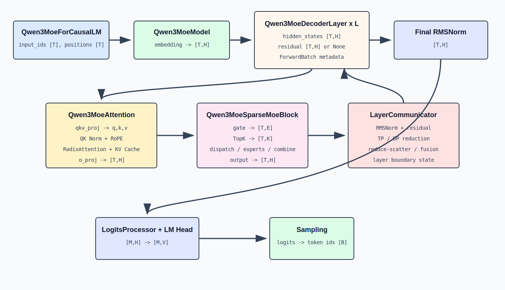

# Qwen3-MoE 在 SGLang 中的执行过程

## 1. 模型类依赖

Qwen3-MoE 的模型入口位于 `python/sglang/srt/models/qwen3_moe.py`。其主要类依赖为：

```text
Qwen3MoeForCausalLM
  owns Qwen3MoeModel
    inherits Qwen2MoeModel execution skeleton
    owns L instances of Qwen3MoeDecoderLayer
      owns Qwen3MoeAttention
        owns QKVParallelLinear
        owns RMSNorm for Q and K
        owns RotaryEmbedding
        owns RadixAttention
        owns RowParallelLinear as o_proj
      owns Qwen3MoeSparseMoeBlock
        owns ReplicatedLinear as gate
        owns TopK
        owns backend-selected experts implementation
      owns LayerCommunicator
        coordinates RMSNorm, residual and parallel reductions
```



## 2. Forward 的输入

`Qwen3MoeForCausalLM.forward` 接收：

```text
input_ids: [T]
positions: [T]
forward_batch: ForwardBatch
input_embeds: optional [T,H]
```

`T` 取决于 forward mode：

| 模式 | `T` 的含义 |
|---|---|
| Prefill / Extend | 所有请求本轮新计算 token 数之和 |
| Decode | 通常等于活跃请求数 |
| Mixed | extend tokens 与 decode tokens 的合计 |
| Speculative verify | 所有待验证 draft tokens 的合计 |

`ForwardBatch` 不只是普通 batch 容器。它携带 attention backend 所需的请求长度、cache location、forward mode、采样位置、并行 metadata 等信息。

## 3. Embedding 与 layer loop

`Qwen3MoeModel` 复用 `Qwen2MoeModel.forward` 的执行骨架。

第一 pipeline rank 执行：

```text
hidden_states = embed_tokens(input_ids)
hidden_states: [T,H]
residual = None
```

随后遍历本 pipeline rank 拥有的层：

```text
for i in range(start_layer, end_layer):
    hidden_states, residual = layers[i](
        positions,
        hidden_states,
        forward_batch,
        residual,
    )
```

如果使用 Pipeline Parallel，中间 rank 不执行 embedding，而是从 `PPProxyTensors` 接收：

```text
hidden_states: [T,H]
residual: [T,H]
```

最后一个 pipeline rank 执行 final RMSNorm 和 LM Head。

## 4. 为什么同时传 `hidden_states` 和 `residual`

数学表达通常立即执行：

```text
y = x + sublayer(norm(x))
```

生产实现可能延迟或融合 residual add 与 RMSNorm，以减少显存读写和通信。于是 layer boundary 可以用两个张量表示尚未完全合并的状态：

```text
effective state = hidden_states + residual
```

具体是否已合并由 `LayerCommunicator` 的执行路径决定。两者逻辑形状均为 `[T,H]`。

`prepare_attn_and_capture_last_layer_outputs`：

1. 处理上一层输出的通信结果；
2. 完成或融合 residual add 与 input RMSNorm；
3. 产生 Attention 输入；
4. 必要时捕获中间层 hidden states，供投机解码使用。

`prepare_mlp`：

1. 接收 Attention 输出；
2. 合并 Attention residual；
3. 执行 post-attention RMSNorm；
4. 产生 MoE 输入 `[T,H]`。

`postprocess_layer` 处理 MoE 输出后的 residual 和并行 reduction，使状态满足下一层输入约定。

## 5. 单层完整调用链

`Qwen3MoeDecoderLayer.forward` 的主路径：

```text
hidden_states, residual
  -> layer_communicator.prepare_attn_and_capture_last_layer_outputs
     attention_input [T,H]
  -> self_attn(positions, attention_input, forward_batch)
     attention_output [T,H]
  -> layer_communicator.prepare_mlp
     mlp_input [T,H]
  -> self.mlp(mlp_input, forward_batch, ...)
     mlp_output [T,H]
  -> layer_communicator.postprocess_layer
     next hidden_states [T,H], next residual [T,H]
```

整个 Decoder Layer 不改变 token 行数 `T`，也不改变逻辑 hidden size `H`。

## 6. Attention 的 prepare/core 分解

`Qwen3MoeAttention.forward` 被拆为：

```text
forward_prepare
  -> qkv projection
  -> q/k/v split
  -> QK Norm
  -> RoPE

forward_core
  -> RadixAttention
  -> output projection
```

中间状态：

```text
inner_state = (q, k, v, forward_batch)
```

拆分的意义是让图执行、双流、硬件特定融合或编译路径能把 prepare 与 core 作为独立执行单元，同时保留明确的数据依赖。

### 6.1 Native 路径

```text
qkv, _ = qkv_proj(hidden_states)
q, k, v = apply_qk_norm_rope(qkv, positions, forward_batch)
```

逻辑形状：

```text
hidden_states: [T,H]
qkv: [T,q_size+2*kv_size]
q: [T,q_size]
k,v: [T,kv_size]
```

其中：

```text
q_size = Nq_local * D
kv_size = Nkv_local * D
```

### 6.2 Fused 路径

当 dtype、head dimension 和 RoPE 类型满足条件时，`fused_qk_norm_rope` 在一个 kernel 中完成：

```text
qkv buffer
  -> split view
  -> Q RMSNorm
  -> K RMSNorm
  -> RoPE(Q,K)
```

融合后的输出仍是 `q,k,v`。优化只减少 launch 和内存往返，不改变数据依赖。

## 7. RadixAttention 与模型层的边界

模型层计算 Q/K/V，但不直接决定使用 FlashInfer、FlashAttention、Triton 或其他 backend。它调用：

```text
self.attn(q, k, v, forward_batch, save_kv_cache=...)
```

`RadixAttention` 使用 `layer_id` 和 `forward_batch` 把模型层连接到：

1. 当前层的 KV Cache；
2. 请求到物理 KV slot 的映射；
3. prefill/decode 对应的 attention backend；
4. prefix cache 命中的历史 K/V；
5. speculative 或 graph 模式所需 metadata。

模型数学只声明“当前 Q 关注本请求可见的 K/V”；Serving runtime 决定这些 K/V 在哪块物理显存，以及使用哪个 kernel 读取。

## 8. KV 写入的两个时机

普通路径中，`RadixAttention` 接收当前 K/V 并写 cache：

```text
q,k,v -> RadixAttention(..., save_kv_cache=True)
```

融合路径可以在 RoPE 阶段通过 `fused_set_kv_buffer_arg` 直接写入 KV buffer。此时后续 Attention 避免重复写：

```text
save_kv_cache=False
```

代码通过以下逻辑防止漏写或重复写：

```text
must_save_kv = used_fused_qk_norm_rope_last_call
save_kv_cache = must_save_kv or not fused_set_kv_enabled
```

无论写入发生在哪个 kernel，当前 token 的 K/V 必须在本层 forward 完成时进入正确 cache slot。

## 9. MoE 的普通路径

`Qwen3MoeSparseMoeBlock.forward_normal`：

```text
num_tokens, hidden_dim = hidden_states.shape
hidden_states = hidden_states.view(-1, hidden_dim)

router_logits, _ = gate(hidden_states)   # [T,E]
topk_output = topk(hidden_states, router_logits)
final_hidden_states = experts(hidden_states, topk_output)
```

`experts(...)` 内部完成 dispatch、expert SwiGLU 和 combine。模型文件只依赖统一 MoE 接口。

若 TP 或 EP 路径需要后处理：

```text
final_hidden_states = parallel_all_reduce(final_hidden_states)
```

若通信与后续层融合，当前层可以设置 `_sglang_needs_allreduce_fusion`，把 reduction 推迟到合适边界。

## 10. MoE 的显式状态机路径

为了把通信与计算拆开，代码提供 `op_*` 方法。状态对象中的关键变量按以下顺序流动：

```text
hidden_states_mlp_input [T,H]
  -> router_logits [T,E]
  -> topk_output {ids [T,K], weights [T,K]}
  -> dispatch_output {expert-grouped rows and metadata}
  -> combine_input {expert outputs}
  -> hidden_states_after_combine [T,H]
  -> hidden_states_mlp_output [T,H]
```

每个 `state.pop(...)` 表示该阶段取得输入所有权，旧引用不再需要。这样可以缩短临时张量生命周期，并让 graph/pipeline 调度器明确知道阶段间依赖。

## 11. Final Norm 与 LogitsProcessor

所有 Decoder Layers 完成后，最后一个 PP rank 执行：

```text
hidden_states, _ = model.norm(hidden_states, residual)
hidden_states: [T,H]
```

随后：

```text
logits_processor(input_ids, hidden_states, lm_head, forward_batch)
```

`LogitsProcessor` 根据 forward mode 选择需要 logits 的 hidden rows。例如普通生成时，每条请求通常只取最后一个有效位置：

```text
hidden_states [T,H]
  -> selected_hidden [M,H], usually M=B
  -> lm_head
  -> logits [M,V]
```

这一步避免在长 prompt prefill 时产生巨大的 `[T,V]` 临时张量。

## 12. 一个端到端执行示例

设本轮 prefill 有两条请求：

```text
request A new tokens = 3
request B new tokens = 2
T=5
H=4096, Nq=32, Nkv=8, D=128
E=64, K=4, Ie=1536
```

进入模型：

```text
input_ids                         [5]
positions                         [5]
embed_tokens                      [5,4096]
```

进入某层 Attention：

```text
normalized hidden                 [5,4096]
qkv                               [5,6144]
  q_size  = 32*128 = 4096
  kv_size =  8*128 = 1024
  total   = 4096 + 2*1024 = 6144
q                                 [5,32,128]
k,v                               [5,8,128]
attention output before o_proj    [5,4096]
attention output after o_proj     [5,4096]
```

进入该层 MoE：

```text
mlp input                         [5,4096]
router logits                     [5,64]
topk ids / weights                [5,4], [5,4]
logical routes                    20
expert e input                    [r_e,4096]
expert gate/up                    [r_e,1536] each
expert output                     [r_e,4096]
combined MoE output               [5,4096]
```

完成所有层后，仅选择两条请求的最后位置：

```text
selected hidden                   [2,4096]
lm_head weight                    [V,4096]
logits                            [2,V]
sampled token ids                 [2]
```

## 13. Tensor Parallel 下同一示例

若 `Ptp=4`：

```text
Nq_local = 32/4 = 8
Nkv_local = 8/4 = 2
q_size_local = 8*128 = 1024
kv_size_local = 2*128 = 256
local qkv output = [5,1024+2*256] = [5,1536]
```

每个 rank 只计算部分 heads：

```text
q_local: [5,8,128]
k_local,v_local: [5,2,128]
attn_output_local: [5,1024]
```

`o_proj` 是 Row Parallel Linear，各 rank 使用自身输入分片计算 partial output。partial outputs 必须通过 reduction 形成逻辑 `[5,4096]`，但 reduction 可以与 layer boundary 或 MoE 前后通信融合。

## 14. Expert Parallel 下同一示例

若 `Pep=8, E=64`，每 rank 持有约 8 个 experts。Router 仍为每个本地 token 产生全局 expert id：

```text
topk_ids: [5,4], values in [0,63]
```

20 条 routes 根据 expert owner 分桶并 all-to-all。rank `p` 接收属于其 8 个 experts 的 `R_p` 行：

```text
received rows on rank p: [R_p,4096]
sum_p R_p = global route count
```

本地 experts 完成后，combine 通信把输出送回 token owner，最终恢复本地 `[T_local,4096]`。

## 15. 权重加载时的 packed modules

Checkpoint 常把 Q/K/V 和 expert gate/up 分别保存。SGLang 运行时使用融合参数：

```text
q_proj, k_proj, v_proj -> qkv_proj
gate_proj, up_proj     -> gate_up_proj
```

`packed_modules_mapping` 和 `stacked_params_mapping` 指定每个 checkpoint 权重应装入融合参数的哪一段。融合权重布局必须与 forward 中的 split 顺序一致：

```text
qkv output split order = [Q, K, V]
gate_up split order = [gate, up]
```

权重加载映射错误不会改变 shape，却会彻底破坏语义，因此 packed layout 是实现正确性的一部分。

## 16. 变量生命周期

| 变量 | 产生阶段 | 最后使用阶段 | 是否跨 decode 轮保留 |
|---|---|---|---|
| `hidden_states` | embedding/上一层 | 下一层或 logits | 否 |
| `qkv` | QKV projection | split/QK Norm/RoPE | 否 |
| `q` | RoPE | 当前层 Attention | 否 |
| 当前 `k,v` | QKV projection | Attention 与 KV 写入 | KV 副本保留 |
| `router_logits` | gate | Top-K | 否 |
| `topk_output` | Top-K | dispatch/experts | 否 |
| expert route buffers | dispatch | combine | 否 |
| KV Cache | 每层 Attention | 后续 decode/prefix reuse | 是 |

模型 forward 的大部分激活只活一小段；KV Cache 是随请求长期存在并持续增长的主要运行时状态。

## 17. 源码阅读顺序

1. `Qwen3MoeForCausalLM.forward`：确认模型入口和 logits 出口。
2. `Qwen2MoeModel.forward`：确认 embedding、layer loop、PP 和 final norm。
3. `Qwen3MoeDecoderLayer.forward`：确认 Attention/MoE 与 residual 的顺序。
4. `Qwen3MoeAttention.forward_prepare/forward_core`：确认 QKV、RoPE、KV Cache 和输出投影。
5. `Qwen3MoeSparseMoeBlock.forward_normal`：确认 gate、Top-K 和 experts 接口。
6. `Qwen3MoeSparseMoeBlock.op_*`：确认 DeepEP 的 dispatch/combine 状态机。
7. `Qwen3MoeForCausalLM.load_weights`：确认 checkpoint 分片如何装入 fused weights。
