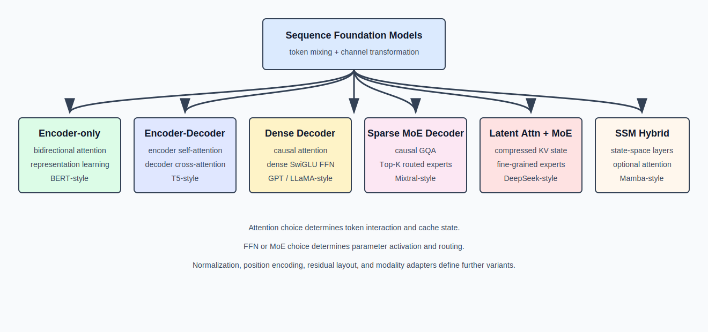

[中文](./05-architecture-families.md) | [English](./05-architecture-families_EN.md)

# LLM Architecture Families: Which Modules Changed

## 1. Unified Analysis Framework

Many model names exist, but the main structure can be analyzed along three dimensions:

1. **Token mixer**: How tokens exchange information — bidirectional Attention, causal Attention, Cross Attention, SSM.
2. **Channel mixer**: How a single token's hidden vector is nonlinearly transformed — Dense FFN, SwiGLU, Sparse MoE.
3. **State representation**: What is saved when processing history — full K/V, grouped K/V, latent KV, fixed-size SSM state.



## 2. Encoder-only Transformer

Encoder-only models use bidirectional self-attention. Every position can read all positions:

```text
visibility(i,j) = true, for all valid i,j
```

Single layer:

```text
X [B,S,H]
  -> Norm -> Bidirectional Self-Attention [B,S,H] -> Residual Add
  -> Norm -> Dense FFN [B,S,H] -> Residual Add
```

Characteristics:
- All token representations simultaneously fuse left and right context
- Suitable for encoding, classification, retrieval, token-level understanding
- Not naturally suited for left-to-right autoregressive generation
- Typically uses full-segment input, no autoregressive decode KV Cache needed

BERT-style models belong to this family.

## 3. Encoder-Decoder Transformer

Contains two layer stacks:

**Encoder**: `source_ids -> embedding -> bidirectional encoder layers -> memory [B,Ssrc,H]`

**Decoder**: `target_ids -> embedding -> causal self-attention -> cross-attention over encoder memory -> FFN -> target logits [B,Stgt,V]`

Cross Attention shapes:

```text
Q from decoder: [B,Stgt,N,D]
K,V from encoder memory: [B,Ssrc,Nkv,D]
scores: [B,N,Stgt,Ssrc]
```

Characteristics:
- Input sequence first encoded into fixed memory
- Output sequence autoregressively generated
- Decoder each layer needs both self-attention state and encoder cross-attention K/V
- Suitable for conditional generation: translation, structured transformation

T5-style models belong to this family.

## 4. Dense Decoder-only Transformer

Most common generative LLM backbone:

```text
Token Embedding
  -> L x [Causal Attention + Dense FFN]
  -> Final Norm -> LM Head
```

Per layer:

```text
r = x + Attention(Norm(x))
y = r + FFN(Norm(r))
```

Dense SwiGLU FFN:

```text
gate = X @ W_gate       [B,S,I]
up   = X @ W_up         [B,S,I]
mid  = SiLU(gate) * up  [B,S,I]
Y    = mid @ W_down     [B,S,H]
```

Parameter count and per-token compute both grow with FFN intermediate size `I`. All tokens pass through the same FFN weights.

GPT-style, LLaMA-style, and many dense Qwen-style models belong to this family.

## 5. Sparse MoE Decoder

Retains causal Attention, replaces Dense FFN with routed experts:

```text
r = x + Attention(Norm(x))
y = r + SparseMoE(Norm(r))
```

MoE layer:

```text
router logits: [B,S,E]
top-k ids/weights: [B,S,K]
logical expert routes: B*S*K
output: [B,S,H]
```

Total expert parameter count ≈ proportional to `E`; per-token activation compute ≈ proportional to `K`. Key structural characteristics:
- Parameter capacity decoupled from activation compute
- Token selects different parameter subnetworks based on content
- Must handle expert load imbalance and token dispatch
- Small batches cause expert GEMM fragmentation

Mixtral-style and various MoE Qwen-style models belong to this family.

## 6. Shared Expert & Routed Expert

Some MoE architectures use both shared and routed experts:

```text
Y = SharedExpert(X) + sum_(e in TopK(X)) p_e * RoutedExpert_e(X)
```

Where:
- Shared expert activates for all tokens, learning general capabilities
- Routed experts activate only for selected tokens, learning conditional features
- Shared path provides stable common transformation; routed path adds parameter capacity

Shapes:

```text
shared_output: [B,S,H]
routed_output: [B,S,H]
final_output:  [B,S,H]
```

## 7. MLA + MoE Hybrid

Combining MLA attention with Sparse MoE FFN yields today's most aggressive memory and compute optimization:

```text
r = x + MLA(Norm(x))           # Compressed KV cache
y = r + SparseMoE(Norm(r))     # Large capacity, sparse activation
```

MLA reduces KV Cache memory; MoE increases total parameters without proportionally increasing per-token compute.

## 8. SSM Hybrid

Some models replace or interleave Attention layers with State Space Models (Mamba, etc.):

```text
Layer_i = {
    Causal Attention, if i in attention_layers
    SSM,              if i in ssm_layers
}
```

Hybrids attempt to combine:
- Attention layers for high-precision long-range dependency
- SSM layers for efficient linear-time context processing
- Per-layer selection or fixed interleaving pattern

## 9. Architecture Comparison Summary

| Family | Token Mixer | Channel Mixer | Cached State |
|---|---|---|---|
| Encoder-only | Bidirectional Self-Attn | Dense FFN | None (full input) |
| Encoder-Decoder | Causal + Cross Attn | Dense FFN | Decoder KV Cache + Encoder Memory |
| Dense Decoder | Causal Self-Attn | Dense FFN | Per-layer KV Cache |
| MoE Decoder | Causal Self-Attn | Sparse MoE | Per-layer KV Cache |
| MLA + MoE | Latent Attention | Sparse MoE | Compressed Latent KV + RoPE Key |
| SSM Hybrid | Attention + SSM mix | Dense FFN or MoE | KV Cache + SSM State |

## 10. Why Serving Systems Must Understand Architecture Families

1. **KV Cache shape** differs across families — affecting memory pool design.
2. **Attention backend** must support the correct number of KV heads, RoPE placement, and MLA absorption.
3. **MoE routing and dispatch** require dedicated communication (all-to-all) and load-balancing logic.
4. **SSM state** is not KV Cache — it requires different pool, cache, and transfer design.
5. **Cross Attention** adds extra memory traffic from encoder to decoder in Encoder-Decoder models.
