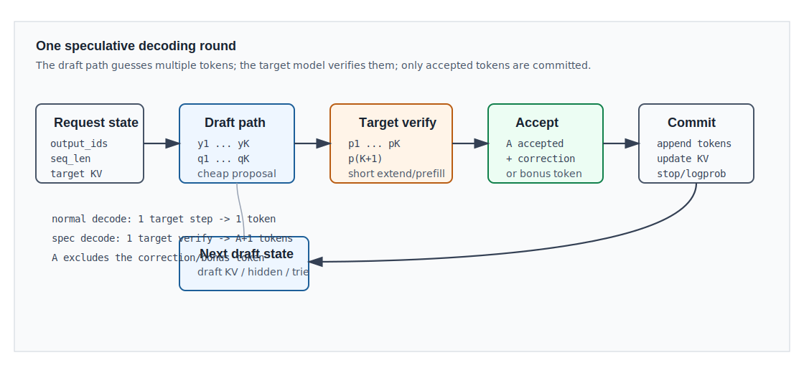

# 01. 投机解码的基本原理

## 1. 解决的问题

Decoder-only 语言模型是自回归模型。设当前前缀为：

```text
x = [x_0, x_1, ..., x_(S-1)]
```

普通 decode 每一轮只得到一个新 token：

```text
p(. | x) = TargetModel(x)
y ~ p(. | x)
x <- concat(x, y)
```

这意味着生成 `N` 个 token 至少需要 `N` 次 target model forward。即使每次 decode 的输入只有一个 token，大模型仍然要经历 embedding、所有 decoder layers、attention、MLP/MoE、LM head、sampling、KV 写入和调度开销。

投机解码的目标不是让 target model 变小，而是减少 target model 的生成轮数：

```text
draft path 先猜 K 个 token
target model 一次验证这些 token
系统一次提交多个 token
```

## 2. 一轮投机解码



一轮 speculative decoding 可以拆成六个阶段：

| 阶段 | 输入 | 输出 | 说明 |
|---|---|---|---|
| 1. 读取状态 | 已提交前缀、KV Cache、sampling 参数 | decode batch | 每条请求都有自己的长度、缓存位置和输出约束 |
| 2. Draft | 前缀状态 | 候选 token `y_1...y_K` | draft 可以是小模型、额外 heads、NGRAM、EAGLE、MTP 等 |
| 3. Target verify | 前缀 + 候选 token | target logits/probs | target 对候选路径上的每个位置给出分布 |
| 4. Accept | `p_i`、`q_i`、候选 token | accepted prefix length `A` | 严格采样用拒绝采样；greedy 用 token match |
| 5. Commit | accepted tokens + correction/bonus token | 更新后的请求状态 | 输出 token、更新长度、保留正式 KV |
| 6. Prepare next round | target hidden / draft KV / trie / graph buffers | 下一轮 draft 输入 | 不同算法的额外状态不同 |

关键点：target model 仍然决定最终输出。draft 只是提出候选，候选不被 target 接受时必须修正。

## 3. 三个角色

### 3.1 Target model

Target model 是最终要服务的模型。它定义目标条件分布：

```text
p_i(v) = P_target(v | x, y_1, ..., y_(i-1))
```

这行公式可以读成：

```text
在第 i 个候选位置上，
target model 看到正式前缀 x，以及前面已经假设成立的 draft token y_1...y_(i-1)，
然后给词表中每个 token v 一个概率。
```

| 记号 | 直观含义 |
|---|---|
| `p_i(v)` | target 在第 `i` 个候选位置认为 token `v` 应该出现的概率 |
| `x` | 已经正式提交的上下文前缀 |
| `y_1...y_(i-1)` | 当前候选位置之前的 draft token |
| `v` | 词表里的某个候选 token |

投机解码必须让最终输出等价于直接从 target model 逐 token 生成。严格 speculative sampling 的目标就是保持这个分布不变。

### 3.2 Draft path

Draft path 负责提出候选：

```text
q_i(v) = P_draft(v | x, y_1, ..., y_(i-1))
y_i ~ q_i
```

这里有两层意思：

```text
q_i(v): draft 在第 i 个位置给 token v 的概率
y_i ~ q_i: 真正提出的候选 y_i 是从 q_i 这个分布里采样出来的
```

如果是 greedy draft，也可以把 `y_i ~ q_i` 理解成：

```text
y_i = argmax_v q_i(v)
```

Draft path 的来源很多：

| Draft 来源 | 例子 | 特点 |
|---|---|---|
| 小模型 | STANDALONE draft model | 实现直观，但要加载额外模型和 KV |
| 目标模型中间特征 | EAGLE、EAGLE-2、EAGLE-3 | 接受率高，系统状态更复杂 |
| 多 token heads | Medusa、MTP | 避免完整小模型，但需要模型结构或训练支持 |
| 上下文检索 | NGRAM、prompt lookup、REST | 便宜，适合重复文本和代码 |
| 早退层 | LayerSkip/self-speculative | 同一模型浅层先猜，深层验证 |

一个好的 draft path 需要同时满足：

1. 比 target 便宜。
2. 和 target 分布足够接近。
3. 输出候选能被 target verify 高效验证。

### 3.3 Verifier / Committer

Verifier 使用 target logits 判断候选能接受到哪里。Committer 把结果写回正式请求状态：

```text
accepted tokens -> output_ids
accepted KV      -> target KV Cache
request length   -> seq_len + accepted_count
stop/logprob     -> 对每个新提交 token 做后处理
```

这一步看似只是“比较 token”，实际上是 serving 系统中最容易出错的部分，因为一个请求一轮可能提交 0、1、2、...、`K+1` 个 token。

## 4. 线性链验证的形状

设：

```text
B = batch size
K = 每条请求 draft token 数
V = vocab size
```

线性 speculative decoding 中，draft token 通常可以整理为：

```text
draft_tokens: [B,K]
draft_probs:  [B,K,V]    # 如果需要严格拒绝采样
target_probs: [B,K+1,V]  # K 个候选位置 + 末尾 bonus/correction 位置
```

第 `i` 个候选 token `y_i` 的语义是：

```text
y_i ~ q_i(. | prefix, y_1, ..., y_(i-1))
p_i(. | prefix, y_1, ..., y_(i-1)) = target verify logits at position i
```

target verify 的输入不是普通 decode 的 `[B]` 个新 token，而是每条请求多个候选 token：

```text
verify_input_ids: [B*K]        # packed linear layout
positions:        [B*K]
custom_mask:      允许每个候选位置只看 prefix + earlier draft tokens
```

如果所有 `K` 个 draft token 都接受，target verify 还可以提供一个 bonus token，也就是 target 在 `prefix + y_1...y_K` 后面的下一个分布。

## 5. Tree verification 的形状

线性链只有一个候选路径。很多现代方法会构建候选树：

```text
root
  ├─ token a
  │    ├─ token c
  │    └─ token d
  └─ token b
       ├─ token e
       └─ token f
```

树验证中，target verify 一次处理多个候选节点。每个节点只能关注：

```text
正式 prefix + 从 root 到当前节点的祖先节点
```

因此需要额外 metadata：

| Metadata | 作用 |
|---|---|
| `draft_token` | 所有候选节点的 token id |
| `retrieve_index` | 从候选节点映射到可提交路径 |
| `custom_mask` | 限制 tree attention 可见性 |
| `retrieve_next_token` | 当前节点的 token 子节点关系 |
| `retrieve_next_sibling` | 同层兄弟节点关系 |
| `positions` | 每个候选节点对应的逻辑位置 |

Tree verification 的优势是候选更丰富，target 可能接受更长路径；代价是 verify mask、KV slot、候选排序和图形捕获更复杂。

## 6. 加速模型

这一节的公式只做粗略估算，用来判断“投机解码什么时候值得开”。它不是精确 profiler。

### 6.1 普通 decode 成本

```text
普通 decode 总成本 ≈ 生成 token 数 × 每次 target decode 成本
```

写成符号是：

```text
cost_normal ≈ N × C_T
```

| 符号 | 含义 |
|---|---|
| `N` | 要生成的 token 数 |
| `C_T` | target model 普通 decode 一步的成本 |
| `cost_normal` | 不使用投机解码时的总成本 |

读法：如果生成 `N` 个 token，每个 token 都要跑一次 target decode，那么成本大约就是 `N` 次 target decode。

### 6.2 投机解码单轮成本

一轮投机解码要做三件事：

```text
1. draft 先猜 K 个 token
2. target 一次验证这些 token
3. 系统做调度、采样、KV 更新等额外处理
```

所以单轮成本可以写成：

```text
投机单轮成本 ≈ draft 成本 + target verify 成本 + 系统额外成本

cost_spec_round ≈ K × C_D + C_V(K) + C_overhead
```

| 符号 | 含义 |
|---|---|
| `K` | 本轮最多 draft 的 token 数 |
| `C_D` | draft 生成一个 token 的成本 |
| `C_V(K)` | target 一次验证 `K` 个候选 token 的成本 |
| `C_overhead` | mask、采样、KV、调度、同步等额外成本 |

读法：draft 猜得越多，draft 成本通常越高；target verify 一次看更多 token，也会更贵；除此之外还有工程开销。

### 6.3 一轮能提交多少 token

一轮投机解码提交的 token 数通常是：

```text
本轮提交 token 数 = 接受的 draft token 数 + 1
```

写成符号是：

```text
tokens_committed = A + 1
```

其中：

| 符号 | 含义 |
|---|---|
| `A` | 本轮被接受的 draft token 数 |
| `+1` | 如果中途拒绝，就是 correction token；如果全部接受，就是 bonus token |

例子：

```text
K = 4
draft = [a,b,c,d]

接受 [a,b]，拒绝 c，target 修正为 x
本轮提交 [a,b,x]

A = 2
tokens_committed = A + 1 = 3
```

### 6.4 粗略 speedup 怎么读

粗略 speedup 可以理解成：

```text
如果不用投机，这一轮提交的 token 本来要花多少 target decode 成本
----------------------------------------------------------------
投机解码这一轮实际花了多少成本
```

写成符号是：

```text
speedup ≈ ((平均接受 draft token 数 + 1) × target 单步成本)
          ------------------------------------------------------
          (draft 成本 + target verify 成本 + 系统额外成本)

speedup ≈ ((E[A] + 1) × C_T)
          ---------------------------
          (K × C_D + C_V(K) + C_overhead)
```

这条公式告诉我们四件事：

1. draft 越便宜越好。
2. 平均接受长度 `E[A]` 越长越好。
3. target verify `C_V(K)` 越接近一次普通 decode 越好。
4. 调度、KV、mask、采样、同步等 overhead 不能太大。

一个数字例子：

```text
假设:
  C_T = 10 ms
  K × C_D = 3 ms
  C_V(K) = 13 ms
  C_overhead = 2 ms
  平均 A = 3

不用投机生成 4 个 token 大约需要:
  (3 + 1) × 10 = 40 ms

投机一轮成本:
  3 + 13 + 2 = 18 ms

粗略 speedup:
  40 / 18 ≈ 2.2x
```

如果平均 `A` 只有 0，那么投机一轮只提交 1 个 token，却仍然付出了 draft 和 verify 成本，就很可能变慢。

## 7. 为什么 verify 不一定是 K 倍成本

target verify 看起来处理了 `K` 个候选 token，为什么不一定是 `K` 倍成本？

原因是 GPU 更喜欢较大的并行工作块。普通 decode 的每条请求只处理一个 query token，常常受 kernel launch、memory bandwidth 和小 batch 效率影响。验证多个短候选 token 时：

```text
query tokens: [B*K]
KV history:   prefix KV + candidate KV
```

Attention 和 MLP/MoE 可以在更大的 token 维度上并行执行，launch 次数也可能减少。只要 `K` 不过大，`C_V(K)` 可能明显小于 `K*C_T`。

但这不是必然成立。长上下文、巨大的 batch、复杂 tree mask、低接受率、LM head 开销、通信开销和 graph padding 都可能削弱收益。

## 8. 什么时候会变慢

投机解码会变慢的典型原因：

| 原因 | 现象 |
|---|---|
| draft 和 target 分布差异大 | 大量候选第 1 个或第 2 个 token 就被拒绝 |
| draft 太贵 | draft 计算吃掉 target step 省下的时间 |
| `K` 过大 | verify、KV、mask、graph padding 成本超过收益 |
| batch 已经很大 | 普通 decode 已经有足够并行度，投机带来的边际收益下降 |
| 输出约束复杂 | grammar、regex、tool call、stop condition 让多 token commit 更复杂 |
| 动态形状过多 | CUDA Graph / NPU Graph 难以复用，需要更多 eager path |
| KV 管理低效 | 被拒绝 token 的临时 KV 清理、搬运、重排开销过大 |

因此 speculative decoding 是吞吐优化，不是无条件加速按钮。它需要 workload、模型、draft 算法和 serving 实现共同匹配。

## 9. Exact 与 heuristic

投机推理常见两类目标：

| 类型 | 目标 | 验证规则 |
|---|---|---|
| Strict / lossless | 最终输出分布严格等于 target model | 使用拒绝采样或 greedy exact match |
| Heuristic / approximate | 更高吞吐或更低延迟，允许微小分布偏差 | 使用置信度阈值、top-k 路径选择、近似接受规则 |

严格投机采样的数学核心是：

```text
接受概率 = min(1, target 认为 y 的概率 / draft 认为 y 的概率)

如果拒绝:
    从 target 比 draft 更偏好的剩余概率里重新采样一个 token
```

下一讲会证明这条规则为什么能恢复目标分布。
