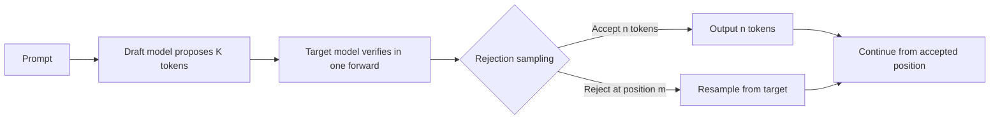

[中文](./01-speculative-decoding-principles.md) | [English](./01-speculative-decoding-principles_EN.md)

# Speculative Decoding Principles

## 1. The Problem: Sequential Decode Bottleneck

Standard autoregressive decode produces one token per forward pass:

```text
Step 1: model(prompt) -> token_1
Step 2: model(prompt + token_1) -> token_2
Step 3: model(prompt + token_1,2) -> token_3
...
```

Each step requires a full model forward. At low batch sizes, GPU utilization is poor because the forward is memory-bandwidth-bound.

## 2. The Idea: Draft, Then Verify

Speculative decoding accelerates this by:

1. **Draft**: Use a small/fast model to propose K candidate tokens
2. **Verify**: Run the large target model once to check all K tokens
3. **Accept/Reject**: Use rejection sampling to determine how many tokens to keep
4. **Repeat**: Continue from the last accepted position



## 3. Why This Works

The draft model is much smaller (e.g., 0.5B params vs 70B), so proposing K tokens is fast. The target model only runs once for K tokens instead of K times. If the draft is good, you get K tokens for the cost of ~1 target forward + 1 draft forward.

Speedup = `K * (T_target) / (T_target + T_draft * K)` where T = time per forward.

## 4. Rejection Sampling Intuition

For each draft token, compare:
- `p_draft(token | context)` — draft model's probability
- `p_target(token | context)` — target model's probability

If `p_target >= p_draft`: always accept (draft was conservative)
If `p_target < p_draft`: accept with probability `p_target / p_draft` (draft was overconfident)

This ensures the output distribution exactly matches the target model's distribution — speculative decoding is lossless.

## 5. SGLang Implementation

Key components in SGLang:
- **Draft worker**: Runs the draft model, proposes tokens
- **Target worker**: Runs the main model, verifies tokens
- **`spec_info`**: Carries draft tokens from draft worker to target worker
- **KV Cache management**: Draft KV is committed only after verification
- **`BatchResultProcessor`**: Handles accept/reject logic and token output

## 6. Draft Model Variants

| Method | Draft Source | Trade-off |
|---|---|---|
| EAGLE | Separate draft model trained to predict target hidden states | Higher accuracy, needs training |
| MTP (Multi-Token Prediction) | Additional prediction heads on target model | No separate draft model, lower overhead |
| NGRAM | N-gram cache from previous outputs | No model needed, lower accuracy |
| Medusa | Multiple extra heads on target model | Similar to MTP |
| REST | Retrieval-based speculative decoding | External knowledge source |
