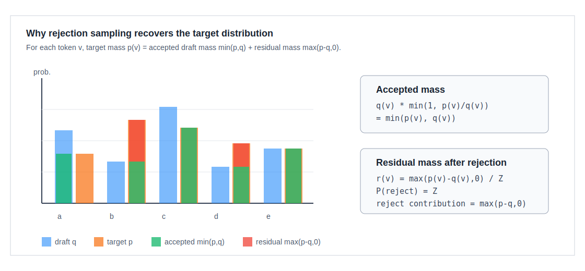

# 02. 投机采样的数学原理

## 1. 问题定义

设当前前缀为 `x`。Target model 给出的目标分布是：

```text
p(v) = P_target(v | x), v in vocabulary
```

Draft path 给出的提案分布是：

```text
q(v) = P_draft(v | x)
```

目标：先从 `q` 中采样候选 `y`，但最终输出的 token 分布必须等于 `p`。

如果直接输出 `y ~ q`，分布会变成 draft distribution，模型质量会改变。严格 speculative sampling 用拒绝采样修正这一点。

### 1.1 先把公式理解成概率表

可以先不要把 `p(v)`、`q(v)` 当成抽象公式，而是当成两张表：

| token `v` | target 概率 `p(v)` | draft 概率 `q(v)` |
|---|---:|---:|
| `A` | 0.50 | 0.20 |
| `B` | 0.30 | 0.50 |
| `C` | 0.20 | 0.30 |

这张表的意思是：

```text
target 更喜欢 A
draft 更喜欢 B 和 C
```

投机采样要做的事是：允许 draft 先提 token，但最终输出频率仍然要像 target 那样：

```text
A 出现 50%
B 出现 30%
C 出现 20%
```

所以后面的所有公式，本质上都在做一件事：

```text
把 draft 过度自信的概率削掉，
再把削掉的位置补给 target 更喜欢的 token。
```

### 1.2 拒绝采样到底在做什么

拒绝采样不是在判断“draft token 对不对”。它做的是概率校正。

更具体地说，draft 先用便宜模型提出一个 token。这个 token 有两种可能：

```text
1. target 也认可它:
   直接接受 draft token，省掉一次 target 逐步生成。

2. target 不够认可它:
   拒绝 draft token，然后从 target 还缺的概率里重新采样一个 correction token。
```

这里最容易困惑的是“拒绝”这个词。它不是说 draft token 一定语义错误，而是说：

```text
如果我们总是接受 draft 的这个 token，
最终输出分布会偏向 draft，而不是 target。
```

举个直观例子：

```text
target 只想让 B 出现 30%
draft 却让 B 出现 50%
```

如果 draft 抽到 `B` 就永远接受，那么 `B` 的最终出现率会太高。拒绝采样会做一件很朴素的事：

```text
draft 提出 B 的一部分情况接受；
draft 提出 B 的另一部分情况拒绝；
拒绝后，把这部分概率补给 target 更想要、但 draft 给少了的 token。
```

所以拒绝采样的核心问题不是：

```text
这个 token 是否“正确”？
```

而是：

```text
如果接受这个 token，会不会让最终输出频率偏离 target 分布？
```

### 1.3 “贡献”到底有什么用

后面会反复出现“接受贡献”和“补偿贡献”。它们不是 serving 系统里一定要显式保存的业务字段，而是用来回答一个问题：

```text
最终每个 token 的输出概率，到底从哪些路径来？
```

可以把它理解成账本：

```text
接受贡献:
    draft 抽到某个 token，并且它被接受后，
    给最终输出分布贡献了多少概率。

补偿贡献:
    draft 抽到某个 token 但被拒绝后，
    residual correction 又把多少概率补给了某个 token。
```

算这两类贡献的目的，是证明最终账本正好等于 target 分布：

```text
最终输出概率 = 接受贡献 + 补偿贡献 = target 概率
```

因此，“贡献”不是额外复杂度，而是用来解释拒绝采样为什么不会改变 target model 输出分布的工具。

## 2. 单 token 拒绝采样规则

先从 draft 分布采样一个候选：

```text
y ~ q
```

这行读作：

```text
候选 token y 是按照 draft 的概率 q 抽出来的。
```

然后用 target 分布检查这个候选。接受概率是：

```text
accept_prob(y) = min(1, p(y) / q(y))
```

为了更容易读，可以展开成普通话：

```text
接受概率 =
    target 给 y 的概率 / draft 给 y 的概率
    但最大不能超过 1
```

| 情况 | 比值 `p(y)/q(y)` | 接受概率 | 直观解释 |
|---|---:|---:|---|
| target 比 draft 更认可 `y` | 大于 1 | 1 | draft 难得猜到 target 喜欢的 token，直接接受 |
| target 和 draft 一样认可 `y` | 等于 1 | 1 | 两者一致，直接接受 |
| draft 比 target 更认可 `y` | 小于 1 | `p(y)/q(y)` | draft 对这个 token 太自信，只接受一部分 |

例如：

```text
target: p(B) = 0.30
draft:  q(B) = 0.50

accept_prob(B) = min(1, 0.30 / 0.50) = 0.60
```

读法：draft 提出 `B` 的频率太高了。为了最终仍然像 target 一样只给 `B` 30% 概率，draft 提出的 `B` 只能接受 60%。

采样一个均匀随机数 `u ~ Uniform(0,1)`：

```text
if u <= accept_prob(y):
    output y
else:
    output z ~ r
```

如果拒绝，就不能随便采样，否则分布会乱。需要从 residual distribution 里采样。它表示“target 还缺的那部分概率”：

```text
先看 target 比 draft 多出来多少:
    missing(v) = max(p(v) - q(v), 0)

再把 missing 重新归一化成概率:
    r(v) = missing(v) / Z

其中:
    Z = 所有 missing(v) 加起来
```

同一张概率表中：

| token | `p(v)` | `q(v)` | `missing(v)=max(p-q,0)` |
|---|---:|---:|---:|
| `A` | 0.50 | 0.20 | 0.30 |
| `B` | 0.30 | 0.50 | 0 |
| `C` | 0.20 | 0.30 | 0 |

这里 residual 只会采样 `A`，因为 draft 对 `A` 给少了，target 需要把这部分概率补回来。

这条规则的含义是：

1. 如果 draft 对 token `v` 的概率不超过 target，即 `q(v) <= p(v)`，那么 draft 提出的 `v` 总是可以接受。
2. 如果 draft 对 `v` 的概率高于 target，即 `q(v) > p(v)`，只能接受其中 `p(v)/q(v)` 的比例。
3. 被拒绝时，说明 draft 在某些 token 上分配了过多概率，需要从 target 比 draft 更偏好的 token 集合中补回来。

## 3. 完整单 token 流程

仍然使用这张概率表：

| token | target `p` | draft `q` |
|---|---:|---:|
| `A` | 0.50 | 0.20 |
| `B` | 0.30 | 0.50 |
| `C` | 0.20 | 0.30 |

目标是：虽然先让 draft 抽 token，但最终输出仍然要是：

```text
A: 50%
B: 30%
C: 20%
```

### 3.1 第一步：draft 先抽一个候选

Draft 按 `q` 抽样：

```text
抽到 A 的概率 = 0.20
抽到 B 的概率 = 0.50
抽到 C 的概率 = 0.30
```

如果直接输出 draft 抽到的 token，最终分布就是：

```text
A: 20%
B: 50%
C: 30%
```

这明显不是 target 分布。所以需要 target 来校正。

### 3.2 第二步：分别计算接受概率

接受概率是：

```text
接受概率 = min(1, target 概率 / draft 概率)
```

代入这三个 token：

| draft 抽到的 token | `p(token)` | `q(token)` | 接受概率 | 解释 |
|---|---:|---:|---:|---|
| `A` | 0.50 | 0.20 | 1.00 | draft 给 A 太少；一旦抽到 A，全部接受 |
| `B` | 0.30 | 0.50 | 0.60 | draft 给 B 太多；只接受 60% |
| `C` | 0.20 | 0.30 | 0.6667 | draft 给 C 偏多；只接受约 66.7% |

这一步的作用是限制 draft 过度自信的 token。

### 3.3 第三步：如果接受，直接输出 draft token

接受路径对最终输出的贡献如下：

| token | draft 抽到它的概率 | 被接受的概率 | 最终通过接受路径输出它的概率 |
|---|---:|---:|---:|
| `A` | 0.20 | 1.00 | 0.20 |
| `B` | 0.50 | 0.60 | 0.30 |
| `C` | 0.30 | 0.6667 | 0.20 |

这里的最后一列就是“接受贡献”：

```text
A 通过接受路径贡献了 0.20
B 通过接受路径贡献了 0.30
C 通过接受路径贡献了 0.20
```

注意一个很重要的现象：

```text
B 和 C 已经达到 target 想要的概率了。
A 还差 0.30。
```

也就是说，接受 draft 之后，最终分布暂时是：

```text
A: 20%   target 需要 50%，还差 30%
B: 30%   target 需要 30%，已经够了
C: 20%   target 需要 20%，已经够了
```

剩下的问题就是：这 30% 从哪里来？

### 3.4 第四步：如果拒绝，从 residual 里补回来

先看哪些 token 是 target 想要更多、draft 给少了：

| token | target `p` | draft `q` | target 还缺多少 |
|---|---:|---:|---:|
| `A` | 0.50 | 0.20 | 0.30 |
| `B` | 0.30 | 0.50 | 0 |
| `C` | 0.20 | 0.30 | 0 |

所以 residual distribution 是：

```text
residual 只会采样 A
```

再看拒绝会发生多少概率：

```text
draft 抽到 A: 接受概率 1.00，拒绝概率 0
draft 抽到 B: 接受概率 0.60，拒绝概率 0.40
draft 抽到 C: 接受概率 0.6667，拒绝概率 0.3333
```

拒绝总概率是：

```text
B 分支拒绝概率 = 0.50 × 0.40   = 0.20
C 分支拒绝概率 = 0.30 × 0.3333 = 0.10

总拒绝概率 = 0.20 + 0.10 = 0.30
```

这 `0.30` 正好是 `A` 还缺的概率。拒绝后 residual 会采样 `A`，于是补偿贡献为：

```text
A 通过拒绝补偿贡献 0.30
```

最终输出概率变成：

| token | 接受贡献 | 拒绝补偿贡献 | 最终输出概率 | target 概率 |
|---|---:|---:|---:|---:|
| `A` | 0.20 | 0.30 | 0.50 | 0.50 |
| `B` | 0.30 | 0 | 0.30 | 0.30 |
| `C` | 0.20 | 0 | 0.20 | 0.20 |

这就是拒绝采样的完整逻辑：

```text
接受路径负责保留 draft 中 target 认可的概率。
拒绝路径负责把 draft 多占的概率，补给 target 更想要的 token。
两条路径加起来，最终分布就回到 target。
```

### 3.5 用一条运行路径理解

真实运行时不是把上面表格全部展开，而是走其中一条随机路径。例如：

```text
1. draft 抽到 B
2. target 发现 B 在 draft 里概率太高
3. 接受概率 = 0.60
4. 抽随机数 u
```

如果：

```text
u = 0.42 <= 0.60
```

则接受：

```text
output B
```

如果：

```text
u = 0.91 > 0.60
```

则拒绝：

```text
从 residual 里采样 correction token
这个例子里 residual 只会采样 A
output A
```

所以同样是 draft 抽到 `B`：

```text
60% 情况输出 B
40% 情况改输出 A
```

这不是随便把 `B` 改成 `A`，而是在纠正 draft 相对 target 的概率偏差。

## 4. 图解：min 部分与 residual 部分



对每个 token，目标概率 `p(v)` 可以拆成两部分：

```text
target 概率
  = draft 能被接受的那部分
  + 拒绝后需要补回来的那部分

p(v)
  = min(p(v), q(v))
  + max(p(v) - q(v), 0)
```

其中：

| 公式片段 | 普通话解释 |
|---|---|
| `min(p(v), q(v))` | draft 对 `v` 的概率和 target 对 `v` 的概率，谁小取谁；这部分可以靠接受 draft 贡献 |
| `max(p(v)-q(v), 0)` | target 比 draft 多出来的概率；这部分只能在拒绝后补回来 |

只要这两部分加起来正好等于 `p`，最终输出就保持 target distribution。

## 5. 单 token 证明

对任意 token `v`，最终输出 `v` 的概率由两部分组成：

```text
最终输出 v 的概率
  = 接受 draft 时输出 v 的概率
  + 拒绝 draft 后补采样到 v 的概率
```

第一部分：draft 采样到 `v` 且被接受：

```text
接受贡献
  = draft 先抽到 v 的概率 × 抽到 v 后被接受的概率

  = q(v) × min(1, p(v)/q(v))

  = min(q(v), p(v))
```

最后一步读法：

```text
如果 draft 给 v 的概率更小，接受贡献就是 q(v)；
如果 target 给 v 的概率更小，接受贡献就是 p(v)。
所以接受贡献永远等于两者中较小的那一个。
```

第二部分：某个 draft token 被拒绝，然后 residual sample 采到 `v`：

```text
拒绝补偿贡献
  = 发生拒绝的概率 × residual 采到 v 的概率
```

先计算拒绝概率：

```text
发生拒绝的概率
  = 1 - 所有 token 的接受贡献加起来

  = 1 - sum_over_tokens min(q(token), p(token))
```

因为 `p` 和 `q` 都是概率分布，所以：

```text
sum p(token) = 1
sum q(token) = 1
```

于是“没有被接受的总概率”正好等于“target 比 draft 多出来的总概率”：

```text
发生拒绝的概率
  = sum_over_tokens max(p(token) - q(token), 0)
  = Z
```

所以：

```text
拒绝补偿贡献
  = Z × r(v)

  = Z × max(p(v)-q(v),0) / Z

  = max(p(v)-q(v),0)
```

两部分相加：

```text
最终输出 v 的概率
  = 接受贡献 + 拒绝补偿贡献

  = min(q(v),p(v)) + max(p(v)-q(v),0)

  = p(v)
```

因此，虽然候选来自 draft 分布 `q`，最终输出分布仍然是 target 分布 `p`。

### 5.1 用数字走一遍

仍然使用前面的概率表：

| token | target `p` | draft `q` | 接受贡献 `min(p,q)` | 补偿贡献 `max(p-q,0)` | 总贡献 |
|---|---:|---:|---:|---:|---:|
| `A` | 0.50 | 0.20 | 0.20 | 0.30 | 0.50 |
| `B` | 0.30 | 0.50 | 0.30 | 0 | 0.30 |
| `C` | 0.20 | 0.30 | 0.20 | 0 | 0.20 |

最后一列正好等于 target 分布 `p`。这就是拒绝采样“不改变 target 分布”的核心。

## 6. 多 token 链式验证

投机解码不是只猜一个 token，而是猜一串：

```text
y_1, y_2, ..., y_K
```

Draft 的链式分布为：

```text
第 i 个位置的 draft 分布:
    q_i(v) = P_draft(v | x, y_1, ..., y_(i-1))

第 i 个位置真正提出的 token:
    y_i ~ q_i
```

Target verify 一次算出每个位置的目标分布：

```text
第 i 个位置的 target 分布:
    p_i(v) = P_target(v | x, y_1, ..., y_(i-1))
```

读法：

```text
第 i 个位置不是只看原始前缀 x，
还要假设前面的 draft token y_1...y_(i-1) 已经被接受。
```

验证从 `i=1` 开始顺序进行：

```text
for i in 1..K:
    接受概率 = min(1, target 在位置 i 给 y_i 的概率 / draft 在位置 i 给 y_i 的概率)
    if rejected:
        从位置 i 的 residual 分布采样 correction token z
        提交 y_1...y_(i-1), z
        结束本轮投机
```

如果 `K` 个 draft token 全部接受，则 target verify 已经给出了下一个位置的分布：

```text
bonus 位置的 target 分布:
    p_(K+1)(v) = P_target(v | x, y_1, ..., y_K)
```

这时可以额外采样一个 bonus token：

```text
bonus token z 从 p_(K+1) 采样
提交 y_1...y_K, z
```

一轮最多提交 `K+1` 个 token。

## 7. 为什么 target verify 可以并行

链式验证的接受判断是顺序的，但 target logits 可以并行算出来。原因是 target verify 的每个位置都使用固定候选前缀：

```text
position 1 sees: x
position 2 sees: x, y_1
position 3 sees: x, y_1, y_2
...
position K sees: x, y_1, ..., y_(K-1)
```

这些条件前缀在 draft 阶段已经确定，因此 target 可以像一次短 prefill 一样并行处理 `y_1...y_K`。验证时只是在 target logits 上顺序决定接受到哪里。

这也是 speculative decoding 能加速的关键：

```text
sequential decision
parallel target computation
```

## 8. Greedy decoding 特例

当 temperature 为 0 或严格 greedy 时，目标分布退化成：

```text
p(v*) = 1, v* = argmax target_logits
p(v)  = 0, v != v*
```

这时不需要概率比值。验证规则变成：

```text
if draft_token_i == target_argmax_i:
    accept
else:
    reject and output target_argmax_i
```

也就是说 greedy speculative decoding 接受的是 draft 和 target 完全一致的最长前缀。

## 9. Top-k、Top-p、temperature 与 grammar

严格保持目标分布时，`p` 必须是最终想要服务的 target 分布。也就是说，所有 sampling processor 都应该被纳入 `p` 的定义：

```text
raw target logits
  -> temperature
  -> repetition penalty
  -> top-k / top-p
  -> grammar mask
  -> softmax
  -> p
```

Draft 分布 `q` 可以不同，但 verifier 必须知道候选 token 在 `q` 下的概率，才能计算 `p(y)/q(y)`。

### Grammar 约束

若 grammar 规定某个 token 非法，则：

```text
p(token) = 0
```

如果 draft 提出非法 token，它会被拒绝。工程上更好的做法是让 draft 也使用同样的 grammar mask，这样可以减少无效候选和拒绝率。

### Top-p / Top-k

Top-p 和 Top-k 会把部分 token 的 target 概率截断为 0。如果 draft 经常提出 target 截断后的 token，接受率会下降。严格实现仍然正确，但速度收益会变差。

## 10. Tree verification 的数学视角

Tree verification 不是改变接受规则，而是一次 target forward 验证更多候选条件前缀。候选节点 `n` 表示一条路径：

```text
path(n) = [y_1, y_2, ..., y_d]
```

target 在节点 `n` 上计算的是：

```text
P_target(. | x, y_1, ..., y_(d-1))
```

验证时只能提交一条从 root 出发的路径。系统会根据候选树结构、target 分布、draft 分布和采样随机数决定接受路径的前缀长度。树的价值在于提供更多分叉，让 target 更容易在一次 verify 中找到可接受的连续路径。

工程上，tree verification 必须额外维护：

```text
node_id -> token_id
node_id -> parent_id
node_id -> position
node_id -> attention visible ancestors
node_id -> path retrieval index
```

因此它比线性链更难实现，但在高质量 draft 或多分支 draft 中收益更高。

## 11. 数值与边界情况

### q(y) 很小

如果 `q(y)` 很小而 `p(y)` 较大，则 `p(y)/q(y)` 很大，接受概率截断为 1。因为 draft 很少提出这个 token，一旦提出通常应当接受。

### q(y)=0

若 `q(y)=0`，draft 不会采样到 `y`。如果 target 认为 `y` 有概率，它只能通过 residual distribution 在拒绝后被采样出来。

### residual normalization 很小

如果 `p` 和 `q` 非常接近：

```text
Z = 所有 token 的 max(p(token)-q(token), 0) 加起来
```

会很小。这代表拒绝概率很低。实现中需要注意浮点误差和归一化稳定性。

### 概率与 logits

理论公式写在概率空间，但实际系统常持有 logits。计算时一般会：

```text
target_logits -> log_softmax -> target_logprobs
draft_logits  -> log_softmax -> draft_logprobs
```

接受判断可以写成：

```text
原始判断:
    u <= p(y) / q(y)

取 log 后:
    log(u) <= log p(y) - log q(y)
```

读法：乘除法在概率很小时容易数值不稳定，把概率转成 log 后，除法变成减法，更适合 GPU kernel 和低精度计算。

## 12. 伪代码

```python
def speculative_sample(prefix, draft, target, K):
    draft_tokens = []
    draft_probs = []

    state = prefix
    for i in range(K):
        q = draft.next_distribution(state)
        y = sample(q)
        draft_tokens.append(y)
        draft_probs.append(q)
        state = state + [y]

    target_probs = target.verify(prefix, draft_tokens)  # K + 1 rows

    accepted = []
    for i, y in enumerate(draft_tokens):
        p_i = target_probs[i]
        q_i = draft_probs[i]

        if uniform() <= min(1.0, p_i[y] / q_i[y]):
            accepted.append(y)
            continue

        residual = normalize(max(p_i - q_i, 0))
        correction = sample(residual)
        return accepted + [correction]

    bonus = sample(target_probs[K])
    return accepted + [bonus]
```

这段伪代码描述的是严格线性 speculative sampling。实际 serving 系统还要处理 batch、KV Cache、tree mask、CUDA Graph、stop condition、logprob 和输出流。
