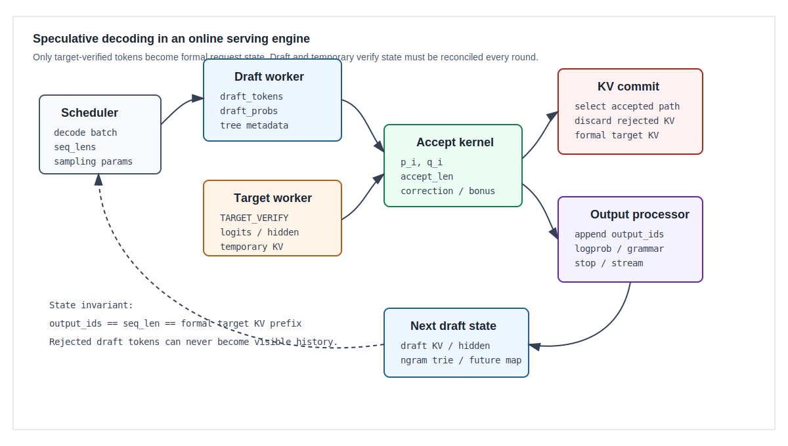

**中文** | [English](./03-serving-implementation-dataflow_EN.md)

# 03. Serving 系统中的实现与数据流

## 1. 为什么工程实现比数学复杂

数学上，投机解码只是：

```text
draft -> target verify -> accept/reject -> commit
```

在线 serving 中，它要和这些系统状态同时交互：

| 状态 | 为什么相关 |
|---|---|
| Request state | 一轮可能提交多个 token，请求长度和输出数组不是每轮只加 1 |
| Target KV Cache | verify 会产生候选 token 的 KV，但只有接受路径能成为正式 KV |
| Draft KV / draft hidden | draft path 下一轮需要和已提交 prefix 对齐 |
| Scheduler batch | 每条请求接受长度不同，下一轮 batch 的 `input_ids`、`seq_lens` 会变 |
| Sampling / grammar | 接受 token 必须经过 logit processor、grammar、stop condition |
| CUDA/NPU Graph | verify token 数和 batch size 动态变化，graph capture 需要 bucket |
| Metrics | 需要统计 accept length、accept histogram、吞吐和回退情况 |

因此，投机解码真正的难点是“状态一致性”。

## 2. 端到端架构



一轮 decode 的核心路径如下：

```text
Scheduler
  -> build decode batch
  -> Draft worker proposes candidates
  -> Target worker verifies candidates
  -> Accept kernel computes accepted path
  -> Committer updates request state and KV
  -> Output processor streams accepted tokens
  -> Draft state prepares next round
```

每条请求的状态必须满足一个不变量：

```text
output_ids、seq_len、target KV Cache 三者描述同一个已提交前缀
```

任何被拒绝的候选 token 都不能污染这个正式前缀。

## 3. Prefill 后的初始状态

请求完成 prefill 后，target KV Cache 已经保存 prompt 的每层 K/V：

```text
request.output_ids = []
request.prompt_len = S
request.seq_len    = S
target_kv[0:S]     = prompt KV
```

如果算法有 draft model，还可能需要 draft 侧状态：

```text
draft_kv[0:S]        # standalone / EAGLE-like draft model
last_target_hidden   # EAGLE/MTP 可能需要
ngram_table/trie     # NGRAM 可能需要
```

普通 decode 下一轮只输入最后一个 token；投机 decode 下一轮会先构造 draft 输入。

## 4. Draft 阶段

Draft 阶段输出候选 token。线性链的典型形状：

```text
B = 3
K = 4

draft_tokens: [3,4]
draft_probs:  [3,4,V]  # strict sampling 需要
```

例如：

```text
req0: [45, 18, 77, 31]
req1: [92, 10, 10, 10]
req2: [ 5,  6,  7,  8]
```

Tree draft 则会输出候选节点：

```text
draft_token:      [num_nodes]
parent_index:     [num_nodes]
position:         [num_nodes]
retrieve_index:   [B, max_path_len]
custom_mask:      flattened attention allow mask
```

Draft 阶段要回答两个问题：

1. target verify 应该检查哪些 token。
2. 如果这些 token 被接受，下一轮 draft path 需要什么状态继续生成。

## 5. Target verify 阶段

Target verify 把候选 token 当作一次短 extend/prefill 来跑。线性链场景可以想成：

```text
batch.input_ids = flatten(draft_tokens)    # [B*K]
batch.positions = per-request positions    # [B*K]
batch.forward_mode = TARGET_VERIFY
batch.spec_info = verify metadata
```

target attention 必须满足：

```text
候选位置 i 只能看 prefix 和 y_1...y_(i-1)
```

不能让候选位置看到未来候选 token，否则 target 分布就不再是：

```text
P_target(. | prefix, previous draft tokens)
```

Tree verification 需要更细的 `custom_mask`，确保每个节点只能看自己的祖先路径。

## 6. Target verify 的输出

Target verify 产生：

```text
target_logits: [B,K+1,V] 或 [num_nodes,V]
target_probs:  经过 sampling processor 后的概率
target_hidden: 可选，供 EAGLE/MTP 下一轮 draft 使用
target_kv:     候选位置对应的临时或可选择提交的 KV
```

其中 `K+1` 的最后一行是 all-accepted 后的 bonus token 分布。

严格采样还需要 draft probabilities：

```text
draft_probs: [B,K,V]
```

Greedy 验证只需要 target argmax：

```text
target_token_i = argmax(target_logits_i)
accept if target_token_i == draft_token_i
```

## 7. Accept 阶段

Accept 阶段输出每条请求接受了多少 draft token：

```text
accept_len: [B]
correction_or_bonus_token: [B]
```

例如：

```text
K = 4

req0 draft: [45,18,77,31], accept_len=3, correction=9
req1 draft: [92,10,10,10], accept_len=0, correction=14
req2 draft: [ 5, 6, 7, 8], accept_len=4, bonus=22
```

提交结果为：

```text
req0 commits [45,18,77,9]
req1 commits [14]
req2 commits [5,6,7,8,22]
```

注意：`accept_len` 通常只统计接受的 draft token，不包含最后的 correction/bonus token。因此“本轮输出 token 数”是：

```text
num_new_tokens = accept_len + 1
```

## 8. KV Cache 提交

KV Cache 是最需要小心的部分。

Target verify 已经计算了候选 token 的 K/V，但只有 accepted path 对应的 K/V 能进入正式请求状态。实现上常见几种策略：

| 策略 | 思路 | 代价 |
|---|---|---|
| 临时 slot + commit copy | verify 写入临时 KV，接受后复制到正式位置 | 简单但有复制开销 |
| 预留正式 slot | 按最大可能输出预留位置，接受后更新长度，拒绝部分未来覆盖 | 减少复制但内存管理复杂 |
| path select / move accept | tree verify 后把接受路径的 KV 选择性移动或登记 | 适合多分支候选 |
| recompute correction | 被拒绝时 correction token 的 KV 单独补算 | 保守但增加 forward |

不变量是：

```text
formal target KV == output_ids 对应的 prefix
```

如果拒绝 token 的 KV 被当成正式 KV，下一轮 target attention 就会读取错误历史，输出会偏离目标模型。

## 9. Request state 更新

每条请求提交 token 后，需要同步更新：

```text
output_ids
seq_len
last_token
finished flag
logprob records
grammar state
stop state
streaming output buffer
```

普通 decode 可以假设每轮只追加一个 token。投机解码必须处理：

```text
new_tokens_per_req = [4, 1, 5, ...]
```

这会影响 stop string 检查。例如 stop string 可能横跨一轮中第 2 个和第 3 个 accepted token，不能只检查最后一个 token。

## 10. Draft extend / next draft state

接受结果提交后，draft path 也要追上新的正式前缀。

### Standalone draft model

如果 draft 是独立小模型，它也有自己的 KV Cache：

```text
draft KV prefix must match committed tokens
```

接受多个 token 后，draft model 可能需要执行 draft extend，把自己 KV 更新到最新 prefix。

### EAGLE / MTP

EAGLE 类方法通常依赖 target hidden states 作为下一轮 draft 的种子。接受路径确定后，需要选出最后接受位置对应的 hidden：

```text
selected_hidden = target_hidden[accepted_path_last_node]
next_draft_input = selected_hidden + last_token + draft state
```

这就是为什么 verify 阶段不只返回 logits，还可能要 capture hidden states。

### NGRAM

NGRAM 没有神经网络 draft KV。它需要维护 token 序列或 trie/suffix 结构：

```text
committed tokens -> update ngram corpus/table
next round -> lookup repeated pattern
```

它的状态便宜，但候选质量依赖文本重复性。

## 11. Scheduler 与 overlap

投机解码 worker 通常可以拆成：

```text
draft
target verify
draft extend
```

在支持 overlap 的实现中，scheduler 可以在某些阶段并行准备下一批请求。例如：

```text
target verify 完成并发布 batch_result
Scheduler 开始处理 accept 后的请求状态
draft worker 同时执行 draft_extend
```

这样可以隐藏一部分 draft extend 成本。但它也引入更多同步点：

| 同步对象 | 风险 |
|---|---|
| `batch.spec_info` | verify input 和 next draft input 在同一字段上切换 |
| `seq_lens` | verify 前、commit 后、draft extend 后含义不同 |
| future indices | 下一轮 graph / KV 索引可能提前发布 |
| CPU mirror | 某些后端需要 CPU 侧长度数组保持一致 |
| stream event | target worker 与 draft worker 之间需要依赖顺序 |

因此源码里常看到 FutureMap、relay payload、publish hook、capture hidden mode 这类看似“调度工程”的结构。它们的本质是：在不中断 GPU 流水线的前提下，保证下一轮看到的状态是已提交状态。

## 12. CUDA/NPU Graph 的形状问题

Speculative verify 的 shape 通常比普通 decode 更动态：

```text
normal decode tokens per req = 1
spec verify tokens per req  = K 或 ragged K_i
tree nodes per req          = 动态
```

为了使用 CUDA Graph / NPU Graph，需要把动态形状落到有限 bucket：

```text
bs bucket:         1, 2, 4, 8, 16, ...
verify token bucket: B*K 或 rounded total nodes
```

如果每条请求 verify 长度不同，可以用 ragged verify layout：

```text
verify_lens: [K_0, K_1, ..., K_(B-1)]
qo_indptr:   prefix sum over verify_lens
graph_num_tokens: round_up(sum(verify_lens), bucket_grid)
```

Ragged verify 的目标是减少无效候选和 padding，但 graph key、attention metadata 和 KV indices 会更复杂。

## 13. 与 SGLang 源码概念的对应

以下对应关系用于源码阅读：

| 教学概念 | SGLang 中的典型概念 |
|---|---|
| 算法类型 | `SpeculativeAlgorithm`: `EAGLE`, `EAGLE3`, `FROZEN_KV_MTP`, `STANDALONE`, `NGRAM`, `DFLASH`, `DSPARK` |
| verify metadata | `EagleVerifyInput`, `NgramVerifyInput`, `DFlashVerifyInput` 等 `SpecInput` |
| target verify forward | `ForwardMode.TARGET_VERIFY` |
| draft/verify/extend worker | `EAGLEWorkerV2.forward_batch_generation()`、`draft()`、`verify()`、`_draft_extend_for_decode()` |
| 接受采样 kernel | `reject_sampling.py` 中的 `speculative_sampling_classic_kernel` |
| 多 token stop 检查 | `ScheduleBatch` / request finish state 中的 `new_accepted_len` |
| 接受长度指标 | `spec_num_correct_drafts`、`spec_correct_drafts_histogram`、`avg_spec_accept_length` |
| ragged verify | `ragged_verify.py` 中的 `RaggedVerifyLayout` |

理解这些类时，不要只看字段名，要问每个字段属于哪一类状态：

```text
1. target verify 输入
2. accept/reject 输出
3. 正式请求状态
4. 下一轮 draft 输入
```

## 14. 一个完整例子

设：

```text
B = 2
K = 3
当前长度:
  req0 seq_len = 100
  req1 seq_len = 240
```

Draft 输出：

```text
req0: [a,b,c]
req1: [d,e,f]
```

Target verify 输入：

```text
input_ids = [a,b,c,d,e,f]
positions = [100,101,102,240,241,242]
```

Target verify 输出：

```text
req0 accepts [a,b], rejects c, correction = x
req1 accepts [d,e,f], all accepted, bonus = y
```

Commit 后：

```text
req0 output append [a,b,x]
req0 seq_len = 103
req0 formal KV positions 100,101,102 correspond to a,b,x

req1 output append [d,e,f,y]
req1 seq_len = 244
req1 formal KV positions 240,241,242,243 correspond to d,e,f,y
```

下一轮 draft 输入：

```text
req0 last token = x
req1 last token = y
draft state aligned to seq_len [103,244]
```

这就是 speculative decoding 的执行闭环。

## 15. 常见实现错误

| 错误 | 后果 |
|---|---|
| 把 rejected token 的 KV 留在正式路径 | 下一轮 target attention 读到错误历史 |
| stop condition 只检查最后一个 token | 一轮中间命中的 stop string 被漏掉 |
| draft probs 和 target probs 没有使用同一套 sampling mask | 严格拒绝采样分布不正确 |
| tree mask 允许候选节点看兄弟或未来节点 | target verify 分布被污染 |
| accept_len 和 output token 数混淆 | 指标、长度、KV slot 发生 off-by-one |
| graph padding token 参与输出或采样 | padding 请求污染 batch 结果 |
| draft state 未追上 accepted prefix | 下一轮 draft 基于旧上下文继续猜 |

投机解码的核心工程原则是：可以大胆猜，但只能提交 target 验证后的前缀。
