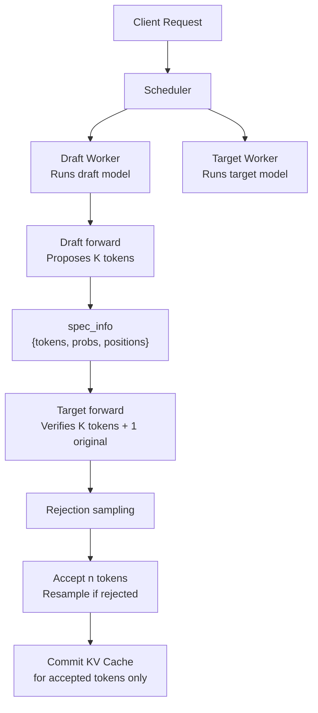
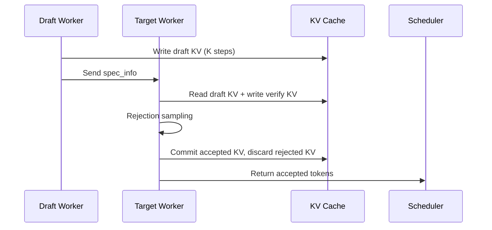

[中文](./03-serving-implementation-dataflow.md) | [English](./03-serving-implementation-dataflow_EN.md)

# Speculative Decoding: Serving Implementation Dataflow

## 1. SGLang's Speculative Decoding Architecture



## 2. Key Data Structure: spec_info

```python
spec_info = {
    "draft_tokens": Tensor[B, K],        # Proposed token ids
    "draft_probs": Tensor[B, K, V],      # Draft probabilities
    "positions": Tensor[B],              # Starting positions
    "accept_length": Tensor[B],          # How many tokens accepted per request
    "retrieve_index": Tensor[B],         # Where to resume after verify
}
```

## 3. KV Cache Lifecycle



Draft KV must be preserved during verification but may be partially discarded after. This requires careful page management to avoid leaking or corrupting KV pages.

## 4. Batch Processing

Multiple requests may be in the same batch:
- Some requests may use speculative decoding, others may not
- `spec_info` is per-request, not per-batch
- The batch forward handles both spec and non-spec requests simultaneously
- `BatchResultProcessor` branches on whether spec_info is present

## 5. Integration with Overlap Scheduling

In overlap mode, draft forward and target verify can potentially overlap:
- The draft worker can begin proposing tokens for the next batch while the target processes the current batch
- This requires careful `future_map` and stream management
- `launch_batch_sample_if_needed()` coordinates delayed sampling for spec + grammar scenarios

## 6. SGLang Code References

- `python/sglang/srt/speculative/` — Speculative decoding core
- `python/sglang/srt/managers/scheduler.py` — Spec-aware scheduling
- `python/sglang/srt/managers/tp_worker.py` — Draft/target worker dispatch
- `python/sglang/srt/model_executor/model_runner.py` — Spec-aware forward
