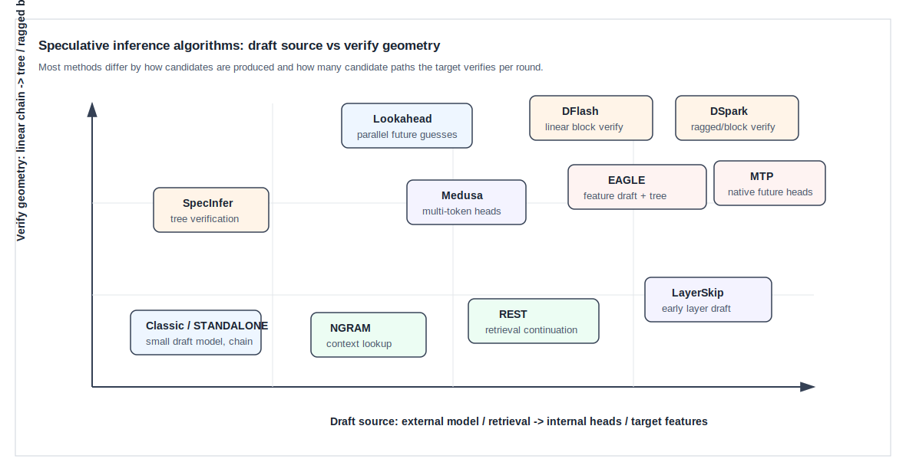

**中文** | [English](./04-algorithm-landscape_EN.md)

# 04. 投机推理算法谱系

## 1. 分类轴

各种 speculative inference 方法看起来很多，但可以用两个轴统一理解：

```text
draft source:       候选 token 从哪里来
verify geometry:    target 如何一次验证这些候选
```



Draft source 决定候选质量和成本；verify geometry 决定一次 target forward 能覆盖多少候选路径。

## 2. 算法总览

| 算法族 | Draft 来源 | Verify 结构 | 是否可严格保持 target 分布 | 适合场景 |
|---|---|---|---|---|
| Classic speculative sampling | 小模型 draft | 线性链 | 可以 | 有便宜且相似的小模型 |
| STANDALONE draft | 独立小 LLM | 线性链或树 | 可以 | serving 框架支持双模型 |
| Tree-based speculative inference | 小模型或多分支 draft | 候选树 | 可以，但实现复杂 | 高接受率、多候选路径 |
| Medusa / Hydra 类 | 目标模型附加多 token heads | 多头候选树 | 取决于验证规则 | 模型可改造或可训练 heads |
| EAGLE / EAGLE-2 / EAGLE-3 | target hidden feature draft | 动态候选树 | 可用于严格或近似验证 | 高吞吐推理、强 draft |
| MTP | 模型内置 multi-token prediction heads | 多步候选 | 取决于验证规则 | 原模型训练时支持 MTP |
| NGRAM / Prompt Lookup | 上下文重复片段 | 线性链或候选树 | greedy 可 exact；采样需额外概率处理 | 代码、日志、重复模板 |
| REST | 检索语料提供候选 continuation | 候选路径 | 可配合 target verify | RAG/长文本重复场景 |
| LayerSkip / Self-speculative | 同一模型浅层早退 | 线性链 | 可通过深层验证保持目标 | 不想加载额外 draft model |
| Lookahead / Jacobi decoding | 并行求解未来 token guess | n-gram/window 验证 | 通常是特定解码策略 | 硬件并行充足、希望减少串行依赖 |
| DFlash / DSpark | 专用 draft checkpoint 或结构 | block / ragged verify | 依赖实现规则 | 与特定模型和框架深度集成 |

## 3. Classic speculative sampling

经典方案使用一个小模型作为 draft model：

```text
small draft model proposes y_1...y_K
large target model verifies y_1...y_K
strict rejection sampling commits accepted prefix
```

优点：

1. 数学最清晰。
2. 可以严格保持 target distribution。
3. 不需要修改 target model 权重。

缺点：

1. 需要额外加载 draft model。
2. draft 和 target tokenizer / vocab / sampling processor 要对齐。
3. draft KV Cache 也要占显存。
4. 小模型太弱时接受率低，收益消失。

适合使用场景：

```text
target = 70B
draft  = 7B 或更小
draft latency << target latency
draft output distribution close enough to target
```

## 4. Tree-based speculative inference

线性链每一层只有一个候选。Tree-based 方法让 draft 每步保留多个分支：

```text
step 1: top candidates a, b
step 2: under a -> c, d; under b -> e, f
```

target verify 一次处理整棵树，然后选择一条可接受路径提交。

优点：

1. 比单链更不容易因为一个错误候选过早停止。
2. 可以用更多候选覆盖 target 可能选择的 token。
3. 对 top-k draft、feature draft、多头 draft 都很自然。

缺点：

1. 候选节点数随深度和 branching factor 增长。
2. attention mask 必须表达树祖先关系。
3. KV slot、retrieve index、路径选择和 CUDA Graph shape 更复杂。

树验证的关键 trade-off：

```text
更宽的树 -> 更高接受概率
更宽的树 -> 更多 verify token / mask / memory
```

## 5. Medusa / Hydra 类多头方法

Medusa 类方法在 target model 上增加多个预测头，让一次 forward 直接预测未来多个位置：

```text
base model hidden h_t
  -> head_1 predicts token t+1
  -> head_2 predicts token t+2
  -> head_3 predicts token t+3
```

这些 heads 不是替代 target model，而是产生候选。target model 后续仍要验证候选路径。

优点：

1. 不需要单独小模型。
2. draft 成本比完整模型小。
3. 可以自然构造多分支候选树。

缺点：

1. 需要训练额外 heads。
2. 多步预测越远，不确定性越高。
3. 如果 heads 与 target 分布不匹配，接受率会下降。

适合模型提供者能改造 checkpoint 的场景。

## 6. EAGLE / EAGLE-2 / EAGLE-3

EAGLE 的核心思想是：不要直接在 token 空间猜未来，而是在 target model 的 feature 空间预测下一步 hidden state，再通过 LM head 得到候选 token。

概念流程：

```text
target hidden/state
  -> EAGLE draft model predicts future feature
  -> LM head maps feature to token distribution
  -> expand candidate tree
  -> target model verifies tree
```

为什么 feature drafting 有帮助：

1. Hidden feature 比离散 token 更连续，可能更容易预测。
2. Draft 可以利用 target 中间表示，和 target 行为更接近。
3. Tree expansion 可以在高概率候选之间保留多条路径。

EAGLE-2 强调动态 draft tree；EAGLE-3 进一步利用低层和中层特征，并改进训练方式以提升 draft 质量。

工程代价：

1. 需要保存或传递 target hidden states。
2. verify 后要选择 accepted path 对应的 hidden 作为下一轮 draft seed。
3. draft worker、target worker、KV Cache 和 graph runner 之间耦合更强。
4. 多分支 tree 需要 retrieve index 和 custom mask。

## 7. MTP / Multi-Token Prediction

MTP 指模型训练时内置多个未来 token 预测能力。它和 Medusa 的共同点是都想用较小额外成本预测多个未来 token；不同实现可能把多 token heads、额外层、共享 trunk 或专用模块集成到模型内部。

概念上：

```text
target forward at position t
  -> normal head predicts token t+1
  -> mtp head/layer predicts token t+2, t+3, ...
```

在 serving 中，MTP 产生的候选仍要经过 target verify。若实现使用 frozen target KV 或特定 hidden state 作为 draft 输入，就会出现专门的 MTP worker、draft hidden、frozen KV MTP 等路径。

适合场景：

1. 模型本身已经训练了 MTP 能力。
2. 不想额外加载一个完整小模型。
3. serving 框架支持模型特定的 draft state 管理。

风险：

1. 不同模型的 MTP 结构差异很大。
2. Draft 质量取决于训练目标。
3. KV 和 hidden state 复用策略容易和 target verify 耦合。

## 8. NGRAM / Prompt Lookup

NGRAM 方法不运行神经网络 draft，而是从已有上下文里找重复片段：

```text
prefix tail = [A,B,C]
context 中曾出现 [A,B,C,D,E,F]
draft proposes [D,E,F]
```

优点：

1. 几乎没有模型计算成本。
2. 对代码、JSON、日志、模板文本、重复段落很有效。
3. 不需要额外模型权重。

缺点：

1. 对开放式自然语言的接受率不稳定。
2. 采样场景下若要严格分布，需要谨慎处理 draft probabilities。
3. 候选来自历史重复，不具备真正的语义泛化能力。

Serving 实现中，NGRAM 常维护 trie、suffix automaton 或 token table。它输出的是候选 token 和 tree metadata，而不是 draft logits。

## 9. REST / Retrieval-based speculative decoding

REST 类方法从外部语料或检索结果中拿 continuation 作为 draft 候选：

```text
query current prefix
retrieve similar text spans
extract continuation tokens
target verify these continuations
```

它和 NGRAM 的区别是：NGRAM 主要从当前上下文内部找重复，REST 可以从外部 datastore 找相似上下文。

适合：

1. RAG 场景中有高质量检索库。
2. 任务输出经常复用已有文档片段。
3. 目标是减少重复文本生成成本。

风险：

1. 检索延迟可能抵消收益。
2. 候选 continuation 需要和当前 tokenizer 对齐。
3. 如果检索内容相似但下一 token 分布不同，接受率会低。

## 10. LayerSkip / Self-speculative decoding

Self-speculative 方法让同一个模型的浅层先产生 draft，深层再验证：

```text
early layers -> draft token
full layers  -> verify token
```

优点：

1. 不需要额外 draft model。
2. 权重和 tokenizer 天然一致。
3. 可以减少部署复杂度。

缺点：

1. 模型通常需要早退训练或层级一致性优化。
2. 浅层输出质量不一定足够。
3. 实现需要支持部分层 forward、KV/hidden 复用和深层补算。

它本质上把“draft model”换成了“target model 的便宜前缀计算”。

## 11. Lookahead / Jacobi decoding

Lookahead decoding 尝试用并行迭代方式猜测多个未来 token，再通过验证接受某些 n-gram。它和标准 speculative sampling 的侧重点不同：

```text
standard speculative: cheap draft distribution + target verify
lookahead/Jacobi:     并行构造未来 token guess，减少串行依赖
```

适合硬件并行资源充足、希望减少自回归串行瓶颈的场景。它通常需要特定 decoding schedule 和窗口管理，不只是替换 draft model。

## 12. DFlash / DSpark 等框架集成算法

一些 serving 框架会支持与特定 draft checkpoint 或模型结构绑定的算法。例如：

| 方法 | 高层理解 |
|---|---|
| DFlash | 使用专用 draft checkpoint，围绕 block size / draft window 做线性 block verify |
| DSpark | 使用带 Markov/head 配置的 draft 结构，支持 gamma、ragged verify 和特定 mask token |

这类方法的特点是：

1. 算法和框架实现强绑定。
2. 参数不只是 `K`，还可能包含 block size、window、mask token、target layer ids、Markov rank。
3. verify layout 可能是 ragged，不一定每条请求验证同样数量的候选 token。
4. 性能上限高，但迁移到其他模型或框架时成本也高。

## 13. 自适应 speculative decoding

固定 `K` 或固定 `num_steps` 很难适配所有流量：

```text
high acceptance request -> K 太小会浪费机会
low acceptance request  -> K 太大会浪费 draft 和 verify
large batch             -> 每个多余 draft step 被 batch 放大
small batch             -> 更深 speculation 可能更划算
```

自适应策略会根据近期接受长度动态选择 step tier：

```text
近期平均接受长度 <- 用 EMA 平滑每轮观测到的 accepted length
目标 draft 深度   <- 近期平均接受长度 + 1，再限制到允许的候选档位
```

也可以写成更短的符号形式：

```text
EMA_accept_len = smooth(observed_accept_len)
target_steps   = clamp(round(EMA_accept_len) + 1, allowed_tiers)
```

读法：

```text
如果最近经常能接受 3 个 draft token，就可以尝试把 draft 深度调到 4 左右；
如果最近经常只接受 0 或 1 个，就降低 draft 深度，避免浪费。
```

常见保护机制：

| 机制 | 目的 |
|---|---|
| warmup batches | 避免冷启动时根据少量样本切换 |
| update interval | 避免每个 batch 都抖动 |
| hysteresis | 防止 step tier 来回震荡 |
| per-BS tracking | 不让小 batch 和大 batch 的接受率互相污染 |
| ceiling rule | 在高 batch 下限制过深 draft |

自适应不是改变数学规则，而是动态选择“猜多远”。

## 14. 选择算法的原则

| 条件 | 优先考虑 |
|---|---|
| 有高质量 EAGLE draft checkpoint | EAGLE-2 / EAGLE-3 |
| 模型原生支持 MTP | MTP / frozen-KV MTP 路径 |
| 有便宜且相似的小模型 | Classic / STANDALONE speculative sampling |
| 文本重复性强 | NGRAM / prompt lookup / REST |
| 不想加载额外模型，且模型支持早退 | LayerSkip / self-speculative |
| 需要强框架优化且模型匹配 | DFlash / DSpark |
| 接受率随 workload 波动 | Adaptive speculative decoding |

调参时优先观察：

```text
avg_accept_length
accept_length_histogram
tokens_per_second
inter_token_latency
draft_time
verify_time
KV memory usage
graph fallback ratio
```

不要只看单个 benchmark 的峰值。投机推理对请求长度、batch size、temperature、top-p、任务类型和输出约束都很敏感。

## 15. 参考论文与资料

- Fast Inference from Transformers via Speculative Decoding: https://arxiv.org/abs/2211.17192
- Accelerating Large Language Model Decoding with Speculative Sampling: https://arxiv.org/abs/2302.01318
- Medusa: Simple LLM Inference Acceleration Framework with Multiple Decoding Heads: https://arxiv.org/abs/2401.10774
- EAGLE-2: Faster Inference of Language Models with Dynamic Draft Trees: https://arxiv.org/abs/2406.16858
- EAGLE-3: Scaling up Inference Acceleration of Large Language Models via Training-Time Test: https://arxiv.org/abs/2503.01840
- Multi-Token Prediction: https://arxiv.org/abs/2404.19737
- LayerSkip: Enabling Early Exit Inference and Self-Speculative Decoding: https://arxiv.org/abs/2404.16710
- Lookahead Decoding: Accelerating Large Language Models with Jacobi Decoding: https://arxiv.org/abs/2402.02057
- SpecInfer: Accelerating Generative Large Language Model Serving with Tree-based Speculative Inference and Verification: https://arxiv.org/abs/2305.09781
- REST: Retrieval-based Speculative Decoding: https://arxiv.org/abs/2311.08252
