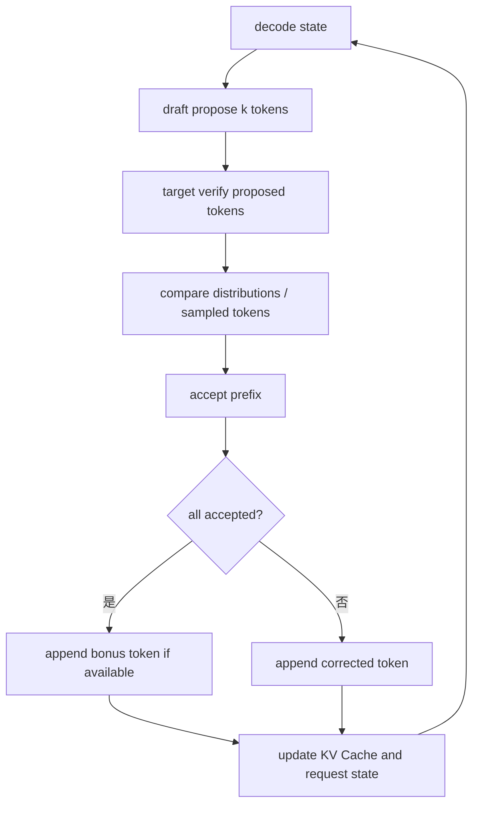

# Speculative Decoding

这一章解释投机解码。它的目标是让小模型或轻量 draft 路径先猜多个 token，再由目标模型一次性验证，从而减少目标模型 decode step 的次数。

## 基本直觉

普通 decode：

```text
target model: 生成 token 1
target model: 生成 token 2
target model: 生成 token 3
target model: 生成 token 4
```

投机解码：

```text
draft model: 快速猜 token 1,2,3,4
target model: 一次 forward 验证这些 token
accept: 前 3 个猜对
target model: 给出第 4 个位置的修正 token
```

如果 draft 足够快且接受率足够高，就能减少 target model 的调用轮数。

## 核心流程



## 接受率为什么重要

投机解码的收益可以粗略理解为：

```text
收益 ≈ 每次 target verify 能接受的平均 token 数 / verify 成本
```

如果 draft 猜得差，target 每次只能接受 0 或 1 个 token，就会额外浪费 draft 计算和 verify 复杂度。接受率受模型相似度、采样参数、任务类型、上下文长度影响。

## 常见 draft 来源

| 方法 | 思路 | 特点 |
|---|---|---|
| 小模型 draft | 用更小的模型预测候选 token | 简单直观，但需要额外模型 |
| EAGLE | 用目标模型中间特征训练 draft head | 接受率通常更好，系统复杂 |
| NGRAM | 从上下文中找 n-gram 候选 | 很轻量，适合重复文本或代码 |
| Medusa-like heads | 多个预测头同时给出未来 token | 模型结构需要支持 |

## KV Cache 难点

投机解码会让 KV Cache 状态更复杂：

1. Draft token 可能被接受，也可能被拒绝。
2. Target verify 会为多个候选位置计算 KV。
3. 被拒绝的 token 对应 KV 不能污染正式请求状态。
4. 接受多个 token 后，请求长度一次增加多个位置。
5. Grammar、stop condition、logprob 需要和接受 token 对齐。

## 和 SGLang 的连接点

- Draft worker 或 draft path 负责提出候选 token。
- Target worker 负责 verify，并根据接受规则更新请求状态。
- `spec_info` 这类结构通常记录 draft token、accept length、verify metadata。
- Scheduler 需要处理 spec decode 下的 batch 形状和 token 数变化。
- Sampler、grammar backend、detokenizer 都要适配一次产生多个 accepted token 的情况。

## 阅读任务

1. 解释投机解码为什么不改变目标模型的输出分布。
2. 说明接受率低时为什么可能变慢。
3. 画出一次 `draft k=4`，接受 2 个 token 的状态更新。
4. 思考 structured output 或 grammar 约束会怎样影响 speculative decoding。
