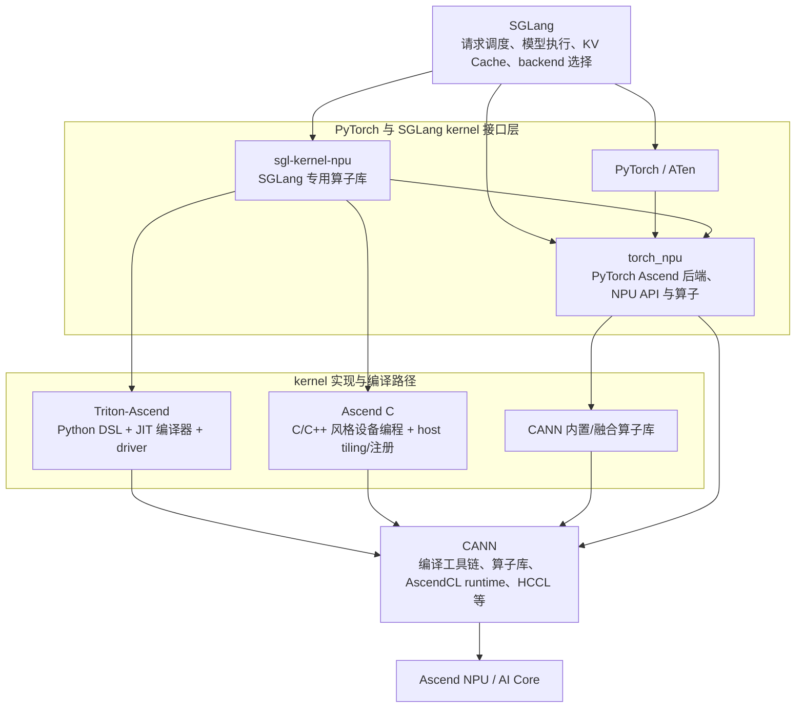
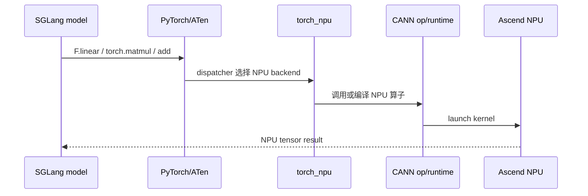
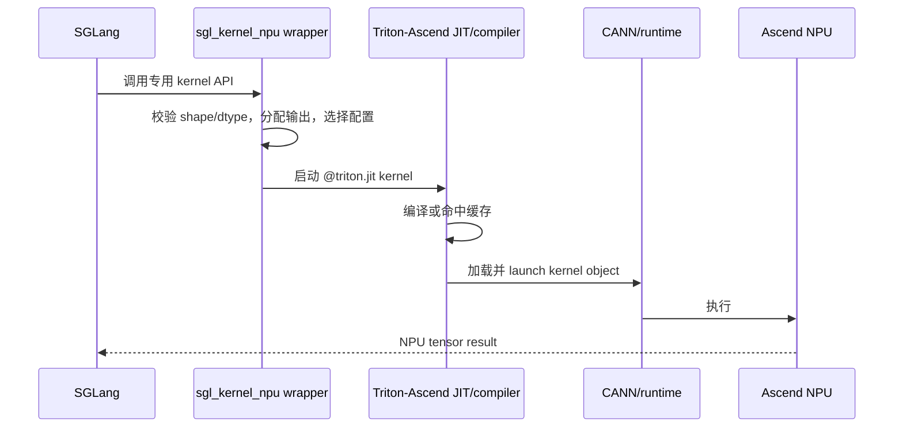
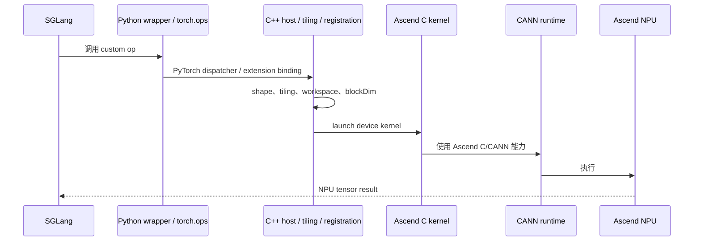

# 第一讲：五个关键对象如何组成 Ascend NPU 推理与算子栈

这一讲只建立边界和调用关系，不深入 SGLang 的调度实现。读完后，应能回答三个问题：

1. 一行 SGLang 模型代码是怎样落到 Ascend NPU 上执行的？
2. `sgl-kernel-npu`、`torch_npu`、Triton-Ascend 和 Ascend C 各自解决什么问题？
3. 新增或优化一个算子时，代码应该改在哪一层？

> 名称说明：本文使用官方仓库名 `sgl-kernel-npu`。安装后的 Python 包通常写作 `sgl_kernel_npu`。

> 类型说明：这一讲横跨 Python、C++ 和 device kernel。遇到同名的 tensor/pointer 时，按[代码阅读手册](./reference/code-reading-and-types.md)区分 `torch.Tensor`、`at::Tensor`、Triton `tl.tensor` 与 Ascend C typed view。

## 1. 先看结论：它们不是五层直线

最容易产生的错误印象是：

```text
SGLang -> sgl-kernel-npu -> torch_npu -> Triton-Ascend -> Ascend C
```

这条链是错的。Triton-Ascend 和 Ascend C 是两种不同的 kernel 开发路径，通常是并列关系；`torch_npu` 是 PyTorch 设备后端与算子适配层，也不是 Triton-Ascend 或 Ascend C 的“上一级编译器”。

更准确的地图如下：



图中的箭头表示常见的调用、编译或运行时依赖，不表示所有请求都会经过每个节点。一次模型 forward 会同时包含多种算子，因此三条路径可以在同一层 Transformer 中交替出现。

## 2. 一张表记住各自的责任

| 名称 | 它是什么 | 主要负责 | 不负责什么 |
|---|---|---|---|
| SGLang | LLM/多模态模型 serving 框架 | 请求调度、batch、模型 forward、KV Cache、attention backend、分布式与执行图编排 | 不为每个 NPU 数学算子都亲自实现设备 kernel |
| `sgl-kernel-npu` | SGLang 官方 Ascend NPU kernel 仓库与 Python 包 | 沉淀 SGLang 推理需要的高性能专用算子、Python wrapper、C++/PyTorch 扩展、测试与 benchmark | 不是通用深度学习框架，也不是 NPU 驱动或完整编译器 |
| `torch_npu` | Ascend Extension for PyTorch | 让 PyTorch 识别 NPU device，接入 tensor/stream/event/profiler/graph/distributed，并提供标准 ATen 与 NPU 专用算子 | 不是专为 SGLang 设计的 kernel 集合 |
| Triton-Ascend | 面向 Ascend 的 Triton 语言、编译器后端与 runtime driver | 把 `@triton.jit` 的 tile/block 程序降低、编译为 NPU 可执行 kernel 并启动运行 | 不是 SGLang 插件，也不会把 Triton 源码先翻译成 Ascend C 源码 |
| Ascend C | CANN 面向算子开发提供的编程语言与 API 体系 | 用较细粒度方式控制 AI Core 上的数据搬运、片上存储、计算、同步与流水 | 不是一个可 `pip install` 的上层框架，也不是 `sgl-kernel-npu` 的同义词 |
| CANN | Ascend 的基础软件栈 | 编译器、运行时、算子库、通信库及设备执行基础 | 不是上述五者之一，但它是理解所有下沉路径时不能省略的地基 |

可以用一句话压缩：

> SGLang 决定“何时算、算什么”；sgl-kernel-npu 提供“为 SGLang 特制的快算子”；torch_npu 让 PyTorch 能使用 NPU；Triton-Ascend 和 Ascend C 提供两种“怎样写设备 kernel”的路径；CANN 负责把这些能力编译、加载并运行在 Ascend 硬件上。

## 3. SGLang：算子需求的产生者与调用者

SGLang 位于 serving 控制面和模型执行层。对这一讲，只需记住下面的简化链路：

```text
请求
  -> Scheduler 组成 batch
  -> ModelRunner 准备 tensor 和 ForwardBatch metadata
  -> model.forward()
  -> attention / norm / linear / activation / sampling / KV cache 等算子
```

SGLang 对底层 kernel 的价值不只是“调用一下”。它还规定了真实工作负载：

- prefill 与 decode 的 shape 分布完全不同；
- continuous batching 让 batch size 和序列长度动态变化；
- paged KV cache 引入 page table、slot mapping 和特殊 layout；
- graph capture 可能要求静态地址和固定 shape；
- TP/EP 等并行方式会改变本卡 tensor 的形状及通信边界；
- speculative decoding、MoE、MLA 会产生通用框架未必覆盖的融合机会。

因此，kernel 优化不能只看一个孤立的数学公式。SGLang 提供的是算子的调用契约和性能场景。

## 4. sgl-kernel-npu：连接 serving 需求与 NPU kernel 的工程仓库

官方将 `sgl-kernel-npu` 定义为 SGLang 面向 Ascend NPU 的 kernel 库。仓库当前包含两类主要能力：

- SGLang 推理 kernel：attention、normalization、activation、LoRA、投机解码、MLA 预处理、Mamba、KV Cache 等；
- DeepEP-Ascend：MoE Expert Parallel 的 dispatch/combine 等通信 kernel。

从工程角度看，它不是“一堆 `.cpp` 文件”，而是一座桥：

```text
SGLang 中稳定、易用的 Python 调用
  -> sgl_kernel_npu Python wrapper
  -> 参数检查 / 输出分配 / dispatch
  -> Triton-Ascend kernel，或 Ascend C/C++ custom op，或 torch_npu/CANN 算子
  -> NPU 输出 tensor
```

典型顶层目录可以这样理解：

```text
sgl-kernel-npu/
├── python/       # Python 包、wrapper，也可能放 Triton kernel
├── csrc/         # C++ 接口、Ascend C kernel、host 侧注册/tiling 等
├── include/      # 公共头文件
├── tests/        # 正确性测试
├── benchmark/    # microbenchmark
├── cmake/        # 编译配置
└── build.sh      # 工程构建入口
```

### 4.1 它和 SGLang 为什么分仓

分仓形成了清晰的职责边界：

- SGLang 可以专注 serving 行为、模型兼容和调度；
- kernel 仓库可以独立构建 wheel、运行单算子测试与 benchmark；
- kernel 编译对 CANN、编译器和硬件版本的要求，不必全部塞进 SGLang 主仓；
- kernel 的实现可以在不改变 SGLang 上层调用语义的前提下替换或调优。

但“分仓”不等于“完全解耦”。如果输入 layout、函数签名或 dispatch 条件变化，通常需要双仓配套修改和版本匹配。

### 4.2 它不是一种 kernel 语言

`sgl-kernel-npu` 是产品/仓库边界，Triton-Ascend 与 Ascend C 是实现技术。一个仓库可以同时包含：

- 纯 Python/Torch fallback；
- 对 `torch_npu` 融合算子的封装；
- Triton-Ascend JIT kernel；
- Ascend C 设备 kernel 与 host 侧 C++ 代码；
- 通信和工程基础设施。

所以看到 `sgl_kernel_npu.xxx()`，不能仅凭函数名判断底层使用了哪条路径，必须继续追踪 wrapper、import、op 注册和构建文件。

## 5. torch_npu：PyTorch 到 Ascend 的设备后端

`torch_npu` 的核心任务是把 Ascend NPU 接入 PyTorch。安装后，用户可以使用 NPU tensor 和相关 API，例如：

```python
import torch
import torch_npu

x = torch.randn(1024, device="npu")
y = torch.randn(1024, device="npu")
z = x + y
```

这里虽然只写了标准 PyTorch 加法，但 `x`、`y` 是 NPU tensor，PyTorch dispatcher 会选择 NPU backend，随后通过 `torch_npu`/CANN 路径在设备上执行。

这段代码中的 `x/y/z` 都是 Host Python 对象 `torch.Tensor`，对象内记录 shape、stride、dtype、device 与 storage；真实元素位于 NPU memory。`x + y` 返回新的 `torch.Tensor`，不是 Triton `tl.tensor`，也没有在 Python 中暴露裸 `GM_ADDR`。只有继续追踪 dispatcher/Host launch，才会看到 C++ `at::Tensor` 和设备地址。

它大致覆盖三类能力：

1. **设备接入**：NPU device、allocator、stream、event、随机数、序列化等；
2. **框架接入**：为标准 ATen/PyTorch 算子注册 NPU 实现；
3. **Ascend 专用能力**：`torch_npu.npu_*`、`torch.ops.npu.*`、profiler、NPU graph、HCCL backend 等。

### 5.1 torch_npu 与 sgl-kernel-npu 的边界

两者都会“提供算子”，但目标不同：

- `torch_npu` 面向整个 PyTorch on Ascend 生态，优先提供通用设备能力和通用/NPU 专用算子；
- `sgl-kernel-npu` 面向 SGLang serving 中的特定数据布局、融合模式和热点 shape。

如果 `torch_npu` 已有性能和语义都满足要求的算子，SGLang 可以直接调用它；如果缺少 SGLang 专用融合或数据布局，才更可能在 `sgl-kernel-npu` 中新增实现。

还有一个常见误区：`torch.ops.npu.xxx` 只是 PyTorch dispatcher 中的 namespace。仅凭 namespace 不能可靠判断实现属于 `torch_npu` 还是某个 import 后注册进来的扩展；应检查 op schema/注册代码和加载它的共享库。

## 6. Triton-Ascend：较高层的 tile-based kernel 开发路径

Triton 是 Python DSL 与编译器框架。开发者主要描述：

- program/grid 如何切分任务；
- 每个 program 处理什么 tile；
- 如何计算地址和 mask；
- tile 上做什么 load、compute、reduce 和 store。

Triton-Ascend 在 Triton 基础上增加 Ascend 语言扩展、编译器 backend 和 runtime driver。官方架构给出的简化编译链是：

```text
Triton Python kernel
  -> Triton IR (TTIR)
  -> Linalg IR / AscendNPU IR 等中间表示
  -> BiSheng/CANN 相关编译工具链
  -> NPU kernel object
  -> Ascend driver/runtime 加载并执行
```

它让开发者把注意力更多放在 tile 划分和计算逻辑上，编译器负责相当一部分内存分配、数据传输、指令选择和流水优化。

### 6.1 与 CUDA Triton 相似，但不能照抄优化参数

语法相似不意味着硬件执行模型相同。Triton-Ascend 官方编程指南特别强调：

- GPU 上的 grid 往往围绕大量 SM 任务设计；Ascend 上应结合实际 AI Core/Vector Core 数量；
- 过多 program 会分轮下发并引入启动、初始化开销；
- 单核数据搬运需要考虑片上 UB 容量和连续访问；
- Cube 与 Vector 计算路径、CV 融合和流水策略会影响最优实现。

因此，从 CUDA 迁移 Triton kernel 时，数学逻辑也许能复用，grid、block size、访问模式和流水参数通常需要重新设计。

### 6.2 它和 Ascend C 的关系

两者都是写 NPU kernel 的方式，但抽象层级不同：

| 维度 | Triton-Ascend | Ascend C |
|---|---|---|
| 主要语言形态 | Python DSL | C/C++ 语法扩展与 C++ 类库 API |
| 主要抽象 | program、grid、tile、tensor 操作 | Global/Local Tensor、队列、搬运、计算、同步、流水 |
| 编译器职责 | 自动完成更多 lowering、存储与流水工作 | 开发者显式控制更多硬件相关细节 |
| 开发速度 | 通常更快，适合原型和快速迭代 | 工程代码更多，适合需要细粒度控制的路径 |
| 性能结论 | 取决于算子、shape、编译器版本与调优 | 同样取决于实现质量，不存在“语言天然必胜” |

Triton-Ascend 并不是“先生成 Ascend C 源码，再调用 Ascend C 编译”。根据其官方架构，它通过自己的 IR lowering 和 Ascend/BiSheng 编译链生成设备可执行文件。二者最终都依赖 CANN/Ascend 工具链和 runtime，但中间开发与编译路径不同。

## 7. Ascend C：更接近 AI Core 的原生算子开发路径

Ascend C 是 CANN 针对算子开发提供的编程语言，兼容 C/C++ 语法并提供多层 API。最需要先建立的硬件直觉是：计算不是直接对设备全局内存做任意操作，而是常见地遵循：

```text
Global Memory (GM)
  -> 搬入片上 Local Memory
  -> Vector/Cube 等计算单元执行
  -> 结果搬回 Global Memory
```

典型 Ascend C kernel 会出现这些概念：

- `GlobalTensor`：描述设备全局内存中的 tensor；
- `LocalTensor`：描述片上 Local Memory 中的 tensor；
- `TPipe`：管理流水与片上 buffer；
- `TQue`：连接搬入、计算、搬出阶段，并承担队列同步；
- `DataCopy`：在全局与片上存储之间搬运数据；
- `EnQue` / `DeQue`：管理流水阶段间的数据就绪关系；
- `blockDim` / block index：把工作分给多个核；
- tiling data：由 host 侧为具体 shape 计算切分参数。

一个常见的设备侧结构是：

```text
Init
  -> 初始化 GM tensor、queue 和 buffer
Process
  -> 循环处理 tile
       CopyIn
       Compute
       CopyOut
```

Ascend C 官方文档将 kernel function 定义为设备侧实现入口。多个核以 SPMD 方式执行同一份 kernel 代码，各自通过 block index 处理不同数据分片。

### 7.1 为什么除了 kernel 还要学习 host 侧

生产算子通常不只有设备侧 `.cpp`/`.asc` 代码，还需要：

- 算子 schema 和输入输出定义；
- shape/dtype/format 校验或推导；
- host tiling：根据输入 shape、硬件资源计算 block 数与每核 tile；
- workspace 计算；
- kernel 注册、编译和打包；
- PyTorch custom op binding；
- Python wrapper、测试与 benchmark。

这正是为什么 `sgl-kernel-npu/csrc/` 的学习不能只盯着 `__aicore__` kernel 函数。

## 8. 三条真实执行路径

### 8.1 路径 A：标准 PyTorch / torch_npu 算子

以 NPU tensor 上的 `F.linear`、`torch.matmul` 或 `x + y` 为例：



适合：通用算子已经存在，性能和语义满足要求，不需要 SGLang 专用融合。

### 8.2 路径 B：sgl-kernel-npu 中的 Triton-Ascend kernel



这里依然会使用 PyTorch NPU tensor、当前 device/stream 等运行环境；“走 Triton kernel”不等于与 `torch_npu` 完全无关。关键区别是计算主体由 Triton-Ascend 编译出的自定义 kernel 完成，而不是直接调用一个现成的 `torch_npu` 数学算子。

### 8.3 路径 C：sgl-kernel-npu 中的 Ascend C custom op



适合：需要细粒度控制搬运、片上内存、Cube/Vector 流水、跨核协作，或 Triton-Ascend 当前表达/编译能力不能满足要求的场景。

### 8.4 一次 forward 可以混用三条路径

例如某层模型可能同时出现：

```text
RMSNorm       -> torch_npu 现成融合算子
QKV 预处理    -> sgl-kernel-npu Triton-Ascend kernel
Attention     -> CANN 内置 attention 算子或 Ascend C custom op
KV cache 写入 -> torch_npu scatter/update 算子
Sampling      -> sgl-kernel-npu custom op
```

实际归属必须以当前 checkout 的源码、注册和 profiler trace 为准，不能仅凭算子名称推断。

## 9. 遇到需求时，应该改哪一层

| 需求 | 优先查看/修改 |
|---|---|
| batch、请求生命周期、KV cache metadata 或 backend 选择错误 | SGLang |
| SGLang 缺少一个稳定的专用 kernel API 或现有 wrapper dispatch 不合理 | `sgl-kernel-npu` Python/C++ 接口层，必要时同步改 SGLang |
| 标准 PyTorch op 在 NPU 上缺失或设备语义有问题 | `torch_npu` / 对应 CANN 算子能力 |
| 想快速实现或融合一个 tile-friendly kernel | 先评估 Triton-Ascend，并放入 `sgl-kernel-npu` 管理 |
| 需要精确控制 GM↔Local 搬运、Cube/Vector、流水或 host tiling | Ascend C，并在 `sgl-kernel-npu` 中完成注册与包装 |
| Triton 语法支持、lowering、IR pass 或 driver 本身有 bug | Triton-Ascend |
| 驱动、编译器、runtime、基础算子库或 HCCL 问题 | CANN/驱动工具链 |

实践中的选择顺序通常是：

```text
现有 torch_npu/CANN 算子能否满足？
  ├─ 能：复用，并做端到端验证
  └─ 不能：是否适合 Triton-Ascend 快速实现？
       ├─ 是：Triton kernel + correctness + benchmark
       └─ 否：Ascend C custom op

最后再判断是否值得进入 sgl-kernel-npu，并接回 SGLang。
```

这不是死规则。最终选择受算子复杂度、支持的硬件/CANN 版本、团队维护能力、动态 shape、编译开销和性能目标共同影响。

## 10. 与 CUDA 生态做一个不完全类比

如果熟悉 CUDA，可以先借用下面的类比定位，但不要把实现细节等同：

| Ascend 生态 | CUDA 生态中的近似角色 |
|---|---|
| Ascend NPU | NVIDIA GPU |
| CANN runtime/toolkit | CUDA runtime/toolkit |
| `torch_npu` | PyTorch CUDA backend 与扩展能力 |
| Triton-Ascend | Triton 的 CUDA backend |
| Ascend C | CUDA C++ kernel 编程（仅作抽象层级类比） |
| `sgl-kernel-npu` | 为 serving 框架维护的专用 CUDA/Triton kernel 库 |
| HCCL | NCCL |

最大陷阱是：Ascend 的 AI Core 计算单元与存储层级并不是 NVIDIA SM 的改名版本。后续课程会重新建立 Cube/Vector、GM/UB/L1/L0、搬运与流水模型。

## 11. 五个常见误区

1. **“装了 torch_npu 就有 sgl-kernel-npu。”** 不是。它们是不同包，职责和发布节奏不同。
2. **“sgl-kernel-npu 的所有算子都是 Triton 写的。”** 不是。仓库可以混合 Triton-Ascend、Ascend C/C++、torch_npu 调用与 fallback。
3. **“Triton-Ascend 是 Ascend C 的 Python 语法糖。”** 不准确。二者有不同的前端抽象和编译路径。
4. **“Ascend C 只写一个 device kernel 就结束了。”** 不够。生产接入通常还包括 host tiling、注册、构建、binding、测试和 benchmark。
5. **“看到 `torch.ops.npu` 就知道代码来自 torch_npu。”** 不一定。namespace 不等于仓库归属，要追注册点和动态库。

## 12. 本讲检查清单

如果能独立回答下面的问题，就可以进入下一讲：

- 为什么五者不能画成一条严格线性依赖链？
- 普通 `torch.matmul` 与 `sgl_kernel_npu.xxx()` 可能走哪些不同路径？
- `sgl-kernel-npu` 为什么既可能依赖 `torch_npu`，又可能包含自己的 Triton/Ascend C kernel？
- Triton-Ascend 与 Ascend C 的核心抽象差异是什么？
- 为什么 CANN 没在用户给出的五个名字里，却必须画在架构图底部？
- 如果性能问题来自 SGLang 的 batch 组织，重写 Ascend C kernel 为什么可能没有帮助？
- 如果要确认某个 `torch.ops.*` 的真实实现归属，应该查什么？

## 13. 官方资料

- [SGLang 仓库](https://github.com/sgl-project/sglang)
- [sgl-kernel-npu 仓库](https://github.com/sgl-project/sgl-kernel-npu)
- [torch_npu（Ascend Extension for PyTorch）仓库](https://github.com/Ascend/pytorch)
- [Triton-Ascend 仓库](https://github.com/triton-lang/triton-ascend)
- [Triton-Ascend Architecture Design and Core Features](https://github.com/triton-lang/triton-ascend/blob/main/docs/en/architecture_design_and_core_features.md)
- [Triton-Ascend Operator Development Guide](https://github.com/triton-lang/triton-ascend/blob/main/docs/en/programming_guide.md)
- [Ascend C：什么是 Ascend C](https://www.hiascend.com/document/detail/zh/CANNCommunityEdition/900beta1/opdevg/Ascendcopdevg/atlas_ascendc_map_10_0002.html)
- [Ascend C：核函数与 SPMD 执行](https://www.hiascend.com/document/detail/zh/canncommercial/80RC2/developmentguide/opdevg/Ascendcopdevg/atlas_ascendc_10_0014.html)
- [Ascend C：编程 API 与数据搬运](https://www.hiascend.com/document/detail/zh/canncommercial/80RC1/developmentguide/opdevg/Ascendcopdevg/atlas_ascendc_10_0011.html)

> 文档核对日期：2026-07-03。项目仍在快速演进，版本兼容性以各仓库当前 release/README 为准。
