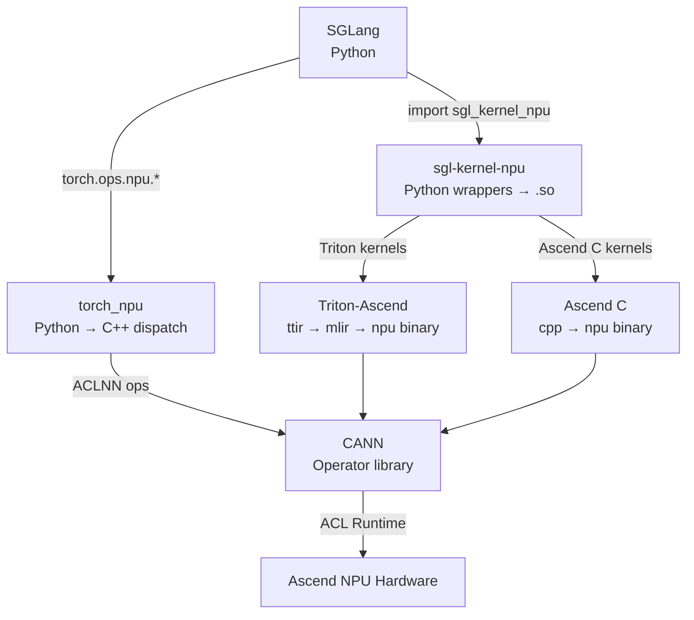

[中文](./01-stack-and-relationships.md) | [English](./01-stack-and-relationships_EN.md)

# 01. Stack & Relationships: SGLang, sgl-kernel-npu, Triton-Ascend, Ascend C, torch_npu

## The Five-Layer Model

```text
Layer 5: SGLang (LLM serving framework)
           ↓ calls
Layer 4: sgl-kernel-npu (dedicated NPU kernel library)
           ↓ uses
Layer 3: Triton-Ascend + Ascend C (kernel languages)
           ↓ compiles to
Layer 2: torch_npu + CANN (device backend & runtime)
           ↓ runs on
Layer 1: Ascend NPU Hardware (Da Vinci AI Core, HBM, HCCS)
```

## Component Boundaries

| Component | What It Is | What It's NOT |
|---|---|---|
| SGLang | LLM serving framework with scheduling, batching, KV cache, attention backend | NOT an operator library |
| sgl-kernel-npu | SGLang's dedicated kernel library for Ascend NPU | NOT a general-purpose kernel library |
| Triton-Ascend | Triton language compiler backend for Ascend NPU | NOT a CUDA-to-NPU translator |
| Ascend C | CANN's native NPU operator programming language | NOT a high-level DSL like Triton |
| torch_npu | PyTorch device adapter for Ascend NPU | NOT a standalone framework |
| CANN | Full Ascend compute software stack | NOT just a driver |

## How They Interact



## Decision Tree: Which Tool to Use

```text
Need a new NPU operator?
  ├─ Standard op exists in torch_npu/torch.ops.npu?
  │   └─ YES → Use it directly
  ├─ Simple fused kernel (element-wise, reduction)?
  │   └─ Use Triton-Ascend (fast development, good performance)
  ├─ Complex kernel with explicit memory/pipeline control?
  │   └─ Use Ascend C (fine-grained control, best peak performance)
  └─ SGLang-specific optimization?
      └─ Implement in sgl-kernel-npu (choose Triton or Ascend C)
```
