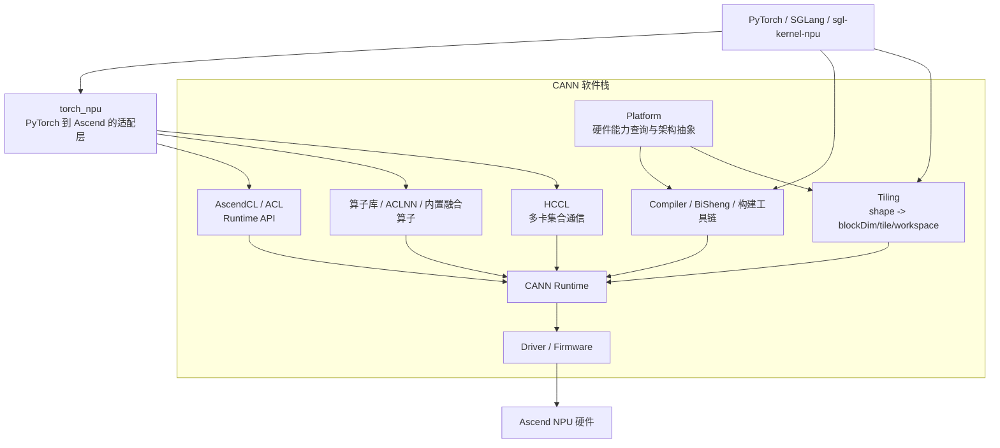

# 第二讲：CANN 全栈与边界

本讲承接 [第一讲：五个关键对象如何组成 Ascend NPU 推理与算子栈](./01-stack-and-relationships.md)。上一讲回答“谁和谁是什么关系”；这一讲回答“CANN 这一个大名字内部到底分几层，每层分别负责什么”。

本章跨越 Python、Host C++、runtime 与 Device，变量类型按[代码阅读手册](./reference/code-reading-and-types.md)分层阅读。

如果这一步不弄清，后面读 `torch_npu`、Triton-Ascend、Ascend C 和 `sgl-kernel-npu` 源码时，最容易把“编译问题”“运行时问题”“通信问题”“算子库缺失问题”混成一句“CANN 出问题了”。

> 前置章节：[`01-stack-and-relationships.md`](./01-stack-and-relationships.md)
>
> 读完下一步：先看 [`foundations/01-kernel-first-principles.md`](./foundations/01-kernel-first-principles.md)，再看 [`foundations/02-ascend-hardware.md`](./foundations/02-ascend-hardware.md)

## 1. 学习目标

读完本讲后，你应能独立回答：

- `Driver/Firmware`、`Runtime`、`AscendCL`、算子库、编译器、`Tiling`、`Platform`、`HCCL` 各自负责什么；
- 为什么 `torch_npu` 不等于 CANN，本质上只是“把 PyTorch 接到 CANN 上”的一层；
- 为什么同样是一行 Python 调用，底层可能走“现成算子库”或“自定义 kernel”两条不同路径；
- 遇到报错或性能问题时，应该先查哪一层。

## 2. 前置知识

建议先具备两点：

- 已经知道 `sgl-kernel-npu`、`torch_npu`、Triton-Ascend 和 Ascend C 是并列协作关系，而不是一条直线；
- 能接受一个基本事实：真正执行 NPU 工作的，不是 Python 函数名，而是 Host 准备参数后，经运行时把任务送到设备。

如果这两点还不稳，先回到上一讲。

## 3. 直观类比：CANN 不是“一个库”，而是一整套港口系统

很多初学者把 CANN 想成一个和 `pip install xxx` 类似的普通库。这种想法不够用。更准确的直觉是：

- **Driver/Firmware** 像港口的闸机、地面控制和设备固件，先保证船能靠港、吊机能动；
- **Runtime / AscendCL** 像调度台，负责分配泊位、安排吊装顺序、提交作业；
- **算子库** 像已经修好的标准航线，你只要报货单，就能走现成流程；
- **编译器** 像把你的自定义装箱方案翻译成码头机器能执行的作业单；
- **Tiling** 像“这批货拆成多少箱、每辆车装多少、先走哪几车”的具体装箱计划；
- **Platform** 像港口地图和设备规格表，告诉你有几台吊机、每台能吊多重、哪些通道可用；
- **HCCL** 像跨港口联运系统，负责多卡之间的集体通信。

这一整套系统合起来，才叫 CANN。

## 4. 一张图先看边界



图里最关键的观察有三个：

1. **CANN 不是只有 runtime。** 编译器、算子库和通信库都在它里面。
2. **`AscendCL` 不是另一套独立软件栈。** 它是 CANN 提供的运行时接口层。
3. **`Platform` 和 `Tiling` 不是“可有可无的术语”。** 前者提供硬件事实，后者把具体 shape 变成具体切分方案。

## 5. 每一层到底干什么

| 名称 | 先建立的直觉 | 精确定义 | 为什么需要它 | 与相近概念的区别 |
|---|---|---|---|---|
| Driver / Firmware | 先让卡“活过来” | 驱动负责 OS 与设备交互，固件负责设备侧基础控制与执行环境 | 没有它，系统就看不到卡，runtime 也没法提交任务 | 它不是算子库，也不是 Python API |
| CANN Runtime | “任务投递中心” | 管理 device、memory、stream、kernel/model launch 的执行层 | Host 需要一个统一入口把任务异步提交给设备 | Runtime 负责执行，不负责定义 PyTorch 语义 |
| AscendCL / ACL | “给应用写代码的 runtime 门面” | CANN 暴露给应用或框架的运行时 API 集 | 让上层代码能创建 stream、分配内存、启动 kernel/模型 | AscendCL 是 API 表面，不等于 Driver，也不等于编译器 |
| 算子库 / ACLNN | “现成可复用的标准件” | CANN 提供的预置算子与高层算子接口 | 避免每个常见算子都自己写 kernel | 它走 runtime 执行，但不是 runtime 本身 |
| Compiler | “把程序翻译成设备能执行的东西” | 把 Triton、Ascend C 或 custom op 工程降低、编译成设备侧可执行产物 | 没有编译产物，自定义 kernel 无法被 runtime 加载 | 编译器负责生成产物，不负责长期管理 stream 和 memory |
| Tiling | “拆任务和装箱” | 根据 shape、dtype 和硬件资源计算 blockDim、tile、workspace 等参数 | 同一份 kernel 面对不同 shape 时，需要不同切分方案 | Tiling 不是单纯“循环展开”，它是 Host/Device 协议的一部分 |
| Platform | “硬件规格表” | 对核数、存储层级、架构能力等硬件事实的查询与抽象层 | 编译器和 tiling 都不能靠猜测决定资源分配 | Platform 提供“机器有什么”；Tiling 决定“怎么用这些资源” |
| HCCL | “多卡联运系统” | Ascend 的集合通信库 | TP、EP、AllReduce、AllGather 这些都离不开它 | HCCL 不是单卡数学 kernel，也不是 `torch.distributed` 的全部 |

### 5.1 `AscendCL` 为什么要单独记住

第一次见到 `AscendCL` 时，很容易把它当成“又一个框架名”。更好的理解是：

- **通俗直觉**：它是应用调用 CANN runtime 的操作面板；
- **精确定义**：它提供设备、内存、stream、事件、模型和 kernel 执行等接口；
- **为什么需要**：上层框架总得通过某套 API 把“我要在 NPU 上做事”表达出来；
- **和相近概念的区别**：它不是 `torch_npu`。`torch_npu` 是 PyTorch 适配层，会在更高层把 PyTorch tensor/dispatcher 语义接到 CANN。

后面如果看到 `acl`、`AscendCL`、runtime stream，先把它们归到“运行时接口层”，不要误认为“这是编译器报错”。

### 5.2 `Tiling` 为什么不是高级细节

很多人第一次看到 `tiling data` 会觉得这是优化后期才关心的高级话题。不是。它从一开始就是算子契约的一部分。

- **通俗直觉**：同一仓库管理员，面对 4 个箱子和 40000 个箱子，拆箱方案当然不同；
- **精确定义**：`tiling` 是 Host 根据输入 shape、dtype、硬件资源计算切分参数，并把这些参数传给 Device kernel 的过程/协议；
- **为什么需要**：不做 tiling，就不知道多少核参与、每核处理多少、片上 buffer 该留多大；
- **和相近概念的区别**：它不等于编译期常量，也不等于 `for` 循环。编译器可做静态优化，但真实 shape 的切分经常要到运行前或 launch 前才能决定。

## 6. 两条最常见执行路径

### 6.1 路径 A：直接复用现成算子库

这是“先看 CANN/`torch_npu` 里有没有现成能力”的路径：

```text
PyTorch / SGLang
  -> torch_npu
  -> AscendCL / CANN Runtime
  -> CANN 算子库
  -> Ascend NPU
```

适合：

- 标准 GEMM、常见归一化、格式转换、已有融合算子；
- 语义已经满足，性能也够用；
- 不想维护额外 custom op 工程。

### 6.2 路径 B：编译自己的 kernel，再交给 runtime 执行

这是“现成算子不够，需要自定义”的路径：

```text
Triton-Ascend 或 Ascend C / custom op
  -> Compiler 生成设备侧产物
  -> Host 侧准备 tiling / workspace / launch 参数
  -> AscendCL / CANN Runtime 加载并启动
  -> Ascend NPU
```

适合：

- 需要 SGLang 专用 layout 或融合；
- 需要显式控制搬运、片上存储、同步或通信；
- 现成算子在语义或性能上都不够。

两条路径最终都要落到 runtime 和硬件上执行。区别不在“有没有 CANN”，而在“CANN 用的是现成标准件，还是你自己编出来的设备程序”。

## 7. 最小例子：同样是 Python 调用，底层路径可能不同

下面使用真实 Python API 语法。它在安装匹配版本的 `torch_npu`、`sgl_kernel_npu`、CANN 且存在 NPU 的环境中才可执行；当前工作区只做静态解读：

```python
import torch
import torch_npu
import sgl_kernel_npu

x = torch.randn(4096, device="npu", dtype=torch.float16)
y = torch.randn(4096, device="npu", dtype=torch.float16)

z = x + y
w = torch.ops.npu.helloworld(x, y)
```

逐行理解：

1. `import torch_npu`：把 PyTorch 的 NPU backend 和相关能力接进来；
2. `import sgl_kernel_npu`：除了导入 Python 包，还会加载它自己的 `.so`，把 custom op 注册进 PyTorch；
3. `z = x + y`：更可能走现成 NPU backend 与算子库路径；
4. `w = torch.ops.npu.helloworld(x, y)`：更明确地走“已注册 custom op”的路径；
5. 两条路最后都不是“Python 自己算完”，而是 Host 把工作提交给 CANN runtime，再由 runtime 送到 NPU。

这就是为什么看到 `torch.ops.npu.xxx` 时，不能立刻说“这一定是 torch_npu 自己实现的”。它也可能是 import 某个扩展后动态注册进去的。

变量类型也要分层：`x/y/z/w` 的 Python 类型都是 `torch.Tensor`；`x/y` 的元素 dtype 是 `torch.float16`、shape 是 `[4096]`、device 是 NPU。`torch.ops.npu.helloworld` 是 Python dispatcher 提供的可调用 op packet，不是 device kernel 函数对象；调用后 dispatcher 把 `torch.Tensor` 映射为 C++ `at::Tensor`，Host 实现再取得设备地址并 launch。`import sgl_kernel_npu` 返回 Python module，同时触发 `.so` 加载与静态注册，它本身不执行 `helloworld`。

## 8. 逐层源码解读：`import` 之后发生了什么

### 8.1 `sgl-kernel-npu` 的 Python 包先把 `.so` 装进来

固定源码基线 `sgl-kernel-npu@b2378ee05769cf7df209ffc5e1b669728f435a7e` 中：

- [`python/sgl_kernel_npu/sgl_kernel_npu/__init__.py#L6-L15`](https://github.com/sgl-project/sgl-kernel-npu/blob/b2378ee05769cf7df209ffc5e1b669728f435a7e/python/sgl_kernel_npu/sgl_kernel_npu/__init__.py#L6-L15)

这段代码的层次含义是：

1. 先依赖 `torch_npu`，说明这个包不是绕开 PyTorch NPU 生态单干；
2. 再定位 `libsgl_kernel_npu.so`；
3. 最后通过 `torch.ops.load_library(...)` 把共享库里的注册逻辑装入当前进程。

这里第一次出现的 **shared library** 指“已经编译好的本地动态库”。它不是 Python wheel 的同义词，也不是 kernel 本身。你可以把它理解为“把 Host 侧注册代码、部分 custom op glue code 和编译好的设备相关产物打包在一起的装载单元”。

### 8.2 schema 和实现要分开看

同一固定 commit 中：

- [`csrc/pytorch_extensions.cpp#L22-L24`](https://github.com/sgl-project/sgl-kernel-npu/blob/b2378ee05769cf7df209ffc5e1b669728f435a7e/csrc/pytorch_extensions.cpp#L22-L24)
- [`csrc/pytorch_extensions.cpp#L153-L155`](https://github.com/sgl-project/sgl-kernel-npu/blob/b2378ee05769cf7df209ffc5e1b669728f435a7e/csrc/pytorch_extensions.cpp#L153-L155)

这两处分别回答两个不同问题：

- `TORCH_LIBRARY_FRAGMENT`：这个 op 在 PyTorch 世界里“长什么样”，也就是 schema；
- `TORCH_LIBRARY_IMPL(..., PrivateUse1, ...)`：当 tensor 落在 NPU backend 上时，真正绑定到哪个实现函数。

第一次出现的 **schema** 可以先这样理解：它像函数的合同，规定名字、参数和返回值。**为什么需要它？** 因为 dispatcher 只有先知道“这个合同存在”，后面才能把不同 backend 的实现挂上去。**和相近概念的区别？** schema 不是实现，更不是 kernel 代码。

第一次出现的 **PrivateUse1** 是 PyTorch 预留给外部设备后端的 dispatch key。这里它的意义不是“某种神秘优化开关”，而是告诉 dispatcher：“这套实现属于 NPU 设备后端分支”。

### 8.3 Triton-Ascend 把“写出来的 kernel”交给 CANN

固定源码基线 `triton-ascend@be90ac7e52267822c0ea83d20b705c1e4eaf586f` 中：

- [`docs/en/architecture_design_and_core_features.md#L19-L29`](https://github.com/triton-lang/triton-ascend/blob/be90ac7e52267822c0ea83d20b705c1e4eaf586f/docs/en/architecture_design_and_core_features.md#L19-L29)
- [`docs/en/architecture_design_and_core_features.md#L44-L52`](https://github.com/triton-lang/triton-ascend/blob/be90ac7e52267822c0ea83d20b705c1e4eaf586f/docs/en/architecture_design_and_core_features.md#L44-L52)

官方文档给出的核心边界是：

- compiler 负责 `TTIR -> Linalg IR -> AscendNPU IR -> triton_xxx_kernel.o`；
- driver 负责把 Triton runtime 接到 CANN/`torch_npu` 运行环境，并启动已编译产物；
- `third_party/ascend/backend/compiler.py` 和 `driver.py` 分别对应这两层。

这正好帮你拆开一个常见误区：

> Triton-Ascend 不是“自己有一整套独立运行时，和 CANN 无关”。它的 compiler/driver 最终还是要落到 CANN 软件栈上。

## 9. `Platform` 和 `Tiling` 为什么必须单独成章记住

### 9.1 `Platform`

第一次出现的 **Platform** 不要理解成“某台机器的商品名”。在这里它更像“硬件能力描述层”：

- 有多少个 Vector Core / AI Core；
- 片上存储大致有什么层级；
- 哪些数据通路或指令能力可用；
- 某架构支持哪些编译或 kernel 特性。

**为什么需要它？** 因为编译器和 Host 侧 tiling 都不能把“40 个核”“某种 UB 容量”写死成宇宙常量，必须查询目标设备。

**和相近概念的区别？** Platform 说的是“机器能做什么”；Tiling 说的是“这次输入该怎么切”。

### 9.2 `Tiling`

第一次出现的 **Tiling Data** 在 Ascend C 源码里尤其常见。它至少会影响：

- `blockDim`：开多少个逻辑实例；
- 每核处理多少元素或多少行；
- 单核内 tile 长度；
- 是否需要 workspace；
- 尾块和对齐策略。

同一个算子，`[B=1, S=128, H=4096]` 和 `[B=32, S=8192, H=4096]` 的最优切分往往完全不同。没有 tiling，就没有正确的 launch 计划；tiling 错了，轻则慢，重则越界或 UB 不够。

## 10. 常见错误

1. **“CANN 就是 runtime。”** 不够。runtime 只是执行层，编译器、算子库、HCCL 也都属于 CANN。
2. **“AscendCL 就是驱动。”** 不对。AscendCL 是运行时 API 层，驱动更靠近 OS 和设备。
3. **“`torch_npu` 就等于 CANN。”** 不对。`torch_npu` 是 PyTorch 适配层，底下仍依赖 CANN。
4. **“`torch.ops.npu.xxx` 一定来自 `torch_npu`。”** 不一定。扩展库 import 后也能把 op 注册到这个 namespace。
5. **“Tiling 是后期优化话题，先不管。”** 错。它从一开始就影响正确性和 launch 参数。
6. **“HCCL 是某个单卡 kernel 的名字。”** 错。HCCL 是多卡集合通信库。

## 11. 调试与性能定位

| 现象 | 先怀疑哪层 | 第一检查点 |
|---|---|---|
| `npu-smi info` 看不到卡 | Driver / Firmware | 设备是否被系统识别、驱动版本是否匹配 |
| `import torch_npu` 失败 | `torch_npu` 与 CANN 环境 | PyTorch、`torch_npu`、CANN 版本矩阵 |
| 标准 PyTorch NPU op 能跑，自定义 op 找不到 | `.so` 加载 / schema 注册 | 扩展库是否被 `load_library`，schema 是否注册成功 |
| Triton kernel 编译失败 | Compiler / toolchain | Triton-Ascend、BiSheng、CANN 版本和 IR 报错位置 |
| 某些 shape 很慢或直接 UB 不够 | Tiling / Platform | blockDim、tile、dtype、对齐与片上预算 |
| 单卡正常，多卡卡住 | HCCL | rank 映射、通信初始化、环境变量和超时 |
| 同一 op 小 shape 快、大 shape 慢很多 | 算子库复用失败或 tiling 失衡 | 是否落到 fallback、是否走错 kernel 变体 |

一个实用原则：

```text
先判断问题属于“卡没起来 / 环境不通”
  还是“runtime 提交失败”
  还是“现成算子没有/不对”
  还是“自定义 kernel 编译或 launch 出错”
  还是“多卡通信出错”
```

这样排查比把所有锅都丢给“CANN”更快。

## 12. 练习

1. 找一条你熟悉的 NPU 调用路径，标出它更像“现成算子库路径”还是“自定义 kernel 路径”。
2. 看到 `torch.ops.npu.some_op(...)` 时，不看函数名，只靠注册点判断它来自 `torch_npu` 还是某个扩展库。
3. 假设某个 kernel 只在超长序列时报 UB overflow，先写出你会检查的三个 tiling 参数。

## 13. 自测问题

- 为什么说 CANN 是“整套软件栈”而不是一个普通库？
- `AscendCL` 和 `torch_npu` 的边界是什么？
- 为什么现成算子路径和 custom kernel 路径最终都要经过 runtime？
- `Platform` 和 `Tiling` 分别回答什么问题？
- 为什么 `torch.ops.npu.xxx` 不能直接等同于 `torch_npu` 仓库实现？
- 多卡 AllReduce 卡住时，为什么优先看 HCCL，而不是先改单卡 Vector kernel？

## 14. 官方资料

- [Triton-Ascend 3.2.1 README（含 CANN 兼容矩阵）](https://github.com/triton-lang/triton-ascend/blob/be90ac7e52267822c0ea83d20b705c1e4eaf586f/README.md)
- [Triton-Ascend 架构文档](https://github.com/triton-lang/triton-ascend/blob/be90ac7e52267822c0ea83d20b705c1e4eaf586f/docs/en/architecture_design_and_core_features.md)
- [sgl-kernel-npu `__init__.py`：导入与加载共享库](https://github.com/sgl-project/sgl-kernel-npu/blob/b2378ee05769cf7df209ffc5e1b669728f435a7e/python/sgl_kernel_npu/sgl_kernel_npu/__init__.py#L6-L15)
- [sgl-kernel-npu `pytorch_extensions.cpp`：schema 与 NPU backend 注册](https://github.com/sgl-project/sgl-kernel-npu/blob/b2378ee05769cf7df209ffc5e1b669728f435a7e/csrc/pytorch_extensions.cpp#L22-L24)
- [sgl-kernel-npu `pytorch_extensions.cpp`：`PrivateUse1` 实现绑定](https://github.com/sgl-project/sgl-kernel-npu/blob/b2378ee05769cf7df209ffc5e1b669728f435a7e/csrc/pytorch_extensions.cpp#L153-L155)
- [Ascend Extension for PyTorch（`torch_npu`）仓库](https://github.com/Ascend/pytorch)
- [Ascend C：什么是 Ascend C](https://www.hiascend.com/document/detail/zh/CANNCommunityEdition/900beta1/opdevg/Ascendcopdevg/atlas_ascendc_map_10_0002.html)
- [CANN Community Edition 9.0.0 下载入口](https://www.hiascend.com/developer/download/community/result?module=cann&cann=9.0.0)

> 源码基线：`sgl-kernel-npu@b2378ee05769cf7df209ffc5e1b669728f435a7e`，`triton-ascend@be90ac7e52267822c0ea83d20b705c1e4eaf586f`。
>
> 文档基线：本讲按 Triton-Ascend 3.2.1 README 中给出的 CANN 9.0.0 兼容关系解释；真实环境仍需以目标硬件、目标 CANN 和 `torch_npu` 版本矩阵复核。
