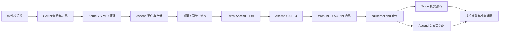

**中文** | [English](./README_EN.md)

# Ascend Kernel Infra：从推理框架走向 NPU 算子

本专题承接 [`learning/sglang-ascend-npu`](../sglang-ascend-npu/)：已有专题关注“如何让 SGLang 在 Ascend NPU 上正确、稳定地运行”，这里继续向下一层，关注“一个算子如何被表达、编译、注册、调用和优化”。

- [路线图](./ROADMAP.md)：查看主线、前置关系和待深化主题；

核心学习对象是：

- [`sgl-kernel-npu`](https://github.com/sgl-project/sgl-kernel-npu)：SGLang 面向 Ascend NPU 的专用 kernel 库；
- [`Triton-Ascend`](https://github.com/triton-lang/triton-ascend)：让 Triton kernel 编译并运行在 Ascend NPU 上的语言、编译器和运行时后端；
- [Ascend C](https://www.hiascend.com/document/detail/zh/CANNCommunityEdition/900beta1/opdevg/Ascendcopdevg/atlas_ascendc_map_10_0002.html)：CANN 提供的原生 NPU 算子编程语言与 API 体系；
- [`torch_npu`](https://github.com/Ascend/pytorch)：PyTorch 与 Ascend NPU 之间的设备后端和算子适配层；
- SGLang：提供真实的 LLM serving 场景、shape、layout、调度和性能目标。

## 这条学习线解决什么问题

学完后，应能完成下面这条完整工作链：

```text
从 SGLang 中发现热点或缺失算子
  -> 明确输入、输出、shape、dtype、layout 和调用频率
  -> 判断使用 torch_npu、Triton-Ascend 还是 Ascend C
  -> 在 sgl-kernel-npu 中实现并暴露算子
  -> 做正确性测试、benchmark 和 profiling
  -> 接回 SGLang 并验证端到端收益
```

这里不重复详细介绍 Scheduler、Radix Cache、continuous batching 等 SGLang 上层机制。需要这些背景时，回到 [`learning/sglang-source-reading`](../sglang-source-reading/) 和 [`learning/ai-infra-basic`](../ai-infra-basic/) 查阅。

## 课程目录

### 0. 定位软件栈

| 内容 | 目标 |
|---|---|
| [01：SGLang、sgl-kernel-npu、Triton-Ascend、Ascend C、torch_npu 的关系](./01-stack-and-relationships.md) | 先分清产品、框架、编译器、编程语言和运行时边界 |
| [02：CANN 全栈与边界](./02-cann-stack-and-boundaries.md) | 分清 Driver/Firmware、Runtime、AscendCL、算子库、编译器、Tiling、Platform、HCCL 的职责 |

### 1. Foundations：初学者必须先懂的硬件与并行基础

| 内容 | 核心术语 |
|---|---|
| [基础 01：从一个公式到并行 Kernel](./foundations/01-kernel-first-principles.md) | operator、kernel、Host/Device、SPMD、program、grid、tile、shape/stride |
| [基础 02：Ascend NPU、AI Core 与存储层级](./foundations/02-ascend-hardware.md) | AI Core、AIC/AIV、Cube、Vector、Scalar、MTE、GM/L1/L0/UB |
| [基础 03：搬运、计算、同步与流水](./foundations/03-memory-pipeline-and-sync.md) | CopyIn/Compute/CopyOut、queue、pipeline、double buffer、同步、算术强度 |

### 2. Triton-Ascend：从 Python Tile DSL 到 NPU Kernel

| 内容 | 学习成果 |
|---|---|
| [Triton 01：Program、Grid、Tile 与第一个 Kernel](./triton-ascend/01-program-grid-tile.md) | 能逐行解释 Vector Add，并理解 NPU 的物理核 grid 策略 |
| [Triton 02：地址、广播、归约与矩阵分块](./triton-ascend/02-tensor-addressing-reduction-matmul.md) | 能阅读二维地址、RMSNorm、MatMul 与 CV fusion |
| [Triton 03：编译、调试与性能优化](./triton-ascend/03-compile-debug-optimize.md) | 能区分用户 kernel/compiler/driver 问题，建立 UB、autotune、benchmark 闭环 |
| [Triton 04：TTIR、MLIR、Driver 与 Cache](./triton-ascend/04-ttir-mlir-driver-and-cache.md) | 能把 Python kernel 对应到真实编译阶段、launcher stub、缓存命中与中间产物 |
| [Triton 05：Persistent Kernel、大 Grid 与 Task Queue 边界](./triton-ascend/05-persistent-kernel-and-large-grid.md) | 能区分手写 persistent、auto-blockify 与 runtime task queue，并读懂官方 `09-persistent-matmul.py` |

### 3. Ascend C：显式管理存储、队列和流水

| 内容 | 学习成果 |
|---|---|
| [Ascend C 01：Global/Local Tensor、TPipe 与 TQue](./ascend-c/01-global-local-tensor-pipe-queue.md) | 能读懂 Vector kernel 的 Init/Process/CopyIn/Compute/CopyOut |
| [Ascend C 02：一个 Add 算子的端到端工程](./ascend-c/02-add-operator-end-to-end.md) | 理解 Host tiling、blockDim、launch、PyTorch 注册和 shared library |
| [Ascend C 03：Tiling、流水、同步与性能优化](./ascend-c/03-tiling-pipeline-sync-optimization.md) | 能分析多核/核内 tiling、double buffer、Cube/CV 流水和同步开销 |
| [Ascend C 04：Platform、Tiling、Workspace 与 Host/Device 契约](./ascend-c/04-platform-tiling-and-workspace-contracts.md) | 能区分平台信息、执行计划、临时 scratch 和变体选择，并读懂真实 `op_host/*.cpp` 的 launch 路径 |

### 4. torch_npu 与 ACLNN：看懂现成算子路径

| 内容 | 学习成果 |
|---|---|
| [torch_npu 01：Dispatcher、ACLNN 与 Custom Op 的边界](./torch_npu/01-dispatch-aclnn-and-custom-op-boundaries.md) | 能区分标准 `torch`/`torch_npu`/`torch.ops.*` 调用分别落到哪条 NPU 路径 |

### 5. sgl-kernel-npu：回到真实生产源码

| 内容 | 源码案例 |
|---|---|
| [源码 01：仓库结构与算子生命周期](./sgl-kernel-npu/01-repository-and-op-lifecycle.md) | import、wrapper、`.so`、PyTorch dispatcher、Host-side dispatch、launch stub 与 device kernel 的边界 |
| [源码 02：Triton Fused Split Q/K Norm](./sgl-kernel-npu/02-triton-fused-split-qk-norm.md) | `(B,)` grid、三段 tile、FP32 reduction、constexpr bias fusion |
| [源码 03：Ascend C Apply Token Bitmask](./sgl-kernel-npu/03-ascend-c-apply-token-bitmask.md) | Host UB tiling、按行分核、三个 TQue、packed bitmask 与异步生命周期 |
| [源码 04：FLA Chunk Gated Delta Rule 的双路径入口](./sgl-kernel-npu/04-fla-chunk-gated-delta-rule-mixed-path.md) | 同一 Python API 如何在分段 Triton 与 mega custom op 之间分流，并管理 `packed B=1`、`cu_seqlens`、state、`blockDim` 与 workspace 契约 |
| [源码 05：DeepEP、HCCL 与 MoE token 路径](./sgl-kernel-npu/05-deepep-hccl-and-moe-kernel-path.md) | 看懂 `deep_ep::Buffer` 如何把 router 的 top-k 路由变成 `layout -> dispatch -> local expert compute -> combine`，并定位 `fused_deep_moe` / `dispatch_ffn_combine` |
| [源码 06：DeepEP Low-Latency、A2 Layered 与小 Batch 推理路径](./sgl-kernel-npu/06-deepep-low-latency-and-layered-a2-path.md) | 看懂为什么小 batch 推理要改走 `low_latency_dispatch/low_latency_combine`，以及 A2 的 layered 路径如何把同机 HCCS 与跨机 RDMA 组合起来 |
| [源码 08：FLA Mega Kernel、Device Stage 与 Ascend 数据流](./sgl-kernel-npu/08-fla-mega-kernel-device-stages.md) | 从 Python wrapper、schema/Host 入口一路读到 7 个 device stage，理解 mega kernel 的原理、AIV/AIC 协作、GM workspace 与同步代价 |

### 6. Reference：工作时反复查阅

| 内容 | 用途 |
|---|---|
| [代码阅读手册：变量类型、形状、地址与源码实现](./reference/code-reading-and-types.md) | 逐层区分 Python 对象、Triton IR 类型、pointer/value block、Ascend C Global/Local Tensor，并解释 pointer 为什么能与 offset 相加 |
| [技术选型：何时复用、何时 Triton、何时 Ascend C](./reference/technology-comparison.md) | 特点、优劣势、决策树、评审清单 |
| [术语表](./reference/glossary.md) | 集中解释 program、grid、tile、AI Core、GlobalTensor、流水等名词 |

## 推荐学习顺序



第一遍建议先走完“软件栈关系 -> CANN 全栈 -> Kernel/SPMD 基础”，再进入 Triton-Ascend 和 Ascend C。这样做的原因是：先把“谁负责执行、谁负责编译、谁负责通信、谁负责切分”分清，后面的源码名词才不会混成一团。之后仍建议先学 Triton-Ascend，再学 Ascend C。Triton 用较少样板代码暴露并行算法的核心，适合建立 program/tile 直觉；Ascend C 再把编译器背后隐藏的片上存储、搬运、队列和同步展开。这个顺序是为了降低学习坡度，不代表 Triton 或 Ascend C 有固定的性能高低。

已有 Triton/CUDA 经验时，可以从“基础 02”开始；已有 Ascend C 经验时，可以更快进入 `torch_npu/01` 和 `sgl-kernel-npu/` 源码导读，但建议先过一遍软件栈关系，避免混淆 `torch.ops.*`、ACLNN 和 custom kernel 的实现归属。

## 源码基线

本轮源码导读固定到以下 commit，避免主分支变化导致行号和结论漂移：

- `sgl-kernel-npu`: [`d5630dff41c8108216f835597e63f6d3a7445908`](https://github.com/sgl-project/sgl-kernel-npu/tree/d5630dff41c8108216f835597e63f6d3a7445908)。本地参考仓库当前工作树仍停在 `b2378ee05769cf7df209ffc5e1b669728f435a7e`，但已存在 `origin/main -> d5630df` 的远端跟踪引用；本轮据此对 `README.md`、`csrc/deepep/` 与 `tests/python/deepep/` 做对象级 diff，确认新增的 DeepEP 05-06 章节依赖路径在 `b2378ee..d5630df` 之间无差异；
- `triton-ascend`: [`be90ac7e52267822c0ea83d20b705c1e4eaf586f`](https://github.com/triton-lang/triton-ascend/tree/be90ac7e52267822c0ea83d20b705c1e4eaf586f)，本地 `origin/main` 跟踪引用与当前参考工作树一致。
- `torch_npu`: [`86986b9711ef597e83edc41da1f02c34a03fea7b`](https://github.com/Ascend/pytorch/tree/86986b9711ef597e83edc41da1f02c34a03fea7b)，2026-07-04 核对远端 `HEAD`；
- CANN 文档与兼容关系：本轮按 Triton-Ascend 3.2.1 README 中给出的 `CANN 9.0.0` 兼容矩阵解读，真实环境仍需按目标硬件与 `torch_npu` 版本复核。

阅读自己环境中的源码时，请重新记录 commit、CANN、torch/torch_npu 和硬件型号。

## 阅读约定

- 仓库名使用连字符：`sgl-kernel-npu`、`torch-npu`、`triton-ascend`；Python import 通常使用下划线，例如 `sgl_kernel_npu`、`torch_npu`。
- `kernel` 指在 NPU 设备侧执行的计算程序；“算子”还可能包含 host 侧 shape 推导、tiling、注册、workspace 管理和 Python wrapper。
- 文中的目录和 API 会随仓库演进；源码学习必须记录 SGLang、sgl-kernel-npu、torch_npu、Triton-Ascend 与 CANN 的版本或 commit。
- 本专题默认讨论 Ascend NPU，不把 CUDA Triton 的经验原样套用。相同 Triton 语法不代表相同的硬件核数、存储层级或最优切分。
- 所有代码先按[代码阅读手册](./reference/code-reading-and-types.md)区分宿主语言类型、编译期/运行时、元素 dtype、静态 shape 与地址空间。Triton 的 `tl.tensor` 不等于 `torch.Tensor`；Ascend C 的 `GlobalTensor<T>`/`LocalTensor<T>` 是 typed view，不等于自动完成搬运的容器。
- 代码块只使用“可运行最小例子”“固定 commit 的源码摘录”或“结构图/执行序列”三种标签。结构说明使用 `text`/Mermaid，不再把带有未声明 `...` 或虚构 API 的片段放进 Python/C++ 代码块。
- 当前工作区没有 Ascend NPU/CANN 运行环境，因此可运行例子只完成源码、类型与 Markdown 静态校验，未声称实际执行了 NPU kernel。
