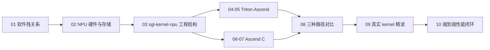

# Ascend Kernel Infra：从推理框架走向 NPU 算子

本专题承接 [`learning/sglang-ascend-npu`](../sglang-ascend-npu/)：已有专题关注“如何让 SGLang 在 Ascend NPU 上正确、稳定地运行”，这里继续向下一层，关注“一个算子如何被表达、编译、注册、调用和优化”。

核心学习对象是：

- [`sgl-kernel-npu`](https://github.com/sgl-project/sgl-kernel-npu)：SGLang 面向 Ascend NPU 的专用 kernel 库；
- [`Triton-Ascend`](https://github.com/triton-lang/triton-ascend)：让 Triton kernel 编译并运行在 Ascend NPU 上的语言、编译器和运行时后端；
- [Ascend C](https://www.hiascend.com/document/detail/zh/CANNCommunityEdition/900beta1/opdevg/Ascendcopdevg/atlas_ascendc_map_10_0002.html)：CANN 提供的原生 NPU 算子编程语言与 API 体系；
- [`torch_npu`](https://github.com/Ascend/pytorch)：PyTorch 与 Ascend NPU 之间的设备后端和算子适配层；
- SGLang：提供真实的 LLM serving 场景、shape、layout、调度和性能目标。

## 这条学习线解决什么问题

学完后，应能完成下面这条完整工作链：

```text
从 SGLang 中发现热点或缺失算子
  -> 明确输入、输出、shape、dtype、layout 和调用频率
  -> 判断使用 torch_npu、Triton-Ascend 还是 Ascend C
  -> 在 sgl-kernel-npu 中实现并暴露算子
  -> 做正确性测试、benchmark 和 profiling
  -> 接回 SGLang 并验证端到端收益
```

这里不重复详细介绍 Scheduler、Radix Cache、continuous batching 等 SGLang 上层机制。需要这些背景时，回到 [`learning/sglang-source-reading`](../sglang-source-reading/) 和 [`learning/ai-infra-basic`](../ai-infra-basic/) 查阅。

## 课程目录

| 讲次 | 主题 | 状态 |
|---|---|---|
| [01](./01-stack-and-relationships.md) | SGLang、sgl-kernel-npu、Triton-Ascend、Ascend C、torch_npu 的关系 | 已完成 |
| 02 | Ascend AI Core、Cube/Vector、GM/UB/L1/L0 与 SPMD 执行模型 | 规划中 |
| 03 | sgl-kernel-npu 仓库结构、构建系统、Python wrapper 与 PyTorch op 注册 | 规划中 |
| 04 | Triton-Ascend 入门：第一个 kernel、grid、tile、load/store 与 mask | 规划中 |
| 05 | Triton-Ascend 调优：核数、数据搬运、计算、流水与编译产物 | 规划中 |
| 06 | Ascend C 入门：GlobalTensor、LocalTensor、TPipe、TQue 与 DataCopy | 规划中 |
| 07 | Ascend C 完整算子：host tiling、kernel、编译、注册与 PyTorch 调用 | 规划中 |
| 08 | 同一算子的 torch_npu、Triton-Ascend、Ascend C 三种实现对比 | 规划中 |
| 09 | sgl-kernel-npu 真实算子精读：Norm/RoPE/KV Cache/Attention | 规划中 |
| 10 | 正确性、benchmark、profiling 与接入 SGLang 的性能闭环 | 规划中 |

## 推荐学习顺序



第一遍建议先学 Triton-Ascend，再学 Ascend C。Triton 的抽象更接近数学表达和 tile 划分，适合快速建立 kernel 直觉；Ascend C 暴露更多片上存储、搬运、队列和流水细节，适合继续追求硬件控制与极致性能。这是学习顺序，不是性能高低的固定结论。

## 阅读约定

- 仓库名使用连字符：`sgl-kernel-npu`、`torch-npu`、`triton-ascend`；Python import 通常使用下划线，例如 `sgl_kernel_npu`、`torch_npu`。
- `kernel` 指在 NPU 设备侧执行的计算程序；“算子”还可能包含 host 侧 shape 推导、tiling、注册、workspace 管理和 Python wrapper。
- 文中的目录和 API 会随仓库演进；源码学习必须记录 SGLang、sgl-kernel-npu、torch_npu、Triton-Ascend 与 CANN 的版本或 commit。
- 本专题默认讨论 Ascend NPU，不把 CUDA Triton 的经验原样套用。相同 Triton 语法不代表相同的硬件核数、存储层级或最优切分。
