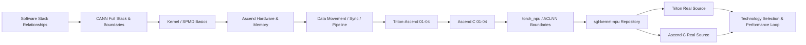

[中文](./README.md) | [English](./README_EN.md)

# Ascend Kernel Infra: From Inference Framework to NPU Operators

This topic builds upon [`learning/sglang-ascend-npu`](../sglang-ascend-npu/): that topic focuses on "how to make SGLang run correctly and stably on Ascend NPU," while here we dive one layer deeper to focus on "how an operator is expressed, compiled, registered, invoked, and optimized."

- [Roadmap](./ROADMAP.md): View the main thread, prerequisites, and topics for deeper exploration.

Core learning targets:

- [`sgl-kernel-npu`](https://github.com/sgl-project/sgl-kernel-npu): SGLang's dedicated kernel library for Ascend NPU.
- [`Triton-Ascend`](https://github.com/triton-lang/triton-ascend): Language, compiler, and runtime backend for compiling and running Triton kernels on Ascend NPU.
- [Ascend C](https://www.hiascend.com/document/detail/zh/CANNCommunityEdition/900beta1/opdevg/Ascendcopdevg/atlas_ascendc_map_10_0002.html): Native NPU operator programming language and API system provided by CANN.
- [`torch_npu`](https://github.com/Ascend/pytorch): Device backend and operator adaptation layer between PyTorch and Ascend NPU.
- SGLang: Provides real LLM serving scenarios, shapes, layouts, scheduling, and performance targets.

## What This Learning Track Solves

Upon completion, you should be able to execute this complete workflow:

```text
Discover hotspots or missing operators in SGLang
  -> Clarify inputs, outputs, shapes, dtypes, layouts, and invocation frequency
  -> Decide between torch_npu, Triton-Ascend, or Ascend C
  -> Implement and expose the operator in sgl-kernel-npu
  -> Perform correctness tests, benchmarks, and profiling
  -> Integrate back into SGLang and verify end-to-end benefits
```

This track does not re-explain SGLang upper-level mechanisms like Scheduler, Radix Cache, continuous batching, etc. Refer back to [`learning/sglang-source-reading`](../sglang-source-reading/) and [`learning/ai-infra-basic`](../ai-infra-basic/) for that background.

## Course Directory

### 0. Positioning the Software Stack

| Content | Goal |
|---|---|
| [01: Relationships between SGLang, sgl-kernel-npu, Triton-Ascend, Ascend C, torch_npu](./01-stack-and-relationships.md) | Distinguish product, framework, compiler, programming language, and runtime boundaries |
| [02: CANN Full Stack & Boundaries](./02-cann-stack-and-boundaries.md) | Distinguish responsibilities of Driver/Firmware, Runtime, AscendCL, operator libraries, compiler, Tiling, Platform, HCCL |

### 1. Foundations: Hardware & Parallelism Basics for Beginners

| Content | Core Terms |
|---|---|
| [Foundation 01: From a Formula to Parallel Kernel](./foundations/01-kernel-first-principles.md) | operator, kernel, Host/Device, SPMD, program, grid, tile, shape/stride |
| [Foundation 02: Ascend NPU, AI Core & Memory Hierarchy](./foundations/02-ascend-hardware.md) | AI Core, AIC/AIV, Cube, Vector, Scalar, MTE, GM/L1/L0/UB |
| [Foundation 03: Data Movement, Compute, Sync & Pipelining](./foundations/03-memory-pipeline-and-sync.md) | CopyIn/Compute/CopyOut, queue, pipeline, double buffer, synchronization, arithmetic intensity |

### 2. Triton-Ascend: From Python Tile DSL to NPU Kernel

| Content | Learning Outcome |
|---|---|
| [Triton 01: Program, Grid, Tile & First Kernel](./triton-ascend/01-program-grid-tile.md) | Explain Vector Add line-by-line and understand NPU physical core grid strategy |
| [Triton 02: Addressing, Broadcasting, Reduction & Matrix Tiling](./triton-ascend/02-tensor-addressing-reduction-matmul.md) | Read 2D addressing, RMSNorm, MatMul, and CV fusion |
| [Triton 03: Compilation, Debugging & Performance Optimization](./triton-ascend/03-compile-debug-optimize.md) | Distinguish user kernel/compiler/driver issues; establish UB, autotune, benchmark loop |
| [Triton 04: TTIR, MLIR, Driver & Cache](./triton-ascend/04-ttir-mlir-driver-and-cache.md) | Map Python kernels to real compilation stages, launcher stubs, cache hits, and intermediate artifacts |
| [Triton 05: Persistent Kernel, Large Grid & Task Queue Boundaries](./triton-ascend/05-persistent-kernel-and-large-grid.md) | Distinguish hand-written persistent, auto-blockify, and runtime task queue; read official `09-persistent-matmul.py` |

### 3. Ascend C: Explicit Memory, Queue & Pipeline Management

| Content | Learning Outcome |
|---|---|
| [Ascend C 01: Global/Local Tensor, TPipe & TQue](./ascend-c/01-global-local-tensor-pipe-queue.md) | Read Vector kernel's Init/Process/CopyIn/Compute/CopyOut |
| [Ascend C 02: An Add Operator End-to-End](./ascend-c/02-add-operator-end-to-end.md) | Understand Host tiling, blockDim, launch, PyTorch registration, and shared library |
| [Ascend C 03: Tiling, Pipeline, Sync & Performance Optimization](./ascend-c/03-tiling-pipeline-sync-optimization.md) | Analyze multi-core/intra-core tiling, double buffer, Cube/CV pipeline, and sync overhead |
| [Ascend C 04: Platform, Tiling, Workspace & Host/Device Contracts](./ascend-c/04-platform-tiling-and-workspace-contracts.md) | Distinguish platform info, execution plans, temporary scratch, and variant selection; read real `op_host/*.cpp` launch paths |

### 4. torch_npu & ACLNN: Understanding Existing Operator Paths

| Content | Learning Outcome |
|---|---|
| [torch_npu 01: Dispatcher, ACLNN & Custom Op Boundaries](./torch_npu/01-dispatch-aclnn-and-custom-op-boundaries.md) | Distinguish which NPU path standard `torch`/`torch_npu`/`torch.ops.*` calls land on |

### 5. sgl-kernel-npu: Back to Real Production Source Code

| Content | Source Case Study |
|---|---|
| [Source 01: Repository Structure & Operator Lifecycle](./sgl-kernel-npu/01-repository-and-op-lifecycle.md) | Boundaries between import, wrapper, `.so`, PyTorch dispatcher, Host-side dispatch, launch stub, and device kernel |
| [Source 02: Triton Fused Split Q/K Norm](./sgl-kernel-npu/02-triton-fused-split-qk-norm.md) | `(B,)` grid, three-segment tile, FP32 reduction, constexpr bias fusion |
| [Source 03: Ascend C Apply Token Bitmask](./sgl-kernel-npu/03-ascend-c-apply-token-bitmask.md) | Host UB tiling, row-wise core assignment, three TQue, packed bitmask, and async lifecycle |
| [Source 04: FLA Chunk Gated Delta Rule Dual-Path Entry](./sgl-kernel-npu/04-fla-chunk-gated-delta-rule-mixed-path.md) | How the same Python API splits between segmented Triton and mega custom op paths, managing `packed B=1`, `cu_seqlens`, state, `blockDim`, and workspace contracts |
| [Source 05: DeepEP, HCCL & MoE Token Path](./sgl-kernel-npu/05-deepep-hccl-and-moe-kernel-path.md) | Understand how `deep_ep::Buffer` converts router top-k routing into `layout -> dispatch -> local expert compute -> combine`, and locate `fused_deep_moe` / `dispatch_ffn_combine` |
| [Source 06: DeepEP Low-Latency, A2 Layered & Small Batch Inference Path](./sgl-kernel-npu/06-deepep-low-latency-and-layered-a2-path.md) | Understand why small batch inference switches to `low_latency_dispatch/low_latency_combine`, and how A2's layered path combines same-node HCCS with cross-node RDMA |
| [Source 08: FLA Mega Kernel, Device Stages & Ascend Dataflow](./sgl-kernel-npu/08-fla-mega-kernel-device-stages.md) | From Python wrapper, schema/Host entry, through 7 device stages; understand mega kernel principles, AIV/AIC collaboration, GM workspace, and sync cost |

### 6. Reference: For Repeated Consultation

| Content | Use |
|---|---|
| [Code Reading Manual: Variable Types, Shapes, Addresses & Source Implementation](./reference/code-reading-and-types.md) | Layer-by-layer distinction of Python objects, Triton IR types, pointer/value blocks, Ascend C Global/Local Tensor; explains why pointer can be added to offset |
| [Technology Selection: When to Reuse, When Triton, When Ascend C](./reference/technology-comparison.md) | Characteristics, pros/cons, decision tree, review checklist |
| [Glossary](./reference/glossary.md) | Centralized explanation of program, grid, tile, AI Core, GlobalTensor, pipeline, and other terms |

## Recommended Learning Order



First pass recommendation: complete "Software Stack Relationships -> CANN Full Stack -> Kernel/SPMD Basics", then enter Triton-Ascend and Ascend C. The reason: first clarify "who executes, who compiles, who communicates, who partitions", so later source code terms don't get mixed up. Still recommend learning Triton-Ascend before Ascend C. Triton exposes parallel algorithm cores with less boilerplate, ideal for building program/tile intuition; Ascend C then unfolds the on-chip storage, data movement, queues, and synchronization hidden behind the compiler. This order reduces the learning curve, not implying fixed performance ranking between Triton and Ascend C.

If you have existing Triton/CUDA experience, start from "Foundation 02"; if you have existing Ascend C experience, you can move faster into `torch_npu/01` and `sgl-kernel-npu/` source walkthrough, but still recommend going through the software stack relationships first to avoid confusing `torch.ops.*`, ACLNN, and custom kernel implementation ownership.

## Source Baseline

This round of source walkthrough is pinned to the following commits to prevent main branch changes from causing line number and conclusion drift:

- `sgl-kernel-npu`: [`d5630dff41c8108216f835597e63f6d3a7445908`](https://github.com/sgl-project/sgl-kernel-npu/tree/d5630dff41c8108216f835597e63f6d3a7445908)
- `triton-ascend`: [`be90ac7e52267822c0ea83d20b705c1e4eaf586f`](https://github.com/triton-lang/triton-ascend/tree/be90ac7e52267822c0ea83d20b705c1e4eaf586f)
- `torch_npu`: [`86986b9711ef597e83edc41da1f02c34a03fea7b`](https://github.com/Ascend/pytorch/tree/86986b9711ef597e83edc41da1f02c34a03fea7b)

When reading source code in your own environment, re-record the commit, CANN, torch/torch_npu versions, and hardware model.

## Reading Conventions

- Repository names use hyphens: `sgl-kernel-npu`, `torch-npu`, `triton-ascend`; Python imports typically use underscores, e.g., `sgl_kernel_npu`, `torch_npu`.
- `kernel` refers to the compute program executing on the NPU device side; "operator" may also include host-side shape inference, tiling, registration, workspace management, and Python wrappers.
- Directories and APIs in the text will evolve with repositories; source code learning must record SGLang, sgl-kernel-npu, torch_npu, Triton-Ascend, and CANN versions or commits.
- This topic assumes Ascend NPU by default; do not directly apply CUDA Triton experience. Same Triton syntax does not mean the same hardware core count, memory hierarchy, or optimal partitioning.
- All code should first be read per the [Code Reading Manual](./reference/code-reading-and-types.md): distinguish host language types, compile-time/runtime, element dtypes, static shapes, and address spaces. Triton's `tl.tensor` is not `torch.Tensor`; Ascend C's `GlobalTensor<T>`/`LocalTensor<T>` are typed views, not containers that auto-complete data movement.
- Code blocks use only three labels: "minimum runnable example", "fixed-commit source excerpt", or "structure diagram/execution sequence". Structural explanations use `text`/Mermaid.
- The current workspace has no Ascend NPU/CANN runtime environment, so runnable examples only complete source, type, and Markdown static validation; they do not claim actual NPU kernel execution.
