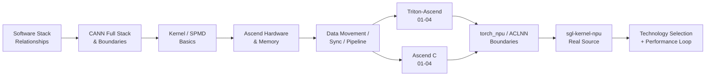

[中文](./ROADMAP.md) | [English](./ROADMAP_EN.md)

# Ascend Kernel Infra Learning Roadmap

## Main Thread

## Prerequisites

| Topic | Required? | Best Resource |
|---|---|---|
| Python + PyTorch basics | ✅ Required | PyTorch official tutorials |
| LLM inference concepts | ✅ Required | `ai-infra-basic/` in this repo |
| SGLang architecture | ✅ Required | `sglang-source-reading/` in this repo |
| CUDA/Triton experience | Helpful but not required | — |
| Ascend C experience | Not required | This track teaches from scratch |

## Learning Phases

### Phase 1: Orientation (2 files)
- 01-stack-and-relationships.md
- 02-cann-stack-and-boundaries.md

### Phase 2: Hardware Foundations (3 files)
- foundations/01-kernel-first-principles.md
- foundations/02-ascend-hardware.md
- foundations/03-memory-pipeline-and-sync.md

### Phase 3: Triton-Ascend (5 files)
- triton-ascend/01 through 05

### Phase 4: Ascend C (4 files)
- ascend-c/01 through 04

### Phase 5: Integration Point
- torch_npu/01-dispatch-aclnn-and-custom-op-boundaries.md

### Phase 6: Production Source (7 files)
- sgl-kernel-npu/01 through 08

### Phase 7: Reference (3 files)
- reference/code-reading-and-types.md
- reference/technology-comparison.md
- reference/glossary.md

## Estimated Time

| Phase | Files | Estimated Time |
|---|---|---|
| Orientation | 2 | 2-4 hours |
| Foundations | 3 | 4-8 hours |
| Triton-Ascend | 5 | 8-16 hours |
| Ascend C | 4 | 8-16 hours |
| Integration | 1 | 2-4 hours |
| Production Source | 7 | 14-28 hours |
| Reference | 3 | Ongoing |
| **Total** | **25** | **~40-80 hours** |
