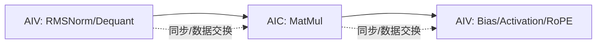

**中文** | [English](./03-tiling-pipeline-sync-optimization_EN.md)

# Ascend C 03：Tiling、流水、同步与性能优化

本章关注 Ascend C 的核心价值：当编译器自动策略不够时，开发者可以显式设计数据通路和流水。

本章不把性能参数当作无类型的“数字”。请配合[代码阅读手册](../reference/code-reading-and-types.md)阅读：Host 的 Python/C++ 整数、tiling ABI 的固定宽度字段、Device Scalar 变量和 `LocalTensor` 数据块处在不同层，不能互换。

## 1. 性能优化从瓶颈分类开始

```text
搬运受限：GM/Local 流量大、访问不连续、粒度太小
计算受限：Cube/Vector 利用率低、tile 不合适、dtype 路径不佳
控制受限：Scalar 循环/分支/地址计算过重
同步受限：等待事件过多、AIC/AIV 不平衡
启动受限：小 kernel 太多、每核工作量太小
```

没有分类就直接改 tile，常得到偶然收益而非可解释优化。

## 2. 多核 Tiling

目标是让各核工作量接近，同时减少尾核和跨核依赖。

均匀一维切分：

```text
base = total // blockDim
extra = total % blockDim

前 extra 个核：base + 1
其余核：base
```

矩阵/Attention 则可能按行、head、batch、token block 或二维 tile 切分。选择维度时看：

- 数据连续性；
- 每核计算量；
- 是否共享权重/KV；
- 是否需要跨核 reduce；
- 尾块比例。

把这些量落到真实类型时，常见分工是：

| 名字类别 | 推荐/常见类型 | 所在阶段 | 单位 |
|---|---|---|---|
| `blockDim` | Host `uint32_t`/Python `int`，再作为 launch 配置 | Host/runtime | 实例数 |
| `tileLength/elementsPerCore` | tiling ABI `uint32_t` | Host 计算、Device Scalar 读取 | 元素 |
| `tileBytes/workspaceSize` | `uint64_t` 或经过范围验证的 `uint32_t` | Host | 字节 |
| `tilingKey` | 固定宽度整数或生成框架定义类型 | Host→编译/launch 选择 | 变体编号，不是长度 |
| `LocalTensor<T>` | Ascend C template type | Device | typed local view |

性能事故经常来自单位而非公式：把 `tileLength` 直接传给要求 bytes 的 `InitBuffer` 会少乘 `sizeof(T)`；把 `workspaceSize` 缩进 32 位可能溢出；把 Python 任意精度 `int` 传进固定宽度 ABI 前没有范围检查，也可能截断。

## 3. 核内 Tiling

核内 tile 的上界由 Local Memory 决定，下界由搬运效率和指令利用率决定。

先画生命周期：

```text
x tile: CopyIn 开始 -> Compute 结束
w tile: 可能跨多个 compute tile 复用
acc   : K-loop 全程存活
out   : Compute 完成 -> CopyOut 完成
```

只有生命周期重叠的对象才必须同时占用空间。缩短临时 tensor 生命周期可允许更大 tile。

## 4. Double Buffer 的预算

```text
单 buffer：in + temp + out
double buffer：常见是 2×in + temp + 2×out
```

不是所有 buffer 都必须双份。若 output 搬出很快、input 搬入是瓶颈，可以只对关键队列双缓冲，具体取决于 API 和依赖结构。

## 5. Queue Depth 与 Buffer Number

官方文档明确区分：

- Queue depth：允许连续 `EnQue` 而未 `DeQue` 的次数；
- Buffer number：`InitBuffer` 分配的内存块数，2 常表示 double buffer。

队列深度盲目设大不仅不等于更多流水，还可能增加事件/资源占用。非原地常见路径下，深度 1 往往更容易优化。

## 6. 同步的三条原则

1. **先保证数据依赖正确**：消费者必须等生产者完成；
2. **只同步必要范围**：能核内 event 就不要全核 barrier；
3. **让独立通路重叠**：MTE、Vector、Cube 无依赖时不要串行等待。

过度同步的典型症状是 trace 中出现长等待，计算/搬运单元交替空闲。

## 7. Vector 流水

Vector 常见：

```text
CopyIn(GM->UB) -> Compute(Vector) -> CopyOut(UB->GM)
```

优化方向：

- 合并小 DataCopy；
- 保证 32B 等目标要求的对齐；
- 使用 ping/pong buffer；
- 避免逐元素 `GetValue/SetValue` 的 Scalar 循环；
- 用 Vector API 批量处理；
- 融合连续 elementwise，减少 GM round-trip。

## 8. Cube 流水

Cube 的概念链更长：

```text
GM -> L1(A1/B1) -> L0A/L0B(A2/B2)
   -> Mmad/Cube -> L0C(CO1)
   -> 输出通路/CO2 -> GM
```

重点：

- A/B tile 在 L1 中的复用；
- L1→L0 与 Cube 计算重叠；
- accumulator 大小；
- format/transpose 成本；
- K 方向流水与尾块；
- FixPipe/输出阶段是否成为瓶颈。

## 9. CV Fusion

矩阵乘前后常有 Vector 逻辑：RMSNorm、dequant、bias、activation、RoPE、quant。融合可减少 GM 中间结果，但要协调 AIC 与 AIV。



如果 AIC 计算 10 微秒而 AIV epilogue 40 微秒，Cube 会等待 Vector；融合并不自动等于平衡。

## 10. 对齐和 Padding

常见策略：

- Host 端 padding 到友好长度；
- Device 尾块用非对齐 DataCopy 参数；
- 计算多做少量 padding，但 store 只写有效元素；
- 改变 layout/借轴转置，让连续轴满足粒度。

Padding 是“用多一点计算换更规则搬运”，是否划算要用真实 shape 测量。

## 11. 静态 Tensor 编程

较新的 Ascend C 还提供更低开销的静态 Tensor 编程方式，可避免部分 TPipe 初始化开销，但开发者要自行管理 buffer 和同步，且 API 使用范围可能更受限制。

适合：

- 极低延迟小 kernel；
- TPipe 初始化占比明显；
- 团队能承担显式资源与同步复杂度。

不适合把它当作所有算子的默认起点。初学者应先掌握 TPipe/TQue，再理解为何要绕开它。

## 12. 调优闭环

```text
固定正确性测试
  -> 采集 baseline trace
  -> 判断搬运/计算/控制/同步/启动瓶颈
  -> 一次只改一个关键策略
  -> microbenchmark 多 shape
  -> 查看 trace 是否按预期变化
  -> 端到端 SGLang 验证
```

记录每次实验的硬件、CANN、commit、shape、dtype、blockDim、tile 和结果。没有实验表的调优很快会变成“我记得这个参数更快”。

## 13. Ascend C 适合与不适合的场景

### 更适合

- 需要显式 AIC/AIV 协作；
- 对 GM/L1/L0/UB 数据通路有强控制需求；
- 复杂 layout、量化、通信或专用指令；
- Triton-Ascend 暂不支持所需语义；
- 核心热点值得长期维护原生实现。

### 未必优先

- 普通算子已有高质量 CANN/torch_npu 实现；
- 只是验证一个简单融合想法；
- shape/需求仍在快速变化；
- 缺少 NPU 测试与性能回归环境；
- 团队无法维护 CANN/硬件版本分支。

## 14. 本章检查点与参考答案

### 1. 多核 tiling 与核内 tiling 分别优化什么？

**答案：**多核 tiling 优化任务在核之间的并行和均衡，核内 tiling 优化单核 Local Memory、搬运粒度和流水。

多核层决定 `blockDim`、每核负责哪些 row/head/token，以及尾核是否负载过少。目标是让足够多物理核有工作，同时避免过细任务和跨核同步。

核内层决定每轮从 GM 搬多少数据、UB/L1/L0 是否放得下、能否 double buffer，以及计算与 CopyIn/CopyOut 能否重叠。多核切得再均匀，如果单核 tile 频繁做微小 DataCopy，仍可能很慢；单核 tile 很高效但只启动一个核，也无法利用整卡。两层需要联合设计。

### 2. 哪些 tensor 真正需要 double buffer？

**答案：**只有生命周期允许跨 tile 轮换、且对应阶段值得与其他阶段重叠的 tensor 才应优先双缓冲。

典型输入 tile 在“当前 tile 被 Compute 消费”时，可以让 MTE 把下一 tile 搬进另一块 buffer，因此适合 ping/pong。输出若 CopyOut 是明显瓶颈，也可能准备两块，使上一结果写回时下一结果正在计算。

长期跨循环保存的 accumulator、只初始化一次并复用的权重 tile、很小的临时标量未必适合双份。Double buffer 会占用额外 UB/L1，可能迫使 tile 变小；判断应基于 trace 中阶段重叠机会和内存预算，而不是把所有 Queue 的 buffer number 一律设成 2。

### 3. 为什么全核 barrier 往往比核内 event 更昂贵？

**答案：**同步范围越大，需要等待的参与者越多，慢者拖住所有人的概率越高。

核内 event 通常只约束同一核的两条指令通路，例如 MTE 完成某 buffer 搬入后 Vector 才消费。没有参与该数据依赖的其他核可以继续执行。

全核 barrier 要求相关核全部到达同步点；任一核因尾块、cache miss 或负载不均晚到，其他核都空闲等待。它还需要跨核协调机制。因此能用局部 queue/event 表达的依赖不应升级成全核 barrier；只有算法真的需要全局阶段一致时才使用大范围同步。

### 4. CV fusion 为什么可能被 AIV 阶段拖慢？

**答案：**融合减少了 GM 中间流量，但 AIC 与 AIV 仍形成有依赖的生产者—消费者流水，整体吞吐由较慢一侧限制。

例如 AIC matmul 10 微秒产生一块输出，而 AIV 完成 dequant、bias、activation 和 RoPE 需要 35 微秒。AIV 来不及消费时，AIC 的结果 buffer 和同步队列会积压，最终 AIC 等待 AIV，Cube 峰值再高也不能提高整体速度。

优化要看 AIC:AIV 资源比例、tile 粒度、数据交换和同步，可能拆分/重排 Vector epilogue、增加 AIV 并行、调整两侧 tile 或减少 Vector 工作。融合的收益来自少写 GM，但必须与核间负载平衡一起验证。

### 5. 静态 Tensor 编程用什么复杂度换取什么收益？

**答案：**它用手工 buffer 地址、生命周期、double buffer 和同步管理，换取更低的 TPipe 初始化/动态资源管理开销以及更精确的布局控制。

对于只有数微秒的固定小 kernel，数百纳秒级初始化和通用 Queue 管理可能占明显比例；静态 Tensor 可以预先规划片上地址并减少这部分开销。但开发者必须自己保证 ping/pong 不冲突、event 完整、对齐正确，并且可用 API 范围可能更受限制。

因此它适合已经通过 profiling 证明管理开销是瓶颈的成熟热点，不适合作为初学者和动态复杂算子的默认起点。收益是更低固定开销，代价是更高正确性风险、维护成本和架构耦合。

## 官方资料

- [Ascend C：TPipe/TQue 流水范式](https://www.hiascend.com/document/detail/en/canncommercial/850/opdevg/Ascendcopdevg/atlas_ascendc_10_00033.html)
- [Ascend C：Cube 编程范式](https://www.hiascend.com/document/detail/en/canncommercial/850/opdevg/Ascendcopdevg/atlas_ascendc_10_00006.html)
- [Ascend C：TQue 深度与 Double Buffer 区别](https://www.hiascend.com/document/detail/zh/canncommercial/900/API/ascendcopapi/atlasascendc_api_07_0137.html)
- [Ascend C：静态 Tensor 编程](https://www.hiascend.com/document/detail/zh/canncommercial/900/programug/Ascendcopdevg/atlas_ascendc_10_00019.html)
