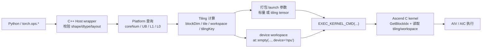

# Ascend C 04：Platform、Tiling、Workspace 与 Host/Device 契约

本章横跨 Host C++、launch ABI 和 Device C++。请先按[代码阅读手册](../reference/code-reading-and-types.md)建立类型边界：`at::Tensor` 是 Host 框架对象，`uint32_t/uint64_t` 是 tiling 标量，`GM_ADDR` 是 Device ABI 地址，三者不能因为都能“传给 kernel”就视为同一种类型。

本章承接 [`01-global-local-tensor-pipe-queue.md`](./01-global-local-tensor-pipe-queue.md)、[`02-add-operator-end-to-end.md`](./02-add-operator-end-to-end.md) 和 [`03-tiling-pipeline-sync-optimization.md`](./03-tiling-pipeline-sync-optimization.md)。

前几章已经解释了 device kernel 内部怎样搬运、计算和同步。这一章往前再退半步，专门回答 Host 侧最关键的五个问题：

1. Host 怎么知道这台 NPU 有多少 AIV/AIC、多少 UB/L1/L0？
2. Host 怎么把输入 shape 变成 `blockDim`、tile 长度和 kernel 变体选择？
3. `tiling data` 和 `workspace` 分别是什么，为什么它们都可能作为 kernel 参数出现？
4. 为什么有些算子只传几个标量就能 launch，有些算子却要额外构造字节缓冲区和缓存它？
5. 读 `sgl-kernel-npu/csrc/*/op_host/*.cpp` 时，怎样一眼看出 Host 代码到底在做哪一层决策？

> 前置章节：
> [`../02-cann-stack-and-boundaries.md`](../02-cann-stack-and-boundaries.md)
> [`./02-add-operator-end-to-end.md`](./02-add-operator-end-to-end.md)
> [`./03-tiling-pipeline-sync-optimization.md`](./03-tiling-pipeline-sync-optimization.md)
>
> 读完下一步：
> [`../sgl-kernel-npu/03-ascend-c-apply-token-bitmask.md`](../sgl-kernel-npu/03-ascend-c-apply-token-bitmask.md)
> 后续真实 `op_host/` 与 `op_kernel/` 源码精读

## 1. 学习目标

读完本章后，你应能独立回答：

- `Platform`、`blockDim`、`tiling data`、`workspace`、`tiling key` 各自负责什么；
- 为什么 `Platform` 负责“机器有什么”，`Tiling` 负责“这次输入怎么切”；
- 为什么 `workspace` 不是片上 UB，而是 Host 先在 device 全局内存中额外申请的临时区域；
- 为什么有些 kernel ABI 直接把 `numRows/tileLength` 当标量参数传入，有些 kernel ABI 则传 `GM_ADDR tiling`；
- 读到 `GetCoreNumAiv()`、`GetCoreMemSize()`、`GetLibApiWorkSpaceSize()`、`EXEC_KERNEL_CMD(...)` 时，应该怎样把它们放回完整调用链。

## 2. 前置知识

建议先具备三点：

- 已知道 `blockDim` 是“启动多少个逻辑实例”，不是“每个实例处理多少元素”；
- 已知道 `tile` 受 UB/L1/L0 容量、对齐和流水影响，不是随便拍脑袋写一个常数；
- 已知道 Ascend C 生产算子通常分成 Host 和 Device 两面，Device 只负责片上执行，Host 负责 launch 前的动态决策。

如果这三点还不稳，先回到前置章节。

## 3. 直观类比：Host 在写一张“这次怎么干活”的作业单

把一次 custom op launch 想成车间开工最容易建立直觉：

- **Platform** 是厂房规格表，告诉你这台机器有几组工位、每组本地仓库多大；
- **blockDim** 是这次开多少个工位同时干活；
- **tiling data** 是作业单，写着“每个工位负责哪一段、一次搬多少、尾块怎么处理”；
- **workspace** 是额外租的一块临时堆场，用来放中间结果或库内部需要的 scratch；
- **tiling key** 是工艺编号，告诉 kernel 或 launch stub 该走哪条实现分支。

这五个词的集中定义见 [`../reference/glossary.md`](../reference/glossary.md)，但第一次遇到它们时必须先在源码现场分清边界。

## 4. 先把五个词一次分清

| 名词 | 通俗直觉 | 精确定义 | 为什么需要它 | 不等于什么 |
|---|---|---|---|---|
| `Platform` | “机器规格表” | Host 侧查询当前 Ascend 目标设备核数、片上存储容量和架构能力的抽象层 | Host 不能把 AIV 数量、UB 大小写死成常量 | 不等于具体输入 shape，也不等于 tiling 结果 |
| `blockDim` | “这次派多少工位开工” | 一次 kernel launch 创建的逻辑实例数，Device 侧常用 `GetBlockIdx()` 取当前实例编号 | 决定多核并行度和每核负载 | 不等于 tile 长度，也不等于物理总核数 |
| `tiling data` | “本次作业单” | Host 依据 shape、dtype、layout 和硬件资源计算出的切分参数结构体或标量集合 | Device kernel 需要知道本次输入怎么切，而这些值常在 launch 前才知道 | 不等于编译期常量，也不等于 workspace |
| `workspace` | “额外租的临时堆场” | 在 device 全局内存中额外申请的 scratch 空间，供库接口或 kernel 在执行期间临时使用 | 有些算法或 launch 框架需要中间缓冲，输入输出本身放不下这些临时结果 | 不等于 UB/L1/L0，也不等于 `tiling data` |
| `tiling key` | “工艺编号” | Host 编码出的一个整数，用来区分不同转置、dtype、format、split-K 等实现变体 | 同一个 kernel 家族常支持多种路径，Device 或 launch stub 需要一个快速选择器 | 不等于 tile 大小本身，也不等于 Triton JIT cache key |

最重要的区分只有一句话：

> `Platform` 提供硬件事实，`Tiling` 消化“输入 + 硬件事实”得到执行计划，`workspace` 提供额外暂存空间，`blockDim` 和 `tiling key` 是执行计划里的两个不同字段。

## 5. 一张图先看完整数据流



图里最关键的观察有四个：

- `Platform` 查询发生在 Host，而不是 Device；
- `tiling` 先于 kernel launch 产生，因此它天然属于 Host/Device 协议；
- `workspace` 是 launch 前分配的 device tensor，不是 kernel 内部自己“顺手申请一下”；
- Device kernel 拿到的是“已经定好的计划”，不是自己重新做一次全局资源规划。

## 6. 真实 Host 源码：Platform 查询如何变成 launch 参数

下面摘自固定 commit 的 `apply_token_bitmask.cpp`。为聚焦 Platform/Tiling，省略的是此前已经完成的输入校验、padding 和 contiguous 处理；被省略部分产生的 `workingLogits/workingBitmask` 是 `at::Tensor`，`numIndices/paddedVocabSize` 是 `int64_t`。下列 API、变量声明与算术保持真实源码语法：

```cpp
int64_t dtypeSize = static_cast<int64_t>(workingLogits.element_size());

auto ascendcPlatform = platform_ascendc::PlatformAscendCManager::GetInstance();
int64_t coreNum = ascendcPlatform->GetCoreNumAiv();

uint32_t blockDim = static_cast<uint32_t>(
    std::min(static_cast<int64_t>(numIndices), coreNum)
);
if (blockDim == 0) blockDim = 1;

uint32_t baseRows = static_cast<uint32_t>(numIndices) / blockDim;
uint32_t extraCores = static_cast<uint32_t>(numIndices) % blockDim;

constexpr int32_t hostBufferNum = 2;
constexpr int64_t ALIGN_UNIT = 256;
uint64_t ubSize = 0;
ascendcPlatform->GetCoreMemSize(platform_ascendc::CoreMemType::UB, ubSize);
uint64_t usableUb = (ubSize > 16384) ? (ubSize - 16384) : ubSize;

int64_t bytesPerUnit = static_cast<int64_t>(hostBufferNum) *
    (2 * ALIGN_UNIT * dtypeSize +
     (ALIGN_UNIT / 32) * static_cast<int64_t>(sizeof(int32_t)));
uint32_t tileLength = static_cast<uint32_t>(
    (usableUb / static_cast<uint64_t>(bytesPerUnit)) *
    static_cast<uint64_t>(ALIGN_UNIT)
);
```

这段真实源码体现四层责任：

1. 查硬件能力；
2. 生成本次输入的执行计划；
3. 把计划编码成 kernel ABI 能吃的参数；
4. 在当前 stream 上启动 kernel。

逐类型读：

| 名字 | C++ 类型 | 单位/角色 | 为什么这样选 |
|---|---|---|---|
| `workingLogits` | `at::Tensor` | Host 框架对象，storage 在 NPU | 从它读取 element size，并作为 launch tensor 实参 |
| `dtypeSize` | `int64_t` | bytes/element | 与 shape 乘法前保留足够范围 |
| `ascendcPlatform` | manager pointer/smart handle（由 `auto` 推导） | Host 服务对象 | 查询硬件，不进入 kernel |
| `coreNum` | `int64_t` | AIV 数 | 先与 `numIndices` 同宽比较，再显式窄化 |
| `blockDim/baseRows/extraCores/tileLength` | `uint32_t` | launch/tiling 标量 | 与 Device kernel 参数签名完全一致 |
| `ubSize/usableUb` | `uint64_t` | bytes | UB 容量计算不能用元素单位，也应避免 32 位溢出 |
| `hostBufferNum/ALIGN_UNIT` | `constexpr` 整数 | 编译期策略常量 | 分别代表 buffer 份数与元素对齐单位 |
| `bytesPerUnit` | `int64_t` | bytes per 256 elements | 把 logits、bitmask、输出和 double buffer 一起计入 |

尤其注意显式 cast 的位置：Host 先用 64 位完成资源计算，确认值可表示后再转成 Device ABI 需要的 `uint32_t`。这不是多余样板，而是在阻止 shape/容量截断。

## 7. 真实路径 A：`apply_token_bitmask` 只传标量，不显式传 workspace/tiling tensor

固定源码基线 `sgl-kernel-npu@b2378ee05769cf7df209ffc5e1b669728f435a7e` 中：

- [`csrc/apply_token_bitmask/op_host/apply_token_bitmask.cpp#L94-L121`](https://github.com/sgl-project/sgl-kernel-npu/blob/b2378ee05769cf7df209ffc5e1b669728f435a7e/csrc/apply_token_bitmask/op_host/apply_token_bitmask.cpp#L94-L121)
- [`csrc/apply_token_bitmask/op_host/apply_token_bitmask.cpp#L145-L154`](https://github.com/sgl-project/sgl-kernel-npu/blob/b2378ee05769cf7df209ffc5e1b669728f435a7e/csrc/apply_token_bitmask/op_host/apply_token_bitmask.cpp#L145-L154)

这段 Host 代码适合当“最简单的 Host 决策例子”，因为它把计划拆成了几个直接传给 launch 的标量，而没有额外构造 `tilingTensor`。

逐层理解：

1. `GetCoreNumAiv()` 先查当前平台可用的 AIV 数量；
2. `blockDim = min(numIndices, coreNum)` 决定“一行一个 block，但最多不超过当前 AIV 核数”；
3. `GetCoreMemSize(UB, ubSize)` 查询 UB 容量；
4. Host 再依据 `dtypeSize`、双缓冲队列数量和 256-element 对齐单元，算出 `tileLength`；
5. launch 时把 `numRowsU32`、`vocabSizeU32`、`baseRows`、`extraCores`、`tileLength` 等标量直接传给 `EXEC_KERNEL_CMD(...)`。

这条路径非常适合初学者建立一个关键直觉：

> `tiling data` 不一定非得是一个结构体 tensor。只要 kernel ABI 简单，Host 也可以把 tiling 结果拆成几个普通标量直接传进去。

这正是它和上一章源码精读之间最重要的桥梁。你看到 `baseRows`、`extraCores`、`tileLength` 时，不要把它们当“随手写的参数”，它们本身就是 Host 算出来的 tiling 结果。

## 8. 真实路径 B：`build_tree` 显式构造 `tiling tensor` 和 `workspace tensor`

另一个更完整的 Host/Device 协议例子在：

- [`csrc/build_tree/op_host/build_tree.cpp#L20-L46`](https://github.com/sgl-project/sgl-kernel-npu/blob/b2378ee05769cf7df209ffc5e1b669728f435a7e/csrc/build_tree/op_host/build_tree.cpp#L20-L46)
- [`csrc/build_tree/op_host/build_tree.cpp#L67-L80`](https://github.com/sgl-project/sgl-kernel-npu/blob/b2378ee05769cf7df209ffc5e1b669728f435a7e/csrc/build_tree/op_host/build_tree.cpp#L67-L80)
- [`csrc/build_tree/op_kernel/build_tree_kernel.cpp#L24-L40`](https://github.com/sgl-project/sgl-kernel-npu/blob/b2378ee05769cf7df209ffc5e1b669728f435a7e/csrc/build_tree/op_kernel/build_tree_kernel.cpp#L24-L40)

这条路径比 `apply_token_bitmask` 多了两样东西：

- `workspace_size = GetLibApiWorkSpaceSize()`
- `tiling_buffer -> tiling_tensor`

先看 Host 侧：

1. `block_dim = min(max_aiv_core, batch_size)` 仍然先决定启动多少实例；
2. `workspace_size = GetLibApiWorkSpaceSize()` 返回该 launch 框架或库接口要求的额外 device scratch 大小；
3. Host 按 32 字节对齐分配一块 CPU byte tensor；
4. 把 `BuildTreeTilingData` 里的字段写进去；
5. 再调用 `TorchNpuHelper::CopyTensorHostToDevice(...)` 把这块小字节缓冲区送到 device；
6. 同时还要在 device 上分配 `workspace_tensor`；
7. 最后 `EXEC_KERNEL_CMD(..., workspace_tensor, tiling_tensor)`。

再看 Device 侧：

1. kernel 入口签名里已经显式出现 `GM_ADDR workspace_in, GM_ADDR tiling_gm_in`；
2. `reinterpret_cast<__gm__ BuildTreeTilingData *>(tiling_gm_in)` 把字节缓冲区重新解释回结构体；
3. kernel 再从这个结构体里读 `topk`、`depth`、`batch_size` 等本次输入专属参数。

这正是 **Host/Device 契约** 最标准的形状：

```text
Host 计算一份“本次 launch 的计划”
  -> 序列化成字节缓冲区
  -> 拷到 device
  -> Device 按同一结构体 ABI 读出来
```

### 8.1 `tiling tensor` 和 `workspace tensor` 为什么不是一回事

这是最容易混淆的一步。

- `tiling tensor` 通常很小，存的是“计划说明书”；
- `workspace tensor` 通常更大，存的是“执行过程中的临时数据”；
- `tiling tensor` 常由 Host 先写好内容；
- `workspace tensor` 常只分配空间，不由 Host 逐字段填值。

所以看到某个 kernel 签名里既有 `workspace` 又有 `tiling`，不要以为它们只是“两个差不多的缓冲区”。

## 9. 真实路径 C：`causal_conv1d_update` 说明 Host 还要考虑图捕获与参数缓存

如果你以为 Host 只要“算一下 tiling 然后 launch”就结束了，再看一个更完整的例子：

- [`csrc/causal_conv1d_update/op_host/causal_conv1d_update.cpp#L131-L210`](https://github.com/sgl-project/sgl-kernel-npu/blob/b2378ee05769cf7df209ffc5e1b669728f435a7e/csrc/causal_conv1d_update/op_host/causal_conv1d_update.cpp#L131-L210)

这一段额外展示了三件事：

1. Host 先通过 `GetCoreNumAiv()` 和 `GetLibApiWorkSpaceSize()` 决定并行度与库要求的 workspace；
2. Host 不是无脑每次都重新申请一块新的 `tilingTensor`，而是用 `hashValue` 和 `globalTilingBuffer` 做缓存；
3. 注释明确解释：复制 tiling 时故意走 `TorchNpuHelper::CopyTensorHostToDevice(...)`，而不是裸 `aclrtMemcpy`，因为前者能保持与 `torch_npu` 调度队列、graph capture 和异步 stream 顺序一致。

第一次出现的 **graph capture** 可以先这样理解：把一段重复执行的 Host+Device 调用记录成图，后续直接重放，减少启动和调度开销。为什么这里要提它？因为一旦进入图捕获，Host 侧的“这次临时 new 一块参数缓冲区”就可能破坏地址稳定性或执行顺序。和相近概念的区别是：graph capture 不是 kernel 内的流水优化，而是 launch 层的复用机制。

这段源码帮你看到一个更高阶的事实：

> Host 代码不只是“算对这一次”。它还要考虑异步流、缓存、图捕获和复用成本，因此真实 `op_host/*.cpp` 往往比 device kernel 更像一个小型调度器。

## 10. `tiling key` 到底是什么，为什么它不是 tile 大小

`tiling key` 这个词第一次出现时，很多人会误以为它表示“选择哪个 tile 长度”。真实含义更接近“选择哪个 kernel 变体”。

看 `batch_matmul_transpose` 的 Host tiling 代码：

- [`csrc/batch_matmul_transpose/op_host/tiling/tiling_data.h#L70-L83`](https://github.com/sgl-project/sgl-kernel-npu/blob/b2378ee05769cf7df209ffc5e1b669728f435a7e/csrc/batch_matmul_transpose/op_host/tiling/tiling_data.h#L70-L83)
- [`csrc/batch_matmul_transpose/op_host/tiling/tiling_data.cpp#L79-L105`](https://github.com/sgl-project/sgl-kernel-npu/blob/b2378ee05769cf7df209ffc5e1b669728f435a7e/csrc/batch_matmul_transpose/op_host/tiling/tiling_data.cpp#L79-L105)
- [`csrc/batch_matmul_transpose/op_host/tiling/tiling_data.cpp#L135-L153`](https://github.com/sgl-project/sgl-kernel-npu/blob/b2378ee05769cf7df209ffc5e1b669728f435a7e/csrc/batch_matmul_transpose/op_host/tiling/tiling_data.cpp#L135-L153)

这里 `tilingKey` 是 Host 用一串 bit 拼出来的：

- `transA`
- `transB`
- `dtypeA/B/C`
- `formatA/B/C`
- `biasFlag`
- 某些路径上的 `splitK` 等

所以 `tilingKey` 的作用是：

- 帮助同一套 kernel/launch 家族区分不同实现分支；
- 让 Device 或 launch stub 能快速知道“这次走哪条矩阵乘路径”；
- 让一个 Host tiling 结构体既能携带“尺寸参数”，又能携带“变体编号”。

它不直接告诉你：

- `tileLength` 是多少；
- `blockDim` 是多少；
- 需要多大 workspace。

这些仍然要看 tiling 数据里的其他字段。

## 11. 把这几个量放进同一张表

| 字段 | 典型来源 | 谁计算 | 谁消费 | 主要回答的问题 |
|---|---|---|---|---|
| `coreNumAiv/coreNumAic/ubSize/...` | `PlatformAscendCManager` 或类似封装 | Host | Host | 这台机器有什么资源？ |
| `blockDim` | `min(shape, coreNum)` 或更复杂策略 | Host | launch + Device | 这次启动多少实例？ |
| `tileLength` / `baseRows` / `extraCores` | Host tiling 逻辑 | Host | Device | 每个实例各做多少？ |
| `tiling key` | Host 变体编码 | Host | Device / launch stub | 走哪条实现分支？ |
| `tiling tensor` | Host 序列化后的计划 | Host | Device | 本次计划的完整字段是什么？ |
| `workspace tensor` | `GetLibApiWorkSpaceSize()` 或自定义估算 | Host | Device / 库接口 | 额外临时数据放哪？ |

如果能把这张表默写出来，后面再读任何 `op_host/*.cpp` 都不会迷路。

## 12. 常见错误

1. **“`blockDim` 就是物理核数。”** 不对。它只是这次 launch 选择的实例数，常常被 `min(shape, coreNum)` 截断。
2. **“`workspace` 就是 UB。”** 不对。UB 是片上 Local Memory；workspace 通常是 Host 在 device 全局内存上先分配的一块 scratch。
3. **“有 `tiling tensor` 就一定有 `workspace`。”** 不对。二者经常同时出现，但职责完全不同。
4. **“没看到结构体，说明这个算子没有 tiling。”** 不对。像 `apply_token_bitmask` 这样的算子只是把 tiling 结果拆成标量直接传了。
5. **“`tiling key` 就是 tile 大小。”** 不对。它更像变体编号，而不是具体尺寸字段。
6. **“Host 只负责参数检查，性能优化都在 Device。”** 不对。`blockDim`、tile、workspace、缓存策略和 graph capture 兼容性都在 Host 决定。

## 13. 调试与性能方法

### 13.1 先定位是“计划算错”还是“执行算错”

一个实用顺序：

```text
1. 先看 Host 侧 shape/dtype/layout 校验
2. 再看 Platform 查询值是否合理
3. 再看 blockDim / tile / workspace 是否和输入规模相称
4. 再看 launch 传参是否与 Device ABI 一致
5. 最后才怀疑 Device kernel 本身
```

很多“kernel 越界”其实不是 Device 算法错，而是 Host 传错了 `tileLength`、`baseRows` 或 tiling 结构体字段。

### 13.2 没有 NPU 环境时还能做什么静态检查

当前工作区没有 Ascend NPU/CANN 运行环境，因此本轮不能声称真实执行了任何 NPU kernel。但仍然可以做三类静态检查：

- 搜 `GetCoreNumAiv/GetCoreMemSize/GetLibApiWorkSpaceSize`，确认 Host 是否真的在用平台信息，而不是写死常量；
- 对照 `EXEC_KERNEL_CMD(...)` 的参数顺序和 Device kernel 签名，确认 ABI 一致；
- 对照 `tiling_data.h`、Host 填充字段和 Device 读取字段，确认没有“Host 写 A、Device 当 B 读”的结构体协议漂移。

### 13.3 真机环境下优先量什么

- `blockDim` 是否让所有有意义的核都拿到工作；
- `tileLength` 是否因为 UB 预算保守过度而太小；
- `workspace` 是否导致额外 GM 流量或内存分配开销；
- graph capture 场景下，tiling 缓冲区地址和复制顺序是否稳定；
- 不同 `tiling key` 变体是否真的命中预期路径。

## 14. 练习

1. 从任意一个 `sgl-kernel-npu/csrc/*/op_host/*.cpp` 出发，画出“Platform 查询 -> tiling 计算 -> workspace 分配 -> launch”的链路。
2. 各找一个例子，证明“tiling 结果可以拆成标量传参”和“tiling 结果可以打包成 `tiling tensor` 传参”这两条路径都真实存在。
3. 解释为什么 `GetLibApiWorkSpaceSize()` 返回的是 workspace 大小，而不是 tile 大小。
4. 解释为什么 `tiling key` 更像“变体编号”，而不是“内存预算”。

## 15. 自测问题与参考答案

### 1. `Platform` 和 `Tiling` 分别回答什么问题？

**答案：**Platform 描述目标机器的资源事实，Tiling 生成本次输入的执行计划。

Platform 查询的典型结果包括 AIV/AIC 数量、UB/L1/L0 容量、架构版本和库接口所需 workspace 等。它回答“可以用什么”。Tiling 再结合输入 shape、dtype、layout 与算子语义，决定 `blockDim`、每核行数、tile 长度、尾块、workspace 和 tiling key，回答“这一次具体怎么用”。

二者的依赖方向通常是 `Platform + input metadata -> Tiling -> launch`。同一硬件上不同输入可能有不同计划；同一输入换到另一款硬件也可能重新 tiling。把 Platform 数值直接当作 tile 大小，或把某次 Tiling 结果硬编码成所有设备通用值，都会破坏这一边界。

### 2. 为什么 `workspace` 不能和 UB/L1/L0 混为一谈？

**答案：**Workspace 通常是 Host 在 launch 前分配的全局设备内存 scratch，跨核可按 ABI 传入；UB/L1/L0 是 AI Core 内容量更小、访问更近的片上 Local Memory，由 kernel/编译器按核管理。

二者的容量、分配者和生命周期都不同。Workspace 可能有 MB/GB 级需求并作为 `at::Tensor`/设备地址存在，生命周期至少覆盖异步 kernel；UB/L1/L0 每核独立或按架构组织，常由 `TPipe/TQue/TBuf` 或 compiler 分配，kernel 结束后不作为普通输出保留。

“把 workspace 放进 UB”通常在概念上就不成立：大 workspace 放不下，且 Host 不能像分配 NPU tensor 那样直接持有某核 UB 地址。正确模式是把需要高频计算的 tile 从 GM/workspace 搬到 Local Memory，计算后再按需写回。

### 3. 哪类算子更可能把 tiling 拆成几个标量，而不是单独传结构体？

**答案：**Tiling 状态很少、字段固定、没有复杂变体或版本演进需求的简单算子更适合直接传标量。

例如按行切分的 Vector kernel 只需 `numRows`、`vocabSize`、`baseRows`、`extraCores` 和 `tileLength`，Host 可以让这些 `uint32_t` 与 kernel 入口参数一一对应。这样省去构造和复制小 tiling tensor，ABI 也直观。

当字段很多、含嵌套 matmul tiling、多个 shape 分支、tiling key、workspace offset 或后续可能扩展时，结构体更容易保持 Host/Device 一致并集中做序列化。选择标准不是“结构体一定更高级”，而是 ABI 的复杂度、稳定性和传参成本；无论哪种方式都必须记录字段宽度、顺序和单位。

### 4. `tiling tensor` 为什么常先在 CPU 侧构造，再拷到 device？

**答案：**因为全局 shape 分析、硬件查询、变体选择和内存规划属于 Host 控制逻辑，CPU 已经持有 `at::Tensor` 元数据和 Platform 接口；让每个 AI Core 重复做这些工作既浪费，也难以统一全局计划。

Host 先按共享结构体 ABI 写一块小的 CPU byte buffer，再把它复制到 device，kernel 入口才能通过 `GM_ADDR`/`__gm__ TilingData*` 读取。这里复制的是“计划说明书”，不是业务 workspace。

复制方式还必须遵守当前 NPU stream、graph capture 与 allocator 语义。使用 `TorchNpuHelper::CopyTensorHostToDevice` 等框架路径，能让 tiling 数据的到达顺序与后续 launch 建立依赖；裸异步 memcpy 若没有正确 event/stream，kernel 可能读到尚未完成或已经失效的数据。

### 5. 为什么真实 Host 代码会关心 graph capture 和缓存，而不只是这一次 launch？

**答案：**生产推理会反复执行相同或相近 shape，并可能把执行序列捕获成图。一次 launch 正确，只能证明 eager 单次路径；图重放还要求地址、分配、stream 顺序和 Host 行为满足可重放约束。

若 Host 每次都同步 CPU、动态分配不同大小的 tiling/workspace、产生不可捕获的拷贝，或让 tensor storage 在重放前失效，单次能跑也可能无法 capture。缓存 tiling 和 workspace 可以减少重复 shape 分析、Host 分配与 H2D 小拷贝，并提升图模式稳定性。

但缓存必须有正确 key，至少覆盖影响计划的 shape、dtype、layout、设备/架构和相关 option；缓存对象的 storage 生命周期也要覆盖异步使用。错误缓存比不缓存更危险，因为它可能让新输入静默复用旧 blockDim、tile 或 workspace 大小。

### 6. `tiling key` 与 `blockDim` 的职责差异是什么？

**答案：**Tiling key 选择“运行哪一种 kernel/模板路径”，`blockDim` 决定“这次启动多少个逻辑核实例”。

例如 tiling key 可以编码 transpose、数据格式、量化模式、split-K 或某套专用算法，使 Host/launch 选择匹配的编译变体；`blockDim=32` 则表示该变体启动 32 个 SPMD 实例，由 `GetBlockIdx()` 区分工作。

同一个 tiling key 可以针对不同 shape 使用不同 blockDim，同一个 blockDim 也可能启动不同 tiling key 的 kernel。前者是实现/算法分支，后者是并行规模。把 key 当核数会选错 binary，把 blockDim 当算法变体则无法表达 Device 应执行哪套代码。

## 16. 官方资料

- [Ascend C Add 自定义算子教程](https://www.hiascend.com/document/detail/zh/canncommercial/850/opdevg/Ascendcopdevg/atlas_ascendc_map_10_0006.html)
- [Ascend C 多核 Tiling 概述](https://www.hiascend.com/document/detail/en/canncommercial/850/opdevg/Ascendcopdevg/atlas_ascendc_10_10005.html)
- [Ascend C 基础 Vector 算子三阶段](https://www.hiascend.com/document/detail/en/canncommercial/850/opdevg/Ascendcopdevg/atlas_ascendc_10_0033.html)
- [sgl-kernel-npu `common_tiling.h`：平台信息查询封装](https://github.com/sgl-project/sgl-kernel-npu/blob/b2378ee05769cf7df209ffc5e1b669728f435a7e/csrc/utils/common_tiling.h#L60-L95)
- [sgl-kernel-npu `apply_token_bitmask` Host：Platform -> blockDim -> tileLength](https://github.com/sgl-project/sgl-kernel-npu/blob/b2378ee05769cf7df209ffc5e1b669728f435a7e/csrc/apply_token_bitmask/op_host/apply_token_bitmask.cpp#L94-L154)
- [sgl-kernel-npu `build_tree` Host：显式 tiling tensor + workspace](https://github.com/sgl-project/sgl-kernel-npu/blob/b2378ee05769cf7df209ffc5e1b669728f435a7e/csrc/build_tree/op_host/build_tree.cpp#L20-L80)
- [sgl-kernel-npu `build_tree` Device：读取 `tiling_gm_in`](https://github.com/sgl-project/sgl-kernel-npu/blob/b2378ee05769cf7df209ffc5e1b669728f435a7e/csrc/build_tree/op_kernel/build_tree_kernel.cpp#L24-L40)
- [sgl-kernel-npu `causal_conv1d_update` Host：tiling 缓存与 workspace](https://github.com/sgl-project/sgl-kernel-npu/blob/b2378ee05769cf7df209ffc5e1b669728f435a7e/csrc/causal_conv1d_update/op_host/causal_conv1d_update.cpp#L131-L210)
- [sgl-kernel-npu `batch_matmul_transpose` Host：`tilingKey` 编码](https://github.com/sgl-project/sgl-kernel-npu/blob/b2378ee05769cf7df209ffc5e1b669728f435a7e/csrc/batch_matmul_transpose/op_host/tiling/tiling_data.cpp#L79-L153)

> 源码基线：
> `sgl-kernel-npu@b2378ee05769cf7df209ffc5e1b669728f435a7e`
> （2026-07-04 本地 `git fetch origin` 后核对，仍为 `origin/main` / `origin/HEAD`）
>
> 验证范围：
> 本章只做了官方源码路径、行号、Markdown 与链接静态核对；当前工作区没有 Ascend NPU / CANN 运行环境，因此没有声称真实执行任何 NPU kernel。
