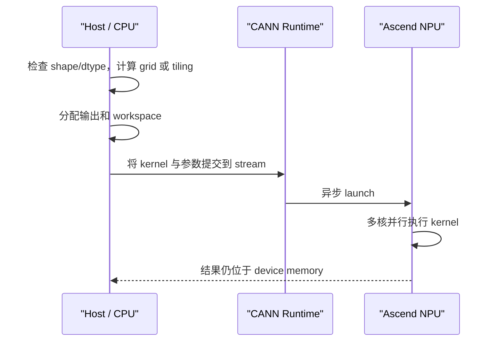

# 基础 01：从一个公式到并行 Kernel

本章先不写任何框架代码，只回答一个根问题：一条数学公式为什么会变成 `grid`、`program`、`tile`、搬运和同步？

从本章开始，代码名字都按[代码阅读手册](../reference/code-reading-and-types.md)区分“Host Python 对象”和“Device IR value”。同样写成 `x`，wrapper 中可能是 `torch.Tensor`，Triton kernel 中则可能是 `tl.tensor<fp16>[BLOCK]`。

## 1. 算子、Kernel 和程序不是一回事

假设要计算：

\[
y_i = a x_i + b
\]

在模型代码里，它可能只是一行表达式；在工程里至少有三层对象：

| 层次 | 含义 | 例子 |
|---|---|---|
| 算子语义 | 对输入输出做什么数学变换 | `y = a * x + b` |
| 算子工程 | shape/dtype 检查、输出分配、dispatch、tiling、workspace、注册 | Python wrapper、C++ host 代码 |
| Device Kernel | 真正在 NPU 核上执行的一段程序 | Triton `@triton.jit` 函数、Ascend C `__aicore__` 核函数 |

一个“算子”可能启动一个 kernel，也可能启动多个 kernel；反过来，一个融合 kernel 也可能一次完成多个原本独立的算子。

## 2. Host 和 Device

**Host** 通常指 CPU 及其进程，负责准备参数、选择实现、分配输出和发起 kernel launch。**Device** 指 Ascend NPU，负责执行数据密集的计算。



Kernel launch 通常是异步的：Host 把任务放进 stream 后可以继续工作。只有读取结果、显式同步或存在依赖时，Host 才必须等待。

## 3. 为什么要切分工作

NPU 有多个计算核，但单个核的片上存储很小。一个大 tensor 不能整体塞进某个核里，因此通常做两级切分：

1. **多核切分**：把总任务分给多个核或 program instance；
2. **单核分块**：每个核再把自己的数据切成多个 tile，逐块搬入片上存储并计算。

例如长度为 10000 的向量，假设每个 tile 处理 1024 个元素：

```text
总任务：10000 elements
逻辑 tile：ceil(10000 / 1024) = 10 个

tile 0: [0, 1024)
tile 1: [1024, 2048)
...
tile 9: [9216, 10000)  # 尾块，不满 1024
```

尾块需要 `mask` 或显式长度，避免读写越界。

## 4. SPMD：同一份程序处理不同数据

SPMD 是 **Single Program, Multiple Data**。启动多个执行实例，每个实例运行同一份 kernel，但根据自己的编号处理不同数据。

可以把它想成 8 位工人拿到同一张作业指导书：

```text
工人 0 -> 第 0 份数据
工人 1 -> 第 1 份数据
...
工人 7 -> 第 7 份数据
```

关键不是复制 8 份源码，而是每个实例取得不同的 ID。

| Triton | Ascend C | 含义 |
|---|---|---|
| `tl.program_id(axis)` | `AscendC::GetBlockIdx()` | 当前执行实例/核负责哪份任务 |
| `grid=(N,)` | launch 的 `blockDim=N` | 启动多少个逻辑实例 |
| `tl.num_programs(axis)` | Host 传入的 `blockDim` 或 tiling 数据 | 当前维度共有多少实例 |

这张表是编程模型类比，不表示 Triton grid 与 Ascend C `blockDim` 在编译器 ABI 或物理调度上完全等价；两者都用“多个实例执行同一 kernel”帮助我们理解 SPMD。

## 5. Program 是什么

在 Triton 中，**program** 不是整个 Python 进程，也不是一条线程。它是一次 kernel launch 中的一个并行程序实例。

一个 program 通常处理一块数据，而不是一个标量：

```python
pid = tl.program_id(0)
offsets = pid * BLOCK_SIZE + tl.arange(0, BLOCK_SIZE)
```

如果 `BLOCK_SIZE=256`，`pid=3` 的 program 处理 `[768, 1024)`。`offsets` 是一组索引，后续 `tl.load` 和加法都作用于这一组元素。

这两行都在 Triton device 语义中：`BLOCK_SIZE` 是编译期 `tl.constexpr`，`pid` 是运行时整数标量 `tl.tensor`，`tl.arange` 与 `offsets` 是 shape 为 `[256]` 的 `int32` block tensor。`offsets` 不是 Python list，也没有读取任何输入；只有它与 pointer 相加并传给 `tl.load` 后才发生访存。

这也是 Triton 常说的 **blocked program**：程序员以一块 tensor 数据为思考单位，编译器再把块级表达降低到硬件执行。

## 6. Grid 是什么

**Grid** 描述一次 launch 要创建多少个 program instance。它最多可以有三个轴。

一维向量可使用一维 grid：

```python
grid = (triton.cdiv(N, BLOCK_SIZE),)
```

这行通常位于 Host wrapper：`N/BLOCK_SIZE` 是 Python 整数或从 meta mapping 取得的整数，`grid` 是 Python `tuple[int]`。它描述 launch 空间，不是 kernel 内的 `tl.tensor`。

二维矩阵也可以使用二维 grid：

```python
grid = (
    triton.cdiv(M, BLOCK_M),
    triton.cdiv(N, BLOCK_N),
)
```

这里 `grid` 是 Python `tuple[int,int]`；进入 device 后，`tl.program_id(0/1)` 才分别产生两个运行时整数标量 IR value。不要因为两处都叫“二维”就把 Host tuple 与 device block tensor 混为一类。

此时 `tl.program_id(0)` 选择行 tile，`tl.program_id(1)` 选择列 tile。

注意：**grid 是逻辑任务空间，不等于物理核的拓扑图。** 如果 grid 有 10000 个 program，而设备只有几十个物理核，这些任务必须分多轮调度。Triton-Ascend 上启动过多小 program 的开销可能很明显，因此常见优化是把 grid 固定到物理 Vector Core 数量，让每个 program 在内部循环处理多个 tile。

## 7. Tile 是什么

**Tile** 是算法分块后的一个数据块。它是逻辑概念，不必对应某一块固定物理内存。

矩阵乘法 `C[M,N] = A[M,K] @ B[K,N]` 常切成：

```text
A tile: [BLOCK_M, BLOCK_K]
B tile: [BLOCK_K, BLOCK_N]
C tile: [BLOCK_M, BLOCK_N]
```

每个 program 负责一个 C tile，并沿 K 维循环：

```text
acc = 0
for k_tile in K:
    搬入 A tile 和 B tile
    acc += A tile @ B tile
写回 C tile
```

Tile 太小会增加启动、循环和搬运次数；太大会占满片上存储、降低可并行度，甚至触发 UB/L1 overflow。调优本质上经常是在找一个“足够大但放得下”的 tile。

## 8. Block 这个词为什么容易混乱

`block` 在不同上下文中可能表示不同对象：

- `BLOCK_SIZE`：Triton kernel 的编译期 tile 大小；
- `blockDim`：Ascend C launch 的核/实例数量；
- `GetBlockIdx()`：当前 Ascend C 实例编号；
- data block：算法切分出的普通数据块；
- CUDA thread block：CUDA 特有概念，不能直接等同于 Ascend Core。

阅读源码时不要只看到 `block` 就做判断，要结合变量来自 Host、launch 还是 kernel 内部。

## 9. Shape、Stride、Layout 和 DType

Kernel 的契约至少有四部分：

| 术语 | 解释 | 常见错误 |
|---|---|---|
| shape | 每个维度有多少元素 | 把 `[B,H,D]` 当成 `[B,D,H]` |
| stride | 某维索引加一，内存地址跨过多少元素 | 对 transpose 后的 tensor 按 contiguous 读取 |
| layout/format | 数据在物理存储中的组织方式 | ND 与 NZ、分形布局混用 |
| dtype | 每个元素的数据类型 | FP16 累加溢出、索引宽度错误 |

地址计算的本质是：

\[
address(i,j) = base + i \times stride_0 + j \times stride_1
\]

很多“kernel 算错”其实是地址、stride 或尾块问题，而不是数学公式错了。

## 10. 三层并行要分清

```text
请求/模型层：多个请求、多个 batch、多个模型层
Kernel 多核层：grid / blockDim 启动多个实例
核内层：Vector/Cube 指令一次处理多个元素，搬运与计算还能流水并行
```

优化某一层不一定改善另一层。例如 kernel 快 10%，但它只占端到端时间的 2%，整体收益不足 0.2%；反过来，减少一次大 tensor 的中间写回可能同时降低 kernel 数和 GM 流量，收益会更明显。

## 11. 本章检查点与参考答案

### 1. 能否用自己的话区分算子、算子工程和 device kernel？

**答案：**三者分别回答“做什么”“怎样作为软件交付”“设备具体怎样执行”。

- **算子语义**只描述数学关系，例如 `z = x + y` 或 RMSNorm。它不规定输出由谁分配、是否原地更新，也不规定使用多少个 NPU 核。
- **算子工程**把数学语义变成可以被框架稳定调用的软件组件，包括 Python/C++ 接口、shape 和 dtype 检查、输出与 workspace 分配、tiling、设备分发、构建、注册、测试和版本兼容。
- **device kernel**是算子工程中的设备侧执行程序。它接收已经准备好的地址和参数，在 AI Core 上完成搬运、计算与写回。

三者不是一一对应关系。一个算子可能先后启动多个 kernel；一个融合 kernel 也可能同时完成 split、norm、activation 等多个算子语义。因此看到“减少了 kernel 数”不等于删除了数学步骤，而是把这些步骤放进更少的设备程序中执行。

### 2. `program` 为什么不是一个标量线程？

**答案：**Triton 的核心抽象是 **blocked program**。一个 program instance 通常用 `tl.arange` 生成一组索引，并对一整块元素执行 `load → compute → store`，而不是只负责一个标量。

例如 `BLOCK_SIZE=256` 时，`pid=3` 的 program 可以一次表达 `[768,1024)` 这 256 个元素的计算。编译器再把这块计算降低到目标硬件的 Vector 指令、数据搬运和执行 lane。程序员面对的是 block tensor，硬件如何把 block 分发到更细粒度执行资源由后端负责。

这与 CUDA 中“先从单线程标量代码出发，再由 thread block 组织线程”的常见心智模型不同。二者最终都利用大量并行硬件，但编程抽象的起点不同。

### 3. `grid=(1000,)` 是否表示设备有 1000 个物理核？

**答案：**不表示。`grid=(1000,)` 只表示这次 launch 的第 0 维包含 1000 个**逻辑 program instance**。

如果设备只有几十个可执行此类任务的物理核，runtime 会把这些 program 分批调度到物理核上。一个物理核可以先执行 program 0，完成后再执行 program 40；逻辑 ID 只标识任务分片，不是稳定的硬件核编号。

这也解释了为什么超大 grid 未必高效：逻辑任务过细时，调度、初始化和多轮下发的开销可能超过新增并行带来的收益。Triton-Ascend 中常见的另一种策略是只启动接近物理 Vector Core 数量的 program，让每个 program 在内部循环处理多个 tile。

### 4. `tile` 为什么既不能无限增大，也不能无限缩小？

**答案：**tile 大小同时影响片上存储、数据复用、并行度和固定开销，是一个资源平衡问题。

- tile **太大**：可能放不进 UB/L1/L0；临时值和 accumulator 占用过高；可同时执行的 program 变少；尾块浪费也可能变大。
- tile **太小**：DataCopy 粒度太碎；循环、地址计算和同步次数增加；每个 program 有效计算不足；Cube/Vector 基本块利用率降低。

理想 tile 通常是“在满足对齐和硬件基本块的前提下，尽量增加复用与搬运粒度，但仍能放进 Local Memory，并保留足够多的并行任务”。它依赖 shape、dtype、硬件和同时存活的临时 tensor，不存在脱离场景的统一最优值。

### 5. `blockDim` 和 `BLOCK_SIZE` 分别控制什么？

**答案：**它们位于不同切分层次。

- Ascend C launch 的 `blockDim` 控制启动多少个逻辑核实例。每个实例用 `GetBlockIdx()` 获得自己的编号，通常负责不同的行、token 或数据大分片。
- Triton 示例中的 `BLOCK_SIZE` 通常是编译期 tile 大小，控制一个 program 通过 `tl.arange(0, BLOCK_SIZE)` 一次处理多少元素。

前者更接近“把总任务分给多少个工人”，后者更接近“每个工人每一轮搬多少件货物”。虽然名字都有 `block`，但不能互换：增加 `blockDim` 不会自动增大每轮 tile，增大 `BLOCK_SIZE` 也不会自动增加物理核数量。

### 6. 为什么 transpose 后只看 shape 不够，还要看 stride？

**答案：**shape 只说明逻辑坐标空间，stride 才说明逻辑坐标如何映射到线性内存。

一个 contiguous 的 `x[M,N]` 通常有 stride `[N,1]`，地址为 `base + i*N + j`。执行 `x.T` 后，view 的 shape 变为 `[N,M]`，stride 通常变为 `[1,N]`；数据没有真的搬家，只是地址解释改变了。

如果 kernel 仍假设最后一维 stride 为 1，就会按错误顺序读取元素。解决方式有两类：把真实 stride 传给 kernel 并按它计算地址，或在 wrapper 中要求/生成 contiguous tensor。`shape 正确但值错位` 是典型的 stride 契约错误。

## 官方资料

- [Triton Programming Guide：blocked program 模型](https://triton-lang.org/main/programming-guide/chapter-1/introduction.html)
- [Triton `program_id`](https://triton-lang.org/main/python-api/generated/triton.language.program_id.html)
- [Ascend C 核函数与 SPMD](https://www.hiascend.com/document/detail/zh/canncommercial/80RC2/developmentguide/opdevg/Ascendcopdevg/atlas_ascendc_10_0014.html)
- [Ascend C 多核 Tiling 概述](https://www.hiascend.com/document/detail/en/canncommercial/850/opdevg/Ascendcopdevg/atlas_ascendc_10_10005.html)
