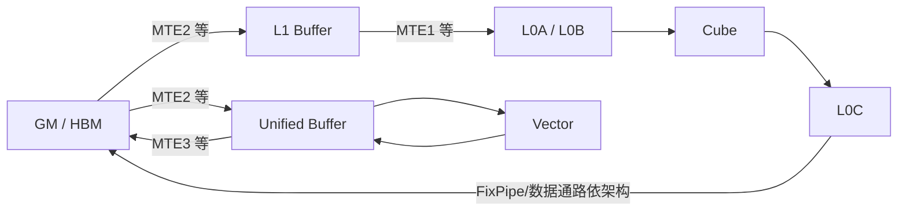
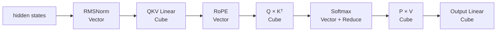

# 基础 02：Ascend NPU、AI Core 与存储层级

本章建立一个“够用但不假装所有芯片都一样”的硬件模型。不同 Ascend 产品和架构版本的核数、容量、数据通路会变化，写生产 kernel 时必须查目标硬件规格；这里先学习稳定的共同概念。

本章涉及的“Tensor”有时是数据、有时只是地址 view。先读[代码阅读手册](../reference/code-reading-and-types.md)可以避免把 PyTorch tensor、Triton block tensor 与 Ascend C `GlobalTensor/LocalTensor` 混为一谈。

## 1. 从服务器到计算单元

几个容易混用的名词：

| 名词 | 初学者可先这样理解 |
|---|---|
| Ascend NPU | 执行 AI 计算的加速设备/处理器 |
| AI Core | NPU 内负责矩阵、向量等密集计算的核心资源 |
| AIC / Cube Core | 分离架构中偏重矩阵计算的核 |
| AIV / Vector Core | 分离架构中偏重向量计算的核 |
| Scalar | 核内负责地址计算、循环、分支和指令发射的控制单元 |
| HBM / GM | 容量较大、核外可访问的全局设备内存 |
| 片上 Local Memory | 容量小但带宽高的 L1、L0、UB 等存储 |

“AI Core”在资料中有时指包含 Cube、Vector、Scalar 的耦合式抽象，有时又讨论拆分后的 AIC/AIV。官方文档也区分不同架构模式。学习时记住功能角色，部署时以具体产品的 `__NPU_ARCH__` 和规格为准。

## 2. 三类计算角色

### 2.1 Cube：矩阵计算

Cube 面向矩阵乘加等规则、高计算密度任务。Transformer 中典型工作包括：

- Linear/GEMM：QKV projection、MLP up/down projection；
- batched matmul；
- attention 中的 QK 与 PV 矩阵乘；
- MoE expert grouped matmul。

Cube 追求高吞吐，但通常要求合适的数据类型、对齐和矩阵分块。小而不规则的逐元素逻辑并不是它的强项。

### 2.2 Vector：向量与逐元素计算

Vector 更适合：

- add、mul、exp、rsqrt 等逐元素运算；
- RMSNorm、LayerNorm、activation；
- reduce、softmax 的部分阶段；
- gather/scatter、mask、类型转换；
- RoPE 等向量变换。

Vector 灵活，但如果把本来适合矩阵计算的大 GEMM 拆成大量标量/向量操作，通常无法获得 Cube 的吞吐。

### 2.3 Scalar：控制与发射

Scalar 可以类比核内的小型控制 CPU，负责：

- 计算地址和偏移；
- 循环与 `if/else`；
- 设置 Vector/Cube/MTE 指令参数；
- 发射指令和组织同步。

Scalar 不是用来承担大规模 tensor 数学的。Kernel 中过多复杂分支、64 位整数除法或逐元素 Scalar 循环，可能让控制部分成为瓶颈。

## 3. 搬运单元 MTE

计算单元要快，前提是数据及时到达。MTE（Memory Transfer Engine）负责不同存储层级间的数据搬运。



这是一张概念图，不是所有产品都具备完全相同的直连路径。官方文档明确说明不同架构的数据通路可能增删。

## 4. 为什么不能一直在 GM 上算

GM 容量大，但距离计算单元远，访问延迟和可用带宽相对片上存储更不利。Vector/Cube 通常要在相应 Local Memory 上取得操作数：

- Vector 的输入输出主要位于 UB；
- Cube 的 A/B 输入常经过 L1 到 L0A/L0B；
- Cube 累加结果位于 L0C；
- 最终结果再搬回 GM。

因此高性能 kernel 的基本节奏是：

```text
GM -> Local Memory -> Compute -> Local Memory -> GM
```

如果每做一次简单运算就写回 GM，再由下一个 kernel 重新读入，会浪费带宽。算子融合的重要收益之一就是让中间结果留在片上。

## 5. 各层存储做什么

| 存储 | 主要角色 | 常见关联 |
|---|---|---|
| GM/HBM | 保存模型权重、激活、KV Cache、kernel 输入输出 | `GlobalTensor`、PyTorch NPU tensor |
| L2 Cache | 多核共享的 GM 访问缓存，减少重复访问 | 数据复用、program 排序 |
| L1 Buffer | 较大的核内中转区，矩阵数据复用 | Cube tile、A1/B1 |
| L0A/L0B | Cube 的两个输入操作数 | A2/B2 |
| L0C | Cube 结果与累加 | CO1 等逻辑位置 |
| UB | Vector 输入、输出和临时 tensor | VECIN/VECOUT/VECCALC |
| Register/Scalar data path | 更小粒度临时状态与控制计算 | 编译器和架构相关 |

`TPosition` 是 Ascend C 的逻辑位置抽象。例如 `VECIN`、`VECOUT` 通常映射到 UB，`A1/B1` 通常映射到 L1。使用逻辑位置可以减少代码对硬件具体存储名的直接耦合，但不同产品上的映射仍可能有差异。

## 6. AI Core、AIC、AIV 的关系

在分离模式下，官方术语通常是：

- **AIC**：一组中的 Cube Core；
- **AIV**：一组中的 Vector Core；
- 常见架构配置中一份 Cube 资源可对应两份 Vector 资源，但不要把这个比例硬编码为所有产品的永恒事实。

纯 Vector 算子通常按 `num_vectorcore` 规划并行；Cube 或 CV 融合算子要结合 `num_aicore` 与 AIC/AIV 协作方式。

Triton-Ascend 可以读取设备属性：

```python
properties = driver.active.utils.get_device_properties(device)
vector_cores = properties["num_vectorcore"]
cube_cores = properties["num_aicore"]
```

这比在源码里写死“某卡有 40 个核”稳健。

这三行在 Host Python 上执行：`device` 是 runtime 接受的设备标识；`properties` 是 Python mapping；`vector_cores/cube_cores` 是 Python `int`。它们不是 `tl.tensor`，不会自动进入 kernel。wrapper 可以用它们计算 Python grid，或把值作为 launch 标量显式传给 kernel。

## 7. 对齐为什么反复出现

硬件搬运和向量指令按固定粒度工作。连续且对齐的数据通常可以用更少指令、更满的总线事务完成搬运。

常见对齐问题：

- tensor 起始地址是否对齐；
- 每行字节数是否对齐；
- tile 长度是否满足搬运粒度；
- 尾块是否需要 padding 或特殊 DataCopy；
- dtype 改变后，同样元素数对应的字节数是否仍对齐。

例如 16 个 FP16 元素是 32 字节，而 16 个 FP32 元素是 64 字节。谈对齐时最好换算成字节，而不是只说元素数。

## 8. 用 Transformer 理解硬件分工



实际高性能 attention 往往把多阶段融合起来，不会机械地启动六个 kernel。这张图的价值是识别每段主要计算特征。

## 9. 判断瓶颈的第一步

| 现象 | 可能首先怀疑 |
|---|---|
| 大矩阵计算利用率低 | Cube tile、数据格式、矩阵维度、流水 |
| 逐元素小算子很多 | launch 开销、融合机会 |
| Kernel 时间随数据字节近似线性增长 | GM/搬运带宽瓶颈 |
| UB overflow | tile 太大、临时 tensor 太多、double buffer 预算不足 |
| 大量 Scalar 指令或分支 | 地址计算、控制逻辑或非规则访问 |
| 多核不均衡 | tiling 分配、尾核工作量、grid 与物理核数 |

## 10. 本章检查点与参考答案

### 1. Cube、Vector、Scalar 分别适合什么工作？

**答案：**它们针对不同计算形态设计，并由 Scalar 组织成完整 kernel。

- **Cube**擅长规则矩阵乘加，例如 GEMM、attention 的 QK/PV、Linear 和 MoE expert matmul。它追求高吞吐，但需要合适的矩阵分块、dtype、对齐与数据布局。
- **Vector**擅长逐元素、归约、数学函数和不规则辅助逻辑，例如 RMSNorm、Softmax、RoPE、activation、mask、gather/scatter。
- **Scalar**负责循环、分支、地址计算、参数准备和指令发射，可以看作核内控制器。它适合少量控制运算，不适合用逐元素 Scalar 循环替代批量 Vector/Cube 计算。

它们不是三种互斥的算子类别。一个 attention kernel 可能由 Scalar 计算地址，MTE 搬数据，Cube 做矩阵乘，Vector 做 softmax；优化目标是让这些单元按依赖关系重叠，而不是只追求某一个单元忙碌。

### 2. MTE 为什么是性能模型的一部分，而不只是“拷贝工具”？

**答案：**因为计算单元只能在数据及时到达时发挥吞吐，很多 kernel 的上限由搬运而非算术指令决定。

MTE 负责 GM、UB、L1、L0 等层级之间的数据传输。搬运的连续性、对齐、粒度、格式转换和流水重叠都会决定有效带宽。如果 Vector 计算只需 1 微秒，而输入搬入需要 4 微秒，那么把 Vector 指令再优化 20% 几乎不会改变总时间；改善 DataCopy 或让搬入与上一 tile 的计算重叠才可能有效。

因此性能模型至少要同时考虑 `Tcopy` 与 `Tcompute`。稳定流水的吞吐通常接近最慢阶段，而不是只看 Cube/Vector 的峰值算力。

### 3. GM、L1、L0、UB 的容量与速度关系为何推动 tiling？

**答案：**越靠近计算单元的存储通常越快、越专用，但容量越小；越远的 GM 容量大，却不能为每条计算指令提供同等低延迟和高局部带宽。

完整 tensor 和模型权重必须长期放在 GM，但一个核只能把当前需要的小块搬到 UB/L1/L0。Tiling 因此解决两个问题：让工作集放得进片上存储，并让搬入的一块数据在写回前尽量复用。

以 matmul 为例，A/B 的 tile 搬入 L1/L0 后会参与许多乘加，算术强度提高；如果 tile 太小，同一数据要重复从 GM 搬入。反过来，tile 太大又会挤爆 L1/L0 或让并行 tile 数不足。所以存储层级不是实现细节，而是分块算法产生的根本原因。

### 4. 为什么 `VECIN` 是逻辑位置，而 UB 是物理存储概念？

**答案：**`VECIN` 描述“这块 LocalTensor 在流水中的角色是 Vector 输入”，UB 描述“数据实际位于哪类片上存储”。

Ascend C 用 `TPosition` 抽象角色，例如 `VECIN`、`VECOUT`、`A1`、`A2`。编译器和目标架构再把逻辑位置映射到 UB、L1、L0A 等物理资源。这样 API 可以跨部分架构复用，不必让每段业务代码都直接写死物理存储名和数据通路。

逻辑抽象并不会消除硬件差异。做容量预算、检查合法 DataCopy 路径或调优时，仍需查看目标 `__NPU_ARCH__` 上 `TPosition → physical memory` 的实际映射。

### 5. 为什么不能把某个产品的 AIC/AIV 数量写成普适常量？

**答案：**不同 Ascend 产品、SoC 和架构版本可能有不同核数、AIC:AIV 配比、可用核裁剪和数据通路；同一软件还可能部署在不同型号上。

如果写死 `40` 个 Vector Core，在另一设备上可能出现两种问题：设备核更少时产生多轮下发或非法假设；设备核更多时又浪费可用并行度。更稳健的 Host 代码应通过 platform/runtime 查询 `num_aicore`、`num_vectorcore` 和 Local Memory 容量，再据此计算 `blockDim` 与 tile。

即使查询到了物理数量，也不代表任何 shape 都应启动全部核。小任务可能使用更少核更高效，因此“硬件上限”和“本次最优 blockDim”仍是两个概念。

## 官方资料

- [Ascend C 8.5：基本硬件架构与术语](https://www.hiascend.com/document/detail/zh/canncommercial/850/opdevg/Ascendcopdevg/atlas_ascendc_10_0008.html)
- [Ascend C：计算单元](https://www.hiascend.com/document/detail/zh/canncommercial/80RC3/developmentguide/opdevg/Ascendcopdevg/atlas_ascendc_10_0009.html)
- [Ascend C：存储与搬运单元](https://www.hiascend.com/document/detail/zh/canncommercial/80RC3/developmentguide/opdevg/Ascendcopdevg/atlas_ascendc_10_0010.html)
- [Ascend C：逻辑位置与物理存储映射](https://www.hiascend.com/document/detail/en/canncommercial/850/API/ascendcopapi/atlasascendc_api_07_0004.html)
