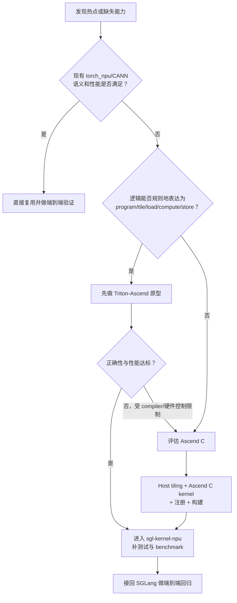

# 参考：sgl-kernel-npu、Triton-Ascend 与 Ascend C 技术选型

这三个名字不在同一分类维度：

- `sgl-kernel-npu` 是交付 kernel 的仓库/产品边界；
- Triton-Ascend 和 Ascend C 是实现 kernel 的技术路径；
- `sgl-kernel-npu` 可以同时收纳两种实现，并复用 `torch_npu`/CANN 算子。

因此真正的选择题是：“这个 SGLang 算子需求应复用现有算子，还是在 sgl-kernel-npu 中用 Triton-Ascend 或 Ascend C 实现？”

## 1. 总体比较

| 维度 | 现有 torch_npu/CANN | Triton-Ascend | Ascend C |
|---|---|---|---|
| 开发入口 | Python/ATen/NPU API | Python tile DSL | C/C++ 风格 Host + Device |
| 初始开发速度 | 最快，直接复用 | 较快 | 较慢 |
| 硬件控制 | 最少 | 中等，部分交给 compiler | 最多 |
| 工程代码量 | 少 | 中 | 多 |
| 自定义融合 | 受已有 API 限制 | 强，适合快速融合 | 强，适合深度定制 |
| 动态 shape | 取决于现有算子 | 可能产生多个 JIT 变体 | Host tiling 可动态，device 变体需设计 |
| 首次运行 | 通常无用户 JIT | 可能有 JIT/缓存开销 | 预编译，加载 shared library |
| 调试难度 | 较低 | 中等，需看 DSL/IR/compiler | 较高，Host、tiling、kernel、同步多层 |
| 极致优化 | 依赖供应方实现 | 编译器能覆盖的范围内较强 | 可显式控制更多硬件细节 |
| 维护成本 | 低 | 中 | 高 |

## 2. Triton-Ascend 的优劣势

### 优势

- Python 中快速表达 tile、地址、mask、reduction 和 fusion；
- 与 PyTorch tensor 集成自然；
- 相比拆分的 PyTorch 算子，可减少中间 tensor 与 launch；
- 编译器承担内存分配、部分流水和指令 lowering；
- 适合快速验证一个 kernel 想法是否值得长期投入。

### 局限

- 不能假定 CUDA Triton kernel 原样就高效；
- API/dtype/离散访存支持随 Triton-Ascend 版本演进；
- 动态 shape/meta 可能增加 JIT 变体与缓存；
- UB overflow、编译失败可能需要阅读 IR/compiler；
- 对 AIC/AIV、特定数据通路和同步的控制不如原生 Ascend C 直接。

## 3. Ascend C 的优劣势

### 优势

- 显式表达 Global/Local Tensor、搬运、队列和同步；
- 可以精细设计 AIC/AIV、Cube/Vector 和多级存储流水；
- 适合复杂 layout、量化、专用指令和深度融合；
- 预编译交付，运行时不需要为每个 shape 做 Python JIT；
- 对核心生产热点有更高的可控优化空间。

### 局限

- Host tiling、注册、构建与 device kernel 工程量大；
- 同步与 buffer 生命周期错误更隐蔽；
- 对目标 CANN/硬件版本耦合更强；
- 正确性和性能测试矩阵更重；
- 需求快速变化时，迭代成本可能不划算。

## 4. sgl-kernel-npu 的工程价值

不论选哪条实现路径，进入 `sgl-kernel-npu` 后都应获得：

- 面向 SGLang 的稳定 API；
- wheel 构建和版本管理；
- 单算子 correctness test；
- benchmark 与性能回归；
- 对 CANN/硬件兼容性的集中处理；
- 与 SGLang 主仓清晰的调用边界。

它的价值不是再发明一种 DSL，而是把 kernel 变成可交付、可维护的软件组件。

## 5. 决策树



## 6. 典型场景

| 场景 | 首选思路 | 原因 |
|---|---|---|
| 标准 GEMM | 先看 CANN/torch_npu | 成熟库通常已有高度优化实现 |
| Split + RMSNorm + 简单 reshape | Triton-Ascend 原型 | 规则 Vector/reduction，融合收益清晰 |
| 简单 elementwise 链 | Triton-Ascend | 开发快，减少多个 launch |
| 复杂 AIC/AIV 混合融合 | Ascend C | 需要显式核间协作与数据通路 |
| 特殊 KV cache layout 更新 | 视访问规则决定 | 规则可先 Triton；离散/专用搬运可能 Ascend C |
| 极低延迟固定 shape 核心热点 | 两者 benchmark | Triton 简洁；Ascend C 可进一步控制，不能预设胜负 |
| 快速变化的研究算子 | Triton-Ascend | 先验证算法与收益，降低沉没成本 |
| DeepEP 通信 kernel | 专用 C++/Ascend/HCCL 路径 | 不只是单核数学 DSL 问题 |

## 7. 不要用语言标签代替测量

以下说法都不可靠：

- “Ascend C 一定比 Triton 快”；
- “Triton 编译器会自动解决所有优化”；
- “自定义 kernel 一定比 torch_npu 快”；
- “Kernel microbenchmark 快，SGLang 吞吐就一定快”。

正确结论必须绑定：硬件、CANN/Triton 版本、shape、dtype、layout、warmup、并发场景和端到端调用比例。

## 8. 从原型到生产的分阶段策略

```text
阶段 1：PyTorch reference
  明确语义、边界与数值标准

阶段 2：Triton-Ascend prototype
  快速验证融合和 tile 方案

阶段 3：真实 shape benchmark
  确认热点确实值得优化

阶段 4：决定保留 Triton 或转 Ascend C
  根据性能差距、compiler 限制和维护成本

阶段 5：sgl-kernel-npu 工程化
  API、测试、benchmark、build、compatibility

阶段 6：SGLang 端到端验证
  吞吐、TTFT、TPOT、显存、graph、分布式与回退
```

## 9. 评审一个新 Kernel 的问题清单

- 数学语义和 shape 契约是什么？
- 真实 prefill/decode shape 分布是什么？
- 现有算子为什么不够？证据是 profiler 还是猜测？
- 算术强度和理论 GM 流量是多少？
- Grid/blockDim、tile 和 Local Memory 预算是什么？
- 尾块、对齐、非连续 tensor 和 dtype 如何处理？
- Reference 是否独立且覆盖边界？
- JIT/编译/加载开销是否计入部署评估？
- Graph capture、stream 与异步生命周期安全吗？
- 版本不支持时如何 fallback？
- 谁维护它，性能回归阈值是什么？

## 10. 推荐学习结论

初学者的最佳顺序通常是：

```text
硬件与内存直觉
  -> Triton-Ascend 建立 tile/program 思维
  -> Ascend C 看清搬运、队列与同步
  -> sgl-kernel-npu 学习工程化与真实热点
```

先学 Triton 不是因为它永远更好，而是它能用较少样板代码暴露并行算法的核心；再学 Ascend C，才能理解编译器替你做了什么，以及何时需要把控制拿回来。
