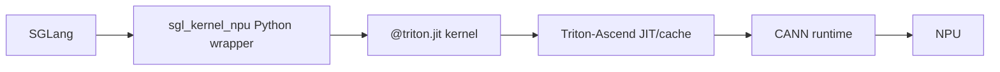
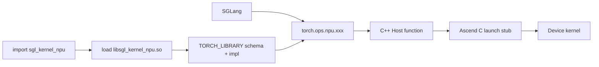
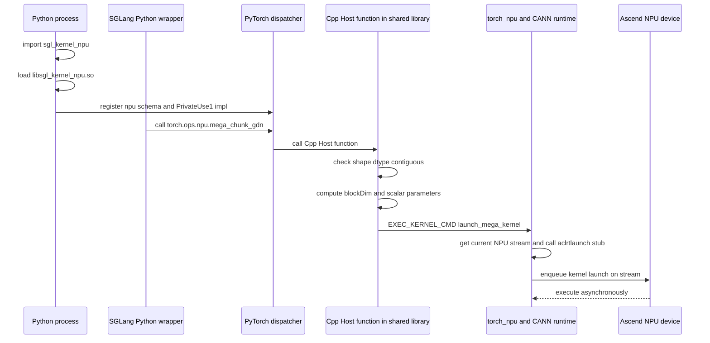

# sgl-kernel-npu 01：仓库结构与算子生命周期

本章以官方仓库 [`b2378ee`（2026-07-02）](https://github.com/sgl-project/sgl-kernel-npu/tree/b2378ee05769cf7df209ffc5e1b669728f435a7e) 为源码基线。仓库更新很快，目录或 API 变化时应以自己的 checkout 为准。

这一章的难点不是某一行语法，而是同一个输入跨越多套类型系统。请配合[代码阅读手册](../reference/code-reading-and-types.md)跟踪：Python `torch.Tensor`、dispatcher schema `Tensor`、C++ `at::Tensor`、Triton pointer 或 Ascend C `GM_ADDR/GlobalTensor<T>`。

## 1. 它是混合 Kernel 仓库

`sgl-kernel-npu` 不是“Triton 算子目录”，也不是“Ascend C 算子目录”。它把 SGLang 需要的多种实现统一成可安装、可测试的 kernel 包：

```text
sgl-kernel-npu/
├── python/
│   ├── sgl_kernel_npu/   # Python package、Triton kernels、wrapper
│   ├── attentions/       # attention 相关 Python package
│   └── deep_ep/          # DeepEP-Ascend Python package
├── csrc/                 # C++ Host、PyTorch 注册、Ascend C kernel
├── tests/                # correctness / integration tests
├── benchmark/            # microbenchmark
├── docs/
├── cmake/
├── CMakeLists.txt
└── build.sh
```

同一次 SGLang forward 可以交替调用 Triton kernel、Ascend C custom op 和 `torch_npu`/CANN 原生算子。

## 2. Python 包中有什么

当前 `python/sgl_kernel_npu/sgl_kernel_npu/` 的主要目录包括：

```text
activation/  attention/  fla/  mamba/  mem_cache/
moe/         norm/       sample/  utils/
kvcacheio.py speculative.py
```

从文件后缀不能完全判断实现：Python 文件可能是纯 Torch wrapper，也可能定义 `@triton.jit` kernel，还可能只调用已注册的 `torch.ops.npu.*`。

推荐先搜索：

```bash
rg '@triton.jit|torch\.ops|torch_npu' python/sgl_kernel_npu/sgl_kernel_npu
```

## 3. Wrapper 到底是什么

在 kernel 教学里，wrapper 最容易被误解成“随手包一层的函数”。更准确地说，wrapper 是高层调用和底层 kernel contract 之间的适配层。它本身通常不负责重计算数学主体，而是把“用户方便调用的形态”整理成“底层 kernel 能安全、高效执行的形态”。

先给一句工作定义：

> wrapper 是边界适配器：它接住 Python/PyTorch/C++ 用户态对象，检查并整理 shape、dtype、stride、device、输出 buffer、workspace、grid/blockDim、stream 和后端选择，然后调用更底层的 Triton kernel、custom op、ACLNN 或 Ascend C device kernel。

这里第一次集中出现几个词：

- **shape**：张量每个维度的长度，例如 `[B, hidden]`。
- **dtype**：元素类型，例如 FP16、FP32、int32。
- **stride**：某一维索引加 1 时，底层线性内存地址跨过多少个元素。
- **grid**：Triton 一次 launch 创建多少个 program instance 的逻辑空间。
- **blockDim**：Ascend C/custom kernel 一次 launch 启动多少个逻辑执行实例。
- **workspace**：运行时临时使用的额外设备内存。
- **stream**：Host 向 device 提交异步任务的有序队列。

这些词不是装饰。底层 device kernel 通常只看到指针和少量整数，无法自动知道“这个 tensor 是否连续”“输出该分配多大”“应该启动多少个 program”“该走 Triton 还是 custom op”。这些都要 wrapper 或 Host 入口提前决定。

### 3.1 Wrapper 不是只有一种

在 `sgl-kernel-npu` 里，“wrapper”至少有五种常见含义：

| wrapper 类型 | 常见位置 | 下面接什么 | 典型责任 |
|---|---|---|---|
| Python API wrapper | `python/sgl_kernel_npu/.../*.py` | Triton kernel 或 `torch.ops.npu.*` | 输出分配、shape/dtype 整理、grid、后端分流 |
| import/load wrapper | `python/sgl_kernel_npu/sgl_kernel_npu/__init__.py` | `torch.ops.load_library` | 加载 `.so`，触发 PyTorch op 注册 |
| PyTorch schema wrapper | `csrc/pytorch_extensions.cpp` | dispatcher | 声明 op 名、参数、返回值、mutation alias |
| C++ Host wrapper | `csrc/<op>/op_host/*.cpp` | `EXEC_KERNEL_CMD` 或 ACLNN | 校验输入、准备标量参数、workspace、stream、launch |
| ACLNN wrapper | attention plugin 等 C++ 文件 | CANN ACLNN | 把扩展自定义入口转成现成 ACLNN 调用 |

所以当你听到“这个 kernel 有个 wrapper”，第一反应不该是“哪一行函数定义”，而应该问：它包的是哪一层？它把什么类型转成什么类型？它有没有真正 launch device kernel？

### 3.2 Python Triton wrapper：把好用的 Python API 变成 kernel launch

看 [`fused_split_qk_norm.py`](https://github.com/sgl-project/sgl-kernel-npu/blob/b2378ee05769cf7df209ffc5e1b669728f435a7e/python/sgl_kernel_npu/sgl_kernel_npu/norm/fused_split_qk_norm.py) 是最容易入门的例子。

文件前半部分定义 `@triton.jit` device kernel，后半部分定义 Python 函数 `fused_split_qk_norm()`。这个 Python 函数就是 wrapper。它做了四件事：

1. 断言 `q_lora_rank`、`kv_lora_rank`、`qk_rope_dim` 都是正数，见 [`fused_split_qk_norm.py#L101-L103`](https://github.com/sgl-project/sgl-kernel-npu/blob/b2378ee05769cf7df209ffc5e1b669728f435a7e/python/sgl_kernel_npu/sgl_kernel_npu/norm/fused_split_qk_norm.py#L101-L103)。
2. 从 `fused_qkv_a_proj_out.shape` 读出 `B,total_hidden`，从输入 tensor 读出 `device,dtype`，见 [`#L104-L106`](https://github.com/sgl-project/sgl-kernel-npu/blob/b2378ee05769cf7df209ffc5e1b669728f435a7e/python/sgl_kernel_npu/sgl_kernel_npu/norm/fused_split_qk_norm.py#L104-L106)。
3. 用 `torch.empty` 分配 `q_lora/k_nope/k_pe` 三个输出 buffer，见 [`#L108-L110`](https://github.com/sgl-project/sgl-kernel-npu/blob/b2378ee05769cf7df209ffc5e1b669728f435a7e/python/sgl_kernel_npu/sgl_kernel_npu/norm/fused_split_qk_norm.py#L108-L110)。
4. 用 `fused_split_qk_norm_kernel[(B,)](...)` 发起 Triton launch，见 [`#L112-L128`](https://github.com/sgl-project/sgl-kernel-npu/blob/b2378ee05769cf7df209ffc5e1b669728f435a7e/python/sgl_kernel_npu/sgl_kernel_npu/norm/fused_split_qk_norm.py#L112-L128)。

这里 `[(B,)]` 是 wrapper 计算出来的 grid。`B` 是 Python 整数，不是 device 里的 `tl.tensor`；进入 kernel 后，每个 program 再通过 `tl.program_id(0)` 得到自己的 `pid`。这个边界在 [`../triton-ascend/01-program-grid-tile.md`](../triton-ascend/01-program-grid-tile.md) 已经详细讲过。

这个例子说明：Triton wrapper 不只是“调用 kernel”。它还要把输出先分配好，把 Python module 里的 `layernorm.weight/bias` 拆成 kernel 参数，把是否有 bias 转成 `tl.constexpr` 分支开关，并在 kernel 执行后把 `k_nope/k_pe` 恢复成上层期望的 shape。

### 3.3 import/load wrapper：为什么 import 后 `torch.ops.npu` 才有新 op

`sgl_kernel_npu/__init__.py` 里有一个非常薄但很关键的 wrapper：`_load_sgl_kernel_npu()`。它定位 package 里的 `libsgl_kernel_npu.so`，然后调用 `torch.ops.load_library(so_path)`，见 [`__init__.py#L9-L15`](https://github.com/sgl-project/sgl-kernel-npu/blob/b2378ee05769cf7df209ffc5e1b669728f435a7e/python/sgl_kernel_npu/sgl_kernel_npu/__init__.py#L9-L15)。

这层 wrapper 不分配输出，也不 launch NPU kernel。它的作用是让操作系统加载 shared library，并让库里的 PyTorch 注册代码运行。注册完成后，`torch.ops.npu.mega_chunk_gdn` 之类名字才会出现在 dispatcher 里。

所以：

```text
import sgl_kernel_npu
  -> load libsgl_kernel_npu.so
  -> 执行 TORCH_LIBRARY 注册
  -> torch.ops.npu.* 出现扩展 op
```

如果 `.so` 没有被加载，Python 层即使知道函数名，也不会凭空获得对应 custom op。

### 3.4 Custom op Python wrapper：把一堆工程细节藏到一个函数后面

上一章的 [`08-fla-mega-kernel-device-stages.md`](./08-fla-mega-kernel-device-stages.md) 讲过 `run_mega_chunk_gdn()`。它是 custom op 路径里的 Python wrapper，底下不是直接 `@triton.jit`，而是调用 `torch.ops.npu.mega_chunk_gdn(...)`。

这类 wrapper 通常更重，因为 custom op device 入口往往只接受固定 dtype、固定 layout、已经分配好的输出和 workspace。以 `run_mega_chunk_gdn()` 为例，它会：

- 把 `q/k/v/beta` 转成 FP16，但保留 `g` 为 FP32；
- 计算 `num_sequences`、`num_chunks`、`num_matrices`；
- 创建 `mask_lower/mask_full/minus_identity`；
- 分配 `g_sum/g_t/beta_t/A/A_inv/w/u/h/v_new/final_state/out`；
- 按设备属性估算 `block_dim`；
- 分配 `kkt/wy/h/o` 多组 workspace；
- 最后调用 `torch.ops.npu.mega_chunk_gdn`。

也就是说，上层调用者看到的是一个相对干净的 Python 函数；底层 kernel 需要的一长串 buffer 和标量参数，都由 wrapper 代劳。这个“代劳”不是无关紧要的胶水，而是 custom kernel 能被安全使用的前提。

### 3.5 PyTorch schema wrapper：告诉 dispatcher 谁会被写

`pytorch_extensions.cpp` 中的 `m.def(...)` 不是 device kernel。它是 dispatcher contract。比如 `mega_chunk_gdn` 的 schema 把 `out/g_sum/g_t/beta_t/A/...` 标成 `Tensor(a!)`、`Tensor(b!)` 等可变 tensor，见 [`pytorch_extensions.cpp#L110-L121`](https://github.com/sgl-project/sgl-kernel-npu/blob/b2378ee05769cf7df209ffc5e1b669728f435a7e/csrc/pytorch_extensions.cpp#L110-L121)。

这里的 `!` 表示这个参数会被原地写入。这个信息很关键：如果 schema 没声明 mutation，上层图优化、functionalization 或调用者就可能误以为这个 op 没有副作用。

`m.impl("mega_chunk_gdn", TORCH_FN(...))` 则把 schema 绑定到 C++ Host 函数，见 [`pytorch_extensions.cpp#L191`](https://github.com/sgl-project/sgl-kernel-npu/blob/b2378ee05769cf7df209ffc5e1b669728f435a7e/csrc/pytorch_extensions.cpp#L191)。这里 `TORCH_FN` 可以理解成“把普通 C++ 函数包装成 dispatcher 能注册的 callable”的小 wrapper。它仍然运行在 Host 侧，不是 device 指令。

### 3.6 C++ Host wrapper：动态世界和静态 kernel 的缓冲层

进入 C++ 后，wrapper 的责任通常落到 `op_host/*.cpp`。以 `mega_chunk_gdn.cpp` 为例，Host wrapper 先做 `check_shape`，确认 packed B=1、head dimension 为 128、dtype 正确、输入 contiguous、`initial_state` shape 正确，见 [`mega_chunk_gdn.cpp#L25-L68`](https://github.com/sgl-project/sgl-kernel-npu/blob/b2378ee05769cf7df209ffc5e1b669728f435a7e/csrc/mega_chunk_gdn/op_host/mega_chunk_gdn.cpp#L25-L68)。

校验通过后，它把 Python/dispatcher 层传来的 `at::Tensor` 和 Python 整数整理成 device launch 参数，然后调用 `EXEC_KERNEL_CMD(launch_mega_kernel, ...)`，见 [`mega_chunk_gdn.cpp#L71-L101`](https://github.com/sgl-project/sgl-kernel-npu/blob/b2378ee05769cf7df209ffc5e1b669728f435a7e/csrc/mega_chunk_gdn/op_host/mega_chunk_gdn.cpp#L71-L101)。

为什么需要 Host wrapper？因为 device kernel 通常很“死板”：它希望输入已经满足固定 dtype、固定 shape、固定布局，指针已经准备好，标量参数单位明确。Host wrapper 就像海关，把高层动态世界里的各种对象检查、盖章、打包，再送进底层执行口。

### 3.7 ACLNN wrapper：注册了 custom op，不代表一定自写 device kernel

还有一种很容易混淆的 wrapper：custom op 入口后面包的是现成 ACLNN，而不是仓库自己的 Ascend C device kernel。

例如 attention plugin 的 [`layernorm.cpp`](https://github.com/sgl-project/sgl-kernel-npu/blob/b2378ee05769cf7df209ffc5e1b669728f435a7e/csrc/attentions/csrc/plugin/layernorm.cpp) 中，Host 函数 `layernorm_npu` 会分配 `output/mean_out/rstd_out`，整理 optional `weight/bias`，然后通过 `EXEC_NPU_CMD` 调用 `aclnnLayerNormWithImplMode`，见 [`layernorm.cpp#L22-L65`](https://github.com/sgl-project/sgl-kernel-npu/blob/b2378ee05769cf7df209ffc5e1b669728f435a7e/csrc/attentions/csrc/plugin/layernorm.cpp#L22-L65)。

这个例子说明：wrapper 可能只是把扩展库自己的 API 转成 CANN 已有算子库 API。看到 `torch.ops.*` 或 C++ 函数名时，不要立刻假设存在同名 device kernel。判断方法见 [`../torch_npu/01-dispatch-aclnn-and-custom-op-boundaries.md`](../torch_npu/01-dispatch-aclnn-and-custom-op-boundaries.md)。

### 3.8 一条固定读法

以后看到任何 wrapper，都按下面清单读：

| 问题 | 为什么重要 |
|---|---|
| 这层 wrapper 运行在 Python、C++ Host，还是 device？ | 先定位类型系统和可做的事 |
| 它接收的是 `torch.Tensor`、`at::Tensor`、裸指针，还是 module 对象？ | 决定 shape/dtype/stride 从哪里来 |
| 它是否分配输出或 workspace？ | 决定谁拥有内存，谁负责生命周期 |
| 它是否检查 contiguous、dtype、shape？ | 决定底层 kernel 的地址公式是否安全 |
| 它是否计算 grid/blockDim/tiling？ | 决定并行空间如何映射到硬件 |
| 它是否选择后端或 specialization？ | 决定同一个 API 背后可能有多条路径 |
| 它最终调用 `kernel[grid]`、`torch.ops`、`EXEC_KERNEL_CMD` 还是 `EXEC_NPU_CMD`？ | 决定最终落到 Triton、自写 Ascend C，还是 ACLNN |
| 它返回新 tensor，还是写入传入的 output buffer？ | 决定 schema mutation 和调用者语义 |

一句话总结：wrapper 是 kernel 工程里的“边界设计”。Device kernel 决定怎么算，wrapper 决定这次计算能不能被正确、安全、按预期性能地调用起来。

## 4. C++/Ascend C 部分

`csrc/` 以算子为单位组织：

```text
csrc/<op>/
├── op_host/      # 参数检查、tiling、workspace、launch
└── op_kernel/    # Ascend C device kernel
```

当前可见的算子包括 cache 分配/更新、LoRA、MLA preprocess、batch matmul、speculative tree、lightning indexer、causal conv、token bitmask 等。

关键公共入口：

- [`csrc/pytorch_extensions.cpp`](https://github.com/sgl-project/sgl-kernel-npu/blob/b2378ee05769cf7df209ffc5e1b669728f435a7e/csrc/pytorch_extensions.cpp)：PyTorch schema 与 NPU backend 注册；
- [`csrc/CMakeLists.txt`](https://github.com/sgl-project/sgl-kernel-npu/blob/b2378ee05769cf7df209ffc5e1b669728f435a7e/csrc/CMakeLists.txt)：Host 源码、Ascend C kernel target 和 shared library 链接。

## 5. 两条典型生命周期

### 5.1 Triton Python Kernel



这条路径通常不需要为每个 Triton kernel 在 `pytorch_extensions.cpp` 注册 schema。Python wrapper 直接 launch JIT kernel。

### 5.2 Ascend C Custom Op



## 6. Import 为什么会改变 `torch.ops`

当前 [`sgl_kernel_npu/__init__.py`](https://github.com/sgl-project/sgl-kernel-npu/blob/b2378ee05769cf7df209ffc5e1b669728f435a7e/python/sgl_kernel_npu/sgl_kernel_npu/__init__.py) 会定位包内的 `lib/libsgl_kernel_npu.so`，然后调用：

```python
torch.ops.load_library(so_path)
```

加载 `.so` 时，静态注册代码运行，`torch.ops.npu.*` 中才出现该库定义的算子。

这里 `so_path` 是 Python `str`/path-like，`torch.ops.load_library` 是 Host Python callable，返回值不包含 device tensor。它让操作系统加载 shared library，并执行库内注册初始化；既不 launch kernel，也不把 `.so` 内容复制到 UB。

这解释了一个常见现象：

```python
import torch
# torch.ops.npu.some_sgl_op 可能不存在

import sgl_kernel_npu
# shared library 被加载，注册完成
```

## 7. Schema 与 Implementation

`pytorch_extensions.cpp` 中可以直接看到一组真实 schema/implementation：

```cpp
TORCH_LIBRARY_FRAGMENT(npu, m)
{
    m.def("helloworld(Tensor x, Tensor y) -> Tensor");
}

TORCH_LIBRARY_IMPL(npu, PrivateUse1, m)
{
    m.impl("helloworld", TORCH_FN(sglang::npu_kernel::helloworld));
}
```

可分别理解为：

- `m.def`：对外声明函数签名、参数、返回值与 mutation alias；
- `m.impl`：告诉 dispatcher，NPU/PrivateUse1 tensor 应调用哪个 C++ Host 函数。

Schema 中的 `Tensor(a!)` 表示有别名标记的可变 tensor。Mutation 契约会影响 graph、functionalization 和调用者对输出的理解，不能随意删改。

`m` 的 C++ 类型是 PyTorch 注册 API 提供的 `torch::Library` 句柄；schema 字符串中的 `Tensor` 是 dispatcher 类型语法，Host 实现签名中通常对应 `at::Tensor`；`PrivateUse1` 是枚举式 dispatch key；`TORCH_FN(...)` 产生可注册的 C++ function wrapper。这些全是 Host/dispatcher 类型，不是 Ascend C device 对象。

## 8. Host 函数的职责

典型 Host 函数会：

1. `TORCH_CHECK` 输入 shape/dtype/contiguous；
2. 处理 optional 参数与 padding；
3. 查询硬件核数和 Local Memory；
4. 计算 `blockDim`、tile、workspace；
5. 获取当前 NPU stream；
6. 维护异步 tensor 生命周期；
7. 按 dtype/shape launch 对应 kernel；
8. 恢复输出 layout 或去除 padding。

所以 Host 代码不是“胶水而已”，它是动态 shape 与静态 device kernel 之间的策略层。

## 9. Host 侧 dispatch 到底发生在哪里

很多初学者会问：为什么源码里没有一个叫 `host` 的进程、服务或模块？答案是：这里的 **Host** 不是一个单独进程名，而是“运行在 CPU 侧的代码”。在 `sgl-kernel-npu` 里，Host 侧 C++ 代码会被编译进 `libsgl_kernel_npu.so`；当 Python 进程 `import sgl_kernel_npu` 时，这个 `.so` 被加载进同一个 Python 进程。因此你不会看到另起一个 `host.exe` 或 `host.py` 常驻进程。

更准确地说，实际运行时有三层“dispatch / 调度”：

| 层级 | 谁在做 | 它决定什么 | 典型源码 |
|---|---|---|---|
| PyTorch dispatcher dispatch | PyTorch dispatcher | 按 operator 名、namespace、device dispatch key 选 C++ Host 实现 | `pytorch_extensions.cpp` 的 `m.def` / `m.impl` |
| Host wrapper 内部分流 | `op_host/*.cpp` | 按 dtype/shape/hardware 选择 kernel 变体、blockDim、tiling、workspace | `apply_token_bitmask.cpp`、`mega_chunk_gdn.cpp` |
| CANN runtime 调度 | CANN Runtime / driver | 把 launch 请求排进 stream 并交给 NPU 执行 | `aclrtlaunch_*` stub、`aclrtStream` |

这三个都可能被口语叫成“dispatch”，但含义完全不同。PyTorch dispatcher 负责“调用哪个 C++ 函数”；Host wrapper 负责“这个 C++ 函数内部怎么选 kernel 变体和 launch 参数”；CANN runtime 负责“把这次 launch 真正提交到设备”。

### 9.1 第一步：import 把注册代码装进当前 Python 进程

`sgl_kernel_npu/__init__.py` 会调用 `torch.ops.load_library(so_path)`。这一步不是 kernel launch，而是动态库加载。加载后，`pytorch_extensions.cpp` 里的注册代码运行。

[`csrc/CMakeLists.txt#L4-L43`](https://github.com/sgl-project/sgl-kernel-npu/blob/b2378ee05769cf7df209ffc5e1b669728f435a7e/csrc/CMakeLists.txt#L4-L43) 把 `pytorch_extensions.cpp` 和一组 `op_host/*.cpp` 收进 `OP_SRCS`。[`csrc/CMakeLists.txt#L135-L149`](https://github.com/sgl-project/sgl-kernel-npu/blob/b2378ee05769cf7df209ffc5e1b669728f435a7e/csrc/CMakeLists.txt#L135-L149) 再把它们编译链接成 `libsgl_kernel_npu.so`，并链接 `torch_npu`、`ascendcl` 等库。

因此，Host 侧代码的物理位置是：

```text
源码里：csrc/<op>/op_host/*.cpp
构建后：libsgl_kernel_npu.so 里的 C++ 符号
运行时：被加载进当前 Python 进程
```

这就是你“看不到一个 host 进程”的原因：它不是独立程序，而是 Python 进程里的 native extension 代码。

### 9.2 第二步：`m.def` 声明名字，`m.impl` 绑定 Host 函数

注册分两半：

```cpp
TORCH_LIBRARY_FRAGMENT(npu, m) {
    m.def("mega_chunk_gdn(...) -> ()");
}

TORCH_LIBRARY_IMPL(npu, PrivateUse1, m) {
    m.impl("mega_chunk_gdn", TORCH_FN(sglang::npu_kernel::mega_chunk_gdn));
}
```

这是对 [`pytorch_extensions.cpp#L22-L35`](https://github.com/sgl-project/sgl-kernel-npu/blob/b2378ee05769cf7df209ffc5e1b669728f435a7e/csrc/pytorch_extensions.cpp#L22-L35)、[`pytorch_extensions.cpp#L110-L121`](https://github.com/sgl-project/sgl-kernel-npu/blob/b2378ee05769cf7df209ffc5e1b669728f435a7e/csrc/pytorch_extensions.cpp#L110-L121) 和 [`pytorch_extensions.cpp#L153-L191`](https://github.com/sgl-project/sgl-kernel-npu/blob/b2378ee05769cf7df209ffc5e1b669728f435a7e/csrc/pytorch_extensions.cpp#L153-L191) 的简化摘录。

这里第一次出现的 **namespace** 可以理解成 op 名字的命名空间。`TORCH_LIBRARY_FRAGMENT(npu, m)` 注册到 `npu` 命名空间，所以 Python 侧会通过 `torch.ops.npu.mega_chunk_gdn` 访问。

这里第一次出现的 **dispatch key** 可以理解成 PyTorch dispatcher 选择后端实现的“路由标签”。`PrivateUse1` 是 `torch_npu` 接入 Ascend NPU 时使用的后端标签；用户看到的是 `npu`，但 dispatcher 内部用这类 key 决定该调用哪个实现。更细节见 [`../torch_npu/01-dispatch-aclnn-and-custom-op-boundaries.md`](../torch_npu/01-dispatch-aclnn-and-custom-op-boundaries.md)。

当 Python 调用 `torch.ops.npu.mega_chunk_gdn(...)` 时，PyTorch dispatcher 会看到：

- operator 名：`npu::mega_chunk_gdn`；
- 输入 tensor 的 device/backend：NPU，也就是 `PrivateUse1` 相关 dispatch key；
- 已注册的实现：`sglang::npu_kernel::mega_chunk_gdn`。

于是它就在当前 Python 进程里调用这个 C++ Host 函数。这里没有经过一个独立的 Host 服务。

### 9.3 第三步：Host wrapper 内部也会做一次实现分流

PyTorch dispatcher 只负责把调用送到某个 C++ 函数。进入 C++ Host wrapper 后，代码经常还要按 dtype、shape、硬件资源选择更具体的 kernel 变体。

以 [`apply_token_bitmask.cpp`](https://github.com/sgl-project/sgl-kernel-npu/blob/b2378ee05769cf7df209ffc5e1b669728f435a7e/csrc/apply_token_bitmask/op_host/apply_token_bitmask.cpp) 为例，Host wrapper 做了非常完整的一套运行时准备：

- `TORCH_CHECK` 检查 `logits/bitmask` 维度、contiguous、dtype，见 [`apply_token_bitmask.cpp#L14-L27`](https://github.com/sgl-project/sgl-kernel-npu/blob/b2378ee05769cf7df209ffc5e1b669728f435a7e/csrc/apply_token_bitmask/op_host/apply_token_bitmask.cpp#L14-L27)。
- 处理可选 `indices`，必要时做 `index` 和 `contiguous`，见 [`#L35-L49`](https://github.com/sgl-project/sgl-kernel-npu/blob/b2378ee05769cf7df209ffc5e1b669728f435a7e/csrc/apply_token_bitmask/op_host/apply_token_bitmask.cpp#L35-L49)。
- 为满足 32B 搬运对齐，把 vocab padding 到 256 元素倍数，见 [`#L51-L85`](https://github.com/sgl-project/sgl-kernel-npu/blob/b2378ee05769cf7df209ffc5e1b669728f435a7e/csrc/apply_token_bitmask/op_host/apply_token_bitmask.cpp#L51-L85)。
- 查询 AIV 核数和 UB 大小，计算 `blockDim/baseRows/extraCores/tileLength`，见 [`#L91-L131`](https://github.com/sgl-project/sgl-kernel-npu/blob/b2378ee05769cf7df209ffc5e1b669728f435a7e/csrc/apply_token_bitmask/op_host/apply_token_bitmask.cpp#L91-L131)。
- 记录 stream，避免异步 kernel 还没用完临时 tensor 就被 allocator 回收，见 [`#L133-L136`](https://github.com/sgl-project/sgl-kernel-npu/blob/b2378ee05769cf7df209ffc5e1b669728f435a7e/csrc/apply_token_bitmask/op_host/apply_token_bitmask.cpp#L133-L136)。
- 按 dtype 选择 `apply_token_bitmask_fp32/fp16/bf16` 三个 device kernel 变体，见 [`#L145-L155`](https://github.com/sgl-project/sgl-kernel-npu/blob/b2378ee05769cf7df209ffc5e1b669728f435a7e/csrc/apply_token_bitmask/op_host/apply_token_bitmask.cpp#L145-L155)。

这就是 Host 侧“调度”的真实样子：不是有个调度进程在旁边跑，而是 C++ Host 函数在 launch 前把本次输入该怎么切、该用哪个 kernel、该启动多少 block 都算出来。

### 9.4 第四步：`EXEC_KERNEL_CMD` 把 Host 参数变成 CANN launch

`sgl-kernel-npu` 里自写 Ascend C kernel 常通过 `EXEC_KERNEL_CMD` 提交。宏定义在 [`torch_helper.h#L120-L134`](https://github.com/sgl-project/sgl-kernel-npu/blob/b2378ee05769cf7df209ffc5e1b669728f435a7e/csrc/utils/torch_helper.h#L120-L134)。

核心动作可以概括成四步：

1. `c10_npu::getCurrentNPUStream().stream(false)`：取当前 PyTorch/torch_npu 正在使用的 NPU stream。
2. `TorchNpuHelper::ConvertTypes(...)`：把 `at::Tensor` 转成底层可 launch 的地址参数；标量保持为标量。
3. `ACLRT_LAUNCH_KERNEL(kernel_name)(blockdim, acl_stream, params...)`：调用构建系统生成的 `aclrtlaunch_<kernel_name>` launch stub。
4. `at_npu::native::OpCommand::RunOpApi(...)`：把这次 launch 包进 `torch_npu` 的 op 执行机制，接入 stream、异步执行和错误处理。

这里第一次出现的 **launch stub** 是 Host 侧的小段生成代码或头文件声明，用来把 C++ 参数按 CANN runtime 需要的 ABI 提交给某个 device kernel。比如 `mega_chunk_gdn.cpp` include 了 `aclrtlaunch_launch_mega_kernel.h`，见 [`mega_chunk_gdn.cpp#L8`](https://github.com/sgl-project/sgl-kernel-npu/blob/b2378ee05769cf7df209ffc5e1b669728f435a7e/csrc/mega_chunk_gdn/op_host/mega_chunk_gdn.cpp#L8)。这个头通常来自 Ascend C 构建生成，所以你可能在源码树里找不到它。

这里第一次出现的 **ABI** 是 application binary interface，应用二进制接口。你可以把它理解成“编译后的 Host 代码和 device launch stub 之间约定好的参数顺序、类型、调用方式”。schema 是 PyTorch 层的合同，ABI 是更底层二进制调用合同。

### 9.5 一条真实调用链：从 SGLang 到 sgl-kernel-npu Host，再到 NPU

以 `mega_chunk_gdn` 为例，运行时链路可以画成这样：



这张图里最重要的点是：`H` 仍在 `P` 这个 Python 进程里。它只是 native C++ 代码，不是另一个进程。

### 9.6 `helloworld` 是最小 Host 调用例子

如果觉得 `mega_chunk_gdn` 太大，可以先看 [`helloworld.cpp`](https://github.com/sgl-project/sgl-kernel-npu/blob/b2378ee05769cf7df209ffc5e1b669728f435a7e/csrc/helloworld/op_host/helloworld.cpp)。它的 Host 函数只有几步：

1. `at::empty_like(x)` 分配输出 `z`，见 [`helloworld.cpp#L19-L23`](https://github.com/sgl-project/sgl-kernel-npu/blob/b2378ee05769cf7df209ffc5e1b669728f435a7e/csrc/helloworld/op_host/helloworld.cpp#L19-L23)。
2. 设置 `blockDim = 8`，见 [`#L24-L25`](https://github.com/sgl-project/sgl-kernel-npu/blob/b2378ee05769cf7df209ffc5e1b669728f435a7e/csrc/helloworld/op_host/helloworld.cpp#L24-L25)。
3. 从 `x.sizes()` 算 `totalLength`，见 [`#L27-L31`](https://github.com/sgl-project/sgl-kernel-npu/blob/b2378ee05769cf7df209ffc5e1b669728f435a7e/csrc/helloworld/op_host/helloworld.cpp#L27-L31)。
4. `EXEC_KERNEL_CMD(helloworld, blockDim, x, y, z, totalLength)` launch device kernel，见 [`#L33-L35`](https://github.com/sgl-project/sgl-kernel-npu/blob/b2378ee05769cf7df209ffc5e1b669728f435a7e/csrc/helloworld/op_host/helloworld.cpp#L33-L35)。

它足够小，所以能看清 Host wrapper 的骨架：分配输出、准备标量、调用 launch 宏、返回 tensor。复杂 op 只是把这几步扩展成 shape 检查、tiling、workspace、dtype 分流和状态管理。

### 9.7 为什么有些 Host 调用看起来“返回了”，但 kernel 还在跑

NPU launch 通常是异步的。Host wrapper 把工作排进当前 stream 后，可以很快返回；真正的 device 计算在 NPU 上按 stream 顺序执行。后续 PyTorch op、显式同步、读取结果到 CPU 或 profiler 都可能触发等待。

这也是为什么 `record_stream` 很重要。Host wrapper 里临时创建的 `workingLogits/workingBitmask` 如果只被异步 kernel 使用，而 Python/C++ 作用域已经退出，allocator 可能以为它们可以复用。`record_stream` 告诉 allocator：“这些 tensor 的 storage 还被这个 stream 上的异步工作使用，先别回收。”`apply_token_bitmask` 在 launch 前就做了这件事。

所以，“Host 调度”不是 CPU 线程亲自算完结果，而是：

```text
CPU Host 准备参数
  -> 向当前 NPU stream 提交 launch
  -> 设备异步执行
  -> PyTorch/stream 语义保证依赖顺序
```

理解这一点后，再看 profiling 里 Host 时间、launch 时间、kernel 时间、stream wait，就不会把它们混成一个大黑盒。

## 10. CMake 如何把它们装进同一库

当前 [`csrc/CMakeLists.txt`](https://github.com/sgl-project/sgl-kernel-npu/blob/b2378ee05769cf7df209ffc5e1b669728f435a7e/csrc/CMakeLists.txt) 大致做三件事：

```text
收集 OP_SRCS                 -> Host C++ / registration
ascendc_library(...)         -> 编译 Ascend C device kernels
add_library(... SHARED ...)  -> 生成 libsgl_kernel_npu.so
```

Shared library 链接 `torch_npu`、`ascendcl`、tiling/platform/register 等库，并输出到 Python package 的 `lib/` 目录，最终随 wheel 分发。

## 11. 如何判断一个算子走哪条路径

从调用点开始按顺序搜索：

```text
1. 是普通 torch / torch_npu API 吗？
2. 是 sgl_kernel_npu Python 函数吗？打开函数看是否有 @triton.jit
3. 是 torch.ops.<namespace>.<op> 吗？搜索 TORCH_LIBRARY 的 m.def
4. 找到 m.impl 后进入 C++ Host 函数
5. 搜索 EXEC_KERNEL_CMD / launch stub
6. 进入 op_kernel 的 __global__ __aicore__ 入口
7. 对照 tests 与 benchmark
```

实用命令：

```bash
rg '目标算子名' python csrc tests benchmark
rg 'm\.def|m\.impl' csrc/pytorch_extensions.cpp
rg 'EXEC_KERNEL_CMD|__global__|__aicore__' csrc/<op>
```

## 12. 阅读顺序

初学者不要先扎进几千行 attention kernel。建议：

1. Python Triton：`norm/fused_split_qk_norm.py`；
2. 简单 Ascend C：`apply_token_bitmask/`；
3. Host tiling 更复杂：`batch_matmul_transpose/`；
4. 多阶段融合：`mla_preprocess/`；
5. 通信与 MoE：`deepep/`。

## 13. 本章检查点与参考答案

### 1. 为什么 import 一个 Python 包会新增 `torch.ops.npu` 算子？

**答案：**因为 `sgl_kernel_npu/__init__.py` 不只是定义 Python 名称，它还主动加载包含 PyTorch 静态注册代码的 shared library。

导入时 `_load_sgl_kernel_npu()` 找到 `libsgl_kernel_npu.so` 并调用 `torch.ops.load_library()`。操作系统把 `.so` 映射进进程后，其中 `TORCH_LIBRARY_FRAGMENT` 和 `TORCH_LIBRARY_IMPL` 的注册逻辑执行，schema 与 backend implementation 被加入 PyTorch dispatcher。

所以新增 op 的真正来源是 shared library 加载副作用，而不是 Python 运行时凭函数名动态生成。若 `.so` 缺失、依赖库无法解析或 import 没有发生，相应 `torch.ops.npu.xxx` 就不会完成注册。

### 2. `m.def` 与 `m.impl` 分别负责什么？

**答案：**`m.def` 声明“这个算子对外是什么”，`m.impl` 声明“某个 backend 具体由谁执行”。

`m.def` 注册 schema，包括名称、参数顺序和类型、optional/default、返回值以及 alias/mutation 标记。Dispatcher、图编译和调用参数检查依赖这份契约。

`m.impl` 把同一 operator 的某个 dispatch key 绑定到 C++ 函数。例如 `PrivateUse1` 的实现会在输入是 NPU tensor 时被选中。只有 schema 而没有匹配实现会在 dispatch 时报错；实现的行为若违反 schema，eager 可能暂时可跑，但 functionalization/graph 可能错误推理。

### 3. Triton kernel 为什么不一定出现在 `pytorch_extensions.cpp`？

**答案：**因为 Triton Python wrapper 可以直接用 `kernel[grid](...)` 触发 JIT 编译和 launch，不必经过 PyTorch C++ custom op dispatcher。

`pytorch_extensions.cpp` 主要服务于编译进 `.so` 的 C++ Host/Ascend C 路径：它们需要 schema 和 PrivateUse1 binding 才能暴露为 `torch.ops`。纯 Python Triton 函数本身已经是可调用入口，输入 PyTorch NPU tensor 会被作为 device pointer 传给 Triton runtime。

这不是绝对规则：为了 `torch.compile`、统一 API 或 fake/meta kernel，也可以额外用 `torch.library` 包装 Triton kernel。但“在仓库中有 Triton kernel”与“必须在该 C++ 文件注册”没有必然关系。

### 4. 为什么看不到一个单独的 Host 进程，但教程一直说 Host 侧？

**答案：**因为这里的 Host 指 CPU 侧代码和运行位置，不是一个独立进程名。`sgl-kernel-npu` 的 `op_host/*.cpp` 和 `pytorch_extensions.cpp` 会被编译进 `libsgl_kernel_npu.so`。Python 进程 import 包时调用 `torch.ops.load_library`，操作系统把这个 `.so` 加载进当前 Python 进程，PyTorch 注册代码随之运行。

之后调用 `torch.ops.npu.xxx` 时，PyTorch dispatcher 根据 operator 名和 NPU/PrivateUse1 dispatch key 直接调用 `.so` 里的 C++ Host 函数。因此你看到的是“Python 进程进入 native C++ extension”，不是“Python 进程 RPC 到另一个 host 服务”。

### 5. `pytorch_extensions.cpp` 的 dispatch 和 `op_host/*.cpp` 里的分流有什么区别？

**答案：**`pytorch_extensions.cpp` 里的 `m.def/m.impl` 服务于 PyTorch dispatcher。它解决的是“这个 Python/PyTorch operator 名字，在 NPU backend 下应该调用哪个 C++ Host 函数”。例如 `mega_chunk_gdn` 会绑定到 `sglang::npu_kernel::mega_chunk_gdn`。

进入 `op_host/*.cpp` 后，已经不是 PyTorch dispatcher 在选函数，而是该 Host wrapper 自己根据本次输入做实现分流。例如 `apply_token_bitmask` 会按 dtype 选择 `fp32/fp16/bf16` kernel 变体，也会按 shape 和硬件资源计算 `blockDim/tileLength`。前者是“选入口函数”，后者是“入口函数内部准备一次具体 launch”。

### 6. `EXEC_KERNEL_CMD` 到底把什么交给了谁？

**答案：**`EXEC_KERNEL_CMD` 先从 `torch_npu` 取当前 NPU stream，再把 `at::Tensor` 转成底层地址参数，把标量参数原样带上，然后调用构建生成的 `aclrtlaunch_<kernel_name>` launch stub。这个 stub 再把请求交给 CANN runtime/AscendCL，排进指定 stream，由 NPU 异步执行。

所以它交出去的不是一个高层 PyTorch tensor 对象，而是“kernel 名、blockDim、stream、设备内存地址和标量参数”这组底层 launch 信息。`OpCommand::RunOpApi` 则把这次 launch 纳入 `torch_npu` 的执行与错误处理体系。

### 4. Host function 为什么属于性能策略而不只是 binding？

**答案：**它在运行时 shape 与预编译 device kernel 之间做决策，很多性能关键参数正是在这里确定。

Host function 会查询物理核数、UB 容量和当前 stream，选择 blockDim、tileLength、workspace、padding、dtype kernel 变体以及是否 contiguous。它还可能 gather optional rows、复用输出、维护异步 storage 生命周期。

这些决定直接影响核利用率、GM 流量和额外分配。例如 Host 选择 padding 到 256 可以让两种 DataCopy 都对齐，但也会产生额外复制。把 Host 当成无成本 binding 会漏掉完整性能路径。

### 5. CMake 中 Host target、Ascend C static library、最终 shared library 是什么关系？

**答案：**它们是同一交付物的不同构建层次。

Ascend C device 源码先由目标工具链编译成 kernel static library；Host C++ 源码包含 PyTorch 注册、输入检查、tiling 和 launch stub。最终 `add_library(... SHARED ...)` 生成 `libsgl_kernel_npu.so`，并链接 Host object、device kernel library、`torch_npu`、`ascendcl`、platform/tiling 等依赖。

Python wheel 携带这个 `.so`。Import 加载的是最终 shared library，不是直接加载 `.cpp` 或单独 static library。Static library 便于构建期组合，shared library 才是运行时动态加载和注册的边界。

## 官方源码

- [sgl-kernel-npu 仓库](https://github.com/sgl-project/sgl-kernel-npu)
- [Python package initializer](https://github.com/sgl-project/sgl-kernel-npu/blob/b2378ee05769cf7df209ffc5e1b669728f435a7e/python/sgl_kernel_npu/sgl_kernel_npu/__init__.py)
- [PyTorch custom op registration](https://github.com/sgl-project/sgl-kernel-npu/blob/b2378ee05769cf7df209ffc5e1b669728f435a7e/csrc/pytorch_extensions.cpp)
- [CMake build graph](https://github.com/sgl-project/sgl-kernel-npu/blob/b2378ee05769cf7df209ffc5e1b669728f435a7e/csrc/CMakeLists.txt)
