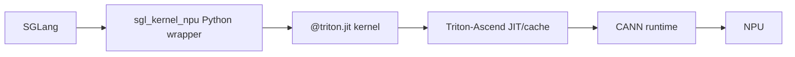
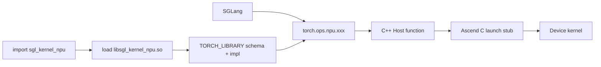

# sgl-kernel-npu 01：仓库结构与算子生命周期

本章以官方仓库 [`b2378ee`（2026-07-02）](https://github.com/sgl-project/sgl-kernel-npu/tree/b2378ee05769cf7df209ffc5e1b669728f435a7e) 为源码基线。仓库更新很快，目录或 API 变化时应以自己的 checkout 为准。

## 1. 它是混合 Kernel 仓库

`sgl-kernel-npu` 不是“Triton 算子目录”，也不是“Ascend C 算子目录”。它把 SGLang 需要的多种实现统一成可安装、可测试的 kernel 包：

```text
sgl-kernel-npu/
├── python/
│   ├── sgl_kernel_npu/   # Python package、Triton kernels、wrapper
│   ├── attentions/       # attention 相关 Python package
│   └── deep_ep/          # DeepEP-Ascend Python package
├── csrc/                 # C++ Host、PyTorch 注册、Ascend C kernel
├── tests/                # correctness / integration tests
├── benchmark/            # microbenchmark
├── docs/
├── cmake/
├── CMakeLists.txt
└── build.sh
```

同一次 SGLang forward 可以交替调用 Triton kernel、Ascend C custom op 和 `torch_npu`/CANN 原生算子。

## 2. Python 包中有什么

当前 `python/sgl_kernel_npu/sgl_kernel_npu/` 的主要目录包括：

```text
activation/  attention/  fla/  mamba/  mem_cache/
moe/         norm/       sample/  utils/
kvcacheio.py speculative.py
```

从文件后缀不能完全判断实现：Python 文件可能是纯 Torch wrapper，也可能定义 `@triton.jit` kernel，还可能只调用已注册的 `torch.ops.npu.*`。

推荐先搜索：

```bash
rg '@triton.jit|torch\.ops|torch_npu' python/sgl_kernel_npu/sgl_kernel_npu
```

## 3. C++/Ascend C 部分

`csrc/` 以算子为单位组织：

```text
csrc/<op>/
├── op_host/      # 参数检查、tiling、workspace、launch
└── op_kernel/    # Ascend C device kernel
```

当前可见的算子包括 cache 分配/更新、LoRA、MLA preprocess、batch matmul、speculative tree、lightning indexer、causal conv、token bitmask 等。

关键公共入口：

- [`csrc/pytorch_extensions.cpp`](https://github.com/sgl-project/sgl-kernel-npu/blob/b2378ee05769cf7df209ffc5e1b669728f435a7e/csrc/pytorch_extensions.cpp)：PyTorch schema 与 NPU backend 注册；
- [`csrc/CMakeLists.txt`](https://github.com/sgl-project/sgl-kernel-npu/blob/b2378ee05769cf7df209ffc5e1b669728f435a7e/csrc/CMakeLists.txt)：Host 源码、Ascend C kernel target 和 shared library 链接。

## 4. 两条典型生命周期

### 4.1 Triton Python Kernel



这条路径通常不需要为每个 Triton kernel 在 `pytorch_extensions.cpp` 注册 schema。Python wrapper 直接 launch JIT kernel。

### 4.2 Ascend C Custom Op



## 5. Import 为什么会改变 `torch.ops`

当前 [`sgl_kernel_npu/__init__.py`](https://github.com/sgl-project/sgl-kernel-npu/blob/b2378ee05769cf7df209ffc5e1b669728f435a7e/python/sgl_kernel_npu/sgl_kernel_npu/__init__.py) 会定位包内的 `lib/libsgl_kernel_npu.so`，然后调用：

```python
torch.ops.load_library(so_path)
```

加载 `.so` 时，静态注册代码运行，`torch.ops.npu.*` 中才出现该库定义的算子。

这解释了一个常见现象：

```python
import torch
# torch.ops.npu.some_sgl_op 可能不存在

import sgl_kernel_npu
# shared library 被加载，注册完成
```

## 6. Schema 与 Implementation

`pytorch_extensions.cpp` 使用两个关键宏：

```cpp
TORCH_LIBRARY_FRAGMENT(npu, m) { /* m.def(schema) */ }
TORCH_LIBRARY_IMPL(npu, PrivateUse1, m) { /* m.impl(...) */ }
```

可分别理解为：

- `m.def`：对外声明函数签名、参数、返回值与 mutation alias；
- `m.impl`：告诉 dispatcher，NPU/PrivateUse1 tensor 应调用哪个 C++ Host 函数。

Schema 中的 `Tensor(a!)` 表示有别名标记的可变 tensor。Mutation 契约会影响 graph、functionalization 和调用者对输出的理解，不能随意删改。

## 7. Host 函数的职责

典型 Host 函数会：

1. `TORCH_CHECK` 输入 shape/dtype/contiguous；
2. 处理 optional 参数与 padding；
3. 查询硬件核数和 Local Memory；
4. 计算 `blockDim`、tile、workspace；
5. 获取当前 NPU stream；
6. 维护异步 tensor 生命周期；
7. 按 dtype/shape launch 对应 kernel；
8. 恢复输出 layout 或去除 padding。

所以 Host 代码不是“胶水而已”，它是动态 shape 与静态 device kernel 之间的策略层。

## 8. CMake 如何把它们装进同一库

当前 [`csrc/CMakeLists.txt`](https://github.com/sgl-project/sgl-kernel-npu/blob/b2378ee05769cf7df209ffc5e1b669728f435a7e/csrc/CMakeLists.txt) 大致做三件事：

```text
收集 OP_SRCS                 -> Host C++ / registration
ascendc_library(...)         -> 编译 Ascend C device kernels
add_library(... SHARED ...)  -> 生成 libsgl_kernel_npu.so
```

Shared library 链接 `torch_npu`、`ascendcl`、tiling/platform/register 等库，并输出到 Python package 的 `lib/` 目录，最终随 wheel 分发。

## 9. 如何判断一个算子走哪条路径

从调用点开始按顺序搜索：

```text
1. 是普通 torch / torch_npu API 吗？
2. 是 sgl_kernel_npu Python 函数吗？打开函数看是否有 @triton.jit
3. 是 torch.ops.<namespace>.<op> 吗？搜索 TORCH_LIBRARY 的 m.def
4. 找到 m.impl 后进入 C++ Host 函数
5. 搜索 EXEC_KERNEL_CMD / launch stub
6. 进入 op_kernel 的 __global__ __aicore__ 入口
7. 对照 tests 与 benchmark
```

实用命令：

```bash
rg '目标算子名' python csrc tests benchmark
rg 'm\.def|m\.impl' csrc/pytorch_extensions.cpp
rg 'EXEC_KERNEL_CMD|__global__|__aicore__' csrc/<op>
```

## 10. 阅读顺序

初学者不要先扎进几千行 attention kernel。建议：

1. Python Triton：`norm/fused_split_qk_norm.py`；
2. 简单 Ascend C：`apply_token_bitmask/`；
3. Host tiling 更复杂：`batch_matmul_transpose/`；
4. 多阶段融合：`mla_preprocess/`；
5. 通信与 MoE：`deepep/`。

## 11. 本章检查点与参考答案

### 1. 为什么 import 一个 Python 包会新增 `torch.ops.npu` 算子？

**答案：**因为 `sgl_kernel_npu/__init__.py` 不只是定义 Python 名称，它还主动加载包含 PyTorch 静态注册代码的 shared library。

导入时 `_load_sgl_kernel_npu()` 找到 `libsgl_kernel_npu.so` 并调用 `torch.ops.load_library()`。操作系统把 `.so` 映射进进程后，其中 `TORCH_LIBRARY_FRAGMENT` 和 `TORCH_LIBRARY_IMPL` 的注册逻辑执行，schema 与 backend implementation 被加入 PyTorch dispatcher。

所以新增 op 的真正来源是 shared library 加载副作用，而不是 Python 运行时凭函数名动态生成。若 `.so` 缺失、依赖库无法解析或 import 没有发生，相应 `torch.ops.npu.xxx` 就不会完成注册。

### 2. `m.def` 与 `m.impl` 分别负责什么？

**答案：**`m.def` 声明“这个算子对外是什么”，`m.impl` 声明“某个 backend 具体由谁执行”。

`m.def` 注册 schema，包括名称、参数顺序和类型、optional/default、返回值以及 alias/mutation 标记。Dispatcher、图编译和调用参数检查依赖这份契约。

`m.impl` 把同一 operator 的某个 dispatch key 绑定到 C++ 函数。例如 `PrivateUse1` 的实现会在输入是 NPU tensor 时被选中。只有 schema 而没有匹配实现会在 dispatch 时报错；实现的行为若违反 schema，eager 可能暂时可跑，但 functionalization/graph 可能错误推理。

### 3. Triton kernel 为什么不一定出现在 `pytorch_extensions.cpp`？

**答案：**因为 Triton Python wrapper 可以直接用 `kernel[grid](...)` 触发 JIT 编译和 launch，不必经过 PyTorch C++ custom op dispatcher。

`pytorch_extensions.cpp` 主要服务于编译进 `.so` 的 C++ Host/Ascend C 路径：它们需要 schema 和 PrivateUse1 binding 才能暴露为 `torch.ops`。纯 Python Triton 函数本身已经是可调用入口，输入 PyTorch NPU tensor 会被作为 device pointer 传给 Triton runtime。

这不是绝对规则：为了 `torch.compile`、统一 API 或 fake/meta kernel，也可以额外用 `torch.library` 包装 Triton kernel。但“在仓库中有 Triton kernel”与“必须在该 C++ 文件注册”没有必然关系。

### 4. Host function 为什么属于性能策略而不只是 binding？

**答案：**它在运行时 shape 与预编译 device kernel 之间做决策，很多性能关键参数正是在这里确定。

Host function 会查询物理核数、UB 容量和当前 stream，选择 blockDim、tileLength、workspace、padding、dtype kernel 变体以及是否 contiguous。它还可能 gather optional rows、复用输出、维护异步 storage 生命周期。

这些决定直接影响核利用率、GM 流量和额外分配。例如 Host 选择 padding 到 256 可以让两种 DataCopy 都对齐，但也会产生额外复制。把 Host 当成无成本 binding 会漏掉完整性能路径。

### 5. CMake 中 Host target、Ascend C static library、最终 shared library 是什么关系？

**答案：**它们是同一交付物的不同构建层次。

Ascend C device 源码先由目标工具链编译成 kernel static library；Host C++ 源码包含 PyTorch 注册、输入检查、tiling 和 launch stub。最终 `add_library(... SHARED ...)` 生成 `libsgl_kernel_npu.so`，并链接 Host object、device kernel library、`torch_npu`、`ascendcl`、platform/tiling 等依赖。

Python wheel 携带这个 `.so`。Import 加载的是最终 shared library，不是直接加载 `.cpp` 或单独 static library。Static library 便于构建期组合，shared library 才是运行时动态加载和注册的边界。

## 官方源码

- [sgl-kernel-npu 仓库](https://github.com/sgl-project/sgl-kernel-npu)
- [Python package initializer](https://github.com/sgl-project/sgl-kernel-npu/blob/b2378ee05769cf7df209ffc5e1b669728f435a7e/python/sgl_kernel_npu/sgl_kernel_npu/__init__.py)
- [PyTorch custom op registration](https://github.com/sgl-project/sgl-kernel-npu/blob/b2378ee05769cf7df209ffc5e1b669728f435a7e/csrc/pytorch_extensions.cpp)
- [CMake build graph](https://github.com/sgl-project/sgl-kernel-npu/blob/b2378ee05769cf7df209ffc5e1b669728f435a7e/csrc/CMakeLists.txt)
