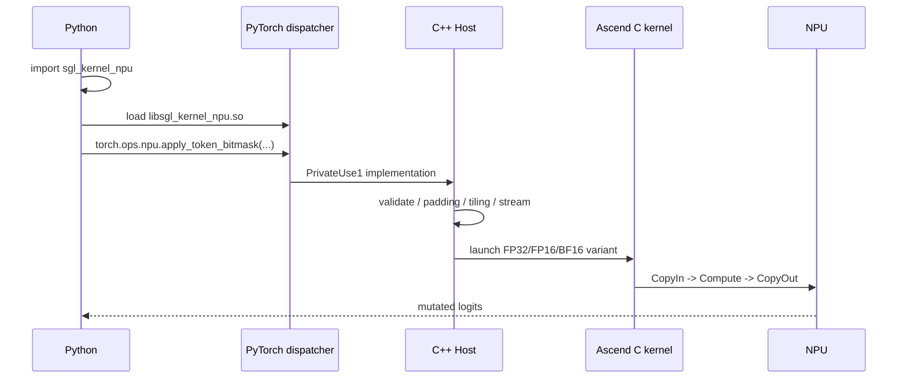

# sgl-kernel-npu 03：Ascend C 源码精读——Apply Token Bitmask

源码基线：`sgl-kernel-npu@b2378ee`。这个算子特别适合串起 Python import、PyTorch 注册、Host tiling、Global/Local Tensor、双缓冲和测试。

如果你对 `Platform`、`blockDim`、`tiling data` 和 `workspace` 的 Host 侧边界还不稳，先读 [`../ascend-c/04-platform-tiling-and-workspace-contracts.md`](../ascend-c/04-platform-tiling-and-workspace-contracts.md) 再回来看这一章，会更容易把 launch 前后的职责拆开。

## 1. 算子语义

输入：

```text
logits : [batch, vocab_size], FP32/FP16/BF16
bitmask: [batch, ceil(vocab_size/32)], INT32
indices: optional row indices
```

每个 INT32 的 32 个 bit 对应 32 个 vocabulary 位置：

```text
bit = 1 -> 保留 logit
bit = 0 -> 将 logit 写成 -inf
```

它可用于约束解码：被 mask 的 token 经 softmax 后概率为 0。

## 2. 完整调用链



## 3. Schema 与注册

[`pytorch_extensions.cpp`](https://github.com/sgl-project/sgl-kernel-npu/blob/b2378ee05769cf7df209ffc5e1b669728f435a7e/csrc/pytorch_extensions.cpp#L137) 声明：

```text
apply_token_bitmask(Tensor logits, Tensor bitmask, Tensor? indices=None) -> Tensor
```

在 `TORCH_LIBRARY_IMPL(npu, PrivateUse1, ...)` 中把它绑定到 `sglang::npu_kernel::apply_token_bitmask` Host 函数。Optional `indices` 在注册 lambda 中转换为空 tensor 或实值 tensor。

## 4. Host：先验证契约

[`op_host/apply_token_bitmask.cpp`](https://github.com/sgl-project/sgl-kernel-npu/blob/b2378ee05769cf7df209ffc5e1b669728f435a7e/csrc/apply_token_bitmask/op_host/apply_token_bitmask.cpp#L14) 检查：

- logits 与 bitmask 都是 2D；
- batch 相同；
- 两者 contiguous；
- bitmask 为 INT32；
- logits 为 FP32/FP16/BF16；
- vocab size 大于 0。

这是 Host 的价值：让 device kernel 可以在明确契约下运行，而不是每个核重复做动态检查。

## 5. Optional Indices

有 `indices` 时只处理选中行：

```text
rowIndices = indices -> int64 contiguous
selectedBitmask = bitmask[rowIndices]
selectedLogits = logits[rowIndices]
```

Kernel 完成后再用 `index_put_` 写回原 logits。这个功能减少 device kernel 内复杂的行映射，但 Host 端 gather/scatter 也有成本；是否更快取决于选中行数。

## 6. 为什么 Padding 到 256 元素

Host 选择 256 elements 作为对齐单元：

```text
logits：256 × sizeof(T) 是 32B 的整数倍
bitmask：256 bits = 8 × int32 = 32B
```

若 vocab size 不整除 256，会创建 padded working tensor，kernel 后再 narrow 回真实 vocab。这里用少量 padding 计算换取两条输入搬运都规则对齐。

## 7. BlockDim：按行分核

Host 查询 AIV 核数：

```text
coreNum = GetCoreNumAiv()
blockDim = min(numRows, coreNum)
```

行数多于核数时，均匀分配：

```text
baseRows = numRows // blockDim
extraCores = numRows % blockDim

前 extraCores 个核：baseRows + 1 行
其他核：baseRows 行
```

Device [`Init()`](https://github.com/sgl-project/sgl-kernel-npu/blob/b2378ee05769cf7df209ffc5e1b669728f435a7e/csrc/apply_token_bitmask/op_kernel/apply_token_bitmask.cpp#L22) 用 `GetBlockIdx()` 计算 `startRow` 与 `localRows`。

## 8. TileLength：根据 UB 动态计算

Host 查询 UB 大小，预留 16KB 管理开销，然后预算三个双缓冲队列：

```text
logits input : 2 × tileLength × dtypeSize
bitmask input: 2 × (tileLength/32) × sizeof(int32)
logits output: 2 × tileLength × dtypeSize
```

再把结果按 256 elements 对齐，并限制不超过 padded vocab size。

这是非常典型的 Host tiling：dtype 改变会改变每元素字节，进而改变 tileLength；device kernel 不必硬编码具体 UB 容量。

## 9. TPipe 与三个 TQue

Device class 声明：

```text
inQueueLogits  : VECIN, double buffer
inQueueBitmask : VECIN, double buffer
outQueueLogits : VECOUT, double buffer
```

[`pipe.InitBuffer`](https://github.com/sgl-project/sgl-kernel-npu/blob/b2378ee05769cf7df209ffc5e1b669728f435a7e/csrc/apply_token_bitmask/op_kernel/apply_token_bitmask.cpp#L55) 为每个队列按 tileLength 分配资源。

## 10. Process：两层循环

[`Process()`](https://github.com/sgl-project/sgl-kernel-npu/blob/b2378ee05769cf7df209ffc5e1b669728f435a7e/csrc/apply_token_bitmask/op_kernel/apply_token_bitmask.cpp#L60)：

```text
for 当前核负责的每一行:
    for vocab 方向的每个 tile:
        CopyIn
        Compute
        CopyOut
```

这里清楚地对应两层 tiling：多核按 row 切分，核内沿 vocab 切 tile。

## 11. CopyIn

[`CopyIn()`](https://github.com/sgl-project/sgl-kernel-npu/blob/b2378ee05769cf7df209ffc5e1b669728f435a7e/csrc/apply_token_bitmask/op_kernel/apply_token_bitmask.cpp#L80) 做两次 GM→UB：

```text
logits GM slice  -> logitsLocal  -> EnQue
bitmask GM words -> bitmaskLocal -> EnQue
```

Bitmask offset 使用 `vocabOffset / 32`，长度使用 `ceil(curTileLen/32)` 并向 8 个 INT32 对齐，即 32 字节。

## 12. Compute

[`Compute()`](https://github.com/sgl-project/sgl-kernel-npu/blob/b2378ee05769cf7df209ffc5e1b669728f435a7e/csrc/apply_token_bitmask/op_kernel/apply_token_bitmask.cpp#L95)：

1. `DeQue` 两个输入 LocalTensor；
2. 分配输出 LocalTensor；
3. 把 logitsLocal 复制到 outLocal；
4. 逐个读取 packed INT32；
5. bit 为 0 时把对应输出设为 `-inf`；
6. 输出 `EnQue`，释放输入。

源码对 `packed == -1` 做快速跳过，因为 `0xFFFFFFFF` 表示 32 个 token 全保留。

值得观察：当前 bit 展开使用 device 侧标量 `GetValue/SetValue` 循环，逻辑清晰，但也可能带来 Scalar 工作。若 profiler 显示它成为瓶颈，可研究 Vector 化 bit 展开；不能仅凭代码观感断言一定慢。

## 13. CopyOut

[`CopyOut()`](https://github.com/sgl-project/sgl-kernel-npu/blob/b2378ee05769cf7df209ffc5e1b669728f435a7e/csrc/apply_token_bitmask/op_kernel/apply_token_bitmask.cpp#L124)：

```text
DeQue outLocal
DataCopy UB -> logits GM 原位置
FreeTensor outLocal
```

算子实现会原地更新 logits。值得审查的是，当前 `m.def` schema 把参数写成普通 `Tensor logits`，没有像仓内其他原地参数那样使用 `Tensor(a!)` alias/mutation 标记。源码行为与 schema 契约的这种差异可能影响 functionalization、graph 或编译器推理；接入新图模式时应先用最小测试验证，并优先与上游约定对齐，而不是只根据返回值猜测它是 out-of-place 算子。

## 14. 三个 DType Kernel 入口

Device 文件为 half、float、bfloat16 提供三个入口。Host 按 logits dtype 选择 `EXEC_KERNEL_CMD`。

为什么不只写一个运行时 dtype 分支：

- C++ template 需要在编译期实例化类型；
- 每种 dtype 的字节数与指令不同；
- launch stub 需要明确 kernel symbol。

## 15. 异步生命周期

Host 在 launch 前对 working tensor 调用 `record_stream(npuStream)`，防止异步 kernel 完成前底层 storage 被 allocator 回收。

这类 bug 的典型表现是偶现错误，而不是每次稳定失败。Kernel 正确性不仅在 device 数学里，也包括 Host 对异步生命周期的管理。

## 16. 测试如何设计

仓库的 [`test_apply_token_bitmask.py`](https://github.com/sgl-project/sgl-kernel-npu/blob/b2378ee05769cf7df209ffc5e1b669728f435a7e/tests/python/sgl_kernel_npu/test_apply_token_bitmask.py) 包含：

- CPU reference；
- random、all masked、all unmasked、half masked；
- boundary、LLM 和 general shapes；
- optional indices；
- correctness 与 performance 模式。

Reference 不需要快，它需要简单、独立、容易审查。

## 17. 可以继续提出的优化问题

- `numRows < coreNum` 时，仅按行分核是否让大 vocab 单行缺少并行？
- bit 展开能否批量 Vector 化？
- padding 的额外 tensor 分配在非 256 对齐 vocab 下占多少时间？
- optional indices 的 gather/scatter 成本何时超过少算的收益？
- double buffer 是否在小 vocab 下仍有收益？
- `.out`/预分配接口是否更适合 graph capture？

这些是需要 benchmark 和 trace 回答的问题，不是读源码就能直接下结论。

## 18. 本章检查点

- 为什么对齐单元恰好选 256 elements？
- BlockDim 与 tileLength 分别按什么资源计算？
- 三个 TQue 如何对应 CopyIn/Compute/CopyOut？
- `record_stream` 解决什么类型的正确性问题？
- 为什么 `packed == -1` 可以快速跳过？
- 从哪里能证明 `torch.ops.npu.apply_token_bitmask` 属于 sgl-kernel-npu？

## 对应源码

- [PyTorch 注册](https://github.com/sgl-project/sgl-kernel-npu/blob/b2378ee05769cf7df209ffc5e1b669728f435a7e/csrc/pytorch_extensions.cpp#L137)
- [Host 实现与 Tiling](https://github.com/sgl-project/sgl-kernel-npu/blob/b2378ee05769cf7df209ffc5e1b669728f435a7e/csrc/apply_token_bitmask/op_host/apply_token_bitmask.cpp)
- [Ascend C Device Kernel](https://github.com/sgl-project/sgl-kernel-npu/blob/b2378ee05769cf7df209ffc5e1b669728f435a7e/csrc/apply_token_bitmask/op_kernel/apply_token_bitmask.cpp)
- [正确性与性能测试](https://github.com/sgl-project/sgl-kernel-npu/blob/b2378ee05769cf7df209ffc5e1b669728f435a7e/tests/python/sgl_kernel_npu/test_apply_token_bitmask.py)
