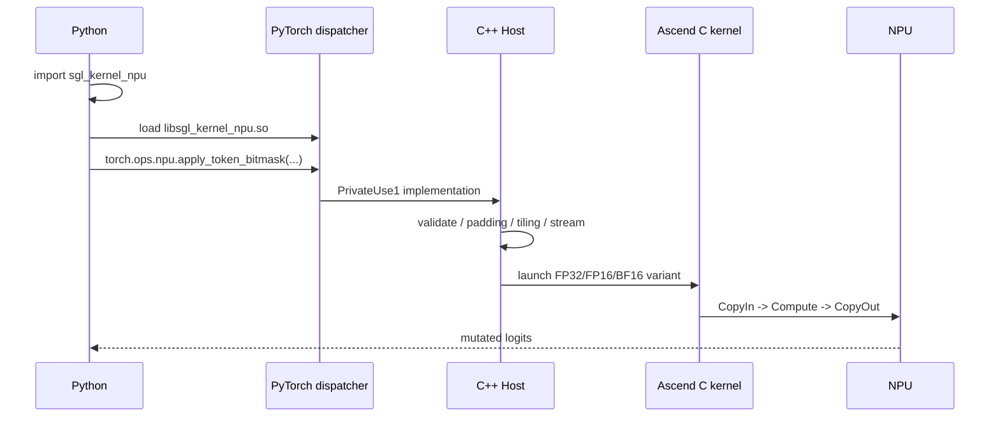

**中文** | [English](./03-ascend-c-apply-token-bitmask_EN.md)

# sgl-kernel-npu 03：Ascend C 源码精读——Apply Token Bitmask

源码基线：`sgl-kernel-npu@b2378ee`。这个算子特别适合串起 Python import、PyTorch 注册、Host tiling、Global/Local Tensor、双缓冲和测试。

如果你对 `Platform`、`blockDim`、`tiling data` 和 `workspace` 的 Host 侧边界还不稳，先读 [`../ascend-c/04-platform-tiling-and-workspace-contracts.md`](../ascend-c/04-platform-tiling-and-workspace-contracts.md) 再回来看这一章，会更容易把 launch 前后的职责拆开。

本章源码中的每种 tensor 都按[代码阅读手册](../reference/code-reading-and-types.md)解释：Python `torch.Tensor` → Host `at::Tensor` → launch `GM_ADDR` → Device `GlobalTensor<T>` → Queue 分配的 `LocalTensor<T>`。箭头表示接口转换，不表示每一步都复制数据。

## 1. 算子语义

输入：

```text
logits : [batch, vocab_size], FP32/FP16/BF16
bitmask: [batch, ceil(vocab_size/32)], INT32
indices: optional row indices
```

每个 INT32 的 32 个 bit 对应 32 个 vocabulary 位置：

```text
bit = 1 -> 保留 logit
bit = 0 -> 将 logit 写成 -inf
```

它可用于约束解码：被 mask 的 token 经 softmax 后概率为 0。

### 1.1 用推理场景解释：它到底在改什么

LLM 每生成下一个 token 前，模型会输出一行或多行 `logits`。`logits[b, v]` 可以先理解为：第 `b` 条请求在词表位置 `v` 上的“未归一化分数”。后续 sampler 会对这行分数做 temperature、top-k/top-p、softmax 和采样等步骤。

`apply_token_bitmask` 做的事非常单一：**把不允许出现的 token 的 logit 改成 `-inf`**。这样 softmax 后这些 token 的概率就是 0，采样器就不可能选到它们。

它不是 top-k，也不是排序，也不是重新归一化概率。它只是在采样前做一层“允许/禁止”过滤。典型用途包括：

- 约束解码：例如 JSON、正则、语法树或结构化输出要求某些位置只能生成特定 token；
- 业务规则：某些 token 在当前请求中被禁止；
- 动态 mask：每一步解码根据历史上下文更新可选 token 集合。

这一点很关键：`bitmask` 表示的是“词表维度上的许可表”，不是 batch 里有哪些请求，也不是 top-k 返回的候选列表。

### 1.2 `bitmask` 怎么对应 token id

**token id**，也叫 vocabulary index，是 tokenizer 把文本切成 token 后得到的整数编号，范围通常是 `[0, vocab_size)`。例如词表大小是 32000，那么 token id 可能是 0、1、2、……、31999。

`bitmask` 没有为每个 token id 存一个完整 `bool` 或 `int32`，而是把 32 个 token 的许可状态打包进一个 `INT32`。源码里用常量 `BITS_PER_INT32 = 32` 表达这个协议。

对第 `b` 行、第 `token_id` 个词表位置：

```text
word_id = token_id / 32
bit_id  = token_id % 32

packed  = bitmask[b, word_id]
allowed = ((packed >> bit_id) & 1) == 1
```

举一个很小的例子，假设 `vocab_size=10`，那么每行只需要 `ceil(10/32)=1` 个 `INT32`。如果第 0 行只允许 token `{2, 5, 9}`，那么这个 `INT32` 的第 2、5、9 个 bit 是 1，其他 bit 是 0。kernel 遍历 logits 的时候，发现 bit=0 就把对应 logit 写成 `-inf`。

这也是为什么 Device 侧 CopyIn 里 bitmask 的偏移是 `vocabOffset / 32`：logits 的偏移单位是“一个 token 位置”，bitmask 的偏移单位却是“一个 packed INT32 word”，两者不是同一个物理元素单位。

### 1.3 `indices` 是什么：这里是 batch 行号，不是 token id

AI 推理代码里经常出现 `indices`，它的字面意思只是“索引”，也就是一组整数编号。它具体指什么，必须看当前算子的约定。常见含义包括：

| 场景 | `indices` 可能表示什么 |
|---|---|
| tokenizer / embedding | token id，表示去 embedding 表里取第几个词表项 |
| top-k | 候选 token 的词表下标，例如 `topk_idx=[13, 502, 998]` |
| KV Cache | cache slot 或 block id，表示读写 KV cache 的位置 |
| MoE | expert id，表示 token 被路由到哪个专家 |
| gather/scatter | 行号、列号或任意维度的位置 |
| 本算子 | **batch row indices**，表示只处理 logits/bitmask 的哪些行 |

所以本章里的 `indices` 千万不要理解成“要保留或屏蔽的 token id 列表”。要保留哪些 token 已经由 `bitmask` 在 vocab 维度编码好了；`indices` 只是在 batch 维度选择“哪些请求行需要应用这张 bitmask”。

例如：

```text
logits.shape = [4, vocab_size]
batch 行号    = 0, 1, 2, 3
indices      = [1, 3]
```

含义是：只对第 1 行和第 3 行应用 bitmask，第 0 行和第 2 行不处理。Host 会先把 `logits[indices]` 和 `bitmask[indices]` gather 成一个较小的连续 tensor，kernel 只处理这个小 tensor；kernel 完成后，Host 再把结果 scatter 回原 `logits` 的第 1、3 行。

## 2. 完整调用链



## 3. Schema 与注册

[`pytorch_extensions.cpp`](https://github.com/sgl-project/sgl-kernel-npu/blob/b2378ee05769cf7df209ffc5e1b669728f435a7e/csrc/pytorch_extensions.cpp#L137) 声明：

```text
apply_token_bitmask(Tensor logits, Tensor bitmask, Tensor? indices=None) -> Tensor
```

在 `TORCH_LIBRARY_IMPL(npu, PrivateUse1, ...)` 中把它绑定到 `sglang::npu_kernel::apply_token_bitmask` Host 函数。Optional `indices` 在注册 lambda 中转换为空 tensor 或实值 tensor。

## 4. Host：先验证契约

[`op_host/apply_token_bitmask.cpp`](https://github.com/sgl-project/sgl-kernel-npu/blob/b2378ee05769cf7df209ffc5e1b669728f435a7e/csrc/apply_token_bitmask/op_host/apply_token_bitmask.cpp#L14) 检查：

- logits 与 bitmask 都是 2D；
- batch 相同；
- 两者 contiguous；
- bitmask 为 INT32；
- logits 为 FP32/FP16/BF16；
- vocab size 大于 0。

这是 Host 的价值：让 device kernel 可以在明确契约下运行，而不是每个核重复做动态检查。

## 5. Optional Indices

有 `indices` 时只处理选中行。源码中的 Host 路径可以压缩成下面几步：

```text
hasIndices      = indices 存在、defined 且 numel > 0
rowIndices      = indices -> int64 -> contiguous
selectedBitmask = bitmask.index({rowIndices}).contiguous()
selectedLogits  = logits.index({rowIndices})
result          = 对 selectedLogits / selectedBitmask 启动 NPU kernel
logits.index_put_({rowIndices}, result)
```

这里每个变量的含义是：

| 名字 | 类型/形状 | 含义 |
|---|---|---|
| `indices` | `c10::optional<at::Tensor>` | Python 传入的可选索引张量；可能为空 |
| `rowIndices` | `at::Tensor`，1D，`int64` | Host 规范化后的 batch 行号 |
| `selectedBitmask` | `at::Tensor`，`[num_indices, padded_bitmask_width]` 或原 bitmask view/contiguous tensor | 被选中的 bitmask 行 |
| `selectedLogits` | `at::Tensor`，`[num_indices, padded_vocab_size]` 或原 logits view/contiguous tensor | 被选中的 logits 行 |
| `numIndices` | `int64_t` | 实际需要处理的行数；没有 indices 时等于 batch |
| `result` | `at::Tensor` | kernel 修改后的选中行结果 |

真实源码证据链在 Host 文件中非常集中：

- [`#L35-L43`](https://github.com/sgl-project/sgl-kernel-npu/blob/b2378ee05769cf7df209ffc5e1b669728f435a7e/csrc/apply_token_bitmask/op_host/apply_token_bitmask.cpp#L35-L43)：判断是否有 `indices`，并把它转为 1D `int64` 的 `rowIndices`；
- [`#L63-L66`](https://github.com/sgl-project/sgl-kernel-npu/blob/b2378ee05769cf7df209ffc5e1b669728f435a7e/csrc/apply_token_bitmask/op_host/apply_token_bitmask.cpp#L63-L66)：有 indices 时 gather 选中 logits 行；
- [`#L159-L160`](https://github.com/sgl-project/sgl-kernel-npu/blob/b2378ee05769cf7df209ffc5e1b669728f435a7e/csrc/apply_token_bitmask/op_host/apply_token_bitmask.cpp#L159-L160)：kernel 完成后把结果写回原 logits 对应行。

为什么不让 Device kernel 直接拿原始 `indices` 做行映射？可以做，但当前实现选择把复杂度放在 Host 侧：Host 先 gather 成紧凑连续的 selected tensor，Device kernel 仍然看到一个从 0 到 `numIndices-1` 的普通 batch。这样 Device 侧地址计算简单，`blockDim/baseRows/extraCores` 也仍按连续行来算。代价是 Host 侧多了 gather/scatter 和临时 tensor；当只选中少量宽行时通常值得，当几乎所有行都选中或每行很短时可能不划算。

再强调一次：本算子的 `indices` 是 **batch 行索引**。如果你想表达“token id 17 不允许生成”，应该改对应行 `bitmask` 的第 `17/32` 个 word、第 `17%32` 个 bit，而不是把 17 放进 `indices`。

## 6. 为什么 Padding 到 256 元素

Host 选择 256 elements 作为对齐单元：

```text
logits：256 × sizeof(T) 是 32B 的整数倍
bitmask：256 bits = 8 × int32 = 32B
```

若 vocab size 不整除 256，会创建 padded working tensor，kernel 后再 narrow 回真实 vocab。这里用少量 padding 计算换取两条输入搬运都规则对齐。

## 7. BlockDim：按行分核

Host 查询 AIV 核数：

```text
coreNum = GetCoreNumAiv()
blockDim = min(numRows, coreNum)
```

行数多于核数时，均匀分配：

```text
baseRows = numRows // blockDim
extraCores = numRows % blockDim

前 extraCores 个核：baseRows + 1 行
其他核：baseRows 行
```

Device [`Init()`](https://github.com/sgl-project/sgl-kernel-npu/blob/b2378ee05769cf7df209ffc5e1b669728f435a7e/csrc/apply_token_bitmask/op_kernel/apply_token_bitmask.cpp#L22) 用 `GetBlockIdx()` 计算 `startRow` 与 `localRows`。

Host 类型是：`numRows/coreNum` 先以 `int64_t` 参与 shape/平台计算，确认范围后，`blockDim/baseRows/extraCores` 转成 `uint32_t` 与 Device 入口签名一致。它们都是标量，不是 tensor；`blockDim` 的单位是 launch 实例数，后两个的单位是行。

## 8. TileLength：根据 UB 动态计算

Host 查询 UB 大小，预留 16KB 管理开销，然后预算三个双缓冲队列：

```text
logits input : 2 × tileLength × dtypeSize
bitmask input: 2 × (tileLength/32) × sizeof(int32)
logits output: 2 × tileLength × dtypeSize
```

再把结果按 256 elements 对齐，并限制不超过 padded vocab size。

这是非常典型的 Host tiling：dtype 改变会改变每元素字节，进而改变 tileLength；device kernel 不必硬编码具体 UB 容量。

## 9. TPipe 与三个 TQue

Device class 的真实成员声明是：

```cpp
constexpr int32_t BUFFER_NUM = 2;

AscendC::TPipe pipe;
AscendC::TQue<AscendC::TPosition::VECIN, BUFFER_NUM> inQueueLogits;
AscendC::TQue<AscendC::TPosition::VECIN, BUFFER_NUM> inQueueBitmask;
AscendC::TQue<AscendC::TPosition::VECOUT, BUFFER_NUM> outQueueLogits;
AscendC::GlobalTensor<T> logitsGm;
AscendC::GlobalTensor<int32_t> bitmaskGm;
```

[`pipe.InitBuffer`](https://github.com/sgl-project/sgl-kernel-npu/blob/b2378ee05769cf7df209ffc5e1b669728f435a7e/csrc/apply_token_bitmask/op_kernel/apply_token_bitmask.cpp#L55) 为每个队列按 tileLength 分配资源。

`T` 是编译期模板类型，三个入口分别把它实例化为 `half/float/bfloat16_t`；`BUFFER_NUM` 是编译期整数 2；`TQue<position,2>` 是资源/同步对象；`GlobalTensor<T>` 是 GM typed view。`bitmaskGm` 固定为 `int32_t`，因为 packed mask 的物理元素类型与 logits dtype 无关。

## 10. Process：两层循环

[`Process()`](https://github.com/sgl-project/sgl-kernel-npu/blob/b2378ee05769cf7df209ffc5e1b669728f435a7e/csrc/apply_token_bitmask/op_kernel/apply_token_bitmask.cpp#L60)：

```text
for 当前核负责的每一行:
    for vocab 方向的每个 tile:
        CopyIn
        Compute
        CopyOut
```

这里清楚地对应两层 tiling：多核按 row 切分，核内沿 vocab 切 tile。

## 11. CopyIn

[`CopyIn()`](https://github.com/sgl-project/sgl-kernel-npu/blob/b2378ee05769cf7df209ffc5e1b669728f435a7e/csrc/apply_token_bitmask/op_kernel/apply_token_bitmask.cpp#L80) 的真实源码主体如下：

```cpp
AscendC::LocalTensor<T> logitsLocal = inQueueLogits.AllocTensor<T>();
uint32_t logitsGmOffset = batchId * this->logitsStride + vocabOffset;
AscendC::DataCopy(logitsLocal, logitsGm[logitsGmOffset], curTileLen);
inQueueLogits.EnQue(logitsLocal);

AscendC::LocalTensor<int32_t> bitmaskLocal = inQueueBitmask.AllocTensor<int32_t>();
uint32_t bitmaskGmOffset = batchId * this->bitmaskStride + vocabOffset / BITS_PER_INT32;
uint32_t bitmaskElems = (curTileLen + BITS_PER_INT32 - 1) / BITS_PER_INT32;
uint32_t alignedBitmaskElems = AlignUp(bitmaskElems, 8);
AscendC::DataCopy(bitmaskLocal, bitmaskGm[bitmaskGmOffset], alignedBitmaskElems);
inQueueBitmask.EnQue(bitmaskLocal);
```

Bitmask offset 使用 `vocabOffset / 32`，长度使用 `ceil(curTileLen/32)` 并向 8 个 INT32 对齐，即 32 字节。

`batchId/vocabOffset/curTileLen/logitsGmOffset/bitmaskGmOffset/bitmaskElems/alignedBitmaskElems` 都是 Device Scalar 的 `uint32_t`。其中 logits offset/length 的单位是 `T` 元素，bitmask offset/length 的单位是 `int32_t` word；`logitsLocal` 是 `LocalTensor<T>`，`bitmaskLocal` 是 `LocalTensor<int32_t>`。`AllocTensor` 与 `global[offset]` 只取得 view，两个 `DataCopy` 才是真实 GM→local 搬运。

## 12. Compute

[`Compute()`](https://github.com/sgl-project/sgl-kernel-npu/blob/b2378ee05769cf7df209ffc5e1b669728f435a7e/csrc/apply_token_bitmask/op_kernel/apply_token_bitmask.cpp#L95) 中最关键的真实源码是：

```cpp
AscendC::LocalTensor<T> logitsLocal = inQueueLogits.DeQue<T>();
AscendC::LocalTensor<int32_t> bitmaskLocal = inQueueBitmask.DeQue<int32_t>();
AscendC::LocalTensor<T> outLocal = outQueueLogits.AllocTensor<T>();
AscendC::DataCopy(outLocal, logitsLocal, curTileLen);

T negInf = static_cast<T>(-1.0f / 0.0f);
for (uint32_t intIdx = 0;
     intIdx < (curTileLen + BITS_PER_INT32 - 1) / BITS_PER_INT32;
     intIdx++) {
    int32_t packed = bitmaskLocal.GetValue(intIdx);
    if (packed == -1) continue;
    for (uint32_t bitIdx = 0; bitIdx < BITS_PER_INT32; bitIdx++) {
        uint32_t i = intIdx * BITS_PER_INT32 + bitIdx;
        if (i >= curTileLen) break;
        if (((packed >> static_cast<int32_t>(bitIdx)) & 1) == 0) {
            outLocal.SetValue(i, negInf);
        }
    }
}
```

1. `DeQue` 两个输入 LocalTensor；
2. 分配输出 LocalTensor；
3. 把 logitsLocal 复制到 outLocal；
4. 逐个读取 packed INT32；
5. bit 为 0 时把对应输出设为 `-inf`；
6. 输出 `EnQue`，释放输入。

源码对 `packed == -1` 做快速跳过，因为 `0xFFFFFFFF` 表示 32 个 token 全保留。

`negInf` 的静态类型是模板参数 `T`；`intIdx/bitIdx/i` 是 `uint32_t` Scalar；`packed` 是 `int32_t` Scalar，通过 `LocalTensor<int32_t>::GetValue` 从 local buffer 取一个 word；`SetValue` 写一个 `T` 元素回 `outLocal`。这部分不是 Vector block API，而是显式 Scalar 循环，所以 profiler 中应单独观察 Scalar 开销。

值得观察：当前 bit 展开使用 device 侧标量 `GetValue/SetValue` 循环，逻辑清晰，但也可能带来 Scalar 工作。若 profiler 显示它成为瓶颈，可研究 Vector 化 bit 展开；不能仅凭代码观感断言一定慢。

## 13. CopyOut

[`CopyOut()`](https://github.com/sgl-project/sgl-kernel-npu/blob/b2378ee05769cf7df209ffc5e1b669728f435a7e/csrc/apply_token_bitmask/op_kernel/apply_token_bitmask.cpp#L124)：

```cpp
AscendC::LocalTensor<T> outLocal = outQueueLogits.DeQue<T>();
uint32_t outputGmOffset = batchId * this->logitsStride + vocabOffset;
AscendC::DataCopy(logitsGm[outputGmOffset], outLocal, curTileLen);
outQueueLogits.FreeTensor(outLocal);
```

`outputGmOffset` 单位是 `T` 元素；`logitsGm[outputGmOffset]` 仍只是偏移 GM view；参数顺序变成 `DataCopy(global, local, count)` 后才表示 local→GM。

算子实现会原地更新 logits。值得审查的是，当前 `m.def` schema 把参数写成普通 `Tensor logits`，没有像仓内其他原地参数那样使用 `Tensor(a!)` alias/mutation 标记。源码行为与 schema 契约的这种差异可能影响 functionalization、graph 或编译器推理；接入新图模式时应先用最小测试验证，并优先与上游约定对齐，而不是只根据返回值猜测它是 out-of-place 算子。

## 14. 三个 DType Kernel 入口

Device 文件为 half、float、bfloat16 提供三个入口。Host 按 logits dtype 选择 `EXEC_KERNEL_CMD`。

为什么不只写一个运行时 dtype 分支：

- C++ template 需要在编译期实例化类型；
- 每种 dtype 的字节数与指令不同；
- launch stub 需要明确 kernel symbol。

## 15. 异步生命周期

Host 在 launch 前对 working tensor 调用 `record_stream(npuStream)`，防止异步 kernel 完成前底层 storage 被 allocator 回收。

这类 bug 的典型表现是偶现错误，而不是每次稳定失败。Kernel 正确性不仅在 device 数学里，也包括 Host 对异步生命周期的管理。

## 16. 测试如何设计

仓库的 [`test_apply_token_bitmask.py`](https://github.com/sgl-project/sgl-kernel-npu/blob/b2378ee05769cf7df209ffc5e1b669728f435a7e/tests/python/sgl_kernel_npu/test_apply_token_bitmask.py) 包含：

- CPU reference；
- random、all masked、all unmasked、half masked；
- boundary、LLM 和 general shapes；
- optional indices；
- correctness 与 performance 模式。

Reference 不需要快，它需要简单、独立、容易审查。

## 17. 开放优化问题：当前结论与验证方法

这些问题的最终答案依赖硬件、shape 和 CANN 版本，但并不意味着只能留下问号。下面先给出源码静态分析能确定的机制，再说明需要怎样测量。

### 1. `numRows < coreNum` 时，仅按行分核是否让大 vocab 单行缺少并行？

**分析答案：**会限制可用的核间并行度。当前 `blockDim=min(numRows,coreNum)`，每个 block 负责完整的一行；若只有 1 行，即使 vocab 很大，也只启动 1 个 block，再由该核沿 vocab 方向串行处理多个 tile。

因为各 vocab 位置的 bitmask 应用彼此独立，可以评估二维切分 `(row, vocab_chunk)`，让多核共同处理同一行的互不重叠区间。代价是 block 数、地址计算和尾块增多，极小行或较短 vocab 可能反而更慢。

验证时固定总元素数，分别扫描 `numRows={1,2,4,...}` 与 vocab，比较当前按行方案和二维分核方案的 kernel latency、AIV 利用率、每核工作量及 launch 开销；不能只测吞吐较大的多行 case。

### 2. Bit 展开能否批量 Vector 化？

**分析答案：**算法上可以尝试：把若干 packed INT32 广播/移位并生成 lane mask，再用 Vector compare/select 一次处理一批 logits。当前 `GetValue/SetValue` 双层循环明确把展开工作放在 Scalar 路径，长 vocab 或大量部分 mask word 时可能成为瓶颈。

但能否更快取决于目标 Ascend C 版本对整数位运算、broadcast、select 与 mixed dtype 的支持，以及构造 unpacked mask 需要多少 UB 和指令。`packed==-1` 快速路径在大量全保留 word 时可能已经很便宜，Vector 化反而做了无用工作。

应分别测试 all-unmasked、all-masked、随机稀疏和连续区间 mask，观察 Scalar/Vector 指令占比、UB 使用与 latency；不要只在随机 mask 上给出统一结论。

### 3. Padding 的额外 tensor 分配在非 256 对齐 vocab 下占多少时间？

**分析答案：**源码只能确认会发生额外 `zeros`、`narrow().copy_()` 和结果拷回，无法静态给出时间比例。开销同时受 batch、padding 差值、allocator 是否命中缓存、内存带宽和 graph 模式影响。

Padding 的元素浪费上界小于每行 255 个 logits，但固定的分配/launch 开销在小 batch、小 vocab 时可能比新增字节更显著。大 vocab 时相对字节比例很小，额外全 tensor copy 却仍可能可见。

验证应把 Host/wrapper 总时间与纯 device kernel 时间分开，成对测试 `vocab=256k` 和 `256k±1`，并覆盖冷 allocator、预热 allocator 与 graph capture。若只计 kernel 内部，就会完全漏掉 padding 创建成本。

### 4. Optional indices 的 gather/scatter 成本何时超过少算的收益？

**分析答案：**存在一个随“选中行比例”和每行 vocab 工作量变化的交叉点。选中行很少、每行很宽时，少运行大量 bitmask 计算通常值得；选中比例接近 100% 或行很短时，`index`/`index_put_`、临时 contiguous tensor 和额外内存流量可能超过收益。

可以用近似成本模型理解：

```text
indices 路径 = gather + selected_rows_kernel + scatter
全量路径    = all_rows_kernel
```

对每个真实 batch/vocab 扫描选中比例 `{1%,10%,25%,50%,75%,100%}`，同时记录 wrapper 总时间、额外显存和 kernel 时间。交叉点必须用端到端 wrapper 测量，不能只比较中心 kernel。

### 5. Double buffer 是否在小 vocab 下仍有收益？

**分析答案：**若每行只有一个 tile，几乎没有“下一 tile CopyIn 与当前 tile Compute 重叠”的稳态阶段，double buffer 很难发挥主要价值，却仍占两份 queue buffer。小任务还更容易由 launch、Scalar 控制和流水填充/排空主导。

若多行循环能让编译器跨行形成重叠，或 CopyOut 与下一行 CopyIn 可以并行，仍可能有有限收益，所以不能只凭 tileCount=1 断言必然无效。减少 buffer 数还可能允许更大 tile，改变另一项变量。

应为同一 tileLength 提供 buffer number 1/2 两个变体，按 `numRows×vocab` 网格测量，并检查 UB 占用、CopyIn/Compute/CopyOut 时间线。只有真机 trace 能证明是否实际重叠。

### 6. `.out`/预分配接口是否更适合 graph capture？

**分析答案：**通常更有利，因为调用者可以在 capture 前准备稳定地址和容量，避免 wrapper 每次动态分配 padding/output tensor；但它不是自动获得 graph 安全的充分条件。

还必须保证 schema 正确标注 mutation/alias、输入输出 shape 在重放时满足合同、workspace/tiling storage 生命周期稳定、没有 capture 期间不允许的 Host 同步或分配，并且 stream 依赖正确。当前算子原地修改 logits，尤其要让 schema 与真实 mutation 行为一致。

评估时应分别验证 eager 正确性、首次 capture、重复 replay、地址是否稳定以及不同 shape 是否正确拒绝或重建图；随后比较分配次数、capture 成功率和 replay latency。

## 18. 本章检查点与参考答案

### 1. 为什么对齐单元恰好选 256 elements？

**答案：**它同时让 logits 和 packed bitmask 的一段数据满足 32 字节搬运粒度。

Bitmask 每个 INT32 表示 32 个 vocabulary position。256 个 position 对应 `256/32=8` 个 INT32，也就是 `8×4=32` 字节。Logits 一侧，256 个 FP16/BF16 是 512 字节，FP32 是 1024 字节，也都能被 32 字节整除。

所以 256 是两种输入表示的公共友好粒度，而不是 NPU 对所有 tensor 的普适 tile。换一种 bit packing 或 dtype 集合，合适的共同对齐单元可能不同。

### 2. BlockDim 与 tileLength 分别按什么资源计算？

**答案：**BlockDim 主要按可用 AIV 核数与行任务数计算，tileLength 主要按单核 UB 容量和每 tile 同时存活的 buffer 计算。

Host 使用 `min(numRows,coreNum)`，避免启动比行数更多的核，并把多余行均匀分给各核。这解决核间并行与负载均衡。

TileLength 则预算双缓冲的 logits input、bitmask input 和 logits output，扣除管理开销后用可用 UB 反推最大长度，再按 256 对齐并限制不超过 vocab。它解决单核一轮能安全搬入多少数据。一个控制“多少核”，另一个控制“每核每轮多少元素”。

### 3. 三个 TQue 如何对应 CopyIn/Compute/CopyOut？

**答案：**两个 VECIN Queue 连接 CopyIn 与 Compute，一个 VECOUT Queue 连接 Compute 与 CopyOut。

CopyIn 分别为 logits 和 bitmask 分配 LocalTensor，完成 GM→UB 后 EnQue；Compute 从两个输入 Queue DeQue，生成 outLocal 并 EnQue 到输出 Queue，同时释放输入；CopyOut 从输出 Queue DeQue，执行 UB→GM，再释放输出。

三条 Queue 把两输入一输出的数据依赖显式化。每条都分配两个 buffer，使相邻 tile 有机会在搬运、计算和写回之间形成 ping/pong 流水。

### 4. `record_stream` 解决什么类型的正确性问题？

**答案：**它解决 Host tensor 对象生命周期与异步 NPU 执行生命周期不一致导致的 storage 过早复用问题。

Kernel launch 提交到 stream 后会立即返回 Host。局部 `workingLogits`/`workingBitmask` Python/C++ 引用可能很快离开作用域，但 NPU 仍在读取它们。Caching allocator 若不知道该 stream 仍使用 storage，可能把内存分配给其他 tensor，造成偶发数据污染。

`record_stream` 告诉 allocator：这块 storage 在指定 NPU stream 完成相关工作前不能安全回收复用。它不替代算子间数据依赖同步，而是保护异步内存所有权。

### 5. 为什么 `packed == -1` 可以快速跳过？

**答案：**在二进制补码 INT32 中，`-1` 的 32 个 bit 全部为 1，即 `0xFFFFFFFF`。

该算子约定 bit=1 表示保留对应 logit，因此一个 packed word 为 -1 时，这 32 个位置都无需修改。跳过内层逐 bit 检查与 `SetValue` 不会改变结果。

这个优化依赖两个前提：bitmask dtype 是 INT32，语义确实是 1=保留。如果协议改成 1=屏蔽或使用其他位宽，快速路径条件也必须一起改变。

### 6. 从哪里能证明 `torch.ops.npu.apply_token_bitmask` 属于 sgl-kernel-npu？

**答案：**需要建立“加载、注册、实现、构建”四段证据链，不能只看 namespace。

1. `sgl_kernel_npu/__init__.py` 加载包内 `libsgl_kernel_npu.so`。
2. 本仓 `csrc/pytorch_extensions.cpp` 用 `m.def` 声明 `apply_token_bitmask`，并用 PrivateUse1 `m.impl` 绑定到 `sglang::npu_kernel::apply_token_bitmask`。
3. Host 文件进一步通过 `EXEC_KERNEL_CMD` 启动本仓 `csrc/apply_token_bitmask/op_kernel/` 中的 FP16/FP32/BF16 Ascend C 入口。
4. `csrc/CMakeLists.txt` 把 Host 和 device 源码编入 `libsgl_kernel_npu.so`。

这四处共同证明实现归属。`torch.ops.npu` 只是注册后的调用名称，同一 namespace 也可以包含 torch_npu 或其他扩展注册的算子。

### 7. 本算子里的 `indices` 为什么不是“要屏蔽的 token id 列表”？

**答案：**因为 token 维度的允许/禁止信息已经由 `bitmask` 表达，`indices` 只在 batch 维度选择哪些行要处理。

看 shape 就能分清职责：`logits` 是 `[batch, vocab_size]`，`bitmask` 是 `[batch, ceil(vocab_size/32)]`。每一行 bitmask 覆盖这一行 logits 的整个 vocab 维度，某个 token id 是否允许由 `word_id=token_id/32` 和 `bit_id=token_id%32` 定位到具体 bit。也就是说，“屏蔽哪些 token”是 `bitmask` 的工作。

`indices` 的 Host 代码则是 `bitmask.index({rowIndices})`、`logits.index({rowIndices})` 和最后的 `logits.index_put_({rowIndices}, result)`。这些操作都发生在第 0 维，也就是 batch 行维度。若 `indices=[1,3]`，它表示只处理 batch 第 1、3 行，而不是处理 token id 1 和 token id 3。

AI 推理里 `indices` 这个词很泛：top-k indices 通常是 token id，MoE indices 可能是 expert id，KV cache indices 可能是 cache slot，gather/scatter indices 可能是行号或列号。读源码时不要靠变量名猜语义，要同时看 shape、使用位置和后续 gather/scatter 的维度。

## 对应源码

- [PyTorch 注册](https://github.com/sgl-project/sgl-kernel-npu/blob/b2378ee05769cf7df209ffc5e1b669728f435a7e/csrc/pytorch_extensions.cpp#L137)
- [Host 实现与 Tiling](https://github.com/sgl-project/sgl-kernel-npu/blob/b2378ee05769cf7df209ffc5e1b669728f435a7e/csrc/apply_token_bitmask/op_host/apply_token_bitmask.cpp)
- [Ascend C Device Kernel](https://github.com/sgl-project/sgl-kernel-npu/blob/b2378ee05769cf7df209ffc5e1b669728f435a7e/csrc/apply_token_bitmask/op_kernel/apply_token_bitmask.cpp)
- [正确性与性能测试](https://github.com/sgl-project/sgl-kernel-npu/blob/b2378ee05769cf7df209ffc5e1b669728f435a7e/tests/python/sgl_kernel_npu/test_apply_token_bitmask.py)
