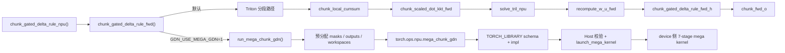

# sgl-kernel-npu 04：FLA Chunk Gated Delta Rule 的双路径入口

本章的 Python tensor、dispatcher op 和 device kernel 位于不同类型层。阅读前可先看[代码阅读手册](../reference/code-reading-and-types.md)，尤其注意 shape/dtype 是 `torch.Tensor` 元数据，`cu_seqlens` 的元素值才编码 packed 样本边界。

源码基线：[`sgl-kernel-npu@b2378ee`](https://github.com/sgl-project/sgl-kernel-npu/tree/b2378ee05769cf7df209ffc5e1b669728f435a7e)。如果你还没读过 [`01-repository-and-op-lifecycle.md`](./01-repository-and-op-lifecycle.md)、[`02-triton-fused-split-qk-norm.md`](./02-triton-fused-split-qk-norm.md)、[`03-ascend-c-apply-token-bitmask.md`](./03-ascend-c-apply-token-bitmask.md) 和 [`../triton-ascend/05-persistent-kernel-and-large-grid.md`](../triton-ascend/05-persistent-kernel-and-large-grid.md)，先回去补上，再来看这一章会轻松很多。

这一章不再精读“一个孤立 kernel”，而是精读一个真实生产入口：[`chunk_gated_delta_rule_npu()`](https://github.com/sgl-project/sgl-kernel-npu/blob/b2378ee05769cf7df209ffc5e1b669728f435a7e/python/sgl_kernel_npu/sgl_kernel_npu/fla/chunk.py#L264)。它把同一套 FLA 语义分流到两条后端路径：

- 一条是“拆开的” Triton 路径：多个小 kernel 逐段完成；
- 另一条是“合上的” mega custom op 路径：一个 `torch.ops.npu.mega_chunk_gdn` 把多段工作揉进一次 launch。

这正好填上当前课程的缺口：你已经见过“纯 Triton 单 kernel”和“纯 Ascend C custom op”，现在要学的是“一个真实 Python API 如何在工程上管理多种 NPU 实现路线”。

## 1. 学习目标

- 看懂同一个生产 API 为什么要同时维护“分段 Triton 路径”和“mega custom op 路径”。
- 读懂 `packed B=1`、`cu_seqlens`、`initial_state/final_state` 这些真实 serving 契约。
- 学会从 Python 入口一路追到 `torch.ops` schema、Host 校验、`blockDim`、workspace 和 device 侧 stage。
- 建立以后阅读 FLA、Mamba、MoE 复杂算子时的固定读法。

## 2. 前置知识

- Triton 的 `program/grid/tile` 与逻辑工作单元：见 [`../triton-ascend/01-program-grid-tile.md`](../triton-ascend/01-program-grid-tile.md)。
- 大 grid、固定物理核数与“少量核反复吃工单”的思路：见 [`../triton-ascend/05-persistent-kernel-and-large-grid.md`](../triton-ascend/05-persistent-kernel-and-large-grid.md)。
- Host/Device、`torch.ops` 注册、shape/dtype 契约：见 [`../torch_npu/01-dispatch-aclnn-and-custom-op-boundaries.md`](../torch_npu/01-dispatch-aclnn-and-custom-op-boundaries.md) 和 [`03-ascend-c-apply-token-bitmask.md`](./03-ascend-c-apply-token-bitmask.md)。

## 3. 先把六个新词就地讲清

### 3.1 FLA

FLA 是 Flash Linear Attention 的缩写。直觉上，它想解决的问题是：标准 attention 很容易形成一个巨大的 `T x T` 分数矩阵，序列一长，显存和带宽压力就会爆炸；FLA 系列方法会把这件事改写成“分块 + 状态递推”的形式，让 kernel 更像在处理一串小块和一个可传递状态，而不是一次吞下整张大表。

它和“普通 attention”不是只有实现不同，数学组织方式也不同，所以不能把 CUDA FlashAttention 的经验原样照搬。后文里第一次出现 FLA 时仍会在上下文解释，术语表入口见 [`reference/glossary.md`](../reference/glossary.md)。

### 3.2 Gated Delta Rule

Gated Delta Rule 可以先把它想成“带遗忘门的线性注意力更新规则”。这里的 `g` 像一个“旧信息衰减速度”，`beta` 像一个“当前 token 允许写入多少新信息”的门。为什么需要它？因为 FLA 不再把全部历史显式摆成大矩阵，而是要把历史压进可递推的状态里；门控项决定旧状态保留多少、新贡献写入多少。

它和普通 RMSNorm、RoPE 这类局部张量变换不同：前者主要改单个 token 的表示，Gated Delta Rule 会显式影响跨 token 的状态演化。

### 3.3 Recurrent State

`initial_state` / `final_state` 不是 RNN 教科书里的抽象名词，在这里它就是“跨 chunk 传递的历史摘要”。如果你把 chunk 想成一列列小车厢，那么 recurrent state 就是每节车厢交给下一节的交接簿。没有它，chunk 之间会断开；有了它，长序列就能分块处理而不丢历史。

它和“KV cache”也不同。KV cache 通常保存显式 key/value 历史；这里的 state 更像经过特定数学规则压缩后的中间结果。

### 3.4 `packed B=1`

`packed B=1` 的直觉是：别把不同样本硬摆成真正的批次维，而是把所有 token 先摊平成一条长带，只保留一个假的 `B=1` 外壳，再用额外索引告诉系统“哪些 token 属于哪条样本”。这样做的价值是：后端 kernel 只需要面对一条连续 token 轴，切块和调度更简单。

它和“普通 `[B, T, ...]` batch”不同。普通 batch 的样本边界写在张量形状里；`packed B=1` 需要靠额外的 `cu_seqlens` 恢复边界。

### 3.5 `cu_seqlens`

`cu_seqlens` 是 cumulative sequence lengths，累计序列长度数组。例如 `[0, 22, 1333]` 表示有两条样本，第一条是 token `0:22`，第二条是 token `22:1333`。为什么它重要？因为 kernel 在 `packed B=1` 布局下已经看不见原始 batch 维了，必须靠这个数组知道每条样本从哪里开始、在哪里结束。

它和“每条样本单独传一个长度”不同。累计前缀和更适合在 device 侧快速定位分段边界，也是 FlashAttention 风格变长接口的常见约定。术语表入口见 [`reference/glossary.md`](../reference/glossary.md)。

### 3.6 Mega Kernel

mega kernel 可以先理解成“把多道原本拆开的工序，尽量装进一次 launch 里”。为什么值得做？因为每拆成一个小 kernel，就要多一次 launch、多一次中间结果落 GM、多一次边界同步。把多阶段揉成一次 launch，可能减少这些开销。

它和 persistent kernel 也不同。persistent 强调“少量物理核反复处理很多逻辑块”；mega kernel 强调“把多段算法揉进一个更大的 device 程序”。两者经常一起出现，但不等价。

## 4. 为什么这一章是当前最高优先级

前两篇 `sgl-kernel-npu` 源码章分别让你见过：

- 纯 Triton Python kernel；
- 纯 Ascend C custom op。

但真实生产里，更常见的是“同一个 Python API 背后维护多条实现路线”，例如：

- 默认走一串较易维护、较易 debug 的分段 kernel；
- 在满足严格 shape 契约时，切到更激进的 mega kernel；
- 用测试把两条路径钉到同一个数学语义上。

如果这一层不补上，后面直接看 DeepEP、MoE 或复杂 attention 源码，很容易只看到一堆文件名，而看不懂“为什么这里要分层、为什么这里要分路”。

## 5. 直观类比：先拆流水线，再决定要不要上总装机

把这件事想成工厂：

- 分段 Triton 路径像六七个工位串成的流水线。每个工位职责单一，容易单独检查。
- mega custom op 路径像一台总装机。原材料送进去，中间尽量不落地，最后直接吐出结果。

两条路线的目标一样，都是算出同一个 `o` 和 `final_state`；差别在于：

- 分段路线更透明，适合先做正确性和局部性能分析；
- mega 路线更激进，更依赖严格 shape、dtype、workspace 契约。

## 6. 先看 API 契约，再看实现

[`chunk_gated_delta_rule_npu()`](https://github.com/sgl-project/sgl-kernel-npu/blob/b2378ee05769cf7df209ffc5e1b669728f435a7e/python/sgl_kernel_npu/sgl_kernel_npu/fla/chunk.py#L264-L309) 的文档字符串已经把最关键的输入输出说清了：

```text
q, k : [B, T, H_g, K] 或 packed 后 [1, total_tokens, H_g, K]
v    : [B, T, H, V]   或 packed 后 [1, total_tokens, H, V]
g    : [B, T, H]
beta : [B, T, H]
state: [N, H, K, V]
```

这里最容易卡住初学者的是 `H_g` 和 `H` 不一定相等。源码明确允许 “`NumValueHeads` 是 `NumKeyHeads` 的整数倍”，也就是常见的 grouped-query 风格头配比；mega 路径的 Host 校验把它进一步收紧成一组固定支持组合，见 [`mega_chunk_gdn.cpp#L18-L23`](https://github.com/sgl-project/sgl-kernel-npu/blob/b2378ee05769cf7df209ffc5e1b669728f435a7e/csrc/mega_chunk_gdn/op_host/mega_chunk_gdn.cpp#L18-L23)。

## 7. 一张图看同一个入口的两条后端路径



这张图最重要的结论是：这里不是“一个 kernel 的源码导读”，而是“一个 API 的后端分流导读”。

## 8. 默认路径：先走分段 Triton，再把数学语义钉稳

[`chunk_gated_delta_rule_fwd()`](https://github.com/sgl-project/sgl-kernel-npu/blob/b2378ee05769cf7df209ffc5e1b669728f435a7e/python/sgl_kernel_npu/sgl_kernel_npu/fla/chunk.py#L205-L259) 的主干非常值得反复读：

1. [`chunk_local_cumsum`](https://github.com/sgl-project/sgl-kernel-npu/blob/b2378ee05769cf7df209ffc5e1b669728f435a7e/python/sgl_kernel_npu/sgl_kernel_npu/fla/chunk.py#L224) 先把门控 `g` 变成按 chunk 可用的累计量。
2. [`chunk_scaled_dot_kkt_fwd`](https://github.com/sgl-project/sgl-kernel-npu/blob/b2378ee05769cf7df209ffc5e1b669728f435a7e/python/sgl_kernel_npu/sgl_kernel_npu/fla/chunk.py#L226-L228) 构造 chunk 内部需要的局部矩阵 `A`。
3. [`solve_tril`](https://github.com/sgl-project/sgl-kernel-npu/blob/b2378ee05769cf7df209ffc5e1b669728f435a7e/python/sgl_kernel_npu/sgl_kernel_npu/fla/chunk.py#L229) 处理下三角系统。
4. [`recompute_w_u_fwd`](https://github.com/sgl-project/sgl-kernel-npu/blob/b2378ee05769cf7df209ffc5e1b669728f435a7e/python/sgl_kernel_npu/sgl_kernel_npu/fla/chunk.py#L230-L237) 生成 WY 表示；源码注释直接提醒你：`u` 实际上就是新的 `v`。
5. [`chunk_gated_delta_rule_fwd_h`](https://github.com/sgl-project/sgl-kernel-npu/blob/b2378ee05769cf7df209ffc5e1b669728f435a7e/python/sgl_kernel_npu/sgl_kernel_npu/fla/chunk.py#L238-L246) 传播 chunk 间状态 `h`，同时产出 `v_new` 和 `final_state`。
6. [`chunk_fwd_o`](https://github.com/sgl-project/sgl-kernel-npu/blob/b2378ee05769cf7df209ffc5e1b669728f435a7e/python/sgl_kernel_npu/sgl_kernel_npu/fla/chunk.py#L247-L255) 才把 `q/k/v_new/h/g` 收束成最终输出 `o`。

这条路径的教学价值非常高，因为它把一个复杂算法拆成了多个命名明确的阶段。你以后遇到任何复杂算子，先看能否把它还原成“若干中间张量 + 若干阶段”的图，而不是一开始就钻进最底层 device 指令。

## 9. mega 路径：为什么它像一台总装机

如果 [`_use_mega_gdn()`](https://github.com/sgl-project/sgl-kernel-npu/blob/b2378ee05769cf7df209ffc5e1b669728f435a7e/python/sgl_kernel_npu/sgl_kernel_npu/fla/chunk.py#L26-L27) 返回真，入口会直接切到 [`run_mega_chunk_gdn()`](https://github.com/sgl-project/sgl-kernel-npu/blob/b2378ee05769cf7df209ffc5e1b669728f435a7e/python/sgl_kernel_npu/sgl_kernel_npu/fla/mega_chunk_gdn.py#L56-L191)。

这个 wrapper 的关键动作不是“算数学”，而是“准备一次大 launch 需要的全部物料”：

- 把 `cu_seqlens` 统一成 `int32`，并据此算出 `num_sequences`、`num_chunks`、`num_matrices`；
- 缓存下三角 mask 与 `-I`，避免每次重新造；
- 预分配 `g_sum`、`A`、`A_inv`、`w`、`u`、`h`、`v_new`、`final_state` 这些中间输出；
- 按 `block_dim` 预分配 `kkt_workspace`、`wy_workspace_*`、`h_workspace`、`o_workspace_*` 等 scratch buffer。

最值得对照的是这几行：

- [`num_chunks = _total_chunks(cu32)`](https://github.com/sgl-project/sgl-kernel-npu/blob/b2378ee05769cf7df209ffc5e1b669728f435a7e/python/sgl_kernel_npu/sgl_kernel_npu/fla/mega_chunk_gdn.py#L89-L91)
- [`block_dim = _block_dim(q.device)`](https://github.com/sgl-project/sgl-kernel-npu/blob/b2378ee05769cf7df209ffc5e1b669728f435a7e/python/sgl_kernel_npu/sgl_kernel_npu/fla/mega_chunk_gdn.py#L135)
- [`torch.ops.npu.mega_chunk_gdn(...)`](https://github.com/sgl-project/sgl-kernel-npu/blob/b2378ee05769cf7df209ffc5e1b669728f435a7e/python/sgl_kernel_npu/sgl_kernel_npu/fla/mega_chunk_gdn.py#L155-L189)

它们对应的直觉是：

- 逻辑工作量由 `num_chunks * num_value_heads` 决定；
- 物理并行度先按设备 `cube_core_num` 估一个 `block_dim`；
- 所有中间物料一次性交给 custom op，尽量减少 Host 反复介入。

这和前一章讲的大 grid / persistent 心智是连得上的：逻辑块很多，不代表一定启动同样多的物理核；先定 `block_dim`，再让 kernel 在内部覆盖更多逻辑工作，是 Ascend 上很常见的组织方式。

## 10. `torch.ops.npu.mega_chunk_gdn` 的 schema、注册与 Host 边界

### 10.1 Schema 与实现绑定

[`csrc/pytorch_extensions.cpp`](https://github.com/sgl-project/sgl-kernel-npu/blob/b2378ee05769cf7df209ffc5e1b669728f435a7e/csrc/pytorch_extensions.cpp#L111-L203) 里能看到：

- [`m.def("mega_chunk_gdn(...)" )`](https://github.com/sgl-project/sgl-kernel-npu/blob/b2378ee05769cf7df209ffc5e1b669728f435a7e/csrc/pytorch_extensions.cpp#L111)
- [`m.impl("mega_chunk_gdn", TORCH_FN(...))`](https://github.com/sgl-project/sgl-kernel-npu/blob/b2378ee05769cf7df209ffc5e1b669728f435a7e/csrc/pytorch_extensions.cpp#L191)

这说明 Python 里那一长串 tensor 参数不是随便传的，而是明确走 `torch.ops.npu` 自定义算子注册路径。

### 10.2 Host 为什么先把门槛收得很紧

[`mega_chunk_gdn.cpp`](https://github.com/sgl-project/sgl-kernel-npu/blob/b2378ee05769cf7df209ffc5e1b669728f435a7e/csrc/mega_chunk_gdn/op_host/mega_chunk_gdn.cpp#L25-L101) 的 `check_shape()` 做了非常硬的契约限制：

- `q/k/v` 必须是 4 维，`g/beta` 必须是 3 维；
- 当前只支持 `packed B=1`；
- `q` 与 `k` shape 必须完全一致；
- `q/k` 与 `v` 的序列长度必须一致；
- 头配比必须落在支持集合里；
- `head_dim` 固定为 `128`；
- `q/k/v/beta` 必须是 `float16`，`g` 必须是 `float32`，`cu_seqlens` 必须是 `int32`；
- 所有关键 tensor 必须 contiguous。

初学者很容易把这种限制误读成“实现偷懒”。更准确的理解是：mega kernel 是为一小块高价值形状空间做激进优化，所以它先把输入世界压缩成一个更可控的子集。越是 aggressive 的 kernel，前门越窄。

### 10.3 Host 真正负责什么

Host 入口 [`mega_chunk_gdn()`](https://github.com/sgl-project/sgl-kernel-npu/blob/b2378ee05769cf7df209ffc5e1b669728f435a7e/csrc/mega_chunk_gdn/op_host/mega_chunk_gdn.cpp#L71-L101) 还做了三件关键事：

- 把 Python 侧 `int64/bool` 风格参数压到 device launch 需要的 `uint32/int64` 形式；
- 检查 `block_dim`、`num_matrices` 是否落在 `uint32` 可表示范围；
- 用 `EXEC_KERNEL_CMD(launch_mega_kernel, ...)` 真正发起 launch。

也就是说，Host 不是“只有绑定层胶水”，而是“动态世界与静态 device 代码之间的协议层”。

## 11. device 侧到底揉进了哪些阶段

[`mega_kernel.cpp`](https://github.com/sgl-project/sgl-kernel-npu/blob/b2378ee05769cf7df209ffc5e1b669728f435a7e/csrc/mega_chunk_gdn/op_kernel/mega_kernel.cpp#L1-L13) 文件开头直接列了 7 个 stage：

1. `cumsum`
2. `transpose`
3. `kkt`
4. `solve_tril`
5. `wy_fast`
6. `chunk_h`
7. `chunk_o`

这和前面 Python 分段路径的阶段名是一一对应的。也就是说，mega 路径不是另一套数学，而是把“原本拆开的多段工作”塞进了一个更大的 device 程序。

文件里还能看到跨核同步辅助函数 [`SyncAllImpl()`](https://github.com/sgl-project/sgl-kernel-npu/blob/b2378ee05769cf7df209ffc5e1b669728f435a7e/csrc/mega_chunk_gdn/op_kernel/mega_kernel.cpp#L56-L74)。这提醒你一个重要事实：一旦把很多阶段揉进同一次 launch，device 内部同步复杂度也会上去。减少 Host launch 数，不代表同步免费消失，只是同步位置从 Host 边界挪进了 device 内部。

## 12. `triangular_inverse` 在这里处于什么位置

模块里还有一个很容易让人误读的点：[`fast_inv_tril()`](https://github.com/sgl-project/sgl-kernel-npu/blob/b2378ee05769cf7df209ffc5e1b669728f435a7e/python/sgl_kernel_npu/sgl_kernel_npu/fla/chunk.py#L30-L35) 会调用 `torch.ops.npu.triangular_inverse(...)`，而这个 custom op 注册到：

- [`m.def("triangular_inverse(Tensor x) -> Tensor")`](https://github.com/sgl-project/sgl-kernel-npu/blob/b2378ee05769cf7df209ffc5e1b669728f435a7e/csrc/pytorch_extensions.cpp#L138)
- [`m.impl("triangular_inverse", TORCH_FN(...))`](https://github.com/sgl-project/sgl-kernel-npu/blob/b2378ee05769cf7df209ffc5e1b669728f435a7e/csrc/pytorch_extensions.cpp#L203)

Host 实现在 [`tri_inv.cpp`](https://github.com/sgl-project/sgl-kernel-npu/blob/b2378ee05769cf7df209ffc5e1b669728f435a7e/csrc/tri_inv/op_host/tri_inv.cpp#L39-L67)。它会：

- 检查输入至少 2 维且最后两维是方阵；
- 用 `num_elems / (matrix_size * matrix_size)` 算 `block_dim`；
- 序列化一份很小的 tiling 数据；
- 按 `fp16/fp32` 分别 launch 对应 kernel。

但要注意：在当前 `chunk_gated_delta_rule_fwd()` 默认优化路径里，真正被调用的是 `solve_tril_npu`，不是 `fast_inv_tril()`。也就是说，`triangular_inverse` 更像这个 FLA 目录里的一个“可复用 custom op 积木”，而不是这条默认前向路径的必经环节。读源码时一定要分清“同目录出现过”与“这条调用链当前真的走到”。

## 13. 最小例子：先用 packed 变长输入建立直觉

下面使用真实 API 语法，并显式构造了所有输入。它要求匹配的 NPU/CANN/`sgl_kernel_npu` 环境；当前工作区只做静态解读：

```python
import torch
import torch.nn.functional as F
from sgl_kernel_npu.fla.chunk import chunk_gated_delta_rule_npu

total_tokens = 1333
num_value_heads = 16
num_key_heads = 4
head_dim = 128

q = F.normalize(torch.randn(1, total_tokens, num_key_heads, head_dim, device="npu"), p=2, dim=-1).half()
k = F.normalize(torch.randn(1, total_tokens, num_key_heads, head_dim, device="npu"), p=2, dim=-1).half()
v = torch.randn(1, total_tokens, num_value_heads, head_dim, device="npu", dtype=torch.float16)
g = F.logsigmoid(torch.randn(1, total_tokens, num_value_heads, device="npu", dtype=torch.float32))
beta = torch.rand(1, total_tokens, num_value_heads, device="npu", dtype=torch.float16)
cu_seqlens = torch.tensor([0, 22, 1333], device="npu", dtype=torch.long)
initial_state = torch.zeros(2, num_value_heads, head_dim, head_dim, device="npu", dtype=torch.float16)

o, final_state, h = chunk_gated_delta_rule_npu(
    q, k, v, g, beta,
    initial_state=initial_state,
    output_final_state=True,
    cu_seqlens=cu_seqlens,
)
```

读这段时最该盯住三件事：

- 虽然逻辑上有两条样本，但张量外层仍是 `B=1`；
- `cu_seqlens=[0, 22, 1333]` 才是恢复样本边界的关键；
- `initial_state.shape[0]` 必须等于样本数 `len(cu_seqlens) - 1`。

逐类型看：`total_tokens/num_*_heads/head_dim` 是 Python `int`；`q/k/v/beta/initial_state` 是 NPU `torch.Tensor` 且元素 dtype 为 FP16；`g` 是 FP32 tensor；`cu_seqlens` 是 `torch.int64` tensor，shape 为 `[3]`，其两个相邻差值给出每条序列长度；`o/final_state/h` 仍是 Python `torch.Tensor` 返回对象。这里没有 Triton `tl.tensor`：只有继续进入 `chunk_gated_delta_rule_npu` 选择到 Triton 路径后，wrapper 才把这些高层 tensor 转换为 kernel pointer 实参。

## 14. 测试如何把两条路径钉到同一语义

[`test_chunk_gdn_pto.py`](https://github.com/sgl-project/sgl-kernel-npu/blob/b2378ee05769cf7df209ffc5e1b669728f435a7e/tests/python/sgl_kernel_npu/test_chunk_gdn_pto.py#L42-L195) 很值得读，因为它不是直接拿另一个 NPU kernel 做 reference，而是：

- 先写 `_native_reference()`，逐条样本按 `cu_seqlens` 切开；
- 对每段调用更容易审查的 `chunk_gated_delta_rule_native()`；
- 再把结果拼回 packed 输出；
- 用 `_assert_close()` 比较 mega custom op 的结果。

这和上一章讲的思路一致：reference 不需要最快，但必须简单、独立、容易解释。

`triangular_inverse` 也有自己的独立测试，见 [`test_triangular_inverse.py`](https://github.com/sgl-project/sgl-kernel-npu/blob/b2378ee05769cf7df209ffc5e1b669728f435a7e/tests/python/sgl_kernel_npu/test_triangular_inverse.py#L69-L120)。

## 15. 调试与性能方法

### 15.1 先区分你在看哪条路径

最常见的误判，是把 Triton 路径的问题和 mega 路径的问题混在一起。排查前先回答：

- 当前是不是设置了 `GDN_USE_MEGA_GDN=1`？
- 输入是不是走了 `packed B=1 + cu_seqlens`？
- 当前失败点是在 Python wrapper、`torch.ops` 注册、Host `TORCH_CHECK`，还是 device 执行？

### 15.2 先看 shape 契约，再谈 kernel 细节

mega 路径的 Host 已经把 shape/dtype/layout 说得很死。只要你不先把这些核对完，就没资格把锅甩给 device kernel。尤其要先查：

- `head_dim` 是否真的是 128；
- `g` 是否还是 `float32`；
- `cu_seqlens` 是否已转成 `int32`；
- `initial_state.shape[0]` 是否与序列数一致；
- `q/k/v/g/beta` 是否 contiguous。

### 15.3 看 `block_dim` 与 `num_chunks` 是否匹配你的直觉

`block_dim` 来自设备 `cube_core_num`，而逻辑工作量来自 `num_chunks * num_value_heads`。如果 `num_chunks` 很小，mega kernel 未必能把所有核喂饱；如果 `num_chunks` 很大，分段 Triton 与 mega 路径谁更占优，就更需要 profiler，而不是只靠猜。

### 15.4 不要把“少 launch”误解成“零中间成本”

mega 路径虽然把很多 stage 塞进一次 launch，但 wrapper 仍显式分配了大量中间 tensor 与 workspace。性能分析时要同时关注：

- launch 数是否下降；
- GM 中间结果是否减少；
- 额外 workspace 是否带来更大显存/带宽压力；
- device 内部跨核同步是否变重。

## 16. 常见错误

- 把 `packed B=1` 误解成“真的只有一条样本”。它只是布局策略，不是业务语义。
- 看到 `fast_inv_tril()` 就以为默认前向路径一定调用了 `triangular_inverse`。当前源码不是这样。
- 只看 Python 文件，就断言 mega 路径“一定更快”。快慢取决于序列长度、头数、状态输出需求和真实硬件。
- 忽略 `g` 的 `float32` 要求。门控累计值是数值稳定性的敏感点，不能为了省事盲改成半精度。
- 以为 Host 校验越多越“低效”。对 aggressive kernel 来说，先缩小输入空间通常是必要条件。

## 17. 练习

1. 只看 [`chunk.py`](https://github.com/sgl-project/sgl-kernel-npu/blob/b2378ee05769cf7df209ffc5e1b669728f435a7e/python/sgl_kernel_npu/sgl_kernel_npu/fla/chunk.py)，画出默认 Triton 路径的中间张量图。
2. 根据 [`mega_chunk_gdn.cpp`](https://github.com/sgl-project/sgl-kernel-npu/blob/b2378ee05769cf7df209ffc5e1b669728f435a7e/csrc/mega_chunk_gdn/op_host/mega_chunk_gdn.cpp#L32-L66)，列出 5 个会在 Host 侧直接失败的非法输入例子。
3. 对照 [`mega_kernel.cpp`](https://github.com/sgl-project/sgl-kernel-npu/blob/b2378ee05769cf7df209ffc5e1b669728f435a7e/csrc/mega_chunk_gdn/op_kernel/mega_kernel.cpp#L1-L13)，把 7 个 device stage 映射回 Python 分段路径的函数名。

## 18. 自测问题

- 为什么这类变长输入要写成 `packed B=1 + cu_seqlens`，而不是老老实实保留真实 batch 维？
- `initial_state` 和 `KV cache` 有什么本质区别？
- mega 路径里的 `block_dim` 为什么更像“固定物理核数”，而不是“总逻辑块数”？
- 为什么说 Host 代码在这里是协议层，而不只是 binding？
- `triangular_inverse` 在本目录里扮演什么角色，为什么不能把它误判成默认前向主路径？

## 19. 下一步学什么

这一章补的是“一个生产入口如何管理多条 NPU 后端路径”。顺着这条线，下一步最自然的是进入更重的通信与分布式路径，例如 DeepEP / MoE / HCCL：届时你需要把今天学到的“入口分流、shape 契约、workspace、Host/Device 边界”完整带过去。

## 官方源码与文档

- [FLA chunk 入口 `chunk.py`](https://github.com/sgl-project/sgl-kernel-npu/blob/b2378ee05769cf7df209ffc5e1b669728f435a7e/python/sgl_kernel_npu/sgl_kernel_npu/fla/chunk.py)
- [mega wrapper `mega_chunk_gdn.py`](https://github.com/sgl-project/sgl-kernel-npu/blob/b2378ee05769cf7df209ffc5e1b669728f435a7e/python/sgl_kernel_npu/sgl_kernel_npu/fla/mega_chunk_gdn.py)
- [custom op 注册 `pytorch_extensions.cpp`](https://github.com/sgl-project/sgl-kernel-npu/blob/b2378ee05769cf7df209ffc5e1b669728f435a7e/csrc/pytorch_extensions.cpp)
- [mega 路径 Host 入口 `mega_chunk_gdn.cpp`](https://github.com/sgl-project/sgl-kernel-npu/blob/b2378ee05769cf7df209ffc5e1b669728f435a7e/csrc/mega_chunk_gdn/op_host/mega_chunk_gdn.cpp)
- [mega device kernel `mega_kernel.cpp`](https://github.com/sgl-project/sgl-kernel-npu/blob/b2378ee05769cf7df209ffc5e1b669728f435a7e/csrc/mega_chunk_gdn/op_kernel/mega_kernel.cpp)
- [triangular inverse Host 入口 `tri_inv.cpp`](https://github.com/sgl-project/sgl-kernel-npu/blob/b2378ee05769cf7df209ffc5e1b669728f435a7e/csrc/tri_inv/op_host/tri_inv.cpp)
- [mega 路径测试 `test_chunk_gdn_pto.py`](https://github.com/sgl-project/sgl-kernel-npu/blob/b2378ee05769cf7df209ffc5e1b669728f435a7e/tests/python/sgl_kernel_npu/test_chunk_gdn_pto.py)
- [triangular inverse 测试 `test_triangular_inverse.py`](https://github.com/sgl-project/sgl-kernel-npu/blob/b2378ee05769cf7df209ffc5e1b669728f435a7e/tests/python/sgl_kernel_npu/test_triangular_inverse.py)

## 本章验证边界

- 本轮验证了 Markdown 结构、相对链接、固定源码路径与 pinned commit 引用。
- 本工作区没有 Ascend NPU/CANN 运行环境，因此没有声称实际执行或 profiling `mega_chunk_gdn` / `triangular_inverse`。
- 关于真实性能优劣、跨核同步成本、workspace 峰值占用，只能基于官方源码做静态分析，不能替代真机测量。
