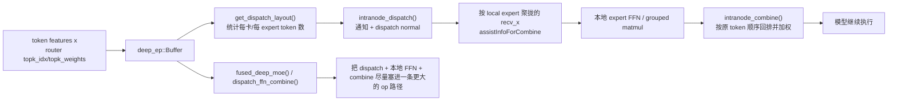

# sgl-kernel-npu 05：DeepEP、HCCL 与 MoE token 路径

源码基线：[`sgl-kernel-npu@d5630df`](https://github.com/sgl-project/sgl-kernel-npu/tree/d5630dff41c8108216f835597e63f6d3a7445908)。2026-07-05 重新 fetch 官方 `origin/main` 后，远端 `HEAD` 已前进到这个 commit；同时核对 `csrc/deepep/`、`tests/python/deepep/` 与仓库根 README，确认本章涉及的 DeepEP 路径相对上一轮 `b2378ee` 没有源码差异，因此可以在前文基础上继续往下讲。

如果你还没读过 [`01-repository-and-op-lifecycle.md`](./01-repository-and-op-lifecycle.md)、[`../02-cann-stack-and-boundaries.md`](../02-cann-stack-and-boundaries.md)、[`../foundations/03-memory-pipeline-and-sync.md`](../foundations/03-memory-pipeline-and-sync.md) 和 [`../torch_npu/01-dispatch-aclnn-and-custom-op-boundaries.md`](../torch_npu/01-dispatch-aclnn-and-custom-op-boundaries.md)，先补上再回来。因为这一章第一次把“单卡 kernel”推进到“多卡 token 分发 + HCCL 通信 + 再聚合”的真实生产路径。

前两章 `sgl-kernel-npu` 源码导读里，你已经见过：

- 单个 Triton kernel 如何从 Python 走到 device；
- 单个 Ascend C custom op 如何经过 Host 校验、launch 和 workspace。

但真正的 MoE serving 更常见的瓶颈不是“某个 token 上的向量加法”，而是“路由后的 token 要怎么跨卡送到正确 expert，再把输出按原顺序拼回来”。`sgl-kernel-npu` 里这条路由由 DeepEP-Ascend 负责。仓库根 README 明确把它定义成“Ascend implementation of DeepEP”，目标是给 MoE 的 Expert Parallelism 提供高性能通信 kernel。

## 1. 学习目标

- 看懂 `deep_ep::Buffer` 为什么是 DeepEP-Ascend 的主入口，而不是某一个孤立的 device kernel。
- 分清 `MoE`、`Expert Parallel (EP)`、`dispatch`、`combine`、`HCCL`、`DeepEP` 这些词各自解决什么问题。
- 学会顺着 `get_dispatch_layout -> intranode_dispatch -> 本地 expert 计算 -> intranode_combine` 这条链路读源码。
- 知道 `fused_deep_moe` / `dispatch_ffn_combine` 在整条路径里的位置，以及它们和 normal-mode dispatch/combine 的区别。
- 建立阅读分布式 NPU kernel 的固定套路：先看路由契约，再看通信域，再看 layout/assist tensor，再看 fused 与非 fused 分支。

## 2. 前置知识

- CANN 里 `HCCL` 是多卡集合通信库，不是某个单卡数学 kernel：见 [`../02-cann-stack-and-boundaries.md`](../02-cann-stack-and-boundaries.md)。
- `Host` 代码的职责不只是“胶水”，还包括 shape/dtype 检查、workspace 协议和 launch：见 [`../torch_npu/01-dispatch-aclnn-and-custom-op-boundaries.md`](../torch_npu/01-dispatch-aclnn-and-custom-op-boundaries.md)。
- `pipeline`、`event`、`stream`、`double buffer` 是片上流水；而这章的重点是“跨卡 token 如何流动”，两者不是一回事：见 [`../foundations/03-memory-pipeline-and-sync.md`](../foundations/03-memory-pipeline-and-sync.md)。

## 3. 先把七个新词就地讲清楚

### 3.1 MoE

`MoE` 是 `Mixture-of-Experts`。直觉上，它像“很多专科医生 + 一个分诊台”：不是每个 token 都喂给同一组 FFN，而是先由 router 挑出 top-k 个 expert，再把 token 送过去做各自的计算。

为什么需要它？因为它能在不让每个 token 都激活全部参数的前提下，把模型容量做大。

它和“普通 dense FFN”的区别是：dense FFN 的每个 token 走同一条计算图；MoE 的 token 会先分流，再回流。本章第一次出现 `MoE`，术语表入口见 [`../reference/glossary.md`](../reference/glossary.md)。

### 3.2 Expert Parallel（EP）

`Expert Parallel` 可以先理解成“把不同 expert 分布到不同卡上”。如果 16 个 expert 平均放到 8 张卡，每张卡只常驻其中 2 个 expert，那么 token 被 router 选中后，往往需要跨卡搬运，才能碰到真正负责它的 expert。

为什么需要它？因为单卡放不下或吞不下全部 expert，而且 MoE 的价值本来就来自“很多 expert 分散部署”。

它和 `Tensor Parallel` 的区别是：TP 主要切同一层张量的维度；EP 主要切 expert 的归属。两种并行经常同时存在，但不是一个概念。

### 3.3 Dispatch

`dispatch` 的直觉是“按路由单把 token 派送到正确 expert 所在的卡和本地缓冲区”。它不是单纯 `all_to_all` 的别名，因为它还要先统计每张卡收多少 token、生成索引、决定本卡 expert 的接收布局，并为后面的 combine 准备辅助信息。

为什么需要它？因为 router 给出的只是“这个 token 想去哪些 expert”；真正运行前，你还得把这些意图变成可通信、可计算、可回收的张量布局。

它和“本地 permute”不同。本地 permute 只是在一张卡内部改顺序；dispatch 往往包含跨卡发送。

### 3.4 Combine

`combine` 是 dispatch 的回程。expert 算完以后，输出还停在“按 expert 聚拢”的布局里，combine 负责把它们送回原 token 顺序，并按 top-k 权重做加权合并。

为什么需要它？因为上层模型需要的输出顺序仍然是“原来的 token 批次顺序”，而不是“expert 处理顺序”。

它和“简单 gather”也不同。combine 通常还要处理 top-k 权重、重复 token、跨卡返回和 restore shape。

### 3.5 All-to-all / AllToAllV

`all-to-all` 可以理解成“每张卡都同时给别的卡发货，也同时收货”。`AllToAllV` 里的 `V` 表示 variable，每个目的地接收的 token 数量可以不同。

为什么这里离不开它？因为不同 token 会被路由到不同 expert，不同卡的收发量天然不均匀。

它和 `AllReduce` 的区别很大。`AllReduce` 是大家对齐做同一规约；`AllToAllV` 是大家彼此交换不同长度的数据包。

### 3.6 HCCL

`HCCL` 是 Ascend 的多卡集合通信库，角色近似 CUDA 生态里的 NCCL。你可以把它理解成 DeepEP 真正借力的“联运系统”。

为什么不是直接手写 socket/RDMA？因为 DeepEP 想解决的是高层 MoE 路由和张量协议，不想每个 kernel 自己重新实现一套跨卡通信。

它和 `DeepEP` 的区别是：HCCL 更底层，负责跨卡通信能力；DeepEP 在 HCCL 之上增加了 token 路由、布局、量化、辅助张量和 fused MoE 路径。术语表入口见 [`../reference/glossary.md`](../reference/glossary.md)。

### 3.7 DeepEP

`DeepEP` 可以先把它想成“专门服务 MoE expert parallel 的通信中间层”。仓库根 README 说得很直接：它提供“optimized all-to-all communication kernels for Expert Parallelism in MoE models”。

为什么不是直接 `torch.distributed.all_to_all`？因为原始通信 primitive 不会帮你做：

- top-k 路由布局统计；
- token 本地重排/回排；
- expert 对齐和辅助索引；
- 与本地 expert FFN 融合。

所以 DeepEP 不是“又一个 HCCL 名字”，而是 `MoE 路由协议 + HCCL-backed op + fused expert 计算` 的组合层。

## 4. 为什么这一章是当前最高优先级

到上一章为止，课程已经讲清楚了：

- 单卡上一个 kernel 怎样表达；
- Host/Device 边界怎样建立；
- Triton 和 Ascend C 怎样各自实现局部计算。

但如果现在直接跳去读 `MoE`、`DeepEP` 或 `dispatch_ffn_combine`，初学者最容易卡死在一句话上：为什么这里一下子冒出了 `groupEp`、`epRankId`、`num_tokens_per_rank`、`assistInfoForCombine`、`recv_count` 这些张量？

因为从这里开始，问题已经不再只是“怎么算”，而是“先把 token 送到哪，再怎么算，再怎么送回来”。这正是 Ascend kernel 基础教程里还没被单独展开的一条主线缺口。

## 5. 直观类比：先分拣包裹，再送去不同仓库，再按原订单回仓

把一批 token 想成电商包裹：

- router 的 `topk_idx` 像包裹上的去向标签；
- expert 像不同城市的仓库；
- dispatch 像分拣中心根据标签统计每个仓库要收多少包裹，再安排发车；
- local expert compute 像包裹到了仓库后做实际处理；
- combine 像把处理好的包裹按原订单重新归并回来。

这个类比最关键的一点是：仓库处理速度当然重要，但如果分拣单、装车单、回程单都没整理好，你根本到不了“开始算”的阶段。DeepEP 解决的就是这层“分拣和联运”问题。

## 6. 一张图先看 normal 路径和 fused 路径



这张图最重要的结论是：`DeepEP` 的核心对象不是“一个数学公式”，而是“一整条 token 路由和回流管线”。

## 7. 先看入口：`Buffer` 为什么是整条路径的调度台

pybind 暴露点在 [`csrc/deepep/pybind_extension.cpp`](https://github.com/sgl-project/sgl-kernel-npu/blob/d5630dff41c8108216f835597e63f6d3a7445908/csrc/deepep/pybind_extension.cpp#L17-L47)。这里直接把 `deep_ep::Buffer` 暴露给 Python，方法包括：

- `get_dispatch_layout`
- `intranode_dispatch`
- `intranode_combine`
- `internode_dispatch`
- `internode_combine`
- `low_latency_dispatch`
- `low_latency_combine`
- `fused_deep_moe`
- `dispatch_ffn_combine`

也就是说，DeepEP-Ascend 的公共接口不是“一堆独立函数”，而是“围绕同一个通信缓冲与并行配置对象展开”。对应定义在 [`csrc/deepep/deep_ep.hpp`](https://github.com/sgl-project/sgl-kernel-npu/blob/d5630dff41c8108216f835597e63f6d3a7445908/csrc/deepep/deep_ep.hpp#L14-L142)。

### 7.1 `Buffer` 构造时就决定了哪些底层事实

[`deep_ep.cpp#L27-L88`](https://github.com/sgl-project/sgl-kernel-npu/blob/d5630dff41c8108216f835597e63f6d3a7445908/csrc/deepep/deep_ep.cpp#L27-L88) 的构造函数做了几件非常关键的事：

1. 如果没传 `moe_all_to_all_group_name`，就自己初始化 `HcclComm`。
2. 读取 `DEEPEP_NORMAL_LONG_SEQ_ROUND` 和 `DEEPEP_NORMAL_LONG_SEQ_PER_ROUND_TOKENS`，决定长序列 normal path 的“分几轮、每轮最多多少 token”。
3. 根据 `SocVersion` 判断是不是 `ASCEND910B`，再推导 `rdma_rank`、`nvl_rank`、`num_rdma_ranks`、`num_nvl_ranks`。

这三件事分别对应三层含义：

- 通信域是谁；
- 长序列调度怎么切轮次；
- 这台机器的硬件互联拓扑大致怎么分层。

所以 `Buffer` 不是“空壳句柄”，而是后面所有 dispatch/combine op 的运行上下文。

## 8. 第一步不是通信，而是 layout：`get_dispatch_layout()`

很多初学者看到 “dispatch” 两个字，就以为一上来已经开始跨卡发 token。源码不是这样。

[`Buffer::get_dispatch_layout()`](https://github.com/sgl-project/sgl-kernel-npu/blob/d5630dff41c8108216f835597e63f6d3a7445908/csrc/deepep/deep_ep.cpp#L97-L165) 做的第一件事，是把 router 给出的 `topk_idx` 变成后续通信能消费的布局信息。

### 8.1 先看输入契约

源码最先检查：

- `topk_idx` 必须是 2 维；
- `topk_idx` 必须 contiguous；
- `num_experts > 0`；
- token 数不能超过 `round * per_round_tokens`。

这里的直觉很重要：router 给你的不是“已经整理好的车次表”，只是“每个 token 想去哪些 expert”的路由意图。layout 阶段的职责，是把它整理成后续 dispatch 要吃的统计表。

### 8.2 layout 阶段真正产出了什么

从 [`deep_ep.cpp#L112-L140`](https://github.com/sgl-project/sgl-kernel-npu/blob/d5630dff41c8108216f835597e63f6d3a7445908/csrc/deepep/deep_ep.cpp#L112-L140) 可以看到它会分配：

- `num_tokens_per_expert`
- `num_tokens_per_rank`
- `is_token_in_rank`
- `send_token_idx_small`
- `notify_send_data`

最容易被忽视的是 `notify_send_data`。源码注释把它拆成多段，里面保存了“每个 expert 收多少 token、每个 server 收多少 token、每个 token 发往哪些 server、每个 token 送往哪些 expert”等信息。这说明 layout 不是轻量元数据，而是后面 dispatch 的正式配方。

### 8.3 layout 对应哪个实际 op

最后它调用的是：

- [`EXEC_NPU_CMD(aclnnDispatchLayout, ...)`](https://github.com/sgl-project/sgl-kernel-npu/blob/d5630dff41c8108216f835597e63f6d3a7445908/csrc/deepep/deep_ep.cpp#L139-L142)

对应的 ACLNN host API 在：

- [`ops/op_host/op_api/aclnn_dispatch_layout.h`](https://github.com/sgl-project/sgl-kernel-npu/blob/d5630dff41c8108216f835597e63f6d3a7445908/csrc/deepep/ops/op_host/op_api/aclnn_dispatch_layout.h#L10-L41)
- [`ops2/op_host/op_api/aclnn_dispatch_layout.cpp`](https://github.com/sgl-project/sgl-kernel-npu/blob/d5630dff41c8108216f835597e63f6d3a7445908/csrc/deepep/ops2/op_host/op_api/aclnn_dispatch_layout.cpp#L17-L35)

尤其值得注意的是后者会调用 `NnopbaseSetHcclServerType(executor, ...MTE)`。第一次出现这个名字时，可以把它理解成“给 ACLNN executor 打一个 HCCL 服务类型标签”。源码能确认它在不同 op 上会被设成 `MTE` 或 `AICPU`；但如果没有更底层官方文档，就不要擅自把它解读成完整的硬件调度真相。

## 9. 第二步才是把 token 真正送出去：`intranode_dispatch()`

本章先看 normal-mode 的同机内路径：[`Buffer::intranode_dispatch()`](https://github.com/sgl-project/sgl-kernel-npu/blob/d5630dff41c8108216f835597e63f6d3a7445908/csrc/deepep/deep_ep.cpp#L170-L504)。

### 9.1 这一步先做大量 Host 契约检查

它会检查：

- `x` 必须是 2 维 contiguous；
- `num_tokens_per_rank`、`num_tokens_per_expert` 必须存在且是 `int`；
- `topk_idx` / `topk_weights` 必须 2 维且 contiguous；
- `topk_weights` 必须是 `float32`；
- 如果做量化，`x_scales` 的维度、dtype、stride 都要匹配。

这些检查的意义不是“Host 太啰嗦”，而是 DeepEP 这条路的 bug 往往首先出在路由统计、dtype 和索引协议上，而不是最后那个 device kernel。

### 9.2 两个阶段：先通知，再真正 dispatch

`intranode_dispatch()` 里最值得盯住的是两次 `EXEC_NPU_CMD`：

1. [`aclnnNotifyDispatch`](https://github.com/sgl-project/sgl-kernel-npu/blob/d5630dff41c8108216f835597e63f6d3a7445908/csrc/deepep/deep_ep.cpp#L287-L293)
2. [`aclnnCamMoeDispatchNormal`](https://github.com/sgl-project/sgl-kernel-npu/blob/d5630dff41c8108216f835597e63f6d3a7445908/csrc/deepep/deep_ep.cpp#L333-L338)

直觉上可以这样理解：

- `notify` 阶段更像“先广播这轮装车计划，统计每张卡最终会收多少 token”；
- `dispatch normal` 阶段才是“按照计划把 token 真正整理并发送到本卡 local expert 对应的接收区”。

这正好解释了为什么源码里既有 `send_data` / `recv_data` / `recv_count` / `recv_offset`，又有后面真正的 `expandx_out` 和 `expand_idx_out`。前者更偏“运单与统计”，后者更偏“实际搬运后的计算输入”。

### 9.3 这一步输出给后续 expert 计算的是什么

normal dispatch 的关键输出包括：

- `expandx_out`：已经按 expert 接收顺序展开后的 token features；
- `dynamic_scales_out`：如果启用了量化，对应的动态 scale；
- `expand_idx_out`：后面 combine 要用到的辅助索引；
- `recv_topk_idx` / `recv_topk_weights`：如果需要，还会把路由信息按接收布局一起带过去；
- `num_recv_tokens_per_expert_list`：本卡每个 local expert 实际收到了多少 token。

最容易误判的一点是：dispatch 完成后，token 已经不再按“原输入顺序”排布，而是按“哪个 local expert 该处理它”排布。也正因为如此，combine 才必须存在。

### 9.4 HCCL 群组名是怎么进来的

在 [`deep_ep.cpp#L258-L264`](https://github.com/sgl-project/sgl-kernel-npu/blob/d5630dff41c8108216f835597e63f6d3a7445908/csrc/deepep/deep_ep.cpp#L258-L264) 里，代码会优先使用外部传入的 `moe_all_to_all_group_name`；否则就通过 `HcclGetCommName(ep_comm, ...)` 取当前 communicator 的名字。

这说明上层真正传给 ACLNN op 的不是 `ProcessGroup` 对象本身，而是“这个 EP 通信域对应的 HCCL 组名字符串”。这也是为什么 `groupEp` / `epWorldSize` / `epRankId` 会在 host op API 里反复出现。

## 10. 中间那步本地 expert 计算，DeepEP 没替你省掉语义

dispatch 只是把 token 送到正确的 local expert 缓冲区。expert 真正的 FFN 计算，normal path 仍然需要单独做。

这件事在官方测试里特别清楚。`tests/python/deepep/test_performance_compare.py` 里专门写了一个 `HCCLDispatcher` 基线，把流程拆成：

1. 统计每 expert token 数；
2. 本地 `torch_npu.npu_moe_token_permute`；
3. `all_to_all`；
4. 本地再 permute；
5. expert 计算；
6. `all_to_all` 回来；
7. `torch_npu.npu_moe_token_unpermute` 恢复顺序。

也就是说，HCCL 原始基线更像“你自己把分拣、发货、回收步骤拼起来”；DeepEP 的 normal path 是把这些步骤固化成更专业的 op 契约；而 `fused_deep_moe` 才更进一步，把 dispatch、本地 expert FFN、combine 尽量揉进一条更大的 fused 路。

## 11. 回程：`intranode_combine()` 把 expert 输出按原 token 语义拼回来

[`Buffer::intranode_combine()`](https://github.com/sgl-project/sgl-kernel-npu/blob/d5630dff41c8108216f835597e63f6d3a7445908/csrc/deepep/deep_ep.cpp#L511-L566) 读起来会轻松很多，因为它正好是 dispatch 的对称面。

### 11.1 combine 的输入到底表示什么

它最关键的输入是：

- `x`：local expert 算完后的输出；
- `topk_idx`：每个原始 token 的 top-k expert 索引；
- `topk_weights`：每个 expert 的权重；
- `src_idx`：dispatch 阶段留下来的 token source info；
- `send_head`：各卡发送计数。

如果你一眼看不懂 `src_idx` / `send_head`，就把它们理解成“回程单”。dispatch 已经把 token 顺序打散了；combine 必须靠这些辅助信息，才知道应该把哪一段结果送回哪个原 token 位置。

### 11.2 combine 对应哪个 op

最终调用是：

- [`EXEC_NPU_CMD(aclnnCamMoeCombineNormal, ...)`](https://github.com/sgl-project/sgl-kernel-npu/blob/d5630dff41c8108216f835597e63f6d3a7445908/csrc/deepep/deep_ep.cpp#L561-L563)

对应 host API 在：

- [`ops2/op_host/op_api/aclnn_cam_moe_combine_normal.h`](https://github.com/sgl-project/sgl-kernel-npu/blob/d5630dff41c8108216f835597e63f6d3a7445908/csrc/deepep/ops2/op_host/op_api/aclnn_cam_moe_combine_normal.h#L29-L42)
- [`ops2/op_host/op_api/aclnn_cam_moe_combine_normal.cpp`](https://github.com/sgl-project/sgl-kernel-npu/blob/d5630dff41c8108216f835597e63f6d3a7445908/csrc/deepep/ops2/op_host/op_api/aclnn_cam_moe_combine_normal.cpp#L17-L36)

这里 host wrapper 也会给 executor 标记 `AICPU` 类型的 HCCL server。对初学者最重要的不是背这个值，而是意识到：DeepEP 的 normal combine 不是简单 `tensor.scatter_`，而是明确依赖 HCCL-backed ACLNN op 的执行路径。

## 12. `fused_deep_moe` 和 `dispatch_ffn_combine` 在整条图上的位置

看过 normal path 以后，再看 fused 路径就不容易迷路了。

### 12.1 `fused_deep_moe`

[`Buffer::fused_deep_moe()`](https://github.com/sgl-project/sgl-kernel-npu/blob/d5630dff41c8108216f835597e63f6d3a7445908/csrc/deepep/deep_ep.cpp#L1002-L1043) 的直觉是：

- 不再把 dispatch、本地 expert FFN、combine 完全拆开给上层拼；
- 而是直接接收 `x`、`expert_ids`、两层权重和量化 scale，一口气产出 `output`。

它内部仍然要拿 `HCCL` 组名、仍然要估算 `global_bs`、仍然要通过 ACLNN 的两段式接口走 workspace + executor，只是把更多步骤塞进了同一条 op 路。

### 12.2 `dispatch_ffn_combine`

[`Buffer::dispatch_ffn_combine()`](https://github.com/sgl-project/sgl-kernel-npu/blob/d5630dff41c8108216f835597e63f6d3a7445908/csrc/deepep/deep_ep.cpp#L1045-L1080) 更像“dispatch + 双层 expert FFN + combine”的专门 fused 版本。

官方 header 直接写了它的定位：

- [`aclnn_dispatch_ffn_combine.h`](https://github.com/sgl-project/sgl-kernel-npu/blob/d5630dff41c8108216f835597e63f6d3a7445908/csrc/deepep/ops/op_host/op_api/aclnn_dispatch_ffn_combine.h#L25-L59)

这里第一次出现时要特别讲清楚：`fused` 不代表数学语义变了，只代表“本来拆成好几步的 MoE 路径，被更激进地揉进了一个更大的通信-计算融合 op”。

## 13. 最小例子：先建立“拆开版”心智模型

下面是教学版伪代码，故意不追求可直接运行，只保留 normal path 最关键的接口形状。和上一章一样，这里明确标注为“教学版伪代码”：

```python
# 教学版伪代码：省略了进程组初始化、真实参数和错误处理
import deep_ep

buffer = deep_ep.Buffer(...)
config = deep_ep.Config(...)

# 1. router 给出每个 token 的 top-k expert
topk_idx = ...
topk_weights = ...
x = ...  # [num_tokens, hidden]

# 2. 先做 layout，不要急着以为已经通信
num_tokens_per_rank, _, num_tokens_per_expert, is_token_in_rank, _ = \
    buffer.get_dispatch_layout(topk_idx, num_experts, ...)

# 3. 真正 dispatch 到 local experts
recv_x, recv_scales, recv_topk_idx, recv_topk_weights, num_recv_tokens_per_expert, \
src_idx, send_head, ... = buffer.intranode_dispatch(
    x,
    topk_idx=topk_idx,
    topk_weights=topk_weights,
    num_tokens_per_rank=num_tokens_per_rank,
    num_tokens_per_expert=num_tokens_per_expert,
    is_token_in_rank=is_token_in_rank,
    config=config,
    ...
)

# 4. 本地 expert 计算
local_expert_out = local_grouped_ffn(recv_x, num_recv_tokens_per_expert, ...)

# 5. combine 回原 token 顺序
output, _, _ = buffer.intranode_combine(
    local_expert_out,
    topk_idx,
    topk_weights,
    src_idx,
    send_head,
)
```

这段伪代码最值得死记硬背的不是函数名，而是顺序：

`router 结果 -> layout -> dispatch -> local expert compute -> combine`

以后你读任何 DeepEP / MoE kernel，只要还是这个问题域，基本都逃不开这个骨架。

## 14. 真实测试怎样把 fused 路径钉回正确语义

官方测试 [`tests/python/deepep/test_fused_deep_moe.py`](https://github.com/sgl-project/sgl-kernel-npu/blob/d5630dff41c8108216f835597e63f6d3a7445908/tests/python/deepep/test_fused_deep_moe.py#L427-L470) 的读法很值得模仿：

1. 先跑 baseline path。
2. 再跑 `buffer.fused_deep_moe(...)`。
3. 最后比较 `avg_diff`、`max_diff`。

这里的教学价值很高，因为它说明：

- fused op 不应该靠“看起来更高级”来获得信任；
- 必须被一个更容易审查的 baseline 路径约束住。

这和前面 FLA 章节的原则完全一致：reference 不必最快，但必须更容易证明语义正确。

## 15. HCCL、DeepEP、torch_npu 的边界到底怎么分

这一段最容易混淆，必须强行分清：

- `HCCL`：提供底层多卡集合通信能力。
- `torch.distributed` / `torch_npu.*`：能直接调基础通信或基础 MoE token permute/unpermute。
- `DeepEP`：在 HCCL 之上封装出 MoE 专用的 dispatch/combine/fused 路径。

官方对照材料正好在 [`test_performance_compare.py`](https://github.com/sgl-project/sgl-kernel-npu/blob/d5630dff41c8108216f835597e63f6d3a7445908/tests/python/deepep/test_performance_compare.py#L79-L176)：

- `HCCLDispatcher` 手工拼了 `permute -> all_to_all -> 再 permute -> all_to_all -> unpermute`；
- DeepEP 路径则把 layout、dispatch、combine 变成统一接口。

所以当你以后排查问题时，可以这样粗分：

- 如果组网、rank、通信域初始化就挂，优先怀疑 HCCL / distributed 环境。
- 如果 layout 统计、token 索引、assist tensor 不对，优先怀疑 DeepEP 路由协议。
- 如果 local expert FFN 自己算错，优先看 grouped matmul / weight / quantization。

## 16. 常见错误

- 把 `get_dispatch_layout()` 误解成“已经把 token 发出去了”。它只是先生成路线图。
- 以为 `HCCL = DeepEP`。错，DeepEP 站在 HCCL 之上，还额外管理 MoE 路由协议。
- 只盯 `x` 的 shape，不检查 `topk_weights` 必须是 `float32`、`topk_idx` 要 contiguous。
- 看到 `fused_deep_moe` 就断言“一定比 normal path 快”。没有真实 profiler 前不能这么说。
- 看见 `AICPU` / `MTE` server type 就过度脑补底层实现细节。源码只告诉你“有不同执行标签”，没有授权你无证据推导更多。
- 把 dispatch 后的 `recv_x` 当成原输入顺序。它已经是 expert-friendly 布局。

## 17. 调试与性能方法

### 17.1 先确认是“路由问题”还是“通信问题”

优先回答四个问题：

- `groupEp` / `epWorldSize` / `epRankId` 对不对？
- `num_tokens_per_rank`、`num_tokens_per_expert` 合不合理？
- dispatch 之后每个 local expert 收到的 token 数是否符合直觉？
- combine 用到的 `src_idx` / `send_head` 是否来自同一轮 dispatch？

如果这些都没对齐，就不要急着怪 device kernel。

### 17.2 先看 layout 输出，再看 fused op

normal path 的优势是更透明。调试时先看：

- `num_tokens_per_rank`
- `num_tokens_per_expert`
- `is_token_in_rank`
- `num_recv_tokens_per_expert_list`

只有这些统计都对了，fused 路径的比较才有意义。

### 17.3 关注环境变量，但不要凭空神化它们

本章源码里明确读到了：

- `DEEPEP_NORMAL_LONG_SEQ_ROUND`
- `DEEPEP_NORMAL_LONG_SEQ_PER_ROUND_TOKENS`
- `DEEPEP_NORMAL_COMBINE_ENABLE_LONG_SEQ`
- `MOE_SHARED_EXPERT_RANK_NUM`
- `HCCL_INTRA_PCIE_ENABLE`
- `HCCL_INTRA_ROCE_ENABLE`

它们很重要，但更重要的是知道它们分别影响“切轮次”“shared expert 拓扑”“A2 分层通信路径选择”，而不是把它们当成神秘性能开关乱试。

### 17.4 没有 NPU 时能验证什么、不能验证什么

没有 Ascend NPU/CANN 环境时，你仍然可以验证：

- Host 侧源码调用链；
- Markdown 教学结论与 pinned 源码是否一致；
- 文件路径、接口名字、参数契约是否存在。

但你不能声称：

- 真跑过 `dispatch/combine/fused_deep_moe`；
- 真量过延迟、带宽、HCCL server type 差异；
- 真验证了 A2 layered 或 A3 full-mesh 的收益。

## 18. 练习

1. 对照 [`deep_ep.hpp`](https://github.com/sgl-project/sgl-kernel-npu/blob/d5630dff41c8108216f835597e63f6d3a7445908/csrc/deepep/deep_ep.hpp#L53-L142)，把 `Buffer` 的方法分成 “layout / normal path / internode / low latency / fused” 五类。
2. 只看 [`deep_ep.cpp#L97-L165`](https://github.com/sgl-project/sgl-kernel-npu/blob/d5630dff41c8108216f835597e63f6d3a7445908/csrc/deepep/deep_ep.cpp#L97-L165)，画出 `notify_send_data` 的八段结构各自表示什么。
3. 对照 [`deep_ep.cpp#L287-L338`](https://github.com/sgl-project/sgl-kernel-npu/blob/d5630dff41c8108216f835597e63f6d3a7445908/csrc/deepep/deep_ep.cpp#L287-L338)，解释为什么 normal dispatch 要先 `notify` 再 `dispatch normal`。
4. 看 [`test_performance_compare.py#L79-L176`](https://github.com/sgl-project/sgl-kernel-npu/blob/d5630dff41c8108216f835597e63f6d3a7445908/tests/python/deepep/test_performance_compare.py#L79-L176)，列出手工 HCCL baseline 相比 DeepEP 少了哪些“框架化封装”。

## 19. 自测问题

- 为什么说 `get_dispatch_layout()` 解决的是“路由意图 -> 通信计划”的转换，而不是“真正通信”？
- dispatch 后的 `recv_x` 为什么不能直接当成原 token 顺序继续喂给模型？
- `DeepEP` 和 `HCCL` 的边界分别在哪里？
- `fused_deep_moe` 相比 normal path，真正减少的是什么，没改变的又是什么？
- 为什么 combine 必须依赖 dispatch 阶段留下来的辅助张量？

## 20. 下一步学什么

现在你已经把 DeepEP 主路径里最重要的骨架补齐了：`layout -> dispatch -> local expert compute -> combine`。

最自然的下一步有两条：

- 继续留在 DeepEP，专门读 `low_latency_dispatch/low_latency_combine` 和 A2 layered 路径，理解为什么小 batch 推理要走另一套 contract。
- 回到更重的 kernel 融合，单独拆 `dispatch_ffn_combine` 或 `fused_deep_moe` 的 device/host 边界。

如果按课程依赖顺序继续推进，前者优先级更高，因为它把“通信路径为何要分 normal 与 low latency”这层再补完整。

## 官方源码与文档

- [仓库根 README：DeepEP-Ascend 的官方定位与模式说明](https://github.com/sgl-project/sgl-kernel-npu/blob/d5630dff41c8108216f835597e63f6d3a7445908/README.md)
- [pybind 暴露：`deep_ep::Buffer` 的 Python 入口](https://github.com/sgl-project/sgl-kernel-npu/blob/d5630dff41c8108216f835597e63f6d3a7445908/csrc/deepep/pybind_extension.cpp)
- [DeepEP C++ API：`deep_ep.hpp`](https://github.com/sgl-project/sgl-kernel-npu/blob/d5630dff41c8108216f835597e63f6d3a7445908/csrc/deepep/deep_ep.hpp)
- [主实现：`deep_ep.cpp`](https://github.com/sgl-project/sgl-kernel-npu/blob/d5630dff41c8108216f835597e63f6d3a7445908/csrc/deepep/deep_ep.cpp)
- [layout host op API：`aclnn_dispatch_layout.h`](https://github.com/sgl-project/sgl-kernel-npu/blob/d5630dff41c8108216f835597e63f6d3a7445908/csrc/deepep/ops/op_host/op_api/aclnn_dispatch_layout.h)
- [normal dispatch host op API：`aclnn_cam_moe_dispatch_normal.h`](https://github.com/sgl-project/sgl-kernel-npu/blob/d5630dff41c8108216f835597e63f6d3a7445908/csrc/deepep/ops2/op_host/op_api/aclnn_cam_moe_dispatch_normal.h)
- [normal combine host op API：`aclnn_cam_moe_combine_normal.h`](https://github.com/sgl-project/sgl-kernel-npu/blob/d5630dff41c8108216f835597e63f6d3a7445908/csrc/deepep/ops2/op_host/op_api/aclnn_cam_moe_combine_normal.h)
- [fused 路径 host op API：`aclnn_dispatch_ffn_combine.h`](https://github.com/sgl-project/sgl-kernel-npu/blob/d5630dff41c8108216f835597e63f6d3a7445908/csrc/deepep/ops/op_host/op_api/aclnn_dispatch_ffn_combine.h)
- [官方测试：`test_fused_deep_moe.py`](https://github.com/sgl-project/sgl-kernel-npu/blob/d5630dff41c8108216f835597e63f6d3a7445908/tests/python/deepep/test_fused_deep_moe.py)
- [官方对照测试：`test_performance_compare.py`](https://github.com/sgl-project/sgl-kernel-npu/blob/d5630dff41c8108216f835597e63f6d3a7445908/tests/python/deepep/test_performance_compare.py)

## 本章验证边界

- 本轮验证了 Markdown 结构、相对链接、pinned 源码路径和当前官方 `origin/main` 提交。
- 本工作区没有 Ascend NPU/CANN 运行环境，因此没有声称实际执行、profiling 或测量 DeepEP/HCCL kernel。
- 关于真实延迟、带宽、A2 layered 与 A3 路径差异，只能基于官方源码与 README 做静态教学分析，不能替代真机测量。