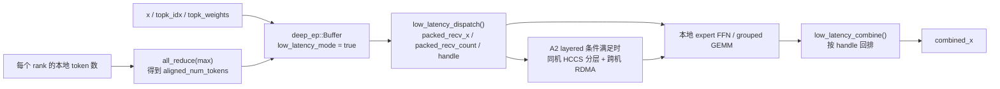

# sgl-kernel-npu 06：DeepEP Low-Latency、A2 Layered 与小 Batch 推理路径

源码基线：[`sgl-kernel-npu@d5630df`](https://github.com/sgl-project/sgl-kernel-npu/tree/d5630dff41c8108216f835597e63f6d3a7445908)。本地参考仓库当前工作树仍停在 `b2378ee05769cf7df209ffc5e1b669728f435a7e`，但已存在 `origin/main -> d5630df` 的远端跟踪引用；本轮据此核对仓库根 [`README.md#L28-L34`](https://github.com/sgl-project/sgl-kernel-npu/blob/d5630dff41c8108216f835597e63f6d3a7445908/README.md#L28-L34)、[`csrc/deepep/deep_ep.hpp`](https://github.com/sgl-project/sgl-kernel-npu/blob/d5630dff41c8108216f835597e63f6d3a7445908/csrc/deepep/deep_ep.hpp)、[`csrc/deepep/deep_ep.cpp`](https://github.com/sgl-project/sgl-kernel-npu/blob/d5630dff41c8108216f835597e63f6d3a7445908/csrc/deepep/deep_ep.cpp) 与 [`tests/python/deepep/`](https://github.com/sgl-project/sgl-kernel-npu/tree/d5630dff41c8108216f835597e63f6d3a7445908/tests/python/deepep)，并对 `README.md`、`csrc/deepep/`、`tests/python/deepep/` 做 `b2378ee..d5630df` 对象级 diff，确认本章聚焦的 low-latency 路径没有新增差异，因此可以把注意力集中在“这套 contract 本身怎么工作”。

如果你还没读过 [`05-deepep-hccl-and-moe-kernel-path.md`](./05-deepep-hccl-and-moe-kernel-path.md)、[`../02-cann-stack-and-boundaries.md`](../02-cann-stack-and-boundaries.md)、[`../foundations/02-ascend-hardware.md`](../foundations/02-ascend-hardware.md)、[`../foundations/03-memory-pipeline-and-sync.md`](../foundations/03-memory-pipeline-and-sync.md) 和 [`../torch_npu/01-dispatch-aclnn-and-custom-op-boundaries.md`](../torch_npu/01-dispatch-aclnn-and-custom-op-boundaries.md)，先补上再回来。上一章讲清了 DeepEP normal path 的主骨架；这一章只补一个缺口：为什么小 batch 推理要换成 `low_latency_dispatch/low_latency_combine`，以及 A2 layered 路径到底比 normal path 多了哪层通信结构。

## 1. 学习目标

- 分清 DeepEP 的 `normal mode` 和 `low-latency mode` 各自优化什么，不再把它们看成“同一个接口的大/小 batch 版本”。
- 看懂 `low_latency_dispatch -> 本地 expert 计算 -> low_latency_combine` 的最小调用顺序。
- 搞清 `num_max_dispatch_tokens_per_rank`、`packed_recv_x`、`packed_recv_count`、`handle` 这些 low-latency 路径第一次出现的新对象。
- 理解 A2 上的 layered 路径为什么不是一层平铺 all-to-all，而是“同机 HCCS + 跨机 RDMA”的分层组织。
- 学会区分“源码能直接证明的事实”和“根据 README、命名与张量形状做出的谨慎推断”。

## 2. 前置知识

- `dispatch` 和 `combine` 的基本语义、`topk_idx/topk_weights`、`assistInfoForCombine` 的作用，已经在 [`05-deepep-hccl-and-moe-kernel-path.md`](./05-deepep-hccl-and-moe-kernel-path.md) 讲过。
- `HCCL` 是多卡集合通信能力，不等于 DeepEP 本身：见 [`../02-cann-stack-and-boundaries.md`](../02-cann-stack-and-boundaries.md)。
- `A2`、`AI Core`、`MTE`、`GM/UB/L1` 这些硬件名词，已经在 [`../foundations/02-ascend-hardware.md`](../foundations/02-ascend-hardware.md) 讲过。
- 这章讨论的是跨卡 token 管线，不是片上 `CopyIn/Compute/CopyOut` 流水：见 [`../foundations/03-memory-pipeline-and-sync.md`](../foundations/03-memory-pipeline-and-sync.md)。

## 3. 先把六个新词就地讲清楚

### 3.1 Low-Latency Mode

`low-latency mode` 的直觉不是“吞吐版 dispatch 的缩水版”，而是“为了小批次尽快返回，预先把收发 contract 和缓冲布局定得更死一些”。仓库根 README 把它单独列成 communication mode，并明确说它面向 production inference 的小 batch 场景。

为什么需要它？因为训练或 prefill 常愿意攒更多 token 来换吞吐，而在线推理更在意几十到几百个 token 的尾延迟。两者优化目标不同，通信协议就不该完全一样。

它和上一章的 normal path 的区别是：normal path 先做显式 `layout -> notify -> dispatch normal -> combine normal`；low-latency path 则直接暴露专门的 `low_latency_dispatch` / `low_latency_combine` 接口，并配套单独的 packed buffer 与 handle 约定。术语表入口见 [`../reference/glossary.md`](../reference/glossary.md)。

### 3.2 `aligned_num_tokens` / `num_max_dispatch_tokens_per_rank`

这是第一次非常容易误解的量。它不是“当前 rank 真实有多少 token”，而是“这轮 low-latency dispatch 允许每个 rank 最多发多少 token”。官方测试先对各 rank 的本地 token 数做 `all_reduce(max)`，得到对齐后的最大值，再把它传给 low-latency 路径。

为什么要这样？因为低延迟协议宁可先把缓冲边界定死，也不想在每轮小 batch 里重新协商太多可变布局。

它和 `num_tokens` 的区别是：`num_tokens` 是当前 rank 的真实有效 token 数；`aligned_num_tokens` 是所有 rank 在本轮共享的上界。第一次出现时不要只记名字，先记住“真实数”和“协议上界”是两回事。术语表入口见 [`../reference/glossary.md`](../reference/glossary.md)。

### 3.3 `packed_recv_x` / `packed_recv_count`

`packed_recv_x` 可以先理解成“已经按 local expert 可直接消费的顺序打包好的接收 buffer”。它不再是原输入 token 顺序，而是给本地 expert 计算阶段准备的“紧凑货架”。

为什么要这样？因为 local expert 计算只关心“该我处理的 token 按什么批次排好”，不关心它们最初来自哪个 rank 的第几个 token。

它和 normal path 里的 `recv_x` / `expandx_out` 的区别是：low-latency 路径把“紧凑接收布局”显式做成自己的主返回值，并额外给出 `packed_recv_count` 说明每个 local expert 真正收到了多少 token。

### 3.4 `handle`

`handle` 不是“神秘句柄”，而是 combine 回程时必须带回来的辅助张量包。你可以把它理解成 dispatch 留下的“回程单据”。

为什么需要它？因为 low-latency combine 不可能仅凭 `combined_x` 猜出这些结果最初对应哪些 token、跨了哪些 rank、该按什么边界回排。

它和上一章的 `src_idx` / `send_head` 的关系是：概念相同，都是 dispatch 留给 combine 的证据；只是 low-latency 测试把它包装成了一个更偏 Python 侧的 `handle`。这件事可以从官方测试里对 `handle` 的解包顺序直接复核。术语表入口见 [`../reference/glossary.md`](../reference/glossary.md)。

### 3.5 A2 Layered 路径

`A2 layered` 可以先把它想成“先在同机机箱内部分层，再跨机发远程”的通信组织方式，而不是所有 rank 一次性平铺互发。README 对 A2 的描述是 “intranode HCCS + internode RDMA”，而源码中 low-latency 路径也只在特定 A2/910B 条件下分出 layered 分支。

为什么需要它？因为 A2 的互联不是完全对称的一层网。源码显式把 rank 划成“同机快速互联组”和“跨机 RDMA 组”两层，这通常意味着先吃掉同机便宜带宽，再处理跨机更贵的一层。

它和 “A3 full-mesh” 的区别是：A3 在 README 里直接被描述成 full-mesh HCCS；A2 则明确是“同机 HCCS + 跨机 RDMA”的分层组合。术语表入口见 [`../reference/glossary.md`](../reference/glossary.md)。

### 3.6 `get_low_latency_rdma_size_hint`

这个名字特别容易骗到初学者。直觉上你会以为它返回“精确的 RDMA byte 数”，但当前 `d5630df` 的 [`config.cpp#L4-L7`](https://github.com/sgl-project/sgl-kernel-npu/blob/d5630dff41c8108216f835597e63f6d3a7445908/csrc/deepep/config.cpp#L4-L7) 实现只是把 `num_max_dispatch_tokens_per_rank` 原样返回。

为什么还值得单独讲？因为这提醒你：不要拿函数名字脑补契约，先看真实返回值和调用点。官方测试确实把这个返回值直接传进 `num_rdma_bytes`。

它和“自己按 hidden、dtype 手算 byte 数”的区别是：当前版本的官方接口并没有要求你这样做。先信源码，别信想当然。术语表入口见 [`../reference/glossary.md`](../reference/glossary.md)。

## 4. 为什么这一章是当前最高优先级

到上一章为止，你已经知道 DeepEP normal path 如何把 router 路由变成 `layout -> dispatch -> local expert compute -> combine`。但如果继续往后读 `fused_deep_moe` 或 `dispatch_ffn_combine`，你很快会遇到一个更基础的问题：

- 为什么同样是 DeepEP，这里突然出现 `low_latency_mode=True`？
- 为什么要先对各 rank 的 token 数取 `max`？
- 为什么返回值里冒出 `packed_recv_count` 和 `handle`？
- 为什么 A2 上还要特判 layered？

也就是说，真正缺的不是“再多一个 fused op 名字”，而是“DeepEP 为什么要按延迟目标切成另一条通信 contract”。这层如果不补，后面再读 fused 路径，几乎一定会把“通信形状变化”和“数学语义变化”混在一起。

## 5. 直观类比：干线货运与即时同城配送

把 normal mode 和 low-latency mode 想成两套物流系统：

- normal mode 像干线货运：愿意先把车装满，再按大批量路线跑，目标是单位成本和总吞吐。
- low-latency mode 像即时配送：每一单货不多，但更在乎马上发车、边界固定、少等待。
- A2 layered 像“先在同城分拨，再上跨城干线”：同一机箱内部先走便宜快路，跨机再走 RDMA。

这个类比最关键的一点是：即时配送不是“货少一点的干线货运”，而是整套派单、缓冲和回程单据都重新设计过。DeepEP 的 low-latency path 就是这层区别。

## 6. 一张图先看 low-latency 数据流



这张图最重要的结论是：low-latency 路径依然保留“dispatch -> local expert compute -> combine”这条大骨架，没有改变 MoE 数学语义；变的是通信 contract、返回张量形状和 A2 上的分层组织。

## 7. 先把 normal path 和 low-latency path 放进同一张表

| 维度 | normal path | low-latency path |
|---|---|---|
| 主要目标 | 训练 / prefill 吞吐 | 小 batch 在线推理延迟 |
| 公开入口 | `get_dispatch_layout`、`intranode_dispatch`、`intranode_combine` | `low_latency_dispatch`、`low_latency_combine` |
| Host 预处理 | 先显式算 `layout` | 先约定 `aligned_num_tokens` 上界 |
| dispatch 输出 | `recv_x`、`src_idx`、`send_head` 等 | `packed_recv_x`、`packed_recv_count`、`handle` |
| combine 依赖 | `src_idx`、`send_head` | `handle` 里的 `src_info`、`layout_range` 等 |
| A2 特化 | normal A2 内核与 notify 路径 | 额外 layered 分支与更大的 recv-count 辅助张量 |
| profiling 名称 | `NotifyDispatchA2`、`DispatchNormalA2` 等 | `MoeLowLatencyDispatchV2`、`MoeLowLatencyCombineV2` |

这张表值得反复看，因为它能帮你避免一个常见误判：把 low-latency 路径当成“normal path 只是参数不同”。不是。它是单独的接口族。

## 8. 公开 API：源码明确把 low-latency 视为单独能力

先看 pybind 暴露点 [`pybind_extension.cpp#L25-L47`](https://github.com/sgl-project/sgl-kernel-npu/blob/d5630dff41c8108216f835597e63f6d3a7445908/csrc/deepep/pybind_extension.cpp#L25-L47)：

- `get_low_latency_rdma_size_hint`
- `Buffer.clean_low_latency_buffer`
- `Buffer.low_latency_dispatch`
- `Buffer.low_latency_combine`
- `Buffer.fused_deep_moe`
- `Buffer.dispatch_ffn_combine`

再看 [`deep_ep.hpp#L29-L32`](https://github.com/sgl-project/sgl-kernel-npu/blob/d5630dff41c8108216f835597e63f6d3a7445908/csrc/deepep/deep_ep.hpp#L29-L32) 与 [`deep_ep.hpp#L114-L130`](https://github.com/sgl-project/sgl-kernel-npu/blob/d5630dff41c8108216f835597e63f6d3a7445908/csrc/deepep/deep_ep.hpp#L114-L130)，你会发现 low-latency 相关签名被单独列出来，而不是塞进 normal path 的同一个函数里加一堆布尔开关。

这说明什么？说明在官方设计者眼里，low-latency 不是“normal path 的一个小分支”，而是值得单独暴露、单独测试、单独 benchmark 的模式。

顺带一个很值得记住的小事实：[`deep_ep.cpp#L505-L507`](https://github.com/sgl-project/sgl-kernel-npu/blob/d5630dff41c8108216f835597e63f6d3a7445908/csrc/deepep/deep_ep.cpp#L505-L507) 里 `clean_low_latency_buffer()` 当前实现是空的 `return;`。也就是说，这个 API 名字存在，但在当前 commit 上不能脑补它做了复杂回收逻辑。

## 9. `Buffer` 构造阶段就把 A2 拓扑事实写进上下文

[`deep_ep.cpp#L21-L88`](https://github.com/sgl-project/sgl-kernel-npu/blob/d5630dff41c8108216f835597e63f6d3a7445908/csrc/deepep/deep_ep.cpp#L21-L88) 有三件事必须一起看：

1. `A2_MAX_HCCS_PEERS = 8`。
2. `Buffer` 会保存 `low_latency_mode`。
3. 当 `soc_version == ASCEND910B` 时，会据此推导 `num_rdma_ranks`、`num_nvl_ranks`、`rdma_rank`、`nvl_rank`。

这里第一次出现一个容易混淆的命名点：代码字段叫 `nvl_rank` / `num_nvl_ranks`，但 README 对 A2 的官方描述是 “intranode HCCS + internode RDMA”。所以在这套 Ascend 教程里，应该把这些 `nvl_*` 名字理解成“同机快速互联分组”的遗留命名，而不是把它机械解读成某种 NVIDIA 特有硬件。

这不是拍脑袋猜测，而是由两条官方证据共同约束出来的：

- README 明确写的是 A2 同机 HCCS、跨机 RDMA；
- 构造函数又确实在 910B/A2 上按最多 8 个 peer 划分“本地快链路组”和 “RDMA 组”。

## 10. 最小例子：先照着官方测试把顺序建立起来

下面是教学伪代码，只保留官方测试 [`test_normal_and_low_latency.py#L13-L84`](https://github.com/sgl-project/sgl-kernel-npu/blob/d5630dff41c8108216f835597e63f6d3a7445908/tests/python/deepep/test_normal_and_low_latency.py#L13-L84) 与 [`test_low_latency.py#L367-L395`](https://github.com/sgl-project/sgl-kernel-npu/blob/d5630dff41c8108216f835597e63f6d3a7445908/tests/python/deepep/test_low_latency.py#L367-L395) 反复出现的最低限顺序：

```python
# 教学伪代码：保留官方 tests 的调用顺序，不保证可直接运行
import deep_ep

local_num_tokens = ...
aligned_num_tokens = all_reduce_max_across_ranks(local_num_tokens)

num_rdma_bytes = deep_ep.Buffer.get_low_latency_rdma_size_hint(
    aligned_num_tokens, hidden, num_ranks, num_experts
)

buffer = deep_ep.Buffer(
    ...,
    num_rdma_bytes=num_rdma_bytes,
    low_latency_mode=True,
)

packed_recv_x, packed_recv_count, handle, event, hook = buffer.low_latency_dispatch(
    x,
    topk_idx,
    aligned_num_tokens,
    num_experts,
    use_fp8=True,
    round_scale=False,
    use_ue8m0=False,
)

simulated_gemm_x = per_token_cast_back(*packed_recv_x)
local_expert_out = local_grouped_ffn(simulated_gemm_x, packed_recv_count, ...)

combined_x, event, hook = buffer.low_latency_combine(
    local_expert_out,
    topk_idx,
    topk_weights,
    handle,
)
```

你真正该背下来的不是参数名，而是这个顺序：

`all_rank_max_tokens -> low_latency_dispatch -> local expert compute -> low_latency_combine`

## 11. `low_latency_dispatch()`：先固定边界，再发小批量 token

### 11.1 第一件事不是通信，而是检查“这轮最多允许发多少”

[`deep_ep.cpp#L810-L846`](https://github.com/sgl-project/sgl-kernel-npu/blob/d5630dff41c8108216f835597e63f6d3a7445908/csrc/deepep/deep_ep.cpp#L810-L846) 一上来就做两件关键检查：

- `EP_HOST_ASSERT(low_latency_mode);`
- `EP_HOST_ASSERT(num_max_dispatch_tokens_per_rank >= x.size(0));`

这两行的教学意义很大：

- 低延迟路径不是默认模式，必须显式打开；
- 它要的不是“当前刚好有多少 token”，而是“当前 token 数不能超过本轮统一上界”。

如果你把 `num_max_dispatch_tokens_per_rank` 错当成“当前 rank 的真实 token 数”，后面所有 buffer 预算、A2 layered 分支和 combine 契约都会看错。

### 11.2 `num_max_tokens` 决定了 packed buffer 要预留多大

同一段代码里，它会根据 `shared_expert_rank_num`、`num_topk`、`num_local_experts` 算 `num_max_tokens`，然后分配：

- `packed_recv_x`
- `packed_recv_x_scales`
- `expandIdx`
- `ep_recv_count`
- `tp_recv_count`
- `packed_recv_count`

这里最重要的直觉是：low-latency dispatch 不是把 token 原样转发，而是直接在 Host 侧确定“接收区的最大可容纳形状”和“回程所需索引区”。这就是为什么它比 normal path 更像一套“先预定货架，再进货”的协议。

### 11.3 A2 layered 条件满足时，`ep_recv_count` 不再只是简单计数表

[`deep_ep.cpp#L872-L880`](https://github.com/sgl-project/sgl-kernel-npu/blob/d5630dff41c8108216f835597e63f6d3a7445908/csrc/deepep/deep_ep.cpp#L872-L880) 明确写出 layered 条件：

- `soc_version == ASCEND910B`
- `HCCL_INTRA_PCIE_ENABLE=1`
- `HCCL_INTRA_ROCE_ENABLE=0`

满足后：

- `isLayered = true`
- `ep_recv_count` 从默认的 `[num_local_experts * num_ranks]`
- 扩成 `num_experts + 2 * global_bs * num_topk * server_num`

这里有一个需要明确标注的推断：源码只直接告诉我们“张量形状膨胀了很多”，没有在这一段注释里逐字段解释它。结合 README 的 A2 模式说明和 layered 内核文件名，我推断它意味着 layered A2 需要的不只是“每个 expert 收多少 token”，还需要额外的按 server / token 组织的辅助路由信息。这是从官方源码结构推出的合理结论，但不是源码注释逐字写死的事实。

### 11.4 `comm_alg` 不是“性能神开关”，而是模式标签

[`deep_ep.cpp#L882-L889`](https://github.com/sgl-project/sgl-kernel-npu/blob/d5630dff41c8108216f835597e63f6d3a7445908/csrc/deepep/deep_ep.cpp#L882-L889) 会按条件把 `comm_alg` 设成：

- `fullmesh`
- `ccu`
- `fullmesh_v1`

初学者在这里最容易犯的错，是把它当成“随便试试哪个更快”的玄学开关。更正确的理解是：这是 dispatch/combine op 的通信模式标签，必须和当前 SoC、环境变量、上层协议配套看。

### 11.5 真正发起 dispatch 的是专门的 low-latency op

最后调用的是 [`aclnnMoeLowLatencyDispatchV2`](https://github.com/sgl-project/sgl-kernel-npu/blob/d5630dff41c8108216f835597e63f6d3a7445908/csrc/deepep/deep_ep.cpp#L895-L922)。这比上一章的 `notify + dispatch normal` 更直接，也再次说明 low-latency 不是沿用 normal path 的同一组 op。

从返回值可以读出三层含义：

- `packed_recv_x` / `packed_recv_x_scales`：给 local expert 计算吃的紧凑输入；
- `packed_recv_count`：每个 local expert 实际收到多少 token；
- `expandIdx` / `ep_recv_count`：combine 回来时必须依赖的回程证据。

## 12. Python 侧 `handle` 约定：官方测试能复核到什么

只看 C++ 头文件你会知道 low-latency dispatch 返回若干张量，但官方 Python 测试进一步说明了“Python 侧怎么把它们打包回 combine”。

在 [`test_low_latency.py#L188-L212`](https://github.com/sgl-project/sgl-kernel-npu/blob/d5630dff41c8108216f835597e63f6d3a7445908/tests/python/deepep/test_low_latency.py#L188-L212) 里，`handle` 被解包成：

- `src_info`
- `layout_range`
- `num_max_dispatch_tokens_per_rank`
- `hidden`
- `num_experts`
- `packed_recv_count`
- `expand_scales`

这件事的教学价值非常高，因为它把 low-latency combine 的依赖关系摊开了：

- combine 不是只要 `local_expert_out` 就够；
- 它必须知道 dispatch 当时的源信息、布局边界、统一 token 上界以及部分扩展尺度信息。

所以 `handle` 不是“临时垃圾对象”，而是 low-latency path 里最该小心保存的 contract 包。

## 13. `low_latency_combine()`：它是按回程单据恢复 token 语义

### 13.1 combine 先检查的不是性能，而是回程契约

[`deep_ep.cpp#L927-L941`](https://github.com/sgl-project/sgl-kernel-npu/blob/d5630dff41c8108216f835597e63f6d3a7445908/csrc/deepep/deep_ep.cpp#L927-L941) 最先检查：

- `x` 必须是 2 维 contiguous
- `x` 必须是 `bfloat16`
- `num_max_dispatch_tokens_per_rank >= topk_idx.size(0)`

也就是说，combine 根本不假设自己可以“看着结果猜回去”。它要求你继续遵守 dispatch 那一轮统一的 token 上界。

### 13.2 combine 仍然要重新拿到通信域名字

和 dispatch 一样，combine 也会重新准备 `hcom_ep_name` / `hcom_tp_name`。这件事说明 combine 不是纯本地 `scatter_`，而是依然站在 HCCL-backed 通信 contract 上运行。

### 13.3 真正执行的是 `aclnnMoeLowLatencyCombineV2`

最终调用的是 [`aclnnMoeLowLatencyCombineV2`](https://github.com/sgl-project/sgl-kernel-npu/blob/d5630dff41c8108216f835597e63f6d3a7445908/csrc/deepep/deep_ep.cpp#L991-L997)。

这里最值得牢牢记住的一点是：low-latency combine 没有改变 MoE 的数学语义。它做的仍然是“按 top-k 路由回排并聚合”；变化的是你现在必须带上 low-latency dispatch 留下来的 `src_info` 和 `layout_range`，而不是上一章 normal path 的 `src_idx` / `send_head`。

## 14. A2 layered：哪些是源码直接证明的，哪些是谨慎推断的

先把“能直接证明的”列出来：

1. README 写了 A3 是 full-mesh HCCS，A2 是 intranode HCCS + internode RDMA。
2. 构造函数在 910B/A2 上按 `A2_MAX_HCCS_PEERS = 8` 划分本地快链组与 RDMA 组。
3. low-latency dispatch/combine 只在 910B 且 `HCCL_INTRA_PCIE_ENABLE=1`、`HCCL_INTRA_ROCE_ENABLE=0` 时打开 layered 条件。
4. 仓库里存在专门的 [`cam_moe_distribute_dispatch_a2_layered.h`](https://github.com/sgl-project/sgl-kernel-npu/blob/d5630dff41c8108216f835597e63f6d3a7445908/csrc/deepep/ops2/op_kernel/a2/cam_moe_distribute_dispatch_a2_layered.h)。

再说“谨慎推断的”：

- layered A2 很可能不是把所有 rank 一次性平铺互发，而是先用同机 HCCS 整理局部，再经 RDMA 处理跨机部分；
- `ep_recv_count` 的大幅扩容，说明 layered 路径需要比普通 per-expert/per-rank 计数表更丰富的中间路由元数据。

为什么要把“事实”和“推断”分开写？因为我们现在没有 NPU 真机去 trace 它的完整时序，也没有更底层内部文档。教学上应该把能证明到哪一步说清，而不是把合理猜测包装成硬事实。

## 15. 官方测试怎样验证这条路径

### 15.1 正确性测试先假设 local expert 计算是可控的

[`test_normal_and_low_latency.py#L51-L84`](https://github.com/sgl-project/sgl-kernel-npu/blob/d5630dff41c8108216f835597e63f6d3a7445908/tests/python/deepep/test_normal_and_low_latency.py#L51-L84) 的思路很值得学习：

- 先 dispatch
- 中间用可控的 `simulated_gemm_x`
- 再 combine
- 最后把结果和 `x * sum(topk_weights)` 这样的参考语义做比较

这告诉你：验证通信 contract 时，先把中间 expert 计算简化掉，别一开始就把所有不确定性叠在一起。

### 15.2 profiling 时应盯的是真实 low-latency kernel 名字

[`test_low_latency.py#L317-L317`](https://github.com/sgl-project/sgl-kernel-npu/blob/d5630dff41c8108216f835597e63f6d3a7445908/tests/python/deepep/test_low_latency.py#L317-L317) 直接把 profiling kernel 名写成：

- `MoeLowLatencyDispatchV2`
- `MoeLowLatencyCombineV2`

如果你在真机上做 profile，第一步就该先确认时间线里是不是这两个内核，而不是先跑去猜 fused op 或 grouped GEMM。

### 15.3 官方测试暴露了 `low_latency_strategy`

[`test_low_latency.py#L487-L494`](https://github.com/sgl-project/sgl-kernel-npu/blob/d5630dff41c8108216f835597e63f6d3a7445908/tests/python/deepep/test_low_latency.py#L487-L494) 把 `low_latency_strategy` 暴露为：

- `default`
- `ops`

这件事至少说明：官方测试环境里存在两种 Python 侧入口策略。但由于当前工作区没有对应 wrapper 源码全貌和真机环境，这里不要越界断言两者一定只差一层 Python 包装，或一定性能等价。

## 16. 常见错误

- 把 `num_max_dispatch_tokens_per_rank` 当成“当前 rank 的真实 token 数”。错。它是本轮 low-latency 协议统一上界。
- 看到 `get_low_latency_rdma_size_hint` 就自己脑补一套 byte 公式。当前 commit 上它直接返回的是 token 上界。
- 以为 `packed_recv_x` 还是原 token 顺序。不是。它已经是 expert-friendly 的打包接收布局。
- 以为 `handle` 只是临时对象，用完 dispatch 就能丢。combine 正是靠它回排。
- 以为 A2 layered 会自动在所有 A2 上开启。源码明确还依赖环境变量条件。
- 看到 `clean_low_latency_buffer()` 就假定当前实现里存在复杂清理逻辑。当前 commit 上它是 no-op。
- 看到代码里的 `nvl_rank` 命名就直接解释成 NVLink。对 Ascend A2，这样读会把 README 的 HCCS/RDMA 边界看歪。

## 17. 调试与性能方法

### 17.1 没有 NPU 时先做哪些静态核对

当前工作区没有 Ascend NPU/CANN 运行环境时，你仍然可以核对：

- 当前 pinned commit 是否还是 `d5630df`；
- `README.md`、`deep_ep.hpp`、`deep_ep.cpp`、`test_low_latency.py` 的路径与接口名是否存在；
- 章节中的 `handle`、`aligned_num_tokens`、kernel 名称是否和官方测试一致。

但你不能声称：

- 真跑过 `MoeLowLatencyDispatchV2` / `MoeLowLatencyCombineV2`；
- 复现了 README 里提到的低于某个微秒级延迟；
- 验证了 A2 layered 相比其他路径的真实性能收益。

### 17.2 真机上先按三步排查

1. 先看 `aligned_num_tokens` 是否真的是所有 rank 的 `max`。
2. 再看 `packed_recv_count` 和 `handle` 内各张量是否来自同一轮 dispatch。
3. 最后才看 profile 里 `MoeLowLatencyDispatchV2`、`MoeLowLatencyCombineV2` 和 local expert GEMM 的占比。

这个顺序很重要，因为 low-latency 路径最常见的错并不是某条 GEMM 指令慢，而是“协议边界没对齐”。

## 18. 练习

1. 对照 [`deep_ep.hpp#L114-L130`](https://github.com/sgl-project/sgl-kernel-npu/blob/d5630dff41c8108216f835597e63f6d3a7445908/csrc/deepep/deep_ep.hpp#L114-L130)，把 low-latency dispatch/combine 的参数分成“输入数据、协议上界、量化选项、回程依赖”四类。
2. 只看 [`deep_ep.cpp#L810-L922`](https://github.com/sgl-project/sgl-kernel-npu/blob/d5630dff41c8108216f835597e63f6d3a7445908/csrc/deepep/deep_ep.cpp#L810-L922)，解释为什么 `packed_recv_count` 和 `ep_recv_count` 不能合并成一个东西。
3. 对照 [`test_low_latency.py#L386-L395`](https://github.com/sgl-project/sgl-kernel-npu/blob/d5630dff41c8108216f835597e63f6d3a7445908/tests/python/deepep/test_low_latency.py#L386-L395)，解释为什么测试先算 `aligned_num_tokens`，再构造 `Buffer`。
4. 打开 [`cam_moe_distribute_dispatch_a2_layered.h`](https://github.com/sgl-project/sgl-kernel-npu/blob/d5630dff41c8108216f835597e63f6d3a7445908/csrc/deepep/ops2/op_kernel/a2/cam_moe_distribute_dispatch_a2_layered.h)，只靠命名和成员函数列表，列出你能确认的 layered A2 责任边界，以及你不能确认的部分。

## 19. 自测问题

- 为什么说 low-latency path 没有改变 MoE 的数学语义，却改变了通信 contract？
- `aligned_num_tokens` 和当前 rank 的 `num_tokens` 到底差在哪？
- `handle` 为什么不是可有可无，而是 combine 的回程单据？
- A2 layered 的“分层”至少被哪几条官方证据约束住了？
- 为什么本章要特别提醒你不要从 `get_low_latency_rdma_size_hint` 的函数名反推实现？

## 20. 下一步学什么

现在你已经把 DeepEP 的两套主通信骨架都补齐了：

- normal path：[`05-deepep-hccl-and-moe-kernel-path.md`](./05-deepep-hccl-and-moe-kernel-path.md)
- low-latency path：本章

最自然的下一步有两条：

- 继续留在 DeepEP，单独拆 `dispatch_ffn_combine` / `fused_deep_moe`，看 low-latency dispatch、两层 expert FFN 和 combine 怎样被压进一条更大的 op。
- 切回另一个真实大算子，读 FLA mega kernel 的 device stage 与 GM/UB/同步数据流。

如果按依赖顺序继续推进，前者优先级更高，因为它正好站在本章补完的 low-latency contract 之上。

## 官方源码与文档

- [仓库根 README：DeepEP 的 normal mode / low-latency mode 定位](https://github.com/sgl-project/sgl-kernel-npu/blob/d5630dff41c8108216f835597e63f6d3a7445908/README.md#L28-L34)
- [pybind 暴露：`deep_ep::Buffer` 的 low-latency API](https://github.com/sgl-project/sgl-kernel-npu/blob/d5630dff41c8108216f835597e63f6d3a7445908/csrc/deepep/pybind_extension.cpp#L25-L47)
- [DeepEP 头文件：`low_latency_dispatch` / `low_latency_combine` 签名](https://github.com/sgl-project/sgl-kernel-npu/blob/d5630dff41c8108216f835597e63f6d3a7445908/csrc/deepep/deep_ep.hpp#L114-L130)
- [DeepEP 主实现：A2 拓扑与 low-latency dispatch/combine](https://github.com/sgl-project/sgl-kernel-npu/blob/d5630dff41c8108216f835597e63f6d3a7445908/csrc/deepep/deep_ep.cpp#L21-L88)
- [low-latency dispatch：`deep_ep.cpp#L810-L922`](https://github.com/sgl-project/sgl-kernel-npu/blob/d5630dff41c8108216f835597e63f6d3a7445908/csrc/deepep/deep_ep.cpp#L810-L922)
- [low-latency combine：`deep_ep.cpp#L927-L997`](https://github.com/sgl-project/sgl-kernel-npu/blob/d5630dff41c8108216f835597e63f6d3a7445908/csrc/deepep/deep_ep.cpp#L927-L997)
- [RDMA size hint：`config.cpp#L4-L7`](https://github.com/sgl-project/sgl-kernel-npu/blob/d5630dff41c8108216f835597e63f6d3a7445908/csrc/deepep/config.cpp#L4-L7)
- [official test：normal 与 low-latency 对照](https://github.com/sgl-project/sgl-kernel-npu/blob/d5630dff41c8108216f835597e63f6d3a7445908/tests/python/deepep/test_normal_and_low_latency.py#L13-L84)
- [official test：low-latency 调用、profiling 与参数入口](https://github.com/sgl-project/sgl-kernel-npu/blob/d5630dff41c8108216f835597e63f6d3a7445908/tests/python/deepep/test_low_latency.py#L261-L317)
- [A2 layered kernel 文件：`cam_moe_distribute_dispatch_a2_layered.h`](https://github.com/sgl-project/sgl-kernel-npu/blob/d5630dff41c8108216f835597e63f6d3a7445908/csrc/deepep/ops2/op_kernel/a2/cam_moe_distribute_dispatch_a2_layered.h)

## 本章验证边界

- 本轮验证了 Markdown 结构、相对链接、pinned 源码路径和当前官方 `origin/main` 提交。
- 本轮没有 Ascend NPU/CANN 运行环境，因此没有声称实际执行、profile 或测量了 low-latency kernel。
- 关于 A2 layered 的分层细节，本章只陈述了官方 README、源码分支条件、相关张量形状与文件组织能直接支持的结论；凡超出源码直证的部分，已明确标成“谨慎推断”。