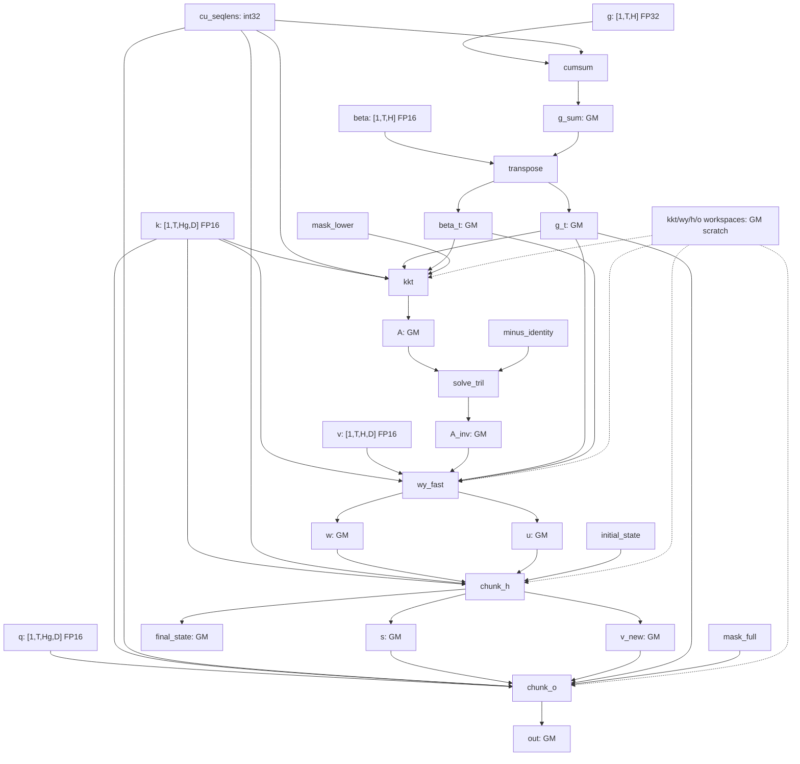

# sgl-kernel-npu 08：FLA Mega Kernel、Device Stage 与 Ascend 数据流

本章接着 [`04-fla-chunk-gated-delta-rule-mixed-path.md`](./04-fla-chunk-gated-delta-rule-mixed-path.md) 往下挖。04 讲清楚了同一个 FLA 入口为什么会在“分段 Triton 路径”和“mega custom op 路径”之间切换；本章专门拆 mega 路径里的 device 侧实现。

源码基线：[`sgl-kernel-npu@b2378ee`](https://github.com/sgl-project/sgl-kernel-npu/tree/b2378ee05769cf7df209ffc5e1b669728f435a7e)。本章重点文件是：

- Python wrapper：[`python/sgl_kernel_npu/sgl_kernel_npu/fla/mega_chunk_gdn.py`](https://github.com/sgl-project/sgl-kernel-npu/blob/b2378ee05769cf7df209ffc5e1b669728f435a7e/python/sgl_kernel_npu/sgl_kernel_npu/fla/mega_chunk_gdn.py)
- PyTorch schema：[`csrc/pytorch_extensions.cpp`](https://github.com/sgl-project/sgl-kernel-npu/blob/b2378ee05769cf7df209ffc5e1b669728f435a7e/csrc/pytorch_extensions.cpp#L110-L121)
- Host 入口：[`csrc/mega_chunk_gdn/op_host/mega_chunk_gdn.cpp`](https://github.com/sgl-project/sgl-kernel-npu/blob/b2378ee05769cf7df209ffc5e1b669728f435a7e/csrc/mega_chunk_gdn/op_host/mega_chunk_gdn.cpp)
- Device 主程序：[`csrc/mega_chunk_gdn/op_kernel/mega_kernel.cpp`](https://github.com/sgl-project/sgl-kernel-npu/blob/b2378ee05769cf7df209ffc5e1b669728f435a7e/csrc/mega_chunk_gdn/op_kernel/mega_kernel.cpp)
- 被 mega kernel 纳入的 stage 文件：[`chunk_cumsum.cpp`](https://github.com/sgl-project/sgl-kernel-npu/blob/b2378ee05769cf7df209ffc5e1b669728f435a7e/csrc/mega_chunk_gdn/op_kernel/chunk_cumsum.cpp)、[`scaled_dot_kkt.cpp`](https://github.com/sgl-project/sgl-kernel-npu/blob/b2378ee05769cf7df209ffc5e1b669728f435a7e/csrc/mega_chunk_gdn/op_kernel/scaled_dot_kkt.cpp)、[`tri_inverse_impl.cpp`](https://github.com/sgl-project/sgl-kernel-npu/blob/b2378ee05769cf7df209ffc5e1b669728f435a7e/csrc/mega_chunk_gdn/op_kernel/tri_inverse_impl.cpp)、[`wy_fast.cpp`](https://github.com/sgl-project/sgl-kernel-npu/blob/b2378ee05769cf7df209ffc5e1b669728f435a7e/csrc/mega_chunk_gdn/op_kernel/wy_fast.cpp)、[`chunk_h.cpp`](https://github.com/sgl-project/sgl-kernel-npu/blob/b2378ee05769cf7df209ffc5e1b669728f435a7e/csrc/mega_chunk_gdn/op_kernel/chunk_h.cpp)、[`chunk_o.cpp`](https://github.com/sgl-project/sgl-kernel-npu/blob/b2378ee05769cf7df209ffc5e1b669728f435a7e/csrc/mega_chunk_gdn/op_kernel/chunk_o.cpp)

如果你对 AI Core、AIC/AIV、GM、UB、CopyIn/Compute/CopyOut、pipeline 和 cross-core sync 还没有直觉，先读：

- [`../foundations/02-ascend-hardware.md`](../foundations/02-ascend-hardware.md)：Ascend 硬件和存储层级。
- [`../foundations/03-memory-pipeline-and-sync.md`](../foundations/03-memory-pipeline-and-sync.md)：搬运、计算、同步、流水。
- [`../ascend-c/03-tiling-pipeline-sync-optimization.md`](../ascend-c/03-tiling-pipeline-sync-optimization.md)：Ascend C 里的 tiling、pipeline、sync 优化。
- [`../torch_npu/01-dispatch-aclnn-and-custom-op-boundaries.md`](../torch_npu/01-dispatch-aclnn-and-custom-op-boundaries.md)：`torch.ops.*` 怎样落到 custom op。
- [`../reference/code-reading-and-types.md`](../reference/code-reading-and-types.md)：变量类型、地址空间、pointer arithmetic 的统一读法。

## 1. 学习目标

学完本章，你应该能做到四件事：

1. 解释 mega kernel 到底“mega”在哪里，以及它和普通 fusion、persistent kernel 的区别。
2. 从 Python wrapper 一路追到 PyTorch schema、Host 校验、kernel launch 和 device stage。
3. 看懂 `mega_kernel.cpp` 中 7 个 stage 的真实执行顺序，以及每个 stage 读写哪些 GM 中间张量。
4. 解释为什么 Ascend 版 mega kernel 需要 AIV/AIC 协作、workspace、`pipe_barrier`、`wait_flag_dev` 和严格 shape contract。

## 2. 先把本章新词讲清楚

这一节故意放得很靠前。Mega kernel 之所以难，不是因为每个词都深不可测，而是因为很多词第一次同时出现：算法词、Ascend 硬件词、PyTorch schema 词、device 指令 helper 混在一起，初学者很容易被“词雾”糊住。

### 2.1 Mega Kernel

Mega kernel 指把一个原本可以拆成多个 kernel launch 的算法阶段，合并进同一次 device kernel launch 里执行。

这里的 launch 是 Host 侧向 NPU runtime 提交一次 device kernel 的动作。一次 launch 会带来 Host/runtime 调度成本，并且两个 launch 之间通常要通过 GM，也就是全局设备内存，交接中间结果。GM 的容量大，但访问比片上存储慢得多。

所以 mega kernel 想省掉的主要不是“数学计算量”，而是：

- 少几次 Host 到 Device 的启动边界；
- 少几次 stage 之间的外部调度和 stream 边界；
- 让多个 stage 在同一个 device 程序里按固定依赖顺序推进；
- 给 AIV、AIC、workspace 和同步协议留下更强的整体控制权。

它不是“把所有代码硬塞到一个超大 for 循环”。真正能不能合并，取决于中间数据是否能被合理保存、跨核同步是否可控、shape 是否足够稳定、调试和回退路径是否还能承受。

### 2.2 Device Stage

Device stage 是本章对“mega kernel 内部一个有明确输入、输出和依赖边界的设备侧阶段”的称呼。它不是 PyTorch operator，也不是一次独立 launch。它只是同一个 device kernel 内部的一段工作。

例如 `mega_kernel.cpp` 顶部源码注释直接列出 7 个 stage：`cumsum`、`transpose`、`kkt`、`solve_tril`、`wy_fast`、`chunk_h`、`chunk_o`，见 [`mega_kernel.cpp#L6-L13`](https://github.com/sgl-project/sgl-kernel-npu/blob/b2378ee05769cf7df209ffc5e1b669728f435a7e/csrc/mega_chunk_gdn/op_kernel/mega_kernel.cpp#L6-L13)。这些 stage 在同一次 `launch_mega_kernel` 里依次执行。

### 2.3 GDN

本章里的 `GDN` 来自源码命名，例如 `mega_chunk_gdn`、`GDN_D`、`GDN_C`。在这条教学线里，你可以把它理解成 sgl-kernel-npu 为 FLA chunk gated delta rule 相关实现使用的内部缩写。不要把它先想成另一个独立框架。

`GDN_D` 和 `GDN_C` 在 device 主程序里都被固定成 `128`，见 [`mega_kernel.cpp#L15-L20`](https://github.com/sgl-project/sgl-kernel-npu/blob/b2378ee05769cf7df209ffc5e1b669728f435a7e/csrc/mega_chunk_gdn/op_kernel/mega_kernel.cpp#L15-L20)。这里：

- `D` 是 head dimension，即每个 attention head 的向量维度。
- `C` 是 chunk size，即每个 chunk 处理的 token 块大小。

Python wrapper 里也有对应常量 `HEAD_DIM = 128`、`CHUNK_SIZE = 128`，见 [`mega_chunk_gdn.py#L6-L7`](https://github.com/sgl-project/sgl-kernel-npu/blob/b2378ee05769cf7df209ffc5e1b669728f435a7e/python/sgl_kernel_npu/sgl_kernel_npu/fla/mega_chunk_gdn.py#L6-L7)。

### 2.4 PTO

`PTO` 在本章指这份源码通过 `#include <pto/pto-inst.hpp>` 引入的 device 侧 tile/instruction helper 层，见 [`mega_kernel.cpp#L34-L37`](https://github.com/sgl-project/sgl-kernel-npu/blob/b2378ee05769cf7df209ffc5e1b669728f435a7e/csrc/mega_chunk_gdn/op_kernel/mega_kernel.cpp#L34-L37)。源码注释里说这个 mega kernel 把所有 PTO stages 放进一次 launch。

对初学者来说，可以先把 PTO 理解成“在 Ascend device 代码里表达 tile、layout、搬运、矩阵计算和同步的一组低层 helper/DSL”。它比 Python Triton 更接近硬件，也不像常规 Ascend C 教学里的 `TPipe/TQue/GlobalTensor/LocalTensor` 那样统一封装。它会直接暴露类似 `TLOAD`、`TSTORE`、`TASSIGN`、`TTRANS`、`pipe_barrier` 这类更贴近指令通路的写法。

这里要谨慎：本课程不会把 PTO 当作 CANN 官方稳定公开 API 来讲，而是按当前 sgl-kernel-npu 源码里的使用方式讲它的工程含义。

### 2.5 AIV、AIC、Cube、Vector

AIC 是 Ascend 分离模式下偏矩阵乘加的 Cube Core，AIV 是偏逐元素和向量处理的 Vector Core。Cube 是矩阵乘加单元，Vector 是向量计算单元。基础定义见 [`../foundations/02-ascend-hardware.md`](../foundations/02-ascend-hardware.md)。

这个 mega kernel 明确把 stage 标成 `(Vec)`、`(Cube)` 或 `(Cube+Vec)`。这不是装饰，而是在告诉你：有些阶段主要适合 Vector 处理，例如 cumsum/transpose；有些阶段主要适合 Cube 处理，例如三角矩阵求逆；有些阶段要让 Cube 和 Vector 协作，例如 KKT、WY、chunk_h、chunk_o。

### 2.6 GM、UB、workspace

GM 是 Global Memory，全局设备内存。UB 是 Unified Buffer，AI Core 上更快但容量有限的片上缓冲。workspace 是算子运行时额外申请的临时 GM 区域。

这三个词一起出现时，最重要的是不要把它们混成一个东西：

- GM 可以跨 stage、跨核保存较大的中间张量，但读写成本高。
- UB 适合在一个 core 内暂存 tile，供 Vector 等单元快速处理，但容量小。
- workspace 是 Python wrapper/Host 为 device stage 准备的临时 GM scratch，用完即可丢弃，不是对外语义输出。

详细基础见 [`../foundations/03-memory-pipeline-and-sync.md`](../foundations/03-memory-pipeline-and-sync.md) 和 [`../ascend-c/04-platform-tiling-and-workspace-contracts.md`](../ascend-c/04-platform-tiling-and-workspace-contracts.md)。

### 2.7 `TLOAD`、`TSTORE`、`TASSIGN`、`TTRANS`

这些是 PTO 风格 device helper。可以先按下面方式理解：

- `TLOAD`：把 GM 或较低层数据搬进片上 tile。直觉上接近 CopyIn，但它的参数是 PTO tile/layout 语义。
- `TSTORE`：把片上 tile 的结果写回 GM。直觉上接近 CopyOut。
- `TASSIGN`：把一个 tile view 绑定到某段片上 buffer 地址或逻辑区域。它不是数学赋值，而更像“告诉后续指令这块 tile 放在哪里”。
- `TTRANS`：tile transpose，在片上把 tile 的行列布局转置。

例如 `mega_transpose_TH_to_HT` 里使用 PTO tile 类型和 `TTRANS` 做 `T,H` 到 `H,T` 的布局转换，源码入口见 [`mega_kernel.cpp#L76-L120`](https://github.com/sgl-project/sgl-kernel-npu/blob/b2378ee05769cf7df209ffc5e1b669728f435a7e/csrc/mega_chunk_gdn/op_kernel/mega_kernel.cpp#L76-L120)。

### 2.8 `pipe_barrier`、`set_flag`、`wait_flag`、`wait_flag_dev`

这些都是同步相关术语。

- `pipe_barrier(PIPE_ALL)`：让当前 core 内指定 pipeline 的前序指令完成到安全点，避免后面的搬运或计算读到未完成数据。
- `set_flag` / `wait_flag`：同一个 core 内不同执行通路之间的事件同步。比如搬运通路完成后，计算通路再读。
- `wait_flag_dev`：device 侧跨 core 或跨 AIV/AIC 协作场景下等待某个全局同步信号。
- `ffts_cross_core_sync`：源码中用于发起跨核同步消息的 helper。你不需要一开始记住所有参数位含义，先理解它在“让多个执行者都到达同一阶段边界”。

`SyncAllImpl` 把这些动作封成 mega kernel 内的阶段间大同步，源码见 [`mega_kernel.cpp#L56-L74`](https://github.com/sgl-project/sgl-kernel-npu/blob/b2378ee05769cf7df209ffc5e1b669728f435a7e/csrc/mega_chunk_gdn/op_kernel/mega_kernel.cpp#L56-L74)。

### 2.9 `H`、`Hg`、GQA / group-value

`H` 在本章通常指 value heads，也就是 `v`、`g`、`beta` 使用的 head 数。`Hg` 指 key/query heads，也就是 `q`、`k` 使用的 head 数。GQA 是 grouped-query attention，直觉是多个 query head 可以共享或分组使用较少的 key/value 相关 head，从而降低 KV 侧成本。

这份源码的 mega kernel 是 group-value / GQA 版本：`H` 和 `Hg` 不要求相等，但要求 `H % Hg == 0`，并且 `H` 只能取一组有限值。Host 校验见 [`mega_chunk_gdn.cpp#L18-L23`](https://github.com/sgl-project/sgl-kernel-npu/blob/b2378ee05769cf7df209ffc5e1b669728f435a7e/csrc/mega_chunk_gdn/op_host/mega_chunk_gdn.cpp#L18-L23)。

### 2.10 `num_matrices`

`num_matrices` 是 device 侧需要处理的逻辑矩阵数量。Python wrapper 里直接计算为：

```python
num_matrices = num_chunks * num_value_heads
```

这是真实源码里的表达式，见 [`mega_chunk_gdn.py#L89-L91`](https://github.com/sgl-project/sgl-kernel-npu/blob/b2378ee05769cf7df209ffc5e1b669728f435a7e/python/sgl_kernel_npu/sgl_kernel_npu/fla/mega_chunk_gdn.py#L89-L91)。含义是：每条 packed 序列会被切成若干 chunk，每个 chunk 对每个 value head 都会形成一份需要处理的 `D x D` 或 `C x C` 相关矩阵工作。

它不是 token 数，也不是物理 core 数。`num_matrices` 是逻辑工作量；`block_dim` 是这次 launch 启动多少个 Ascend 逻辑 block/core 实例。

### 2.11 `mask_lower`、`mask_full`、`minus_identity`

这三个都是 Python wrapper 准备好并传给 device 的辅助矩阵：

- `mask_lower` 是不含对角线的下三角 mask，来自 `torch.tril(..., diagonal=-1)`。
- `mask_full` 是含对角线的下三角 mask，来自 `torch.tril(..., diagonal=0)`。
- `minus_identity` 是对角线为 `-1` 的 `128 x 128` FP16 矩阵。

它们的创建见 [`mega_chunk_gdn.py#L18-L37`](https://github.com/sgl-project/sgl-kernel-npu/blob/b2378ee05769cf7df209ffc5e1b669728f435a7e/python/sgl_kernel_npu/sgl_kernel_npu/fla/mega_chunk_gdn.py#L18-L37)。直觉上，mask 用来限制 chunk 内的因果/三角依赖，`minus_identity` 用在三角求解/逆相关阶段，帮助构造带负单位阵的计算形式。

## 3. Mega kernel 和已有概念的关系

### 3.1 和普通 fusion 的关系

Fusion 是更宽泛的概念：把多个操作融合进更少的 kernel。Mega kernel 是一种很激进的 fusion：它不仅融合几个逐元素操作，还把 FLA 的多个大阶段放进同一次 device launch。

所以可以说 mega kernel 是 fusion 的一种工程形态，但不是所有 fusion 都是 mega kernel。

### 3.2 和 persistent kernel 的关系

Persistent kernel 关注“少量 program/core 常驻，循环处理很多逻辑 tile”，详见 [`../triton-ascend/05-persistent-kernel-and-large-grid.md`](../triton-ascend/05-persistent-kernel-and-large-grid.md)。

Mega kernel 关注“多个算法 stage 在一次 launch 里完成”。二者可以组合，但关注点不同：

| 概念 | 主要解决的问题 | 关键词 |
|---|---|---|
| Persistent kernel | 逻辑 tile 多于物理 core 时，怎样让有限 core 持续吃任务 | task loop、logical tile、physical core |
| Mega kernel | 算法由多阶段组成时，怎样减少 stage 间 launch 边界 | stage fusion、workspace、cross-core sync |

这份 `mega_chunk_gdn` 同时会有“有限 `block_dim` 覆盖更多逻辑矩阵”的味道，但它首先是 mega kernel：7 个算法 stage 被编排进一次 `launch_mega_kernel`。

### 3.3 和 ACLNN fused op 的关系

ACLNN fused op 是 CANN 算子库提供或封装出来的高层算子入口，通常通过 `torch_npu`/AscendCL 路径复用现成能力。本章讲的 `mega_chunk_gdn` 是 sgl-kernel-npu 自己注册的 custom op：Python 通过 `torch.ops.npu.mega_chunk_gdn` 调到仓库自己的 C++ Host 入口，再 launch 自己的 device kernel。

Custom op 的注册边界复用 [`../torch_npu/01-dispatch-aclnn-and-custom-op-boundaries.md`](../torch_npu/01-dispatch-aclnn-and-custom-op-boundaries.md) 的读法。

## 4. 从 Python 到 Device：完整调用链

```mermaid
flowchart LR
  A["Python: run_mega_chunk_gdn(q,k,v,g,beta,...)"] --> B["torch.ops.npu.mega_chunk_gdn(...)"]
  B --> C["PyTorch schema: csrc/pytorch_extensions.cpp"]
  C --> D["C++ Host: mega_chunk_gdn.cpp"]
  D --> E["EXEC_KERNEL_CMD launch_mega_kernel"]
  E --> F["Device: mega_kernel.cpp"]
  F --> G["Stage 1 cumsum"]
  G --> H["Stage 2 transpose"]
  H --> I["Stage 3 kkt"]
  I --> J["Stage 4 solve_tril"]
  J --> K["Stage 5 wy_fast"]
  K --> L["Stage 6 chunk_h"]
  L --> M["Stage 7 chunk_o"]
```



这张图里每一层的类型都不同：

| 层级 | 主要对象 | 类型直觉 | 责任 |
|---|---|---|---|
| Python wrapper | `q/k/v/g/beta`、workspace tensors | `torch.Tensor` | 准备 dtype、shape、辅助 mask、workspace，调用 custom op |
| PyTorch schema | `Tensor(a!) out` 等签名 | dispatcher schema 字符串 | 告诉 PyTorch 哪些 tensor 会被原地写入 |
| C++ Host | `at::Tensor` 引用 | Host 侧 C++ tensor handle | 检查 shape/dtype/layout，转 launch 参数 |
| Device entry | `GM_ADDR` | `__gm__ uint8_t*` 全局内存地址 | 接收裸 GM 指针并 dispatch 到具体 `H` specialization |
| Device stage | PTO tile/helper、AIV/AIC 指令 | device 侧代码 | 搬运、计算、同步、写回中间结果 |

这也是阅读复杂 custom op 的第一条铁律：不要把所有变量都叫“张量”。同一个名字穿过层级后，类型和责任已经变了。

## 5. Python wrapper 在做什么

`run_mega_chunk_gdn` 的入口参数仍是 PyTorch tensor，见 [`mega_chunk_gdn.py#L56-L74`](https://github.com/sgl-project/sgl-kernel-npu/blob/b2378ee05769cf7df209ffc5e1b669728f435a7e/python/sgl_kernel_npu/sgl_kernel_npu/fla/mega_chunk_gdn.py#L56-L74)。它主要做五类准备。

### 5.1 统一 dtype

源码保存原始 `q_dtype/k_dtype/v_dtype`，然后把 `q/k/v/beta` 转成 half，见 [`mega_chunk_gdn.py#L78-L80`](https://github.com/sgl-project/sgl-kernel-npu/blob/b2378ee05769cf7df209ffc5e1b669728f435a7e/python/sgl_kernel_npu/sgl_kernel_npu/fla/mega_chunk_gdn.py#L78-L80)。这里的 half 就是 FP16。

为什么 `g` 没一起转 half？Host 校验要求 `g` 是 float32，见 [`mega_chunk_gdn.cpp#L48-L53`](https://github.com/sgl-project/sgl-kernel-npu/blob/b2378ee05769cf7df209ffc5e1b669728f435a7e/csrc/mega_chunk_gdn/op_host/mega_chunk_gdn.cpp#L48-L53)。这是算法和数值稳定性的 contract，不是 Python wrapper 忘了转。

### 5.2 计算 packed token、chunk 和矩阵数量

源码从 `q.shape` 得到 `total_tokens` 和 `head_dim`，从 `v.shape[-2]` 得到 `num_value_heads`，见 [`mega_chunk_gdn.py#L81-L83`](https://github.com/sgl-project/sgl-kernel-npu/blob/b2378ee05769cf7df209ffc5e1b669728f435a7e/python/sgl_kernel_npu/sgl_kernel_npu/fla/mega_chunk_gdn.py#L81-L83)。

如果没有传 `cu_seqlens`，就构造 `[0, total_tokens]`，表示只有一条 packed 序列；否则把传入值转成 int32，见 [`mega_chunk_gdn.py#L84-L87`](https://github.com/sgl-project/sgl-kernel-npu/blob/b2378ee05769cf7df209ffc5e1b669728f435a7e/python/sgl_kernel_npu/sgl_kernel_npu/fla/mega_chunk_gdn.py#L84-L87)。

然后：

- `num_sequences = cu32.numel() - 1`：累计长度数组有 `N + 1` 个边界，就代表 `N` 条样本。
- `num_chunks = _total_chunks(cu32)`：每条样本按 `CHUNK_SIZE=128` 向上取整切块后求和。
- `num_matrices = num_chunks * num_value_heads`：每个 chunk、每个 value head 都有一份逻辑矩阵工作。

`_total_chunks` 的真实循环见 [`mega_chunk_gdn.py#L40-L45`](https://github.com/sgl-project/sgl-kernel-npu/blob/b2378ee05769cf7df209ffc5e1b669728f435a7e/python/sgl_kernel_npu/sgl_kernel_npu/fla/mega_chunk_gdn.py#L40-L45)。

### 5.3 准备算法辅助张量

Python wrapper 创建：

| 张量 | shape/dtype | 作用 |
|---|---|---|
| `mask_lower` | `[128,128]`, FP32 | 不含对角线的下三角 mask，给 `kkt` 等阶段使用 |
| `mask_full` | `[128,128]`, FP32 | 含对角线的下三角 mask，给输出阶段使用 |
| `minus_identity` | `[128,128]`, FP16 | 对角线为 `-1`，给三角求解/逆相关阶段使用 |

这些张量用 `lru_cache` 按 device 缓存。`lru_cache` 是 Python 的最近最少使用缓存装饰器，意思是相同 device 上重复调用时不必反复创建这些固定辅助矩阵。

### 5.4 分配中间结果和 workspace

wrapper 分配的张量可以分成两类。

第一类是对外可能返回、调试或后续使用的中间结果：

| 张量 | 源码位置 | shape 直觉 | 由哪个 stage 主要写入 |
|---|---|---|---|
| `g_sum` | [`mega_chunk_gdn.py#L96`](https://github.com/sgl-project/sgl-kernel-npu/blob/b2378ee05769cf7df209ffc5e1b669728f435a7e/python/sgl_kernel_npu/sgl_kernel_npu/fla/mega_chunk_gdn.py#L96) | 和 `g` 同 shape，FP32 | cumsum |
| `g_t` | [`#L97-L99`](https://github.com/sgl-project/sgl-kernel-npu/blob/b2378ee05769cf7df209ffc5e1b669728f435a7e/python/sgl_kernel_npu/sgl_kernel_npu/fla/mega_chunk_gdn.py#L97-L99) | `[H, total_tokens]`，FP32 | transpose |
| `beta_t` | [`#L100-L102`](https://github.com/sgl-project/sgl-kernel-npu/blob/b2378ee05769cf7df209ffc5e1b669728f435a7e/python/sgl_kernel_npu/sgl_kernel_npu/fla/mega_chunk_gdn.py#L100-L102) | `[H, total_tokens]`，FP16 | transpose |
| `A/A_inv` | [`#L104-L113`](https://github.com/sgl-project/sgl-kernel-npu/blob/b2378ee05769cf7df209ffc5e1b669728f435a7e/python/sgl_kernel_npu/sgl_kernel_npu/fla/mega_chunk_gdn.py#L104-L113) | chunk 内三角/关联矩阵 | kkt / solve_tril |
| `w/u` | [`#L115-L116`](https://github.com/sgl-project/sgl-kernel-npu/blob/b2378ee05769cf7df209ffc5e1b669728f435a7e/python/sgl_kernel_npu/sgl_kernel_npu/fla/mega_chunk_gdn.py#L115-L116) | 和 `v` 同 shape | wy_fast |
| `h` | [`#L117-L123`](https://github.com/sgl-project/sgl-kernel-npu/blob/b2378ee05769cf7df209ffc5e1b669728f435a7e/python/sgl_kernel_npu/sgl_kernel_npu/fla/mega_chunk_gdn.py#L117-L123) | `[num_chunks * H, D, D]` | chunk_h |
| `v_new` | [`#L124`](https://github.com/sgl-project/sgl-kernel-npu/blob/b2378ee05769cf7df209ffc5e1b669728f435a7e/python/sgl_kernel_npu/sgl_kernel_npu/fla/mega_chunk_gdn.py#L124) | 和 `v` 同 shape | chunk_h |
| `final_state` | [`#L125-L131`](https://github.com/sgl-project/sgl-kernel-npu/blob/b2378ee05769cf7df209ffc5e1b669728f435a7e/python/sgl_kernel_npu/sgl_kernel_npu/fla/mega_chunk_gdn.py#L125-L131) | `[num_sequences * H, D, D]` | chunk_h |
| `out` | [`#L153`](https://github.com/sgl-project/sgl-kernel-npu/blob/b2378ee05769cf7df209ffc5e1b669728f435a7e/python/sgl_kernel_npu/sgl_kernel_npu/fla/mega_chunk_gdn.py#L153) | 和 `v` 同 shape | chunk_o |

第二类是 workspace，只给 device stage 临时使用：

| workspace | shape 直觉 | 为什么和 `block_dim` 有关 |
|---|---|---|
| `kkt_workspace` | `[block_dim * 2, 128, 128]` | 每个参与 core/stage 需要私有 scratch，避免互相覆盖 |
| `wy_workspace_a1/a2` | `[block_dim, 128, 128]` | WY 阶段的中间矩阵 scratch |
| `h_workspace` | `[block_dim * 4, D, D]` | chunk_h 阶段需要更多 per-core 临时矩阵 |
| `o_workspace_qk/qs/gated` | `[block_dim, ...]` | chunk_o 阶段的 QK/QS/gated 中间结果 |

这些 workspace 都在 [`mega_chunk_gdn.py#L135-L152`](https://github.com/sgl-project/sgl-kernel-npu/blob/b2378ee05769cf7df209ffc5e1b669728f435a7e/python/sgl_kernel_npu/sgl_kernel_npu/fla/mega_chunk_gdn.py#L135-L152) 分配。

### 5.5 发起 custom op

真正进入 custom op 的调用是 `torch.ops.npu.mega_chunk_gdn(...)`，见 [`mega_chunk_gdn.py#L155-L191`](https://github.com/sgl-project/sgl-kernel-npu/blob/b2378ee05769cf7df209ffc5e1b669728f435a7e/python/sgl_kernel_npu/sgl_kernel_npu/fla/mega_chunk_gdn.py#L155-L191)。

注意这个 op 返回 `None`。它通过 schema 里标记为可变的 tensor 参数写出结果。wrapper 最后再把 `out` 乘上 `scale` 并转回原始 dtype，返回 `g_sum/out/A_inv/final_state/w/h/v_new`，见 [`mega_chunk_gdn.py#L193-L208`](https://github.com/sgl-project/sgl-kernel-npu/blob/b2378ee05769cf7df209ffc5e1b669728f435a7e/python/sgl_kernel_npu/sgl_kernel_npu/fla/mega_chunk_gdn.py#L193-L208)。

## 6. PyTorch schema：为什么 `Tensor(a!)` 这么多

schema 位于 [`pytorch_extensions.cpp#L110-L121`](https://github.com/sgl-project/sgl-kernel-npu/blob/b2378ee05769cf7df209ffc5e1b669728f435a7e/csrc/pytorch_extensions.cpp#L110-L121)，其中有大量 `Tensor(a!) out`、`Tensor(b!) g_sum` 这样的写法。

这里：

- `Tensor` 表示参数是一个 PyTorch tensor。
- 括号里的 `a`、`b`、`c` 是 alias set，也就是别名集合编号。
- `!` 表示这个 tensor 会被 op 原地写入或修改。

为什么要这么写？因为 PyTorch dispatcher 和 autograd/functionalization 等机制需要知道这个 custom op 不会返回新 tensor，而是会把结果写进传入的 output buffer。少了这些 mutation/alias contract，上层框架可能错误地认为这些 tensor 没有副作用。

初学者容易误解的一点是：`Tensor(a!) out` 不是说 `out` 和 `a` 变量有关。这里的 `a` 只是 schema 里的 alias set 标签。

注册实现的位置是 [`pytorch_extensions.cpp#L191`](https://github.com/sgl-project/sgl-kernel-npu/blob/b2378ee05769cf7df209ffc5e1b669728f435a7e/csrc/pytorch_extensions.cpp#L191)，它把 `mega_chunk_gdn` 绑定到 `sglang::npu_kernel::mega_chunk_gdn`。

## 7. Host 入口：为什么先做严格 shape contract

C++ Host 入口是 [`mega_chunk_gdn.cpp#L71-L101`](https://github.com/sgl-project/sgl-kernel-npu/blob/b2378ee05769cf7df209ffc5e1b669728f435a7e/csrc/mega_chunk_gdn/op_host/mega_chunk_gdn.cpp#L71-L101)。它先调用 `check_shape`，再把参数转换成 device launch 需要的整数和 tensor handle。

最关键的校验包括：

| 校验 | 源码位置 | 本质原因 |
|---|---|---|
| `q/k/v` 是 4D，`g/beta` 是 3D | [`#L32-L36`](https://github.com/sgl-project/sgl-kernel-npu/blob/b2378ee05769cf7df209ffc5e1b669728f435a7e/csrc/mega_chunk_gdn/op_host/mega_chunk_gdn.cpp#L32-L36) | device 代码按固定维度解释地址 |
| `q.size(0) == 1`，即 packed B=1 | [`#L38`](https://github.com/sgl-project/sgl-kernel-npu/blob/b2378ee05769cf7df209ffc5e1b669728f435a7e/csrc/mega_chunk_gdn/op_host/mega_chunk_gdn.cpp#L38) | 样本边界由 `cu_seqlens` 表示，device 只处理 packed token 轴 |
| `q` 和 `k` shape 相同 | [`#L39`](https://github.com/sgl-project/sgl-kernel-npu/blob/b2378ee05769cf7df209ffc5e1b669728f435a7e/csrc/mega_chunk_gdn/op_host/mega_chunk_gdn.cpp#L39) | Q/K 成对参与同一 attention 结构 |
| `H % Hg == 0` 且 `H` 属于有限集合 | [`#L18-L23`](https://github.com/sgl-project/sgl-kernel-npu/blob/b2378ee05769cf7df209ffc5e1b669728f435a7e/csrc/mega_chunk_gdn/op_host/mega_chunk_gdn.cpp#L18-L23) | device 入口会按 `H` 选择编译期 specialization |
| head dimension 必须是 128 | [`#L42`](https://github.com/sgl-project/sgl-kernel-npu/blob/b2378ee05769cf7df209ffc5e1b669728f435a7e/csrc/mega_chunk_gdn/op_host/mega_chunk_gdn.cpp#L42) | device tile、mask、workspace 都按 128 写死 |
| `q/k/v/beta` 是 FP16，`g` 是 FP32，`cu_seqlens` 是 int32 | [`#L48-L53`](https://github.com/sgl-project/sgl-kernel-npu/blob/b2378ee05769cf7df209ffc5e1b669728f435a7e/csrc/mega_chunk_gdn/op_host/mega_chunk_gdn.cpp#L48-L53) | device 代码用固定 dtype 解释 GM 指针 |
| 关键输入 contiguous | [`#L55-L57`](https://github.com/sgl-project/sgl-kernel-npu/blob/b2378ee05769cf7df209ffc5e1b669728f435a7e/csrc/mega_chunk_gdn/op_host/mega_chunk_gdn.cpp#L55-L57) | device 地址计算默认连续布局 |
| `initial_state` 如果存在，shape 是 `[N,H,D,D]` | [`#L59-L67`](https://github.com/sgl-project/sgl-kernel-npu/blob/b2378ee05769cf7df209ffc5e1b669728f435a7e/csrc/mega_chunk_gdn/op_host/mega_chunk_gdn.cpp#L59-L67) | 每条样本、每个 value head 都有一份状态矩阵 |

这套校验看起来很“挑剔”，但它正是 mega kernel 得以成立的前提：前门越窄，device 内部越敢把 layout、tile size、dtype、同步协议写死。

如果校验失败，错误信息提示可以设置 `GDN_ATTN_BACKEND_TRITON=1` 跑 alternative backend，见 [`mega_chunk_gdn.cpp#L29`](https://github.com/sgl-project/sgl-kernel-npu/blob/b2378ee05769cf7df209ffc5e1b669728f435a7e/csrc/mega_chunk_gdn/op_host/mega_chunk_gdn.cpp#L29)。这就是 04 章讲的双路径工程价值：mega 路径快而窄，Triton 分段路径更容易覆盖复杂输入。

## 8. Device entry：`GM_ADDR`、`H` specialization 和 `reinterpret_cast`

device 入口是 `launch_mega_kernel`，源码见 [`mega_kernel.cpp#L443-L451`](https://github.com/sgl-project/sgl-kernel-npu/blob/b2378ee05769cf7df209ffc5e1b669728f435a7e/csrc/mega_chunk_gdn/op_kernel/mega_kernel.cpp#L443-L451)。它接收一长串 `GM_ADDR`。

`GM_ADDR` 在这个文件中被定义为：

```cpp
#define GM_ADDR __gm__ uint8_t*
```

见 [`mega_kernel.cpp#L29-L31`](https://github.com/sgl-project/sgl-kernel-npu/blob/b2378ee05769cf7df209ffc5e1b669728f435a7e/csrc/mega_chunk_gdn/op_kernel/mega_kernel.cpp#L29-L31)。含义是：这是指向 GM 地址空间的一段字节指针。它还没有携带“这个地址里的元素是 half 还是 float”的强类型语义。

进入具体 stage 前，源码大量使用 `reinterpret_cast<__gm__ half *>(k_ptr)` 或 `reinterpret_cast<__gm__ float *>(g_t_ptr)`，例如 [`mega_kernel.cpp#L347-L351`](https://github.com/sgl-project/sgl-kernel-npu/blob/b2378ee05769cf7df209ffc5e1b669728f435a7e/csrc/mega_chunk_gdn/op_kernel/mega_kernel.cpp#L347-L351)。

这里的 `reinterpret_cast` 不会搬运数据，也不会改变 GM 中真实字节。它只是告诉 C++/device 编译器：“接下来请把这段 GM 地址按 `half*` 或 `float*` 来解释，指针加 1 时按对应元素大小前进。”这和 [`../reference/code-reading-and-types.md`](../reference/code-reading-and-types.md) 里讲的 pointer arithmetic 是同一类问题。

`H` specialization 是另一个关键点。入口收到运行时的 `num_heads`，然后通过 `switch` 分发到 `mega_kernel_impl<8>`、`mega_kernel_impl<12>`、`mega_kernel_impl<16>` 等固定模板实例，见 [`mega_kernel.cpp#L462-L471`](https://github.com/sgl-project/sgl-kernel-npu/blob/b2378ee05769cf7df209ffc5e1b669728f435a7e/csrc/mega_chunk_gdn/op_kernel/mega_kernel.cpp#L462-L471)。

为什么不完全运行时动态？因为 `H` 会影响 tile shape、循环展开、布局和编译期常量。把常见 `H` 编成有限 specialization，可以让 device 代码更容易优化。代价是 Host 必须拒绝不在集合内的 `H`。

## 9. 7 个 device stage 的总览

`mega_kernel.cpp` 不是把所有 stage 的源码复制成一个巨大文件，而是在不同 namespace 里 include 原始 stage 文件，见 [`mega_kernel.cpp#L258-L284`](https://github.com/sgl-project/sgl-kernel-npu/blob/b2378ee05769cf7df209ffc5e1b669728f435a7e/csrc/mega_chunk_gdn/op_kernel/mega_kernel.cpp#L258-L284)。

这是一种 C++ 源码组织技巧：每个 stage 仍有自己的文件，便于单独维护；mega kernel 编译时把它们包含到同一个 translation unit 里，并通过不同 namespace 避免符号冲突。

完整 stage 顺序如下：

| 顺序 | stage | 主要源码 | 主要硬件路径 | 输入 -> 输出直觉 |
|---|---|---|---|---|
| 1 | `cumsum` | `chunk_cumsum.cpp` | Vector | `g -> g_sum` |
| 2 | `transpose` | `mega_kernel.cpp` 内 `mega_transpose_TH_to_HT` | Vector | `g_sum/beta` 的 token-major 布局 -> head-major 布局 |
| 3 | `kkt` | `scaled_dot_kkt.cpp` | Cube + Vector | `k,beta_t,g_t,mask_lower -> A` |
| 4 | `solve_tril` | `tri_inverse_impl.cpp` | Cube | `A,minus_identity -> A_inv` |
| 5 | `wy_fast` | `wy_fast.cpp` | Vector + Cube | `k,v,beta_t,g_t,A_inv -> w,u` |
| 6 | `chunk_h` | `chunk_h.cpp` | Cube + Vector | `k,w,u,g_t,initial_state -> h/s/v_new/final_state` |
| 7 | `chunk_o` | `chunk_o.cpp` | Cube + Vector | `q,k,v_new,s,g_t,mask_full -> out` |

下面逐个拆。

## 10. Stage 1：`cumsum` 为什么先处理 `g`

stage 1 调用：

```cpp
mk_cumsum::cumsum_kernel<H, C>(g_in_ptr, g_sum_ptr, cu_seqlens_ptr, batch_size, seq_len)
```

真实调用位置见 [`mega_kernel.cpp#L320-L322`](https://github.com/sgl-project/sgl-kernel-npu/blob/b2378ee05769cf7df209ffc5e1b669728f435a7e/csrc/mega_chunk_gdn/op_kernel/mega_kernel.cpp#L320-L322)。

`g` 是 Gated Delta Rule 的门控项，直觉上控制历史信息如何衰减。`cumsum` 是 cumulative sum，累计和。这里先对 `g` 做 chunk/sequence 边界内的累计，是因为后面多个 stage 都需要知道“从某个 token 到另一个 token，中间门控累计造成了多少衰减/缩放”。

为什么传 `cu_seqlens`？因为 packed B=1 只是一条长 token 轴，不能跨样本累计。`cu_seqlens` 告诉 kernel 每条样本边界，避免第一条样本的尾部状态错误地接到第二条样本开头。

执行完 cumsum 后，源码立刻调用 `SyncAllImpl<false>()`，见 [`mega_kernel.cpp#L329`](https://github.com/sgl-project/sgl-kernel-npu/blob/b2378ee05769cf7df209ffc5e1b669728f435a7e/csrc/mega_chunk_gdn/op_kernel/mega_kernel.cpp#L329)。因为下一阶段要读 `g_sum`，必须确保所有参与 core 写完。

## 11. Stage 2：`transpose` 为什么把 `T,H` 变成 `H,T`

stage 2 有两次 transpose：

```cpp
mega_transpose_TH_to_HT<float, H>(g_sum_ptr, g_t_ptr, total_tokens)
mega_transpose_TH_to_HT<half, H>(beta_ptr, beta_t_ptr, total_tokens)
```

真实调用位置见 [`mega_kernel.cpp#L335-L338`](https://github.com/sgl-project/sgl-kernel-npu/blob/b2378ee05769cf7df209ffc5e1b669728f435a7e/csrc/mega_chunk_gdn/op_kernel/mega_kernel.cpp#L335-L338)。

`TH` 表示 token-major/head-minor 的逻辑视角：token 维在前，head 维在后。`HT` 表示 head-major/token-minor：head 维在前，token 维在后。

为什么要转？后面很多 stage 是“按 head 分组处理一段 token chunk”。如果每个 head 的 token 数据在 GM 上更连续，AIV/AIC 搬运 tile 时更容易形成规则访问，减少跨 stride 读取。这个优化和 [`../triton-ascend/02-tensor-addressing-reduction-matmul.md`](../triton-ascend/02-tensor-addressing-reduction-matmul.md) 里讲的 stride/布局问题本质相同：数学 shape 一样，物理 layout 不一样，搬运效率可能完全不同。

`mega_transpose_TH_to_HT` 只在 Vector 侧编译分支里做实际工作，源码里有 `#if defined(__DAV_C220_VEC__)`，见 [`mega_kernel.cpp#L77-L80`](https://github.com/sgl-project/sgl-kernel-npu/blob/b2378ee05769cf7df209ffc5e1b669728f435a7e/csrc/mega_chunk_gdn/op_kernel/mega_kernel.cpp#L77-L80)。这说明 transpose 主要交给 AIV/Vector 处理。

## 12. Stage 3：`kkt` 不是优化理论里的 KKT

stage 3 调用：

```cpp
mk_kkt::kkt_kernel<H, D, C>(k, beta_t, g_t, mask_lower, kkt_workspace, A, cu_seqlens, ...)
```

真实调用见 [`mega_kernel.cpp#L347-L351`](https://github.com/sgl-project/sgl-kernel-npu/blob/b2378ee05769cf7df209ffc5e1b669728f435a7e/csrc/mega_chunk_gdn/op_kernel/mega_kernel.cpp#L347-L351)。

这里的 `kkt` 更接近“`K` 与 `K^T` 的 chunk 内 scaled dot 相关矩阵”，不是数学优化课程里的 Karush-Kuhn-Tucker 条件。`scaled_dot_kkt.cpp` 的角色是为每个 chunk/head 构造后续三角求解需要的 `A`。

几个变量的工程意义：

- `k`：key tensor，shape 按 Host contract 是 `[1, total_tokens, Hg, 128]`。
- `beta_t`：已经转成 `[H, total_tokens]` 的 FP16 门控写入强度。
- `g_t`：已经转成 `[H, total_tokens]` 的 FP32 门控累计结果。
- `mask_lower`：不含对角线的下三角 mask，避免 chunk 内未来 token 影响过去 token。
- `kkt_workspace`：按 `block_dim * 2` 预留的临时 GM scratch。
- `A`：输出的 chunk 内三角/关联矩阵，后面 `solve_tril` 会读。

为什么这个 stage 是 `Cube+Vec`？直觉上，`K` 和 `K^T` 的乘加部分适合 Cube；mask、门控缩放、格式转换和边界处理适合 Vector。Ascend 上高性能复杂 kernel 经常不是“只用一个单元”，而是 Cube 和 Vector 按阶段协作。

调用后源码在 Cube 分支等待两个 device flag，见 [`mega_kernel.cpp#L353-L357`](https://github.com/sgl-project/sgl-kernel-npu/blob/b2378ee05769cf7df209ffc5e1b669728f435a7e/csrc/mega_chunk_gdn/op_kernel/mega_kernel.cpp#L353-L357)。这说明 stage 内部已经存在 AIC/AIV 或跨 pipeline 的协作信号，不能只靠 C++ 代码顺序理解完成关系。

## 13. Stage 4：`solve_tril` 在解什么

`tril` 是 triangular lower 的常见缩写，表示下三角矩阵。`solve_tril` 在这里处理 `A` 这种 chunk 内三角结构，生成 `A_inv`。

调用位置见 [`mega_kernel.cpp#L366-L368`](https://github.com/sgl-project/sgl-kernel-npu/blob/b2378ee05769cf7df209ffc5e1b669728f435a7e/csrc/mega_chunk_gdn/op_kernel/mega_kernel.cpp#L366-L368)。

`mega_solve_tril` 会根据 `num_matrices` 和 `get_block_num()` 选择不同 unroll 因子：

- `num_matrices <= get_block_num()`：每个 block 大致处理 1 份矩阵工作。
- `num_matrices <= 2 * get_block_num()`：每个 block 可能展开处理 2 份。
- 否则：展开处理 4 份。

源码见 [`mega_kernel.cpp#L286-L299`](https://github.com/sgl-project/sgl-kernel-npu/blob/b2378ee05769cf7df209ffc5e1b669728f435a7e/csrc/mega_chunk_gdn/op_kernel/mega_kernel.cpp#L286-L299)。

`unroll` 是循环展开。它的直觉是：当逻辑矩阵数量多于 block 数时，让一个 block 一口气处理多份类似工作，减少循环控制和调度开销，同时提高资源利用。缺点是单个 block 内寄存器/片上 buffer 压力可能变大。

这个 stage 标成 Cube，是因为三角矩阵相关计算更偏矩阵结构，适合利用 Cube 通路。

## 14. Stage 5：`wy_fast` 为什么产出 `w` 和 `u`

stage 5 调用：

```cpp
mk_wy::wy_fast_kernel<H, D, C>(k, v, beta_t, g_t, A_inv, workspace_a1, workspace_a2, w, u, cu_seqlens, ...)
```

真实调用见 [`mega_kernel.cpp#L388-L394`](https://github.com/sgl-project/sgl-kernel-npu/blob/b2378ee05769cf7df209ffc5e1b669728f435a7e/csrc/mega_chunk_gdn/op_kernel/mega_kernel.cpp#L388-L394)。

这里的 `wy_fast` 可以先按工程角色理解：它把前面算出的 `A_inv`、`k`、`v`、`beta_t`、`g_t` 合成两个后续更好用的辅助张量 `w` 和 `u`。这些中间张量让后面的状态递推和输出计算不用反复回到原始 `k/v/beta/g` 组合上重算。

`WY` 这个名字来自线性注意力/块递推实现里常见的紧凑因子表示。对初学者来说，不需要先背公式；更重要的是认清它在数据流里的位置：

```text
A_inv + k + v + beta_t + g_t
  -> wy_fast
  -> w, u
  -> chunk_h
```

这里使用 `wy_workspace_a1/a2`，说明 stage 内部有中间矩阵结果要临时落在 per-core workspace。执行后 Vector 分支还会在 `get_block_idx() < num_matrices` 时等待 device flag，见 [`mega_kernel.cpp#L396-L401`](https://github.com/sgl-project/sgl-kernel-npu/blob/b2378ee05769cf7df209ffc5e1b669728f435a7e/csrc/mega_chunk_gdn/op_kernel/mega_kernel.cpp#L396-L401)。这再次说明：stage 之间虽然在同一个 launch 内，但依赖仍需要显式同步。

## 15. Stage 6：`chunk_h` 如何连接 recurrent state

stage 6 调用：

```cpp
mk_h::chunk_h_kernel<H, D, C>(k, w, u, g_t, s, v_new, final_state, initial_state, has_initial_state, h_workspace, cu_seqlens, ...)
```

真实调用见 [`mega_kernel.cpp#L411-L417`](https://github.com/sgl-project/sgl-kernel-npu/blob/b2378ee05769cf7df209ffc5e1b669728f435a7e/csrc/mega_chunk_gdn/op_kernel/mega_kernel.cpp#L411-L417)。

这个 stage 是 FLA chunked 递推感最强的一段。它把前面得到的 `w/u` 和输入 `k/g_t` 结合起来，生成：

- `s`：后续输出阶段会用到的状态/辅助矩阵。
- `v_new`：经过门控和块递推改写后的 value-like 张量。
- `final_state`：每条序列处理完后输出给下一轮或上层保存的 recurrent state。

`initial_state` 是输入状态；`has_initial_state` 是一个标志位，告诉 device 这一轮是否真的有历史状态。如果没有，Python wrapper 会把 `initial_state` 指到 `final_state` 这块零初始化 buffer，见 [`mega_chunk_gdn.py#L132-L133`](https://github.com/sgl-project/sgl-kernel-npu/blob/b2378ee05769cf7df209ffc5e1b669728f435a7e/python/sgl_kernel_npu/sgl_kernel_npu/fla/mega_chunk_gdn.py#L132-L133)。这是一种常见工程技巧：让 device 入口永远收到一个合法 tensor 指针，同时用 flag 区分语义。

为什么状态 shape 是 `[N,H,D,D]`？`N` 是 packed 后的样本数，`H` 是 value heads，`D,D` 是每个 head 的状态矩阵。Host 校验见 [`mega_chunk_gdn.cpp#L59-L64`](https://github.com/sgl-project/sgl-kernel-npu/blob/b2378ee05769cf7df209ffc5e1b669728f435a7e/csrc/mega_chunk_gdn/op_host/mega_chunk_gdn.cpp#L59-L64)。

## 16. Stage 7：`chunk_o` 生成最终输出

stage 7 调用：

```cpp
mk_o::chunk_o_kernel<H, D, C>(q, k, v_new, s, g_t, mask_full, workspace_qk, workspace_qs, workspace_gated, out, cu_seqlens, ...)
```

真实调用见 [`mega_kernel.cpp#L426-L432`](https://github.com/sgl-project/sgl-kernel-npu/blob/b2378ee05769cf7df209ffc5e1b669728f435a7e/csrc/mega_chunk_gdn/op_kernel/mega_kernel.cpp#L426-L432)。

这个 stage 把前面累积出来的状态和改写后的 value 信息投回到输出 `out`。它还会用 `mask_full`，也就是包含对角线的下三角 mask。和 `mask_lower` 的区别是：输出当前位置通常允许看见自己，而某些内部关联矩阵构造不允许对角线参与同一种方式的更新。

执行后 Cube 分支如果 `get_block_idx() < num_matrices`，会等待一个 device flag，见 [`mega_kernel.cpp#L434-L438`](https://github.com/sgl-project/sgl-kernel-npu/blob/b2378ee05769cf7df209ffc5e1b669728f435a7e/csrc/mega_chunk_gdn/op_kernel/mega_kernel.cpp#L434-L438)。这保证最终写出前相关 Cube/Vector 工作完成。

Python wrapper 最终返回 `(out * scale).to(q_dtype)`，见 [`mega_chunk_gdn.py#L200-L203`](https://github.com/sgl-project/sgl-kernel-npu/blob/b2378ee05769cf7df209ffc5e1b669728f435a7e/python/sgl_kernel_npu/sgl_kernel_npu/fla/mega_chunk_gdn.py#L200-L203)。`scale` 默认是 `head_dim ** -0.5`，见 [`mega_chunk_gdn.py#L75-L76`](https://github.com/sgl-project/sgl-kernel-npu/blob/b2378ee05769cf7df209ffc5e1b669728f435a7e/python/sgl_kernel_npu/sgl_kernel_npu/fla/mega_chunk_gdn.py#L75-L76)，和 attention 中常见的缩放点积习惯一致。

## 17. 整体数据流：哪些东西落 GM，哪些只是 workspace



这张图刻意把 GM 中间张量画出来，是为了纠正一个常见误解：mega kernel 不等于“所有中间结果都在 UB 里永不落地”。由于阶段多、矩阵大、跨 AIC/AIV 和跨 core 协作复杂，很多中间结果仍会落 GM。Mega kernel 主要减少的是 Host launch 边界和外部调度边界，而不是神奇地取消所有 GM 读写。

这也是为什么 workspace 仍然重要。它给每个 stage 留出临时 GM scratch，让 stage 内部可以把复杂中间结果安全地存放起来，同时避免多个 core 写同一块地址。

## 18. 同步：为什么同一个 launch 里还要这么多 barrier

`mega_kernel_impl` 在几乎每个大 stage 之间都调用 `SyncAllImpl<false>()`：

- cumsum 后同步，再 transpose；
- transpose 后同步，再 kkt；
- kkt 后同步，再 solve；
- solve 后同步，再 wy；
- wy 后同步，再 chunk_h；
- chunk_h 后同步，再 chunk_o。

对应源码可从 [`mega_kernel.cpp#L320-L432`](https://github.com/sgl-project/sgl-kernel-npu/blob/b2378ee05769cf7df209ffc5e1b669728f435a7e/csrc/mega_chunk_gdn/op_kernel/mega_kernel.cpp#L320-L432) 顺着读。

为什么同一个 C++ 函数里按顺序写了调用，还需要显式同步？因为 device 不是单线程 CPU 程序。一次 kernel launch 会有多个 block/core 并行执行，AIV/AIC、MTE、Cube、Vector 等通路也可能异步推进。如果 stage 2 的某个 core 读到了 stage 1 另一个 core 还没写完的 GM 数据，就会出现竞态。

这里可以分三层同步理解：

| 同步层级 | 代表 API | 解决的问题 |
|---|---|---|
| 同 core pipeline 同步 | `pipe_barrier` | 本 core 内搬运/计算/写回通路顺序 |
| 同 core 通路事件 | `set_flag` / `wait_flag` | MTE、Vector、Cube 等通路之间的生产消费关系 |
| device/cross-core 同步 | `ffts_cross_core_sync` / `wait_flag_dev` | 多个 core 或 AIV/AIC 阶段边界一致性 |

如果把 mega kernel 想成一支管弦乐队，`pipe_barrier` 像每个乐手自己的换气点，`set_flag/wait_flag` 像同组乐器内部对拍，`wait_flag_dev` 像指挥让全团在下一小节一起进。

## 19. 为什么 `block_dim` 取 cube core 数

Python wrapper 的 `_block_dim` 尝试读取 `torch.npu.get_device_properties(device).cube_core_num`，失败则默认 `24`，见 [`mega_chunk_gdn.py#L48-L53`](https://github.com/sgl-project/sgl-kernel-npu/blob/b2378ee05769cf7df209ffc5e1b669728f435a7e/python/sgl_kernel_npu/sgl_kernel_npu/fla/mega_chunk_gdn.py#L48-L53)。

这不是说这个 mega kernel 只用 Cube。它的 stage 明明有 Vec 和 Cube+Vec。这里更像是把启动的 block 数量锚定在 Cube 侧主要计算资源上，因为 kkt、solve、wy、chunk_h、chunk_o 都有矩阵计算成分。Vector 侧工作通过 AIV 分支和同步协议配合推进。

`block_dim` 和 `num_matrices` 的关系要分清：

- `block_dim`：一次 launch 启动的逻辑执行实例数，和硬件资源上限相关。
- `num_matrices`：本次输入产生的逻辑矩阵工作数量，和序列长度、chunk 数、head 数相关。

当 `num_matrices` 大于 `block_dim` 时，device 侧就需要让一个 block 处理多份逻辑工作，`mega_solve_tril` 的 unroll 选择就是一个例子。

## 20. 为什么这个 mega kernel 的输入范围这么窄

这个实现只支持：

- packed B=1；
- `D=128`；
- `C=128`；
- `H` 属于 `{8,12,16,24,32,48,64}`；
- `H % Hg == 0`；
- `q/k/v/beta` FP16，`g` FP32；
- contiguous layout；
- 可选 `initial_state` 也必须是 `[N,H,128,128]` FP16 contiguous。

原因不是作者“偷懒”，而是 mega kernel 的典型工程取舍：

| 收窄条件 | 换来的好处 |
|---|---|
| 固定 `D/C=128` | tile shape、mask、workspace、Cube 计算路径都能写死 |
| 固定 `H` 候选集合 | 编译期 specialization 更容易优化 |
| packed B=1 + `cu_seqlens` | device 只处理一条 token 轴，变长样本由边界数组表达 |
| contiguous | 地址计算简单，避免 stride 分支污染内核 |
| dtype 固定 | device 指针 cast、搬运和计算指令都可固定 |

这是一种“用适用范围换性能确定性”的设计。它适合服务热路径上非常稳定的 shape，不适合作为覆盖所有奇怪输入的通用实现。覆盖面需要 04 章里的 alternative Triton backend 一起兜底。

## 21. Mega kernel 的优势和劣势

### 21.1 优势

- 减少 launch 数量：多个 stage 放进一次 `launch_mega_kernel`，Host/runtime 边界更少。
- 减少外部 stage 调度：不用每个阶段都回到 Python/dispatcher 再提交下一次 kernel。
- 更强的硬件协作控制：可以在同一个 device 程序里安排 AIV/AIC、workspace 和 cross-core sync。
- 更适合稳定热路径：当 shape 和 dtype 很固定时，可以为特定 `H/D/C` 做深度优化。

### 21.2 劣势

- 调试更难：任何一个 stage 错了，都可能表现为最终 `out` 错，需要用宏或中间张量逐段截断。
- 输入限制更强：不满足 contract 就必须回退分段路径。
- workspace 压力更大：多个 stage 的临时 GM scratch 要一次性准备好。
- 同步复杂：stage 内和 stage 间都有 AIV/AIC、pipeline、cross-core 同步，错一个 flag 就可能出现竞态或 hang。
- 数值对齐更难：融合改变了中间 dtype、写回时机和计算顺序，和 reference 对比时要设置合理 tolerance。

## 22. 什么时候值得写 mega kernel

可以用下面的判断顺序：

1. 这个算法是否已经有正确、可测的分段实现？如果没有，先别 mega。
2. 这些 stage 是否在真实 serving 中连续出现，并且中间结果很少被别的上层逻辑使用？如果是，融合收益更可能成立。
3. shape/dtype/layout 是否足够稳定？如果每天都变，mega kernel 的 specialization 成本会很高。
4. stage 间依赖是否能用有限同步表达？如果需要复杂动态调度，单个 mega kernel 可能反而变成泥潭。
5. 真机 profiling 是否显示 launch/GM 中间读写/同步边界是瓶颈？如果瓶颈在单个 GEMM 本身，mega 未必优先。

这也是为什么本课程一直强调 benchmark 和 profiling：mega kernel 是性能工程手段，不是代码越大越高级的审美。

## 23. 建议源码阅读顺序

如果你第一次读这套源码，建议按这个顺序：

1. 先读 04 章，确认 Python API 如何在分段 Triton 和 mega custom op 之间切换。
2. 读 [`mega_chunk_gdn.py`](https://github.com/sgl-project/sgl-kernel-npu/blob/b2378ee05769cf7df209ffc5e1b669728f435a7e/python/sgl_kernel_npu/sgl_kernel_npu/fla/mega_chunk_gdn.py)，只记录每个输入/中间张量的 shape 和 dtype。
3. 读 [`pytorch_extensions.cpp#L110-L121`](https://github.com/sgl-project/sgl-kernel-npu/blob/b2378ee05769cf7df209ffc5e1b669728f435a7e/csrc/pytorch_extensions.cpp#L110-L121)，确认哪些参数是输出 buffer。
4. 读 [`mega_chunk_gdn.cpp#L25-L68`](https://github.com/sgl-project/sgl-kernel-npu/blob/b2378ee05769cf7df209ffc5e1b669728f435a7e/csrc/mega_chunk_gdn/op_host/mega_chunk_gdn.cpp#L25-L68)，把 Host contract 写成检查清单。
5. 读 [`mega_kernel.cpp#L300-L440`](https://github.com/sgl-project/sgl-kernel-npu/blob/b2378ee05769cf7df209ffc5e1b669728f435a7e/csrc/mega_chunk_gdn/op_kernel/mega_kernel.cpp#L300-L440)，只看 7 个 stage 的调用顺序，不急着进每个 stage 内部。
6. 再挑一个 stage 深入。建议先读 `mega_transpose_TH_to_HT`，因为它相对短，能同时看到 GM 指针、UB tile、layout、AIV 分支和 `TTRANS`。
7. 最后读 `scaled_dot_kkt.cpp`、`wy_fast.cpp`、`chunk_h.cpp`、`chunk_o.cpp`，每次只问三个问题：读哪些 GM？写哪些 GM？用哪些 workspace 和 sync？

这套读法比从第一行硬啃到最后一行稳得多。复杂 kernel 的源码阅读，最怕一开始就钻进局部指令，把整体数据流丢了。

## 24. 本章检查点与参考答案

### 1. Mega kernel 为什么不等于“所有中间结果都不落 GM”？

**答案：**Mega kernel 的核心是减少 Host launch 和外部 stage 边界，而不是保证所有中间结果都留在片上。`mega_chunk_gdn` 仍然显式分配 `g_sum`、`g_t`、`beta_t`、`A`、`A_inv`、`w`、`u`、`s`、`v_new`、`h`、`final_state` 等 GM tensor。原因是这些中间结果尺寸较大，生命周期跨 stage，有些还要跨 AIV/AIC 或跨 core 协作，UB 容量和作用范围都不够。

所以正确理解是：mega kernel 把多个 stage 放进同一次 device launch，由 device 内部同步推进；它可能减少某些冗余写回和外部调度，但并不会魔法般取消所有 GM 读写。

### 2. 为什么 Host 要限制 `H` 只能是 `{8,12,16,24,32,48,64}`？

**答案：**device 入口收到运行时 `num_heads` 后，用 `switch` 分发到 `mega_kernel_impl<H>` 的有限模板实例。`H` 会影响 tile shape、循环展开、布局和编译期优化，所以源码选择为常见 head 数预编译 specialization，而不是让所有 head 数都走完全动态路径。

这带来性能和实现简化，但代价是适用范围变窄。Host 必须在 launch 前拒绝不支持的 `H`，否则 device 入口 default 分支会直接返回，或者更糟糕的是后续按错误布局解释内存。

### 3. `num_matrices` 和 `block_dim` 有什么本质区别？

**答案：**`num_matrices` 是逻辑工作量，等于 `num_chunks * num_value_heads`。它随输入序列长度、`cu_seqlens` 切出的 chunk 数和 value head 数变化。`block_dim` 是 launch 启动的 Ascend 逻辑执行实例数，wrapper 里主要按 `cube_core_num` 选择。

二者不要求相等。如果 `num_matrices` 小于等于 `block_dim`，可以大致理解为每个 block 至多处理一份矩阵工作；如果 `num_matrices` 更大，一个 block 就需要循环或展开处理多份逻辑工作。`mega_solve_tril` 根据 `num_matrices` 相对 `get_block_num()` 的大小选择不同 unroll 因子，就是这个关系的直接体现。

### 4. 为什么 stage 之间需要 `SyncAllImpl<false>()`？

**答案：**因为同一个 kernel launch 内部仍然是多 core、多 pipeline、多硬件单元并行执行。C++ 源码里的函数调用顺序只说明当前 core 的控制流顺序，不能自动保证所有 core 都完成了上一阶段的 GM 写入，也不能保证 AIV/AIC 协作阶段的内部事件都结束。

`SyncAllImpl<false>()` 先做 `pipe_barrier(PIPE_ALL)`，再根据 AIC/AIV 编译分支执行 cross-core sync 和 `wait_flag_dev`。它的作用是把多个执行者拉到同一个 stage 边界，确保下一 stage 读到的是完整、稳定的中间结果。

### 5. 为什么 `GM_ADDR` 要先定义成 `__gm__ uint8_t*`，再 `reinterpret_cast` 成 `half*` 或 `float*`？

**答案：**Host launch 传给 device 的底层地址本质上是一段 GM 地址。用 `uint8_t*` 可以把它当作不带元素类型的字节地址传入统一入口。进入具体 stage 后，源码知道某个参数应该按 FP16、FP32 或 int32 解释，于是用 `reinterpret_cast<__gm__ half *>`、`reinterpret_cast<__gm__ float *>` 等恢复元素类型。

这个 cast 不会搬运数据，也不会改变存储内容。它只改变编译器对地址的解释方式：指针加 1 时走几个字节、load/store 用什么元素 dtype、后续 tile helper 接受什么类型。也正因为如此，Host 的 dtype 校验非常重要；如果 `g` 实际不是 FP32，却在 device 侧按 `float*` 读，结果会直接乱掉。

### 6. `mask_lower` 和 `mask_full` 为什么都需要？

**答案：**两者都是下三角 mask，但对角线处理不同。`mask_lower` 不含对角线，通常用于表示严格过去依赖，避免当前位置以同一种方式参与自身更新。`mask_full` 含对角线，输出阶段通常允许当前位置看到自己，所以用含对角线的下三角结构。

从工程上看，Python wrapper 把它们预先创建成固定 `[128,128]` FP32 tensor，并传进 custom op，避免 device 侧每次动态构造 mask。代价是 `CHUNK_SIZE` 必须固定为 128。

### 7. 为什么这个实现需要 alternative Triton backend 兜底？

**答案：**Mega kernel 为了性能和硬件控制收紧了 contract：packed B=1、D=128、固定 H 集合、固定 dtype、contiguous layout、特定 state shape。这些条件一旦不满足，device 侧优化假设就不成立。

Triton 分段路径虽然 launch 更多、stage 更分散，但通常更容易维护、调试和扩展到更多 shape。真实工程里常见做法就是：先保证分段路径覆盖面和正确性，再为最热、最稳定的形状写 mega kernel。这样既有性能上限，也有安全回退。

## 25. 下一步学什么

读完本章后，建议两条线并行推进：

- 如果你想继续看 FLA：回到 `mega_kernel.cpp`，逐个打开 `scaled_dot_kkt.cpp`、`wy_fast.cpp`、`chunk_h.cpp`、`chunk_o.cpp`，按“读 GM、写 GM、workspace、sync”四列做源码笔记。
- 如果你想把 mega kernel 思想迁移到 MoE：继续读路线图里计划的 `sgl-kernel-npu/07-deepep-fused-moe-and-dispatch-ffn-combine.md`，关注 `dispatch -> expert FFN -> combine` 怎样被压进更大的 fused op。

本章最重要的心法是：先画数据流，再钻指令；先确认 shape contract，再谈优化。复杂 NPU kernel 不是靠硬背 API 读懂的，而是靠把“谁产生什么、谁消费什么、在哪里同步”一层层钉住。

## 官方源码与目录内引用

目录内可复用章节：

- [`04-fla-chunk-gated-delta-rule-mixed-path.md`](./04-fla-chunk-gated-delta-rule-mixed-path.md)：mega custom op 与分段 Triton 路径的入口关系。
- [`../foundations/02-ascend-hardware.md`](../foundations/02-ascend-hardware.md)：AI Core、AIC/AIV、Cube/Vector、GM/UB。
- [`../foundations/03-memory-pipeline-and-sync.md`](../foundations/03-memory-pipeline-and-sync.md)：搬运、计算、同步、pipeline。
- [`../ascend-c/04-platform-tiling-and-workspace-contracts.md`](../ascend-c/04-platform-tiling-and-workspace-contracts.md)：Host/Device contract、workspace、platform。
- [`../triton-ascend/05-persistent-kernel-and-large-grid.md`](../triton-ascend/05-persistent-kernel-and-large-grid.md)：persistent kernel 与 mega kernel 的区别。
- [`../reference/code-reading-and-types.md`](../reference/code-reading-and-types.md)：`torch.Tensor`、`at::Tensor`、`GM_ADDR`、typed pointer/view 的区别。
- [`../reference/glossary.md`](../reference/glossary.md)：本章新增术语的集中索引。

官方源码：

- [Python wrapper：`mega_chunk_gdn.py`](https://github.com/sgl-project/sgl-kernel-npu/blob/b2378ee05769cf7df209ffc5e1b669728f435a7e/python/sgl_kernel_npu/sgl_kernel_npu/fla/mega_chunk_gdn.py)
- [PyTorch schema：`pytorch_extensions.cpp#L110-L121`](https://github.com/sgl-project/sgl-kernel-npu/blob/b2378ee05769cf7df209ffc5e1b669728f435a7e/csrc/pytorch_extensions.cpp#L110-L121)
- [Host 校验与 launch：`mega_chunk_gdn.cpp`](https://github.com/sgl-project/sgl-kernel-npu/blob/b2378ee05769cf7df209ffc5e1b669728f435a7e/csrc/mega_chunk_gdn/op_host/mega_chunk_gdn.cpp)
- [Device 主程序：`mega_kernel.cpp`](https://github.com/sgl-project/sgl-kernel-npu/blob/b2378ee05769cf7df209ffc5e1b669728f435a7e/csrc/mega_chunk_gdn/op_kernel/mega_kernel.cpp)

## 本章验证边界

- 本章基于本地参考仓库 `sgl-kernel-npu@b2378ee05769cf7df209ffc5e1b669728f435a7e` 做静态源码阅读。
- 当前工作区没有 Ascend NPU/CANN 真机环境，因此本章没有声称实际执行、profile 或测量了 `mega_chunk_gdn`。
- 本章对 `PTO`、`TLOAD/TSTORE/TASSIGN/TTRANS` 的解释限定在当前源码使用方式，不把它们扩展成跨版本稳定 API 承诺。
