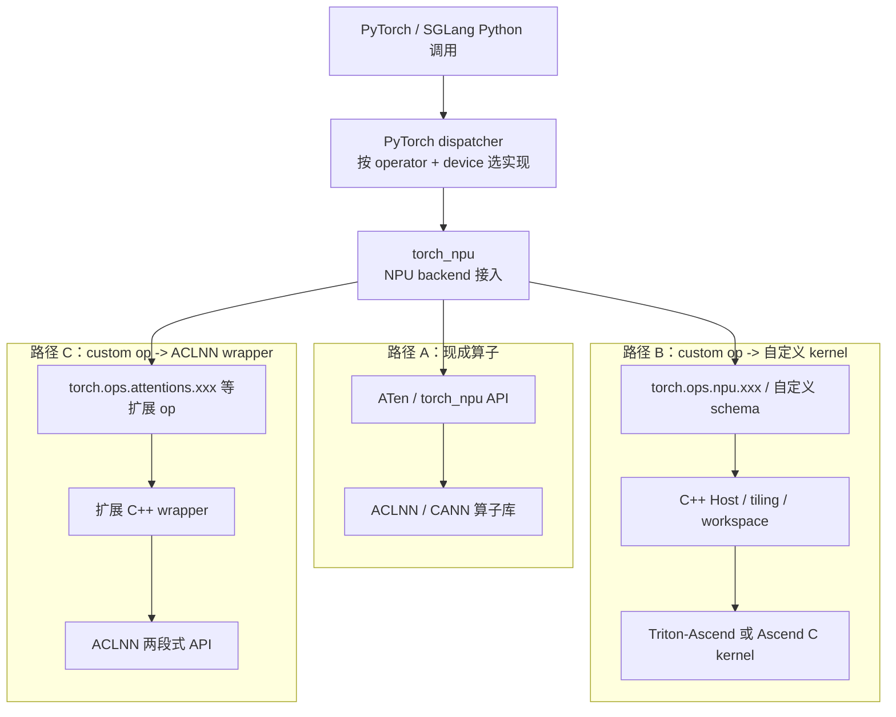

# torch_npu 01：Dispatcher、ACLNN 与 Custom Op 的边界

本章承接 [`../01-stack-and-relationships.md`](../01-stack-and-relationships.md)、[`../02-cann-stack-and-boundaries.md`](../02-cann-stack-and-boundaries.md)、[`../ascend-c/02-add-operator-end-to-end.md`](../ascend-c/02-add-operator-end-to-end.md) 和 [`../sgl-kernel-npu/01-repository-and-op-lifecycle.md`](../sgl-kernel-npu/01-repository-and-op-lifecycle.md)。

本章重点是同一个输入怎样从 Python `torch.Tensor` 变成 C++ `at::Tensor`，再进入 ACLNN descriptor 或 custom kernel 地址参数。完整类型边界见[代码阅读手册](../reference/code-reading-and-types.md)。

前几章已经解释了“有哪些层”。这一章往下再沉一层，回答一个初学者最容易混淆的问题：

> 同样都是一行 PyTorch 风格调用，为什么有时是在复用现成 ACLNN 算子，有时是在走 `torch.ops.*` 注册的 custom op，有时又是“自己注册了一个 op，但底层仍然复用 ACLNN”？

如果这里不分清，后面读 `sgl-kernel-npu`、`torch_npu` 和 profiling 结果时，很容易把三类东西混成一句“反正都是 NPU 算子”。

> 前置章节：
> [`../01-stack-and-relationships.md`](../01-stack-and-relationships.md)
> [`../02-cann-stack-and-boundaries.md`](../02-cann-stack-and-boundaries.md)
> [`../sgl-kernel-npu/01-repository-and-op-lifecycle.md`](../sgl-kernel-npu/01-repository-and-op-lifecycle.md)
>
> 读完下一步：
> [`../sgl-kernel-npu/02-triton-fused-split-qk-norm.md`](../sgl-kernel-npu/02-triton-fused-split-qk-norm.md)
> [`../sgl-kernel-npu/03-ascend-c-apply-token-bitmask.md`](../sgl-kernel-npu/03-ascend-c-apply-token-bitmask.md)

## 1. 学习目标

读完本章后，你应能独立回答：

- `torch_npu` 到底负责哪一层，为什么它不等于 ACLNN，也不等于所有 `torch.ops.npu.*`；
- `dispatcher` 为什么会反复出现，以及它如何把 PyTorch 调用送到 NPU backend；
- `PrivateUse1` 为什么总在源码里出现，它和用户看到的 `torch.npu`、`.npu()` 是什么关系；
- `ACLNN` 的两段式接口为什么总是 `GetWorkspaceSize + 真正执行函数`；
- 为什么“custom op”不一定意味着“自己写了 device kernel”；
- 遇到一个真实热点时，应该先改 `torch_npu`、改 custom glue，还是改 Triton/Ascend C kernel。

## 2. 前置知识

建议先具备三点：

- 已知道 `torch_npu` 是 PyTorch 到 Ascend 的设备后端，不是独立框架；
- 已知道 `sgl-kernel-npu` 可以混合 Triton、Ascend C、C++ 和现成算子库；
- 已知道一个“算子”除了 device kernel，还可能包含 schema、Host 校验、tiling、workspace 和 Python wrapper。

如果这三点还不稳，先回到前置章节。

## 3. 直观类比：同一个收费站，后面可能接三条路

把 PyTorch 调用想成“开车到高速收费站”最容易建立直觉。

- **`dispatcher`**（分发器，按算子名、device、dtype 等条件选择实现的机制；术语表见 [`../reference/glossary.md`](../reference/glossary.md)）就是收费站入口；
- **`torch_npu`** 是把 “NPU 车道” 挂到收费站上的那层；
- **ACLNN** 是已经修好的标准高速路，很多常见算子直接走它；
- **custom op 注册** 是你自己新开了一个收费口名字，但后面可能接两种完全不同的路：
  - 接到你自己写的 Triton / Ascend C kernel；
  - 也可能只是接到一条现成 ACLNN 高速，只是你在入口多包了一层参数整理。

所以，**“看起来都是 PyTorch 调用”不代表“底层都是同一类实现”**。

## 4. 一张图先看三条真实路径



图里最关键的观察有四个：

1. `torch_npu` 先把 NPU backend 注册给 PyTorch，后面三条路才能进入 NPU 世界。
2. 现成算子路径和 custom op 路径都会经过同一个 PyTorch dispatcher。
3. custom op 只是“入口合同不同”，不自动说明底层是自写 kernel。
4. ACLNN 不只会出现在 `torch_npu.npu_*` API 后面，也可能出现在扩展库自己的 C++ wrapper 后面。

## 5. `torch_npu` 到底做了什么

先看当前官方 `torch_npu` 源码基线：`Ascend/pytorch@86986b9711ef597e83edc41da1f02c34a03fea7b`，这是 2026-07-04 核对到的远端 `HEAD`。

官方 README 把它定义为 “Ascend Extension for PyTorch”，也明确说发行形态就是 Python 包 `torch_npu`：

- [`README.md#L5-L7`](https://github.com/Ascend/pytorch/blob/86986b9711ef597e83edc41da1f02c34a03fea7b/README.md#L5-L7)

更关键的是它的初始化顺序：

- [`torch_npu/__init__.py#L47-L64`](https://github.com/Ascend/pytorch/blob/86986b9711ef597e83edc41da1f02c34a03fea7b/torch_npu/__init__.py#L47-L64)
- [`torch_npu/_init/registry/registry_manager.py#L101-L121`](https://github.com/Ascend/pytorch/blob/86986b9711ef597e83edc41da1f02c34a03fea7b/torch_npu/_init/registry/registry_manager.py#L101-L121)

这里第一次出现的 **backend registration** 可以先这样理解：它不是“执行某个算子”，而是“告诉 PyTorch：以后看到 NPU tensor 时，应该启用哪套设备后端规则”。为什么需要它？因为 PyTorch 默认并不认识 Ascend NPU。和相近概念的区别是：它不是 kernel launch，也不是 op schema 注册。

## 6. `PrivateUse1` 是什么，为什么它最后会变成 `torch.npu`

初学者最容易被 `PrivateUse1` 这个名字吓到。其实它不神秘。

- **通俗直觉**：PyTorch 先预留了一条“给外部设备后端接入的保留车道”。
- **精确定义**：`PrivateUse1` 是 PyTorch 给外部设备 backend 预留的 device type / dispatch key。
- **为什么需要它**：这样像 `torch_npu` 这样的后端不需要改写 PyTorch 全部核心枚举，就能接入自己的设备语义。
- **和相近概念的区别**：`PrivateUse1` 不是 NPU 硬件名，也不是某个算子库；它是 PyTorch dispatch 体系里的占位 backend。

官方 `torch_npu` Python 注册代码直接把这条保留车道重命名成 `npu`：

- [`torch_npu/_init/registry/backend.py#L6-L25`](https://github.com/Ascend/pytorch/blob/86986b9711ef597e83edc41da1f02c34a03fea7b/torch_npu/_init/registry/backend.py#L6-L25)

从这几行可以读出四件事：

1. `torch.utils.rename_privateuse1_backend("npu")`：把保留 backend 名字改成用户看得懂的 `npu`；
2. `torch._register_device_module("npu", torch_npu.npu)`：把 `torch.npu` 这套 Python 模块挂进去；
3. `generate_methods_for_privateuse1_backend(...)`：自动生成 `Tensor.npu()`、`Module.npu()`、`Storage.npu()` 这类方法；
4. 因此，用户写的 `.npu()` 只是前端入口，底层仍然在走 `PrivateUse1` 这条 backend 车道。

更底层的 C++ 侧也做了同样的注册：

- [`torch_npu/csrc/core/npu/impl/NPUGuardImpl.cpp#L287-L301`](https://github.com/Ascend/pytorch/blob/86986b9711ef597e83edc41da1f02c34a03fea7b/torch_npu/csrc/core/npu/impl/NPUGuardImpl.cpp#L287-L301)

它把 storage、hooks 和 JIT metadata 一起挂到 `PrivateUse1` 上。这说明：

> `torch.npu` 只是用户可见名字；`PrivateUse1` 才是 PyTorch 内部 dispatch 世界里的真实 backend 身份证。

## 7. `ACLNN` 到底是什么，不是什么

前文已经说过，**ACLNN**（术语表见 [`../reference/glossary.md`](../reference/glossary.md)）是 CANN 提供的一类高层算子接口 / 算子库入口。

这里再把边界压实一点：

- 它通常代表“已有的 NPU 算子能力”；
- 它不是 `torch_npu` 的别名；
- 它也不是 `torch_npu/npu/aclnn/` 这个 Python 目录本身。

这一点很容易误解。官方 `CONTRIBUTING.md` 对目录分工写得很清楚：

- [`CONTRIBUTING.md#L38-L47`](https://github.com/Ascend/pytorch/blob/86986b9711ef597e83edc41da1f02c34a03fea7b/CONTRIBUTING.md#L38-L47)

里面明确区分了：

- `torch_npu/csrc/framework`：`OpCommand`、kernel 调度、算子构建器；
- `torch_npu/npu/aclnn`：ACLNN 相关 Python 接口层。

第一次出现的 **`OpCommand`** 可以先理解成“在 `torch_npu` 里打包一次 NPU 算子调用的命令对象”。为什么需要它？因为 Host 侧不仅要知道“调用哪个 op”，还要管理 stream、custom handler、异步执行等细节。和 `dispatcher` 的区别是：dispatcher 负责“选哪条路”，`OpCommand` 更像已经选好路之后的“发车动作”。

官方 `torch_npu/npu/aclnn/__init__.py` 也说明了一个细节：

- [`torch_npu/npu/aclnn/__init__.py#L14-L16`](https://github.com/Ascend/pytorch/blob/86986b9711ef597e83edc41da1f02c34a03fea7b/torch_npu/npu/aclnn/__init__.py#L14-L16)
- [`torch_npu/npu/aclnn/__init__.py#L53-L60`](https://github.com/Ascend/pytorch/blob/86986b9711ef597e83edc41da1f02c34a03fea7b/torch_npu/npu/aclnn/__init__.py#L53-L60)

这里暴露的主要是 ACLNN 相关 backend 开关，例如 `allow_hf32`，而不是“所有 ACLNN 算子的 Python 名字都写在这里”。这再次说明：**ACLNN 是一层算子能力，不等于某一个 Python 文件夹。**

## 8. 最小例子：三种长得像 PyTorch 调用的 NPU op

下面把所有输入显式构造出来，使用真实 API 语法。它要求匹配版本的 `torch_npu`、`sgl_kernel_npu` 与 attention 扩展已经安装；当前工作区不具备 NPU 环境，因此只做静态解读：

```python
import torch
import torch_npu
import sgl_kernel_npu

x = torch.randn(1, 4096, device="npu", dtype=torch.float16)
y = torch.randn_like(x)
weight = torch.ones(4096, device="npu", dtype=torch.float16)
bias = torch.zeros(4096, device="npu", dtype=torch.float16)
bitmask = torch.full((1, 128), -1, device="npu", dtype=torch.int32)

z = x + y
u = torch_npu.npu_rms_norm(x, weight, 1e-6)[0]
v = torch.ops.npu.apply_token_bitmask(x, bitmask)
w = torch.ops.attentions.layernorm(x, [4096], weight, bias, 1e-5, 0)[0]
```

逐行理解：

1. `z = x + y`
   直觉上最像“标准 ATen 算子在 NPU backend 上执行”，优先走现成实现。
2. `torch_npu.npu_rms_norm(...)`
   显式调用 `torch_npu` 暴露的 NPU 专用 API，通常仍是在复用现成算子能力。
3. `torch.ops.npu.apply_token_bitmask(...)`
   这是 `sgl-kernel-npu` 导入后注册进来的 custom op，底层会走它自己的 Host 和 device kernel。
4. `torch.ops.attentions.layernorm(...)`
   这是另一个扩展注册入口，但底层并不是自写 LayerNorm device kernel，而是包装现成 ACLNN 调用。

这四行长得都像“PyTorch 调用”，但底层含义已经分成三类。

从类型角度看，`x/y/weight/bias/bitmask` 都是 Python `torch.Tensor`，但 `bitmask` 的元素 dtype 是 `int32`，其 128 个整数各自打包 32 个词表位置；其余 tensor 是 FP16。`torch_npu.npu_rms_norm` 是 Python callable，返回 tuple-like 结果，所以 `[0]` 是取第一个返回 tensor；`torch.ops.npu.apply_token_bitmask` 与 `torch.ops.attentions.layernorm` 是 dispatcher op packet。它们的“Python 调用外形”不能说明 device 实现类型，必须继续追到 schema、dispatch key 和 Host 函数。

这条跨层类型链应当能在脑中展开：

```text
Python torch.Tensor
  -> Dispatcher 根据 schema/dispatch key 选择实现
  -> C++ at::Tensor（仍携带 shape/stride/dtype/device）
  -> ACLNN tensor descriptor，或 custom kernel 的 device address + 标量参数
  -> NPU 执行
```

## 9. 逐层源码解读

### 9.1 `torch_npu` import 之后发生了什么

官方 README 说明从 `torch_npu 2.5.1` 开始，普通用户代码里不再一定要手写 `import torch_npu` 才能体验 `.npu()`：

- [`README.md#L208-L215`](https://github.com/Ascend/pytorch/blob/86986b9711ef597e83edc41da1f02c34a03fea7b/README.md#L208-L215)

但这不等于 `torch_npu` 在系统里不存在。它仍然是 NPU backend 的提供者，而很多扩展包会显式依赖它。

例如固定基线 `sgl-kernel-npu@b2378ee05769cf7df209ffc5e1b669728f435a7e` 的初始化代码就是：

- [`python/sgl_kernel_npu/sgl_kernel_npu/__init__.py#L5-L15`](https://github.com/sgl-project/sgl-kernel-npu/blob/b2378ee05769cf7df209ffc5e1b669728f435a7e/python/sgl_kernel_npu/sgl_kernel_npu/__init__.py#L5-L15)

它先 `import torch_npu`，再 `torch.ops.load_library(...)` 加载自己的 `libsgl_kernel_npu.so`。这说明：

- `sgl_kernel_npu` 不是绕过 `torch_npu` 单独接 PyTorch；
- 它是在 `torch_npu` 已经把 NPU backend 接进去之后，再加载自己的扩展注册。

### 9.2 为什么 `torch.ops.npu.apply_token_bitmask` 不属于 `torch_npu` 本体

继续看 `sgl-kernel-npu` 的注册代码：

- [`csrc/pytorch_extensions.cpp#L22-L149`](https://github.com/sgl-project/sgl-kernel-npu/blob/b2378ee05769cf7df209ffc5e1b669728f435a7e/csrc/pytorch_extensions.cpp#L22-L149)
- [`csrc/pytorch_extensions.cpp#L153-L235`](https://github.com/sgl-project/sgl-kernel-npu/blob/b2378ee05769cf7df209ffc5e1b669728f435a7e/csrc/pytorch_extensions.cpp#L153-L235)

这里做了两件分开的事：

- `TORCH_LIBRARY_FRAGMENT(npu, m)`：声明 schema，也就是“这个 op 在 PyTorch 世界长什么样”；
- `TORCH_LIBRARY_IMPL(npu, PrivateUse1, m)`：把 NPU backend 的实现函数挂上去。

因此 `torch.ops.npu.apply_token_bitmask` 的真正归属不是看 namespace，而是看：

1. 谁在 import 时 `load_library`；
2. 哪个 `.cpp` 文件注册了 schema；
3. `m.impl(...)` 最终指向哪个 Host 函数；
4. Host 函数是继续调自写 kernel，还是调现成算子库。

这也是为什么“看到 `torch.ops.npu.*` 就断言实现来自 `torch_npu` 仓库”是错误的。

### 9.3 为什么有些扩展 op 自己注册，但底层还是 ACLNN

`sgl-kernel-npu` 中的 attention plugin 提供了一个非常典型的混合路径。

先看注册入口：

- [`csrc/attentions/csrc/plugin/register_ops.cpp#L21-L63`](https://github.com/sgl-project/sgl-kernel-npu/blob/b2378ee05769cf7df209ffc5e1b669728f435a7e/csrc/attentions/csrc/plugin/register_ops.cpp#L21-L63)

它注册了 `torch.ops.attentions.layernorm` 等扩展 op，并把 NPU backend 实现绑定到 `layernorm_npu`。

再看这个实现本身：

- [`csrc/attentions/csrc/plugin/layernorm.cpp#L22-L65`](https://github.com/sgl-project/sgl-kernel-npu/blob/b2378ee05769cf7df209ffc5e1b669728f435a7e/csrc/attentions/csrc/plugin/layernorm.cpp#L22-L65)

这里最值得读的不是数学，而是职责分工：

1. 先整理 `weight`、`bias` optional 参数；
2. 根据输入 shape 分配 `output / mean / rstd`；
3. 最后调用 `EXEC_NPU_CMD<"aclnnLayerNormWithImplMode">(...)`。

这就说明：

> 这个扩展库确实“自己注册了一个 op”，但它没有重写 LayerNorm device kernel，而是在 C++ wrapper 里复用现成 ACLNN 算子能力。

同样的模式在 `sparse_block_estimate` 中也能看到：

- [`csrc/attentions/csrc/plugin/sparse_block_estimate.cpp#L29-L83`](https://github.com/sgl-project/sgl-kernel-npu/blob/b2378ee05769cf7df209ffc5e1b669728f435a7e/csrc/attentions/csrc/plugin/sparse_block_estimate.cpp#L29-L83)

这说明该模式不是一次性的特例。

### 9.4 `ACLNN` 两段式接口到底长什么样

第一次见到 `GetWorkspaceSize`、`aclOpExecutor`、`stream` 时，很多人会以为这是“底层实现细节，先跳过”。这一步其实必须看懂。

- **`workspace`**：算子运行时额外需要的 NPU 全局临时空间；
- **`aclOpExecutor`**：可以把它理解成“已经编排好这次算子执行流程的句柄”；更集中定义见 [`../reference/glossary.md`](../reference/glossary.md)；
- **两段式接口**：先询问“这次 shape 需要多大 workspace、生成什么 executor”，再真正执行。

在 `sgl-kernel-npu` 的 DeepEP op API 头文件里，这个契约写得很清楚：

- [`csrc/deepep/ops/op_host/op_api/aclnn_dispatch_ffn_combine.h#L24-L59`](https://github.com/sgl-project/sgl-kernel-npu/blob/b2378ee05769cf7df209ffc5e1b669728f435a7e/csrc/deepep/ops/op_host/op_api/aclnn_dispatch_ffn_combine.h#L24-L59)

它明确分成：

1. `aclnnDispatchFFNCombineGetWorkspaceSize(...)`
   计算 workspace 大小并返回 executor；
2. `aclnnDispatchFFNCombine(workspace, workspaceSize, executor, stream)`
   真正执行。

对应的实现也只是把请求继续传给 `aclnnInner...`：

- [`csrc/deepep/ops/op_host/op_api/aclnn_dispatch_ffn_combine.cpp#L32-L65`](https://github.com/sgl-project/sgl-kernel-npu/blob/b2378ee05769cf7df209ffc5e1b669728f435a7e/csrc/deepep/ops/op_host/op_api/aclnn_dispatch_ffn_combine.cpp#L32-L65)

而 `EXEC_NPU_CMD` 这个 helper 则把两段式流程收拢成统一的 C++ 模板：

- [`csrc/deepep/pytorch_npu_helper.hpp#L535-L584`](https://github.com/sgl-project/sgl-kernel-npu/blob/b2378ee05769cf7df209ffc5e1b669728f435a7e/csrc/deepep/pytorch_npu_helper.hpp#L535-L584)

从这段宏能读出完整步骤：

1. 先动态拿到 `aclnn_api` 和 `aclnn_apiGetWorkspaceSize` 的函数地址；
2. 用当前 NPU stream 和输入参数调用 `GetWorkspaceSize`；
3. 按返回值分配 workspace tensor；
4. 再把 `(workspace, workspaceSize, executor, stream)` 提交给真正执行函数；
5. 最外层再通过 `OpCommand` 统一纳入 `torch_npu` 的执行框架。

这就是很多 profiling、报错和 Host 代码里反复出现 `workspace / executor / stream` 三件套的根本原因。

## 10. 如何判断一个热点应该改哪层

| 现象 | 更可能该看哪层 | 原因 |
|---|---|---|
| 标准 `torch.add`、`torch.matmul`、`torch_npu.npu_*` 结果不对或缺失 | `torch_npu` / ACLNN / CANN | 先确认现成算子路径是否可用 |
| `torch.ops.npu.xxx` 找不到 | 扩展 `.so` 加载、schema 注册 | 常见原因是 `load_library` 没发生，不是 kernel 坏了 |
| 有 `torch.ops.*`，但 Host 里最后调的是 `EXEC_NPU_CMD<aclnnFoo>` | custom glue / 参数整理 | 底层复用现成 ACLNN，先别急着重写 kernel |
| Host 里最后是 `EXEC_KERNEL_CMD(...)` 或 Triton launch | Triton / Ascend C kernel | 这才是真正的自写 device kernel 路径 |
| 某 shape 下只报 workspace 不足或 `GetWorkspaceSize` 失败 | ACLNN 两段式接口 / shape 合法性 | 先查输入契约、workspace 与 executor 生成 |
| tracing 里反复出现 `aclnn...` 名字 | 现成 ACLNN 或 ACLNN wrapper | 不一定是 `torch_npu` 直接暴露的 Python API，也可能是扩展 C++ wrapper |

一个实用决策树：

```text
这是不是标准 ATen / torch_npu 已覆盖的能力？
  ├─ 是：先看 torch_npu / ACLNN / CANN
  └─ 否：这是扩展注册的 op 吗？
       ├─ 是：Host 最终调 ACLNN 还是自写 kernel？
       │    ├─ ACLNN：先改 custom glue / 参数 / shape / workspace
       │    └─ 自写 kernel：再下沉到 Triton 或 Ascend C
       └─ 否：继续追 import、schema、m.impl、launch 路径
```

## 11. 常见错误

1. **“`torch_npu` 就是 ACLNN。”** 不对。`torch_npu` 是 PyTorch 后端与扩展，ACLNN 是其常复用的一类 CANN 算子能力。
2. **“`torch.ops.npu.*` 一定来自 `torch_npu` 仓库。”** 不对。扩展库 `load_library` 后也能注册到这个 namespace。
3. **“注册了 custom op，就一定自己写了 device kernel。”** 不对。它也可能只是一个 ACLNN wrapper。
4. **“看见 `PrivateUse1` 说明代码还没完成。”** 不对。它本来就是 PyTorch 给外部设备后端预留的正式接入点。
5. **“`torch_npu/npu/aclnn/` 目录就是所有 ACLNN 算子的实现文件。”** 不对。那个 Python 目录更偏配置和接口层，不等于底层算子库本身。

## 12. 调试与性能定位

| 现象 | 第一检查点 | 为什么先看这里 |
|---|---|---|
| `torch.npu`、`.npu()` 不存在 | `torch_npu` backend 是否完成注册 | 先确认 NPU backend 有没有挂到 `PrivateUse1` |
| `import sgl_kernel_npu` 后 `torch.ops.npu.xxx` 仍不存在 | `__init__.py` 是否成功 `load_library` | op 没出现通常是注册链没跑通 |
| 自定义扩展 op 调用时报 `...GetWorkspaceSize not found` | ACLNN 动态库 / op API 是否存在 | 典型是 wrapper 找不到现成 ACLNN 符号 |
| 某扩展 op 结果对但性能一般 | Host 只是包了一层 ACLNN 还是自写 kernel | 如果只是 ACLNN wrapper，性能上限常受现成算子约束 |
| 某自写 kernel 报错，而标准 op 正常 | `m.impl -> Host -> launch` 链路 | 说明 NPU backend 活着，问题更可能在扩展自己的实现 |

如果没有 NPU 环境，当前工作区还能做的静态验证包括：

- 查 `load_library`、`TORCH_LIBRARY(_IMPL)`、`EXEC_NPU_CMD`、`EXEC_KERNEL_CMD`；
- 查 `torch_npu` 的 backend 注册顺序与目录分工；
- 查 pinned commit 下具体 op 的 Host 和 device 路径。

但不能声称：

- 已实际运行某个 ACLNN op；
- 已确认某 kernel 在真实 Ascend 机器上的性能结论；
- 已验证某个 workspace / stream 问题在目标环境复现。

## 13. 练习

1. 任意找一个 `torch.ops.*` 调用，沿着 `load_library -> schema -> m.impl -> Host -> launch` 画出自己的调用链。
2. 在 `sgl-kernel-npu` 中各找一个例子，分别证明“custom op -> 自写 kernel”和“custom op -> ACLNN wrapper”这两条路径都真实存在。
3. 假设 profiling 里看见 `aclnnLayerNormWithImplMode`，先写出你会如何判断这是 `torch_npu` 直接暴露的路径，还是某个扩展库包了一层 wrapper。

## 14. 自测问题与参考答案

### 1. `torch_npu` 为什么先要把 `PrivateUse1` 重命名成 `npu`？

**答案：**`PrivateUse1` 是 PyTorch 为外部设备后端预留的通用槽位名，不是用户友好的设备品牌。`torch_npu` 调用 `rename_privateuse1_backend("npu")` 后，PyTorch 才能把这个槽位以稳定、可读的 `npu` 名称暴露给 Python API，并进一步生成 `Tensor.npu()`、`Module.npu()` 等便利方法。

重命名解决的是框架标识与用户接口问题，不会把硬件“转换”为另一种设备，也不改变底层 dispatch key 的机制。C++ 注册中仍经常看到 `PrivateUse1`，因为实现绑定依赖的是 PyTorch 预留 key；Python 中看到 `device="npu"`，则是该 key 的公开名称。

初始化顺序很重要：应先注册/重命名 backend，再生成相关方法并加载依赖该名称的组件。否则用户代码、序列化或扩展注册可能看到不一致的设备名称。

### 2. `dispatcher`、`OpCommand`、`ACLNN` 分别负责哪一层？

**答案：**Dispatcher 负责“选哪个实现”，`OpCommand` 负责“在 `torch_npu` 框架层组织并提交一次 NPU op”，ACLNN 负责“提供可被 Host 调用的现成 NPU 算子接口与执行计划”。

- **Dispatcher** 根据 operator schema、dispatch key、tensor device 等选择 `CPU`、`PrivateUse1/NPU` 或其他 backend implementation。它不负责具体 RMSNorm 数学或设备指令。
- **`OpCommand`** 位于 `torch_npu` Host 框架层，在实现已被选中后组织输入输出、属性、stream、异步执行和 handler 等调用细节。
- **ACLNN** 是 CANN 算子能力入口。典型接口先计算 workspace 并返回 executor，再用 workspace、executor 与 stream 执行已经存在的设备实现。

三者是串联关系而不是同义词：dispatcher 可以选中一个完全不使用 `OpCommand` 的第三方 custom op；custom Host 函数也可以直接包装 ACLNN；只有追到最终 Host 调用才能知道实际走哪条路。

### 3. 为什么 `torch.ops.npu.xxx` 的 namespace 不能直接说明实现归属？

**答案：**PyTorch namespace 是动态注册表中的逻辑名字。`torch_npu` 可以向 `npu` 注册，`sgl-kernel-npu` 或其他 `.so` 被加载后同样可以用 `TORCH_LIBRARY_FRAGMENT(npu, m)` 追加 schema。

因此，调用入口的完整名字只回答“dispatcher 中的 schema 名是什么”，不回答“谁注册、Host 函数在哪个仓库、最终调用 ACLNN 还是自写 kernel”。即使两个 op 都位于 `torch.ops.npu`，一个可能来自 `torch_npu`，另一个可能来自 `libsgl_kernel_npu.so`。

判断归属要沿证据链查：Python import/load_library → `m.def` → 对应 dispatch key 的 `m.impl` → Host C++ 函数 → `EXEC_NPU_CMD`、`EXEC_KERNEL_CMD` 或 Triton launch。仅凭 namespace 猜测，会把调用合同和实现所有权混为一谈。

### 4. 为什么“custom op”不自动等于“自写 device kernel”？

**答案：**Custom op 只表示这个 operator schema/绑定不是当前 PyTorch 核心默认提供的；它描述框架扩展边界，不描述 device 计算的来源。

扩展作者可以注册一个新 schema，Host 实现内部再调用 `aclnnLayerNorm` 等现成 ACLNN 接口。这仍是 custom op，因为 Python/dispatcher 入口由扩展定义，但数学 kernel 由供应方算子库提供。另一种 custom op 才可能用 `EXEC_KERNEL_CMD` 启动自己编译的 Ascend C kernel，或进入 Triton wrapper。

这一区分影响维护和排错：ACLNN wrapper 的问题优先看参数转换、版本/符号、workspace 与 stream；自写 kernel 还要检查 tiling、地址、设备代码与构建产物。不能看到 `torch.ops.*` 就假设存在同名 `.cpp` device kernel。

### 5. `GetWorkspaceSize`、`workspace`、`aclOpExecutor` 和 `stream` 四者之间是什么关系？

**答案：**它们组成 ACLNN 常见的两阶段执行协议。

第一阶段 `aclnnFooGetWorkspaceSize(...)` 检查/解析输入描述，生成本次调用的执行计划，返回所需临时空间字节数和 `aclOpExecutor*`。Host 随后在 NPU 上分配至少这么大的 workspace。第二阶段执行接口接收 workspace 地址与大小、同一个 executor 以及当前 stream，把任务异步提交到设备。

`workspace` 是这次执行需要的 device scratch，不是输出 tensor，也不是 UB；executor 是 Host/Runtime 侧对已准备执行计划的句柄，不是工作内存；stream 决定任务与前后 NPU 操作的顺序和异步语义。四者必须属于同一轮调用契约，不能拿 A 输入生成的 executor 配 B 输入，也不能在异步任务完成前释放 workspace 或其依赖 storage。

### 6. 如果某个扩展 Host 代码最终调用的是 `EXEC_NPU_CMD<aclnnFoo>`，最先该怀疑哪个层面的 bug？

**答案：**先检查扩展 Host wrapper 与 ACLNN/CANN 接口边界，而不是先假设扩展仓库里有一个需要修改的自写 device kernel。

优先核对输入 shape/dtype/layout、optional 参数转换、输出分配、ACLNN 符号与 CANN 版本、GetWorkspaceSize 返回值、workspace 生命周期、executor 是否有效以及当前 stream。若报 `...GetWorkspaceSize not found`，首先是动态库/版本/符号可用性；若 ACLNN 返回参数错误，先对照其接口合同；若只在异步执行时偶现，检查 stream 与 storage 生命周期。

当然，上游也可能传错数据，ACLNN 本身也可能有缺陷，但源码证据表明 device 实现不在这个扩展中时，盲改扩展的 Ascend C/Triton 目录没有因果依据。应先构造最小 ACLNN wrapper 复现，确认问题位于参数胶水、运行环境还是供应方算子实现。

## 官方源码与文档

- [Ascend Extension for PyTorch README](https://github.com/Ascend/pytorch/blob/86986b9711ef597e83edc41da1f02c34a03fea7b/README.md)
- [torch_npu `__init__.py`：导入时初始化顺序](https://github.com/Ascend/pytorch/blob/86986b9711ef597e83edc41da1f02c34a03fea7b/torch_npu/__init__.py#L47-L64)
- [torch_npu backend 注册：`rename_privateuse1_backend("npu")`](https://github.com/Ascend/pytorch/blob/86986b9711ef597e83edc41da1f02c34a03fea7b/torch_npu/_init/registry/backend.py#L6-L25)
- [torch_npu registry manager：组件注册顺序](https://github.com/Ascend/pytorch/blob/86986b9711ef597e83edc41da1f02c34a03fea7b/torch_npu/_init/registry/registry_manager.py#L101-L121)
- [torch_npu C++ backend 注册：`PrivateUse1` hooks](https://github.com/Ascend/pytorch/blob/86986b9711ef597e83edc41da1f02c34a03fea7b/torch_npu/csrc/core/npu/impl/NPUGuardImpl.cpp#L287-L301)
- [torch_npu 目录分工说明](https://github.com/Ascend/pytorch/blob/86986b9711ef597e83edc41da1f02c34a03fea7b/CONTRIBUTING.md#L38-L47)
- [sgl-kernel-npu `__init__.py`：导入并加载共享库](https://github.com/sgl-project/sgl-kernel-npu/blob/b2378ee05769cf7df209ffc5e1b669728f435a7e/python/sgl_kernel_npu/sgl_kernel_npu/__init__.py#L5-L15)
- [sgl-kernel-npu `pytorch_extensions.cpp`：schema 与 `PrivateUse1` 实现绑定](https://github.com/sgl-project/sgl-kernel-npu/blob/b2378ee05769cf7df209ffc5e1b669728f435a7e/csrc/pytorch_extensions.cpp#L22-L235)
- [attention plugin 注册：`torch.ops.attentions.*`](https://github.com/sgl-project/sgl-kernel-npu/blob/b2378ee05769cf7df209ffc5e1b669728f435a7e/csrc/attentions/csrc/plugin/register_ops.cpp#L21-L63)
- [attention plugin LayerNorm：custom wrapper -> ACLNN](https://github.com/sgl-project/sgl-kernel-npu/blob/b2378ee05769cf7df209ffc5e1b669728f435a7e/csrc/attentions/csrc/plugin/layernorm.cpp#L22-L65)
- [attention plugin Sparse Block Estimate：另一条 ACLNN wrapper 证据](https://github.com/sgl-project/sgl-kernel-npu/blob/b2378ee05769cf7df209ffc5e1b669728f435a7e/csrc/attentions/csrc/plugin/sparse_block_estimate.cpp#L29-L83)
- [DeepEP ACLNN op API 头文件：两段式 `GetWorkspaceSize -> execute`](https://github.com/sgl-project/sgl-kernel-npu/blob/b2378ee05769cf7df209ffc5e1b669728f435a7e/csrc/deepep/ops/op_host/op_api/aclnn_dispatch_ffn_combine.h#L24-L59)
- [DeepEP helper：`EXEC_NPU_CMD` 如何统一提交 ACLNN 调用](https://github.com/sgl-project/sgl-kernel-npu/blob/b2378ee05769cf7df209ffc5e1b669728f435a7e/csrc/deepep/pytorch_npu_helper.hpp#L535-L584)
- [torch_npu API index](https://github.com/Ascend/pytorch/blob/86986b9711ef597e83edc41da1f02c34a03fea7b/docs/api/torch_npu_apis.md)

> 源码基线：
> `torch_npu@86986b9711ef597e83edc41da1f02c34a03fea7b`
> `sgl-kernel-npu@b2378ee05769cf7df209ffc5e1b669728f435a7e`
>
> 验证范围：
> 本章只做了官方源码、目录、行号与 Markdown 静态核对；当前工作区没有 Ascend NPU / CANN 运行环境，因此没有声称真实执行任何 NPU kernel 或 ACLNN 算子。
