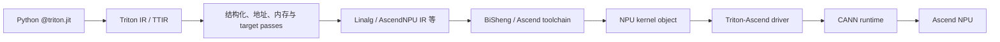

**中文** | [English](./03-compile-debug-optimize_EN.md)

# Triton-Ascend 03：编译、调试与性能优化

这一章把“能跑”变成“知道为什么这样跑，并能系统调优”。

调试的第一步不只是打印数值，而是写出每个 IR value 的类型。这里沿用[代码阅读手册](../reference/code-reading-and-types.md)的四列：前端对象、编译期/运行时、dtype/shape、值或地址。

## 1. 编译链的心智模型

Triton-Ascend 官方架构将核心组件分为 language extension、compiler 和 driver。简化链路：



这条链解释了三类问题的归属：

- Python kernel 数学/地址错：用户 kernel；
- 某 Triton op 无法 lowering：Triton-Ascend compiler；
- object 加载、stream 或 launch 错：driver/CANN 环境。

## 2. JIT 缓存和编译变体

影响变体的常见因素：

- `tl.constexpr` meta-parameter；
- dtype；
- 某些 shape/stride 是否作为 specialization；
- compiler options；
- target hardware 与 CANN/Triton-Ascend 版本。

Benchmark 首次调用时可能包含编译时间，不能拿第一次 wall time 当稳定 kernel latency。

## 3. 正确性优先的调试顺序

```text
1. 用最小 shape 复现
2. 与 PyTorch/torch_npu reference 对比
3. 覆盖刚好整除和不整除 BLOCK 的 shape
4. 检查每个 pointer 的 shape/stride/dtype
5. 检查 mask 与 other
6. 检查归约精度和输出 cast
7. 再检查编译器或硬件问题
```

不要一上来就怀疑编译器。地址和边界错误的概率通常更高。

第 4 步要具体到下面这种记录，而不是只写“这是一个 tensor”：

| 检查对象 | 应记录的内容 | 典型错误 |
|---|---|---|
| kernel pointer 形参 | `pointer<element_dtype>[]` | wrapper 传错 dtype，导致 JIT 生成了不同变体 |
| pointer arithmetic 结果 | `pointer<element_dtype>[block shape]` | 广播出意外二维/三维地址块，UB 预算暴涨 |
| offset | 整数标量或整数 block，单位为元素 | 把字节 stride 当元素 stride，地址成倍偏移 |
| mask | `int1[pointer block shape]` | shape 虽能广播，但保护了错误维度 |
| `tl.load` 结果 | `element_dtype[pointer block shape]` | 误以为构造 pointer 时已经读了内存 |

若报 `cannot add pointers together` 或 pointer 与 float 不兼容，这通常是 Triton 前端 [`semantic.add`](https://github.com/triton-lang/triton-ascend/blob/be90ac7e52267822c0ea83d20b705c1e4eaf586f/python/triton/language/semantic.py#L226-L255) 的类型错误，尚未进入 Ascend lowering；若类型和 TTIR 都正确但 `ttadapter` 生成失败，才更像后端 pass 问题。

## 4. 编译期与运行时调试

Triton 提供的思路包括：

| 工具 | 阶段 | 用途 |
|---|---|---|
| `tl.static_assert` | 编译期 | 验证 meta-parameter 约束 |
| `tl.static_print` | 编译期 | 查看静态对象/shape 信息 |
| `tl.device_assert` | 运行时 | 检查 device 条件，需相应 debug 配置 |
| `tl.device_print` | 运行时 | 小规模查看 device 值，开销很大 |
| dump IR/compiler log | 编译期 | 定位 lowering 与 pass 问题 |
| profiling trace | 运行时 | 分析 launch、kernel、搬运与空洞 |

Device print 只适合极小输入，不能在生产 shape 上随意打印整块 tensor。

## 5. NPU 上首先检查 Grid

Triton-Ascend 官方指南明确提醒：直接迁移 GPU kernel 的超大 grid 可能产生多轮任务下发和显著开销。

Vector kernel 的常见改写：

```text
迁移前：grid = num_tiles，每个 program 处理一个 tile
迁移后：grid = num_vectorcore，每个 program 循环处理多个 tile
```

观察指标：

- kernel launch 次数；
- 每个 program 的有效工作量；
- 物理核是否利用充分；
- 核间负载是否均衡；
- 尾核是否几乎没工作。

## 6. UB 预算

对 Vector kernel，粗略列出一个 tile 同时存活的 block tensor：

```text
input x       BLOCK * sizeof(dtype)
input y       BLOCK * sizeof(dtype)
output        BLOCK * sizeof(dtype)
FP32 temp     BLOCK * 4
mask/index    额外空间
double buffer 可能再乘 2
```

编译器会做复用和优化，但这个手算能帮助解释 UB overflow。遇到 overflow 时：

1. 降低 BLOCK；
2. 缩短同时存活的临时值；
3. 分阶段或重新融合；
4. 评估 dtype；
5. 检查是否无意广播出巨大中间 tensor。

## 7. 连续访问与离散访问

优先让 `tl.load` / `tl.store` 的最内层 offsets 连续。若 gather/scatter 无法避免：

- 批量加载索引；
- 先搬入 UB，再做局部选择；
- 合并小任务；
- 避免每个元素都走复杂 64 位地址计算；
- 单独测试边界与重复索引语义。

地址表达式不仅影响正确性，也影响 compiler 是否能识别连续访问并生成高效搬运。

## 8. Vector 优化清单

- grid 是否匹配物理 Vector Core 数；
- BLOCK 是否在 UB 容量内尽量增加有效搬运粒度；
- 读写是否连续、对齐；
- FP32 临时值是否过多；
- 多个逐元素阶段能否融合；
- reduction 是否用合理的 tile 与两阶段策略；
- Scalar 循环与分支是否过重。

## 9. Cube/CV 优化清单

- M/N/K 是否匹配 Cube 基本块与 dtype；
- BM/BN/BK 是否平衡复用、并行度和 Local Memory；
- A/B layout 是否导致额外转换；
- K-loop 是否可以流水；
- accumulator 是否过大；
- epilogue 是否值得与 matmul 融合；
- AIC/AIV 工作比例和同步是否合理。

## 10. Autotune 不是穷举魔法

`@triton.autotune` 可以在候选 config 中测试更优方案，但要控制：

- 候选必须满足硬件/内存约束；
- key 要代表性能真正变化的 shape 维度；
- 候选过多会显著增加首次运行时间；
- 带副作用的 kernel 需要 reset/restore 输入；
- 线上动态 shape 可能造成大量新编译和调优。

先用硬件常识裁剪搜索空间，再 autotune。

## 11. Benchmark 的基本纪律

```text
预热：触发 JIT、缓存、内存池与运行时初始化
同步：计时边界要正确处理异步 stream
重复：报告中位数/分位数，不只跑一次
多 shape：覆盖真实 prefill/decode 分布
Reference：同时验证数值正确性
端到端：microbenchmark 快不代表 serving 一定快
```

吞吐型指标可报告 GB/s 或 TFLOPS，但必须明确公式和实际读写字节，避免把缓存复用、padding 或融合后的流量算错。

## 12. Triton-Ascend 的特点、优势与局限

| 方面 | 评价 |
|---|---|
| 开发效率 | Python DSL，原型和融合通常较快 |
| 抽象层级 | program/tile 级，低于 PyTorch、高于手工 Ascend C |
| 可移植性 | 可复用 Triton 算法结构，但 NPU 仍需重做 grid、tile 和访问调优 |
| 性能控制 | 编译器承担较多；常见算子可很好，极端硬件细节控制不如原生路径直接 |
| 生态成熟度 | API、dtype、离散访问与编译优化仍随版本快速演进 |
| 适用场景 | 规则 Vector、归约、融合 epilogue、可 tile 化算子、快速验证 |
| 风险 | 编译缓存、动态 shape、UB overflow、版本兼容和 compiler limitation |

## 13. 本章检查点与参考答案

### 1. 为什么首次运行时间不能作为 kernel latency？

**答案：**首次调用可能混入 JIT 编译、动态库加载、runtime 初始化、缓存创建和内存池准备，而稳定 kernel latency 只想测设备执行及必要 launch 开销。

对于新的 dtype/meta-parameter 组合，Triton 需要生成 IR、运行 lowering、调用后端编译器并缓存产物；这些过程可能比 kernel 本身慢几个数量级。第一次创建 NPU context、stream 或 allocator 也有额外成本。

正确 benchmark 应先 warmup，确保目标变体已编译，再在正确的 stream 同步边界内重复计时并报告中位数/分位数。部署评估可以另行记录冷启动/JIT 时间，但不能把它与稳态 kernel latency 混成一个指标。

### 2. 哪些问题属于用户 kernel，哪些更可能属于 compiler/driver？

**答案：**可以按“语义 → lowering → launch/runtime”三层定位。

- **用户 kernel**：pointer/stride 公式、mask、归约单位元、dtype cast、grid、输出 shape 或 wrapper 契约错误。通常能在特定 shape 稳定复现，与简单 reference 不一致。
- **compiler/backend**：合法 Triton op 无法 lowering、某 IR pass 崩溃、生成代码在特定组合下错误、资源估算异常。需要最小 Triton reproducer、IR 和版本信息。
- **driver/runtime**：kernel object 加载失败、stream/device/context 错误、launch 参数 ABI、缓存文件或 CANN 环境问题。

定位顺序应先缩小输入并审查用户地址/边界，再确认 IR/编译，最后排查 runtime。因为用户 kernel 错误最常见，也最容易通过独立 reference 证伪。

### 3. 为什么 autotune 前要先做 UB 和硬件约束裁剪？

**答案：**autotune 只会在候选中测快慢，不会把本质非法或明显不合理的候选变成可用实现。

过大的 BLOCK 可能使输入、输出、FP32 accumulator 和 double buffer 超过 UB/L1/L0；不满足 Cube 基本块或 dtype 约束的 config 可能编译失败；grid 与物理核极不匹配的候选即使能跑也没有搜索价值。把这些全扔给 autotune 会增加编译时间、缓存、失败噪声，甚至触发 OOM/编译器错误。

应先根据 Local Memory 预算、对齐、基本块和真实 shape 删除非法候选，再让 autotune 在一个小而有意义的空间中比较。这叫“用硬件知识约束搜索”，不是用手工判断替代测量。

### 4. Microbenchmark 变快后还必须做什么验证？

**答案：**至少还要做完整正确性矩阵、真实 shape 分布和 SGLang 端到端验证。

Microbenchmark 可能只测了一个对齐 shape、热缓存和单 stream，遗漏尾块、动态 batch、graph capture、并发、内存峰值和 fallback。还可能出现单 kernel 快了，但前后新增 format cast/contiguous copy，整体反而变慢。

端到端应观察 TTFT、TPOT、吞吐、显存、CPU launch gap、graph replay、分布式和不同模型配置，并用 profiler 确认调用确实进入新 kernel。只有收益在目标业务分布中仍存在，才能称为有效优化。

### 5. NPU 迁移中 grid 为什么是第一批检查对象？

**答案：**grid 决定逻辑 program 数、每个 program 工作量和任务下发轮次，而 GPU 上常见的“大量小 program”策略未必适合 Ascend 的物理核规模和启动模型。

若直接复用 GPU grid，可能生成远多于 AIV/AIC 数量的 program，每个只处理很少数据，导致多轮下发、Scalar 初始化和调度开销占比过高。反过来，grid 太小又会让物理核空闲。

所以迁移初期应同时查看 `num_programs`、每 program tile、物理 Vector/Cube Core 数和负载均衡。常见修正是固定到物理核数量并在 program 内循环，但最终仍要根据小任务、尾块和真实 shape benchmark。

## 官方源码与文档

- [Triton-Ascend 架构设计](https://github.com/triton-lang/triton-ascend/blob/be90ac7e52267822c0ea83d20b705c1e4eaf586f/docs/zh/architecture_design_and_core_features.md)
- [Triton-Ascend Autotune Guide](https://github.com/triton-lang/triton-ascend/blob/be90ac7e52267822c0ea83d20b705c1e4eaf586f/docs/zh/autotune_guide.md)
- [Triton-Ascend UB Overflow 调试](https://github.com/triton-lang/triton-ascend/blob/be90ac7e52267822c0ea83d20b705c1e4eaf586f/docs/zh/debug_guide/ub_overflow.md)
- [Triton Debugging Guide](https://triton-lang.org/main/programming-guide/chapter-3/debugging.html)
