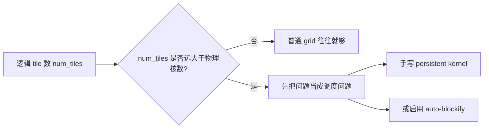
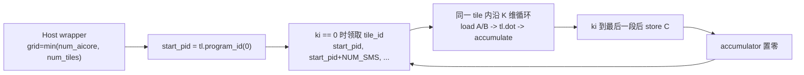

# Triton-Ascend 05：Persistent Kernel、大 Grid 与 Task Queue 边界

这一章补上 Triton-Ascend 课程里最容易“知道名字但没真想通”的一块：为什么 Ascend NPU 上经常不能把 GPU 风格的超大 grid 原样搬过来，为什么会出现 persistent kernel、`TRITON_ALL_BLOCKS_PARALLEL`、`enable_auto_blockify`、`TRITON_ENABLE_TASKQUEUE` 这些看起来都像“多任务调度”的词，但它们其实不在同一层。

本章源码基线固定为 [`triton-lang/triton-ascend@be90ac7`](https://github.com/triton-lang/triton-ascend/tree/be90ac7e52267822c0ea83d20b705c1e4eaf586f)。我在 2026-07-05 重新 fetch 了官方 `origin/main`，当前远端 `HEAD` 仍是这个 commit。

## 1. 学习目标

读完本章，你应该能做到：

- 解释为什么“逻辑 tile 很多”在 Ascend NPU 上首先会变成调度问题，而不只是算术问题。
- 区分三件事：手写 persistent kernel、编译器/driver 的 auto-blockify、大多数 launch 默认启用的 runtime task queue。
- 读懂官方 [`09-persistent-matmul.py`](https://github.com/triton-lang/triton-ascend/blob/be90ac7e52267822c0ea83d20b705c1e4eaf586f/third_party/ascend/tutorials/09-persistent-matmul.py) 里 `NUM_SMS`、`tiles_per_sm`、`ki`、`tile_id` 这些变量分别在干什么。
- 知道什么时候应该手写 persistent loop，什么时候更适合先试 `TRITON_ALL_BLOCKS_PARALLEL` / `enable_auto_blockify`。
- 做 benchmark 时不把“Host 提交异步返回”误判成“kernel 自身更快了”。

## 2. 前置知识

建议先读完：

- [Triton-Ascend 01：Program、Grid、Tile 与第一个 Kernel](./01-program-grid-tile.md)
- [Triton-Ascend 02：地址、广播、归约与矩阵分块](./02-tensor-addressing-reduction-matmul.md)
- [Triton-Ascend 03：编译、调试与性能优化](./03-compile-debug-optimize.md)
- [Triton-Ascend 04：TTIR、MLIR、Driver 与 Cache](./04-ttir-mlir-driver-and-cache.md)
- [基础 02：Ascend NPU、AI Core 与存储层级](../foundations/02-ascend-hardware.md)
- [基础 03：搬运、计算、同步与流水](../foundations/03-memory-pipeline-and-sync.md)
- [代码阅读手册：变量类型、形状、地址与源码实现](../reference/code-reading-and-types.md)
- [参考：术语表](../reference/glossary.md)

## 3. 先把五个新词就地讲清

这五个词第一次出现时，必须先在正文里讲明白。后面你仍然可以回查[术语表](../reference/glossary.md)，但第一次不能只把你丢给术语表。

- **逻辑 tile / 逻辑 block**：这是你在 Triton 代码里按输出空间切出来的“工作单元”。例如 matmul 里一个 `(BLOCK_SIZE_M, BLOCK_SIZE_N)` 输出块，就是一个逻辑 tile。它是“该做多少份工作”的概念，不等于“这次真的启动了多少物理核”。
- **物理核数**：这是当前设备真有多少个可执行这类工作的核心资源。对 matmul 这类 Cube 主导 kernel，官方样例从 `driver.active.utils.get_device_properties(device)["num_aicore"]` 读取；对纯 Vector kernel，通常更关心 `num_vectorcore`。为什么必须区分？因为逻辑 tile 可以成千上万，物理核通常只有几十个。
- **Persistent Kernel**：不是“永远不结束的 kernel”，而是“让有限数量的 program 常驻工作，循环处理多个逻辑 tile”的写法。它的目标是减少超大 grid 带来的多轮下发开销，让一个 program 不只干一块就退出。
- **Auto-blockify**：这是 Triton-Ascend 的编译期 pass 加运行期 launch 配合机制。直觉上，它是在“你的 kernel 逻辑还是按大 grid 写”的前提下，帮你把大量逻辑 block 折叠成“较少物理 block + 内层循环”。为什么需要它？因为有些 kernel 逻辑天然顺序无关，没必要手写 persistent loop。
- **Task Queue**：这是 launcher/runtime 层的异步提交模式。它回答的是“Host 调用是同步等 kernel 结束，还是先把任务交给运行时队列再返回”，不是“device kernel 内部如何领取逻辑 tile”。所以它和 persistent kernel 不是一回事。

一句话记忆：

```text
persistent kernel / auto-blockify 解决的是“一个 kernel 内部怎么把很多逻辑工作分给有限物理核”
task queue 解决的是“Host 把这次 launch 提交给 runtime 后要不要立刻返回”
```

## 4. 直观类比：固定车间、很多工单、一个派工窗口

把 NPU kernel launch 想成一个固定人数的车间：

- 逻辑 tile：一张张要加工的工单。
- 物理核：车间里真正能干活的工位。
- 普通大 grid：给每张工单都单独发一次派工单，工位一次只领一张，做完就退场。
- persistent kernel：先固定开出若干工位，让每个工位不断从工单堆里继续领活，直到工单做完。
- auto-blockify：工单原本还是按“一单一派工”写的，但派工系统在后台自动改成“每个工位批量领活”。
- task queue：前台接单员收到派工请求后，是等整批工单做完再回你电话，还是先告诉你“已入队”，之后后台慢慢执行。

这个类比最重要的地方在于：**persistent / auto-blockify 发生在 device 工作切分层；task queue 发生在 Host 提交层。**

## 5. 为什么在 Ascend NPU 上先查 grid

在 GPU 经验里，很多人先盯 `BLOCK_SIZE`、访存模式和 Tensor Core；但在 Triton-Ascend 里，官方迁移指南和编程指南反复强调的第一件事是先看 grid。

以矩阵乘为例：

\[
num\_tiles = \lceil M / BLOCK\_SIZE\_M \rceil \times \lceil N / BLOCK\_SIZE\_N \rceil
\]

如果 `num_tiles` 远大于设备的可用物理核数，就会出现：

- 一次 launch 里逻辑工作数远大于能同时执行的物理核数；
- runtime 需要分多轮把这些逻辑 block 送上设备；
- 单个 tile 本身不一定慢，但“多轮下发”会抬高总时延；
- 这类问题对小 tile、大输出空间、轻计算 kernel 特别明显。

官方文档在三个地方给了同一方向的建议：

- `docs/zh/programming_guide/vector_operator.md` 直接说，当 grid 远大于物理 Vector Core 数时，让每个 program 在核内循环处理多个 block。
- `docs/zh/migration_guide/performance_guidelines.md` 说 Triton 算子从 GPU 迁到 NPU 时，优先检查 grid 分核数。
- `docs/zh/migration_guide/architecture_difference.md` 解释了 `TRITON_ALL_BLOCKS_PARALLEL` / `enable_auto_blockify` 如何把大 grid 折叠成“少量物理 block + 内层循环”。

可以先记住这张图：



## 6. 三种方法都像“复用核”，但不在同一层

| 机制 | 你改哪层 | 核心做法 | 什么时候用 |
|---|---|---|---|
| 手写 persistent kernel | Triton kernel 源码 | 你自己在 kernel 里写“一个 program 反复领多个 tile” | 需要显式控制任务领取顺序、tile 生命周期、寄存器/片上状态复用 |
| auto-blockify | 编译器 + driver 配置 | 编译器把大 grid 包成内层循环，driver 把 launch block 数钳到物理核数 | 逻辑 block 彼此顺序无关，希望先少改源码 |
| task queue | launcher/runtime | Host 提交任务后异步返回，由 runtime 跟踪执行 | 想控制 Host 提交与等待行为，不是为了解决 kernel 内 tile 调度 |

这一节如果没完全记住，后面做 benchmark 会非常容易误判。

## 7. 最小例子：先用最简单的 persistent Vector 形式建立直觉

在 [Triton-Ascend 01](./01-program-grid-tile.md) 里我们已经见过最基础的 persistent 风格。这里给出变量完整、没有省略 load/store 的 Triton 源码语法：

```python
@triton.jit
def persistent_add(
    x_ptr,
    y_ptr,
    out_ptr,
    n_elements,
    BLOCK_SIZE: tl.constexpr,
):
    pid = tl.program_id(axis=0)
    num_programs = tl.num_programs(axis=0)
    num_tiles = tl.cdiv(n_elements, BLOCK_SIZE)

    for tile_id in range(pid, num_tiles, num_programs):
        offsets = tile_id * BLOCK_SIZE + tl.arange(0, BLOCK_SIZE)
        mask = offsets < n_elements
        x = tl.load(x_ptr + offsets, mask=mask, other=0.0)
        y = tl.load(y_ptr + offsets, mask=mask, other=0.0)
        tl.store(out_ptr + offsets, x + y, mask=mask)
```

若输入是 FP16、`BLOCK_SIZE=1024`：`pid/num_programs/num_tiles/tile_id` 都是运行时整数标量 `tl.tensor`；`BLOCK_SIZE` 是 `tl.constexpr`；`offsets` 是 `int32[1024]`；`x_ptr + offsets` 是 `pointer<fp16>[1024]`；`x/y` 是 `fp16[1024]`。`range(pid, ...)` 是 JIT 支持的 device 控制流，不是 CPython 在 launch 前把 tile 全部循环一遍。

这段代码表达的不是“当前设备物理上一定有 `num_programs` 个核在跑”，而是：

- 这次 launch 启动了 `num_programs` 个 program；
- 每个 program 从自己的 `pid` 开始；
- 每次跨 `num_programs` 跳一步，继续处理下一个逻辑 tile；
- 因而单个 program 可能处理多个 tile。

这就是 persistent kernel 最朴素的形态。它已经足够解释：

- 为什么 grid 可以故意设得比逻辑 tile 数小；
- 为什么 `program_id` 不等于“数学上的 tile 编号”；
- 为什么写 benchmark 时不能只看“每个 program 内部算得对不对”，还要看总 tile 是否被完整覆盖。

## 8. 对照官方源码：普通 matmul 仍是一 tile 一 program

官方普通 matmul 教程在 [`03-matrix-multiplication.py`](https://github.com/triton-lang/triton-ascend/blob/be90ac7e52267822c0ea83d20b705c1e4eaf586f/third_party/ascend/tutorials/03-matrix-multiplication.py#L70-L177)。

它的核心结构是：

1. 用 `pid` 先映射到输出 tile `(pid_m, pid_n)`。
2. 固定这个输出 tile 后，在 K 维做内部循环累加。
3. K 循环结束后，把这一块 `C` 写回，然后这个 program 就结束。

这里的 `for k in range(...)` 很重要，但它不是 persistent kernel 的“跨 tile 循环”。它只是在**同一个输出 tile 内部**，沿 K 维逐块累加。

所以普通 matmul 的工作模型是：

```text
一个 program
  -> 只负责一个 (pid_m, pid_n) 输出 tile
  -> 在 tile 内做多次 K-loop
  -> 写回一次结果
  -> 结束
```

Host 侧 wrapper 也很直接：

- grid 直接等于 `cdiv(M, BLOCK_SIZE_M) * cdiv(N, BLOCK_SIZE_N)`；
- 逻辑 tile 数有多少，就发多少 program；
- 没有显式把 grid 收敛到物理核数。

这正是后面 persistent 版本要改的地方。

## 9. 官方 persistent matmul 到底改了什么

官方 persistent 教程在 [`09-persistent-matmul.py`](https://github.com/triton-lang/triton-ascend/blob/be90ac7e52267822c0ea83d20b705c1e4eaf586f/third_party/ascend/tutorials/09-persistent-matmul.py#L120-L275)。最值得精读的是四处。

### 9.1 Host 端先把 grid 收敛到物理核数

样例先通过 `driver.active.utils.get_device_properties(device)` 读取设备属性，再取 `num_aicore` 作为 `num_sms`。随后 wrapper 用：

```python
# 真实源码可见 09-persistent-matmul.py#L247-L255
grid = min(num_sms, num_tiles)
```

这一步的意义非常直接：

- 普通版本：逻辑 tile 有多少，就发多少 program。
- persistent 版本：最多只发到“物理可并行核数”这一层，再让每个 program 自己继续领活。

为什么这里取的是 `num_aicore`，不是 `num_vectorcore`？因为这个示例是 matmul，主计算单元是 Cube/AIC 路径，而不是纯 Vector 路径。

### 9.2 `tiles_per_sm` 先决定每个 program 大概要领几张工单

源码第 145-147 行先做了：

```text
tiles_per_sm = num_tiles // NUM_SMS
前 num_tiles % NUM_SMS 个 program 再多领 1 个 tile
```

这其实就是最经典的“余数平均分配”：

- 如果逻辑 tile 数刚好能平均分，就每个 program 一样多。
- 如果不能平均分，就让前几个 program 多做一个。

初学者这里最容易误解成“每个 program 一定连续处理自己那一段 tile”。其实源码不是按“连续区间”分，而是按固定步长 `NUM_SMS` 往后跳。

### 9.3 `tile_id = start_pid - NUM_SMS` 是为了让第一次加回去后正好等于 `start_pid`

源码第 149 行乍看很怪：

```python
tile_id = start_pid - NUM_SMS
```

但紧接着第 162-163 行在 `ki == 0` 时就会执行：

```python
tile_id += NUM_SMS
```

于是第一次真正领到的 `tile_id` 就是 `start_pid`。后续每完成一个 tile，再加一次 `NUM_SMS`，于是同一个 program 依次处理：

```text
start_pid
start_pid + NUM_SMS
start_pid + 2 * NUM_SMS
...
```

这和前面的 persistent Vector 例子本质相同，只是这里多了一层 matmul 自己的 K-loop。

### 9.4 `ki` 不是新的 program 号，而是“当前 tile 的第几个 K 子块”

第 150-161 行还有另一个很关键的编号 `ki`：

- `tile_id` 决定现在算哪个输出 tile；
- `ki` 决定这个 tile 目前累计到 K 维的第几段；
- 只有当 `ki` 回到 0，才说明上一个 tile 已经算完，可以去领下一个 tile。

所以 persistent matmul 的真正循环结构其实是：

```text
外层：同一个 program 反复领取新的输出 tile
内层：每个输出 tile 内沿 K 维做多次 tl.dot 累加
```

你可以把它和普通 matmul 对照成：

| 版本 | program 生命周期 |
|---|---|
| 普通 matmul | 一个 program 只服务一个输出 tile |
| persistent matmul | 一个 program 反复服务多个输出 tile，每个 tile 内仍要做完整 K-loop |

### 9.5 为什么写回之后还要把 `accumulator` 重新置零

第 187-194 行在完成一个 tile 后，会：

1. 计算当前 tile 的输出地址和 mask；
2. 把 `accumulator` cast 到 `fp16` 后写回；
3. 再把 `accumulator` 重新置成全零。

这是 persistent kernel 最容易漏的点之一。因为 program 不退出，而是继续去做下一个 tile，所以片上暂存状态也必须手动“回到新任务的初始态”。

如果你忘了 reset，下一 tile 就会把上一 tile 的累计值带进去，错误通常不是崩溃，而是数值静默污染。

## 10. 用一张图看 persistent matmul 的任务流



这张图里最值得记住的是：**persistent 不是取消 K-loop，而是把“跨 tile 的外层循环”也搬进了同一个 program 生命周期。**

## 11. auto-blockify 什么时候比手写 persistent 更合适

官方文档把 `TRITON_ALL_BLOCKS_PARALLEL` 和 `enable_auto_blockify` 讲得很明确：这是“逻辑大 grid 折叠到物理核数”的自动化路径，不要求你一定手写 persistent loop。

它至少涉及两个层面，而且两层是联动的：

1. **编译期**
   - `compiler.py` 会根据 `enable_auto_blockify` 或环境变量 `TRITON_ALL_BLOCKS_PARALLEL`，决定是否加上 `--enable-auto-blockify-loop`。
   - 对应锚点：[`compiler.py#L521-L527`](https://github.com/triton-lang/triton-ascend/blob/be90ac7e52267822c0ea83d20b705c1e4eaf586f/third_party/ascend/backend/compiler.py#L521-L527)
2. **运行期**
   - `driver.py` 会把 `enable_auto_blockify` 解析成 `enable_auto_map_parallel_blocks`，并在 launch 前把 block 数钳到物理核数。
   - 对应锚点：[`driver.py#L548-L556`](https://github.com/triton-lang/triton-ascend/blob/be90ac7e52267822c0ea83d20b705c1e4eaf586f/third_party/ascend/backend/driver.py#L548-L556)

这解释了一个很重要的事实：**auto-blockify 不是只改 compiler 或只改 driver 的半套优化，而是两边保持一致。**

什么时候先试 auto-blockify：

- 你的 kernel 逻辑 block 之间没有顺序依赖；
- 原始 Triton 写法已经很清楚，不想为了调度先重写一版 persistent kernel；
- 主要痛点是 grid 太大，而不是 tile 内状态机太复杂；
- 想把它作为迁移 GPU Triton kernel 到 NPU 时的第一步对照实验。

什么时候更倾向手写 persistent kernel：

- 你想显式控制一个 program 如何复用片上状态；
- 你想自定义 tile 领取顺序，而不只是“自动按物理核折叠”；
- 你的 kernel 同时存在“跨 tile 状态复用”和“K-loop / 多阶段 epilogue”这类复杂流程；
- 你需要像 `09-persistent-matmul.py` 一样，把任务领取、K-loop、写回和 reset 组织成自己能看得懂的状态机。

## 12. Task Queue 到底在哪一层

这是本章最容易混淆、但也最该彻底分清的一点。

`TRITON_ENABLE_TASKQUEUE` 对应的是 launcher/runtime 行为，不是 device 端 tile 调度行为。官方 launch API 文档和 `driver.py` 都说明：

- 默认值是开启；
- 开启后，任务提交到运行时队列后，Host 侧调用可以先返回；
- 关闭后，更接近“提交后同步等待完成”的行为；
- 这只改变“Host 是否等待”，不改变“一个 program 是否在 kernel 内循环处理多个 tile”。

可以用下面这张对照图强行记住：

```text
persistent kernel:
  program 在 device 里继续做下一个 tile

task queue:
  Host 把这次 launch 交给 runtime 后是否立刻返回
```

因此 benchmark 时必须特别注意：

- 只开 task queue，不做同步，墙钟时间可能看起来很短，但那只是 Host 很快返回。
- 这不能证明 kernel 计算本身更快。
- 真正比较 kernel latency 或吞吐时，仍要在正确边界上同步 stream。

## 13. 调试与性能方法

按“先证明是哪一层”的顺序做：

1. **先手算逻辑 tile 数**
   - 例如 matmul 先算 `num_pid_m * num_pid_n`，不要只看 tensor 很大就说“肯定需要 persistent”。
2. **再查设备物理核数**
   - 区分当前 kernel 更依赖 `num_aicore` 还是 `num_vectorcore`。
3. **确认你比较的是哪两种方案**
   - 普通 grid vs 手写 persistent；
   - 普通 grid + `TRITON_ALL_BLOCKS_PARALLEL=1`；
   - 或 per-kernel `enable_auto_blockify=True/False`。
4. **看 launch 是否真的改了**
   - 若走 auto-blockify，检查编译和运行时是否都启用了对应路径，而不是只设了环境变量但命中旧 cache。
5. **benchmark 边界要同步**
   - 尤其当 `TRITON_ENABLE_TASKQUEUE=1` 时，不能把 Host 提交返回时间直接当 kernel 完成时间。
6. **对 persistent kernel 优先检查完整覆盖**
   - 最容易错的是少算尾 tile、重复算某些 tile，或者忘记在 tile 切换时重置局部状态。

没有 NPU 环境时，当前工作区仍然能做的静态核查包括：

- `grid=min(num_sms, num_tiles)` 这类 wrapper 逻辑是否自洽；
- `tile_id`、`ki`、`accumulator reset` 的状态机是否覆盖完整；
- `TRITON_ALL_BLOCKS_PARALLEL` / `enable_auto_blockify` 的编译器与 driver 锚点是否一致；
- 文档里的 pinned 链接和源码行号是否仍能复核。

## 14. 常见错误

| 现象 | 更可能的问题 | 为什么 |
|---|---|---|
| 把 `ki` 当成第二个 program ID | 读错状态机 | `ki` 是同一输出 tile 内的 K 子块编号，不是新的并行实例 |
| persistent kernel 结果偶尔串台 | 忘了 reset 局部状态 | program 不退出，片上累加器和临时值必须手动重置 |
| 开了 task queue 后 benchmark 变“极快” | 计时边界错了 | 你量到的可能只是 Host 提交返回，而不是 kernel 真正结束 |
| 所有大 grid 问题都靠手写 persistent | 过度工程化 | 对逻辑块完全独立的 kernel，先试 auto-blockify 往往更省事 |
| 在有顺序依赖的 kernel 上盲开 `TRITON_ALL_BLOCKS_PARALLEL` | 调度语义错误 | 官方文档明确警告：逻辑核必须对执行顺序不敏感，否则可能死锁 |
| 把 `num_programs(0)` 当成设备总物理核数 | 抽象层混淆 | 它只代表这次 launch 实际启动的 program 数，不是硬件静态规格 |

## 15. 练习

1. 以 `BLOCK_SIZE_M=64`、`BLOCK_SIZE_N=128`、`M=8192`、`N=8192` 为例，先手算普通 matmul 的 `num_tiles`，再假设设备有 32 个相关物理核，估算 persistent 版本每个 program 平均要处理多少个 tile。
2. 用自己的话解释：为什么 `for k in range(...)` 不是 persistent 的证据，而 `for tile_id in ...` 或 `tile_id += NUM_SMS` 才是。
3. 设计一个“先试 auto-blockify，再决定是否手写 persistent”的排查清单，至少写出三条前提条件。
4. 假设 benchmark 里只改了 `TRITON_ENABLE_TASKQUEUE`，结果 wall time 降了很多。写出两个可能原因，并说明如何排除“只是 Host 提前返回”的误判。

## 16. 自测问题

- 逻辑 tile、物理核数、`num_programs(0)` 三者为什么不能混为一谈？
- 普通 matmul 和 persistent matmul 的核心区别，究竟是“多了一层什么循环”？
- `tile_id = start_pid - NUM_SMS` 为什么不是 bug？
- `TRITON_ALL_BLOCKS_PARALLEL` / `enable_auto_blockify` 解决的问题与 task queue 有什么本质区别？
- 在什么前提下，auto-blockify 比手写 persistent 更像第一选择？

## 17. 下一步学什么

本章学完后，最自然的下一步不是继续背调度名词，而是回到真实源码里看“生产算子会不会真的用到这些判断标准”：

- 先回看 [源码 02：Triton Fused Split Q/K Norm](../sgl-kernel-npu/02-triton-fused-split-qk-norm.md)，练习判断它为什么当前还不是 persistent 风格，以及它的 grid 是否已经足够贴近物理核使用。
- 后续路线图里的下一优先主题，是补一个 `sgl-kernel-npu` 里“现成算子 + custom glue”的混合路径案例，再把今天这章的调度判断放回真实工程上下文。

## 官方源码与文档

- [官方教程：Persistent Matmul](https://github.com/triton-lang/triton-ascend/blob/be90ac7e52267822c0ea83d20b705c1e4eaf586f/third_party/ascend/tutorials/09-persistent-matmul.py)
- [官方教程：普通 Matmul](https://github.com/triton-lang/triton-ascend/blob/be90ac7e52267822c0ea83d20b705c1e4eaf586f/third_party/ascend/tutorials/03-matrix-multiplication.py)
- [Vector 算子开发指南](https://github.com/triton-lang/triton-ascend/blob/be90ac7e52267822c0ea83d20b705c1e4eaf586f/docs/zh/programming_guide/vector_operator.md)
- [昇腾与 GPU 的开发差异](https://github.com/triton-lang/triton-ascend/blob/be90ac7e52267822c0ea83d20b705c1e4eaf586f/docs/zh/migration_guide/architecture_difference.md)
- [迁移性能指导](https://github.com/triton-lang/triton-ascend/blob/be90ac7e52267822c0ea83d20b705c1e4eaf586f/docs/zh/migration_guide/performance_guidelines.md)
- [环境变量与编译选项](https://github.com/triton-lang/triton-ascend/blob/be90ac7e52267822c0ea83d20b705c1e4eaf586f/docs/zh/environment_variable_and_compiler_options_reference.md)
- [`third_party/ascend/backend/compiler.py`](https://github.com/triton-lang/triton-ascend/blob/be90ac7e52267822c0ea83d20b705c1e4eaf586f/third_party/ascend/backend/compiler.py)
- [`third_party/ascend/backend/driver.py`](https://github.com/triton-lang/triton-ascend/blob/be90ac7e52267822c0ea83d20b705c1e4eaf586f/third_party/ascend/backend/driver.py)

## 本章验证边界

- 本章结论来自固定 commit 的官方教程、官方文档和官方 backend 源码静态阅读。
- 我在当前工作区重新 fetch 了 `triton-lang/triton-ascend` 官方远端，确认本章引用的 pinned commit 仍是 2026-07-05 的 `origin/main`。
- 当前工作区没有 Ascend NPU / CANN 可运行环境，因此本章没有声称实际运行、profile 或验证了任何 NPU kernel。
- 当前可验证的是：源码锚点、数据流解释、术语边界、导航链接和 Markdown 结构是否正确；不可声称的是“persistent 版本在真实硬件上一定更快”。
