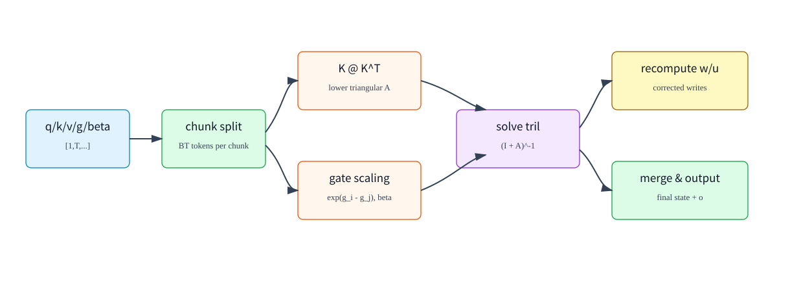

# 03. GDN Training, Prefill, Decode, and Serving State Management

## 1. Which Objects Are Trainable Parameters

Using SGLang's `Qwen3GatedDeltaNet` as the concrete example, trainable parameters inside a GDN layer include:

| Parameter | Code Module / Field | Shape Intuition | Role |
|---|---|---:|---|
| `in_proj_qkvz.weight` | `MergedColumnParallelLinear` | `[2*H*K+2*HV*V, H_model]` | projects hidden states into q/k/v/z |
| `in_proj_ba.weight` | `MergedColumnParallelLinear` | `[2*HV, H_model]` | projects hidden states into b/a gate activations |
| `conv1d.weight` | `ColumnParallelLinear` then reshape | equivalent to `[2*H*K+HV*V, C]` | short causal convolution on the q/k/v path |
| `A_log` | `nn.Parameter` | `[HV]` | log-space decay parameter |
| `dt_bias` | `nn.Parameter` | `[HV]` | decay/time-step bias |
| `norm.weight` | `RMSNormGated` | `[V]` or implementation-specific | scale parameter for output gate/norm |
| `out_proj.weight` | `RowParallelLinear` | `[H_model, HV*V]` | projects multi-head GDN output back to hidden size |

Objects that are not trainable parameters:

| Object | Reason |
|---|---|
| `q/k/v/z/a/b` | activations of the current token, computed by projections |
| `g/beta` | control signals computed from `A_log/dt_bias/a/b` |
| `S_t` / `ssm_states` | per-request runtime state cache; not held by the optimizer |
| `conv_states` | runtime causal-conv window cache; not held by the optimizer |
| `cache_indices` | indices that map requests to state slots; not model numeric parameters |

## 2. What the Training Objective Is

GDN does not have a standalone loss. It is part of a decoder layer and participates in causal language modeling.

Training sample:

```text
input_ids:  [B,S]
labels:     [B,S]
```

Model output:

```text
logits: [B,S,Vocab]
```

Loss:

```text
loss = CrossEntropy(logits[:, :-1, :], labels[:, 1:])
```

Backpropagation updates GDN layer parameters through the normal model graph:

```text
loss
  -> lm_head
  -> decoder layers
  -> GDN out_proj / norm / projections / conv / A_log / dt_bias
```

But runtime state is not updated by the optimizer:

```text
S_t is an intermediate state created during forward;
it participates in gradient computation, but it is not an optimizer-owned Parameter.
```

## 3. How State Is Handled During Training

Training usually uses teacher forcing and feeds a sequence segment at once. For each training sample, the initial state is usually zero or passed in from a previous segment:

```text
S_0 = zeros([B, HV, V, K])
```

Then the sequence is recurrently processed:

```text
for t in 1..S:
    S_t, o_t = GDNStep(S_(t-1), q_t, k_t, v_t, g_t, beta_t)
```

If implemented as a naive sequential loop, long-sequence training would be slow. Efficient training uses chunk/chunkwise parallel algorithms.

## 4. Why Training Needs Chunk Parallelism

The GDN recurrence is sequentially defined:

```text
S_t depends on S_(t-1)
```

This is natural for decode, because decode already processes one token at a time. But training and prefill need to process long sequences:

```text
T = 4096, 32768, ...
```

Launching one kernel per token would expose poor GPU parallelism. GDN therefore uses a chunk algorithm:

```text
split the sequence into chunks
solve lower-triangular dependencies inside each chunk in parallel
pass summary state between chunks
```



## 5. Intuition Behind Chunk Gated Delta Rule

The one-step recurrence contains:

```text
S_t = exp(g_t) * S_(t-1)
      + beta_t * (v_t - exp(g_t) * S_(t-1) @ k_t) outer k_t
```

Tokens inside the same chunk influence one another. The write from token `i` affects the prediction for token `j > i`. Therefore, the chunk algorithm must handle a causal lower-triangular dependency.

In SGLang's `chunk_fwd.py`, the core stages are:

```text
1. Compute a lower-triangular beta * K @ K^T matrix
2. Apply gate scaling exp(g_i - g_j)
3. Solve a lower-triangular system to obtain (I + A)^-1
4. Recompute write vectors w/u
5. Merge chunk state and compute output
```

Why does `K @ K^T` appear?

```text
Each write direction is k_i.
When a later token reads that write with k_j, the interaction contains k_j dot k_i.
```

So the within-chunk token-to-token interaction can be organized as a lower-triangular Gram-like matrix.

## 6. Inference Prefill Flow

Prefill processes the prompt or an extended segment of tokens:

```text
hidden_states: [T,H_model]
query_start_loc: [N+1]
```

End-to-end flow:

```text
1. Projection:
       hidden -> mixed_qkv, z, a, b

2. Causal convolution:
       mixed_qkv -> conv(mixed_qkv)
       store the last C-1 conv-window entries for each request

3. Split:
       q [1,T,H,K]
       k [1,T,H,K]
       v [1,T,HV,V]

4. Gating:
       g [1,T,HV]
       beta [1,T,HV]

5. chunk_gated_delta_rule:
       read initial_state
       compute outputs for all tokens in parallel
       produce final_state

6. State tracking:
       write each request's final_state back to ssm_states[cache_indices]

7. Output:
       core_attn_out + z -> RMSNormGated -> out_proj
```

Prefill produces two categories of results:

| Output | Lifetime |
|---|---|
| current tokens' hidden output | flows to later layers and logits |
| each request's final GDN state | saved in the request state pool for later decode |

## 7. Inference Decode Flow

Decode usually has one new token per request:

```text
hidden_states: [B,H_model]
```

Flow:

```text
1. Project into mixed_qkv/z/a/b
2. causal_conv1d_update updates conv_states
3. Read old state from ssm_states[cache_indices]
4. Compute g/beta
5. Execute one recurrent update
6. Write the new state back to ssm_states[cache_indices]
7. Output core_attn_out -> gated norm -> out_proj
```

The core property of decode is constant-time state update:

```text
Each token does not scan all historical tokens.
It reads and writes a fixed-size [HV,V,K] state.
```

This is why GDN is attractive for long-context serving.

## 8. Packed Decode Fast Path

SGLang's Triton GDN backend supports packed decode:

```text
mixed_qkv: [B, 2*H*K + HV*V]
a:         [B, HV]
b:         [B, HV]
ssm_states:[num_slots, HV, V, K]
```

The packed kernel does all of the following inside one kernel:

```text
1. Load q/k/v from mixed_qkv
2. Apply L2 norm to q/k
3. Compute g and beta
4. Read old state
5. Execute delta-rule update
6. Write state back
7. Output [B,1,HV,V]
```

This avoids several intermediate tensors and kernel launches:

```text
split q/k/v
gating kernel
recurrent update kernel
```

They become one tighter decode fast path.

## 9. Target Verify and Temporary State

During speculative decoding target verify, one request may verify multiple draft tokens at once. GDN must advance state along candidate paths, but it must not pollute the official state before accept/reject is resolved.

The implementation must distinguish:

| State | Purpose |
|---|---|
| `ssm_states` | official state after committed tokens |
| `intermediate_states_buffer` | temporary state for draft tokens or tree verification |
| `intermediate_conv_window` | temporary advancement of the convolution window for draft tokens |

Verify kernels often use:

```text
disable_state_update=True
```

Meaning:

```text
compute target outputs for candidate tokens;
cache necessary intermediate states;
commit only the accepted path after accept/reject finishes.
```

This is the same management idea as temporary KV in speculative decoding, but the managed object is recurrent state.

## 10. State Management in Serving

GDN serving has at least two types of state:

```text
conv_states:
    short convolution window, storing the most recent C-1 q/k/v projection inputs

ssm_states:
    GDN recurrent state, storing compressed historical memory
```

They are managed by the request pool and cache indices:

```text
request_id -> state slot -> conv_states[slot], ssm_states[slot]
```

When a request finishes:

```text
release its state slot
```

When a prefix cache hits:

```text
restore not only the token prefix;
also restore the conv state and ssm state corresponding to that prefix.
```

When state migration or PD disaggregation is used:

```text
GDN state must be treated as request runtime state, similar to KV Cache.
```

## 11. Memory Comparison: GDN vs KV Cache

The main memory term of standard attention KV Cache is:

```text
KV bytes proportional to context_len * num_layers * num_kv_heads * head_dim
```

The main memory term of GDN state is:

```text
GDN bytes proportional to num_linear_layers * HV * V * K
```

It does not grow linearly with `context_len`.

However:

```text
Hybrid models usually do not make every layer a GDN layer.
Full-attention layers still need KV Cache.
GDN layers also need conv state and ssm state.
```

So practical runtime cache memory is:

```text
total_runtime_cache =
    full_attention_KV_cache
    + GDN_ssm_states
    + GDN_conv_states
    + allocator/prefix/spec metadata
```

## 12. Training vs Serving

| Dimension | Training | Serving |
|---|---|---|
| Input | long-sequence teacher forcing | multi-token prefill, one-token decode |
| State | intermediate activations participate in backprop; usually not permanently saved across samples | persistent conv/ssm state per request |
| Kernel | forward + backward required | mostly forward only |
| Parallel strategy | chunk parallelism, sequence parallelism, activation checkpointing | chunk prefill, packed decode, CUDA graph, state pool |
| Correctness focus | gradients, loss, numerical stability | state commit, prefix cache, target verify, batch scheduling |

Some GDN kernels in SGLang are explicitly inference/serving paths and do not implement backward. Training GDN models requires a training framework or FLA kernels that support backpropagation.

## 13. Common Debugging Points

| Symptom | Possible Cause |
|---|---|
| prefill works but decode is wrong | conv state or ssm state was not written back correctly |
| single request works but continuous batching fails | `cache_indices` is misaligned with request state slots |
| output drifts after target verify | temporary state was committed along the wrong path |
| long-context quality degrades | gate decay is too strong/weak, state compression is insufficient, or full-attention layer spacing is unsuitable |
| shape mismatch on multiple GPUs | `H/HV/K/V` after TP partitioning does not match packed projection layout |
| failure only on some GPU backends | GDN backend support differs across prefill/decode/verify paths |

## 14. Summary

1. GDN trainable parameters live in projections, convolution, `A_log/dt_bias`, norm, and output projection; state is not a parameter.
2. Training uses causal LM loss to backpropagate into GDN parameters, and long sequences rely on chunk-parallel algorithms.
3. Prefill uses chunk gated delta rule, decode uses recurrent update, and packed decode further fuses split/gating/update.
4. Target verify must use temporary state to prevent draft tokens from polluting official request state.
5. GDN reduces cache growth with context length, but introduces new complexity around state pools, convolution state, and hybrid-layer scheduling.
