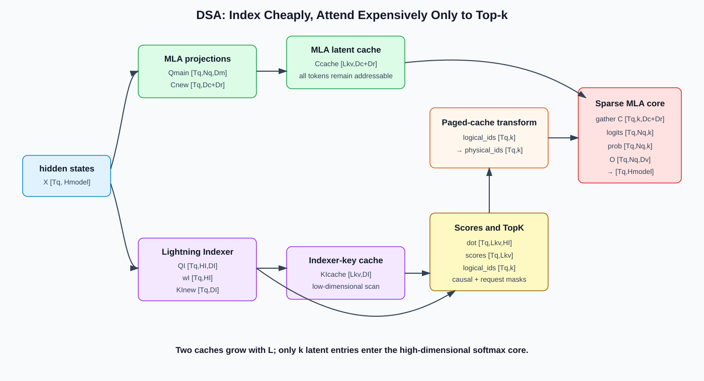
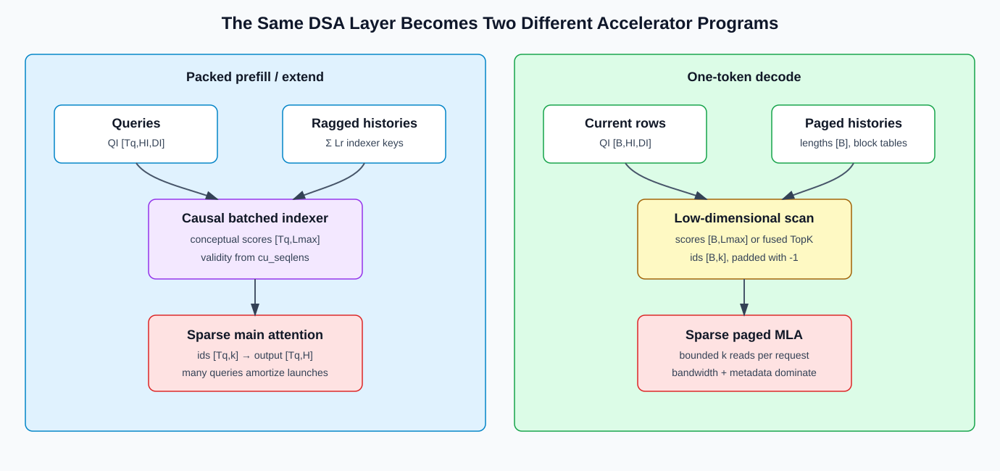

# DeepSeek Sparse Attention: Learned Indexing over MLA Cache

## 1. The Problem DSA Solves

MLA makes each historical cache entry much narrower, but dense MLA still lets every query attend to every previous entry:

```text
MLA: smaller entry x all historical positions
```

At very long context, the number of entries read and the core attention computation still grow with context length. DeepSeek Sparse Attention (DSA) adds a learned retrieval stage:

```text
cheap indexer scans history
  -> select top-k token entries
  -> expensive MLA core reads only selected entries
```

DSA therefore targets the **position axis**, while MLA primarily targets the **feature/cache-width axis**.

## 2. DSA Is Built under MLA

DeepSeek-V3.2 instantiates DSA on the MQA execution mode of MLA. Each historical token still produces one shared MLA latent KV entry, and all query heads reuse that entry.

```text
historical token s
  -> MLA latent entry c_s
  -> indexer key kI_s

query token t
  -> main MLA query heads
  -> lightweight indexer queries and head weights
```

The indexer and main attention serve different purposes and use different projections. Indexer scores are only used to choose positions; the main MLA logits and softmax still determine the output over those positions.



## 3. Unified Notation

| Symbol | Meaning |
|---|---|
| `L` | visible sequence length |
| `k` | number of entries selected per query, `k << L` |
| `HI` | number of indexer query heads |
| `DI` | indexer head dimension |
| `h_t` | hidden state of query token `t`, `[H]` |
| `qI_t,j` | indexer query of head `j`, `[DI]` |
| `kI_s` | shared indexer key of historical token `s`, `[DI]` |
| `wI_t,j` | scalar weight of indexer head `j` |
| `I_t,s` | scalar index score between query `t` and historical token `s` |
| `c_s` | MLA latent KV entry of token `s` |

## 4. Lightning Indexer

The indexer computes a scalar retrieval score:

```text
I_t,s = sum_(j=1..HI) wI_t,j * ReLU(qI_t,j dot kI_s)
```

Shape view for a packed batch with `Tq` query tokens and `Lkv` candidate entries:

```text
QI:       [Tq, HI, DI]
KI_cache: [Lkv, DI]
head_w:   [Tq, HI]

dot:      [Tq, Lkv, HI]
ReLU + weighted sum over HI
scores:   [Tq, Lkv]
```

### 4.1 Projection-by-Projection Shape Changes

The indexer receives the model hidden state and the low-rank MLA query activation. A representative projection path in the SGLang source is:

```text
hidden x:   [Tq,Hmodel]
q_lora:     [Tq,Dq]

QI_flat = q_lora @ WqI^T
WqI:        [HI*DI,Dq]
QI_flat:    [Tq,HI*DI]
QI:         [Tq,HI,DI]

KI = LayerNorm(x @ WkI^T)
WkI:        [DI,Hmodel]
KI:         [Tq,DI]             # one shared key per token

head_w = x @ WwI^T
WwI:        [HI,Hmodel]
head_w:     [Tq,HI]
```

The indexer query has `HI` heads, but its key is shared. Broadcasting the key across query heads gives:

```text
QI[:,None,:,:]:        [Tq,1,HI,DI]
KI_cache[None,:,:, :]: [1,Lkv,1,DI]
dot result:            [Tq,Lkv,HI]
```

After `ReLU`, multiply by `head_w[:,None,:] [Tq,1,HI]` and reduce over `HI`:

```text
weighted: [Tq,Lkv,HI]
scores:   [Tq,Lkv]
```

This head reduction is why top-k returns one position set per query token rather than a different set per main attention head.

### 4.2 Indexer RoPE Split

The indexer head can contain positional and non-positional subspaces:

```text
QI: [Tq,HI,DI]
  -> QI_rope [Tq,HI,Dr]
  -> QI_nope [Tq,HI,DI-Dr]

KI: [Tq,DI]
  -> KI_rope [Tq,Dr]
  -> KI_nope [Tq,DI-Dr]
```

Apply RoPE only to the designated `Dr` channels and concatenate back to `DI`. In the NPU path visible in this repository, a representative shape is `HI=64`, `DI=128`, `Dr=64`: the projection produces `[Tq,64,128]`, splits into two 64-channel parts, rotates the positional part, and restores `[Tq,64,128]`.

### 4.3 A Small Numerical Ranking Example

Let `HI=2`, `DI=2`, and four candidate keys:

```text
qI_0 = [1, 0]       head weight w_0 = 0.75
qI_1 = [0, 1]       head weight w_1 = 0.25

kI_0 = [ 2, 1]
kI_1 = [-1, 4]
kI_2 = [ 1,-2]
kI_3 = [ 0, 3]
```

Per-head dot products are:

```text
candidate 0: [2, 1]  -> ReLU -> [2,1]
candidate 1: [-1,4]  -> ReLU -> [0,4]
candidate 2: [1,-2]  -> ReLU -> [1,0]
candidate 3: [0, 3]  -> ReLU -> [0,3]
```

Weighted scalar scores become:

```text
I_0 = 0.75*2 + 0.25*1 = 1.75
I_1 = 0.75*0 + 0.25*4 = 1.00
I_2 = 0.75*1 + 0.25*0 = 0.75
I_3 = 0.75*0 + 0.25*3 = 0.75
```

For `k=2`, candidates 0 and 1 are selected. Notice that negative evidence is removed by ReLU before the head-weighted reduction; moving ReLU after the reduction would define a different function.

ReLU is part of the trained scoring function, not an interchangeable implementation detail. The indexer uses fewer/smaller heads and can use low precision, making a full scan much cheaper than running the main attention on all entries.

## 5. Fine-Grained Top-k Selection

For query token `t`:

```text
S_t = TopK(I_t, :, k)
selected_cache_t = {c_s | s in S_t}
```

The main output is then:

```text
u_t = MLA_Attention(h_t, selected_cache_t)
```

Important consequences:

1. Selection is **query-dependent**; two query tokens may retrieve different positions.
2. The indexer collapses its heads into one scalar score per historical position.
3. All main query heads consume the selected shared MLA entries in MQA mode.
4. Top-k changes the support of softmax; it is not equivalent to computing dense softmax and dropping small weights afterward.

## 6. Complexity: Main Attention and Indexer Must Be Counted Separately

Ignoring constants:

| Component | Full-sequence prefill | One-token decode |
|---|---:|---:|
| Dense MLA core | `O(L^2 * Dmain)` | `O(L * Dmain)` |
| DSA indexer | `O(L^2 * HI * DI)` | `O(L * HI * DI)` |
| DSA sparse main core | `O(L * k * Dmain)` | `O(k * Dmain)` |

The indexer is still quadratic across a full sequence and linear in history for one decode token. DSA is efficient because the indexer constant is deliberately much smaller than the main MLA constant and because the expensive core uses only `k` entries.

The official DeepSeek-V3.2 training configuration selects 2048 entries per query. Treat that as a model configuration, not a universal DSA constant.

## 7. What Is Cached

DSA does not replace MLA cache with only top-k entries. Future queries may select any old position, so persistent history includes:

```text
main latent cache: one MLA entry c_s per token
indexer cache:     one indexer key kI_s per token
```

Top-k indices are per-forward metadata. They determine which entries the current query reads, but they are not the historical state itself.

Compared with dense MLA, DSA adds indexer-key storage while bounding the number of main entries read per query. Cache capacity still grows with context length.

## 8. Why DSA Needs Training

Arbitrary post-hoc top-k selection can remove information the model expects. DeepSeek-V3.2 uses two stages:

### 8.1 Dense Indexer Warm-up

- Keep the main attention dense.
- Freeze the main model and train the indexer.
- Build a target distribution by aggregating main-attention scores across heads and normalizing it.
- Minimize KL divergence between that target and the indexer distribution.

### 8.2 Sparse Continued Training

- Enable top-k selection.
- Train the main model to adapt to sparse visibility.
- Continue training the indexer with its auxiliary alignment loss on selected positions.
- Detach the indexer's input from the main computational graph so the language-model loss and indexer loss have separated optimization paths.

DSA is therefore a natively trained architecture, not merely a serving-time KV eviction heuristic.



## 9. Prefill Dataflow

For packed query tokens:

```text
hidden states
  -> build/store new MLA latent entries
  -> build/store new indexer keys
  -> indexer scores against causal history
  -> top-k per query, pad invalid slots
  -> convert logical token indices to cache addresses
  -> sparse MLA attention
  -> output projection
```

Practical concerns include causal masking, variable sequence lengths, top-k padding, selected-token load imbalance, and whether the sparse kernel can consume paged cache without materializing a dense gather.

When a visible sequence is no longer than `k`, selection can degenerate to all valid positions. A short-sequence dense or sequential-index path may be faster than launching the full sparse pipeline.

## 10. Decode Dataflow

For one new token per request:

```text
1. Project current hidden state into main MLA query and indexer query/weights.
2. Append current main latent entry and indexer key to their caches.
3. Scan valid indexer keys and produce one score per historical token.
4. Select k logical positions; pad unused slots with -1 when history < k.
5. Translate logical positions through the page table.
6. Run sparse MLA core on selected physical entries.
```

This separates a low-dimensional sequential scan from a high-dimensional bounded attention read.

## 11. Paged Cache and Graph-Replay Contracts

A production implementation cannot pass paper-level token ids directly to a paged kernel:

```text
logical top-k token index
  -> request page table
  -> physical cache index
  -> sparse attention metadata
```

For graph capture, output buffers often have a fixed `[graph_batch, k]` shape. Runtime sequence lengths, page tables, indexer cache lengths, and selected indices must be refreshed without changing captured tensor addresses. `-1` sentinels mark invalid top-k slots.

## 12. SGLang Source Map

| Source | Responsibility |
|---|---|
| [`python/sglang/srt/models/deepseek_v2.py`](../../../../python/sglang/srt/models/deepseek_v2.py) | Adds `Indexer` to MLA layers and threads top-k indices through the model |
| [`python/sglang/srt/layers/attention/dsa/dsa_indexer.py`](../../../../python/sglang/srt/layers/attention/dsa/dsa_indexer.py) | Indexer projections, key cache, score paths, and top-k production |
| [`python/sglang/srt/layers/attention/dsa/dsa_topk_backend.py`](../../../../python/sglang/srt/layers/attention/dsa/dsa_topk_backend.py) | Top-k implementation dispatch and fused transforms |
| [`python/sglang/srt/layers/attention/dsa/transform_index.py`](../../../../python/sglang/srt/layers/attention/dsa/transform_index.py) | Converts selected logical indices through paged-cache tables |
| [`python/sglang/srt/layers/attention/dsa_backend.py`](../../../../python/sglang/srt/layers/attention/dsa_backend.py) | Prefill/decode metadata and sparse MLA backend dispatch |
| [`python/sglang/srt/layers/attention/attention_registry.py`](../../../../python/sglang/srt/layers/attention/attention_registry.py) | Registers `dsa`; keeps `nsa` only as a deprecated backend alias |

The implementation has separate choices for index scoring, top-k, and sparse core attention. Tuning only one of them may simply move the bottleneck to another stage.

## 13. Ascend NPU Path in This Snapshot

The current source snapshot contains an explicit Ascend path:

- `dsa_indexer.py` uses `torch_npu.npu_rotary_mul` for indexer RoPE and `torch_npu.npu_lightning_indexer` for index selection.
- [`python/sglang/srt/hardware_backend/npu/modules/deepseek_v2_attention_mla_npu.py`](../../../../python/sglang/srt/hardware_backend/npu/modules/deepseek_v2_attention_mla_npu.py) separates `forward_dsa_prepare_npu` from `forward_dsa_core_npu`.
- `AttnForwardMethod.DSA_NPU` gives DSA its own model-forward route instead of treating it as ordinary dense MLA.

For NPU performance analysis, measure at least four ranges independently:

```text
indexer projection/rope
index score + top-k
logical-to-physical index transform
sparse main attention + output projection
```

Also inspect synchronization between Vector-heavy top-k/address work and Cube-heavy projection/attention work. A fast core attention operator cannot hide an indexer or metadata pipeline that serializes before it.

## 14. DSA Versus NSA

| Dimension | DSA | Native Sparse Attention (NSA) |
|---|---|---|
| Main unit selected | fine-grained token-level MLA entries | fine-grained token blocks |
| Global coarse path | lightweight indexer scans token keys | explicit compressed-token attention branch |
| Local path | selected tokens; MLA foundation | dedicated sliding-window branch |
| Combination | one selected set feeds the main core | compression, selection, and window outputs are gated together |

Both are natively trainable sparse attention designs, but their dataflows and cache contracts are different.

## 15. Common Misconceptions

1. **“DSA makes all attention computation `O(L*k)`.”** The expensive core does; the lightweight indexer still scans all candidate history.
2. **“Only selected entries need to be cached.”** Future queries may select previously unselected entries, so full latent and indexer history must remain addressable.
3. **“Indexer score is the attention score.”** It is a retrieval score; the selected entries enter a separate MLA core and softmax.
4. **“DSA can be added to any dense checkpoint without training.”** The published architecture warms up the indexer and continues sparse training.
5. **“SGLang's `nsa` alias means DSA equals NSA.”** It is a deprecated configuration alias, not an algorithmic equivalence.

## 16. Correctness and Performance Checklist

1. Top-k candidates obey causal and per-request sequence boundaries.
2. Invalid slots use a sentinel that every downstream transform and kernel respects.
3. Logical indices are translated through the correct request page table.
4. Main latent cache and indexer key cache advance consistently.
5. Short histories use all valid entries rather than duplicated or future entries.
6. Quantized indexer ranking is compared against a higher-precision reference using top-k recall, not only logit error.
7. Sparse outputs are validated against the model's trained reference path, not assumed equal to dense MLA.
8. Profile indexer, top-k, transform, sparse core, and graph metadata separately.

## 17. Full Tensor Ledger for One Forward

Let packed prefill contain `R` requests, `Tq` new query tokens in total, and `Tkv` visible cached/new KV entries across requests. `Lmax` is the largest per-request history.

| Stage | Tensor | Logical shape | Persistent? |
|---|---|---:|---|
| Input | hidden states | `[Tq,Hmodel]` | no |
| MLA query down projection | `q_lora` | `[Tq,Dq]` | no |
| Main query heads | `Qmain` | `[Tq,Nq,Dmain]` | no |
| New MLA latent | `Cnew` | `[Tq,Dc+Dr]` | yes, append |
| Indexer query | `QI` | `[Tq,HI,DI]` | no |
| Indexer head weights | `head_w` | `[Tq,HI]` | no |
| New index key | `KInew` | `[Tq,DI]` | yes, append |
| Indexer history | `KIcache` | `[Tkv,DI]` plus request metadata | yes |
| Conceptual scores | `scores` | `[Tq,Lmax]` | workspace or fused away |
| Selected logical IDs | `topk_ids` | `[Tq,k]` | forward metadata |
| Selected physical IDs | `page_ids` | `[Tq,k]` | forward metadata |
| Selected latent entries | `Csel` | `[Tq,k,Dc+Dr]` | often read directly, not materialized |
| Main logits | `Alogit` | `[Tq,Nq,k]` | workspace or tiled |
| Main probabilities | `P` | `[Tq,Nq,k]` | preferably online/tiled |
| Head output | `Ohead` | `[Tq,Nq,Dv]` | no |
| Layer output | `O` | `[Tq,Hmodel]` | no |

“Logical shape” does not imply that a dense tensor is allocated. A fused indexer can stream key tiles and keep only running top-k candidates; a sparse attention kernel can load latent entries from physical page IDs without constructing `Csel`.

## 18. Reference Pseudocode with Shape Assertions

The following pseudocode prioritizes semantics over performance:

```python
def dsa_reference(x, q_lora, latent_cache, index_cache, valid_mask, k):
    # x:             [Tq, Hmodel]
    # q_lora:        [Tq, Dq]
    # latent_cache:  [Tq, Lkv, Dlatent]  # conceptual per-query view
    # index_cache:   [Tq, Lkv, DI]       # conceptual per-query view
    # valid_mask:    [Tq, Lkv]

    Tq, Lkv, DI = index_cache.shape
    q_i = linear_q_index(q_lora).view(Tq, HI, DI)       # [Tq,HI,DI]
    w_i = linear_head_weight(x)                         # [Tq,HI]

    dots = einsum("thd,tld->tlh", q_i, index_cache)    # [Tq,Lkv,HI]
    score = (relu(dots) * w_i[:, None, :]).sum(-1)     # [Tq,Lkv]
    score = where(valid_mask, score, -inf)

    actual_k = min(k, Lkv)
    ids = topk(score, actual_k, dim=-1).indices         # [Tq,actual_k]
    chosen_is_valid = gather(valid_mask, dim=-1, index=ids)
    ids = where(chosen_is_valid, ids, -1)               # invalidate short rows
    ids = pad_to_k_with_minus_one(ids, k)               # [Tq,k]

    selected = batched_gather(latent_cache, ids)        # [Tq,k,Dlatent]
    out = sparse_mla(q_lora, selected, ids >= 0)        # [Tq,Nq,Dv]
    return out, ids
```

Production code replaces the conceptual per-query cache views with packed/paged pools, but its result must obey these request and causal boundaries.

## 19. Why Top-k Changes the Softmax Mathematics

Dense attention normalizes over all valid positions `V_t`:

```text
p_dense(s) = exp(a_s) / sum_(u in V_t) exp(a_u)
```

DSA first obtains a selected support `S_t` from a different score function, then the main core normalizes only over that support:

```text
p_dsa(s) = exp(a_s) / sum_(u in S_t) exp(a_u),  s in S_t
p_dsa(s) = 0,                                  s not in S_t
```

Even if the main logits `a_s` are unchanged, removing candidates changes the denominator. This explains both why sparse continued training is needed and why comparing a sparse result to dense MLA with an extremely tight elementwise tolerance is not a valid correctness target. Kernel correctness should match the trained sparse reference; model quality should be evaluated at the task level.

## 20. Cache Bytes and Decode Traffic Example

Suppose one layer uses:

```text
Dc + Dr = 576 latent elements per token, BF16
DI = 128 index elements per token, INT8 plus block scales
L = 128K tokens
k = 2048
```

Ignoring alignment and scales:

```text
latent capacity = 131072 * 576 * 2 bytes ≈ 144 MiB
index capacity  = 131072 * 128 * 1 byte  ≈ 16 MiB
```

The full capacity still grows with `L`. But the main core's per-query latent read is bounded near:

```text
2048 * 576 * 2 bytes ≈ 2.25 MiB
```

The indexer scans roughly 16 MiB of quantized keys for that query unless its implementation reuses cache/on-chip locality or distributes the scan. This example makes the optimization target explicit: DSA trades a cheap, narrow sequential scan for a much smaller expensive latent-attention read.

## 21. Debugging from Symptoms

| Symptom | First tensors/invariants to inspect |
|---|---|
| Works for one request, fails for mixed lengths | `query_start_loc`, sequence lengths, causal/request mask |
| Works below `k`, fails above `k` | all-valid shortcut versus real top-k path |
| Correct eager mode, wrong graph replay | refreshed lengths/page tables/top-k buffers and stable addresses |
| Large quality loss after index quantization | top-k recall, tie handling, scale layout, RoPE ordering |
| Indexer is fast but end-to-end is slow | index transform, gather locality, sparse core, stream synchronization |
| Prefix cache gives nondeterministic output | main latent and indexer caches committed at different boundaries |
| NPU result differs only at long context | sentinel handling, page translation width, top-k ordering, accumulator precision |

## 22. Exercises

1. With `Tq=32`, `HI=64`, `DI=128`, `Lkv=8192`, write every intermediate shape in the unfused indexer.
2. Compute the ratio of main-core logits for dense MLA versus DSA when `L=128K` and `k=2048`.
3. Explain why evicting every non-selected token after one query is incorrect.
4. Design a streaming top-k implementation that never materializes `[Tq,Lkv]` scores.
5. For a paged cache with page size 64, derive the physical address of logical token 130 from its request block table.

## 23. References

- [DeepSeek-V3.2: Pushing the Frontier of Open Large Language Models](https://arxiv.org/abs/2512.02556)
- [Official DeepSeek-V3.2-Exp repository](https://github.com/deepseek-ai/DeepSeek-V3.2-Exp)
- [Native Sparse Attention](https://arxiv.org/abs/2502.11089)
- [MLA tutorial in this repository](./04-multi-head-latent-attention.md)
