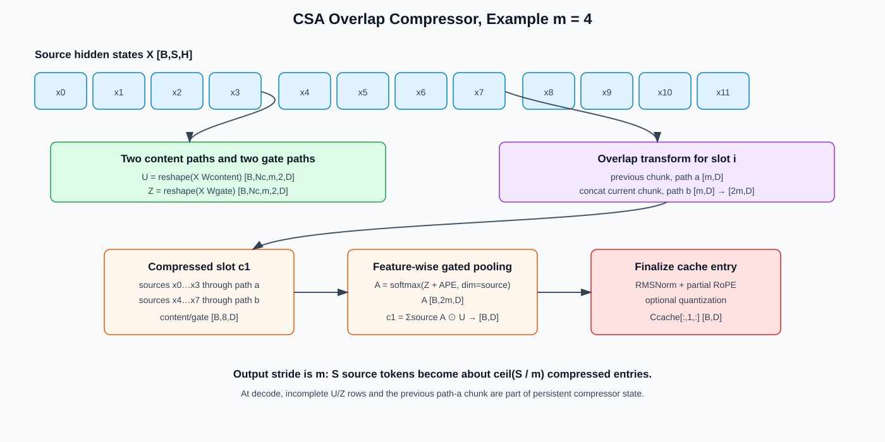
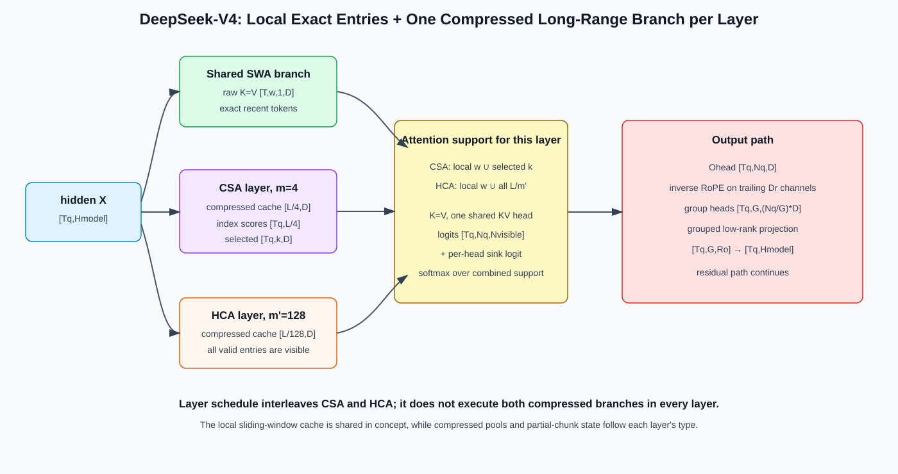

# Compressed Sparse Attention (CSA) and Heavily Compressed Attention (HCA)

Compressed Sparse Attention (CSA) is the long-context attention design introduced with DeepSeek-V4. Its key move is easy to state:

> Compress the sequence first, then retrieve a small number of compressed entries for the expensive attention core.

Heavily Compressed Attention (HCA) provides a much more aggressively compressed dense path. A local sliding-window branch preserves recent token detail. Across the model's layer schedule, these mechanisms cover three time scales:

- **SWA**: exact, uncompressed recent context;
- **CSA**: moderately compressed, content-selected context;
- **HCA**: heavily compressed, always-visible global context.

This chapter focuses on the execution and serving consequences of that hierarchy. Here, **CSA** specifically means DeepSeek-V4's Compressed Sparse Attention, not another use of the acronym.

## 1. Why Compress Before Selecting?

DeepSeek Sparse Attention (DSA) selects token-level latent KV entries. Its main attention core is sparse, but its lightweight indexer still scans the token history.

CSA changes the candidate space from `L` token entries to roughly `L / m` compressed entries, where `m` is the compression stride. If the core retrieves `k` compressed entries, then:

| Component | DSA | CSA |
|---|---:|---:|
| Indexer candidates per query | `L` | about `L / m` |
| Main-core entries per query | `k` | `k` compressed entries |
| Main long-range cache granularity | token | compressed chunk |

Compression is not free: each compressed entry summarizes multiple source positions, so the model must learn what information survives. The local and heavily compressed paths compensate for different losses.

## 2. Notation and Shape Ledger

Let:

- `X in R[L, d_model]`: hidden states;
- `m`: CSA compression stride;
- `m'`: HCA compression stride, normally much larger than `m`;
- `Nc = ceil(L / m)`: number of CSA entries;
- `Nh = ceil(L / m')`: number of HCA entries;
- `C in R[Nc, d_c]`: CSA compressed KV entries;
- `K_I in R[Nc, d_i]`: compressed indexer keys;
- `k`: number of CSA entries selected per query;
- `w`: uncompressed sliding-window length.

Use different symbols for `K_I` and `k`: the former is a key tensor, while the latter is the top-k budget.

## 3. Overlapping Sequence Compression

CSA does not simply average every `m` tokens. It builds two projected content streams and two learned gating streams:

```text
C_a = X W_a^C       Z_a = X W_a^Z
C_b = X W_b^C       Z_b = X W_b^Z
```

For compressed slot `i`, the compressor consumes two adjacent source chunks:

```text
previous chunk: X[(i-1)m : i*m]
current chunk:  X[i*m : (i+1)m]
```

The `a` and `b` paths are arranged so the slot receives up to `2m` source positions. A softmax over their gate logits produces learned, feature-wise mixing weights. Conceptually:

```text
C_i = sum over j in the 2m source positions of softmax(Z_i)[j] * projected_content[j]
```

The exact implementation batches and reshapes these operations, but three properties define the contract:

1. output stride is `m`, so cache length is approximately `L / m`;
2. adjacent outputs overlap in source coverage;
3. partial chunks require persistent compressor state during incremental decoding.

The overlap softens chunk boundaries: evidence near the edge of one chunk can contribute through the neighboring path.



### 3.1 Exact Logical Shapes of the Compressor

Let `D` be the compressed KV width and `coff=2` for overlapping CSA. One implementation-friendly layout is:

```text
X: [B,S,Hmodel]

U_flat = X @ Wcontent^T: [B,S,coff*D]
Z_flat = X @ Wgate^T:    [B,S,coff*D]

pad S to Nc*m, then reshape:
U: [B,Nc,m,coff,D] = [B,Nc,m,2,D]
Z: [B,Nc,m,coff,D] = [B,Nc,m,2,D]
```

For compressed slot `i`, the overlap transform constructs:

```text
Ubar_i = concat(U[i-1,:,path_a,:], U[i,:,path_b,:])  # [B,2m,D]
Zbar_i = concat(Z[i-1,:,path_a,:], Z[i,:,path_b,:])  # [B,2m,D]
```

At the left boundary, the missing previous chunk is padded and masked. The learned absolute position embedding inside the compression window is:

```text
APE: [2m,D]
```

The feature-wise source weights and compressed entry are:

```text
A_i[b,r,d] = exp(Zbar_i[b,r,d] + APE[r,d])
             / sum_(u valid) exp(Zbar_i[b,u,d] + APE[u,d])

C_i[b,d] = sum_(r valid) A_i[b,r,d] * Ubar_i[b,r,d]

A_i: [B,2m,D]
C_i: [B,D]
```

Softmax runs over the **source-position axis** independently for each feature `d`. This is more expressive than one scalar weight per token: different output channels can preserve evidence from different source positions.

### 3.2 Why Output Length Is `ceil(S/m)`, Not `ceil(S/2m)`

Each output sees up to `2m` sources, but adjacent outputs overlap. The compressor advances only `m` new source positions per output:

```text
C_1 sees chunks 0 and 1
C_2 sees chunks 1 and 2
C_3 sees chunks 2 and 3
```

Therefore receptive-field width is `2m`, while stride is `m`. Confusing width with stride underestimates cache length by two.

### 3.3 Causality and Entry Readiness

A compressed entry becomes visible only after all source positions needed for that entry are available. For causal inference, a query must never attend to a summary that contains a future token.

For `m=4`, a completed summary of source positions `0..3` cannot be used by queries at positions `0..2`. The runtime tracks the number of completed entries separately from raw token length:

```text
token_len = t + 1
complete_entries = floor(token_len / m)
tail_len = token_len % m
```

Overlap adds previous-path state but does not relax this causal boundary.

## 4. Compressed Indexer

CSA runs retrieval over compressed entries, not raw token positions. Its indexer follows the same high-level pattern as DSA:

```text
c_q = x_t W_DQ
q_I = c_q W_UQ^I
score(t, s) = sum_j w_j^I * ReLU(q^I_{t,j} dot k^I_s)
I_t = TopK_s(score(t, s), k)
```

The difference is the domain of `s`: it ranges over `Nc` compressed entries. Indexer keys therefore need their own compressed cache synchronized with the main compressed KV cache.

The selected IDs are **compressed-entry IDs**. They must not be interpreted as token IDs or ordinary paged-KV slots.

## 5. Sparse Main Core

The selected compressed entries feed a multi-query attention-style core. DeepSeek-V4 shares the compressed representation as key and value and uses grouped output projection to recover head-specific expressivity.

A simplified query path is:

```text
Q_t = x_t W^Q
selected = C[I_t]
A_t = softmax(Q_t selected^T + mask)
O_t = GroupedOutput(A_t selected)
```

The real implementation includes normalization, positional handling, head grouping, and fused kernels. Keep the conceptual boundaries clear:

- the **indexer** ranks candidates;
- top-k returns compressed logical IDs;
- the **main core** recomputes attention logits and softmax on those entries.

### 5.1 Local and Compressed Entries Share the Attention Support

For one query token, define:

```text
Klocal = Vlocal: [w_valid,1,D]
Kcomp  = Vcomp:  [k_valid,1,D]       # CSA
                 [Nh_valid,1,D]      # HCA

Kvisible = concat(Klocal, Kcomp, dim=sequence)
Vvisible = Kvisible                  # shared K=V MQA
```

With `Q [Nq,D]`, the logical tensors are:

```text
logits: [Nq,Nvisible]
Nvisible = w_valid + k_valid         # CSA layer
Nvisible = w_valid + Nh_valid        # HCA layer
prob:   [Nq,Nvisible]
Ohead:  [Nq,D]
```

The per-head attention sink adds a stable extra logit to the normalization. A fused kernel may keep local and compressed caches in separate physical buffers, but mathematically they form one causal support set for that layer.

### 5.2 Grouped Low-Rank Output Projection

The wide head output would normally flatten to `[Tq,Nq*D]`. DeepSeek-V4 groups heads before a low-rank output projection. With `G` output groups and rank `Ro`:

```text
Ohead:    [Tq,Nq,D]
Ogroup:   [Tq,G,(Nq/G)*D]
Woa:      [G,Ro,(Nq/G)*D]
Olowrank: [Tq,G,Ro]
merge:    [Tq,G*Ro]
Wob:      [Hmodel,G*Ro]
Omodel:   [Tq,Hmodel]
```

Before this projection, the architecture applies inverse rotation to the designated partial-RoPE output channels. Reordering inverse RoPE and the learned projection changes the function.

## 6. HCA: A Dense Global Safety Net

HCA compresses the sequence with a larger stride `m'` and performs dense attention over the resulting short sequence:

```text
X[0:L] -> non-overlapping heavy compression -> H[0:Nh]
query -> dense attention over H
```

Unlike CSA, HCA does not need a retrieval indexer. Its sequence is short enough to remain fully visible. HCA is useful for broad global signals, while CSA preserves more detail for selected distant regions.

## 7. The Local SWA Branch

Compression inevitably discards token-level detail. Sliding-window attention (SWA) keeps the most recent `w` tokens uncompressed:

```text
context(t) = [t-w+1, ..., t]
```

This branch handles exact local syntax, recent tool output, and near-field dependencies without asking a compressor to preserve every small distinction.

Each compressed-attention layer pairs its local path with the long-range branch configured for that layer: CSA or HCA. The model interleaves layer types; it does not necessarily run both CSA and HCA in every block. These are complementary trained paths, not interchangeable inference options.



## 8. Positional Information and Attention Sinks

Sequence compression makes positions subtler than in ordinary MHA. DeepSeek-V4 uses partial rotary position encoding (RoPE): only a designated slice of the representation carries rotary position. The output path applies the corresponding inverse rotation where required by the architecture.

This is an implementation contract, not a cosmetic transformation. Applying RoPE to all channels or omitting output-side handling changes the function.

The architecture also includes an attention sink so queries retain a stable fallback destination. Sparse and compressed kernels must preserve the sink's masking and normalization semantics.

## 9. Example Configuration, Not a Universal Constant

The published DeepSeek-V4 Flash configuration uses the following illustrative values:

| Parameter | Example value |
|---|---:|
| CSA compression stride `m` | 4 |
| CSA top-k `k` | 512 |
| HCA compression stride `m'` | 128 |
| Local window `w` | 128 |

DeepSeek-V4 Pro increases the CSA selection budget to 1024. These are checkpoint architecture fields. Do not silently tune them as if they were only serving parameters.

## 10. Complexity and Memory

For a decode query with history length `L`, the approximate work of each configured layer type is:

```text
CSA layer: O(L / m) indexer + O(k) main core + O(w) local path
HCA layer: O(L / m') dense core + O(w) local path
```

Across the model, the cache contains several representations; a layer owns the subset required by its configured type:

```text
CSA main cache        ~ O(L / m)
CSA indexer-key cache ~ O(L / m)
HCA cache             ~ O(L / m')
local uncompressed KV ~ O(w) active entries per sequence
compressor tail state ~ O(m + m')
```

Bytes, not only entry counts, determine the real benefit. Record dtype, feature width, scale/metadata overhead, alignment, and page fragmentation for each pool.

## 11. Prefill and Decode Are Different Programs

### Prefill

Prefill can compress chunks in parallel and batch indexer queries. Its risks are temporary tensors, top-k workspace, causal correctness inside the last partial chunk, and irregular gathers into the sparse core.

### Decode

Decode appends one token at a time. Most steps only update an incomplete compression chunk. A completed chunk emits a new compressed cache entry. The runtime must therefore carry the partial content and gate state between steps.

Graph capture must use bounded buffers for:

- compressed cache addresses;
- indexer top-k outputs;
- partial compressor state;
- local-window metadata;
- per-request sequence and compressed lengths.

Reallocation or shape-dependent host work can erase graph-mode gains.

## 12. Heterogeneous Cache Management

CSA, HCA, and SWA advance at different rates. Treating them as one ordinary KV pool creates correctness and fragmentation problems.

A robust request state records:

```text
token_length
csa_complete_length and csa_tail_state
hca_complete_length and hca_tail_state
local_window mapping
csa indexer/main-cache alignment
```

Page and block sizes should respect compressor strides. If physical allocation units do not align naturally, define explicit carry-over rules rather than rounding away incomplete data.

Prefix caching must snapshot every representation at a mutually consistent boundary. Copying only completed compressed entries while losing the compressor tail changes future outputs.

## 13. SGLang Source Map

In the source snapshot used by this tutorial, the relevant paths are:

- model wiring: [`deepseek_v4.py`](../../../../python/sglang/srt/models/deepseek_v4.py);
- architecture fields: [`deepseek_v4.py`](../../../../python/sglang/srt/configs/deepseek_v4.py);
- compression: [`compressor.py`](../../../../python/sglang/srt/layers/attention/dsv4/compressor.py);
- compressed retrieval: [`indexer.py`](../../../../python/sglang/srt/layers/attention/dsv4/indexer.py);
- attention dispatch: [`deepseek_v4_backend.py`](../../../../python/sglang/srt/layers/attention/deepseek_v4_backend.py);
- cache pools: [`deepseek_v4_memory_pool.py`](../../../../python/sglang/srt/mem_cache/deepseek_v4_memory_pool.py);
- partial-chunk state: [`deepseek_v4_compress_state.py`](../../../../python/sglang/srt/mem_cache/deepseek_v4_compress_state.py).

Read them in that order: configuration establishes the shapes, the model establishes dataflow, and the backend/cache files establish the serving contract.

## 14. Ascend NPU Optimization View

The checked source's specialized DeepSeek-V4 path is centered on CUDA/HIP/Triton. The existence of generic PyTorch classes does not prove that an end-to-end Ascend path is production-ready. Verify the pinned SGLang, `torch_npu`, CANN, and kernel versions before deployment.

When bringing the architecture to Ascend, profile these regions separately:

1. projection plus overlapping compression;
2. compressed indexer and top-k;
3. logical-to-physical compressed-cache translation;
4. sparse gather and main attention;
5. HCA dense attention;
6. local SWA and final branch combination.

Good fusion candidates include projection+norm, compressor gate+softmax+reduce, index score+mask, and gather+attention. Preserve tail-state and causal semantics before optimizing launch count.

## 15. DSA, CSA, and HCA Side by Side

| Property | DSA | CSA | HCA |
|---|---|---|---|
| Stored long-range unit | token-level latent entry | moderately compressed chunk | heavily compressed chunk |
| Retrieval | top-k | top-k | none; dense over short sequence |
| Candidate count | `L` | `L / m` | `L / m'` |
| Main query work | `k` | `k` | `L / m'` |
| Primary role | selected fine detail | selected mid-resolution history | coarse global coverage |

## 16. Common Misconceptions

1. **“CSA is just KV quantization.”** It learns sequence compression; quantization changes numeric representation.
2. **“One compressed entry corresponds to exactly one non-overlapping chunk.”** CSA uses overlapping source coverage.
3. **“Top-k returns token indices.”** It returns compressed-entry indices.
4. **“HCA is another sparse branch.”** HCA is dense attention over a heavily compressed sequence.
5. **“Completed compressed caches are enough for prefix reuse.”** Partial compressor state is also part of request state.
6. **“The example ratios can be freely changed at runtime.”** They are coupled to checkpoint weights and architecture.

## 17. Correctness and Performance Checklist

1. Compressor boundary and padding behavior match the checkpoint implementation.
2. CSA main entries and indexer keys are emitted on the same logical step.
3. Compressed top-k IDs map through the correct request-specific cache table.
4. Partial chunks survive decode, prefix caching, migration, and speculative rollback.
5. SWA boundaries are causal and request-isolated.
6. Partial RoPE, inverse rotation, and sink semantics match the reference.
7. Memory accounting includes all cache pools, scales, metadata, and fragmentation.
8. Profiling separates compression, retrieval, sparse core, HCA, SWA, and graph overhead.

## 18. Layer Schedule and Attention-Mask Shapes

DeepSeek-V4 is a hybrid at the **layer schedule** level. Each layer has one configured compression ratio:

```text
compress_ratio = 0    -> local/sliding path only
compress_ratio = 4    -> CSA compressor + indexer + local path
compress_ratio = 128  -> HCA compressor + dense compressed path + local path
```

For a pedagogical prefill with `S` query tokens:

```text
local causal mask: [S,S]
CSA selected slots: logically [S,k]
HCA entries:        logically [S,ceil(S/m')]
```

Only positions satisfying both request boundaries and readiness are valid. A backend may flatten query-specific CSA slots into `[S,S*k]` workspace columns, but that is an execution layout—not `S*k` persistent cache entries.

## 19. Full Tensor Ledger

Let a packed forward contain `Tq` queries, main compression width `D`, index width `DI`, `Nq` query heads, and output-group count `G`.

| Stage | Tensor | Logical shape | Notes |
|---|---|---:|---|
| Input | hidden states | `[Tq,Hmodel]` | shared layer input |
| Raw local projection | new `K=V` | `[Tq,1,D]` | appended to SWA pool |
| Main compressor content | `U` | `[Tq,coff*D]` | `coff=2` CSA, `1` HCA |
| Main compressor gate | `Z` | `[Tq,coff*D]` | same split as content |
| Compressor workspace | `Ubar/Zbar` | `[Nc,coff*m,D]` | conceptual; often fused |
| New compressed main entries | `Cnew` | `[Nnew,D]` | emitted only at boundaries |
| CSA index-compressor output | `KInew` | `[Nnew,DI]` | CSA only |
| Index query | `QI` | `[Tq,HI,DI]` | CSA only |
| Index score | `I` | `[Tq,Nc_visible]` | CSA only, may be streamed |
| Selected IDs | `ids` | `[Tq,k]` | CSA only |
| Local IDs | `local_ids` | `[Tq,w]` bounded | invalid slots masked |
| Visible K/V | conceptual union | `[Tq,Nvisible,1,D]` | physical pools remain separate |
| Main logits | `A` | `[Tq,Nq,Nvisible]` | tiled/online in optimized path |
| Head output | `Ohead` | `[Tq,Nq,D]` | inverse partial RoPE follows |
| Grouped projection | `Olowrank` | `[Tq,G,Ro]` | before final projection |
| Layer output | `Omodel` | `[Tq,Hmodel]` | rejoins residual path |

## 20. Incremental Compressor as a State Machine

For each request and compressed layer, decoding cycles through `m` raw positions:

```text
state = {
    complete_count,
    tail_position,
    partial_content,
    partial_gate,
    overlap_carry,       # CSA only
}
```

At every token:

```text
1. project x_t into local K=V and append to the SWA ring;
2. project x_t into compressor content/gate slots;
3. write the current slot in partial state;
4. if the chunk is incomplete, emit no compressed entry;
5. if the chunk closes, pool + norm + RoPE, append one entry;
6. for CSA, append the synchronized indexer entry and update overlap carry;
7. advance complete_count and reset the new tail.
```

This explains why `token_length` alone cannot reconstruct a migrated or prefix-cached request. Two requests with the same number of completed entries but different tail activations will produce different next compressed entries.

## 21. Reference Compressor Pseudocode

```python
def overlap_compress(U, Z, ape, valid):
    # U/Z:   [B,Nc,m,2,D]
    # ape:   [2*m,D]
    # valid: [B,Nc,2*m]
    B, Nc, m, _, D = U.shape

    prev_u = shift_right(U[:, :, :, 0, :], fill=0)     # [B,Nc,m,D]
    curr_u = U[:, :, :, 1, :]                          # [B,Nc,m,D]
    prev_z = shift_right(Z[:, :, :, 0, :], fill=-inf)
    curr_z = Z[:, :, :, 1, :]

    ubar = cat([prev_u, curr_u], dim=2)                 # [B,Nc,2m,D]
    zbar = cat([prev_z, curr_z], dim=2)                 # [B,Nc,2m,D]
    logits = where(valid[..., None], zbar + ape, -inf)
    weight = softmax(logits, dim=2)                     # source axis
    compressed = (weight * ubar).sum(dim=2)             # [B,Nc,D]
    return compressed
```

Tests should include `S<m`, `S=m`, `S=m+1`, several full chunks, mixed request lengths, and a split prefill whose boundary lands inside a compression chunk.

## 22. Worked Memory Example

Take `L=1,048,576`, `D=512`, FP8 non-RoPE storage for a rough lower-bound comparison:

```text
uncompressed entries: 1,048,576 * 512 bytes ≈ 512 MiB per layer
CSA m=4:                262,144 * 512 bytes ≈ 128 MiB per CSA layer
HCA m'=128:               8,192 * 512 bytes ≈   4 MiB per HCA layer
```

Add the local SWA pool, BF16 RoPE channels, indexer cache for CSA, scales, alignment, compressor state, and allocator fragmentation to obtain actual memory. The example shows why “4x compression” and “128x compression” describe only the sequence-entry term, not total serving memory.

For one CSA decode query with `k=512`, the main compressed read is roughly `512*D` elements regardless of `L`, while the indexer still scans up to `L/4` compressed index keys. HCA reads all `L/128` entries and avoids top-k.

## 23. Debugging and Exercises

| Symptom | Likely boundary to inspect |
|---|---|
| Error appears every fourth token | CSA emit boundary, tail reset, overlap carry |
| Split prefill differs from one-shot prefill | partial compressor state was dropped or reordered |
| Local facts disappear | SWA mapping/window mask or combined-support normalization |
| Long-range output reads future content | compressed-entry readiness mask |
| CSA works, HCA fails | dense compressed length/page metadata or non-overlap path |
| HCA works, CSA fails | index compressor synchronization, top-k, compressed ID transform |
| Correct BF16, wrong FP8/FP4 | scale layout, RoPE slice dtype, ranking recall |

Exercises:

1. For `S=19` and `m=4`, compute `Nc`, completed entries, and tail length after every token.
2. Draw which source chunks contribute to `C_1`, `C_2`, and `C_3` in overlap mode.
3. With `w=128`, `k=512`, `Nq=64`, write the logical main-logit shape for `Tq=16`.
4. Explain why an HCA layer needs no top-k metadata but still needs compressor-tail state.
5. Design a prefix-cache key that proves local, compressed, indexer, and tail states refer to the same token boundary.

## 24. References

- [DeepSeek-V4: Towards Highly Efficient Million-Token Context Intelligence](https://arxiv.org/abs/2606.19348)
- [DSA tutorial in this repository](./07-deepseek-sparse-attention.md)
- [Efficient-attention landscape](./06-efficient-attention-landscape.md)
