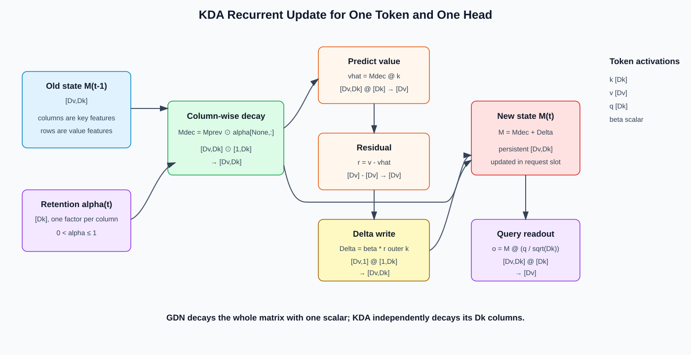
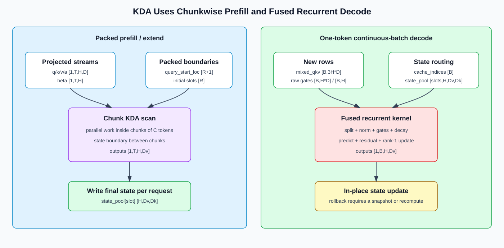

# Kimi Delta Attention (KDA): Fine-Grained Gating for Linear Attention

Kimi Delta Attention (KDA) is the recurrent linear-attention component of Kimi Linear. It extends Gated DeltaNet (GDN) with a **per-key-channel forget gate**.

That one change is operationally important:

- dense and sparse softmax attention store history as a sequence cache;
- GDN and KDA fold history into a fixed-size recurrent state;
- KDA can forget different key-space features at different rates.

This chapter derives the recurrence, maps it to SGLang, and explains why prefill and decode need different kernels.

## 1. From Attention Over Tokens to a Recurrent State

Ordinary causal attention stores past keys and values:

```text
o_t = softmax(q_t K_{<=t}^T) V_{<=t}
```

Its cache grows with sequence length. Linear attention instead summarizes the past in a matrix. Using an implementation-friendly orientation:

```text
M_t in R[d_v, d_k]
o_t = M_t q_t
```

The state size depends on head dimensions, not on the number of processed tokens.

## 2. Why a Delta Rule?

A naive additive state keeps writing outer products:

```text
M_t = M_{t-1} + v_t outer k_t
```

This can overwrite poorly because a new key may collide with content already stored at a similar direction. The delta rule first asks what the state currently predicts for `k_t`, then writes only the residual:

```text
v_hat_t = M_{t-1} k_t
r_t = v_t - v_hat_t
M_t = M_{t-1} + beta_t * (r_t outer k_t)
```

`beta_t` controls the write strength.

## 3. GDN Versus KDA

GDN adds decay before the delta update, but its decay gate is a scalar for each token and head. KDA replaces it with a vector over key channels:

| Gate | GDN | KDA |
|---|---|---|
| Forget factor per token/head | scalar `alpha_t` | vector `alpha_t in R[d_k]` |
| State columns | decay together | decay independently |
| Recurrent state | fixed size | fixed size |

Fine-grained gating lets one feature remain stable while another is rapidly refreshed.

## 4. Shape Ledger

For one token and one head, let:

- `q_t, k_t in R[d_k]`;
- `v_t in R[d_v]`;
- `a_t in R[d_k]`: raw forget-gate activation;
- `alpha_t in (0, 1]^{d_k}`: per-channel retention;
- `beta_t in (0, 1)`: scalar delta write strength;
- `M_t in R[d_v, d_k]`: recurrent state;
- `o_t in R[d_v]`: output before normalization and output gating.

For a batch of tokens, the implementation normally lays tensors out as `[T, H, D]`; recurrent state is per request, layer, and KV head.

## 5. The KDA Recurrence

SGLang's storage-friendly state orientation yields the following steps:

```text
g_t       = -exp(A_log) * softplus(a_t + dt_bias)
alpha_t   = exp(g_t)
M_decay   = M_{t-1} * alpha_t[None, :]
v_hat_t   = M_decay k_t
r_t       = v_t - v_hat_t
M_t       = M_decay + beta_t * (r_t outer k_t)
o_t       = M_t (q_t / sqrt(d_k))
```

Because `g_t <= 0`, `alpha_t` is in `(0, 1]`. Each column of `M` receives a different retention factor.

The KDA report writes the transpose orientation `S_t in R[d_k, d_v]`:

```text
S_t = (I - beta_t k_t k_t^T) Diag(alpha_t) S_{t-1}
      + beta_t k_t v_t^T
o_t = S_t^T q_t
```

The two forms are equivalent after transposing. Always establish the state orientation before comparing code and equations.



### 5.1 Deriving the Implementation Form from the Paper Form

Start from the report's `S[d_k,d_v]` equation:

```text
S_t = (I - beta k k^T) Diag(alpha) S_prev + beta k v^T
```

Transpose every factor and reverse multiplication order:

```text
M_t = S_t^T
    = M_prev Diag(alpha) (I - beta k k^T) + beta v k^T
```

Define the column-decayed state:

```text
M_decay = M_prev Diag(alpha)
```

Then expand:

```text
M_t = M_decay - beta (M_decay k) k^T + beta v k^T
    = M_decay + beta (v - M_decay k) k^T
```

This is exactly the storage-friendly sequence “decay → predict → residual → outer-product update.” No approximation was introduced by changing orientation.

### 5.2 Element-Wise Interpretation

For value row `r` and key column `c`:

```text
M_decay[r,c] = M_prev[r,c] * alpha[c]
M_t[r,c] = M_decay[r,c] + beta * residual[r] * k[c]
```

KDA therefore has two independent axes of control:

- `alpha[c]` decides how much of historical key feature `c` survives;
- `residual[r] * k[c]` decides how the current token changes matrix cell `(r,c)`.

GDN's scalar `alpha` cannot choose different lifetimes for different columns.

## 6. Projection, Short Convolution, and Output Gate

KDA is more than the recurrence alone. A typical layer performs:

```text
hidden states
  -> Q/K/V projections
  -> short causal convolution on projected streams
  -> Q/K normalization
  -> forget gate alpha and write gate beta
  -> recurrent KDA core
  -> normalization
  -> learned output gate
  -> output projection
```

The short convolution supplies precise local order information before recurrent compression. Consequently, serving state includes both the KDA matrix and the convolution tail.

### 6.1 Projection Shapes in SGLang

Let `Hk` be the number of KDA heads, `Dk` the q/k head width, `Dv` the value width, and `C` the short-convolution kernel size. Starting from packed hidden states:

```text
X: [T,Hmodel]
```

The logical projection outputs are:

```text
q_flat:       [T,Hk*Dk]  -> q [T,Hk,Dk]
k_flat:       [T,Hk*Dk]  -> k [T,Hk,Dk]
v_flat:       [T,Hk*Dv]  -> v [T,Hk,Dv]
beta_raw:     [T,Hk]     -> beta [T,Hk]
forget_raw:   [T,Hk*Dk]  -> a [T,Hk,Dk]
output_gate:  [T,Hk*Dv]  -> z [T,Hk,Dv]
```

In the source, forget and output gates use factored projections. For the forget path:

```text
f_a = X @ Wfa^T:       [T,Dk]
a_flat = f_a @ Wfb^T:  [T,Hk*Dk]
a = reshape(a_flat):   [T,Hk,Dk]
```

This reduces projection cost while still producing one forget activation for every token, head, and key channel. A fused projection can produce q/k/v, `beta`, and the low-rank gate intermediates in one call; the logical tensors do not change.

### 6.2 Short Convolution Shapes

Concatenate projected q/k/v before convolution:

```text
mixed_qkv: [T,Hk*(2*Dk + Dv)]
```

For kernel width `C`, each request slot retains:

```text
conv_state: [Hk*(2*Dk + Dv), C-1]
```

Prefill applies a causal convolution over each packed sequence. Decode uses the old `C-1` columns plus the new projected row, returns one filtered row with the same flattened width, and shifts the convolution state.

### 6.3 Core-to-Output Shapes

After convolution and reshape:

```text
q/k:       [1,T,Hk,Dk]
v:         [1,T,Hk,Dv]
a:         [1,T,Hk,Dk]
beta:      [1,T,Hk]
state pool:[slots,Hk,Dv,Dk]
core out:  [1,T,Hk,Dv]
```

The output gate and normalization preserve `[T,Hk,Dv]`. Flatten and project:

```text
gated: [T,Hk,Dv]
flat:  [T,Hk*Dv]
Wout:  [Hmodel,Hk*Dv]
out:   [T,Hmodel]
```

## 7. Memory and Compute Complexity

For each layer and request, the persistent state is approximately:

```text
KDA state: H_kv * d_v * d_k elements
conv state: projected_channels * (kernel_size - 1) elements
```

It is independent of sequence length. Per-token recurrence work is `O(H_kv * d_v * d_k)` rather than a scan over all prior tokens.

This does not mean KDA is automatically fast. The state matrix can be large, and performance depends on keeping it on chip long enough, fusing elementwise gates with matrix/vector operations, and avoiding tiny launches.

## 8. Prefill: Chunkwise Parallel Training and Inference

Applying the recurrence one token at a time during a long prefill underutilizes accelerators. KDA therefore uses chunkwise algorithms that process blocks of tokens in parallel while carrying a boundary state between chunks.

A prefill kernel must preserve the exact causal recurrence:

```text
state_in -> chunk(tokens i ... i+C-1) -> outputs + state_out
```

Important tuning variables include chunk size, head dimension, accumulator precision, state traffic, and the cost of materializing gate products. Validate chunkwise output and final state against a token-by-token reference.

## 9. Decode: Fused Recurrent Update

Decode has one or a few new tokens per request. The efficient path keeps the recurrence fused:

```text
decay state -> predict -> residual -> rank-1 update -> read output
```

Splitting these into separate kernels repeatedly reads and writes the full state matrix. A fused kernel reduces high-bandwidth-memory traffic and launch overhead.

Continuous batching adds a state-routing problem: each decode row must load and update the state belonging to the correct request. Request compaction and slot reuse must update this mapping atomically.



## 10. Kimi Linear Is a Hybrid Architecture

Kimi Linear does not replace every attention layer with KDA. The published architecture uses a `3:1` pattern of KDA layers to Multi-Head Latent Attention (MLA) layers.

The two paths serve different purposes:

- KDA provides constant-size long-history state and linear-time scanning;
- occasional MLA layers retain an exact content-addressable path over cached sequence entries.

Therefore, end-to-end memory still grows with context length at MLA layers, but much more slowly than if every layer used softmax attention.

## 11. Serving-State Semantics

Paged KV cache intuition is insufficient for recurrent layers. A KDA request owns mutable state:

```text
per-layer matrix state M
per-layer convolution tail
sequence position and optional cache dtype metadata
```

This changes several serving features:

- **prefix caching** must snapshot or share a state produced at an exact token boundary;
- **speculative decoding** must checkpoint or recompute state when draft tokens are rejected;
- **request migration** transfers recurrent and convolution states, not KV pages alone;
- **beam search** duplicates state on branching and prevents accidental aliasing;
- **CUDA/NPU graph replay** requires stable state-buffer addresses and bounded batch shapes.

In-place updates improve performance but make rollback semantics explicit and unavoidable.

## 12. Tensor Parallelism

KDA heads can be partitioned across tensor-parallel ranks. Each rank owns its local Q/K/V projections and recurrent states. The output projection then follows the model's row/column-parallel contract.

The critical rules are:

1. state head count and gate head count use the same partition;
2. no request state is accidentally shared between ranks;
3. checkpoint head layout matches runtime sharding;
4. output reductions occur exactly once.

Because the recurrent update is head-local, its core normally needs no token-by-token all-reduce.

## 13. SGLang Source Map

In the source snapshot used by this tutorial:

- architecture configuration: [`kimi_linear.py`](../../../../python/sglang/srt/configs/kimi_linear.py);
- layer/model wiring: [`kimi_linear.py`](../../../../python/sglang/srt/models/kimi_linear.py);
- prefill/decode dispatch: [`kda_backend.py`](../../../../python/sglang/srt/layers/attention/linear/kda_backend.py);
- Triton recurrence: [`kda_triton.py`](../../../../python/sglang/srt/layers/attention/linear/kernels/kda_triton.py);
- FLA wrapper: [`kda.py`](../../../../python/sglang/srt/layers/attention/fla/kda.py);
- fused recurrent fallback: [`fused_recurrent.py`](../../../../python/sglang/srt/layers/attention/fla/fused_recurrent.py);
- optional CuTe DSL kernel: [`cutedsl_kda.py`](../../../../python/sglang/jit_kernel/cutedsl_kda.py);
- recurrent-state sizing: [`mamba_utils.py`](../../../../python/sglang/srt/configs/mamba_utils.py).

The model file is the best place to verify gate shapes, short-convolution state, KDA/MLA layer selection, and tensor-parallel ownership.

## 14. Ascend NPU Optimization View

The SGLang snapshot has an NPU-specific causal-convolution call, while the KDA core is routed through the available linear-attention kernel path. Backend support evolves, so validate the exact SGLang, `torch_npu`, CANN, and `sgl_kernel_npu` combination instead of inferring support from a class name.

For Ascend profiling, separate:

1. Q/K/V and gate projections;
2. causal convolution update;
3. normalization and gate activation;
4. KDA prefill or recurrent core;
5. output normalization, gate, and projection;
6. state gather/scatter under continuous batching.

High-value fusion targets are gate activation+decay, decay+delta update+readout, and convolution update+state writeback. Track state bytes read/written per generated token; kernel duration alone can hide a bandwidth-bound design.

## 15. KDA Versus Sparse and Compressed Attention

| Property | DSA | CSA | KDA |
|---|---|---|---|
| Historical representation | token-level latent cache | compressed sequence cache | fixed recurrent matrix |
| Access | content-selected top-k | compressed top-k | state read/update |
| Persistent size vs length | linear | reduced linear | constant |
| Exact retrieval of a past entry | selected latent entry | selected compressed entry | no explicit entry |
| Central systems problem | irregular gather | compression + heterogeneous caches | mutable state routing |

These mechanisms solve different bottlenecks and can coexist in hybrid model families.

## 16. Common Misconceptions

1. **“KDA is softmax attention with a smaller KV cache.”** It is a recurrent linear-attention update with no token-addressable KV history in KDA layers.
2. **“GDN and KDA use the same gate.”** GDN uses a head-wise scalar decay; KDA uses a per-key-channel vector.
3. **“Constant memory means constant compute for an entire prompt.”** Work is constant per token, so total prefill work remains linear in prompt length.
4. **“The state matrix is enough to resume a request.”** The short-convolution tail and position metadata are also required.
5. **“Speculative rejection can just decrement sequence length.”** In-place recurrent state must be rolled back or recomputed.
6. **“All layers in Kimi Linear are KDA.”** The architecture interleaves KDA with MLA.

## 17. Correctness and Performance Checklist

1. `alpha` is per key channel and is applied along the correct state axis.
2. Code and derivation use consistent `M[d_v, d_k]` or `S[d_k, d_v]` orientation.
3. Chunkwise prefill matches recurrent reference outputs and final state.
4. Decode state routing remains correct after request admission, eviction, and compaction.
5. Prefix reuse and speculative rollback include convolution state.
6. Accumulator precision is validated over very long sequences.
7. TP sharding matches head and gate layouts from the checkpoint.
8. Profiling reports state bandwidth, fusion boundaries, and graph replay coverage.

## 18. Full Tensor Ledger

| Stage | Tensor | Logical shape | Persistent? |
|---|---|---:|---|
| Layer input | `X` | `[T,Hmodel]` | no |
| Q/K projection | `q/k` | `[T,Hk,Dk]` | no |
| V projection | `v` | `[T,Hk,Dv]` | no |
| Write gate activation | `beta_raw` | `[T,Hk]` | no |
| Forget activation | `a` | `[T,Hk,Dk]` | no |
| Output-gate activation | `z` | `[T,Hk,Dv]` | no |
| Packed conv input | `mixed_qkv` | `[T,Hk*(2Dk+Dv)]` | no |
| Convolution cache | `conv_state` | `[slots,Hk*(2Dk+Dv),C-1]` | yes |
| Retention log | `g` | `[1,T,Hk,Dk]` | no; may be fused |
| Retention | `alpha=exp(g)` | `[1,T,Hk,Dk]` | no; may be fused |
| Delta gate | `beta` | `[1,T,Hk]` | no; may be fused |
| Recurrent cache | `M` | `[slots,Hk,Dv,Dk]` | yes |
| Core output | `Ocore` | `[1,T,Hk,Dv]` | no |
| Gated/norm output | `Onorm` | `[T,Hk,Dv]` | no |
| Layer output | `O` | `[T,Hmodel]` | no |

During decode, `T=B` and `cache_indices [B]` maps row `b` to its persistent slot. During packed prefill, `query_start_loc [R+1]` identifies the token interval belonging to each of `R` requests.

## 19. Why Prefill Needs Chunk Algebra

The recurrence is causal:

```text
M_1 = F(M_0, token_1)
M_2 = F(M_1, token_2)
...
M_L = F(M_(L-1), token_L)
```

A literal loop launches or executes `L` dependent small updates. Chunk algorithms keep the same dependency between chunks while exposing matrix work inside a chunk:

```text
chunk 0: M_0  + tokens [0:C]   -> outputs_0, boundary M_C
chunk 1: M_C  + tokens [C:2C]  -> outputs_1, boundary M_2C
...
```

Within a chunk, kernels reorganize decay products, delta interactions, and triangular causal dependencies into tiles. The important correctness property is not the internal algorithm name but:

```text
chunk_output == recurrent_reference_output
chunk_final_state == recurrent_reference_final_state
```

Both must be compared. Matching outputs while writing a wrong final state causes the next decode token to fail.

## 20. Worked Numerical Update

Let `Dk=Dv=2`:

```text
M_prev = [[ 1.0, 0.5],
          [-0.5, 1.0]]
alpha  = [0.8, 0.25]
k      = [0.6, 0.8]
v      = [1.0,-0.5]
beta   = 0.5
q      = [0.8, 0.6]
```

Column-wise decay:

```text
M_decay = [[ 0.8, 0.125],
           [-0.4, 0.250]]
```

Prediction and residual:

```text
v_hat = M_decay @ k = [0.58,-0.04]
r = v - v_hat       = [0.42,-0.46]
```

Delta and new state:

```text
beta * (r outer k)
  = [[ 0.126, 0.168],
     [-0.138,-0.184]]

M = [[ 0.926, 0.293],
     [-0.538, 0.066]]
```

Readout before later output gating/norm:

```text
o = M @ (q / sqrt(2)) ≈ [0.648,-0.276]
```

This example makes the two operations visible: old columns shrink by different factors, then one rank-one matrix writes the prediction error.

## 21. Memory and Bandwidth Example

For `Hk=32`, `Dk=Dv=128`:

```text
state elements per request/layer = 32 * 128 * 128 = 524,288
BF16 state capacity             = 1 MiB per request/layer
```

With `B=64`, one layer owns 64 MiB of active state capacity. A naive decode that separately reads/writes the full matrix for decay, prediction, update, and output can multiply traffic several times. A fused recurrent kernel aims to read a state tile, perform all operations, and write it once.

The state is constant with sequence length, not necessarily small. Compare it with a KV layer by solving the crossover length:

```text
L_cross * Nkv * (Dk + Dv) = Hk * Dv * Dk
```

For `Nkv=Hk` and `Dk=Dv=128`, `L_cross=64` tokens in element count. The advantage at long context comes from avoiding continued linear growth; actual bytes depend on KV/state dtype and hybrid layer count.

## 22. Reference Recurrent Pseudocode

```python
def kda_step(M, q, k, v, a, beta_raw, A_log, dt_bias):
    # M:       [Hk,Dv,Dk]
    # q/k:     [Hk,Dk]
    # v:       [Hk,Dv]
    # a:       [Hk,Dk]
    # beta_raw:[Hk]
    g = -exp(A_log) * softplus(a + dt_bias)       # [Hk,Dk]
    alpha = exp(g)                                # [Hk,Dk]
    beta = sigmoid(beta_raw)                      # [Hk]

    Mdec = M * alpha[:, None, :]                  # [Hk,Dv,Dk]
    pred = einsum("hvk,hk->hv", Mdec, k)         # [Hk,Dv]
    residual = v - pred                           # [Hk,Dv]
    delta = beta[:, None, None] * einsum(
        "hv,hk->hvk", residual, k
    )                                             # [Hk,Dv,Dk]
    Mnew = Mdec + delta
    out = einsum("hvk,hk->hv", Mnew, q/sqrt(Dk)) # [Hk,Dv]
    return out, Mnew
```

Use FP32 accumulation in the reference. Compare lower-precision kernels over long random sequences, checking both outputs and states at multiple checkpoints.

## 23. Debugging and Exercises

| Symptom | First boundary to inspect |
|---|---|
| Output correct for token 1, drifts later | state orientation, gate axis, accumulator precision |
| Prefill output correct, first decode wrong | final prefill state or convolution tail not committed |
| Single request works, continuous batch fails | `cache_indices`, slot reuse, compaction mapping |
| Failure only after speculative rejection | in-place state/conv rollback |
| GDN kernel reused but KDA quality collapses | scalar gate was broadcast instead of per-key gate |
| Performance insensitive to context length but still slow | state bandwidth, launch count, missing fusion |
| TP output scaled incorrectly | duplicated reduction or mismatched local head ownership |

Exercises:

1. Starting from the report's `S[d_k,d_v]` form, reproduce every transpose step to obtain `M[d_v,d_k]`.
2. For `Hk=16`, `Dk=128`, `Dv=128`, compute state bytes in BF16 and FP32.
3. Unroll two KDA steps and identify exactly where token 1 influences token 2's output.
4. Explain why saving `M` but not the convolution tail cannot reproduce the next token.
5. Design speculative-state checkpoints for a draft length of four without copying the entire pool for unrelated requests.

## 24. References

- [Kimi Linear: An Expressive, Efficient Attention Architecture](https://arxiv.org/abs/2510.26692)
- [Official MoonshotAI/Kimi-Linear repository](https://github.com/MoonshotAI/Kimi-Linear)
- [Gated DeltaNet tutorial in this repository](../Gated_Delta_Network/README.md)
- [MLA tutorial in this repository](./04-multi-head-latent-attention.md)
